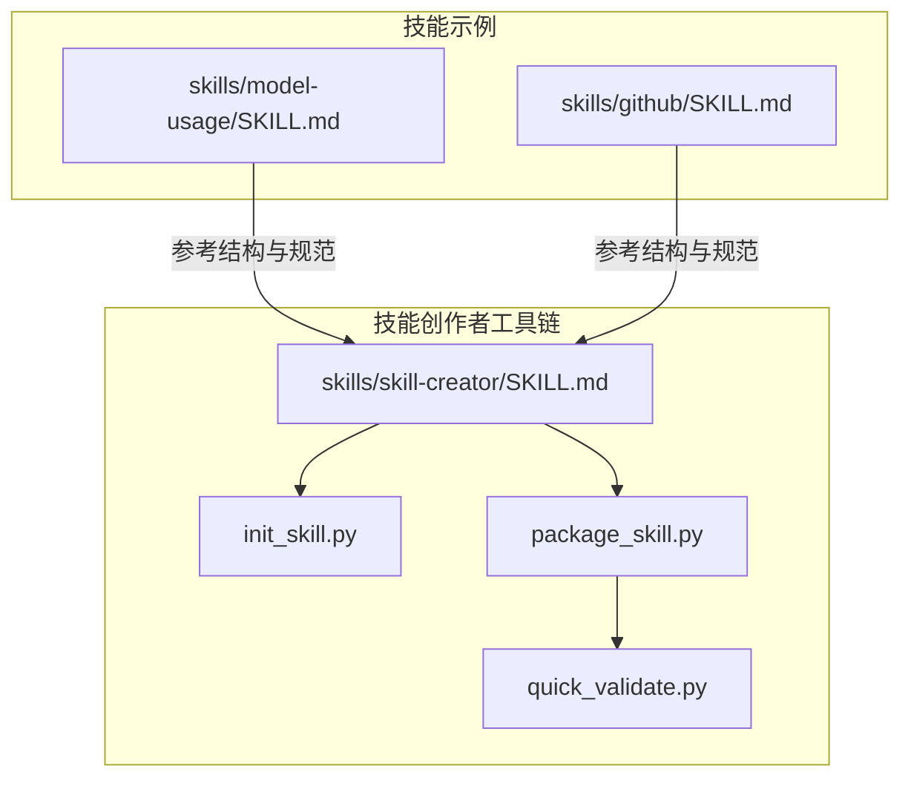
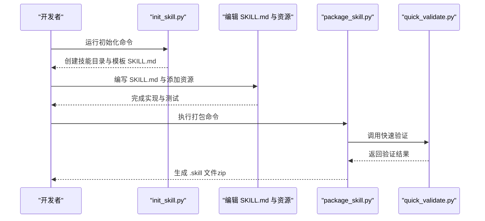
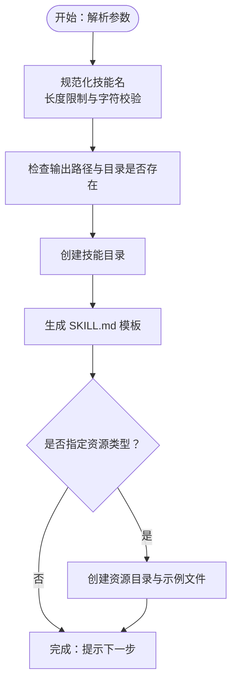
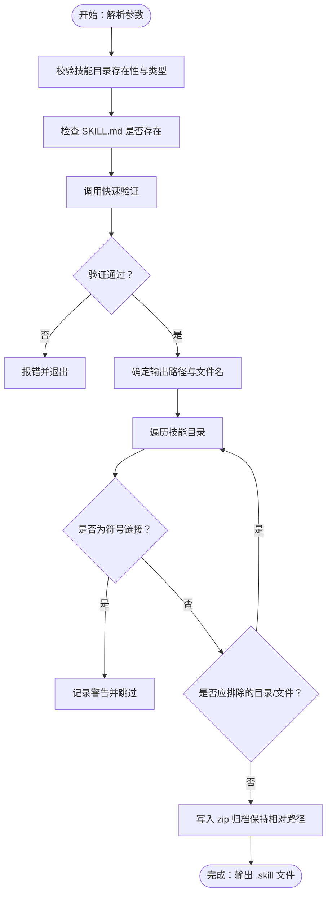
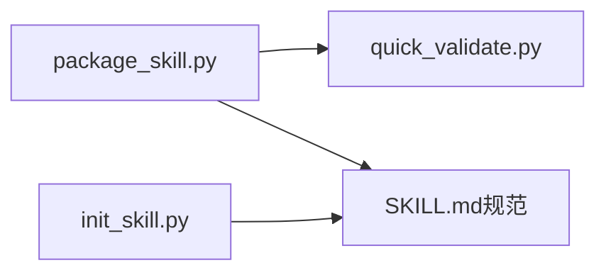

# 技能创建流程

<cite>
**本文引用的文件**   
- [skills/skill-creator/scripts/init_skill.py](file://skills/skill-creator/scripts/init_skill.py)
- [skills/skill-creator/scripts/package_skill.py](file://skills/skill-creator/scripts/package_skill.py)
- [skills/skill-creator/scripts/quick_validate.py](file://skills/skill-creator/scripts/quick_validate.py)
- [skills/skill-creator/SKILL.md](file://skills/skill-creator/SKILL.md)
- [skills/model-usage/SKILL.md](file://skills/model-usage/SKILL.md)
- [skills/github/SKILL.md](file://skills/github/SKILL.md)
- [skills/skill-creator/scripts/test_package_skill.py](file://skills/skill-creator/scripts/test_package_skill.py)
</cite>

## 目录

1. [引言](#引言)
2. [项目结构](#项目结构)
3. [核心组件](#核心组件)
4. [架构总览](#架构总览)
5. [详细组件分析](#详细组件分析)
6. [依赖分析](#依赖分析)
7. [性能考虑](#性能考虑)
8. [故障排查指南](#故障排查指南)
9. [结论](#结论)
10. [附录](#附录)

## 引言

本文件系统性阐述 OpenClaw 技能（AgentSkill）的完整生命周期：从需求理解、规划内容、初始化技能、编辑实现、打包发布到迭代优化六个阶段。重点围绕两条自动化脚本展开：init_skill.py 的使用与参数配置、资源选择与示例生成；以及 package_skill.py 的打包流程、验证规则与输出规范。同时提供可复用的工作流示例与最佳实践建议，帮助开发者高效、安全地交付高质量技能。

## 项目结构

技能创建流程主要由“技能创作者”技能与其配套脚本构成，位于 skills/skill-creator 目录下，包含初始化脚本、打包脚本与快速验证脚本。实际技能示例可在 skills/ 目录中找到，如 model-usage、github 等，它们展示了规范化的 SKILL.md 结构与资源组织方式。

图表来源

- [skills/skill-creator/SKILL.md:1-373](file://skills/skill-creator/SKILL.md#L1-L373)
- [skills/skill-creator/scripts/init_skill.py:1-379](file://skills/skill-creator/scripts/init_skill.py#L1-L379)
- [skills/skill-creator/scripts/package_skill.py:1-140](file://skills/skill-creator/scripts/package_skill.py#L1-L140)
- [skills/skill-creator/scripts/quick_validate.py:1-160](file://skills/skill-creator/scripts/quick_validate.py#L1-L160)
- [skills/model-usage/SKILL.md:1-70](file://skills/model-usage/SKILL.md#L1-L70)
- [skills/github/SKILL.md:1-164](file://skills/github/SKILL.md#L1-L164)

章节来源

- [skills/skill-creator/SKILL.md:201-212](file://skills/skill-creator/SKILL.md#L201-L212)
- [skills/skill-creator/scripts/init_skill.py:1-379](file://skills/skill-creator/scripts/init_skill.py#L1-L379)
- [skills/skill-creator/scripts/package_skill.py:1-140](file://skills/skill-creator/scripts/package_skill.py#L1-L140)
- [skills/skill-creator/scripts/quick_validate.py:1-160](file://skills/skill-creator/scripts/quick_validate.py#L1-L160)

## 核心组件

- 初始化脚本 init_skill.py：用于按模板创建新技能目录，生成 SKILL.md 并可选创建 scripts/references/assets 资源目录及示例文件。
- 打包脚本 package_skill.py：在打包前自动调用快速验证，确保技能符合规范；打包为 .skill 文件（zip），并严格拒绝符号链接等不安全元素。
- 快速验证 quick_validate.py：对 SKILL.md 的 YAML 前言进行最小化校验，覆盖必填字段、命名规范、长度限制与字符约束等。
- 技能创作者 SKILL.md：提供技能设计原则、命名规范、目录结构与生命周期步骤的权威说明，是 init_skill.py 与 package_skill.py 的行为依据。

章节来源

- [skills/skill-creator/scripts/init_skill.py:255-317](file://skills/skill-creator/scripts/init_skill.py#L255-L317)
- [skills/skill-creator/scripts/package_skill.py:28-112](file://skills/skill-creator/scripts/package_skill.py#L28-L112)
- [skills/skill-creator/scripts/quick_validate.py:67-149](file://skills/skill-creator/scripts/quick_validate.py#L67-L149)
- [skills/skill-creator/SKILL.md:214-218](file://skills/skill-creator/SKILL.md#L214-L218)

## 架构总览

技能创建流程以“先模板后验证再打包”的顺序执行，形成闭环的质量控制。初始化阶段产出标准化的 SKILL.md 与可选资源；编辑阶段完善内容与脚本；打包阶段通过验证与安全检查生成 .skill 文件。

图表来源

- [skills/skill-creator/scripts/init_skill.py:320-379](file://skills/skill-creator/scripts/init_skill.py#L320-L379)
- [skills/skill-creator/scripts/package_skill.py:56-63](file://skills/skill-creator/scripts/package_skill.py#L56-L63)
- [skills/skill-creator/scripts/quick_validate.py:67-149](file://skills/skill-creator/scripts/quick_validate.py#L67-L149)

## 详细组件分析

### 初始化技能：init_skill.py

- 功能概述
  - 创建技能目录，生成标准 SKILL.md 模板（含 YAML 前言与 TODO 指引）。
  - 可选创建 scripts/references/assets 子目录，并在启用示例时写入示例文件。
- 关键参数
  - 必填：技能名（将被归一化为小写连字符形式）。
  - --path：目标输出路径（通常为 skills/public 或 skills/private）。
  - --resources：逗号分隔的资源类型集合，支持 scripts、references、assets。
  - --examples：仅在指定 --resources 时生效，用于生成示例文件。
- 行为细节
  - 名称规范化与长度限制（最大 64 字符）。
  - 目录存在性检查与异常处理。
  - 示例文件权限设置（如脚本可执行位）。
- 使用建议
  - 初次创建技能时优先使用 --examples 生成示例，便于快速替换为真实逻辑。
  - 仅创建实际需要的资源目录，避免冗余。

图表来源

- [skills/skill-creator/scripts/init_skill.py:194-224](file://skills/skill-creator/scripts/init_skill.py#L194-L224)
- [skills/skill-creator/scripts/init_skill.py:255-317](file://skills/skill-creator/scripts/init_skill.py#L255-L317)

章节来源

- [skills/skill-creator/scripts/init_skill.py:1-379](file://skills/skill-creator/scripts/init_skill.py#L1-L379)
- [skills/skill-creator/SKILL.md:263-293](file://skills/skill-creator/SKILL.md#L263-L293)

### 打包技能：package_skill.py

- 功能概述
  - 在打包前调用快速验证，确保 SKILL.md 前言格式正确、名称与描述满足规范。
  - 将技能目录打包为 .skill 文件（zip），保持相对目录结构，输出文件名为 {skill-name}.skill。
- 验证规则（来自快速验证）
  - SKILL.md 存在且可读。
  - YAML 前言必须包含 name 与 description。
  - name 仅允许小写字母、数字与连字符，长度不超过 64，不能以连字符开头或结尾，不得包含连续连字符。
  - description 为字符串，长度不超过 1024，不得包含 < 或 >。
- 安全与输出规范
  - 拒绝打包符号链接；若检测到符号链接则跳过并报错。
  - 排除版本控制与构建缓存目录（如 .git、**pycache** 等）。
  - 输出文件位于指定输出目录（默认当前目录），文件名与技能名一致。
- 使用建议
  - 先本地运行快速验证，修复问题后再打包。
  - 打包前清理无关文件，确保 .skill 文件体积可控。

图表来源

- [skills/skill-creator/scripts/package_skill.py:28-112](file://skills/skill-creator/scripts/package_skill.py#L28-L112)
- [skills/skill-creator/scripts/quick_validate.py:67-149](file://skills/skill-creator/scripts/quick_validate.py#L67-L149)

章节来源

- [skills/skill-creator/scripts/package_skill.py:1-140](file://skills/skill-creator/scripts/package_skill.py#L1-L140)
- [skills/skill-creator/scripts/quick_validate.py:1-160](file://skills/skill-creator/scripts/quick_validate.py#L1-L160)
- [skills/skill-creator/SKILL.md:335-362](file://skills/skill-creator/SKILL.md#L335-L362)

### 快速验证：quick_validate.py

- 校验范围
  - 提取并解析 YAML 前言，支持 PyYAML 或简单回退解析器。
  - 校验允许的属性集合（name、description、license、allowed-tools、metadata）。
  - 校验 name 与 description 的格式、长度与字符集。
- 错误处理
  - 对缺失字段、非法字符、超长文本等情况返回明确错误信息。
- 使用场景
  - 作为 package_skill.py 的前置校验。
  - 单独运行以快速诊断 SKILL.md 规范性问题。

章节来源

- [skills/skill-creator/scripts/quick_validate.py:67-149](file://skills/skill-creator/scripts/quick_validate.py#L67-L149)

### 技能创作者：SKILL.md

- 设计原则
  - 精简优先、渐进披露（metadata 始终在上下文，正文按需加载，资源按需读取）。
  - 明确触发条件与使用场景，frontmatter 中写明“何时使用”。
- 目录结构
  - 必须包含 SKILL.md；可选 scripts/、references/、assets/。
- 生命周期步骤
  - 理解需求、规划内容、初始化、编辑实现、打包发布、迭代优化。

章节来源

- [skills/skill-creator/SKILL.md:24-126](file://skills/skill-creator/SKILL.md#L24-L126)
- [skills/skill-creator/SKILL.md:201-212](file://skills/skill-creator/SKILL.md#L201-L212)

### 实战示例与最佳实践

- 示例技能参考
  - model-usage：展示如何在 SKILL.md 中引用脚本与参考文件，清晰说明输入输出与使用方式。
  - github：展示如何在 frontmatter 中嵌入平台元数据与安装指引，正文按“何时使用/何时不使用”“常见命令”“模板”等模块化组织。
- 最佳实践
  - 始终在 SKILL.md 的 frontmatter 中完整描述“做什么”和“何时使用”，避免在正文重复。
  - 将长篇参考材料放入 references/，正文仅保留导航与入口。
  - scripts/ 中的脚本应具备可执行性与自检能力，便于独立测试。
  - 资源 assets/ 仅存放最终产物所需的模板与素材，避免将可从外部获取的内容纳入技能包。

章节来源

- [skills/model-usage/SKILL.md:1-70](file://skills/model-usage/SKILL.md#L1-L70)
- [skills/github/SKILL.md:1-164](file://skills/github/SKILL.md#L1-L164)
- [skills/skill-creator/SKILL.md:315-330](file://skills/skill-creator/SKILL.md#L315-L330)

## 依赖分析

- 组件耦合
  - package_skill.py 依赖 quick_validate.py 的验证函数。
  - init_skill.py 与 package_skill.py 均面向 SKILL.md 的规范，彼此通过 SKILL.md 的约定协同。
- 外部依赖
  - 快速验证在未安装 PyYAML 时采用简单回退解析器，保证基础可用性。
- 安全边界
  - 打包阶段严格拒绝符号链接，防止路径逃逸与恶意内容注入。

图表来源

- [skills/skill-creator/scripts/package_skill.py:17-17](file://skills/skill-creator/scripts/package_skill.py#L17-L17)
- [skills/skill-creator/scripts/quick_validate.py:11-14](file://skills/skill-creator/scripts/quick_validate.py#L11-L14)
- [skills/skill-creator/scripts/init_skill.py:284-294](file://skills/skill-creator/scripts/init_skill.py#L284-L294)

章节来源

- [skills/skill-creator/scripts/package_skill.py:82-99](file://skills/skill-creator/scripts/package_skill.py#L82-L99)
- [skills/skill-creator/scripts/quick_validate.py:11-14](file://skills/skill-creator/scripts/quick_validate.py#L11-L14)

## 性能考虑

- 上下文窗口管理
  - 通过渐进披露减少 SKILL.md 正文字数，避免不必要的上下文占用。
- 资源按需加载
  - references/ 与 assets/ 在需要时才被加载，降低整体开销。
- 打包体积控制
  - 排除构建缓存与版本控制目录，仅打包必要文件，缩短传输与部署时间。

## 故障排查指南

- 常见错误与定位
  - SKILL.md 不存在：确认技能根目录包含该文件。
  - YAML 前言格式错误：检查三段式分隔符与键值对格式。
  - name 不合规：确保仅含小写字母、数字与连字符，长度不超过 64。
  - description 超长或包含非法字符：调整长度与内容。
  - 包含符号链接：删除或修正为普通文件/目录。
- 测试与回归
  - 使用测试用例验证安全行为（如符号链接拒绝、输出文件结构正确）。

章节来源

- [skills/skill-creator/scripts/quick_validate.py:71-149](file://skills/skill-creator/scripts/quick_validate.py#L71-L149)
- [skills/skill-creator/scripts/package_skill.py:82-104](file://skills/skill-creator/scripts/package_skill.py#L82-L104)
- [skills/skill-creator/scripts/test_package_skill.py:147-156](file://skills/skill-creator/scripts/test_package_skill.py#L147-L156)

## 结论

通过 init_skill.py 与 package_skill.py 的配合，结合 quick_validate.py 的最小化验证与 SKILL.md 的设计规范，OpenClaw 技能创建形成了“模板化初始化—规范化编辑—自动化验证—安全打包—持续迭代”的闭环流程。遵循本文提供的参数配置、工具使用方法与最佳实践，可显著提升技能开发效率与质量，确保技能在不同环境中的可移植性与安全性。

## 附录

- 工作流示例（步骤化）
  1. 理解需求：收集具体用户场景与触发词，明确技能边界。
  2. 规划内容：识别可复用的脚本、参考与资产，决定资源目录与示例。
  3. 初始化技能：使用 init_skill.py 生成模板与资源目录。
  4. 编辑实现：完善 SKILL.md 与资源，编写并测试脚本。
  5. 打包发布：使用 package_skill.py 自动验证并生成 .skill 文件。
  6. 迭代优化：基于真实使用反馈持续改进。

章节来源

- [skills/skill-creator/SKILL.md:201-212](file://skills/skill-creator/SKILL.md#L201-L212)
- [skills/skill-creator/SKILL.md:335-362](file://skills/skill-creator/SKILL.md#L335-L362)
