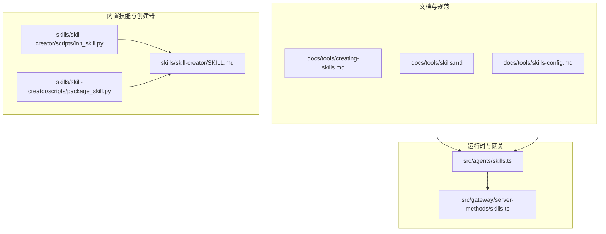
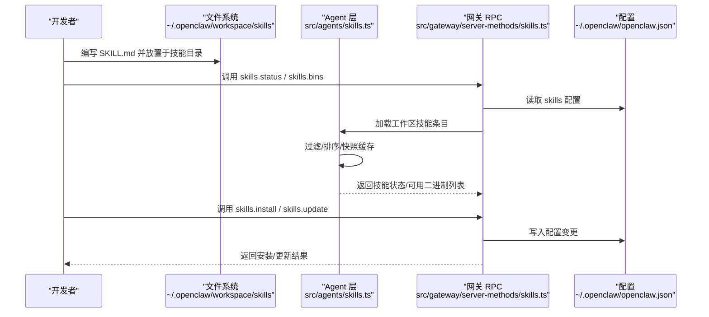
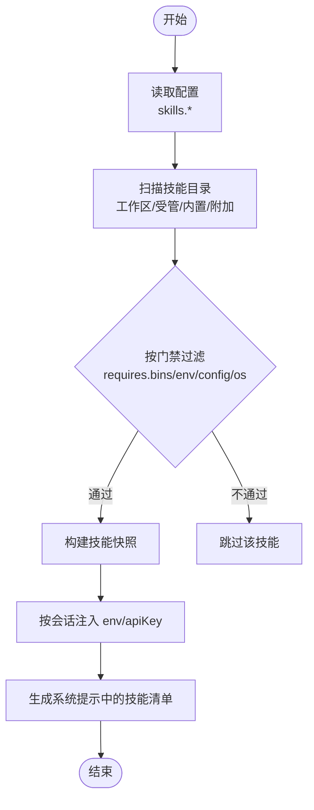
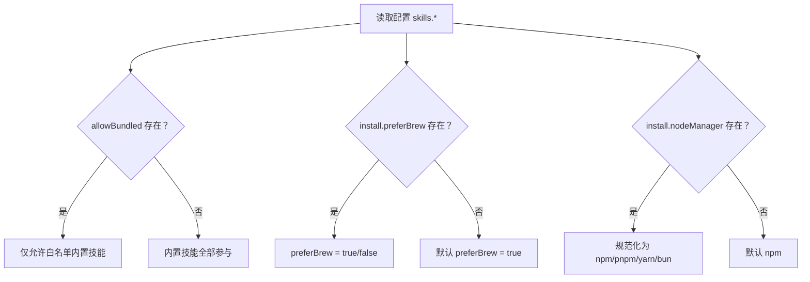
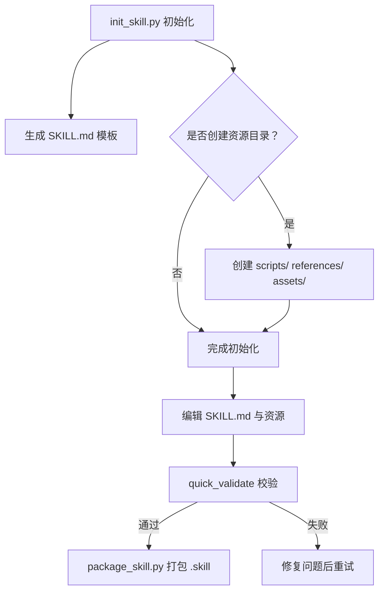
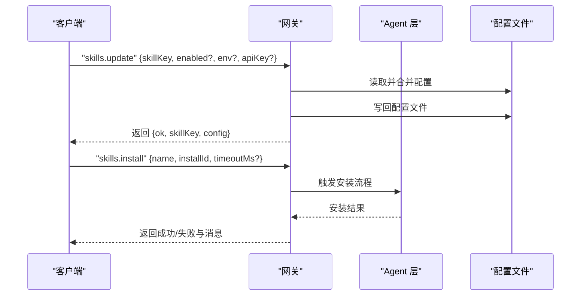
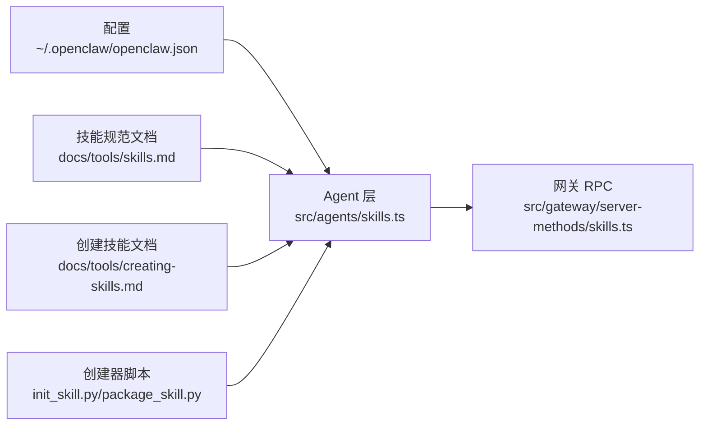

# 技能开发

<cite>
**本文引用的文件**
- [docs/tools/creating-skills.md](file://docs/tools/creating-skills.md)
- [docs/tools/skills.md](file://docs/tools/skills.md)
- [docs/tools/skills-config.md](file://docs/tools/skills-config.md)
- [skills/skill-creator/SKILL.md](file://skills/skill-creator/SKILL.md)
- [skills/skill-creator/scripts/init_skill.py](file://skills/skill-creator/scripts/init_skill.py)
- [skills/skill-creator/scripts/package_skill.py](file://skills/skill-creator/scripts/package_skill.py)
- [src/agents/skills.ts](file://src/agents/skills.ts)
- [src/gateway/server-methods/skills.ts](file://src/gateway/server-methods/skills.ts)
</cite>

## 目录

1. [简介](#简介)
2. [项目结构](#项目结构)
3. [核心组件](#核心组件)
4. [架构总览](#架构总览)
5. [详细组件分析](#详细组件分析)
6. [依赖关系分析](#依赖关系分析)
7. [性能考量](#性能考量)
8. [故障排查指南](#故障排查指南)
9. [结论](#结论)
10. [附录](#附录)

## 简介

本文件面向希望在 OpenClaw 中开发“技能（Skill）”的开发者，系统性地介绍技能的结构设计、编程接口与开发工具链，覆盖从创建向导、模板选择与自定义，到最佳实践、调试与测试、以及发布流程的全流程。OpenClaw 使用“技能”作为扩展助手能力的主要方式，技能以目录形式存在，核心为 SKILL.md 文件（包含 YAML 前言元数据与 Markdown 指令），可选包含脚本与资源。

## 项目结构

OpenClaw 的技能体系由以下部分组成：

- 文档与规范：技能基础概念、加载顺序、安全与配置等
- 内置技能与创建器：提供模板与打包工具
- 运行时与网关：负责技能发现、过滤、环境注入与安装更新

**图表来源**

- [docs/tools/skills.md:1-303](file://docs/tools/skills.md#L1-L303)
- [docs/tools/skills-config.md:1-78](file://docs/tools/skills-config.md#L1-L78)
- [skills/skill-creator/SKILL.md:1-373](file://skills/skill-creator/SKILL.md#L1-L373)
- [skills/skill-creator/scripts/init_skill.py:1-379](file://skills/skill-creator/scripts/init_skill.py#L1-L379)
- [skills/skill-creator/scripts/package_skill.py:1-140](file://skills/skill-creator/scripts/package_skill.py#L1-L140)
- [src/agents/skills.ts:1-47](file://src/agents/skills.ts#L1-L47)
- [src/gateway/server-methods/skills.ts:1-205](file://src/gateway/server-methods/skills.ts#L1-L205)

**章节来源**

- [docs/tools/creating-skills.md:1-59](file://docs/tools/creating-skills.md#L1-L59)
- [docs/tools/skills.md:1-303](file://docs/tools/skills.md#L1-L303)
- [docs/tools/skills-config.md:1-78](file://docs/tools/skills-config.md#L1-L78)
- [skills/skill-creator/SKILL.md:1-373](file://skills/skill-creator/SKILL.md#L1-L373)
- [skills/skill-creator/scripts/init_skill.py:1-379](file://skills/skill-creator/scripts/init_skill.py#L1-L379)
- [skills/skill-creator/scripts/package_skill.py:1-140](file://skills/skill-creator/scripts/package_skill.py#L1-L140)
- [src/agents/skills.ts:1-47](file://src/agents/skills.ts#L1-L47)
- [src/gateway/server-methods/skills.ts:1-205](file://src/gateway/server-methods/skills.ts#L1-L205)

## 核心组件

- 技能规范与加载：技能目录结构、元数据格式、加载优先级与过滤规则、环境注入、远程节点适配、热刷新与令牌开销
- 配置与安装：全局配置项、按技能覆盖、安装偏好与工具链选择
- 创建器与打包：初始化模板、资源组织建议、快速校验与打包为 .skill 文件
- 网关接口：查询技能状态、收集二进制依赖、安装与更新技能

**章节来源**

- [docs/tools/skills.md:11-303](file://docs/tools/skills.md#L11-L303)
- [docs/tools/skills-config.md:13-78](file://docs/tools/skills-config.md#L13-L78)
- [skills/skill-creator/SKILL.md:46-210](file://skills/skill-creator/SKILL.md#L46-L210)
- [src/gateway/server-methods/skills.ts:57-205](file://src/gateway/server-methods/skills.ts#L57-L205)

## 架构总览

下图展示从用户编写 SKILL.md 到运行时加载与执行的关键路径，以及网关提供的技能管理 RPC。

**图表来源**

- [src/gateway/server-methods/skills.ts:57-205](file://src/gateway/server-methods/skills.ts#L57-L205)
- [src/agents/skills.ts:26-34](file://src/agents/skills.ts#L26-L34)
- [docs/tools/skills.md:189-247](file://docs/tools/skills.md#L189-L247)

## 详细组件分析

### 组件一：技能规范与加载（Agent 层）

- 目录与元数据：每个技能为独立目录，包含 SKILL.md（YAML 前言 + 指令体），可选 scripts/、references/、assets/
- 加载顺序与优先级：工作区技能 > 受管本地技能 > 内置技能；支持额外扫描目录与热刷新
- 过滤与门禁：基于 metadata.openclaw 的 requires（二进制、环境变量、配置）、平台、安装器描述
- 环境注入：按会话注入 env/apiKey，结束后恢复
- 性能与令牌：会话快照复用，提示词中注入技能清单，有确定性字符开销估算

**图表来源**

- [docs/tools/skills.md:13-187](file://docs/tools/skills.md#L13-L187)
- [docs/tools/skills.md:189-247](file://docs/tools/skills.md#L189-L247)

**章节来源**

- [docs/tools/skills.md:11-303](file://docs/tools/skills.md#L11-L303)

### 组件二：配置与安装偏好（Agent 层）

- 全局配置：允许内置技能白名单、额外扫描目录、是否监听变更、安装偏好（brew 优先、Node 包管理器）
- 按技能覆盖：启用/禁用、注入 env、设置 apiKey（明文或密钥引用对象）
- 安装偏好解析：根据配置返回 preferBrew 与 nodeManager

**图表来源**

- [docs/tools/skills-config.md:13-78](file://docs/tools/skills-config.md#L13-L78)
- [src/agents/skills.ts:36-46](file://src/agents/skills.ts#L36-L46)

**章节来源**

- [docs/tools/skills-config.md:13-78](file://docs/tools/skills-config.md#L13-L78)
- [src/agents/skills.ts:36-46](file://src/agents/skills.ts#L36-L46)

### 组件三：技能创建向导与模板（Skill Creator）

- 初始化模板：提供标准化的 SKILL.md 结构、资源目录（scripts/references/assets）与示例文件
- 资源组织原则：脚本用于可重复且需要确定性的任务；参考文档用于按需加载的详尽资料；资产用于输出使用的模板/图标/字体等
- 打包为 .skill 文件：自动校验、排除符号链接与敏感目录、压缩为 zip 归档

**图表来源**

- [skills/skill-creator/SKILL.md:201-373](file://skills/skill-creator/SKILL.md#L201-L373)
- [skills/skill-creator/scripts/init_skill.py:255-318](file://skills/skill-creator/scripts/init_skill.py#L255-L318)
- [skills/skill-creator/scripts/package_skill.py:28-112](file://skills/skill-creator/scripts/package_skill.py#L28-L112)

**章节来源**

- [skills/skill-creator/SKILL.md:46-210](file://skills/skill-creator/SKILL.md#L46-L210)
- [skills/skill-creator/scripts/init_skill.py:1-379](file://skills/skill-creator/scripts/init_skill.py#L1-L379)
- [skills/skill-creator/scripts/package_skill.py:1-140](file://skills/skill-creator/scripts/package_skill.py#L1-L140)

### 组件四：网关 RPC 接口（skills.\*）

- skills.status：返回工作区技能状态（含远程节点适配）
- skills.bins：汇总所有工作区技能所需的二进制名称
- skills.install：安装指定技能（支持超时）
- skills.update：更新技能配置（启用/禁用、env、apiKey）

**图表来源**

- [src/gateway/server-methods/skills.ts:57-205](file://src/gateway/server-methods/skills.ts#L57-L205)

**章节来源**

- [src/gateway/server-methods/skills.ts:57-205](file://src/gateway/server-methods/skills.ts#L57-L205)

## 依赖关系分析

- Agent 层依赖配置与环境，负责技能条目的加载、过滤与快照；同时暴露安装偏好解析函数
- 网关层提供 RPC，调用 Agent 层能力并持久化配置
- 创建器脚本与内置技能文档共同构成“模板 + 最佳实践”的开发体验

**图表来源**

- [src/agents/skills.ts:1-47](file://src/agents/skills.ts#L1-L47)
- [src/gateway/server-methods/skills.ts:1-205](file://src/gateway/server-methods/skills.ts#L1-L205)
- [docs/tools/skills.md:1-303](file://docs/tools/skills.md#L1-L303)
- [docs/tools/creating-skills.md:1-59](file://docs/tools/creating-skills.md#L1-L59)
- [skills/skill-creator/scripts/init_skill.py:1-379](file://skills/skill-creator/scripts/init_skill.py#L1-L379)
- [skills/skill-creator/scripts/package_skill.py:1-140](file://skills/skill-creator/scripts/package_skill.py#L1-L140)

**章节来源**

- [src/agents/skills.ts:1-47](file://src/agents/skills.ts#L1-L47)
- [src/gateway/server-methods/skills.ts:1-205](file://src/gateway/server-methods/skills.ts#L1-L205)
- [docs/tools/skills.md:1-303](file://docs/tools/skills.md#L1-L303)
- [docs/tools/creating-skills.md:1-59](file://docs/tools/creating-skills.md#L1-L59)
- [skills/skill-creator/scripts/init_skill.py:1-379](file://skills/skill-creator/scripts/init_skill.py#L1-L379)
- [skills/skill-creator/scripts/package_skill.py:1-140](file://skills/skill-creator/scripts/package_skill.py#L1-L140)

## 性能考量

- 技能列表注入提示词的成本是确定性的：基础开销与每技能的字段长度相关，注意 XML 转义带来的长度膨胀
- 会话快照：首次构建后复用，避免重复扫描与过滤
- 热刷新：开启监听并在变更时更新快照，减少重启成本
- 远程节点：在满足条件时可将 macOS 技能视为可用，但需考虑网络与连通性

**章节来源**

- [docs/tools/skills.md:269-286](file://docs/tools/skills.md#L269-L286)
- [docs/tools/skills.md:242-247](file://docs/tools/skills.md#L242-L247)
- [docs/tools/skills.md:248-253](file://docs/tools/skills.md#L248-L253)

## 故障排查指南

- 安全与信任：第三方技能应谨慎启用，优先沙箱化运行；注意 secrets 注入与日志脱敏
- 二进制与环境：确保 PATH 中存在所需二进制，或在沙箱内通过 setupCommand 安装
- 配置覆盖：检查 entries 下的 enabled/env/apiKey 是否正确；确认键名与 metadata.openclaw.skillKey 的映射
- 网关接口：使用 skills.status 与 skills.bins 快速定位问题；安装失败查看返回消息

**章节来源**

- [docs/tools/skills.md:69-77](file://docs/tools/skills.md#L69-L77)
- [docs/tools/skills.md:138-147](file://docs/tools/skills.md#L138-L147)
- [docs/tools/skills-config.md:54-78](file://docs/tools/skills-config.md#L54-L78)
- [src/gateway/server-methods/skills.ts:57-113](file://src/gateway/server-methods/skills.ts#L57-L113)

## 结论

OpenClaw 的技能体系以“目录 + SKILL.md + 可选资源”为核心，结合 Agent 层的加载与过滤、配置层的覆盖与安装偏好、以及网关 RPC 的安装与更新能力，形成完整的开发、测试与发布闭环。借助内置创建器与文档，开发者可以快速上手并遵循最佳实践，确保安全性、可维护性与性能。

## 附录

### 实战示例：从零到一构建一个技能

- 步骤 1：使用创建器初始化模板
  - 参考：[skills/skill-creator/scripts/init_skill.py:255-318](file://skills/skill-creator/scripts/init_skill.py#L255-L318)
- 步骤 2：编辑 SKILL.md 与资源
  - 参考：[skills/skill-creator/SKILL.md:294-315](file://skills/skill-creator/SKILL.md#L294-L315)
- 步骤 3：本地校验与打包
  - 参考：[skills/skill-creator/scripts/package_skill.py:28-112](file://skills/skill-creator/scripts/package_skill.py#L28-L112)
- 步骤 4：在工作区加载与测试
  - 参考：[docs/tools/creating-skills.md:17-48](file://docs/tools/creating-skills.md#L17-L48)
- 步骤 5：通过网关安装/更新
  - 参考：[src/gateway/server-methods/skills.ts:114-203](file://src/gateway/server-methods/skills.ts#L114-L203)

### 开发最佳实践摘要

- 结构设计：遵循“元数据 + 指令体 + 可选资源”的三层组织；长文档拆分至 references
- 工具与脚本：scripts 用于可重复与确定性任务；assets 仅用于最终输出使用
- 安全与隐私：避免在提示词中泄露 secrets；优先沙箱化运行
- 性能与成本：控制 SKILL.md 长度与引用数量；关注令牌开销

**章节来源**

- [skills/skill-creator/SKILL.md:46-210](file://skills/skill-creator/SKILL.md#L46-L210)
- [docs/tools/creating-skills.md:50-55](file://docs/tools/creating-skills.md#L50-L55)
- [docs/tools/skills.md:69-77](file://docs/tools/skills.md#L69-L77)
