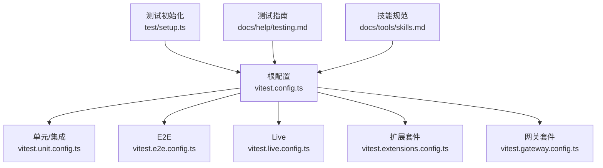
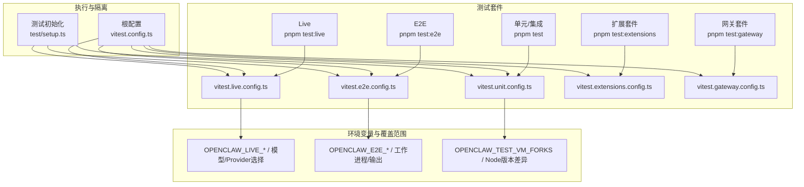
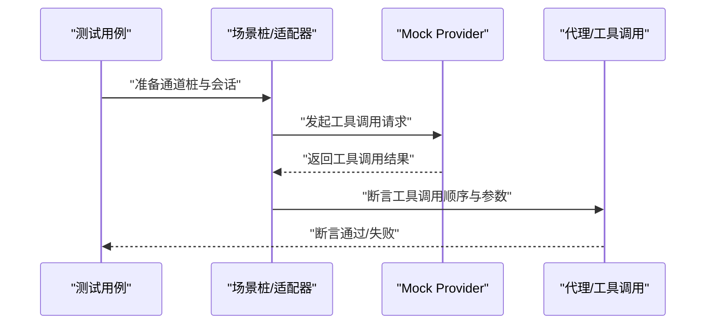
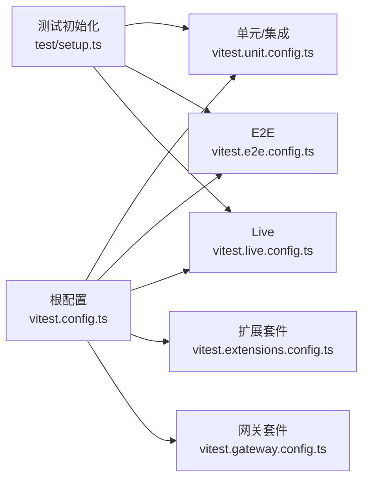

# 技能测试与调试

<cite>
**本文引用的文件**
- [package.json](file://package.json)
- [vitest.config.ts](file://vitest.config.ts)
- [vitest.unit.config.ts](file://vitest.unit.config.ts)
- [vitest.e2e.config.ts](file://vitest.e2e.config.ts)
- [vitest.extensions.config.ts](file://vitest.extensions.config.ts)
- [vitest.gateway.config.ts](file://vitest.gateway.config.ts)
- [vitest.live.config.ts](file://vitest.live.config.ts)
- [test/setup.ts](file://test/setup.ts)
- [docs/help/testing.md](file://docs/help/testing.md)
- [docs/tools/skills.md](file://docs/tools/skills.md)
- [src/logging/logger.ts](file://src/logging/logger.ts)
- [src/logging/subsystem.ts](file://src/logging/subsystem.ts)
- [src/logger.ts](file://src/logger.ts)
- [src/test-utils/vitest-mock-fn.ts](file://src/test-utils/vitest-mock-fn.ts)
- [src/cron/service.runs-one-shot-main-job-disables-it.test.ts](file://src/cron/service.runs-one-shot-main-job-disables-it.test.ts)
- [src/agents/openai-ws-stream.test.ts](file://src/agents/openai-ws-stream.test.ts)
- [src/agents/openai-ws-connection.test.ts](file://src/agents/openai-ws-connection.test.ts)
- [extensions/acpx/src/test-utils/runtime-fixtures.ts](file://extensions/acpx/src/test-utils/runtime-fixtures.ts)
</cite>

## 目录

1. [简介](#简介)
2. [项目结构](#项目结构)
3. [核心组件](#核心组件)
4. [架构总览](#架构总览)
5. [详细组件分析](#详细组件分析)
6. [依赖分析](#依赖分析)
7. [性能考虑](#性能考虑)
8. [故障排查指南](#故障排查指南)
9. [结论](#结论)
10. [附录](#附录)

## 简介

本文件面向OpenClaw技能测试与调试，系统化阐述单元测试、集成测试、端到端测试与“真实环境”（Live）测试的实施策略；提供日志分析、错误排查与性能监控方法；总结技能测试用例设计模式与自动化流程；覆盖跨平台兼容性与回归测试；并给出常见问题的诊断、解决与预防建议，以及测试脚本与调试工具配置指引。

## 项目结构

OpenClaw采用Vitest作为测试框架，按“单元/集成、E2E、Live”三层测试套件组织，并辅以Docker运行器进行Linux环境验证。测试配置集中在根目录的Vitest配置文件中，通过作用域化配置分别覆盖核心模块、扩展、网关等子集。

**图表来源**

- [vitest.config.ts:1-203](file://vitest.config.ts#L1-L203)
- [vitest.unit.config.ts:1-31](file://vitest.unit.config.ts#L1-L31)
- [vitest.e2e.config.ts:1-33](file://vitest.e2e.config.ts#L1-L33)
- [vitest.live.config.ts:1-17](file://vitest.live.config.ts#L1-L17)
- [vitest.extensions.config.ts:1-4](file://vitest.extensions.config.ts#L1-L4)
- [vitest.gateway.config.ts:1-4](file://vitest.gateway.config.ts#L1-L4)
- [test/setup.ts:1-201](file://test/setup.ts#L1-L201)
- [docs/help/testing.md:1-415](file://docs/help/testing.md#L1-L415)
- [docs/tools/skills.md:1-303](file://docs/tools/skills.md#L1-L303)

**章节来源**

- [vitest.config.ts:1-203](file://vitest.config.ts#L1-L203)
- [vitest.unit.config.ts:1-31](file://vitest.unit.config.ts#L1-L31)
- [vitest.e2e.config.ts:1-33](file://vitest.e2e.config.ts#L1-L33)
- [vitest.live.config.ts:1-17](file://vitest.live.config.ts#L1-L17)
- [vitest.extensions.config.ts:1-4](file://vitest.extensions.config.ts#L1-L4)
- [vitest.gateway.config.ts:1-4](file://vitest.gateway.config.ts#L1-L4)
- [test/setup.ts:1-201](file://test/setup.ts#L1-L201)
- [docs/help/testing.md:1-415](file://docs/help/testing.md#L1-L415)
- [docs/tools/skills.md:1-303](file://docs/tools/skills.md#L1-L303)

## 核心组件

- 测试命令与套件
  - 单元/集成：默认测试入口，覆盖纯单元、进程内集成与已知缺陷回归。
  - E2E：网关多实例端到端行为，侧重WS/HTTP表面、节点配对与网络交互。
  - Live：真实Provider/模型，验证“今日可用性”，含直接模型层与网关+代理层冒烟。
- 配置与隔离
  - 根Vitest配置统一超时、钩子超时、环境/全局解桩策略、工作进程数与覆盖率阈值。
  - 作用域化配置按模块拆分，确保测试隔离与可维护性。
  - 测试初始化设置HOME/状态隔离、插件注册表、通道适配器桩等。
- 日志与可观测性
  - 子系统日志器支持控制台与文件输出，具备探测类消息抑制策略，便于调试与回归。
  - 运行时日志封装统一入口，支持按子系统路由输出。

**章节来源**

- [package.json:306-322](file://package.json#L306-L322)
- [vitest.config.ts:71-201](file://vitest.config.ts#L71-L201)
- [vitest.unit.config.ts:6-30](file://vitest.unit.config.ts#L6-L30)
- [vitest.e2e.config.ts:20-32](file://vitest.e2e.config.ts#L20-L32)
- [vitest.live.config.ts:8-16](file://vitest.live.config.ts#L8-L16)
- [test/setup.ts:1-201](file://test/setup.ts#L1-L201)
- [src/logging/subsystem.ts:308-347](file://src/logging/subsystem.ts#L308-L347)
- [src/logger.ts:1-85](file://src/logger.ts#L1-L85)

## 架构总览

下图展示测试套件与执行路径、环境变量与覆盖范围的关系：

**图表来源**

- [package.json:306-322](file://package.json#L306-L322)
- [vitest.config.ts:1-203](file://vitest.config.ts#L1-L203)
- [vitest.unit.config.ts:1-31](file://vitest.unit.config.ts#L1-L31)
- [vitest.e2e.config.ts:1-33](file://vitest.e2e.config.ts#L1-L33)
- [vitest.live.config.ts:1-17](file://vitest.live.config.ts#L1-L17)
- [test/setup.ts:1-201](file://test/setup.ts#L1-L201)

## 详细组件分析

### 单元/集成测试（默认套件）

- 覆盖面
  - 纯单元、进程内集成（网关鉴权/路由/工具/解析/配置）、确定性缺陷回归。
- 执行与隔离
  - 默认使用进程池，支持VM Forks在Node 22/23加速，Node 24+回退至常规fork避免链接错误。
  - 环境变量解桩与全局解桩，避免VM Forks下的跨文件污染。
- 建议
  - 本地开发优先运行此套件；变更较大时追加覆盖率门禁。

**章节来源**

- [docs/help/testing.md:42-58](file://docs/help/testing.md#L42-L58)
- [vitest.config.ts:71-201](file://vitest.config.ts#L71-L201)
- [vitest.unit.config.ts:6-30](file://vitest.unit.config.ts#L6-L30)

### 端到端测试（E2E）

- 覆盖面
  - 多实例网关端到端行为，WebSocket/HTTP接口、节点配对与较重的网络交互。
- 执行与隔离
  - 默认使用VM Forks提升文件启动速度；CI默认2-4工作进程，本地4-8自适应。
  - 默认静默模式减少控制台I/O开销，可通过环境变量开启详细输出。
- 建议
  - 触及网关网络协议/WS配对逻辑时运行；CI启用时配合流水线。

**章节来源**

- [docs/help/testing.md:60-78](file://docs/help/testing.md#L60-L78)
- [vitest.e2e.config.ts:20-32](file://vitest.e2e.config.ts#L20-L32)

### 实时测试（Live）

- 分层目标
  - 直接模型层：验证Provider/模型在给定密钥下可回答。
  - 网关冒烟层：验证完整网关+代理流水线（会话/历史/工具/沙箱策略等）。
- 能力与探测
  - 工具探测：read探针、exec+read探针；图像探测：生成PNG并期望OCR结果。
  - 支持CLI后端（如Claude Code CLI）与Setup Token（Anthropic）等专项冒烟。
- 环境变量与密钥
  - 通过配置文件与环境回退；支持Profile Store与环境变量；支持逗号/分号格式或多键轮换。
- 建议
  - 优先窄化允许列表；遇到Provider格式变化/限流/鉴权策略变更时保留Live回归。

**章节来源**

- [docs/help/testing.md:80-322](file://docs/help/testing.md#L80-L322)
- [vitest.live.config.ts:8-16](file://vitest.live.config.ts#L8-L16)

### 测试初始化与隔离（test/setup.ts）

- 关键职责
  - 设置Vitest运行环境标志、插件清单缓存、进程监听上限。
  - 以隔离的HOME/状态初始化测试环境，确保每次测试独立。
  - 创建通道插件桩与默认插件注册表，避免跨文件污染。
  - 统一清理：恢复假定时钟、恢复插件注册表。
- 建议
  - 新增测试时复用该初始化；涉及通道/网关/插件生态的测试务必在该上下文中运行。

**章节来源**

- [test/setup.ts:1-201](file://test/setup.ts#L1-L201)

### 日志与可观测性

- 子系统日志器
  - 支持将消息按子系统路由到文件与控制台；具备探测类消息抑制策略，避免噪声。
- 运行时日志封装
  - 统一封装info/warn/error/success/debug，支持子系统前缀自动识别与路由。
- 建议
  - 调试时开启详细日志；对探针/探测类警告进行抑制以聚焦真实问题。

**章节来源**

- [src/logging/subsystem.ts:308-347](file://src/logging/subsystem.ts#L308-L347)
- [src/logger.ts:1-85](file://src/logger.ts#L1-L85)

### 技能测试设计模式与自动化

- 设计模式
  - 确定性优先：优先使用Mock Provider与工具调用顺序断言；必要时引入小型场景运行器。
  - 场景驱动：围绕“决策（是否选用某技能）”“合规（是否读取SKILL.md并遵循步骤）”“工作流契约（多轮工具顺序/历史延续/沙箱边界）”构建用例。
  - 分层回归：先CI安全的模拟层，再可选的Live层。
- 自动化流程
  - 使用根Vitest配置与作用域化配置组织测试；通过命令与环境变量实现窄化与并行。
  - 利用测试初始化与插件桩，保证跨文件稳定性。
- 技能规范参考
  - 技能位置与优先级、加载门控（bin/env/config）、环境注入、会话快照与热更新、远程节点能力等。

**章节来源**

- [docs/help/testing.md:391-401](file://docs/help/testing.md#L391-L401)
- [docs/tools/skills.md:1-303](file://docs/tools/skills.md#L1-L303)

### 复杂逻辑组件（以测试用例为例）

以下序列图展示典型“工具调用+顺序断言”的测试流程，体现Mock与断言策略。

**图表来源**

- [src/agents/openai-ws-stream.test.ts:61-101](file://src/agents/openai-ws-stream.test.ts#L61-L101)
- [src/agents/openai-ws-connection.test.ts:126-150](file://src/agents/openai-ws-connection.test.ts#L126-L150)

**章节来源**

- [src/agents/openai-ws-stream.test.ts:61-101](file://src/agents/openai-ws-stream.test.ts#L61-L101)
- [src/agents/openai-ws-connection.test.ts:126-150](file://src/agents/openai-ws-connection.test.ts#L126-L150)

## 依赖分析

- 套件耦合与内聚
  - 根配置集中定义超时、钩子、工作进程、覆盖率与排除规则，各作用域配置仅做最小差异化覆盖，内聚度高、耦合度低。
- 外部依赖与集成点
  - Node版本差异导致的VM Forks回退策略；Docker运行器用于Linux兼容性验证。
- 循环依赖
  - 未见明显循环依赖迹象；测试初始化在导入任何运行时模块前完成HOME隔离，降低循环风险。

**图表来源**

- [vitest.config.ts:1-203](file://vitest.config.ts#L1-L203)
- [vitest.unit.config.ts:1-31](file://vitest.unit.config.ts#L1-L31)
- [vitest.e2e.config.ts:1-33](file://vitest.e2e.config.ts#L1-L33)
- [vitest.live.config.ts:1-17](file://vitest.live.config.ts#L1-L17)
- [vitest.extensions.config.ts:1-4](file://vitest.extensions.config.ts#L1-L4)
- [vitest.gateway.config.ts:1-4](file://vitest.gateway.config.ts#L1-L4)
- [test/setup.ts:1-201](file://test/setup.ts#L1-L201)

**章节来源**

- [vitest.config.ts:1-203](file://vitest.config.ts#L1-L203)
- [vitest.unit.config.ts:1-31](file://vitest.unit.config.ts#L1-L31)
- [vitest.e2e.config.ts:1-33](file://vitest.e2e.config.ts#L1-L33)
- [vitest.live.config.ts:1-17](file://vitest.live.config.ts#L1-L17)
- [vitest.extensions.config.ts:1-4](file://vitest.extensions.config.ts#L1-L4)
- [vitest.gateway.config.ts:1-4](file://vitest.gateway.config.ts#L1-L4)
- [test/setup.ts:1-201](file://test/setup.ts#L1-L201)

## 性能考虑

- 测试并发与资源
  - E2E默认单工作进程，避免VM Forks跨文件状态泄漏；可通过环境变量调整工作进程数。
  - 单元套件在Node 22/23使用VM Forks加速，24+回退至常规fork。
- 覆盖率与稳定性
  - 根配置锚定覆盖率统计范围，避免嵌套src导致的误判；通过排除列表稳定阈值。
- 日志与I/O
  - E2E默认静默模式减少控制台I/O开销；Live测试成本较高，建议窄化允许列表。

**章节来源**

- [vitest.e2e.config.ts:8-14](file://vitest.e2e.config.ts#L8-L14)
- [vitest.config.ts:79-80](file://vitest.config.ts#L79-L80)
- [vitest.config.ts:101-112](file://vitest.config.ts#L101-L112)

## 故障排查指南

- 常见问题与定位
  - 环境变量泄漏：启用unstubEnvs/unstubGlobals避免VM Forks跨文件污染。
  - 插件注册表污染：使用默认注册表并在afterEach恢复。
  - 通道适配器桩缺失：检查测试初始化中的桩函数是否覆盖目标通道。
  - 探测类日志噪声：利用子系统日志器的探测抑制策略，聚焦真实告警。
- 回归与补丁
  - 尽量在直接模型层或网关冒烟层添加CI安全回归；Live层仅保留窄化、可选的回归。
  - 对SecretRef遍历增加守卫测试，防止新类别被忽略。
- 工具与脚本
  - 使用Docker运行器在Linux环境下验证兼容性；通过环境变量挂载配置与Profile文件。
  - 使用OpenClaw CLI命令辅助模型列表与认证状态检查。

**章节来源**

- [test/setup.ts:188-201](file://test/setup.ts#L188-L201)
- [src/logging/subsystem.ts:344-347](file://src/logging/subsystem.ts#L344-L347)
- [docs/help/testing.md:323-372](file://docs/help/testing.md#L323-L372)
- [src/secrets/exec-secret-ref-id-parity.test.ts](file://src/secrets/exec-secret-ref-id-parity.test.ts)

## 结论

OpenClaw的测试体系以Vitest为核心，通过三层套件覆盖从确定性单元到真实Provider/模型的全链路验证。结合严格的初始化与隔离策略、子系统日志器与可观测性、以及明确的环境变量与Docker运行器，能够高效地进行技能测试与调试。建议在CI安全的前提下优先构建确定性用例，Live层仅保留窄化与可选回归，持续完善技能决策、合规与工作流契约的评估。

## 附录

### 测试命令与环境变量速查

- 常用命令
  - 全量门禁：构建+检查+测试
  - 覆盖率门禁：单元套件覆盖率
  - E2E套件：网关冒烟
  - Live套件：真实Provider/模型冒烟
- 关键环境变量
  - OPENCLAW*LIVE*\*：Live模型/Provider选择、密钥来源
  - OPENCLAW*E2E*\*：E2E工作进程数与输出级别
  - OPENCLAW_TEST_VM_FORKS：强制vmForks/forks

**章节来源**

- [package.json:306-322](file://package.json#L306-L322)
- [docs/help/testing.md:21-36](file://docs/help/testing.md#L21-L36)

### 技能测试用例设计模板（示例路径）

- 决策类：断言当技能出现在提示中时，代理正确选择/避免无关技能
  - 示例路径：[src/gateway/gateway.test.ts](file://src/gateway/gateway.test.ts)
- 合规类：断言代理在使用前读取SKILL.md并遵循步骤/参数
  - 示例路径：[docs/tools/skills.md:78-123](file://docs/tools/skills.md#L78-L123)
- 工作流契约：断言工具顺序、会话历史延续与沙箱边界
  - 示例路径：[src/gateway/gateway.test.ts](file://src/gateway/gateway.test.ts)

**章节来源**

- [docs/help/testing.md:391-401](file://docs/help/testing.md#L391-L401)
- [docs/tools/skills.md:78-123](file://docs/tools/skills.md#L78-L123)

### 调试工具与配置要点

- 日志
  - 子系统日志器：按子系统路由，支持探测抑制
  - 运行时日志封装：统一info/warn/error/success/debug
- 初始化
  - 测试初始化：HOME隔离、插件注册表、通道桩
- Mock与断言
  - WebSocket连接与事件流Mock
  - 文件系统Mock与断言

**章节来源**

- [src/logging/subsystem.ts:308-347](file://src/logging/subsystem.ts#L308-L347)
- [src/logger.ts:1-85](file://src/logger.ts#L1-L85)
- [test/setup.ts:1-201](file://test/setup.ts#L1-L201)
- [src/agents/openai-ws-stream.test.ts:61-101](file://src/agents/openai-ws-stream.test.ts#L61-L101)
- [src/agents/openai-ws-connection.test.ts:126-150](file://src/agents/openai-ws-connection.test.ts#L126-L150)
- [src/cron/service.runs-one-shot-main-job-disables-it.test.ts:110-165](file://src/cron/service.runs-one-shot-main-job-disables-it.test.ts#L110-L165)
