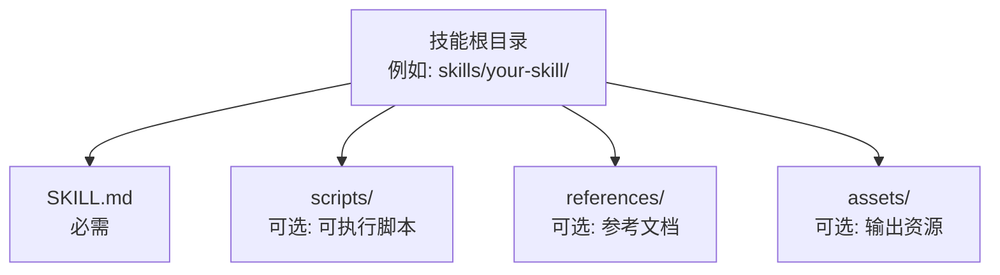
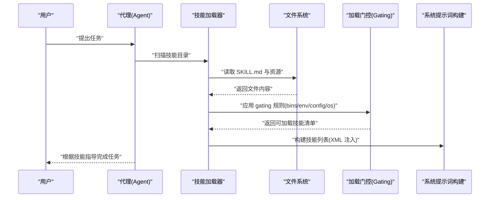
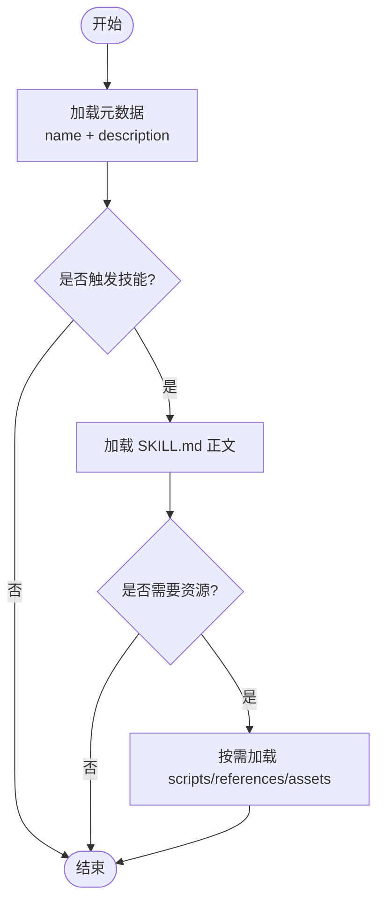
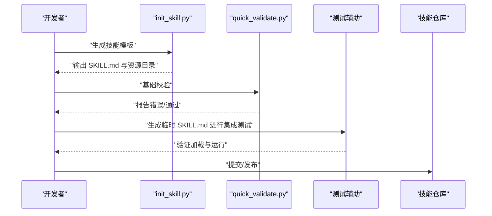
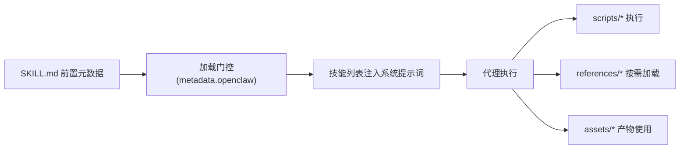

# 技能结构设计

<cite>
**本文引用的文件**
- [skills/1password/SKILL.md](file://skills/1password/SKILL.md)
- [skills/skill-creator/SKILL.md](file://skills/skill-creator/SKILL.md)
- [docs/tools/creating-skills.md](file://docs/tools/creating-skills.md)
- [docs/tools/skills.md](file://docs/tools/skills.md)
- [skills/skill-creator/scripts/quick_validate.py](file://skills/skill-creator/scripts/quick_validate.py)
- [skills/skill-creator/scripts/init_skill.py](file://skills/skill-creator/scripts/init_skill.py)
- [src/agents/system-prompt.ts](file://src/agents/system-prompt.ts)
- [src/agents/skills.e2e-test-helpers.ts](file://src/agents/skills.e2e-test-helpers.ts)
</cite>

## 目录

1. [引言](#引言)
2. [项目结构](#项目结构)
3. [核心组件](#核心组件)
4. [架构总览](#架构总览)
5. [详细组件分析](#详细组件分析)
6. [依赖分析](#依赖分析)
7. [性能考量](#性能考量)
8. [故障排查指南](#故障排查指南)
9. [结论](#结论)
10. [附录](#附录)

## 引言

本文件系统化阐述 OpenClaw 技能（Skill）的结构设计与使用方法，围绕以下目标展开：

- 明确技能的基本组成：SKILL.md 的 YAML 前置元数据与正文 Markdown 编写规范
- 解释技能目录结构设计原则：scripts/、references/、assets/ 三类资源目录的职责与组织方式
- 阐述技能的三层加载机制（元数据、SKILL.md 正文、捆绑资源）与渐进式披露设计原则
- 提供技能命名规范、文件组织最佳实践与内容分层策略
- 给出具体目录结构示例与文件组织模板，便于快速落地

## 项目结构

OpenClaw 将“技能”作为可插拔的能力单元，采用“目录即技能”的结构。每个技能以一个独立目录存在，根下必须包含 SKILL.md；可选包含 scripts/、references/、assets/ 等子目录用于承载可执行脚本、参考文档与输出资源。

图示来源

- [skills/skill-creator/SKILL.md:48-61](file://skills/skill-creator/SKILL.md#L48-L61)

章节来源

- [skills/skill-creator/SKILL.md:46-61](file://skills/skill-creator/SKILL.md#L46-L61)
- [docs/tools/skills.md:13-26](file://docs/tools/skills.md#L13-L26)

## 核心组件

- SKILL.md 元数据与正文
  - 元数据：YAML 前置元数据，至少包含 name 与 description；可选 metadata 字段承载 OpenClaw 扩展能力（如 gating 条件、安装器等）
  - 正文：Markdown 指令与流程说明，仅在技能被触发时按需加载
- 资源目录
  - scripts/：可执行脚本，适合需要确定性与重复使用的任务
  - references/：参考材料，按需注入上下文，避免 SKILL.md 过载
  - assets/：最终产物使用的资源（模板、图标、字体等），不直接加载到上下文
- 加载与过滤
  - 三层加载：元数据（始终在上下文中）、SKILL.md 正文（触发后）、资源（按需）
  - 加载前过滤：基于环境变量、二进制、配置项与平台进行 gating

章节来源

- [docs/tools/skills.md:78-101](file://docs/tools/skills.md#L78-L101)
- [docs/tools/skills.md:106-187](file://docs/tools/skills.md#L106-L187)
- [skills/skill-creator/SKILL.md:63-120](file://skills/skill-creator/SKILL.md#L63-L120)

## 架构总览

从“发现—过滤—加载—执行”的角度，技能体系遵循如下流程：

图示来源

- [docs/tools/skills.md:13-26](file://docs/tools/skills.md#L13-L26)
- [docs/tools/skills.md:106-187](file://docs/tools/skills.md#L106-L187)
- [src/agents/system-prompt.ts:20-36](file://src/agents/system-prompt.ts#L20-L36)

## 详细组件分析

### 组件一：SKILL.md 元数据与正文规范

- 元数据字段
  - 必填：name、description
  - 可选：metadata（单行 JSON 对象，承载 OpenClaw 扩展能力）
  - 其他常见可选键：homepage、user-invocable、disable-model-invocation、command-dispatch 等
- 正文写作
  - 使用命令式/动词不定式
  - 保持 SKILL.md 正文简洁，必要时将细节迁移到 references/ 文件中
  - 在 SKILL.md 中明确列出何时/为何触发该技能，避免在正文中重复

章节来源

- [docs/tools/skills.md:80-101](file://docs/tools/skills.md#L80-L101)
- [docs/tools/skills.md:106-137](file://docs/tools/skills.md#L106-L137)
- [skills/skill-creator/SKILL.md:315-333](file://skills/skill-creator/SKILL.md#L315-L333)

### 组件二：scripts/ 资源目录

- 适用场景
  - 需要确定性与可复用性的任务
  - 避免每次重写相同逻辑
- 最佳实践
  - 保持脚本可执行且健壮
  - 通过 tests 或示例验证行为
  - 如需注入上下文，可在 SKILL.md 中说明调用方式

章节来源

- [skills/skill-creator/SKILL.md:72-79](file://skills/skill-creator/SKILL.md#L72-L79)

### 组件三：references/ 资源目录

- 适用场景
  - 详尽的参考文档、Schema、API 文档、公司政策等
- 最佳实践
  - 大型参考文件建议提供搜索模式或目录索引
  - 与 SKILL.md 内容互补，避免重复
  - 仅在需要时按需加载

章节来源

- [skills/skill-creator/SKILL.md:81-91](file://skills/skill-creator/SKILL.md#L81-L91)

### 组件四：assets/ 资源目录

- 适用场景
  - 输出阶段使用的资源（模板、图标、字体、样本文档等）
- 最佳实践
  - 不直接加载到上下文，减少 token 消耗
  - 与脚本配合生成最终产物

章节来源

- [skills/skill-creator/SKILL.md:92-100](file://skills/skill-creator/SKILL.md#L92-L100)

### 组件五：三层加载机制与渐进式披露

- 元数据（name + description）：始终在上下文中，成本极低
- SKILL.md 正文：仅在技能被触发时加载，建议控制在合理规模内
- 捆绑资源：按需加载，脚本可在无需读入上下文的情况下执行

图示来源

- [skills/skill-creator/SKILL.md:113-120](file://skills/skill-creator/SKILL.md#L113-L120)
- [src/agents/system-prompt.ts:20-36](file://src/agents/system-prompt.ts#L20-L36)

章节来源

- [skills/skill-creator/SKILL.md:113-120](file://skills/skill-creator/SKILL.md#L113-L120)

### 组件六：命名规范与文件组织模板

- 命名规范
  - 仅允许小写字母、数字与连字符
  - 建议短小、动词开头
  - 与工具/领域相关时可加命名空间前缀
  - 技能目录名应与技能名称一致
- 目录模板
  - 至少包含 SKILL.md
  - 可选包含 scripts/、references/、assets/

章节来源

- [skills/skill-creator/SKILL.md:214-221](file://skills/skill-creator/SKILL.md#L214-L221)
- [skills/skill-creator/SKILL.md:48-61](file://skills/skill-creator/SKILL.md#L48-L61)

### 组件七：加载位置与优先级

- 三处加载位置与优先级
  - 工作区技能（最高）→ 本地管理技能 → 内置技能（最低）
- 支持额外目录与插件技能参与优先级规则

章节来源

- [docs/tools/skills.md:13-26](file://docs/tools/skills.md#L13-L26)
- [docs/tools/skills.md:41-48](file://docs/tools/skills.md#L41-L48)

### 组件八：加载门控（gating）与安全

- 门控字段（metadata.openclaw）
  - always、emoji、homepage、os
  - requires.bins/anyBins、requires.env、requires.config
  - primaryEnv、install
- 安全注意事项
  - 第三方技能视为不受信任代码
  - workspace 与额外目录仅接受位于配置根内的合法路径
  - secrets 通过配置注入宿主进程，避免泄露

章节来源

- [docs/tools/skills.md:106-187](file://docs/tools/skills.md#L106-L187)
- [docs/tools/skills.md:69-76](file://docs/tools/skills.md#L69-L76)

### 组件九：创建与验证工作流

- 初始化模板
  - 使用 init_skill.py 生成带模板的 SKILL.md 与可选资源目录
- 快速校验
  - 使用 quick_validate.py 校验 SKILL.md 基础格式与字段合法性
- 测试辅助
  - 使用测试辅助函数生成临时技能文件进行端到端验证

图示来源

- [skills/skill-creator/scripts/init_skill.py:255-317](file://skills/skill-creator/scripts/init_skill.py#L255-L317)
- [skills/skill-creator/scripts/quick_validate.py:67-107](file://skills/skill-creator/scripts/quick_validate.py#L67-L107)
- [src/agents/skills.e2e-test-helpers.ts:4-29](file://src/agents/skills.e2e-test-helpers.ts#L4-L29)

章节来源

- [skills/skill-creator/scripts/init_skill.py:255-317](file://skills/skill-creator/scripts/init_skill.py#L255-L317)
- [skills/skill-creator/scripts/quick_validate.py:67-107](file://skills/skill-creator/scripts/quick_validate.py#L67-L107)
- [src/agents/skills.e2e-test-helpers.ts:4-29](file://src/agents/skills.e2e-test-helpers.ts#L4-L29)

## 依赖分析

- 组件耦合
  - SKILL.md 与 gating 元数据强耦合，决定是否被加载
  - 正文与资源目录弱耦合，通过引用与调用建立连接
- 外部依赖
  - 二进制工具（PATH）、环境变量、配置项与平台
  - 插件可携带自身技能，参与统一优先级规则

图示来源

- [docs/tools/skills.md:106-187](file://docs/tools/skills.md#L106-L187)
- [src/agents/system-prompt.ts:20-36](file://src/agents/system-prompt.ts#L20-L36)

章节来源

- [docs/tools/skills.md:106-187](file://docs/tools/skills.md#L106-L187)
- [src/agents/system-prompt.ts:20-36](file://src/agents/system-prompt.ts#L20-L36)

## 性能考量

- 上下文窗口与 token 成本
  - 技能列表以 XML 形式注入系统提示词，成本可预测
  - 建议控制 SKILL.md 正文长度，将细节放入 references/
- 加载策略
  - 优先使用 scripts/ 执行确定性任务，减少重复解析
  - assets/ 不加载到上下文，降低 token 占用
- 会话快照
  - 同一会话复用已筛选技能列表，减少重复扫描

章节来源

- [docs/tools/skills.md:269-286](file://docs/tools/skills.md#L269-L286)
- [docs/tools/skills.md:242-246](file://docs/tools/skills.md#L242-L246)

## 故障排查指南

- 常见问题
  - SKILL.md 缺失或格式不正确：检查前置元数据边界与字段
  - gating 不满足：确认 PATH、环境变量、配置项与平台
  - 资源路径异常：确保资源在受支持的目录内
- 排查步骤
  - 使用 quick_validate.py 进行基础校验
  - 通过测试辅助函数生成最小可复现 SKILL.md 并验证加载
  - 检查系统提示词中技能列表是否符合预期

章节来源

- [skills/skill-creator/scripts/quick_validate.py:67-107](file://skills/skill-creator/scripts/quick_validate.py#L67-L107)
- [src/agents/skills.e2e-test-helpers.ts:4-29](file://src/agents/skills.e2e-test-helpers.ts#L4-L29)
- [src/agents/system-prompt.ts:20-36](file://src/agents/system-prompt.ts#L20-L36)

## 结论

OpenClaw 的技能体系以“目录即技能”为核心，通过严格的元数据与正文规范、清晰的资源目录分工以及三层加载与门控机制，实现了高可扩展、低上下文开销、可维护的技能生态。遵循本文的命名规范、文件组织与内容分层策略，可显著提升技能质量与复用效率。

## 附录

### 示例：技能目录结构模板

- 最小模板
  - skills/your-skill/
    - SKILL.md
- 常见模板
  - skills/your-skill/
    - SKILL.md
    - scripts/
    - references/
    - assets/

章节来源

- [skills/skill-creator/SKILL.md:48-61](file://skills/skill-creator/SKILL.md#L48-L61)

### 示例：元数据与正文要点

- 元数据
  - name、description（必填）
  - metadata（可选，单行 JSON 对象）
- 正文
  - 命令式/动词不定式
  - 触发条件与使用场景说明
  - 引用 references/ 与 scripts/ 的方式

章节来源

- [docs/tools/skills.md:80-101](file://docs/tools/skills.md#L80-L101)
- [skills/skill-creator/SKILL.md:315-333](file://skills/skill-creator/SKILL.md#L315-L333)

### 示例：渐进式披露与引用组织

- 将复杂细节放入 references/，SKILL.md 仅保留导航与选择指引
- 对大型参考文件提供索引或搜索模式，便于按需加载

章节来源

- [skills/skill-creator/SKILL.md:121-160](file://skills/skill-creator/SKILL.md#L121-L160)
