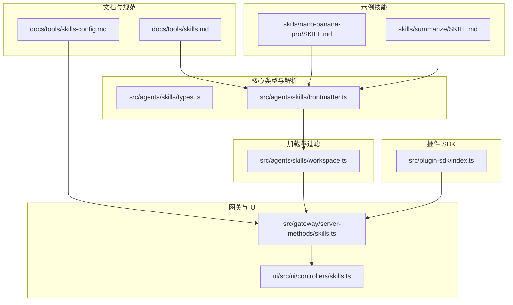
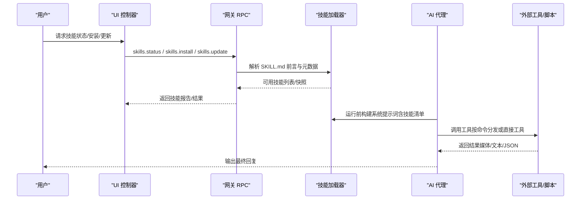
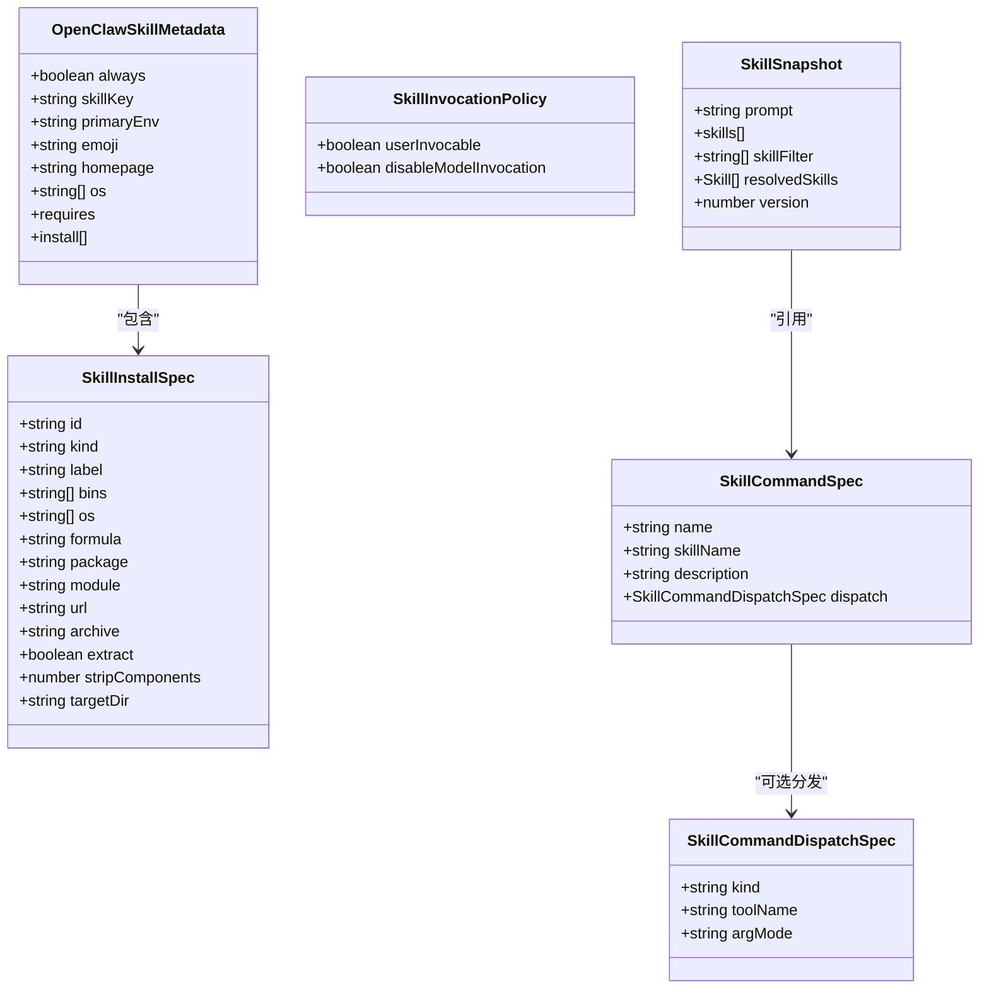
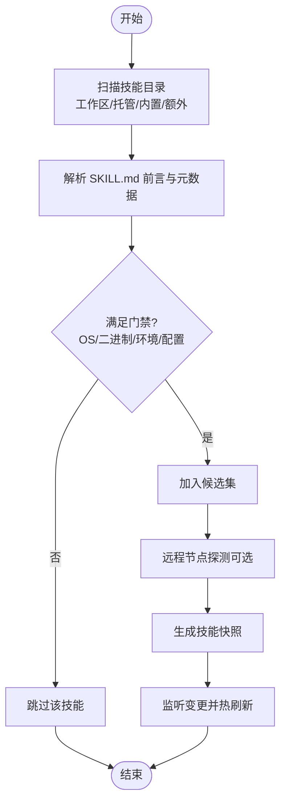
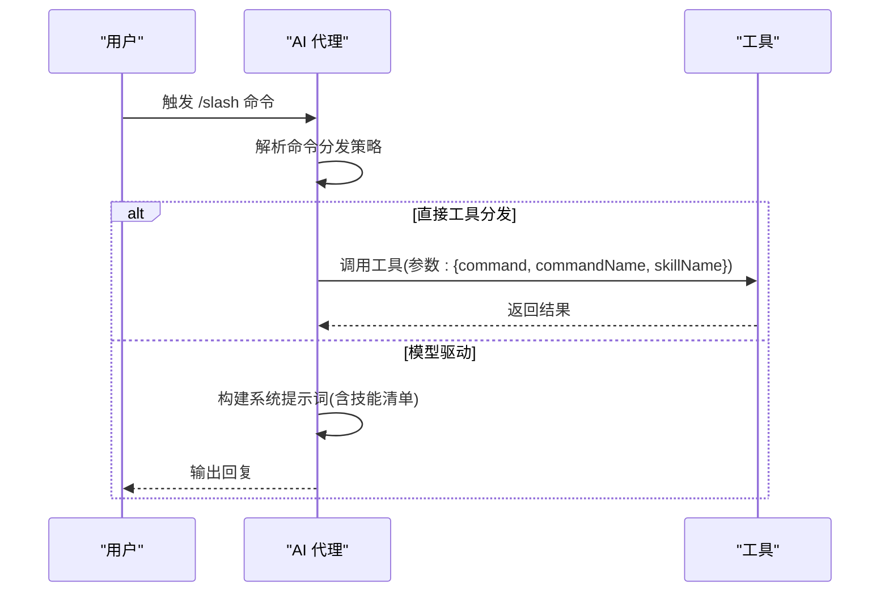
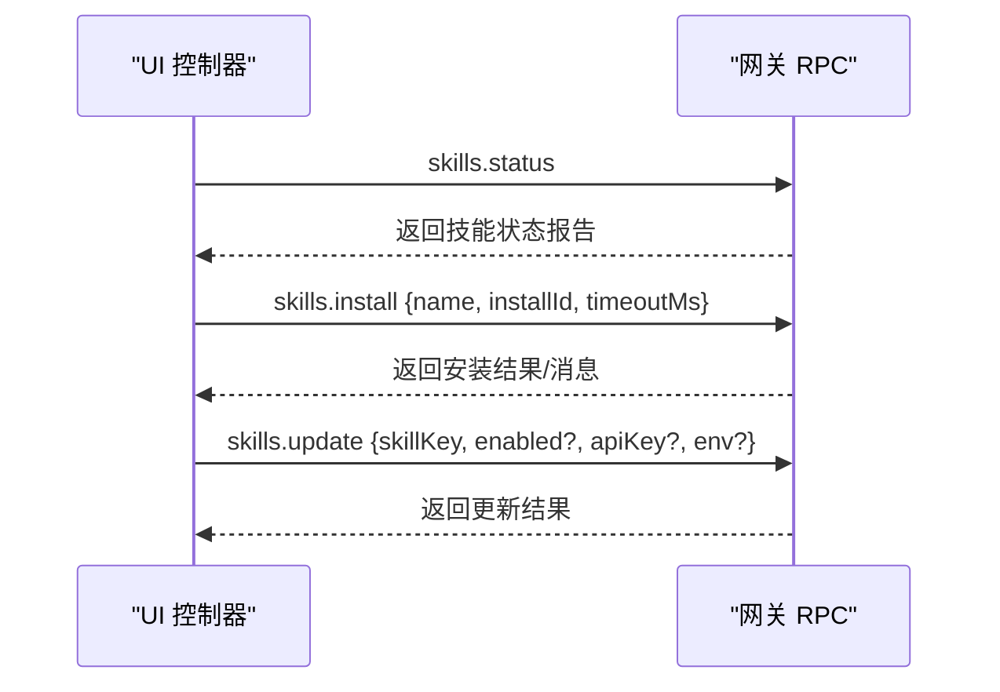
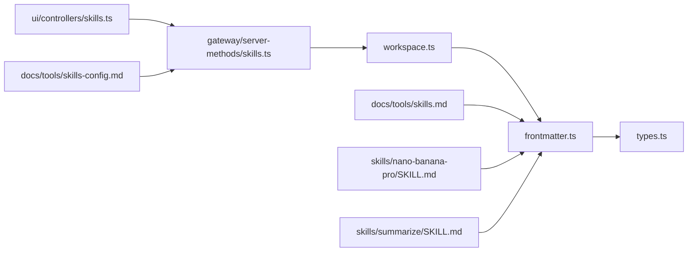
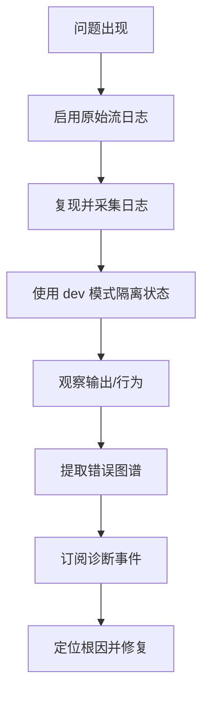

# 技能编程接口

<cite>
**本文档引用的文件**
- [skills.md](file://docs/tools/skills.md)
- [skills-config.md](file://docs/tools/skills-config.md)
- [types.ts](file://src/agents/skills/types.ts)
- [frontmatter.ts](file://src/agents/skills/frontmatter.ts)
- [workspace.ts](file://src/agents/skills/workspace.ts)
- [skills.ts（网关服务端）](file://src/gateway/server-methods/skills.ts)
- [skills.ts（UI 控制器）](file://ui/src/ui/controllers/skills.ts)
- [SKILL.md（示例：nano-banana-pro）](file://skills/nano-banana-pro/SKILL.md)
- [SKILL.md（示例：summarize）](file://skills/summarize/SKILL.md)
- [index.ts（插件 SDK 导出）](file://src/plugin-sdk/index.ts)
- [debugging.md](file://docs/help/debugging.md)
- [errors.ts](file://src/infra/errors.ts)
- [diagnostic-events.ts](file://src/infra/diagnostic-events.ts)
</cite>

## 目录

1. [简介](#简介)
2. [项目结构](#项目结构)
3. [核心组件](#核心组件)
4. [架构总览](#架构总览)
5. [详细组件分析](#详细组件分析)
6. [依赖关系分析](#依赖关系分析)
7. [性能考量](#性能考量)
8. [故障排查指南](#故障排查指南)
9. [结论](#结论)
10. [附录](#附录)

## 简介

本文件系统化阐述 OpenClaw 的“技能编程接口”，覆盖技能元数据定义、触发条件配置、技能描述规范；详述技能与 AI 代理系统的交互流程（上下文注入、工具调用、结果返回）；提供多语言集成与示例路径，并给出调试、错误处理与性能优化建议。

## 项目结构

围绕“技能”的关键目录与文件：

- 文档层：技能格式与配置参考
- 核心类型与解析：技能元数据、前端参数、命令分发
- 技能加载与过滤：工作区/托管/内置优先级、远程节点适配
- 网关与 UI：技能状态查询、安装、更新
- 示例技能：实际 SKILL.md 模板与用法
- 插件 SDK：对外暴露的工具与运行时能力
- 调试与诊断：原始流日志、诊断事件、错误提取

**图表来源**

- [skills.md:1-303](file://docs/tools/skills.md#L1-L303)
- [skills-config.md:1-78](file://docs/tools/skills-config.md#L1-L78)
- [types.ts:1-90](file://src/agents/skills/types.ts#L1-L90)
- [frontmatter.ts:1-223](file://src/agents/skills/frontmatter.ts#L1-L223)
- [workspace.ts:775-798](file://src/agents/skills/workspace.ts#L775-L798)
- [skills.ts（网关服务端）:134-180](file://src/gateway/server-methods/skills.ts#L134-L180)
- [skills.ts（UI 控制器）:39-157](file://ui/src/ui/controllers/skills.ts#L39-L157)
- [SKILL.md（示例：nano-banana-pro）:1-66](file://skills/nano-banana-pro/SKILL.md#L1-L66)
- [SKILL.md（示例：summarize）:1-88](file://skills/summarize/SKILL.md#L1-L88)
- [index.ts（插件 SDK 导出）:1-826](file://src/plugin-sdk/index.ts#L1-L826)

**章节来源**

- [skills.md:1-303](file://docs/tools/skills.md#L1-L303)
- [skills-config.md:1-78](file://docs/tools/skills-config.md#L1-L78)

## 核心组件

- 技能元数据与类型
  - 定义技能安装规格、OpenClaw 扩展元数据、调用策略、命令分发、快照等核心类型，确保前端与后端一致。
- 前端参数解析
  - 解析 SKILL.md 的 YAML 前言块，标准化为单行 JSON 的 metadata.openclaw 字段，支持安装器、平台要求、环境变量、配置项等。
- 技能加载与过滤
  - 支持工作区、托管、内置三层优先级；按 OS、二进制、环境变量、配置项进行加载期门禁；支持远程节点探测与热刷新。
- 网关与 UI
  - 提供 skills.status/skills.install/skills.update 等 RPC 方法；UI 通过客户端请求获取技能状态、执行安装与更新。
- 示例技能
  - 提供真实 SKILL.md 模板，展示如何声明元数据、安装器、调用方式与最佳实践。

**章节来源**

- [types.ts:1-90](file://src/agents/skills/types.ts#L1-L90)
- [frontmatter.ts:186-223](file://src/agents/skills/frontmatter.ts#L186-L223)
- [workspace.ts:775-798](file://src/agents/skills/workspace.ts#L775-L798)
- [skills.ts（网关服务端）:134-180](file://src/gateway/server-methods/skills.ts#L134-L180)
- [skills.ts（UI 控制器）:39-157](file://ui/src/ui/controllers/skills.ts#L39-L157)
- [SKILL.md（示例：nano-banana-pro）:1-66](file://skills/nano-banana-pro/SKILL.md#L1-L66)
- [SKILL.md（示例：summarize）:1-88](file://skills/summarize/SKILL.md#L1-L88)

## 架构总览

技能从“定义—解析—加载—运行—反馈”的闭环链路如下：

**图表来源**

- [skills.ts（UI 控制器）:39-157](file://ui/src/ui/controllers/skills.ts#L39-L157)
- [skills.ts（网关服务端）:134-180](file://src/gateway/server-methods/skills.ts#L134-L180)
- [frontmatter.ts:186-223](file://src/agents/skills/frontmatter.ts#L186-L223)
- [workspace.ts:775-798](file://src/agents/skills/workspace.ts#L775-L798)

## 详细组件分析

### 元数据与类型系统

- 类型定义
  - 安装规格、OpenClaw 扩展元数据、调用策略、命令分发、快照等，统一约束技能的可安装性、可用性与可见性。
- 元数据解析
  - 将 frontmatter 中的 metadata.openclaw 解析为结构化对象，校验安装器字段、平台与依赖项，生成标准化元数据。
- 关键点
  - 支持 always/emoji/homepage/os/primaryEnv/requirements/install 等字段。
  - 支持命令级分发（tool 模式）与参数转发模式（raw）。

**图表来源**

- [types.ts:1-90](file://src/agents/skills/types.ts#L1-L90)

**章节来源**

- [types.ts:1-90](file://src/agents/skills/types.ts#L1-L90)
- [frontmatter.ts:186-223](file://src/agents/skills/frontmatter.ts#L186-L223)

### 技能加载与过滤

- 加载顺序与优先级
  - 工作区技能 > 托管本地技能 > 内置技能；支持额外扫描目录与允许白名单。
- 过滤规则
  - 按 OS、PATH 二进制、环境变量、配置项进行门禁；支持远程节点探测（macOS-only 技能在 Linux 网关上通过 nodes.run 使用）。
- 快照与热刷新
  - 会话开始时快照可用技能；支持监听变更与去抖动刷新。

**图表来源**

- [skills.md:13-303](file://docs/tools/skills.md#L13-L303)
- [frontmatter.ts:186-223](file://src/agents/skills/frontmatter.ts#L186-L223)
- [workspace.ts:775-798](file://src/agents/skills/workspace.ts#L775-L798)

**章节来源**

- [skills.md:13-303](file://docs/tools/skills.md#L13-L303)
- [workspace.ts:775-798](file://src/agents/skills/workspace.ts#L775-L798)

### 命令与工具调用

- 用户命令到工具的映射
  - 支持 user-invocable 与 disable-model-invocation 控制是否进入模型提示词。
  - 支持 command-dispatch: tool 与 command-tool 指定直接调用工具，参数可 raw 转发。
- 工具调用参数
  - 以 { command, commandName, skillName } 形式传入工具，便于工具侧解析与执行。

**图表来源**

- [frontmatter.ts:208-223](file://src/agents/skills/frontmatter.ts#L208-L223)
- [skills.md:95-105](file://docs/tools/skills.md#L95-L105)

**章节来源**

- [frontmatter.ts:208-223](file://src/agents/skills/frontmatter.ts#L208-L223)
- [skills.md:95-105](file://docs/tools/skills.md#L95-L105)

### 网关与 UI 的技能管理

- 网关 RPC
  - skills.status：返回技能状态报告（来源、可用性、缺失项、安装选项等）。
  - skills.install：根据名称与安装 ID 执行安装，支持超时控制。
  - skills.update：动态更新技能启用状态、密钥与环境变量。
- UI 控制器
  - 通过客户端请求调用 RPC，加载状态、设置消息、处理错误与忙碌态。

**图表来源**

- [skills.ts（网关服务端）:134-180](file://src/gateway/server-methods/skills.ts#L134-L180)
- [skills.ts（UI 控制器）:39-157](file://ui/src/ui/controllers/skills.ts#L39-L157)

**章节来源**

- [skills.ts（网关服务端）:134-180](file://src/gateway/server-methods/skills.ts#L134-L180)
- [skills.ts（UI 控制器）:39-157](file://ui/src/ui/controllers/skills.ts#L39-L157)

### 示例技能与最佳实践

- 示例一：nano-banana-pro
  - 展示 metadata.openclaw 的 requires/primaryEnv/install 字段，以及在 SKILL.md 中的使用方式与调用示例。
- 示例二：summarize
  - 展示触发短语、常用参数、模型与密钥配置、可选配置文件与服务密钥。

**章节来源**

- [SKILL.md（示例：nano-banana-pro）:1-66](file://skills/nano-banana-pro/SKILL.md#L1-L66)
- [SKILL.md（示例：summarize）:1-88](file://skills/summarize/SKILL.md#L1-L88)

### 插件 SDK 与扩展能力

- 插件 SDK 汇总导出大量通道、工具、运行时与安全相关类型与工具函数，便于在技能中复用。
- 与技能的关系
  - 技能可通过工具调用与插件 SDK 提供的能力协作，实现跨通道、跨工具的统一体验。

**章节来源**

- [index.ts（插件 SDK 导出）:1-826](file://src/plugin-sdk/index.ts#L1-L826)

## 依赖关系分析

- 组件耦合
  - frontmatter.ts 依赖 shared/frontmatter 与类型定义，负责将 SKILL.md 前言解析为 OpenClaw 元数据。
  - workspace.ts 负责加载与过滤技能条目，生成命令规范与快照。
  - 网关 server-methods/skills.ts 作为 RPC 入口，协调配置、安装与更新。
  - UI 控制器通过客户端请求与网关交互，驱动技能生命周期。
- 外部依赖
  - 文档层 skills.md/skills-config.md 提供配置与行为参考。
  - 示例技能 SKILL.md 作为模板与实操范例。

**图表来源**

- [frontmatter.ts:1-223](file://src/agents/skills/frontmatter.ts#L1-L223)
- [types.ts:1-90](file://src/agents/skills/types.ts#L1-L90)
- [workspace.ts:775-798](file://src/agents/skills/workspace.ts#L775-L798)
- [skills.ts（网关服务端）:134-180](file://src/gateway/server-methods/skills.ts#L134-L180)
- [skills.ts（UI 控制器）:39-157](file://ui/src/ui/controllers/skills.ts#L39-L157)
- [skills.md:1-303](file://docs/tools/skills.md#L1-L303)
- [skills-config.md:1-78](file://docs/tools/skills-config.md#L1-L78)
- [SKILL.md（示例：nano-banana-pro）:1-66](file://skills/nano-banana-pro/SKILL.md#L1-L66)
- [SKILL.md（示例：summarize）:1-88](file://skills/summarize/SKILL.md#L1-L88)

**章节来源**

- [frontmatter.ts:1-223](file://src/agents/skills/frontmatter.ts#L1-L223)
- [workspace.ts:775-798](file://src/agents/skills/workspace.ts#L775-L798)
- [skills.ts（网关服务端）:134-180](file://src/gateway/server-methods/skills.ts#L134-L180)
- [skills.ts（UI 控制器）:39-157](file://ui/src/ui/controllers/skills.ts#L39-L157)

## 性能考量

- 技能列表注入成本
  - 当存在技能时，系统会在系统提示词中注入紧凑的 XML 列表，字符开销与字段长度相关；可通过减少技能数量或缩短描述来降低 token 成本。
- 快照与热刷新
  - 会话内复用技能快照，避免重复构建；开启监听可在变更时热刷新，兼顾一致性与效率。
- 环境与二进制探测
  - 在加载期完成探测，避免运行期反复检查；远程节点探测需谨慎，仅在必要时启用。

**章节来源**

- [skills.md:269-286](file://docs/tools/skills.md#L269-L286)
- [skills.md:242-247](file://docs/tools/skills.md#L242-L247)

## 故障排查指南

- 原始流日志
  - 启用原始助手流日志与原始块日志，定位推理泄漏或输出异常。
- 开发模式与观察
  - 使用 dev 配置文件隔离状态，结合 watch 模式快速迭代。
- 错误提取与诊断
  - 使用错误提取工具收集错误图谱候选；通过诊断事件系统记录序列化事件，限制递归深度防止栈溢出。
- 安全注意事项
  - 原始日志可能包含完整提示、工具输出与用户数据，注意本地保存与脱敏。

**图表来源**

- [debugging.md:107-163](file://docs/help/debugging.md#L107-L163)
- [diagnostic-events.ts:191-242](file://src/infra/diagnostic-events.ts#L191-L242)
- [errors.ts:1-52](file://src/infra/errors.ts#L1-L52)

**章节来源**

- [debugging.md:1-163](file://docs/help/debugging.md#L1-L163)
- [diagnostic-events.ts:191-242](file://src/infra/diagnostic-events.ts#L191-L242)
- [errors.ts:1-52](file://src/infra/errors.ts#L1-L52)

## 结论

OpenClaw 的技能编程接口以“AgentSkills 兼容 + OpenClaw 扩展元数据”为核心，通过清晰的类型系统、严格的加载与过滤机制、完善的网关与 UI 协同，实现了可维护、可观测、可扩展的技能生态。遵循本文档的元数据与配置规范，结合示例技能与调试手段，可高效构建高质量的技能脚本与工具集成。

## 附录

- 配置参考
  - 技能相关配置项与默认值详见技能配置文档。
- 编程语言与集成
  - 技能脚本可采用 Bash/Python/Node 等，通过工具调用与插件 SDK 能力集成；命令分发支持 raw 参数透传，便于多语言脚本接入。

**章节来源**

- [skills-config.md:1-78](file://docs/tools/skills-config.md#L1-L78)
- [index.ts（插件 SDK 导出）:1-826](file://src/plugin-sdk/index.ts#L1-L826)
