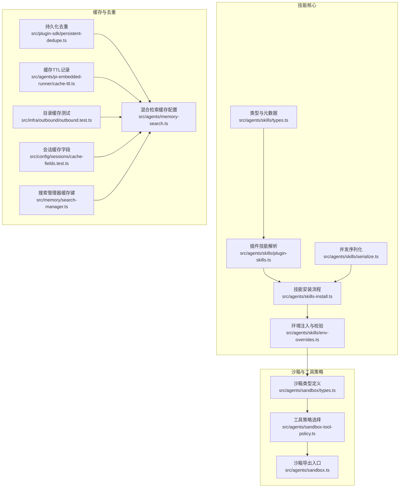
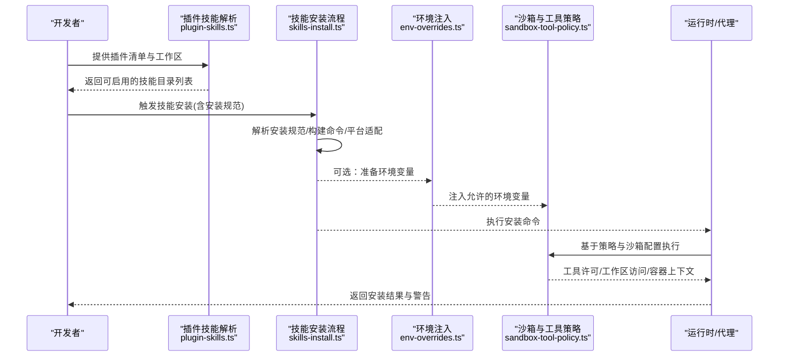
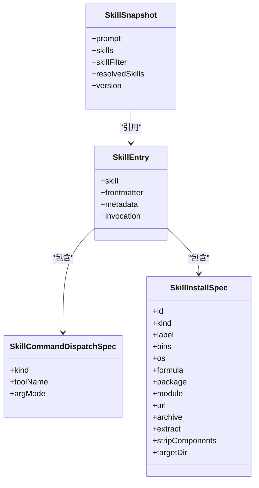
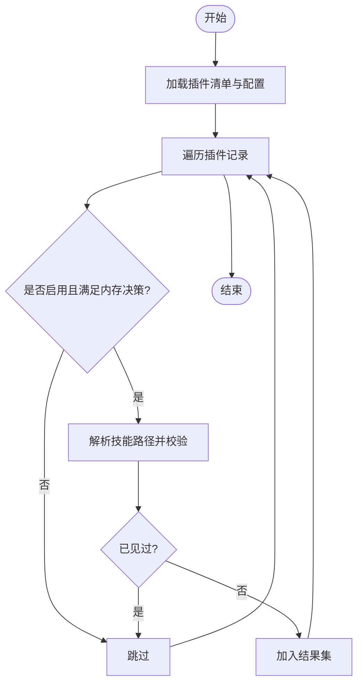
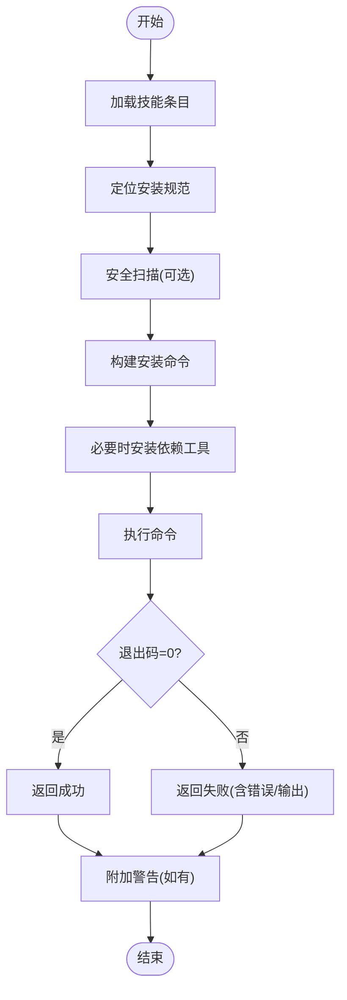
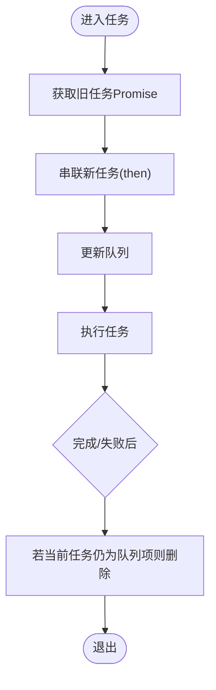
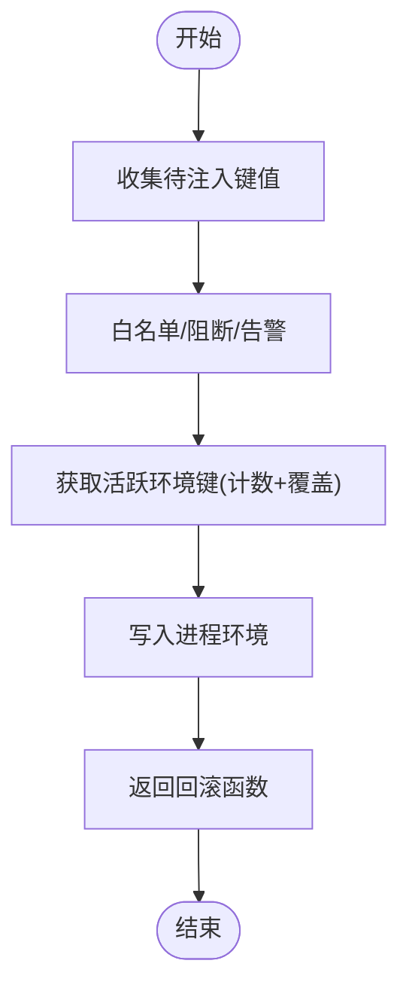
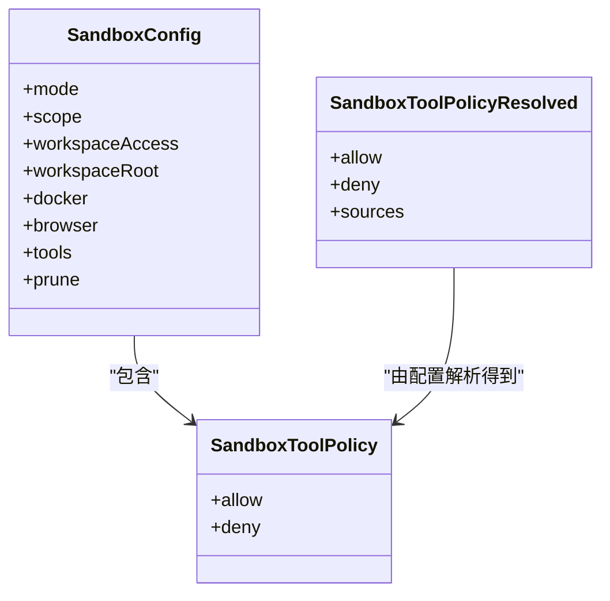
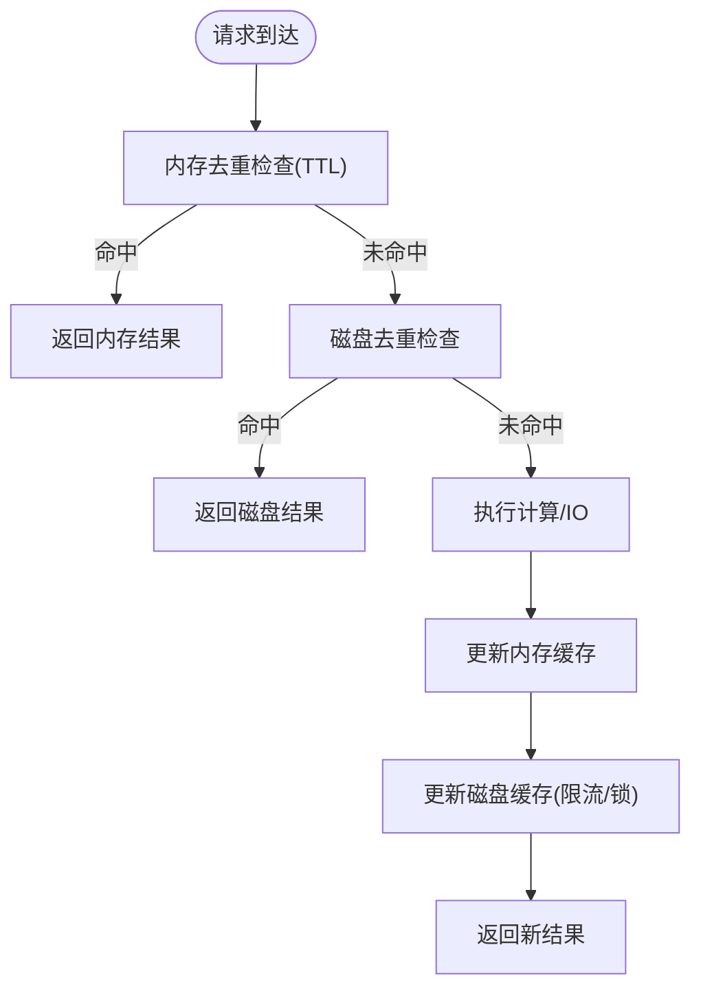
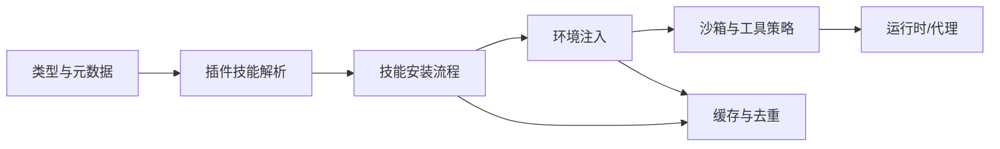

# 技能架构

<cite>
**本文引用的文件**
- [src/agents/skills/types.ts](file://src/agents/skills/types.ts)
- [src/agents/skills/plugin-skills.ts](file://src/agents/skills/plugin-skills.ts)
- [src/agents/skills-install.ts](file://src/agents/skills-install.ts)
- [src/agents/skills/serialize.ts](file://src/agents/skills/serialize.ts)
- [src/agents/skills/env-overrides.ts](file://src/agents/skills/env-overrides.ts)
- [src/agents/sandbox-tool-policy.ts](file://src/agents/sandbox-tool-policy.ts)
- [src/agents/sandbox/types.ts](file://src/agents/sandbox/types.ts)
- [src/agents/sandbox.ts](file://src/agents/sandbox.ts)
- [src/plugin-sdk/persistent-dedupe.ts](file://src/plugin-sdk/persistent-dedupe.ts)
- [src/agents/memory-search.ts](file://src/agents/memory-search.ts)
- [src/agents/pi-embedded-runner/cache-ttl.ts](file://src/agents/pi-embedded-runner/cache-ttl.ts)
- [src/infra/outbound/outbound.test.ts](file://src/infra/outbound/outbound.test.ts)
- [src/config/sessions/cache-fields.test.ts](file://src/config/sessions/cache-fields.test.ts)
- [src/memory/search-manager.ts](file://src/memory/search-manager.ts)
- [skills/skill-creator/SKILL.md](file://skills/skill-creator/SKILL.md)
</cite>

## 目录

1. [引言](#引言)
2. [项目结构](#项目结构)
3. [核心组件](#核心组件)
4. [架构总览](#架构总览)
5. [组件详解](#组件详解)
6. [依赖关系分析](#依赖关系分析)
7. [性能考量](#性能考量)
8. [故障排查指南](#故障排查指南)
9. [结论](#结论)
10. [附录：扩展与自定义指南](#附录扩展与自定义指南)

## 引言

本技术文档聚焦于 OpenClaw 的“技能”（Skill）架构，系统性解析其加载机制、生命周期管理、执行环境与安全沙箱策略，并阐述技能与代理系统的交互方式、工具调用实现原理、并发与缓存优化以及扩展与自定义方法。目标是帮助开发者在理解现有能力的基础上，安全、高效地构建与集成新技能。

## 项目结构

OpenClaw 将“技能”相关能力分布在多个子模块中：

- 技能类型与元数据：定义技能条目、命令分发、安装偏好等类型与结构。
- 插件技能目录解析：从插件清单中解析可启用的技能路径集合。
- 技能安装流程：支持多包管理器与平台差异，内置安全扫描与失败回退提示。
- 并发与序列化：通过键控队列保证同一资源的串行化操作。
- 执行环境注入：对技能运行所需的环境变量进行白名单校验与注入。
- 安全沙箱与工具策略：定义沙箱模式、工作区访问级别、工具许可策略。
- 缓存与去重：内存+磁盘持久化的去重与缓存策略，支持 TTL 与容量淘汰。

图表来源

- [src/agents/skills/types.ts:1-90](file://src/agents/skills/types.ts#L1-L90)
- [src/agents/skills/plugin-skills.ts:1-90](file://src/agents/skills/plugin-skills.ts#L1-L90)
- [src/agents/skills-install.ts:1-471](file://src/agents/skills-install.ts#L1-L471)
- [src/agents/skills/serialize.ts:1-14](file://src/agents/skills/serialize.ts#L1-L14)
- [src/agents/skills/env-overrides.ts:213-262](file://src/agents/skills/env-overrides.ts#L213-L262)
- [src/agents/sandbox/types.ts:1-91](file://src/agents/sandbox/types.ts#L1-L91)
- [src/agents/sandbox-tool-policy.ts:1-38](file://src/agents/sandbox-tool-policy.ts#L1-L38)
- [src/agents/sandbox.ts:1-45](file://src/agents/sandbox.ts#L1-L45)
- [src/plugin-sdk/persistent-dedupe.ts:94-111](file://src/plugin-sdk/persistent-dedupe.ts#L94-L111)
- [src/agents/memory-search.ts:263-284](file://src/agents/memory-search.ts#L263-L284)
- [src/agents/pi-embedded-runner/cache-ttl.ts:38-76](file://src/agents/pi-embedded-runner/cache-ttl.ts#L38-L76)
- [src/infra/outbound/outbound.test.ts:636-671](file://src/infra/outbound/outbound.test.ts#L636-L671)
- [src/config/sessions/cache-fields.test.ts:46-68](file://src/config/sessions/cache-fields.test.ts#L46-L68)
- [src/memory/search-manager.ts:239-252](file://src/memory/search-manager.ts#L239-L252)

章节来源

- [src/agents/skills/types.ts:1-90](file://src/agents/skills/types.ts#L1-L90)
- [src/agents/skills/plugin-skills.ts:1-90](file://src/agents/skills/plugin-skills.ts#L1-L90)
- [src/agents/skills-install.ts:1-471](file://src/agents/skills-install.ts#L1-L471)
- [src/agents/skills/serialize.ts:1-14](file://src/agents/skills/serialize.ts#L1-L14)
- [src/agents/skills/env-overrides.ts:213-262](file://src/agents/skills/env-overrides.ts#L213-L262)
- [src/agents/sandbox/types.ts:1-91](file://src/agents/sandbox/types.ts#L1-L91)
- [src/agents/sandbox-tool-policy.ts:1-38](file://src/agents/sandbox-tool-policy.ts#L1-L38)
- [src/agents/sandbox.ts:1-45](file://src/agents/sandbox.ts#L1-L45)
- [src/plugin-sdk/persistent-dedupe.ts:94-111](file://src/plugin-sdk/persistent-dedupe.ts#L94-L111)
- [src/agents/memory-search.ts:263-284](file://src/agents/memory-search.ts#L263-L284)
- [src/agents/pi-embedded-runner/cache-ttl.ts:38-76](file://src/agents/pi-embedded-runner/cache-ttl.ts#L38-L76)
- [src/infra/outbound/outbound.test.ts:636-671](file://src/infra/outbound/outbound.test.ts#L636-L671)
- [src/config/sessions/cache-fields.test.ts:46-68](file://src/config/sessions/cache-fields.test.ts#L46-L68)
- [src/memory/search-manager.ts:239-252](file://src/memory/search-manager.ts#L239-L252)

## 核心组件

- 技能类型与元数据：定义技能条目、命令分发、安装规范、环境需求与快照结构，支撑后续解析、安装与执行。
- 插件技能解析：从插件清单中解析技能目录，结合启用状态与内存插件决策，确保路径安全与唯一性。
- 技能安装流程：统一构建安装命令、处理平台差异、自动安装依赖工具（如 Go、uv）、执行并返回结果与警告。
- 并发与序列化：以键为单位的串行化队列，避免资源竞争与竞态条件。
- 环境注入与校验：对技能所需环境变量进行白名单校验与注入，同时维护活跃环境映射与回滚。
- 沙箱与工具策略：定义沙箱模式、作用域、工作区访问级别与工具许可策略，保障执行隔离与最小授权。
- 缓存与去重：内存+磁盘组合的去重与缓存策略，支持 TTL 与容量淘汰，提升重复请求性能。

章节来源

- [src/agents/skills/types.ts:1-90](file://src/agents/skills/types.ts#L1-L90)
- [src/agents/skills/plugin-skills.ts:15-89](file://src/agents/skills/plugin-skills.ts#L15-L89)
- [src/agents/skills-install.ts:392-470](file://src/agents/skills-install.ts#L392-L470)
- [src/agents/skills/serialize.ts:3-13](file://src/agents/skills/serialize.ts#L3-L13)
- [src/agents/skills/env-overrides.ts:213-262](file://src/agents/skills/env-overrides.ts#L213-L262)
- [src/agents/sandbox/types.ts:55-85](file://src/agents/sandbox/types.ts#L55-L85)
- [src/agents/sandbox-tool-policy.ts:21-37](file://src/agents/sandbox-tool-policy.ts#L21-L37)
- [src/plugin-sdk/persistent-dedupe.ts:94-111](file://src/plugin-sdk/persistent-dedupe.ts#L94-L111)

## 架构总览

下图展示从“插件清单”到“技能安装与执行”的端到端流程，以及与“沙箱与工具策略”的集成点。

图表来源

- [src/agents/skills/plugin-skills.ts:15-89](file://src/agents/skills/plugin-skills.ts#L15-L89)
- [src/agents/skills-install.ts:392-470](file://src/agents/skills-install.ts#L392-L470)
- [src/agents/skills/env-overrides.ts:213-262](file://src/agents/skills/env-overrides.ts#L213-L262)
- [src/agents/sandbox-tool-policy.ts:21-37](file://src/agents/sandbox-tool-policy.ts#L21-L37)

## 组件详解

### 技能类型与元数据

- 关键结构：技能条目、命令分发、安装规范、环境需求、快照结构等。
- 用途：作为解析、安装、执行与权限控制的统一契约，确保跨模块一致性。

图表来源

- [src/agents/skills/types.ts:66-90](file://src/agents/skills/types.ts#L66-L90)

章节来源

- [src/agents/skills/types.ts:1-90](file://src/agents/skills/types.ts#L1-L90)

### 插件技能解析

- 功能：从插件清单中解析技能目录，结合启用状态、内存插件决策与 ACP 开关，过滤并去重有效路径。
- 安全：使用真实路径校验，防止逃逸插件根目录；记录警告日志便于审计。

图表来源

- [src/agents/skills/plugin-skills.ts:15-89](file://src/agents/skills/plugin-skills.ts#L15-L89)

章节来源

- [src/agents/skills/plugin-skills.ts:15-89](file://src/agents/skills/plugin-skills.ts#L15-L89)

### 技能安装流程

- 多源安装：支持 Homebrew、Node 包管理器、Go、uv 与下载安装。
- 平台适配：自动检测与安装依赖工具（如 Go、uv），Linux 场景下尝试 apt-get。
- 安全扫描：安装前对技能目录进行扫描，输出危险或可疑模式警告。
- 结果格式：统一返回成功/失败信息、标准输出/错误、退出码与可选警告。

图表来源

- [src/agents/skills-install.ts:392-470](file://src/agents/skills-install.ts#L392-L470)
- [src/agents/skills-install.ts:58-85](file://src/agents/skills-install.ts#L58-L85)
- [src/agents/skills-install.ts:114-154](file://src/agents/skills-install.ts#L114-L154)
- [src/agents/skills-install.ts:256-367](file://src/agents/skills-install.ts#L256-L367)

章节来源

- [src/agents/skills-install.ts:1-471](file://src/agents/skills-install.ts#L1-L471)

### 并发与序列化

- 目标：避免同一资源的并发安装/写入导致竞态。
- 实现：以字符串键为单位的串行化队列，任务完成后清理键，确保顺序与一致性。

图表来源

- [src/agents/skills/serialize.ts:3-13](file://src/agents/skills/serialize.ts#L3-L13)

章节来源

- [src/agents/skills/serialize.ts:1-14](file://src/agents/skills/serialize.ts#L1-L14)

### 环境注入与校验

- 目标：按需注入技能运行所需的敏感或必需环境变量，同时限制高风险变量。
- 实现：白名单校验、活跃环境计数、进程环境覆盖与回滚；对主环境变量进行优先级与冲突检查。

图表来源

- [src/agents/skills/env-overrides.ts:213-262](file://src/agents/skills/env-overrides.ts#L213-L262)
- [src/agents/skills/env-overrides.ts:33-71](file://src/agents/skills/env-overrides.ts#L33-L71)

章节来源

- [src/agents/skills/env-overrides.ts:73-203](file://src/agents/skills/env-overrides.ts#L73-L203)
- [src/agents/skills/env-overrides.ts:213-262](file://src/agents/skills/env-overrides.ts#L213-L262)

### 沙箱与工具策略

- 沙箱配置：模式、作用域、工作区访问、容器与浏览器参数、工具策略、裁剪策略。
- 工具策略：允许/拒绝列表，支持叠加与默认通配符策略。
- 集成：沙箱导出入口统一暴露配置解析、上下文构建与工具策略解析。

图表来源

- [src/agents/sandbox/types.ts:55-85](file://src/agents/sandbox/types.ts#L55-L85)
- [src/agents/sandbox-tool-policy.ts:21-37](file://src/agents/sandbox-tool-policy.ts#L21-L37)

章节来源

- [src/agents/sandbox/types.ts:1-91](file://src/agents/sandbox/types.ts#L1-L91)
- [src/agents/sandbox-tool-policy.ts:1-38](file://src/agents/sandbox-tool-policy.ts#L1-L38)
- [src/agents/sandbox.ts:1-45](file://src/agents/sandbox.ts#L1-L45)

### 缓存与去重策略

- 内存去重：基于 TTL 与最大容量的内存缓存，快速命中与去重。
- 磁盘去重：持久化存储，支持最大条目数与锁选项，降低重复计算成本。
- 混合检索缓存：可配置启用、最大条目数，支持 MMR 与时间衰减等参数。
- TTL 记录：在会话管理器中追加/读取缓存 TTL 时间戳，便于诊断与排障。

图表来源

- [src/plugin-sdk/persistent-dedupe.ts:94-111](file://src/plugin-sdk/persistent-dedupe.ts#L94-L111)
- [src/agents/memory-search.ts:263-284](file://src/agents/memory-search.ts#L263-L284)
- [src/agents/pi-embedded-runner/cache-ttl.ts:38-76](file://src/agents/pi-embedded-runner/cache-ttl.ts#L38-L76)
- [src/infra/outbound/outbound.test.ts:636-671](file://src/infra/outbound/outbound.test.ts#L636-L671)
- [src/config/sessions/cache-fields.test.ts:46-68](file://src/config/sessions/cache-fields.test.ts#L46-L68)
- [src/memory/search-manager.ts:239-252](file://src/memory/search-manager.ts#L239-L252)

章节来源

- [src/plugin-sdk/persistent-dedupe.ts:94-111](file://src/plugin-sdk/persistent-dedupe.ts#L94-L111)
- [src/agents/memory-search.ts:263-284](file://src/agents/memory-search.ts#L263-L284)
- [src/agents/pi-embedded-runner/cache-ttl.ts:38-76](file://src/agents/pi-embedded-runner/cache-ttl.ts#L38-L76)
- [src/infra/outbound/outbound.test.ts:636-671](file://src/infra/outbound/outbound.test.ts#L636-L671)
- [src/config/sessions/cache-fields.test.ts:46-68](file://src/config/sessions/cache-fields.test.ts#L46-L68)
- [src/memory/search-manager.ts:239-252](file://src/memory/search-manager.ts#L239-L252)

## 依赖关系分析

- 类型层：技能类型与元数据为上层解析与安装提供契约。
- 解析层：插件技能解析依赖插件配置与内存决策，确保路径安全与唯一。
- 安装层：安装流程依赖平台工具检测、命令构建与安全扫描。
- 环境层：环境注入依赖配置与活跃键计数，确保隔离与回滚。
- 沙箱层：工具策略与沙箱配置共同决定执行边界与最小权限。
- 缓存层：去重与缓存策略贯穿多处子系统，提升整体吞吐与稳定性。

图表来源

- [src/agents/skills/types.ts:1-90](file://src/agents/skills/types.ts#L1-L90)
- [src/agents/skills/plugin-skills.ts:15-89](file://src/agents/skills/plugin-skills.ts#L15-L89)
- [src/agents/skills-install.ts:392-470](file://src/agents/skills-install.ts#L392-L470)
- [src/agents/skills/env-overrides.ts:213-262](file://src/agents/skills/env-overrides.ts#L213-L262)
- [src/agents/sandbox-tool-policy.ts:21-37](file://src/agents/sandbox-tool-policy.ts#L21-L37)

章节来源

- [src/agents/skills/types.ts:1-90](file://src/agents/skills/types.ts#L1-L90)
- [src/agents/skills/plugin-skills.ts:15-89](file://src/agents/skills/plugin-skills.ts#L15-L89)
- [src/agents/skills-install.ts:392-470](file://src/agents/skills-install.ts#L392-L470)
- [src/agents/skills/env-overrides.ts:213-262](file://src/agents/skills/env-overrides.ts#L213-L262)
- [src/agents/sandbox-tool-policy.ts:21-37](file://src/agents/sandbox-tool-policy.ts#L21-L37)

## 性能考量

- 并发控制：通过键控串行化减少资源争用，适合安装/写入等有副作用的操作。
- 缓存策略：内存+磁盘双层去重与缓存，结合 TTL 与容量淘汰，显著降低重复计算。
- 混合检索：可配置的缓存开关、MMR 与时间衰减参数，平衡召回与时效。
- 目录缓存：LRU 能力验证，容量超限时淘汰最久未使用条目，保证空间可控。
- 会话缓存字段：支持显式清空缓存读写统计，便于运维观测与调优。

章节来源

- [src/agents/skills/serialize.ts:1-14](file://src/agents/skills/serialize.ts#L1-L14)
- [src/plugin-sdk/persistent-dedupe.ts:94-111](file://src/plugin-sdk/persistent-dedupe.ts#L94-L111)
- [src/agents/memory-search.ts:263-284](file://src/agents/memory-search.ts#L263-L284)
- [src/infra/outbound/outbound.test.ts:636-671](file://src/infra/outbound/outbound.test.ts#L636-L671)
- [src/config/sessions/cache-fields.test.ts:46-68](file://src/config/sessions/cache-fields.test.ts#L46-L68)

## 故障排查指南

- 安装失败：检查安装命令构建、平台工具可用性与依赖安装结果；关注安全扫描警告。
- 环境注入问题：确认环境变量白名单与活跃键计数，避免冲突与覆盖异常。
- 沙箱工具受限：核对工具策略允许/拒绝列表与来源，确认策略解析结果。
- 缓存命中异常：检查内存 TTL、磁盘条目数量与淘汰逻辑；必要时清空会话缓存字段进行复测。
- 并发竞态：若出现资源冲突，确认串行化队列是否正确使用。

章节来源

- [src/agents/skills-install.ts:392-470](file://src/agents/skills-install.ts#L392-L470)
- [src/agents/skills/env-overrides.ts:213-262](file://src/agents/skills/env-overrides.ts#L213-L262)
- [src/agents/sandbox-tool-policy.ts:21-37](file://src/agents/sandbox-tool-policy.ts#L21-L37)
- [src/agents/pi-embedded-runner/cache-ttl.ts:38-76](file://src/agents/pi-embedded-runner/cache-ttl.ts#L38-L76)
- [src/config/sessions/cache-fields.test.ts:46-68](file://src/config/sessions/cache-fields.test.ts#L46-L68)
- [src/agents/skills/serialize.ts:1-14](file://src/agents/skills/serialize.ts#L1-L14)

## 结论

OpenClaw 的技能架构围绕“类型契约—解析—安装—环境—沙箱—缓存—并发”形成闭环：既保证了技能加载与执行的灵活性与安全性，又通过严格的权限控制与缓存策略提升了整体性能与可维护性。遵循本文的扩展与自定义指南，可在不破坏既有约束的前提下，安全地引入新技能与工具链。

## 附录：扩展与自定义指南

- 技能元数据与命令分发：参考类型定义，合理设置安装规范、环境需求与命令分发策略。
- 插件技能路径：确保路径位于插件根目录内，避免逃逸；启用状态与内存插件决策需符合预期。
- 安装规范：优先使用多包管理器与平台适配方案；对关键依赖进行自动安装。
- 环境注入：仅注入必要的敏感或必需变量，严格遵守白名单与冲突检查。
- 沙箱与工具策略：根据技能需求选择合适的沙箱模式与工具许可，最小化权限。
- 缓存与去重：在合适场景启用混合检索缓存与持久化去重，结合 TTL 与容量策略。
- 内容组织：参考技能模板中的“渐进披露”原则，将复杂内容拆分为独立文件并通过导航指引用户按需加载。

章节来源

- [src/agents/skills/types.ts:19-33](file://src/agents/skills/types.ts#L19-L33)
- [src/agents/skills/types.ts:51-57](file://src/agents/skills/types.ts#L51-L57)
- [src/agents/skills/plugin-skills.ts:66-85](file://src/agents/skills/plugin-skills.ts#L66-L85)
- [src/agents/skills-install.ts:101-112](file://src/agents/skills-install.ts#L101-L112)
- [src/agents/sandbox-tool-policy.ts:21-37](file://src/agents/sandbox-tool-policy.ts#L21-L37)
- [skills/skill-creator/SKILL.md:121-160](file://skills/skill-creator/SKILL.md#L121-L160)
