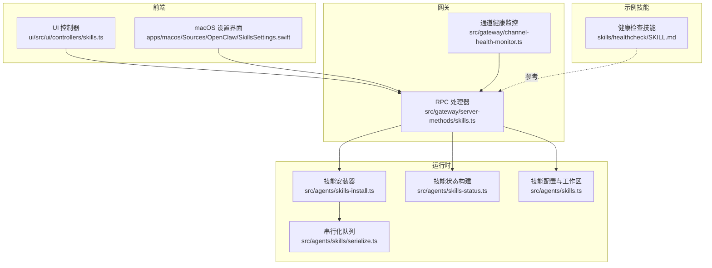
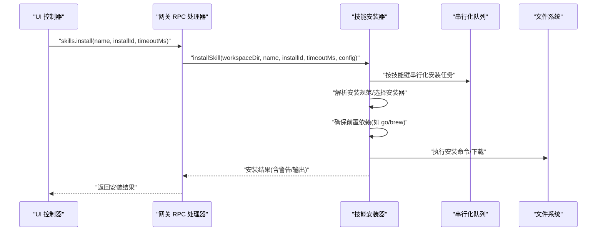
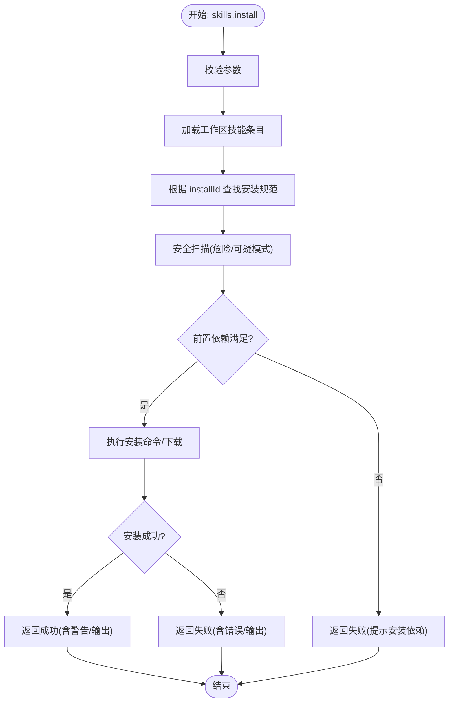
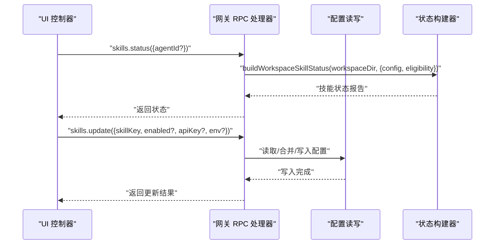
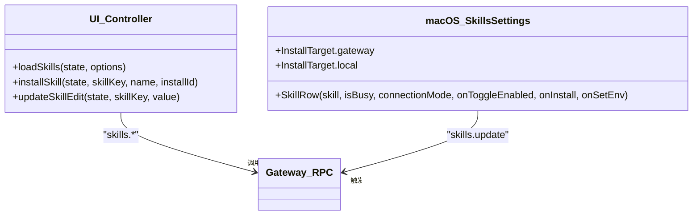
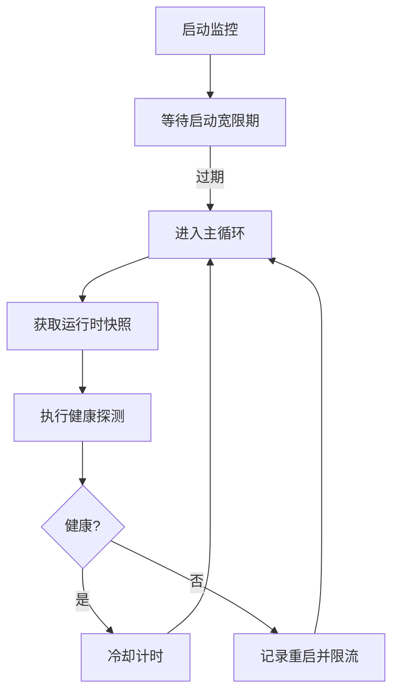
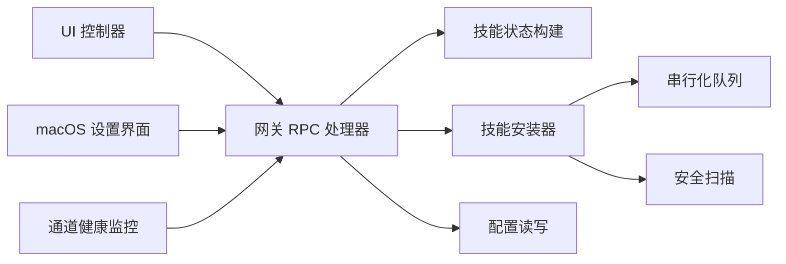

# 技能管理

<cite>
**本文引用的文件**
- [src/gateway/server-methods/skills.ts](file://src/gateway/server-methods/skills.ts)
- [src/agents/skills-install.ts](file://src/agents/skills-install.ts)
- [src/agents/skills-status.ts](file://src/agents/skills-status.ts)
- [src/agents/skills.ts](file://src/agents/skills.ts)
- [src/agents/skills/serialize.ts](file://src/agents/skills/serialize.ts)
- [ui/src/ui/controllers/skills.ts](file://ui/src/ui/controllers/skills.ts)
- [apps/macos/Sources/OpenClaw/SkillsSettings.swift](file://apps/macos/Sources/OpenClaw/SkillsSettings.swift)
- [apps/macos/Sources/OpenClaw/HealthStore.swift](file://apps/macos/Sources/OpenClaw/HealthStore.swift)
- [src/gateway/channel-health-monitor.ts](file://src/gateway/channel-health-monitor.ts)
- [skills/healthcheck/SKILL.md](file://skills/healthcheck/SKILL.md)
- [src/commands/health.snapshot.test.ts](file://src/commands/health.snapshot.test.ts)
- [src/agents/test-helpers/skill-plugin-fixtures.ts](file://src/agents/test-helpers/skill-plugin-fixtures.ts)
</cite>

## 目录

1. [简介](#简介)
2. [项目结构](#项目结构)
3. [核心组件](#核心组件)
4. [架构总览](#架构总览)
5. [详细组件分析](#详细组件分析)
6. [依赖关系分析](#依赖关系分析)
7. [性能考量](#性能考量)
8. [故障排查指南](#故障排查指南)
9. [结论](#结论)
10. [附录](#附录)

## 简介

本文件系统性阐述 OpenClaw 的“技能管理”能力，覆盖技能的安装、更新、卸载与版本管理；技能配置的动态修改与持久化；技能状态监控与健康检查；冲突检测与解决策略；批量管理与自动化脚本使用；以及技能备份、迁移与恢复的完整流程。内容面向不同技术背景读者，既提供高层概览也给出可追溯到源码的参考路径。

## 项目结构

围绕技能管理的关键代码分布在以下模块：

- 网关 RPC 方法：提供技能状态查询、安装、更新等接口
- 技能运行时与扫描：负责安装执行、安全扫描、环境准备
- 前端控制器：封装 UI 与网关之间的请求/响应
- macOS 设置界面：展示技能状态、安装目标与环境变量编辑
- 健康检查与通道监控：保障技能运行稳定性
- 示例技能：提供健康检查等参考实现

图表来源

- [src/gateway/server-methods/skills.ts:57-204](file://src/gateway/server-methods/skills.ts#L57-L204)
- [src/agents/skills-install.ts:392-471](file://src/agents/skills-install.ts#L392-L471)
- [src/agents/skills-status.ts:227-254](file://src/agents/skills-status.ts#L227-L254)
- [src/agents/skills.ts:36-47](file://src/agents/skills.ts#L36-L47)
- [src/agents/skills/serialize.ts:1-14](file://src/agents/skills/serialize.ts#L1-L14)
- [ui/src/ui/controllers/skills.ts:39-72](file://ui/src/ui/controllers/skills.ts#L39-L72)
- [apps/macos/Sources/OpenClaw/SkillsSettings.swift:163-208](file://apps/macos/Sources/OpenClaw/SkillsSettings.swift#L163-L208)
- [apps/macos/Sources/OpenClaw/HealthStore.swift:147-163](file://apps/macos/Sources/OpenClaw/HealthStore.swift#L147-L163)
- [src/gateway/channel-health-monitor.ts:76-111](file://src/gateway/channel-health-monitor.ts#L76-L111)
- [skills/healthcheck/SKILL.md:1-246](file://skills/healthcheck/SKILL.md#L1-L246)

章节来源

- [src/gateway/server-methods/skills.ts:57-204](file://src/gateway/server-methods/skills.ts#L57-L204)
- [src/agents/skills-install.ts:392-471](file://src/agents/skills-install.ts#L392-L471)
- [src/agents/skills-status.ts:227-254](file://src/agents/skills-status.ts#L227-L254)
- [src/agents/skills.ts:36-47](file://src/agents/skills.ts#L36-L47)
- [src/agents/skills/serialize.ts:1-14](file://src/agents/skills/serialize.ts#L1-L14)
- [ui/src/ui/controllers/skills.ts:39-72](file://ui/src/ui/controllers/skills.ts#L39-L72)
- [apps/macos/Sources/OpenClaw/SkillsSettings.swift:163-208](file://apps/macos/Sources/OpenClaw/SkillsSettings.swift#L163-L208)
- [apps/macos/Sources/OpenClaw/HealthStore.swift:147-163](file://apps/macos/Sources/OpenClaw/HealthStore.swift#L147-L163)
- [src/gateway/channel-health-monitor.ts:76-111](file://src/gateway/channel-health-monitor.ts#L76-L111)
- [skills/healthcheck/SKILL.md:1-246](file://skills/healthcheck/SKILL.md#L1-L246)

## 核心组件

- 网关 RPC 技能处理器：提供 skills.status、skills.bins、skills.install、skills.update 等方法，负责参数校验、加载配置、调用运行时逻辑，并写回配置文件
- 技能安装器：解析安装规范、选择安装器（brew/npm/yarn/pnpm/go/uv/download）、处理前置依赖（如 go/brew 缺失）、执行命令并返回结果
- 技能状态构建器：汇总技能元数据、平台要求、缺失项、允许列表、远程可用性、安装选项等，生成状态报告
- 前端控制器：封装 UI 与网关交互，支持加载状态、安装、更新、错误提示与消息展示
- macOS 设置界面：展示技能条目、缺失依赖、启用/禁用、安装目标（网关/本地）与环境变量编辑
- 健康检查与通道监控：周期性探测通道健康，记录重启与冷却策略，辅助技能运行稳定性
- 示例技能：健康检查技能提供可复用的工作流模板与最佳实践

章节来源

- [src/gateway/server-methods/skills.ts:57-204](file://src/gateway/server-methods/skills.ts#L57-L204)
- [src/agents/skills-install.ts:392-471](file://src/agents/skills-install.ts#L392-L471)
- [src/agents/skills-status.ts:227-254](file://src/agents/skills-status.ts#L227-L254)
- [ui/src/ui/controllers/skills.ts:39-72](file://ui/src/ui/controllers/skills.ts#L39-L72)
- [apps/macos/Sources/OpenClaw/SkillsSettings.swift:163-208](file://apps/macos/Sources/OpenClaw/SkillsSettings.swift#L163-L208)
- [apps/macos/Sources/OpenClaw/HealthStore.swift:147-163](file://apps/macos/Sources/OpenClaw/HealthStore.swift#L147-L163)
- [src/gateway/channel-health-monitor.ts:76-111](file://src/gateway/channel-health-monitor.ts#L76-L111)
- [skills/healthcheck/SKILL.md:1-246](file://skills/healthcheck/SKILL.md#L1-L246)

## 架构总览

下图展示从 UI 到网关再到运行时的技能管理调用链路，以及安装过程中的前置依赖处理与安全扫描。

图表来源

- [ui/src/ui/controllers/skills.ts:125-157](file://ui/src/ui/controllers/skills.ts#L125-L157)
- [src/gateway/server-methods/skills.ts:114-145](file://src/gateway/server-methods/skills.ts#L114-L145)
- [src/agents/skills-install.ts:392-471](file://src/agents/skills-install.ts#L392-L471)
- [src/agents/skills/serialize.ts:1-14](file://src/agents/skills/serialize.ts#L1-L14)

## 详细组件分析

### 组件A：技能安装流程

- 参数校验与默认值：校验 name/installId/timeoutMs，解析默认 Agent 工作区目录
- 安装执行：解析安装规范、选择安装器、处理前置依赖（如 go/brew 缺失场景）、执行命令或下载
- 安全扫描：对技能目录进行扫描，收集危险/可疑模式并作为警告返回
- 结果返回：成功/失败、标准输出/错误、退出码与警告集合

图表来源

- [src/gateway/server-methods/skills.ts:114-145](file://src/gateway/server-methods/skills.ts#L114-L145)
- [src/agents/skills-install.ts:392-471](file://src/agents/skills-install.ts#L392-L471)

章节来源

- [src/gateway/server-methods/skills.ts:114-145](file://src/gateway/server-methods/skills.ts#L114-L145)
- [src/agents/skills-install.ts:392-471](file://src/agents/skills-install.ts#L392-L471)

### 组件B：技能状态与配置更新

- 状态查询：解析 agentId/工作区，构建技能状态报告，包含名称、描述、来源、是否内置、文件路径、技能键、需求、缺失项、配置检查、安装选项等
- 配置更新：支持启用/禁用、API Key、环境变量的增量更新，写回配置文件并返回最新配置快照

图表来源

- [src/gateway/server-methods/skills.ts:58-90](file://src/gateway/server-methods/skills.ts#L58-L90)
- [src/gateway/server-methods/skills.ts:146-204](file://src/gateway/server-methods/skills.ts#L146-L204)
- [src/agents/skills-status.ts:227-254](file://src/agents/skills-status.ts#L227-L254)

章节来源

- [src/gateway/server-methods/skills.ts:58-90](file://src/gateway/server-methods/skills.ts#L58-L90)
- [src/gateway/server-methods/skills.ts:146-204](file://src/gateway/server-methods/skills.ts#L146-L204)
- [src/agents/skills-status.ts:227-254](file://src/agents/skills-status.ts#L227-L254)

### 组件C：UI 与 macOS 设置集成

- UI 控制器：封装加载技能状态、安装技能、更新编辑、错误处理与消息展示
- macOS 设置界面：展示技能元信息、缺失依赖摘要、启用/禁用开关、安装目标（网关/本地）、环境变量编辑入口

图表来源

- [ui/src/ui/controllers/skills.ts:39-72](file://ui/src/ui/controllers/skills.ts#L39-L72)
- [ui/src/ui/controllers/skills.ts:125-157](file://ui/src/ui/controllers/skills.ts#L125-L157)
- [apps/macos/Sources/OpenClaw/SkillsSettings.swift:163-208](file://apps/macos/Sources/OpenClaw/SkillsSettings.swift#L163-L208)

章节来源

- [ui/src/ui/controllers/skills.ts:39-72](file://ui/src/ui/controllers/skills.ts#L39-L72)
- [ui/src/ui/controllers/skills.ts:125-157](file://ui/src/ui/controllers/skills.ts#L125-L157)
- [apps/macos/Sources/OpenClaw/SkillsSettings.swift:163-208](file://apps/macos/Sources/OpenClaw/SkillsSettings.swift#L163-L208)

### 组件D：健康检查与通道监控

- 通道健康监控：周期性采集运行时快照，应用冷却与重启限制策略，避免频繁重启导致抖动
- 健康状态描述：针对超时、状态码异常、探针失败等情况提供可读性描述
- 测试验证：通过测试用例验证心跳间隔与敏感信息包含策略

图表来源

- [src/gateway/channel-health-monitor.ts:76-111](file://src/gateway/channel-health-monitor.ts#L76-L111)
- [apps/macos/Sources/OpenClaw/HealthStore.swift:147-163](file://apps/macos/Sources/OpenClaw/HealthStore.swift#L147-L163)
- [src/commands/health.snapshot.test.ts:243-253](file://src/commands/health.snapshot.test.ts#L243-L253)

章节来源

- [src/gateway/channel-health-monitor.ts:76-111](file://src/gateway/channel-health-monitor.ts#L76-L111)
- [apps/macos/Sources/OpenClaw/HealthStore.swift:147-163](file://apps/macos/Sources/OpenClaw/HealthStore.swift#L147-L163)
- [src/commands/health.snapshot.test.ts:243-253](file://src/commands/health.snapshot.test.ts#L243-L253)

### 组件E：示例技能与最佳实践

- 健康检查技能：提供主机加固、风险容忍度评估、审计与版本检查、周期性任务调度等完整工作流
- 使用建议：在需要安全审计、防火墙/SSH/更新加固、版本状态检查等场景下优先使用该技能

章节来源

- [skills/healthcheck/SKILL.md:1-246](file://skills/healthcheck/SKILL.md#L1-L246)

## 依赖关系分析

- 网关层依赖运行时模块：skills.ts 提供配置解析与工作区工具；skills-status.ts 负责状态构建；skills-install.ts 负责安装执行
- 安装器内部依赖：串行化队列保证同一技能键的安装串行化，避免并发冲突；安全扫描模块用于安装前/后扫描
- 前端与 macOS：UI 控制器通过 RPC 与网关交互；macOS 设置界面直接触发更新与安装目标切换
- 健康监控：通道健康监控与健康状态描述相互配合，保障系统稳定性

图表来源

- [src/gateway/server-methods/skills.ts:57-204](file://src/gateway/server-methods/skills.ts#L57-L204)
- [src/agents/skills-install.ts:392-471](file://src/agents/skills-install.ts#L392-L471)
- [src/agents/skills-status.ts:227-254](file://src/agents/skills-status.ts#L227-L254)
- [src/agents/skills/serialize.ts:1-14](file://src/agents/skills/serialize.ts#L1-L14)
- [ui/src/ui/controllers/skills.ts:39-72](file://ui/src/ui/controllers/skills.ts#L39-L72)
- [apps/macos/Sources/OpenClaw/SkillsSettings.swift:163-208](file://apps/macos/Sources/OpenClaw/SkillsSettings.swift#L163-L208)
- [src/gateway/channel-health-monitor.ts:76-111](file://src/gateway/channel-health-monitor.ts#L76-L111)

章节来源

- [src/gateway/server-methods/skills.ts:57-204](file://src/gateway/server-methods/skills.ts#L57-L204)
- [src/agents/skills-install.ts:392-471](file://src/agents/skills-install.ts#L392-L471)
- [src/agents/skills-status.ts:227-254](file://src/agents/skills-status.ts#L227-L254)
- [src/agents/skills/serialize.ts:1-14](file://src/agents/skills/serialize.ts#L1-L14)
- [ui/src/ui/controllers/skills.ts:39-72](file://ui/src/ui/controllers/skills.ts#L39-L72)
- [apps/macos/Sources/OpenClaw/SkillsSettings.swift:163-208](file://apps/macos/Sources/OpenClaw/SkillsSettings.swift#L163-L208)
- [src/gateway/channel-health-monitor.ts:76-111](file://src/gateway/channel-health-monitor.ts#L76-L111)

## 性能考量

- 并发控制：通过串行化队列按技能键串行化安装任务，避免资源竞争与重复安装
- 超时与重试：安装器统一设置最小/最大超时范围，命令执行采用带超时的进程调用
- 前置依赖处理：尽量在本地已具备 brew/go 环境时才尝试安装，减少失败重试成本
- 健康监控：通道健康监控引入冷却与重启限制，降低抖动与资源消耗

章节来源

- [src/agents/skills/serialize.ts:1-14](file://src/agents/skills/serialize.ts#L1-L14)
- [src/agents/skills-install.ts:392-471](file://src/agents/skills-install.ts#L392-L471)
- [src/gateway/channel-health-monitor.ts:76-111](file://src/gateway/channel-health-monitor.ts#L76-L111)

## 故障排查指南

- 安装失败
  - 检查安装规范是否存在、安装器类型是否受支持
  - 若提示缺少 brew/go，请先在本地安装对应工具
  - 查看安装器返回的错误/输出，定位具体失败原因
- 状态异常
  - 使用 skills.status 获取技能状态报告，关注 missing 字段与 configChecks
  - 确认配置文件中 enabled/env/apiKey 是否正确
- 健康问题
  - 观察通道健康监控日志，确认是否存在超时或频繁重启
  - 使用健康检查技能进行系统级审计与版本检查
- 权限与环境
  - macOS 设置界面可切换安装目标（网关/本地），并编辑环境变量
  - 确保运行用户具备必要的权限（如 sudo/apt）

章节来源

- [src/gateway/server-methods/skills.ts:114-145](file://src/gateway/server-methods/skills.ts#L114-L145)
- [src/agents/skills-install.ts:392-471](file://src/agents/skills-install.ts#L392-L471)
- [apps/macos/Sources/OpenClaw/SkillsSettings.swift:163-208](file://apps/macos/Sources/OpenClaw/SkillsSettings.swift#L163-L208)
- [apps/macos/Sources/OpenClaw/HealthStore.swift:147-163](file://apps/macos/Sources/OpenClaw/HealthStore.swift#L147-L163)
- [skills/healthcheck/SKILL.md:1-246](file://skills/healthcheck/SKILL.md#L1-L246)

## 结论

OpenClaw 的技能管理体系以网关 RPC 为核心，结合运行时安装器、状态构建器与 UI 集成，实现了从安装、更新到状态监控与健康检查的闭环。通过串行化队列、前置依赖处理与安全扫描，系统在易用性与安全性之间取得平衡。示例技能为复杂运维场景提供了可复用的参考模板。

## 附录

### 技能安装、更新、卸载与版本管理

- 安装：skills.install 接口支持指定 installId 与超时；安装器自动选择安装器并处理前置依赖
- 更新：skills.update 支持启用/禁用、API Key、环境变量的增量更新；更新后立即写回配置
- 卸载：当前仓库未提供专用卸载接口；可通过禁用与清理环境变量的方式达到类似效果
- 版本管理：示例技能健康检查提供版本状态检查与周期性任务调度建议

章节来源

- [src/gateway/server-methods/skills.ts:114-145](file://src/gateway/server-methods/skills.ts#L114-L145)
- [src/gateway/server-methods/skills.ts:146-204](file://src/gateway/server-methods/skills.ts#L146-L204)
- [skills/healthcheck/SKILL.md:169-203](file://skills/healthcheck/SKILL.md#L169-L203)

### 技能配置的动态修改与持久化

- 动态修改：skills.update 支持按需修改 enabled/env/apiKey
- 持久化：更新后写回配置文件，确保重启后生效
- UI 集成：macOS 设置界面支持环境变量编辑与安装目标切换

章节来源

- [src/gateway/server-methods/skills.ts:146-204](file://src/gateway/server-methods/skills.ts#L146-L204)
- [apps/macos/Sources/OpenClaw/SkillsSettings.swift:163-208](file://apps/macos/Sources/OpenClaw/SkillsSettings.swift#L163-L208)

### 技能状态监控与健康检查

- 状态报告：skills.status 返回技能清单与状态摘要
- 健康监控：通道健康监控定期探测并应用冷却/重启策略
- 健康描述：针对超时、状态码异常等提供可读性描述

章节来源

- [src/gateway/server-methods/skills.ts:58-90](file://src/gateway/server-methods/skills.ts#L58-L90)
- [src/gateway/channel-health-monitor.ts:76-111](file://src/gateway/channel-health-monitor.ts#L76-L111)
- [apps/macos/Sources/OpenClaw/HealthStore.swift:147-163](file://apps/macos/Sources/OpenClaw/HealthStore.swift#L147-L163)

### 技能冲突检测与解决策略

- 冲突检测：状态构建器会计算缺失项与配置检查，识别不满足平台/环境条件的技能
- 解决策略：优先选择合适的安装器（如 brew 可用时优先），或通过 download 方式绕过系统包管理器

章节来源

- [src/agents/skills-status.ts:61-103](file://src/agents/skills-status.ts#L61-L103)
- [src/agents/skills-status.ts:105-167](file://src/agents/skills-status.ts#L105-L167)

### 批量管理与自动化脚本使用

- 批量安装：通过循环调用 skills.install 实现批量安装
- 自动化：健康检查技能提供周期性任务调度建议，可结合 cron 工具实现自动化

章节来源

- [skills/healthcheck/SKILL.md:169-203](file://skills/healthcheck/SKILL.md#L169-L203)

### 技能备份、迁移与恢复

- 备份：技能状态与配置文件可作为备份对象
- 迁移：通过复制配置文件与技能目录实现迁移
- 恢复：在新环境重新安装缺失依赖并执行 skills.update 恢复配置

章节来源

- [src/gateway/server-methods/skills.ts:146-204](file://src/gateway/server-methods/skills.ts#L146-L204)
