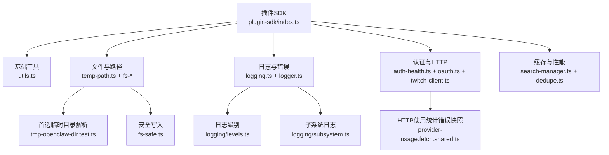
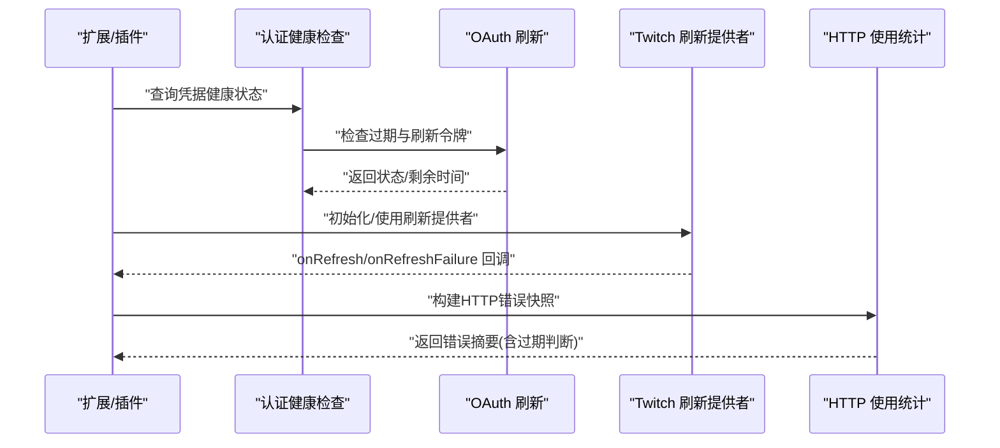
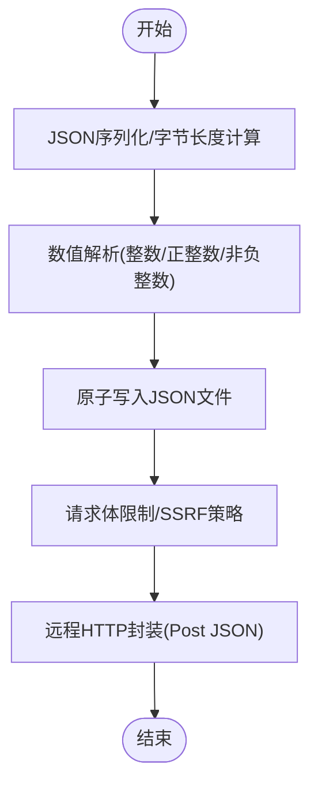
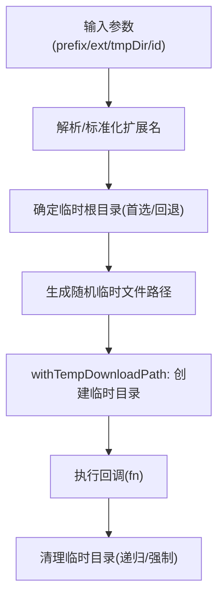
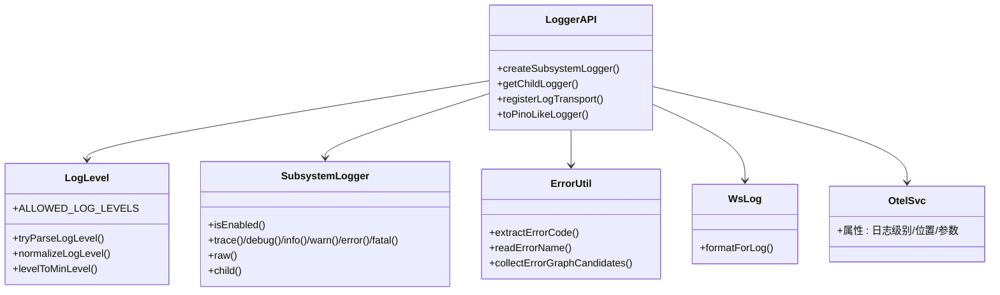
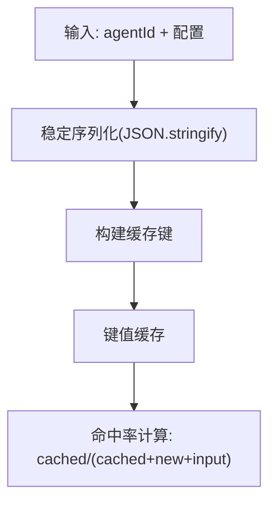
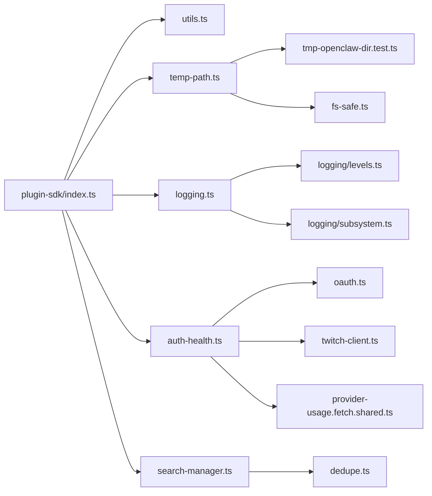

# 实用工具API

<cite>
**本文引用的文件**
- [src/plugin-sdk/index.ts](file://src/plugin-sdk/index.ts)
- [src/utils.ts](file://src/utils.ts)
- [src/infra/json-utf8-bytes.ts](file://src/infra/json-utf8-bytes.ts)
- [src/infra/parse-finite-number.ts](file://src/infra/parse-finite-number.ts)
- [src/plugin-sdk/temp-path.ts](file://src/plugin-sdk/temp-path.ts)
- [src/infra/tmp-openclaw-dir.test.ts](file://src/infra/tmp-openclaw-dir.test.ts)
- [src/infra/fs-pinned-write-helper.ts](file://src/infra/fs-pinned-write-helper.ts)
- [src/agents/sandbox/fs-bridge-mutation-helper.ts](file://src/agents/sandbox/fs-bridge-mutation-helper.ts)
- [src/cli/nodes-media-utils.ts](file://src/cli/nodes-media-utils.ts)
- [src/infra/fs-safe.ts](file://src/infra/fs-safe.ts)
- [src/logging.ts](file://src/logging.ts)
- [src/logger.ts](file://src/logger.ts)
- [src/logging/levels.ts](file://src/logging/levels.ts)
- [src/logging/subsystem.ts](file://src/logging/subsystem.ts)
- [src/gateway/ws-log.ts](file://src/gateway/ws-log.ts)
- [src/infra/errors.ts](file://src/infra/errors.ts)
- [extensions/diagnostics-otel/src/service.ts](file://extensions/diagnostics-otel/src/service.ts)
- [src/agents/auth-health.ts](file://src/agents/auth-health.ts)
- [src/agents/auth-profiles/oauth.ts](file://src/agents/auth-profiles/oauth.ts)
- [extensions/twitch/src/twitch-client.ts](file://extensions/twitch/src/twitch-client.ts)
- [src/infra/provider-usage.fetch.shared.ts](file://src/infra/provider-usage.fetch.shared.ts)
- [src/memory/search-manager.ts](file://src/memory/search-manager.ts)
- [src/infra/dedupe.ts](file://src/infra/dedupe.ts)
- [src/memory/post-json.ts](file://src/memory/post-json.ts)
- [src/gateway/test-http-response.ts](file://src/gateway/test-http-response.ts)
- [extensions/mattermost/src/mattermost/interactions.ts](file://extensions/mattermost/src/mattermost/interactions.ts)
- [src/test-utils/mock-http-response.ts](file://src/test-utils/mock-http-response.ts)
- [src/discord/test-http-helpers.ts](file://src/discord/test-http-helpers.ts)
</cite>

## 目录

1. [简介](#简介)
2. [项目结构](#项目结构)
3. [核心组件](#核心组件)
4. [架构总览](#架构总览)
5. [详细组件分析](#详细组件分析)
6. [依赖关系分析](#依赖关系分析)
7. [性能考量](#性能考量)
8. [故障排查指南](#故障排查指南)
9. [结论](#结论)
10. [附录](#附录)

## 简介

本文件为 OpenClaw 插件开发中的“实用工具API”参考文档，聚焦于插件开发常用辅助能力，覆盖以下主题：

- OAuth 认证与令牌刷新：认证流程管理、令牌获取与刷新机制
- HTTP 请求与数据处理：序列化/反序列化、格式转换、SSRF 防护与限流
- 文件与路径管理：临时文件、下载目录、安全写入、路径解析
- 日志与错误追踪：日志级别、子系统日志、错误提取与诊断
- 内存与缓存：去重缓存、键值缓存、命中率统计
- 性能优化与最佳实践：超时控制、限流、资源清理

## 项目结构

实用工具API主要分布在以下模块：

- 插件SDK入口导出：统一对外暴露常用工具函数与类型
- 基础工具：字符串/数值/路径/时间等通用工具
- 文件与路径：临时目录解析、安全写入、沙箱桥接
- 日志与错误：日志子系统、级别解析、错误提取
- 认证与HTTP：OAuth健康检查、令牌刷新、SSRF防护、请求体限制
- 缓存与性能：去重缓存、键值缓存、命中率统计

```mermaid
graph TB
subgraph "插件SDK"
SDK["plugin-sdk/index.ts"]
end
subgraph "基础工具"
Utils["utils.ts"]
JsonUtf8["infra/json-utf8-bytes.ts"]
ParseNum["infra/parse-finite-number.ts"]
end
subgraph "文件与路径"
TempPath["plugin-sdk/temp-path.ts"]
TmpDirTest["infra/tmp-openclaw-dir.test.ts"]
FsPinned["infra/fs-pinned-write-helper.ts"]
FsBridge["agents/sandbox/fs-bridge-mutation-helper.ts"]
NodesMedia["cli/nodes-media-utils.ts"]
FsSafe["infra/fs-safe.ts"]
end
subgraph "日志与错误"
LogAPI["logging.ts"]
LogLevels["logging/levels.ts"]
LogSubsys["logging/subsystem.ts"]
LogErr["logger.ts"]
WsLog["gateway/ws-log.ts"]
ErrUtil["infra/errors.ts"]
OtelSvc["extensions/diagnostics-otel/src/service.ts"]
end
subgraph "认证与HTTP"
AuthHealth["agents/auth-health.ts"]
OAuth["agents/auth-profiles/oauth.ts"]
TwitchCli["extensions/twitch/src/twitch-client.ts"]
UsageFetch["infra/provider-usage.fetch.shared.ts"]
end
subgraph "缓存与性能"
SearchMgr["memory/search-manager.ts"]
Dedupe["infra/dedupe.ts"]
PostJson["memory/post-json.ts"]
end
SDK --> Utils
SDK --> TempPath
SDK --> LogAPI
SDK --> AuthHealth
SDK --> SearchMgr
SDK --> PostJson
TempPath --> TmpDirTest
TempPath --> FsPinned
TempPath --> FsBridge
TempPath --> NodesMedia
TempPath --> FsSafe
LogAPI --> LogLevels
LogAPI --> LogSubsys
LogAPI --> LogErr
LogAPI --> WsLog
LogAPI --> ErrUtil
LogAPI --> OtelSvc
AuthHealth --> OAuth
AuthHealth --> TwitchCli
AuthHealth --> UsageFetch
SearchMgr --> Dedupe
```

**图表来源**

- [src/plugin-sdk/index.ts:1-826](file://src/plugin-sdk/index.ts#L1-L826)
- [src/utils.ts:1-395](file://src/utils.ts#L1-L395)
- [src/plugin-sdk/temp-path.ts:43-84](file://src/plugin-sdk/temp-path.ts#L43-L84)
- [src/infra/tmp-openclaw-dir.test.ts:92-210](file://src/infra/tmp-openclaw-dir.test.ts#L92-L210)
- [src/infra/fs-pinned-write-helper.ts:50-87](file://src/infra/fs-pinned-write-helper.ts#L50-L87)
- [src/agents/sandbox/fs-bridge-mutation-helper.ts:49-83](file://src/agents/sandbox/fs-bridge-mutation-helper.ts#L49-L83)
- [src/cli/nodes-media-utils.ts:1-35](file://src/cli/nodes-media-utils.ts#L1-L35)
- [src/infra/fs-safe.ts:296-330](file://src/infra/fs-safe.ts#L296-L330)
- [src/logging.ts:1-70](file://src/logging.ts#L1-L70)
- [src/logging/levels.ts:1-37](file://src/logging/levels.ts#L1-L37)
- [src/logging/subsystem.ts:371-425](file://src/logging/subsystem.ts#L371-L425)
- [src/logger.ts:48-85](file://src/logger.ts#L48-L85)
- [src/gateway/ws-log.ts:102-142](file://src/gateway/ws-log.ts#L102-L142)
- [src/infra/errors.ts:1-52](file://src/infra/errors.ts#L1-L52)
- [extensions/diagnostics-otel/src/service.ts:316-352](file://extensions/diagnostics-otel/src/service.ts#L316-L352)
- [src/agents/auth-health.ts:165-197](file://src/agents/auth-health.ts#L165-L197)
- [src/agents/auth-profiles/oauth.ts:473-487](file://src/agents/auth-profiles/oauth.ts#L473-L487)
- [extensions/twitch/src/twitch-client.ts:34-72](file://extensions/twitch/src/twitch-client.ts#L34-L72)
- [src/infra/provider-usage.fetch.shared.ts:1-52](file://src/infra/provider-usage.fetch.shared.ts#L1-L52)
- [src/memory/search-manager.ts:239-252](file://src/memory/search-manager.ts#L239-L252)
- [src/infra/dedupe.ts:1-80](file://src/infra/dedupe.ts#L1-L80)
- [src/memory/post-json.ts:1-35](file://src/memory/post-json.ts#L1-L35)

**章节来源**

- [src/plugin-sdk/index.ts:1-826](file://src/plugin-sdk/index.ts#L1-L826)

## 核心组件

- 插件SDK统一导出：提供 OAuth 工具、HTTP 路由注册、Webhook 处理、SSRF 策略、JSON 存取、临时路径、运行时环境、诊断事件等能力
- 基础工具：字符串/正则转义、安全 JSON 解析、数值解析、路径解析与显示、UTF-16 安全切片、睡眠等待等
- 文件与路径：随机临时文件路径生成、带清理的临时下载目录、首选临时目录解析、安全原子写入、沙箱内临时文件/目录分配
- 日志与错误：日志级别解析与最小阈值映射、子系统日志器、原始日志输出、错误码/名称提取、日志格式化与位置信息
- 认证与HTTP：OAuth 健康状态汇总、令牌刷新失败提示、Twitch 刷新提供者集成、HTTP 使用统计错误快照构建、SSRF 防护与主机白名单
- 缓存与性能：键值缓存键构建、去重缓存（TTL/容量）、命中率统计

**章节来源**

- [src/plugin-sdk/index.ts:133-472](file://src/plugin-sdk/index.ts#L133-L472)
- [src/utils.ts:13-395](file://src/utils.ts#L13-L395)
- [src/plugin-sdk/temp-path.ts:43-84](file://src/plugin-sdk/temp-path.ts#L43-L84)
- [src/infra/tmp-openclaw-dir.test.ts:92-210](file://src/infra/tmp-openclaw-dir.test.ts#L92-L210)
- [src/infra/fs-pinned-write-helper.ts:50-87](file://src/infra/fs-pinned-write-helper.ts#L50-L87)
- [src/agents/sandbox/fs-bridge-mutation-helper.ts:49-83](file://src/agents/sandbox/fs-bridge-mutation-helper.ts#L49-L83)
- [src/cli/nodes-media-utils.ts:1-35](file://src/cli/nodes-media-utils.ts#L1-L35)
- [src/infra/fs-safe.ts:296-330](file://src/infra/fs-safe.ts#L296-L330)
- [src/logging.ts:1-70](file://src/logging.ts#L1-L70)
- [src/logging/levels.ts:1-37](file://src/logging/levels.ts#L1-L37)
- [src/logging/subsystem.ts:371-425](file://src/logging/subsystem.ts#L371-L425)
- [src/logger.ts:48-85](file://src/logger.ts#L48-L85)
- [src/gateway/ws-log.ts:102-142](file://src/gateway/ws-log.ts#L102-L142)
- [src/infra/errors.ts:1-52](file://src/infra/errors.ts#L1-L52)
- [extensions/diagnostics-otel/src/service.ts:316-352](file://extensions/diagnostics-otel/src/service.ts#L316-L352)
- [src/agents/auth-health.ts:165-197](file://src/agents/auth-health.ts#L165-L197)
- [src/agents/auth-profiles/oauth.ts:473-487](file://src/agents/auth-profiles/oauth.ts#L473-L487)
- [extensions/twitch/src/twitch-client.ts:34-72](file://extensions/twitch/src/twitch-client.ts#L34-L72)
- [src/infra/provider-usage.fetch.shared.ts:1-52](file://src/infra/provider-usage.fetch.shared.ts#L1-L52)
- [src/memory/search-manager.ts:239-252](file://src/memory/search-manager.ts#L239-L252)
- [src/infra/dedupe.ts:1-80](file://src/infra/dedupe.ts#L1-L80)
- [src/memory/post-json.ts:1-35](file://src/memory/post-json.ts#L1-L35)

## 架构总览

实用工具API围绕“插件SDK”作为统一入口，向下连接基础工具、文件系统、日志、认证与HTTP、缓存与性能等子系统。

**图表来源**

- [src/plugin-sdk/index.ts:1-826](file://src/plugin-sdk/index.ts#L1-L826)
- [src/utils.ts:1-395](file://src/utils.ts#L1-L395)
- [src/plugin-sdk/temp-path.ts:43-84](file://src/plugin-sdk/temp-path.ts#L43-L84)
- [src/infra/tmp-openclaw-dir.test.ts:92-210](file://src/infra/tmp-openclaw-dir.test.ts#L92-L210)
- [src/infra/fs-safe.ts:296-330](file://src/infra/fs-safe.ts#L296-L330)
- [src/logging.ts:1-70](file://src/logging.ts#L1-L70)
- [src/logging/levels.ts:1-37](file://src/logging/levels.ts#L1-L37)
- [src/logging/subsystem.ts:371-425](file://src/logging/subsystem.ts#L371-L425)
- [src/agents/auth-health.ts:165-197](file://src/agents/auth-health.ts#L165-L197)
- [src/agents/auth-profiles/oauth.ts:473-487](file://src/agents/auth-profiles/oauth.ts#L473-L487)
- [extensions/twitch/src/twitch-client.ts:34-72](file://extensions/twitch/src/twitch-client.ts#L34-L72)
- [src/infra/provider-usage.fetch.shared.ts:1-52](file://src/infra/provider-usage.fetch.shared.ts#L1-L52)
- [src/memory/search-manager.ts:239-252](file://src/memory/search-manager.ts#L239-L252)
- [src/infra/dedupe.ts:1-80](file://src/infra/dedupe.ts#L1-L80)

## 详细组件分析

### OAuth 认证与令牌刷新

- 认证健康检查：根据过期时间与刷新令牌状态判定 OAuth 凭据健康度，避免对可自动续期的凭据发出过早警告
- 令牌刷新失败处理：捕获刷新错误，拼装可读提示与医生建议，抛出带原因的错误
- Twitch 刷新提供者：基于刷新提供者自动维护访问令牌，监听刷新成功/失败事件并记录日志
- HTTP 使用统计错误快照：根据状态码判断令牌是否过期，生成标准化错误快照

**图表来源**

- [src/agents/auth-health.ts:165-197](file://src/agents/auth-health.ts#L165-L197)
- [src/agents/auth-profiles/oauth.ts:473-487](file://src/agents/auth-profiles/oauth.ts#L473-L487)
- [extensions/twitch/src/twitch-client.ts:34-72](file://extensions/twitch/src/twitch-client.ts#L34-L72)
- [src/infra/provider-usage.fetch.shared.ts:31-52](file://src/infra/provider-usage.fetch.shared.ts#L31-L52)

**章节来源**

- [src/agents/auth-health.ts:165-197](file://src/agents/auth-health.ts#L165-L197)
- [src/agents/auth-profiles/oauth.ts:473-487](file://src/agents/auth-profiles/oauth.ts#L473-L487)
- [extensions/twitch/src/twitch-client.ts:34-72](file://extensions/twitch/src/twitch-client.ts#L34-L72)
- [src/infra/provider-usage.fetch.shared.ts:1-52](file://src/infra/provider-usage.fetch.shared.ts#L1-L52)

### HTTP 请求与数据处理

- JSON 序列化字节长度：安全计算 UTF-8 字节长度，回退到字符串形式
- 数值解析：严格整数/正整数/非负整数解析，避免 NaN/Infinity
- JSON 安全读取：原子写入 JSON 文件，支持模式与权限设置
- 请求体限制与SSRF防护：Webhook 请求体大小限制、HTTPS 主机后缀白名单、私有地址阻断
- 远程HTTP封装：POST JSON 封装，统一响应处理与错误前缀

**图表来源**

- [src/infra/json-utf8-bytes.ts:1-8](file://src/infra/json-utf8-bytes.ts#L1-L8)
- [src/infra/parse-finite-number.ts:1-43](file://src/infra/parse-finite-number.ts#L1-L43)
- [src/plugin-sdk/index.ts:359-359](file://src/plugin-sdk/index.ts#L359-L359)
- [src/plugin-sdk/index.ts:431-447](file://src/plugin-sdk/index.ts#L431-L447)
- [src/memory/post-json.ts:1-35](file://src/memory/post-json.ts#L1-L35)

**章节来源**

- [src/infra/json-utf8-bytes.ts:1-8](file://src/infra/json-utf8-bytes.ts#L1-L8)
- [src/infra/parse-finite-number.ts:1-43](file://src/infra/parse-finite-number.ts#L1-L43)
- [src/plugin-sdk/index.ts:359-359](file://src/plugin-sdk/index.ts#L359-L359)
- [src/plugin-sdk/index.ts:431-447](file://src/plugin-sdk/index.ts#L431-L447)
- [src/memory/post-json.ts:1-35](file://src/memory/post-json.ts#L1-L35)

### 文件操作、路径管理与临时文件

- 随机临时文件路径：前缀、扩展名、时间戳、UUID 组合，确保唯一性
- 临时下载目录：创建临时目录，执行回调后清理，异常安全
- 首选 OpenClaw 临时目录：优先使用 /tmp/openclaw，回退至 os.tmpdir()/openclaw 并进行安全校验
- 沙箱与安全写入：Python 辅助脚本在父目录下创建临时文件/目录，确保原子替换；Node 安全写入通过 PID/UUID 生成临时文件，完成后原子替换
- CLI 媒体路径：扩展名标准化、UUID 标识、目录创建

**图表来源**

- [src/plugin-sdk/temp-path.ts:43-84](file://src/plugin-sdk/temp-path.ts#L43-L84)
- [src/infra/tmp-openclaw-dir.test.ts:92-210](file://src/infra/tmp-openclaw-dir.test.ts#L92-L210)
- [src/infra/fs-pinned-write-helper.ts:50-87](file://src/infra/fs-pinned-write-helper.ts#L50-L87)
- [src/agents/sandbox/fs-bridge-mutation-helper.ts:49-83](file://src/agents/sandbox/fs-bridge-mutation-helper.ts#L49-L83)
- [src/infra/fs-safe.ts:296-330](file://src/infra/fs-safe.ts#L296-L330)
- [src/cli/nodes-media-utils.ts:21-35](file://src/cli/nodes-media-utils.ts#L21-L35)

**章节来源**

- [src/plugin-sdk/temp-path.ts:43-84](file://src/plugin-sdk/temp-path.ts#L43-L84)
- [src/infra/tmp-openclaw-dir.test.ts:92-210](file://src/infra/tmp-openclaw-dir.test.ts#L92-L210)
- [src/infra/fs-pinned-write-helper.ts:50-87](file://src/infra/fs-pinned-write-helper.ts#L50-L87)
- [src/agents/sandbox/fs-bridge-mutation-helper.ts:49-83](file://src/agents/sandbox/fs-bridge-mutation-helper.ts#L49-L83)
- [src/infra/fs-safe.ts:296-330](file://src/infra/fs-safe.ts#L296-L330)
- [src/cli/nodes-media-utils.ts:1-35](file://src/cli/nodes-media-utils.ts#L1-L35)

### 日志记录、错误追踪与调试辅助

- 日志级别：允许级别枚举、解析与规范化、最小级别映射
- 子系统日志：启用/禁用控制、原始日志输出、父子日志器
- 错误提取：从异常对象提取错误码/名称，收集图候选节点
- WebSocket 日志格式化：错误对象消息/名称/code 合并，截断超长内容
- 诊断事件：将日志元数据注入 OpenTelemetry 属性，包含代码位置、参数等

**图表来源**

- [src/logging.ts:1-70](file://src/logging.ts#L1-L70)
- [src/logging/levels.ts:1-37](file://src/logging/levels.ts#L1-L37)
- [src/logging/subsystem.ts:371-425](file://src/logging/subsystem.ts#L371-L425)
- [src/logger.ts:48-85](file://src/logger.ts#L48-L85)
- [src/infra/errors.ts:1-52](file://src/infra/errors.ts#L1-L52)
- [src/gateway/ws-log.ts:102-142](file://src/gateway/ws-log.ts#L102-L142)
- [extensions/diagnostics-otel/src/service.ts:316-352](file://extensions/diagnostics-otel/src/service.ts#L316-L352)

**章节来源**

- [src/logging.ts:1-70](file://src/logging.ts#L1-L70)
- [src/logging/levels.ts:1-37](file://src/logging/levels.ts#L1-L37)
- [src/logging/subsystem.ts:371-425](file://src/logging/subsystem.ts#L371-L425)
- [src/logger.ts:48-85](file://src/logger.ts#L48-L85)
- [src/infra/errors.ts:1-52](file://src/infra/errors.ts#L1-L52)
- [src/gateway/ws-log.ts:102-142](file://src/gateway/ws-log.ts#L102-L142)
- [extensions/diagnostics-otel/src/service.ts:316-352](file://extensions/diagnostics-otel/src/service.ts#L316-L352)

### 内存管理、缓存策略与性能优化

- 键值缓存键：以 agentId 与配置稳定序列化组合，避免深排序开销
- 去重缓存：TTL 过期与最大容量裁剪，支持读时触碰与窥视
- 命中率统计：结合缓存读写与输入总量计算命中率，用于状态展示

**图表来源**

- [src/memory/search-manager.ts:248-252](file://src/memory/search-manager.ts#L248-L252)
- [src/infra/dedupe.ts:1-80](file://src/infra/dedupe.ts#L1-L80)

**章节来源**

- [src/memory/search-manager.ts:239-252](file://src/memory/search-manager.ts#L239-L252)
- [src/infra/dedupe.ts:1-80](file://src/infra/dedupe.ts#L1-L80)

## 依赖关系分析

- 插件SDK对各工具模块的聚合导出，形成“统一入口”
- 文件与路径模块依赖临时目录解析与安全写入
- 日志模块依赖级别与子系统实现，并与诊断服务联动
- 认证模块依赖 HTTP 使用统计与外部刷新提供者
- 缓存模块依赖去重缓存与键值缓存

**图表来源**

- [src/plugin-sdk/index.ts:1-826](file://src/plugin-sdk/index.ts#L1-L826)
- [src/utils.ts:1-395](file://src/utils.ts#L1-L395)
- [src/plugin-sdk/temp-path.ts:43-84](file://src/plugin-sdk/temp-path.ts#L43-L84)
- [src/infra/tmp-openclaw-dir.test.ts:92-210](file://src/infra/tmp-openclaw-dir.test.ts#L92-L210)
- [src/infra/fs-safe.ts:296-330](file://src/infra/fs-safe.ts#L296-L330)
- [src/logging.ts:1-70](file://src/logging.ts#L1-L70)
- [src/logging/levels.ts:1-37](file://src/logging/levels.ts#L1-L37)
- [src/logging/subsystem.ts:371-425](file://src/logging/subsystem.ts#L371-L425)
- [src/agents/auth-health.ts:165-197](file://src/agents/auth-health.ts#L165-L197)
- [src/agents/auth-profiles/oauth.ts:473-487](file://src/agents/auth-profiles/oauth.ts#L473-L487)
- [extensions/twitch/src/twitch-client.ts:34-72](file://extensions/twitch/src/twitch-client.ts#L34-L72)
- [src/infra/provider-usage.fetch.shared.ts:1-52](file://src/infra/provider-usage.fetch.shared.ts#L1-L52)
- [src/memory/search-manager.ts:239-252](file://src/memory/search-manager.ts#L239-L252)
- [src/infra/dedupe.ts:1-80](file://src/infra/dedupe.ts#L1-L80)

**章节来源**

- [src/plugin-sdk/index.ts:1-826](file://src/plugin-sdk/index.ts#L1-L826)

## 性能考量

- 序列化与解析：使用稳定序列化与严格数值解析，减少异常与回退成本
- 临时文件与清理：原子替换与最终清理，降低磁盘碎片与残留风险
- 缓存策略：TTL 与容量裁剪，命中率统计指导容量与过期时间调优
- SSRF 与请求体限制：在网关层限制请求体大小与主机白名单，降低资源消耗与攻击面

[本节为通用指导，无需具体文件分析]

## 故障排查指南

- 认证失败：检查 OAuth 健康状态、刷新令牌是否存在、刷新提供者回调日志
- 日志缺失或级别不正确：确认日志级别解析与最小阈值映射、子系统启用状态
- 临时文件清理失败：查看清理逻辑与错误抑制，确保异常不影响主流程
- HTTP 请求被拒：检查请求体大小限制、SSRF 策略与主机白名单配置
- 缓存未命中：核对键构建稳定性、TTL 设置与容量上限

**章节来源**

- [src/agents/auth-health.ts:165-197](file://src/agents/auth-health.ts#L165-L197)
- [src/logging/levels.ts:1-37](file://src/logging/levels.ts#L1-L37)
- [src/logging/subsystem.ts:371-425](file://src/logging/subsystem.ts#L371-L425)
- [src/plugin-sdk/temp-path.ts:76-83](file://src/plugin-sdk/temp-path.ts#L76-L83)
- [src/plugin-sdk/index.ts:431-447](file://src/plugin-sdk/index.ts#L431-L447)
- [src/memory/search-manager.ts:239-252](file://src/memory/search-manager.ts#L239-L252)

## 结论

本实用工具API为插件开发提供了认证、HTTP、文件/路径、日志/错误、缓存/性能等关键能力的统一入口与最佳实践封装。通过严格的数值解析、安全写入、SSRF 防护与缓存策略，能够在保证安全性的同时提升性能与可观测性。

[本节为总结，无需具体文件分析]

## 附录

- 使用示例与最佳实践
  - OAuth：在扩展中初始化刷新提供者，监听刷新事件，结合健康检查定期巡检
  - HTTP：使用请求体限制与SSRF策略，统一错误前缀与状态码附加
  - 文件：优先使用随机临时路径与临时下载目录，确保回调后清理
  - 日志：按子系统划分日志级别，必要时将元数据注入诊断系统
  - 缓存：稳定键构建、合理 TTL 与容量，关注命中率指标
- 常见问题
  - 刷新失败：查看医生建议与错误提示，必要时重新授权
  - 临时目录不可写：遵循首选/回退策略，确保安全校验通过
  - 命中率低：调整 TTL 与容量，检查键构建稳定性

[本节为概念性内容，无需具体文件分析]
