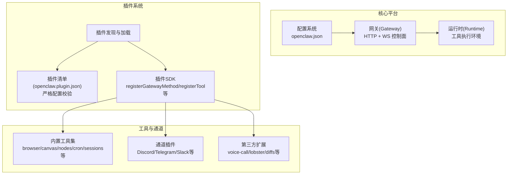
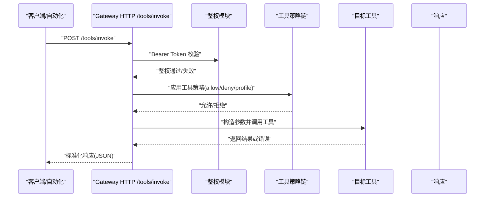
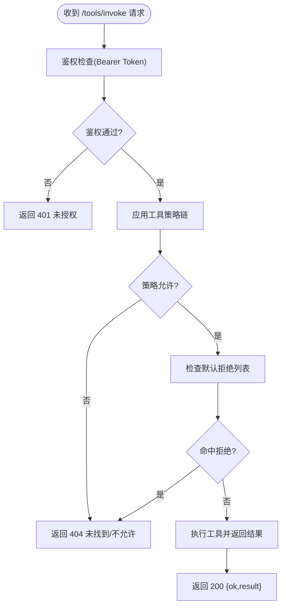
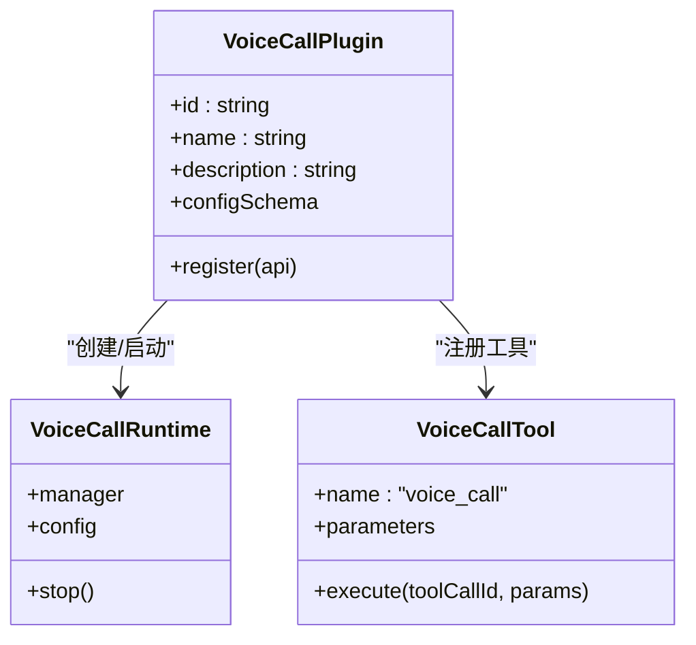
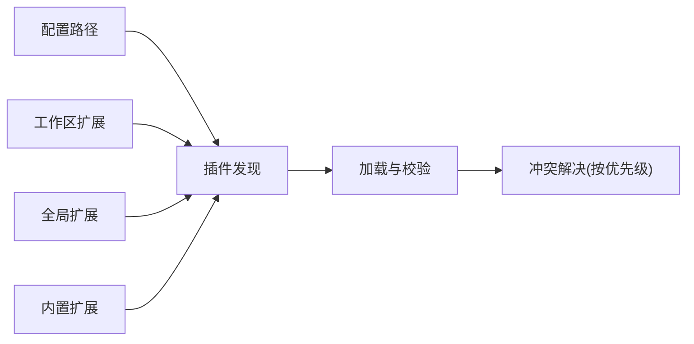

# 工具插件API

<cite>
**本文档引用的文件**
- [tools-invoke-http-api.md](file://docs/gateway/tools-invoke-http-api.md)
- [tools/index.md](file://docs/tools/index.md)
- [plugins/manifest.md](file://docs/plugins/manifest.md)
- [plugins/plugin.md](file://docs/tools/plugin.md)
- [configuration-reference.md](file://docs/gateway/configuration-reference.md)
- [authentication.md](file://docs/gateway/authentication.md)
- [voice-call/index.ts](file://extensions/voice-call/index.ts)
- [discord/index.ts](file://extensions/discord/index.ts)
- [README.md](file://README.md)
</cite>

## 目录

1. [简介](#简介)
2. [项目结构](#项目结构)
3. [核心组件](#核心组件)
4. [架构总览](#架构总览)
5. [详细组件分析](#详细组件分析)
6. [依赖关系分析](#依赖关系分析)
7. [性能考虑](#性能考虑)
8. [故障排除指南](#故障排除指南)
9. [结论](#结论)
10. [附录](#附录)

## 简介

本文件为 OpenClaw 工具插件API的完整参考文档，覆盖以下主题：

- 外部工具集成接口：HTTP请求、Webhook处理与数据持久化API
- 工具调用机制、参数校验与结果解析接口
- 安全策略、访问控制与权限管理API
- 工具特定功能：文件操作、网络请求、系统集成
- 缓存机制、去重策略与并发控制
- 调试工具、性能监控与错误处理指南
- 确保工具插件能够安全可靠地访问外部资源

## 项目结构

OpenClaw 采用“核心平台 + 插件扩展”的架构设计。工具插件通过插件SDK注册到网关（Gateway），并可暴露：

- Gateway RPC 方法
- HTTP 路由
- Agent 工具
- CLI 命令
- 后台服务
- 上下文引擎
- 可选配置校验
- 技能（Skills）
- 自动回复命令

图表来源

- [plugins/plugin.md:114-145](file://docs/tools/plugin.md#L114-L145)
- [plugins/manifest.md:18-47](file://docs/plugins/manifest.md#L18-L47)
- [tools/index.md:166-178](file://docs/tools/index.md#L166-L178)

章节来源

- [plugins/plugin.md:114-145](file://docs/tools/plugin.md#L114-L145)
- [plugins/manifest.md:18-47](file://docs/plugins/manifest.md#L18-L47)
- [tools/index.md:166-178](file://docs/tools/index.md#L166-L178)

## 核心组件

- 工具调用API（HTTP）：用于直接调用单个工具，支持鉴权、策略过滤与响应格式化
- 工具策略与分组：全局/按代理/按提供方的工具允许/拒绝列表与工具组别
- 插件清单与配置：严格的JSON Schema校验，禁止未声明的字段
- 插件SDK：注册HTTP路由、Gateway方法、工具、CLI、后台服务与上下文引擎
- 通道插件：将外部消息通道（Discord/Telegram等）接入OpenClaw
- 鉴权与速率限制：Gateway鉴权模式与限流策略
- 安全模型：沙箱模式、工具白名单/黑名单、设备节点权限

章节来源

- [tools-invoke-http-api.md:9-111](file://docs/gateway/tools-invoke-http-api.md#L9-L111)
- [tools/index.md:15-81](file://docs/tools/index.md#L15-L81)
- [plugins/manifest.md:53-63](file://docs/plugins/manifest.md#L53-L63)
- [plugins/plugin.md:484-521](file://docs/tools/plugin.md#L484-L521)
- [configuration-reference.md:18-800](file://docs/gateway/configuration-reference.md#L18-L800)
- [authentication.md:1-180](file://docs/gateway/authentication.md#L1-L180)

## 架构总览

OpenClaw 的工具插件API通过网关统一入口对外提供能力，插件在进程内运行，具备与核心平台一致的运行时能力（如TTS/STT、媒体理解等）。工具调用链路如下：

图表来源

- [tools-invoke-http-api.md:18-98](file://docs/gateway/tools-invoke-http-api.md#L18-L98)

章节来源

- [tools-invoke-http-api.md:18-98](file://docs/gateway/tools-invoke-http-api.md#L18-L98)

## 详细组件分析

### 组件A：工具调用API（HTTP）

- 端点：POST /tools/invoke
- 鉴权：支持 token/password 模式，支持速率限制与重试头
- 请求体字段：
  - tool（必填）、action（可选）、args（可选）、sessionKey（可选）、dryRun（保留）
- 策略行为：遵循工具策略链（profile/allow/agent策略/组策略/子代理策略），并受默认拒绝列表约束
- 响应：标准JSON，含状态码与错误类型/信息

图表来源

- [tools-invoke-http-api.md:18-98](file://docs/gateway/tools-invoke-http-api.md#L18-L98)

章节来源

- [tools-invoke-http-api.md:9-111](file://docs/gateway/tools-invoke-http-api.md#L9-L111)

### 组件B：工具策略与分组

- 全局策略：tools.allow/tools.deny/tools.profile
- 代理级覆盖：agents.list[].tools.\*
- 提供方特定策略：tools.byProvider
- 工具组别：group:fs/group:runtime/group:sessions/group:memory/group:web/group:ui/group:automation/group:messaging/group:nodes/group:openclaw
- 循环检测：可启用以阻止无进展重复调用

章节来源

- [tools/index.md:15-81](file://docs/tools/index.md#L15-L81)
- [tools/index.md:138-178](file://docs/tools/index.md#L138-L178)
- [tools/index.md:228-256](file://docs/tools/index.md#L228-L256)

### 组件C：插件清单与配置校验

- 必需字段：id、configSchema
- 可选字段：kind、channels、providers、skills、name、description、uiHints、version
- JSON Schema 要求：必须提供Schema；空Schema也允许
- 校验行为：未知字段报错；插件id/通道id必须可发现；禁用插件保留配置并告警

章节来源

- [plugins/manifest.md:18-63](file://docs/plugins/manifest.md#L18-L63)

### 组件D：插件SDK与HTTP路由

- 注册HTTP路由：api.registerHttpRoute(path, auth, match, handler)
- 支持认证级别：gateway（网关鉴权）、plugin（插件自管鉴权/签名）
- 冲突与替换规则：exact/prefix冲突需显式replaceExisting；同插件可替换自身
- 运行时助手：TTS/STT等核心能力可通过api.runtime调用

章节来源

- [plugins/plugin.md:114-145](file://docs/tools/plugin.md#L114-L145)
- [plugins/plugin.md:81-113](file://docs/tools/plugin.md#L81-L113)

### 组件E：通道插件（以Discord为例）

- 通道插件通过 api.registerChannel 注册，定义元数据、能力、配置解析与出站适配器
- 运行时设置：setDiscordRuntime(api.runtime)
- 子代理钩子：registerDiscordSubagentHooks(api)

章节来源

- [discord/index.ts:1-20](file://extensions/discord/index.ts#L1-L20)

### 组件F：工具示例（以Voice Call为例）

- 工具名称：voice_call
- 参数Schema：initiate_call/continue_call/speak_to_user/end_call/get_status 等动作
- Gateway方法：voicecall.initiate/continue/speak/end/status/start
- CLI：registerCli(commands: ["voicecall"])
- 服务：registerService(id: "voicecall")

图表来源

- [voice-call/index.ts:146-543](file://extensions/voice-call/index.ts#L146-L543)

章节来源

- [voice-call/index.ts:146-543](file://extensions/voice-call/index.ts#L146-L543)

### 组件G：鉴权与速率限制

- Gateway鉴权模式：token/password
- 速率限制：过多鉴权失败返回429并带Retry-After
- 认证策略：支持订阅型setup-token与API Key；支持密钥轮换与凭据优先级

章节来源

- [tools-invoke-http-api.md:18-28](file://docs/gateway/tools-invoke-http-api.md#L18-L28)
- [authentication.md:1-180](file://docs/gateway/authentication.md#L1-L180)

## 依赖关系分析

- 插件发现顺序：配置路径 → 工作区扩展 → 全局扩展 → 内置扩展
- 安全加固：路径安全检查、世界可写目录阻断、所有权可疑阻断、非内置插件警告
- 插件间冲突：相同id按优先级取首个；包打包多扩展时id为name/文件基名
- 通道目录元数据：通过 openclaw.channel/openclaw.install 在清单中声明

图表来源

- [plugins/plugin.md:228-277](file://docs/tools/plugin.md#L228-L277)

章节来源

- [plugins/plugin.md:228-277](file://docs/tools/plugin.md#L228-L277)

## 性能考虑

- 工具循环检测：可配置阈值与检测器，避免无进展重复调用
- 浏览器/网页工具缓存：web_search/web_fetch默认缓存15分钟
- 并发控制：工具调用遵循策略链与会话隔离；后台任务通过process工具管理
- 网络与媒体：通道插件按提供方策略与速率限制进行调用；媒体大小上限与临时文件生命周期管理

章节来源

- [tools/index.md:228-256](file://docs/tools/index.md#L228-L256)
- [tools/index.md:257-290](file://docs/tools/index.md#L257-L290)

## 故障排除指南

- 工具不可用（404）：检查工具是否被策略允许；核对默认拒绝列表
- 鉴权失败（401/429）：确认Bearer Token；检查速率限制与重试头
- 插件配置错误：检查 openclaw.plugin.json 与 configSchema；未知字段将导致校验失败
- 通道问题：核对通道配置与账户凭据；使用 read-only inspection 避免强制材料化凭据
- 安全模型：非主会话可启用沙箱模式，仅允许必要工具；macOS节点权限需TCC授权

章节来源

- [tools-invoke-http-api.md:62-98](file://docs/gateway/tools-invoke-http-api.md#L62-L98)
- [plugins/manifest.md:53-63](file://docs/plugins/manifest.md#L53-L63)
- [plugins/plugin.md:187-227](file://docs/tools/plugin.md#L187-L227)
- [README.md:332-339](file://README.md#L332-L339)

## 结论

OpenClaw 的工具插件API通过统一的网关入口、严格的插件清单与配置校验、完善的工具策略与安全模型，提供了可扩展、可审计、可监控的工具集成框架。开发者可通过插件SDK快速扩展HTTP路由、Gateway方法、Agent工具与CLI命令，并结合通道插件接入各类外部消息通道，实现从本地到云端的全栈自动化。

## 附录

- 快速开始：安装官方插件、重启网关、配置 plugins.entries.<id>.config
- 插件清单：提供 id、configSchema 与 uiHints，确保严格校验
- 工具策略：合理使用 profile/allow/deny 与 group:\* 缩小攻击面
- 安全建议：启用沙箱、最小权限原则、速率限制与循环检测

章节来源

- [plugins/plugin.md:20-44](file://docs/tools/plugin.md#L20-L44)
- [plugins/manifest.md:18-47](file://docs/plugins/manifest.md#L18-L47)
- [tools/index.md:15-81](file://docs/tools/index.md#L15-L81)
