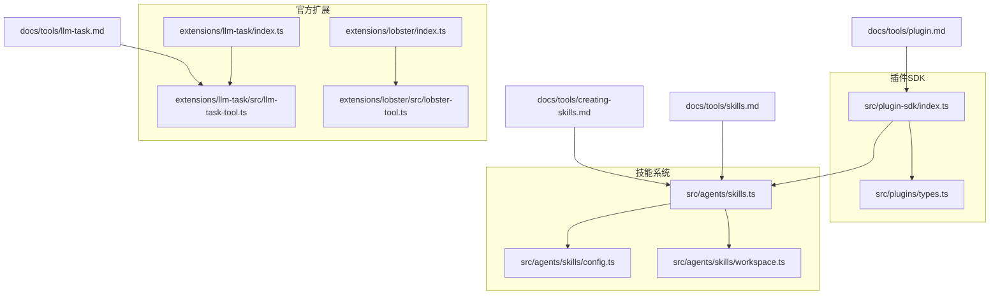
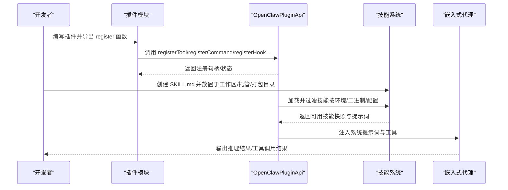
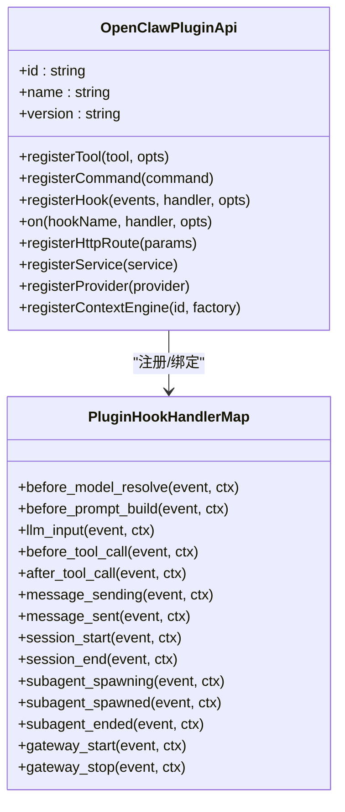
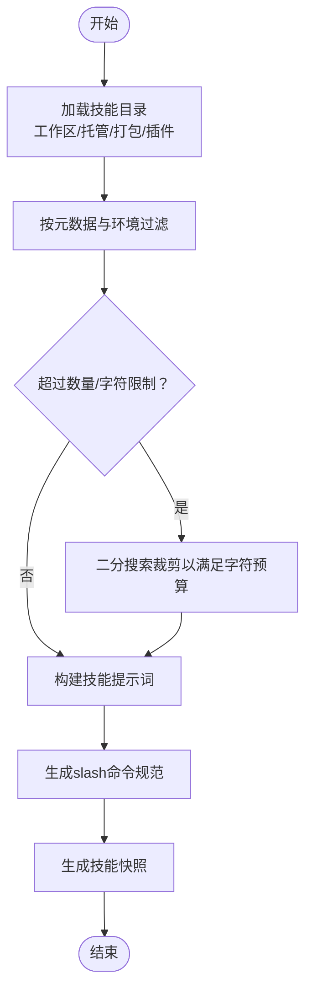
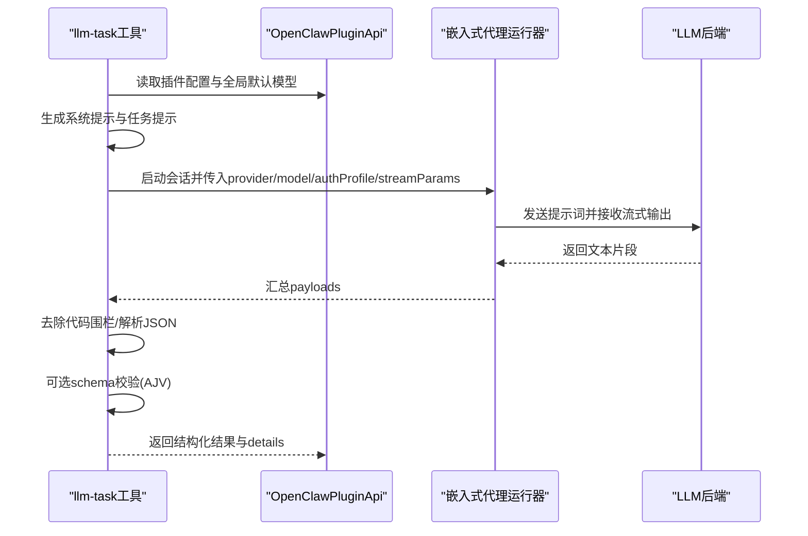
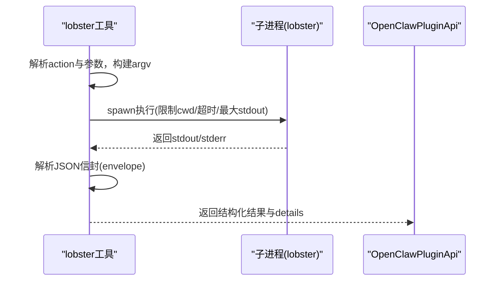
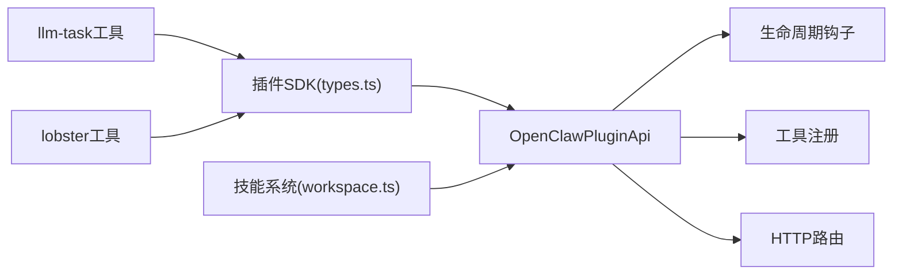

# 技能插件API

<cite>
**本文档引用的文件**
- [src/plugin-sdk/index.ts](file://src/plugin-sdk/index.ts)
- [src/plugins/types.ts](file://src/plugins/types.ts)
- [src/agents/skills.ts](file://src/agents/skills.ts)
- [src/agents/skills/config.ts](file://src/agents/skills/config.ts)
- [src/agents/skills/workspace.ts](file://src/agents/skills/workspace.ts)
- [docs/tools/skills.md](file://docs/tools/skills.md)
- [docs/tools/creating-skills.md](file://docs/tools/creating-skills.md)
- [docs/tools/plugin.md](file://docs/tools/plugin.md)
- [docs/tools/llm-task.md](file://docs/tools/llm-task.md)
- [extensions/llm-task/index.ts](file://extensions/llm-task/index.ts)
- [extensions/llm-task/src/llm-task-tool.ts](file://extensions/llm-task/src/llm-task-tool.ts)
- [extensions/lobster/index.ts](file://extensions/lobster/index.ts)
- [extensions/lobster/src/lobster-tool.ts](file://extensions/lobster/src/lobster-tool.ts)
</cite>

## 目录

1. [简介](#简介)
2. [项目结构](#项目结构)
3. [核心组件](#核心组件)
4. [架构总览](#架构总览)
5. [详细组件分析](#详细组件分析)
6. [依赖关系分析](#依赖关系分析)
7. [性能考量](#性能考量)
8. [故障排查指南](#故障排查指南)
9. [结论](#结论)
10. [附录](#附录)

## 简介

本文件为 OpenClaw 技能插件API的权威参考，覆盖以下主题：

- AI技能开发的核心接口：LLM任务处理、文本生成与智能推理
- 技能注册机制、参数传递与结果处理API
- 技能配置管理、模型选择与上下文处理接口
- 开发模板、测试方法与部署流程
- 技能特定功能：代码生成、数据分析与多模态处理
- 性能监控、错误追踪与调试工具
- 完整示例与最佳实践指南

## 项目结构

OpenClaw 将“技能（Skills）”作为可插拔能力单元，通过统一的插件SDK进行注册与运行时集成。核心目录与职责如下：

- 插件SDK与类型定义：位于 src/plugin-sdk 与 src/plugins
- 技能加载与过滤：位于 src/agents/skills
- 官方扩展：位于 extensions 下的各子包（如 llm-task、lobster）
- 文档：位于 docs/tools 中的技能与插件相关章节

**图表来源**

- [src/plugin-sdk/index.ts:1-826](file://src/plugin-sdk/index.ts#L1-L826)
- [src/plugins/types.ts:1-893](file://src/plugins/types.ts#L1-L893)
- [src/agents/skills.ts:1-47](file://src/agents/skills.ts#L1-L47)
- [src/agents/skills/config.ts:1-104](file://src/agents/skills/config.ts#L1-L104)
- [src/agents/skills/workspace.ts:1-882](file://src/agents/skills/workspace.ts#L1-L882)
- [extensions/llm-task/index.ts:1-7](file://extensions/llm-task/index.ts#L1-L7)
- [extensions/llm-task/src/llm-task-tool.ts:1-260](file://extensions/llm-task/src/llm-task-tool.ts#L1-L260)
- [extensions/lobster/index.ts:1-19](file://extensions/lobster/index.ts#L1-L19)
- [extensions/lobster/src/lobster-tool.ts:1-267](file://extensions/lobster/src/lobster-tool.ts#L1-L267)
- [docs/tools/skills.md:1-303](file://docs/tools/skills.md#L1-L303)
- [docs/tools/creating-skills.md:1-59](file://docs/tools/creating-skills.md#L1-L59)
- [docs/tools/plugin.md:1-963](file://docs/tools/plugin.md#L1-L963)
- [docs/tools/llm-task.md:1-116](file://docs/tools/llm-task.md#L1-L116)

**章节来源**

- [src/plugin-sdk/index.ts:1-826](file://src/plugin-sdk/index.ts#L1-L826)
- [src/plugins/types.ts:1-893](file://src/plugins/types.ts#L1-L893)
- [src/agents/skills.ts:1-47](file://src/agents/skills.ts#L1-L47)
- [src/agents/skills/config.ts:1-104](file://src/agents/skills/config.ts#L1-L104)
- [src/agents/skills/workspace.ts:1-882](file://src/agents/skills/workspace.ts#L1-L882)
- [docs/tools/skills.md:1-303](file://docs/tools/skills.md#L1-L303)
- [docs/tools/creating-skills.md:1-59](file://docs/tools/creating-skills.md#L1-L59)
- [docs/tools/plugin.md:1-963](file://docs/tools/plugin.md#L1-L963)
- [docs/tools/llm-task.md:1-116](file://docs/tools/llm-task.md#L1-L116)

## 核心组件

- 插件API与生命周期钩子：提供注册工具、HTTP路由、命令、服务、上下文引擎等能力，并支持丰富的生命周期事件钩子（如 before_prompt_build、llm_input、before_tool_call 等），用于在推理前后注入或修改行为。
- 技能系统：统一加载、过滤、构建提示词与命令规范；支持工作区、托管与打包技能的优先级与覆盖规则；支持按环境变量、二进制、配置路径进行资格筛选。
- 官方扩展：llm-task 提供结构化JSON输出的通用LLM任务工具；lobster 提供本地工作流运行器的工具封装。

**章节来源**

- [src/plugins/types.ts:248-306](file://src/plugins/types.ts#L248-L306)
- [src/plugins/types.ts:321-395](file://src/plugins/types.ts#L321-L395)
- [src/agents/skills.ts:1-47](file://src/agents/skills.ts#L1-L47)
- [src/agents/skills/config.ts:71-104](file://src/agents/skills/config.ts#L71-L104)
- [src/agents/skills/workspace.ts:567-638](file://src/agents/skills/workspace.ts#L567-L638)
- [extensions/llm-task/index.ts:1-7](file://extensions/llm-task/index.ts#L1-L7)
- [extensions/lobster/index.ts:1-19](file://extensions/lobster/index.ts#L1-L19)

## 架构总览

OpenClaw 的技能与插件体系围绕“插件SDK + 技能系统 + 运行时集成”展开。插件通过 OpenClawPluginApi 注册能力；技能通过 SKILL.md 前言元数据声明能力与调用策略；运行时根据会话上下文与配置动态构建提示词与可用工具集。

**图表来源**

- [src/plugins/types.ts:263-306](file://src/plugins/types.ts#L263-L306)
- [src/agents/skills/workspace.ts:567-638](file://src/agents/skills/workspace.ts#L567-L638)
- [docs/tools/skills.md:11-48](file://docs/tools/skills.md#L11-L48)

**章节来源**

- [src/plugins/types.ts:248-306](file://src/plugins/types.ts#L248-L306)
- [src/agents/skills/workspace.ts:567-638](file://src/agents/skills/workspace.ts#L567-L638)
- [docs/tools/skills.md:11-48](file://docs/tools/skills.md#L11-L48)

## 详细组件分析

### 组件A：插件API与生命周期钩子

- 能力注册
  - registerTool：注册Agent工具（支持工厂函数与可选工具标记）
  - registerCommand：注册无需LLM参与的简单命令
  - registerHook/on：注册生命周期钩子（如 before_prompt_build、llm_input、before_tool_call 等）
  - registerHttpRoute：注册HTTP路由（支持精确匹配与前缀匹配）
  - registerService：注册后台服务
  - registerProvider：注册模型提供商认证流程
  - registerContextEngine：注册上下文引擎（独占槽位）
- 钩子类型与事件
  - 模型解析前、提示词构建前、代理开始、LLM输入/输出、工具调用前后、消息发送/已发送、会话开始/结束、子代理派生/结束、网关启动/停止等
  - 支持对系统提示词进行静态/动态注入（prependSystemContext/appendSystemContext/prependContext/systemPrompt）

**图表来源**

- [src/plugins/types.ts:263-306](file://src/plugins/types.ts#L263-L306)
- [src/plugins/types.ts:787-807](file://src/plugins/types.ts#L787-L807)

**章节来源**

- [src/plugins/types.ts:248-306](file://src/plugins/types.ts#L248-L306)
- [src/plugins/types.ts:321-395](file://src/plugins/types.ts#L321-L395)
- [src/plugins/types.ts:787-807](file://src/plugins/types.ts#L787-L807)

### 组件B：技能加载与过滤（Workspace/Managed/Bundled）

- 加载顺序与优先级
  - 工作区技能（最高）→ 托管技能 → 打包技能（最低）
  - 可通过 extraDirs 扩展低优先级技能目录
  - 插件可声明 skills 目录参与加载
- 过滤规则
  - enabled 字段控制是否启用
  - 允许/禁止清单与平台限制
  - 二进制存在性、环境变量、配置路径真值判断
- 提示词与命令构建
  - 构建技能XML列表并注入系统提示词
  - 限制最大数量与字符数，避免token膨胀
  - 生成用户可触发的slash命令规范

**图表来源**

- [src/agents/skills/workspace.ts:567-638](file://src/agents/skills/workspace.ts#L567-L638)
- [src/agents/skills/config.ts:71-104](file://src/agents/skills/config.ts#L71-L104)
- [docs/tools/skills.md:110-187](file://docs/tools/skills.md#L110-L187)

**章节来源**

- [src/agents/skills/workspace.ts:567-638](file://src/agents/skills/workspace.ts#L567-L638)
- [src/agents/skills/config.ts:71-104](file://src/agents/skills/config.ts#L71-L104)
- [docs/tools/skills.md:110-187](file://docs/tools/skills.md#L110-L187)

### 组件C：LLM任务工具（llm-task）

- 功能概述
  - 提供JSON-only的结构化输出LLM任务
  - 可选JSON Schema校验
  - 支持默认/覆盖模型、认证配置、超时与流式参数
- 关键流程
  - 参数解析与默认值推断（从插件配置、全局默认模型）
  - 生成系统提示与任务提示
  - 调用嵌入式代理执行推理
  - 解析并验证返回JSON，必要时使用AJV校验schema
  - 清理临时目录

**图表来源**

- [extensions/llm-task/src/llm-task-tool.ts:73-259](file://extensions/llm-task/src/llm-task-tool.ts#L73-L259)
- [docs/tools/llm-task.md:71-116](file://docs/tools/llm-task.md#L71-L116)

**章节来源**

- [extensions/llm-task/src/llm-task-tool.ts:73-259](file://extensions/llm-task/src/llm-task-tool.ts#L73-L259)
- [docs/tools/llm-task.md:71-116](file://docs/tools/llm-task.md#L71-L116)

### 组件D：Lobster工作流工具（lobster）

- 功能概述
  - 以本地工作流运行器为后端，提供可恢复审批的Typed JSON信封
  - 支持 cwd 限制、超时与stdout大小限制
- 关键流程
  - 解析 action（run/resume），构建argv
  - 子进程执行，捕获stdout/stderr
  - 解析最终JSON信封，返回结构化结果

**图表来源**

- [extensions/lobster/src/lobster-tool.ts:210-266](file://extensions/lobster/src/lobster-tool.ts#L210-L266)

**章节来源**

- [extensions/lobster/src/lobster-tool.ts:210-266](file://extensions/lobster/src/lobster-tool.ts#L210-L266)

### 组件E：插件开发与部署（官方扩展示例）

- 插件入口与注册
  - 插件导出 register 函数，使用 api.registerTool 等完成注册
- 插件清单与配置
  - openclaw.plugin.json 中声明插件元信息与配置Schema
  - 支持 uiHints 用于UI渲染
- 插件安装与启用
  - 通过 CLI 安装/更新/启用/禁用
  - 配置变更需重启网关

**章节来源**

- [extensions/llm-task/index.ts:1-7](file://extensions/llm-task/index.ts#L1-L7)
- [extensions/lobster/index.ts:1-19](file://extensions/lobster/index.ts#L1-L19)
- [docs/tools/plugin.md:460-521](file://docs/tools/plugin.md#L460-L521)
- [docs/tools/plugin.md:522-586](file://docs/tools/plugin.md#L522-L586)

## 依赖关系分析

- 插件SDK与技能系统的耦合点
  - 插件通过 registerTool 注入技能工具
  - 生命周期钩子影响提示词构建与工具调用
- 外部依赖
  - 类型校验：TypeBox/AJV
  - 运行时：嵌入式代理运行器（内部API）
  - 平台差异：Windows子进程spawn适配

**图表来源**

- [src/plugins/types.ts:248-306](file://src/plugins/types.ts#L248-L306)
- [src/agents/skills/workspace.ts:567-638](file://src/agents/skills/workspace.ts#L567-L638)
- [extensions/llm-task/src/llm-task-tool.ts:73-259](file://extensions/llm-task/src/llm-task-tool.ts#L73-L259)
- [extensions/lobster/src/lobster-tool.ts:210-266](file://extensions/lobster/src/lobster-tool.ts#L210-L266)

**章节来源**

- [src/plugins/types.ts:248-306](file://src/plugins/types.ts#L248-L306)
- [src/agents/skills/workspace.ts:567-638](file://src/agents/skills/workspace.ts#L567-L638)
- [extensions/llm-task/src/llm-task-tool.ts:73-259](file://extensions/llm-task/src/llm-task-tool.ts#L73-L259)
- [extensions/lobster/src/lobster-tool.ts:210-266](file://extensions/lobster/src/lobster-tool.ts#L210-L266)

## 性能考量

- 技能提示词成本控制
  - 使用紧凑路径与XML格式，限制最大技能数量与提示字符数
  - 静态系统上下文建议使用 prependSystemContext/appendSystemContext，以利于缓存
- 工具调用与流式输出
  - llm-task 支持流式参数与超时控制
  - lobster 对stdout大小与超时进行严格限制，防止资源耗尽
- 会话与压缩
  - 提供 before_compaction/after_compaction 钩子，便于异步处理历史消息

**章节来源**

- [src/agents/skills/workspace.ts:529-565](file://src/agents/skills/workspace.ts#L529-L565)
- [src/plugins/types.ts:527-556](file://src/plugins/types.ts#L527-L556)
- [extensions/llm-task/src/llm-task-tool.ts:147-164](file://extensions/llm-task/src/llm-task-tool.ts#L147-L164)
- [extensions/lobster/src/lobster-tool.ts:50-143](file://extensions/lobster/src/lobster-tool.ts#L50-L143)

## 故障排查指南

- 技能未生效
  - 检查 enabled、允许清单与平台/二进制/环境要求
  - 使用 skills watcher 或重启网关使变更生效
- LLM任务失败
  - 确认 provider/model/authProfile 是否在允许列表内
  - 检查超时设置与schema校验错误
- lobster 工作流异常
  - 关注超时与stdout大小限制
  - 查看stderr与最终JSON信封内容
- 插件问题
  - 使用 openclaw plugins doctor 检查插件清单与配置
  - 查看日志与诊断事件

**章节来源**

- [docs/tools/skills.md:254-267](file://docs/tools/skills.md#L254-L267)
- [docs/tools/llm-task.md:109-116](file://docs/tools/llm-task.md#L109-L116)
- [extensions/lobster/src/lobster-tool.ts:124-142](file://extensions/lobster/src/lobster-tool.ts#L124-L142)
- [docs/tools/plugin.md:479-482](file://docs/tools/plugin.md#L479-L482)

## 结论

OpenClaw 的技能插件API提供了统一、可扩展且安全的能力边界：通过插件SDK注册工具与命令，结合技能系统实现灵活的提示词注入与工具编排；官方扩展展示了如何在不侵入核心的前提下，提供高质量的LLM任务与工作流能力。遵循本文档的最佳实践，可在保证安全与性能的同时，快速构建复杂AI驱动的自动化场景。

## 附录

### A. 技能开发模板与步骤

- 创建工作区技能目录与 SKILL.md
- 在 SKILL.md 中声明元数据与调用策略
- 使用 openclaw agent 测试与刷新技能
- 参考官方文档中的最佳实践与安全注意事项

**章节来源**

- [docs/tools/creating-skills.md:17-59](file://docs/tools/creating-skills.md#L17-L59)
- [docs/tools/skills.md:78-106](file://docs/tools/skills.md#L78-L106)

### B. 插件开发与部署清单

- 编写插件入口与 register 函数
- 在 openclaw.plugin.json 中声明配置Schema与uiHints
- 通过 CLI 安装/启用/配置插件
- 验证HTTP路由/命令/工具是否正常

**章节来源**

- [docs/tools/plugin.md:460-521](file://docs/tools/plugin.md#L460-L521)
- [docs/tools/plugin.md:522-586](file://docs/tools/plugin.md#L522-L586)
