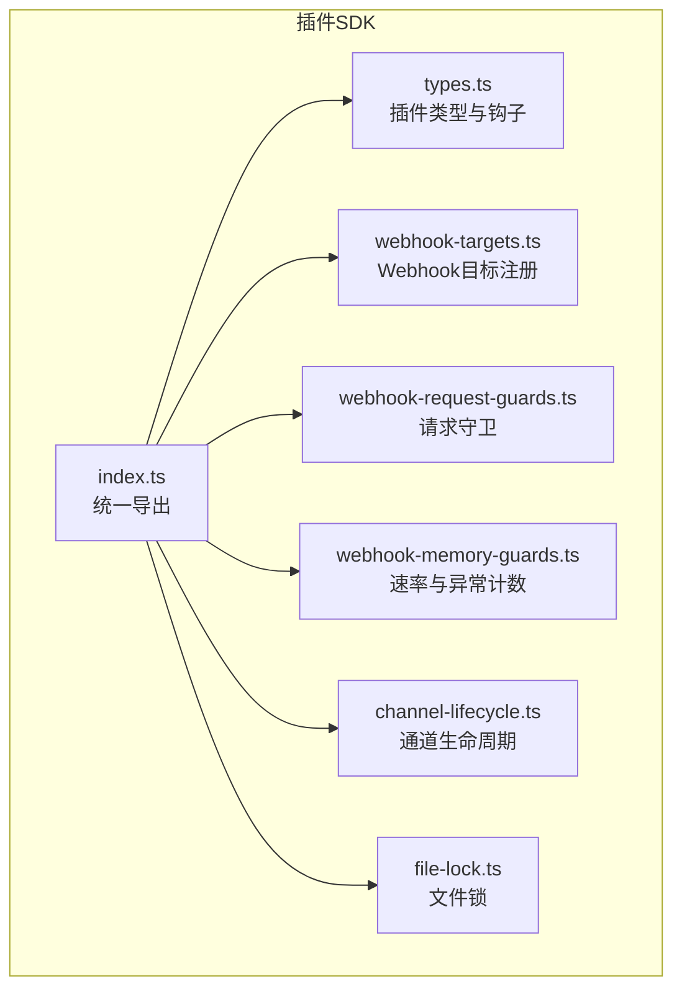
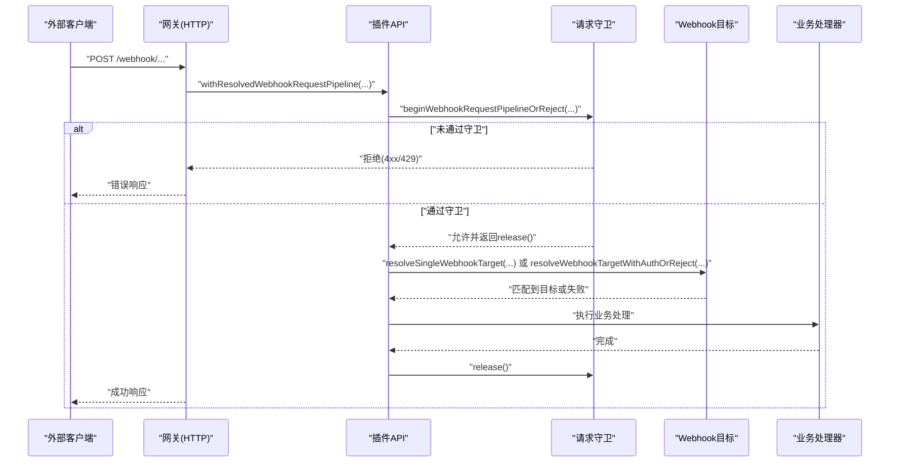
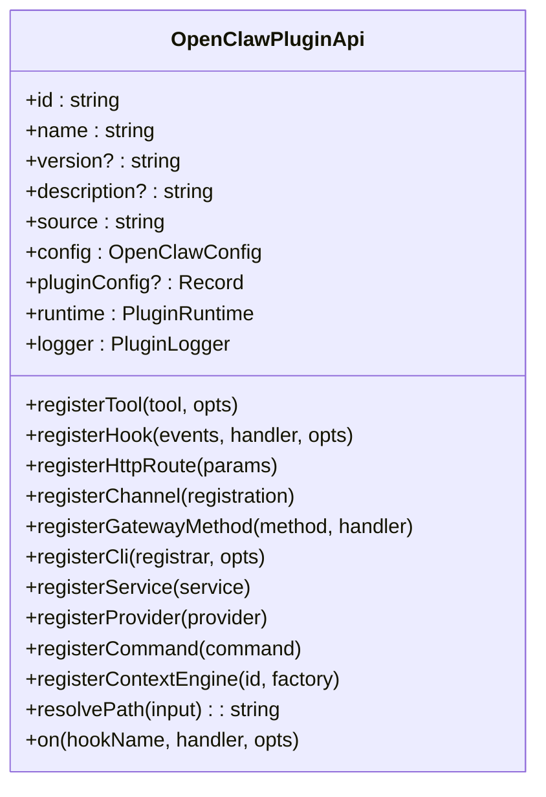
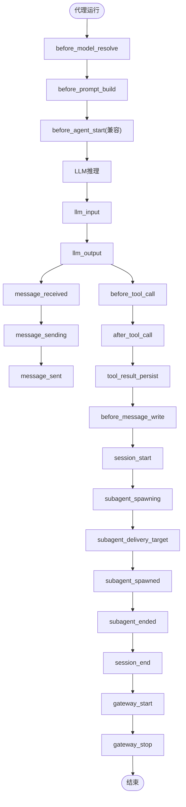
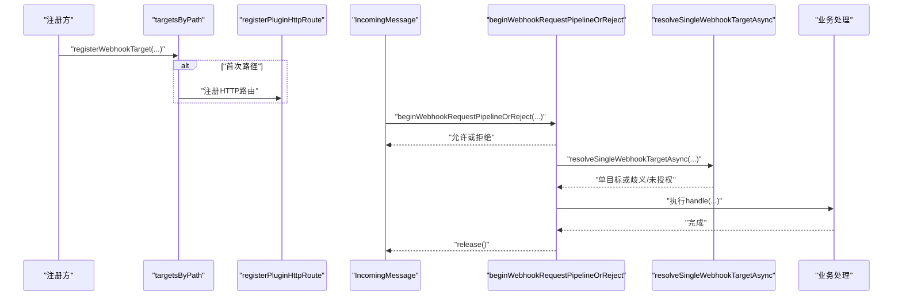
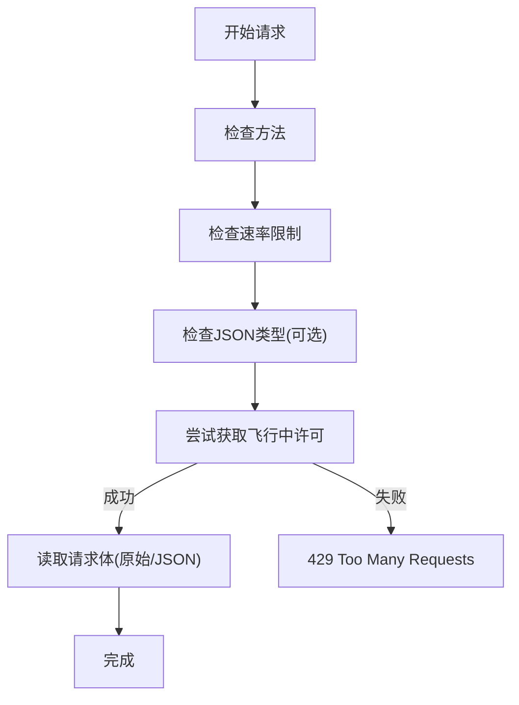
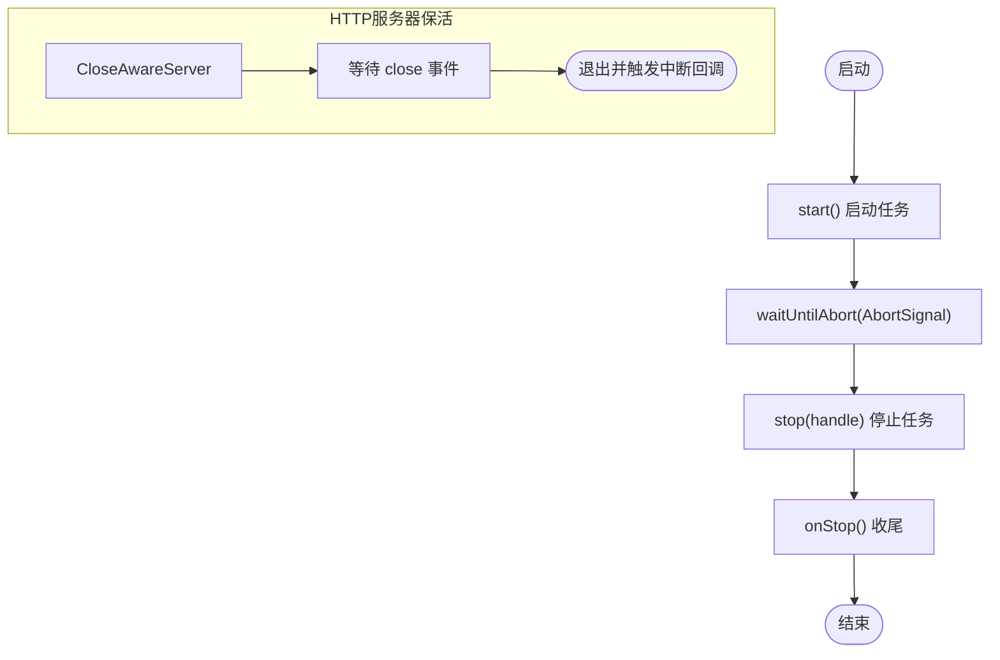
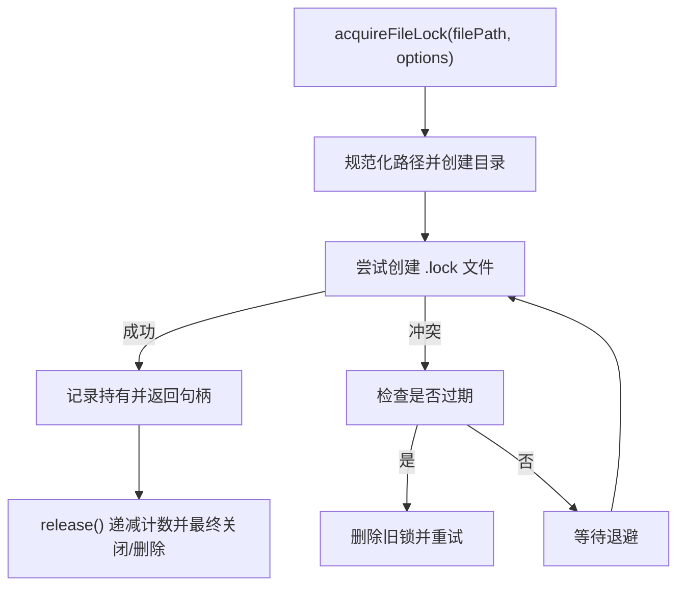
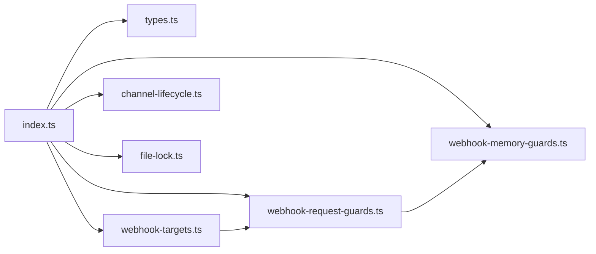

# 插件API参考

<cite>
**本文引用的文件**
- [src/plugin-sdk/index.ts](file://src/plugin-sdk/index.ts)
- [src/plugins/types.ts](file://src/plugins/types.ts)
- [src/plugin-sdk/webhook-targets.ts](file://src/plugin-sdk/webhook-targets.ts)
- [src/plugin-sdk/webhook-request-guards.ts](file://src/plugin-sdk/webhook-request-guards.ts)
- [src/plugin-sdk/webhook-memory-guards.ts](file://src/plugin-sdk/webhook-memory-guards.ts)
- [src/plugin-sdk/channel-lifecycle.ts](file://src/plugin-sdk/channel-lifecycle.ts)
- [src/plugin-sdk/file-lock.ts](file://src/plugin-sdk/file-lock.ts)
</cite>

## 目录

1. [简介](#简介)
2. [项目结构](#项目结构)
3. [核心组件](#核心组件)
4. [架构总览](#架构总览)
5. [详细组件分析](#详细组件分析)
6. [依赖关系分析](#依赖关系分析)
7. [性能考量](#性能考量)
8. [故障排查指南](#故障排查指南)
9. [结论](#结论)
10. [附录](#附录)

## 简介

本参考文档面向OpenClaw插件开发者，系统梳理插件SDK的核心API、事件钩子与工具函数，覆盖插件注册、命令与HTTP路由、Webhook目标管理、生命周期控制、并发与安全防护、文件锁等能力。文档按功能模块组织，提供类型定义、接口签名与使用要点，并给出兼容性提示与迁移建议，帮助开发者快速上手并稳定集成。

## 项目结构

OpenClaw插件SDK主要位于src/plugin-sdk目录，核心入口在src/plugin-sdk/index.ts中统一导出各类API；插件运行时与通用类型定义集中在src/plugins/types.ts中；Webhook相关能力拆分为目标注册、请求守卫与内存防护三部分；通道生命周期与文件锁等基础设施分别在独立文件中实现。

**图表来源**

- [src/plugin-sdk/index.ts:1-826](file://src/plugin-sdk/index.ts#L1-L826)
- [src/plugins/types.ts:1-893](file://src/plugins/types.ts#L1-L893)
- [src/plugin-sdk/webhook-targets.ts:1-282](file://src/plugin-sdk/webhook-targets.ts#L1-L282)
- [src/plugin-sdk/webhook-request-guards.ts:1-291](file://src/plugin-sdk/webhook-request-guards.ts#L1-L291)
- [src/plugin-sdk/webhook-memory-guards.ts:1-197](file://src/plugin-sdk/webhook-memory-guards.ts#L1-L197)
- [src/plugin-sdk/channel-lifecycle.ts:1-108](file://src/plugin-sdk/channel-lifecycle.ts#L1-L108)
- [src/plugin-sdk/file-lock.ts:1-162](file://src/plugin-sdk/file-lock.ts#L1-L162)

**章节来源**

- [src/plugin-sdk/index.ts:1-826](file://src/plugin-sdk/index.ts#L1-L826)

## 核心组件

- 插件API对象：提供注册工具、钩子、HTTP路由、通道、网关方法、CLI、服务、提供商与上下文解析等能力。
- 钩子系统：覆盖模型解析、提示构建、消息收发、工具调用、会话与子代理生命周期、网关启停等阶段。
- Webhook体系：目标注册、路径规范化、认证匹配、请求守卫（方法、速率、并发、内容类型）、体读取与JSON解析。
- 生命周期与资源：通道账户状态注入、被动生命周期、HTTP服务器任务保活、中断信号处理。
- 并发与安全：固定窗口限流、飞行中请求数限制、异常状态码计数、SSRF策略与抓取守卫。
- 文件锁：进程内持有、重试退避、过期清理、可嵌套释放。

**章节来源**

- [src/plugins/types.ts:263-306](file://src/plugins/types.ts#L263-L306)
- [src/plugin-sdk/webhook-targets.ts:1-282](file://src/plugin-sdk/webhook-targets.ts#L1-L282)
- [src/plugin-sdk/webhook-request-guards.ts:1-291](file://src/plugin-sdk/webhook-request-guards.ts#L1-L291)
- [src/plugin-sdk/webhook-memory-guards.ts:1-197](file://src/plugin-sdk/webhook-memory-guards.ts#L1-L197)
- [src/plugin-sdk/channel-lifecycle.ts:1-108](file://src/plugin-sdk/channel-lifecycle.ts#L1-L108)
- [src/plugin-sdk/file-lock.ts:1-162](file://src/plugin-sdk/file-lock.ts#L1-L162)

## 架构总览

下图展示插件API在请求处理中的典型交互：插件通过registerXXX注册能力，OpenClaw在运行时触发钩子或分发Webhook，插件据此修改行为或执行逻辑。

**图表来源**

- [src/plugin-sdk/webhook-targets.ts:115-162](file://src/plugin-sdk/webhook-targets.ts#L115-L162)
- [src/plugin-sdk/webhook-request-guards.ts:179-227](file://src/plugin-sdk/webhook-request-guards.ts#L179-L227)

## 详细组件分析

### 插件API对象与注册接口

- 注册工具：支持工厂模式与直接工具注册，可设置名称、别名与可选性。
- 注册钩子：支持字符串或数组事件名，可配置描述与是否自动注册。
- 注册HTTP路由：支持精确匹配与前缀匹配、认证方式（网关/插件）与替换策略。
- 注册通道：绑定ChannelPlugin与可选的ChannelDock。
- 注册网关方法：注册自定义RPC方法。
- 注册CLI：向命令行程序注册子命令。
- 注册服务：启动/停止服务，用于后台任务。
- 注册提供商：声明提供商ID、标签、模型与认证方法。
- 注册命令：注册无需LLM推理的简单命令，优先于内置命令与代理调用。
- 注册上下文引擎：独占槽位，仅允许一个激活实例。
- 路径解析：将相对路径解析为绝对路径。
- 生命周期钩子：on方法按名称注册，支持优先级。

**图表来源**

- [src/plugins/types.ts:263-306](file://src/plugins/types.ts#L263-L306)

**章节来源**

- [src/plugins/types.ts:263-306](file://src/plugins/types.ts#L263-L306)

### 钩子系统与事件

- 钩子名称集合：包含模型解析、提示构建、代理开始/结束、压缩、重置、消息收发、工具调用、结果持久化、消息写入、会话开始/结束、子代理孵化/投递/已生成/结束、网关启停等。
- 代理上下文：携带agentId、sessionKey、sessionId、工作区路径、消息来源、触发类型与渠道ID。
- 各类事件与结果：
  - before_model_resolve：可覆盖模型/提供商。
  - before_prompt_build：可修改系统提示、前置/后置上下文。
  - llm_input/llm_output：LLM输入输出事件，含用量统计。
  - message_received/message_sending/message_sent：消息生命周期。
  - before_tool_call/after_tool_call：工具调用前后，支持阻断与参数修改。
  - tool_result_persist：工具结果写入前的消息修改。
  - before_message_write：消息写入前阻断或修改。
  - session_start/session_end：会话开始/结束。
  - subagent_spawning/subagent_delivery_target/subagent_spawned/subagent_ended：子代理生命周期。
  - gateway_start/gateway_stop：网关启停。

**图表来源**

- [src/plugins/types.ts:321-784](file://src/plugins/types.ts#L321-L784)

**章节来源**

- [src/plugins/types.ts:321-784](file://src/plugins/types.ts#L321-L784)

### Webhook目标与请求处理

- 目标注册：将目标按标准化路径归集，首次路径注册时自动注册HTTP路由，最后一条移除时可触发路由卸载回调。
- 单目标匹配：同步与异步两种匹配器，支持歧义检测与拒绝。
- 认证匹配：支持同步与异步匹配，返回单个目标或拒绝。
- 请求管道：统一守卫（方法、速率、并发、JSON类型），读取原始体或JSON体，完成后释放。

**图表来源**

- [src/plugin-sdk/webhook-targets.ts:27-100](file://src/plugin-sdk/webhook-targets.ts#L27-L100)
- [src/plugin-sdk/webhook-targets.ts:115-162](file://src/plugin-sdk/webhook-targets.ts#L115-L162)
- [src/plugin-sdk/webhook-request-guards.ts:179-227](file://src/plugin-sdk/webhook-request-guards.ts#L179-L227)

**章节来源**

- [src/plugin-sdk/webhook-targets.ts:1-282](file://src/plugin-sdk/webhook-targets.ts#L1-L282)
- [src/plugin-sdk/webhook-request-guards.ts:1-291](file://src/plugin-sdk/webhook-request-guards.ts#L1-L291)

### 请求守卫与速率限制

- 基础守卫：校验HTTP方法、速率限制、JSON内容类型。
- 飞行中限制器：按键跟踪并发，请求数超过阈值则拒绝。
- 速率限制器：固定时间窗内累计请求数，超限返回429。
- 异常计数器：对特定状态码进行周期性计数与日志告警。
- 体读取：带大小与超时限制的原始体与JSON体读取，错误映射为标准HTTP状态。

**图表来源**

- [src/plugin-sdk/webhook-request-guards.ts:139-177](file://src/plugin-sdk/webhook-request-guards.ts#L139-L177)
- [src/plugin-sdk/webhook-request-guards.ts:179-227](file://src/plugin-sdk/webhook-request-guards.ts#L179-L227)
- [src/plugin-sdk/webhook-memory-guards.ts:51-105](file://src/plugin-sdk/webhook-memory-guards.ts#L51-L105)
- [src/plugin-sdk/webhook-memory-guards.ts:164-196](file://src/plugin-sdk/webhook-memory-guards.ts#L164-L196)

**章节来源**

- [src/plugin-sdk/webhook-request-guards.ts:1-291](file://src/plugin-sdk/webhook-request-guards.ts#L1-L291)
- [src/plugin-sdk/webhook-memory-guards.ts:1-197](file://src/plugin-sdk/webhook-memory-guards.ts#L1-L197)

### 通道生命周期与资源管理

- 账户状态注入：将补丁合并到账户快照。
- 中断等待：基于AbortSignal的等待，支持回调。
- 被动生命周期：启动任务直到中断，随后停止与收尾。
- HTTP服务器保活：监听服务器关闭事件，结合中断触发优雅退出。

**图表来源**

- [src/plugin-sdk/channel-lifecycle.ts:14-62](file://src/plugin-sdk/channel-lifecycle.ts#L14-L62)
- [src/plugin-sdk/channel-lifecycle.ts:70-107](file://src/plugin-sdk/channel-lifecycle.ts#L70-L107)

**章节来源**

- [src/plugin-sdk/channel-lifecycle.ts:1-108](file://src/plugin-sdk/channel-lifecycle.ts#L1-L108)

### 文件锁

- 可配置重试：指数回退、抖动、最小/最大超时。
- 过期检测：基于PID存活与创建时间/文件mtime判断。
- 持有与释放：进程内缓存持有句柄，支持嵌套计数与最终释放。
- 错误：超时抛出错误，避免死锁。

**图表来源**

- [src/plugin-sdk/file-lock.ts:103-148](file://src/plugin-sdk/file-lock.ts#L103-L148)
- [src/plugin-sdk/file-lock.ts:150-161](file://src/plugin-sdk/file-lock.ts#L150-L161)

**章节来源**

- [src/plugin-sdk/file-lock.ts:1-162](file://src/plugin-sdk/file-lock.ts#L1-L162)

## 依赖关系分析

- 统一导出：index.ts集中导出类型与工具，便于插件侧按需引入。
- 类型耦合：插件API依赖运行时、配置、通道类型与网关方法类型。
- Webhook链路：目标注册依赖HTTP路由注册；请求管道依赖守卫与内存防护。
- 生命周期：通道生命周期依赖AbortSignal与HTTP服务器事件。

**图表来源**

- [src/plugin-sdk/index.ts:1-826](file://src/plugin-sdk/index.ts#L1-L826)

**章节来源**

- [src/plugin-sdk/index.ts:1-826](file://src/plugin-sdk/index.ts#L1-L826)

## 性能考量

- 速率限制与飞行中限制：合理设置窗口与上限，避免突发流量击穿。
- 体读取限制：根据业务场景调整最大字节与超时，防止慢读导致资源占用。
- 异常计数告警：对4xx/5xx进行周期性计数，及时发现异常波动。
- 并发控制：飞行中限制器按键隔离，避免热点路径拥塞。
- 文件锁：适度退避与过期时间，减少频繁竞争。

## 故障排查指南

- Webhook未命中：确认路径标准化与目标列表是否正确；检查方法与JSON类型守卫。
- 429/并发过高：检查飞行中限制器键与上限；评估业务处理耗时。
- 413/408：请求体过大或读取超时，调整读取配置或优化上游发送。
- 未授权/歧义：核对认证匹配逻辑与目标唯一性。
- 生命周期未释放：确保在中断信号或服务器关闭时调用停止回调。
- 文件锁超时：检查宿主环境权限、磁盘IO与锁文件清理策略。

**章节来源**

- [src/plugin-sdk/webhook-request-guards.ts:58-82](file://src/plugin-sdk/webhook-request-guards.ts#L58-L82)
- [src/plugin-sdk/webhook-targets.ts:250-271](file://src/plugin-sdk/webhook-targets.ts#L250-L271)
- [src/plugin-sdk/channel-lifecycle.ts:29-46](file://src/plugin-sdk/channel-lifecycle.ts#L29-L46)
- [src/plugin-sdk/file-lock.ts:147-148](file://src/plugin-sdk/file-lock.ts#L147-L148)

## 结论

OpenClaw插件SDK提供了从注册、钩子、Webhook到生命周期与并发控制的完整能力矩阵。遵循本文档的类型定义与使用流程，可高效构建稳定可靠的插件。建议在生产环境中配合速率限制、异常计数与严格的认证匹配，确保高可用与可观测性。

## 附录

### 版本兼容性与弃用提示

- 兼容性：插件API以模块化导出为主，尽量保持向后兼容；新增能力通过新导出项暴露。
- 弃用与迁移：
  - OpenClawConfig替代ClawdbotConfig（已标记弃用），迁移时直接替换类型引用与导入路径。
  - 旧版before_agent_start兼容legacy钩子，建议逐步迁移到更细粒度的before_prompt_build与before_model_resolve组合使用。

**章节来源**

- [src/plugin-sdk/index.ts:129-131](file://src/plugin-sdk/index.ts#L129-L131)
