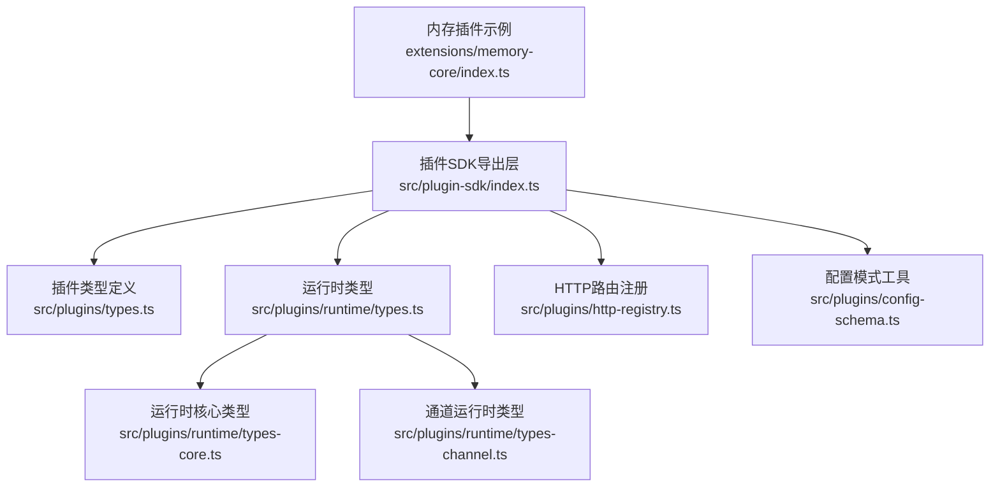
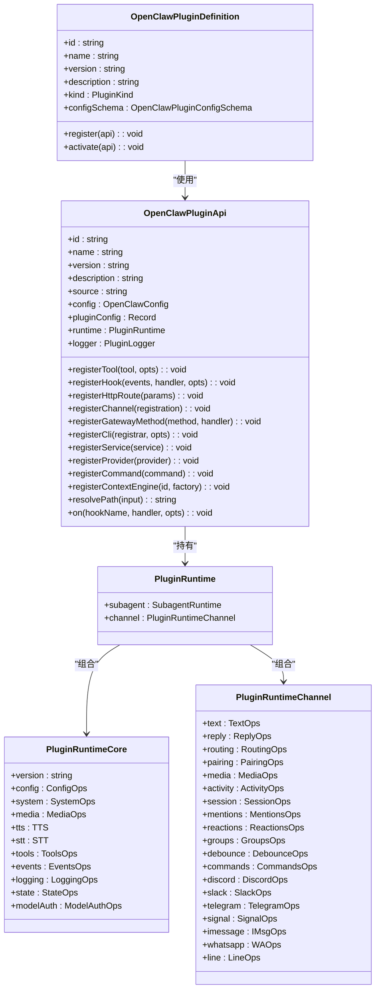
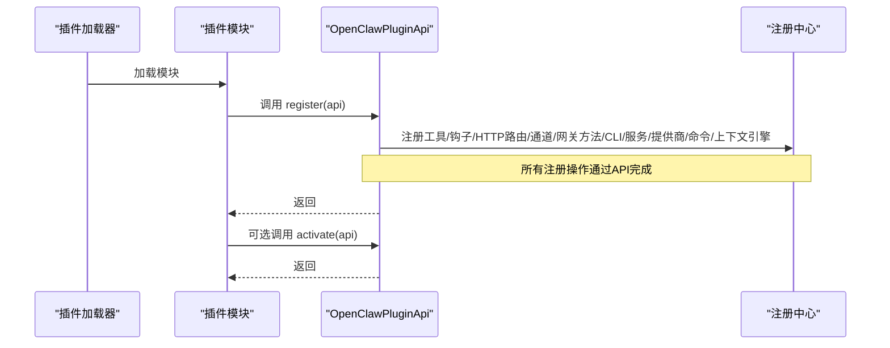
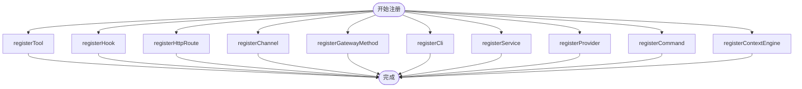
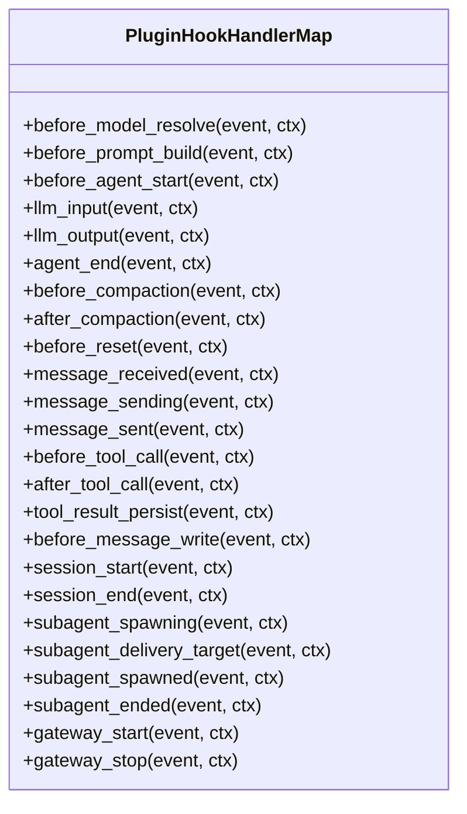
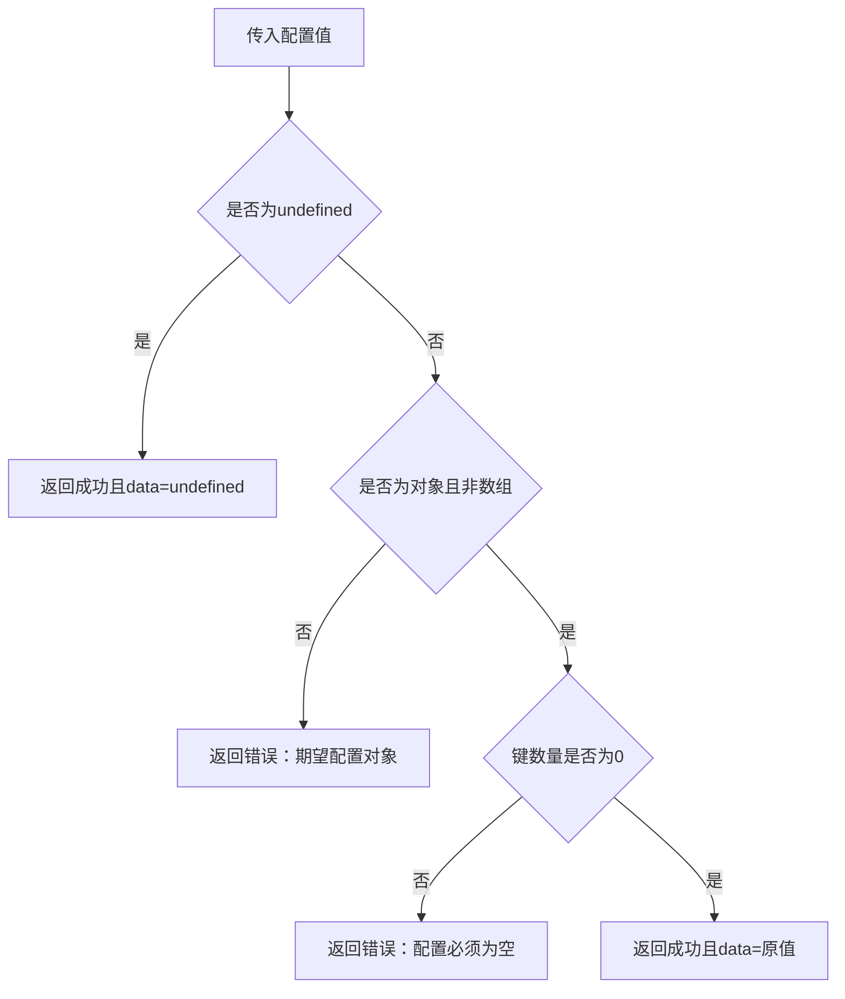
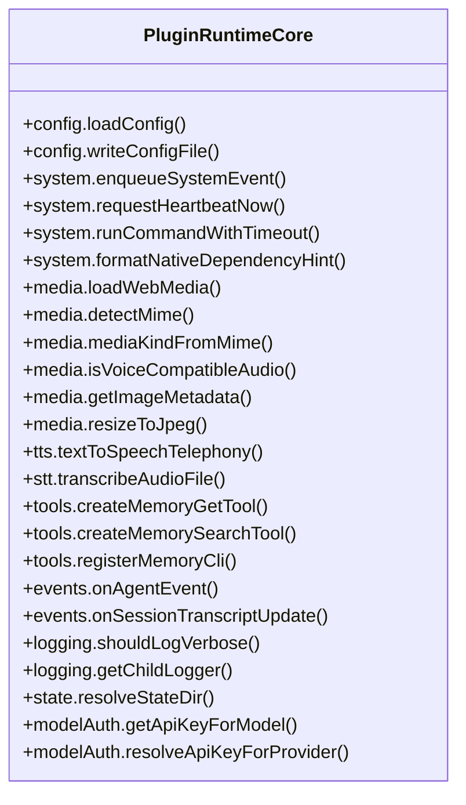
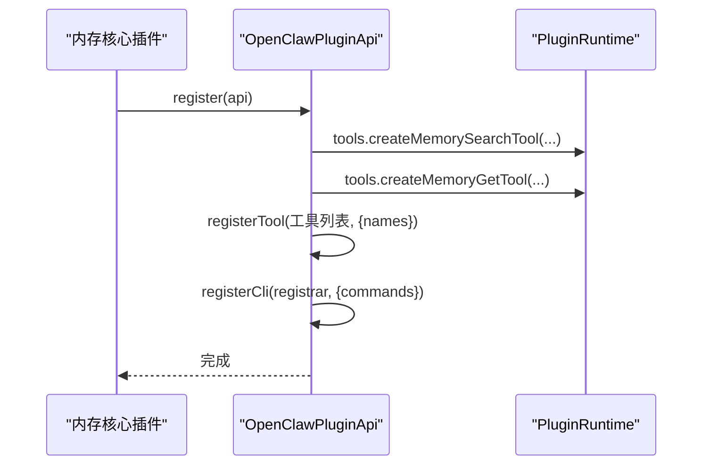
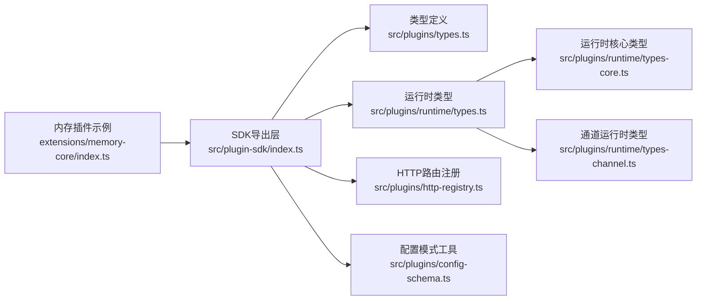

# 核心插件接口

<cite>
**本文档引用的文件**
- [src/plugin-sdk/index.ts](file://src/plugin-sdk/index.ts)
- [src/plugins/types.ts](file://src/plugins/types.ts)
- [src/plugins/runtime/types.ts](file://src/plugins/runtime/types.ts)
- [src/plugins/runtime/types-core.ts](file://src/plugins/runtime/types-core.ts)
- [src/plugins/runtime/types-channel.ts](file://src/plugins/runtime/types-channel.ts)
- [src/plugins/http-registry.ts](file://src/plugins/http-registry.ts)
- [src/plugins/config-schema.ts](file://src/plugins/config-schema.ts)
- [extensions/memory-core/index.ts](file://extensions/memory-core/index.ts)
- [src/plugins/logger.ts](file://src/plugins/logger.ts)
- [src/plugins/runtime/runtime-logging.ts](file://src/plugins/runtime/runtime-logging.ts)
</cite>

## 目录

1. [简介](#简介)
2. [项目结构](#项目结构)
3. [核心组件](#核心组件)
4. [架构总览](#架构总览)
5. [详细组件分析](#详细组件分析)
6. [依赖关系分析](#依赖关系分析)
7. [性能考量](#性能考量)
8. [故障排查指南](#故障排查指南)
9. [结论](#结论)
10. [附录](#附录)

## 简介

本文件面向OpenClaw核心插件开发者，系统化梳理插件SDK的基础接口定义、生命周期管理与运行时环境，详述插件注册机制、事件处理接口与配置管理API，并给出初始化、销毁与状态管理的方法签名与参数说明。文档同时覆盖插件间通信机制、错误处理与调试接口，帮助开发者快速理解并正确实现核心插件接口。

## 项目结构

OpenClaw将插件能力以“SDK导出层 + 运行时类型 + 注册中心 + 通道适配”的方式组织，核心入口位于插件SDK导出层，运行时类型定义在runtime目录，HTTP路由注册由独立模块负责，配置模式通过空配置模式工具函数提供。

**图表来源**

- [src/plugin-sdk/index.ts:1-826](file://src/plugin-sdk/index.ts#L1-L826)
- [src/plugins/types.ts:1-893](file://src/plugins/types.ts#L1-L893)
- [src/plugins/runtime/types.ts:1-64](file://src/plugins/runtime/types.ts#L1-L64)
- [src/plugins/runtime/types-core.ts:1-68](file://src/plugins/runtime/types-core.ts#L1-L68)
- [src/plugins/runtime/types-channel.ts:1-166](file://src/plugins/runtime/types-channel.ts#L1-L166)
- [src/plugins/http-registry.ts:1-93](file://src/plugins/http-registry.ts#L1-L93)
- [src/plugins/config-schema.ts:1-34](file://src/plugins/config-schema.ts#L1-L34)
- [extensions/memory-core/index.ts:1-39](file://extensions/memory-core/index.ts#L1-L39)

**章节来源**

- [src/plugin-sdk/index.ts:1-826](file://src/plugin-sdk/index.ts#L1-L826)

## 核心组件

- 插件定义与API
  - 插件定义：包含标识、名称、版本、描述、类型、配置模式、生命周期回调等字段。
  - 插件API：提供注册工具、钩子、HTTP路由、通道、网关方法、CLI、服务、提供商等能力。
- 运行时环境
  - 核心运行时：提供配置读写、系统事件、命令执行、媒体处理、TTS/STT、工具注册、事件订阅、日志、状态目录解析、模型鉴权等。
  - 子代理运行时：提供会话运行、等待、消息查询、删除会话等能力。
  - 通道运行时：提供文本分块、回复派发、路由、配对、媒体获取、活动记录、会话元数据、提及、反应、群组策略、防抖、命令解析、各渠道能力等。
- 配置管理
  - 配置模式：支持safeParse、parse、validate、uiHints、jsonSchema等；空配置模式用于无配置插件。
- HTTP路由注册
  - 路径归一化、重叠检测、权限匹配、替换策略、注销回调。
- 日志与调试
  - 插件加载器日志桥接、运行时日志工厂、子日志器创建。

**章节来源**

- [src/plugins/types.ts:248-306](file://src/plugins/types.ts#L248-L306)
- [src/plugins/runtime/types.ts:51-63](file://src/plugins/runtime/types.ts#L51-L63)
- [src/plugins/runtime/types-core.ts:10-67](file://src/plugins/runtime/types-core.ts#L10-L67)
- [src/plugins/runtime/types-channel.ts:16-165](file://src/plugins/runtime/types-channel.ts#L16-L165)
- [src/plugins/config-schema.ts:13-33](file://src/plugins/config-schema.ts#L13-L33)
- [src/plugins/http-registry.ts:12-92](file://src/plugins/http-registry.ts#L12-L92)
- [src/plugins/logger.ts:10-16](file://src/plugins/logger.ts#L10-L16)
- [src/plugins/runtime/runtime-logging.ts:6-20](file://src/plugins/runtime/runtime-logging.ts#L6-L20)

## 架构总览

下图展示插件SDK如何将类型、运行时与注册机制串联，形成统一的插件开发与运行框架。

**图表来源**

- [src/plugins/types.ts:248-306](file://src/plugins/types.ts#L248-L306)
- [src/plugins/runtime/types.ts:51-63](file://src/plugins/runtime/types.ts#L51-L63)
- [src/plugins/runtime/types-core.ts:10-67](file://src/plugins/runtime/types-core.ts#L10-L67)
- [src/plugins/runtime/types-channel.ts:16-165](file://src/plugins/runtime/types-channel.ts#L16-L165)

## 详细组件分析

### 插件定义与生命周期

- 插件定义字段
  - id/name/version/description：插件标识与元信息
  - kind：插件类型（如memory、context-engine）
  - configSchema：配置模式对象
  - register/activate：生命周期回调
- 生命周期回调
  - register：插件被发现后调用，用于注册工具、钩子、HTTP路由、通道、网关方法、CLI、服务、提供商、命令、上下文引擎等
  - activate：插件激活阶段（可选）

**图表来源**

- [src/plugins/types.ts:248-306](file://src/plugins/types.ts#L248-L306)

**章节来源**

- [src/plugins/types.ts:248-306](file://src/plugins/types.ts#L248-L306)

### 插件注册机制

- 工具注册
  - registerTool(tool | factory, opts?)：注册单个或多个工具，支持命名选项
- 钩子注册
  - registerHook(events, handler, opts?)：注册内部钩子，支持事件名数组与选项
- HTTP路由注册
  - registerHttpRoute(params)：注册HTTP路由，含路径、处理器、认证方式、匹配策略、替换行为等
- 通道注册
  - registerChannel(registration | ChannelPlugin)：注册通道插件与停靠点
- 网关方法注册
  - registerGatewayMethod(method, handler)：注册网关请求处理器
- CLI注册
  - registerCli(registrar, opts?)：注册CLI命令注册器
- 服务注册
  - registerService(service)：注册后台服务（start/stop）
- 提供商注册
  - registerProvider(provider)：注册提供商（认证、模型、别名等）
- 命令注册
  - registerCommand(command)：注册绕过LLM的自定义命令
- 上下文引擎注册
  - registerContextEngine(id, factory)：注册上下文引擎（独占槽位）

**图表来源**

- [src/plugins/types.ts:273-298](file://src/plugins/types.ts#L273-L298)
- [src/plugins/http-registry.ts:12-92](file://src/plugins/http-registry.ts#L12-L92)

**章节来源**

- [src/plugins/types.ts:273-298](file://src/plugins/types.ts#L273-L298)
- [src/plugins/http-registry.ts:12-92](file://src/plugins/http-registry.ts#L12-L92)

### 事件处理接口（插件钩子）

- 钩子类型
  - 模型解析前、提示构建前、代理启动前、LLM输入/输出、代理结束、压缩前后、重置前、消息收发/已发送、工具调用前后、结果持久化、消息写入前、会话开始/结束、子代理派生/投递目标/已派生/结束、网关启动/停止等
- 钩子事件与结果
  - 每类钩子对应事件对象与可选结果对象，支持修改、阻断、取消等控制
- 钩子注册
  - on(hookName, handler, opts?)：按优先级注册生命周期钩子

**图表来源**

- [src/plugins/types.ts:787-884](file://src/plugins/types.ts#L787-L884)

**章节来源**

- [src/plugins/types.ts:321-372](file://src/plugins/types.ts#L321-L372)
- [src/plugins/types.ts:787-884](file://src/plugins/types.ts#L787-L884)

### 配置管理API

- 配置模式接口
  - safeParse：返回success/data/error
  - parse：直接解析
  - validate：返回ok/errors
  - uiHints：UI提示键值
  - jsonSchema：JSON Schema
- 空配置模式
  - emptyPluginConfigSchema：用于无配置插件，校验空对象

**图表来源**

- [src/plugins/config-schema.ts:13-33](file://src/plugins/config-schema.ts#L13-L33)

**章节来源**

- [src/plugins/types.ts:44-56](file://src/plugins/types.ts#L44-L56)
- [src/plugins/config-schema.ts:13-33](file://src/plugins/config-schema.ts#L13-L33)

### 运行时环境与API

- 运行时核心能力
  - 配置：loadConfig/writeConfigFile
  - 系统：enqueueSystemEvent/requestHeartbeatNow/runCommandWithTimeout/formatNativeDependencyHint
  - 媒体：loadWebMedia/detectMime/mediaKindFromMime/isVoiceCompatibleAudio/getImageMetadata/resizeToJpeg
  - TTS/STT：textToSpeechTelephony/transcribeAudioFile
  - 工具：createMemoryGetTool/createMemorySearchTool/registerMemoryCli
  - 事件：onAgentEvent/onSessionTranscriptUpdate
  - 日志：shouldLogVerbose/getChildLogger
  - 状态：resolveStateDir
  - 模型鉴权：getApiKeyForModel/resolveApiKeyForProvider
- 子代理运行时
  - run/waitForRun/getSessionMessages/getSession/deleteSession
- 通道运行时
  - 文本分块、回复派发、路由、配对、媒体获取、活动记录、会话元数据、提及、反应、群组策略、防抖、命令解析、各渠道能力

**图表来源**

- [src/plugins/runtime/types-core.ts:10-67](file://src/plugins/runtime/types-core.ts#L10-L67)

**章节来源**

- [src/plugins/runtime/types.ts:51-63](file://src/plugins/runtime/types.ts#L51-L63)
- [src/plugins/runtime/types-core.ts:10-67](file://src/plugins/runtime/types-core.ts#L10-L67)
- [src/plugins/runtime/types-channel.ts:16-165](file://src/plugins/runtime/types-channel.ts#L16-L165)

### 插件间通信机制

- 通过运行时API共享能力
  - 工具注册：插件A注册工具，插件B可通过运行时工具集合访问
  - 事件订阅：通过运行时事件接口订阅代理事件与会话转录更新
  - 通道能力：通过通道运行时在不同渠道间传递消息与状态
- HTTP路由注册
  - 插件可注册HTTP路由，通过路径与认证策略与其他插件协作
  - 路由冲突检测与替换策略保障唯一性

**章节来源**

- [src/plugins/types.ts:273-298](file://src/plugins/types.ts#L273-L298)
- [src/plugins/http-registry.ts:12-92](file://src/plugins/http-registry.ts#L12-L92)

### 错误处理与调试接口

- 插件日志
  - createPluginLoaderLogger：桥接外部日志到插件日志接口
  - createRuntimeLogging：运行时日志工厂，支持子日志器与级别
- 调试建议
  - 使用getChildLogger创建带绑定的子日志器
  - 在register/activate中记录关键步骤
  - 对HTTP路由注册失败进行告警与回滚

**章节来源**

- [src/plugins/logger.ts:10-16](file://src/plugins/logger.ts#L10-L16)
- [src/plugins/runtime/runtime-logging.ts:6-20](file://src/plugins/runtime/runtime-logging.ts#L6-L20)

### 实现示例

- 内存核心插件示例
  - 使用emptyPluginConfigSchema定义空配置
  - 在register中注册内存搜索与获取工具
  - 通过CLI注册器注册内存相关命令

**图表来源**

- [extensions/memory-core/index.ts:10-35](file://extensions/memory-core/index.ts#L10-L35)

**章节来源**

- [extensions/memory-core/index.ts:1-39](file://extensions/memory-core/index.ts#L1-L39)

## 依赖关系分析

- 导出层聚合
  - 插件SDK导出层集中导出类型、运行时、通道、HTTP路由、配置模式、工具与辅助函数
- 类型耦合
  - OpenClawPluginApi强依赖PluginRuntime与OpenClawConfig
  - PluginRuntime组合PluginRuntimeCore与PluginRuntimeChannel
- 注册中心
  - HTTP路由注册器依赖注册表，提供冲突检测与替换逻辑

**图表来源**

- [src/plugin-sdk/index.ts:1-826](file://src/plugin-sdk/index.ts#L1-L826)
- [src/plugins/types.ts:1-893](file://src/plugins/types.ts#L1-L893)
- [src/plugins/runtime/types.ts:1-64](file://src/plugins/runtime/types.ts#L1-L64)
- [src/plugins/runtime/types-core.ts:1-68](file://src/plugins/runtime/types-core.ts#L1-L68)
- [src/plugins/runtime/types-channel.ts:1-166](file://src/plugins/runtime/types-channel.ts#L1-L166)
- [src/plugins/http-registry.ts:1-93](file://src/plugins/http-registry.ts#L1-L93)
- [src/plugins/config-schema.ts:1-34](file://src/plugins/config-schema.ts#L1-L34)
- [extensions/memory-core/index.ts:1-39](file://extensions/memory-core/index.ts#L1-L39)

**章节来源**

- [src/plugin-sdk/index.ts:1-826](file://src/plugin-sdk/index.ts#L1-L826)

## 性能考量

- 避免在钩子中执行阻塞操作，优先异步处理
- 合理使用分块与缓存（文本分块、媒体缓存、会话文件读取）
- 控制HTTP路由数量与匹配策略，减少冲突检测开销
- 使用运行时事件与日志进行性能观测与瓶颈定位

## 故障排查指南

- HTTP路由冲突
  - 现象：路由重复或权限不一致导致注册失败
  - 处理：检查路径与匹配策略，启用replaceExisting或调整路径
- 配置校验失败
  - 现象：emptyPluginConfigSchema拒绝非空配置
  - 处理：确认插件无需配置或提供正确的空对象
- 日志缺失
  - 现象：插件未输出日志
  - 处理：使用getChildLogger创建子日志器，确保级别设置正确

**章节来源**

- [src/plugins/http-registry.ts:36-74](file://src/plugins/http-registry.ts#L36-L74)
- [src/plugins/config-schema.ts:19-25](file://src/plugins/config-schema.ts#L19-L25)
- [src/plugins/runtime/runtime-logging.ts:9-19](file://src/plugins/runtime/runtime-logging.ts#L9-L19)

## 结论

OpenClaw核心插件接口通过清晰的类型定义、完善的运行时能力与严格的注册机制，为插件生态提供了稳定可靠的扩展平台。开发者应遵循生命周期回调、事件钩子与配置模式规范，结合HTTP路由与通道能力实现插件间高效协作，并通过日志与调试接口保障稳定性与可观测性。

## 附录

- 关键API速查
  - 插件定义：OpenClawPluginDefinition
  - 插件API：OpenClawPluginApi
  - 运行时：PluginRuntime、PluginRuntimeCore、PluginRuntimeChannel
  - HTTP路由：registerPluginHttpRoute
  - 配置模式：OpenClawPluginConfigSchema、emptyPluginConfigSchema
  - 日志：createPluginLoaderLogger、createRuntimeLogging
