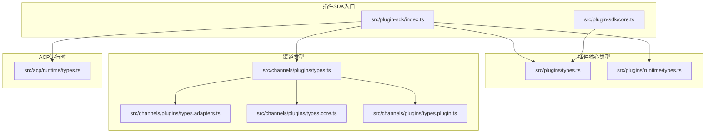
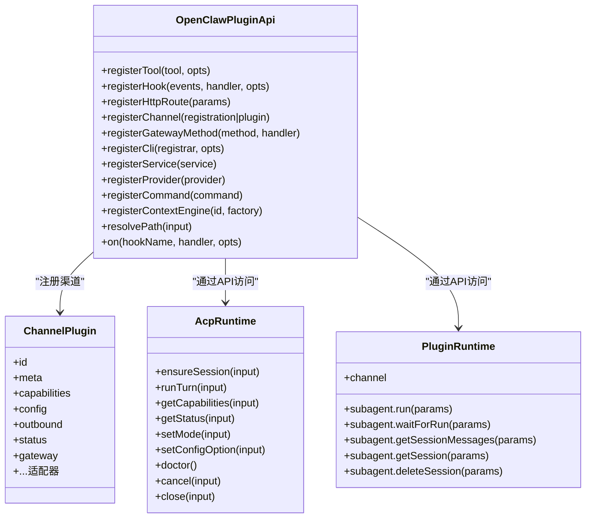
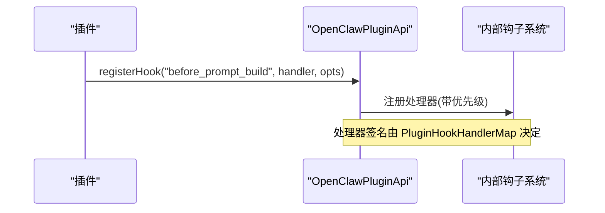
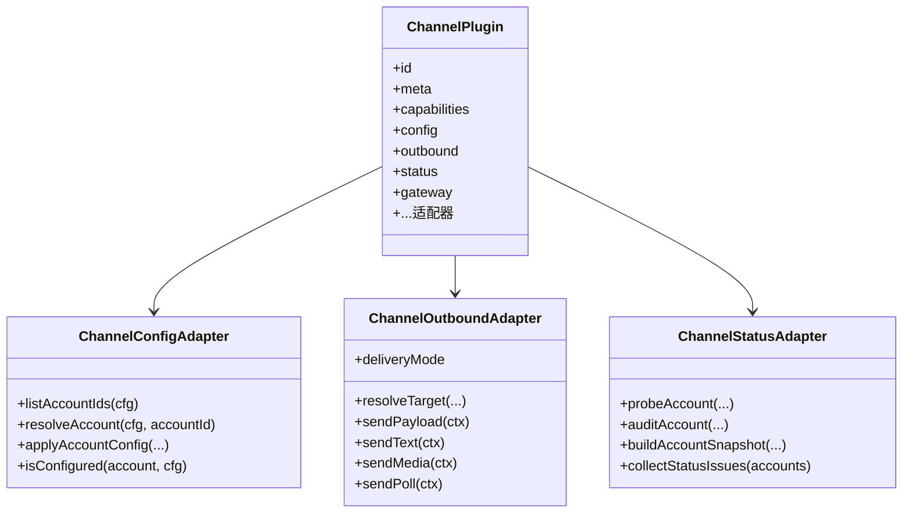
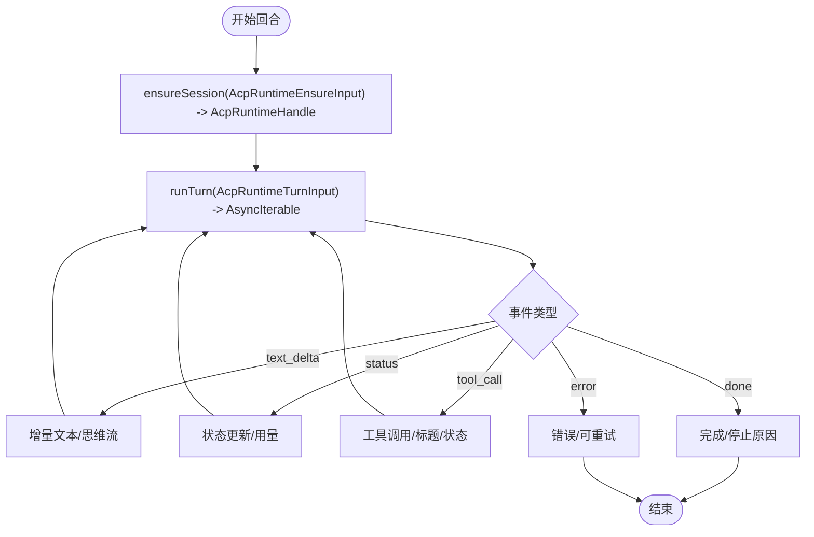
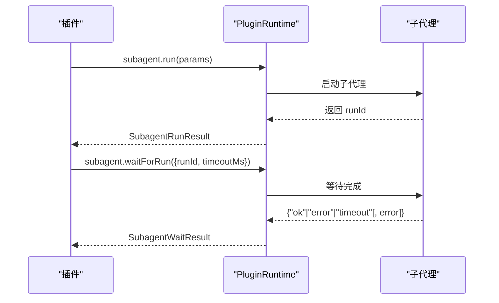
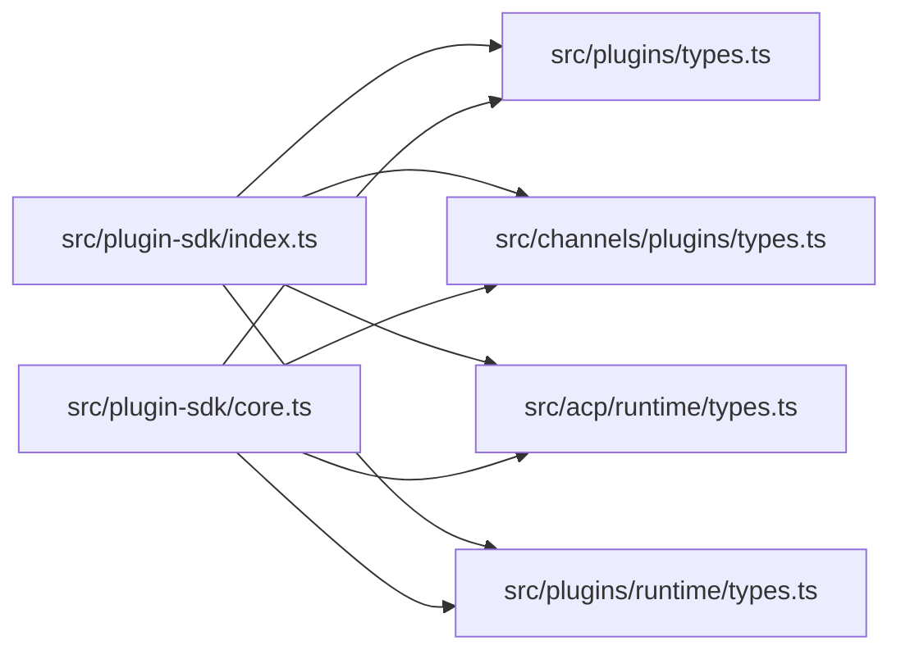

# 类型定义

<cite>
**本文引用的文件**
- [src/plugin-sdk/index.ts](file://src/plugin-sdk/index.ts)
- [src/plugin-sdk/core.ts](file://src/plugin-sdk/core.ts)
- [src/plugins/types.ts](file://src/plugins/types.ts)
- [src/channels/plugins/types.ts](file://src/channels/plugins/types.ts)
- [src/channels/plugins/types.adapters.ts](file://src/channels/plugins/types.adapters.ts)
- [src/channels/plugins/types.core.ts](file://src/channels/plugins/types.core.ts)
- [src/channels/plugins/types.plugin.ts](file://src/channels/plugins/types.plugin.ts)
- [src/acp/runtime/types.ts](file://src/acp/runtime/types.ts)
- [src/plugins/runtime/types.ts](file://src/plugins/runtime/types.ts)
- [scripts/write-plugin-sdk-entry-dts.ts](file://scripts/write-plugin-sdk-entry-dts.ts)
- [scripts/check-plugin-sdk-exports.mjs](file://scripts/check-plugin-sdk-exports.mjs)
</cite>

## 目录

1. [简介](#简介)
2. [项目结构](#项目结构)
3. [核心组件](#核心组件)
4. [架构总览](#架构总览)
5. [详细组件分析](#详细组件分析)
6. [依赖分析](#依赖分析)
7. [性能考量](#性能考量)
8. [故障排查指南](#故障排查指南)
9. [结论](#结论)
10. [附录](#附录)

## 简介

本文件为 OpenClaw 插件 SDK 的类型定义参考文档，覆盖插件公共接口的类型声明、枚举与常量、配置类型、消息与事件结构、生命周期状态与错误类型等。文档以“从类型到实现”的方式组织，帮助开发者在编译期与运行期均能正确使用类型系统进行插件开发。

## 项目结构

插件 SDK 的类型分布在多个模块中：

- 入口导出：统一聚合导出，便于外部按需引入。
- 插件核心类型：插件生命周期钩子、工具、命令、HTTP 路由、服务等。
- 渠道（Channel）类型：渠道适配器、核心类型、插件契约、消息动作等。
- ACP 运行时类型：会话句柄、回合输入、能力与事件等。
- 运行时类型：子代理运行、等待、会话消息查询等。

图表来源

- [src/plugin-sdk/index.ts:1-826](file://src/plugin-sdk/index.ts#L1-L826)
- [src/plugin-sdk/core.ts:1-44](file://src/plugin-sdk/core.ts#L1-L44)
- [src/plugins/types.ts:1-893](file://src/plugins/types.ts#L1-L893)
- [src/channels/plugins/types.ts:1-66](file://src/channels/plugins/types.ts#L1-L66)
- [src/channels/plugins/types.adapters.ts:1-384](file://src/channels/plugins/types.adapters.ts#L1-L384)
- [src/channels/plugins/types.core.ts:1-403](file://src/channels/plugins/types.core.ts#L1-L403)
- [src/channels/plugins/types.plugin.ts:1-86](file://src/channels/plugins/types.plugin.ts#L1-L86)
- [src/acp/runtime/types.ts:1-139](file://src/acp/runtime/types.ts#L1-L139)
- [src/plugins/runtime/types.ts:1-64](file://src/plugins/runtime/types.ts#L1-L64)

章节来源

- [src/plugin-sdk/index.ts:1-826](file://src/plugin-sdk/index.ts#L1-L826)
- [src/plugin-sdk/core.ts:1-44](file://src/plugin-sdk/core.ts#L1-L44)

## 核心组件

本节梳理插件 SDK 的关键类型与职责边界，帮助快速定位所需类型。

- 插件 API 与生命周期
  - OpenClawPluginApi：插件注册与上下文访问的统一入口，支持注册工具、钩子、HTTP 路由、渠道、网关方法、CLI、服务、提供者与命令等。
  - 插件钩子名称集合与类型映射：包括模型解析前、提示构建前、代理开始、LLM 输入/输出、消息收发、工具调用前后、结果持久化、会话开始/结束、子代理生命周期、网关启停等。
  - 钩子事件与结果类型：如 before*prompt_build、llm_input、message_sending、before_tool_call、tool_result_persist、session_start/end、subagent*_、gateway\__ 等。
- 插件配置与工具
  - OpenClawPluginConfigSchema：配置校验与 UI 提示的抽象，支持 safeParse、parse、validate、uiHints、jsonSchema。
  - OpenClawPluginToolContext：工具执行上下文，包含会话键、会话 ID、消息通道、请求者身份等。
  - OpenClawPluginToolFactory：工具工厂函数，返回单个或多个工具。
  - OpenClawPluginToolOptions：工具注册选项，支持命名、可选等。
- 插件命令与 HTTP 路由
  - PluginCommandContext/PluginCommandResult：命令上下文与结果，结果类型为 ReplyPayload。
  - OpenClawPluginHttpRouteParams：HTTP 路由注册参数，支持认证模式与匹配策略。
- 插件服务与 CLI
  - OpenClawPluginService/ServiceContext：服务生命周期与上下文。
  - OpenClawPluginCliRegistrar/CliContext：CLI 注册器与上下文。
- 渠道插件契约
  - ChannelPlugin：渠道插件契约，包含元数据、能力、适配器集合、消息动作、心跳等。
  - ChannelConfigAdapter/ChannelOutboundAdapter/ChannelStatusAdapter 等：渠道适配器抽象，定义账户配置、发送、状态探测与审计等能力。
  - ChannelAgentTool/ChannelAgentPromptAdapter：渠道侧工具与提示适配。
- ACP 运行时
  - AcpRuntimeHandle/AcpRuntimeEnsureInput/AcpRuntimeTurnInput：会话句柄、会话确保输入、回合输入。
  - AcpRuntimeEvent/AcpRuntimeStatus/AcpRuntimeCapabilities：事件、状态与能力描述。
- 运行时子代理
  - SubagentRunParams/SubagentRunResult/SubagentWaitParams/SubagentWaitResult/SubagentGetSessionMessages\*：子代理运行、等待、查询会话消息等。

章节来源

- [src/plugins/types.ts:22-306](file://src/plugins/types.ts#L22-L306)
- [src/plugins/types.ts:321-893](file://src/plugins/types.ts#L321-L893)
- [src/channels/plugins/types.plugin.ts:49-85](file://src/channels/plugins/types.plugin.ts#L49-L85)
- [src/channels/plugins/types.adapters.ts:24-384](file://src/channels/plugins/types.adapters.ts#L24-L384)
- [src/channels/plugins/types.core.ts:15-403](file://src/channels/plugins/types.core.ts#L15-L403)
- [src/acp/runtime/types.ts:20-139](file://src/acp/runtime/types.ts#L20-L139)
- [src/plugins/runtime/types.ts:8-63](file://src/plugins/runtime/types.ts#L8-L63)

## 架构总览

下图展示插件 SDK 的类型分层与交互关系，强调“插件 API”作为统一入口，“渠道适配器”“ACP 运行时”“运行时子代理”作为扩展点。

图表来源

- [src/plugins/types.ts:263-306](file://src/plugins/types.ts#L263-L306)
- [src/channels/plugins/types.plugin.ts:49-85](file://src/channels/plugins/types.plugin.ts#L49-L85)
- [src/acp/runtime/types.ts:118-139](file://src/acp/runtime/types.ts#L118-L139)
- [src/plugins/runtime/types.ts:51-63](file://src/plugins/runtime/types.ts#L51-L63)

## 详细组件分析

### 插件 API 与生命周期类型

- 统一入口 OpenClawPluginApi：提供注册与上下文访问能力，支持钩子优先级、路径解析、服务与提供者注册等。
- 钩子体系：包含提示注入、模型解析、代理生命周期、消息流、工具调用、会话与子代理、网关启停等钩子名称与事件/结果类型。
- 钩子处理器映射：按钩子名称映射到对应的处理器签名，确保类型安全。

图表来源

- [src/plugins/types.ts:263-306](file://src/plugins/types.ts#L263-L306)
- [src/plugins/types.ts:787-884](file://src/plugins/types.ts#L787-L884)

章节来源

- [src/plugins/types.ts:263-306](file://src/plugins/types.ts#L263-L306)
- [src/plugins/types.ts:321-893](file://src/plugins/types.ts#L321-L893)

### 渠道插件类型与适配器

- ChannelPlugin 契约：定义渠道元信息、能力、适配器集合与消息动作等。
- 适配器族：
  - 配置与设置：ChannelConfigAdapter、ChannelSetupAdapter
  - 发送与轮询：ChannelOutboundAdapter、ChannelPollContext/PollResult
  - 状态与探测：ChannelStatusAdapter、BaseProbeResult/BaseTokenResolution
  - 网关与登录：ChannelGatewayAdapter、ChannelLoginWithQrStartResult/WaitResult、ChannelLogoutContext/Result
  - 安全与权限：ChannelSecurityAdapter、ChannelSecurityDmPolicy
  - 消息与动作：ChannelMessagingAdapter、ChannelMessageActionAdapter、ChannelMessageActionName
  - 线程与提及：ChannelThreadingAdapter、ChannelMentionAdapter
  - 提示与工具：ChannelAgentPromptAdapter、ChannelAgentTool/Factory
- 核心类型：ChannelId、ChannelCapabilities、ChannelAccountSnapshot、ChannelMeta、ChannelGroupContext 等。

图表来源

- [src/channels/plugins/types.plugin.ts:49-85](file://src/channels/plugins/types.plugin.ts#L49-L85)
- [src/channels/plugins/types.adapters.ts:24-384](file://src/channels/plugins/types.adapters.ts#L24-L384)
- [src/channels/plugins/types.core.ts:15-403](file://src/channels/plugins/types.core.ts#L15-L403)

章节来源

- [src/channels/plugins/types.plugin.ts:49-85](file://src/channels/plugins/types.plugin.ts#L49-L85)
- [src/channels/plugins/types.adapters.ts:24-384](file://src/channels/plugins/types.adapters.ts#L24-L384)
- [src/channels/plugins/types.core.ts:15-403](file://src/channels/plugins/types.core.ts#L15-L403)

### ACP 运行时类型

- 会话与回合：AcpRuntimeHandle、AcpRuntimeEnsureInput、AcpRuntimeTurnInput、AcpRuntimeTurnAttachment
- 能力与状态：AcpRuntimeCapabilities、AcpRuntimeStatus、AcpSessionUpdateTag
- 事件模型：AcpRuntimeEvent（text_delta/status/tool_call/done/error）
- 接口：AcpRuntime.ensureSession/runTurn/getCapabilities/getStatus/setMode/setConfigOption/doctor/cancel/close

图表来源

- [src/acp/runtime/types.ts:34-139](file://src/acp/runtime/types.ts#L34-L139)

章节来源

- [src/acp/runtime/types.ts:18-139](file://src/acp/runtime/types.ts#L18-L139)

### 运行时子代理类型

- 子代理运行：SubagentRunParams/SubagentRunResult
- 等待结果：SubagentWaitParams/SubagentWaitResult
- 查询会话消息：SubagentGetSessionMessagesParams/SubagentGetSessionMessagesResult（含已弃用别名）
- 删除会话：SubagentDeleteSessionParams
- PluginRuntime.subagent：统一暴露上述能力，并提供 channel 访问

图表来源

- [src/plugins/runtime/types.ts:8-63](file://src/plugins/runtime/types.ts#L8-L63)

章节来源

- [src/plugins/runtime/types.ts:8-63](file://src/plugins/runtime/types.ts#L8-L63)

### 插件配置类型与校验

- OpenClawPluginConfigSchema：支持 safeParse/parse/validate/uiHints/jsonSchema，用于声明式配置校验与 UI 提示。
- 插件配置验证结果：PluginConfigValidation（ok/false 与错误数组）。
- 插件配置 UI 提示：PluginConfigUiHint（标签、帮助、高级、敏感、占位符等）。

章节来源

- [src/plugins/types.ts:40-56](file://src/plugins/types.ts#L40-L56)
- [src/plugins/types.ts:29-36](file://src/plugins/types.ts#L29-L36)

### 插件命令与 HTTP 路由

- 命令上下文与结果：PluginCommandContext/PluginCommandResult（ReplyPayload）。
- HTTP 路由注册：OpenClawPluginHttpRouteParams（路径、处理器、认证模式、匹配策略、替换行为）。
- 认证模式与匹配策略：OpenClawPluginHttpRouteAuth（gateway/plugin）、OpenClawPluginHttpRouteMatch（exact/prefix）。

章节来源

- [src/plugins/types.ts:146-220](file://src/plugins/types.ts#L146-L220)

### 插件服务与 CLI

- 服务：OpenClawPluginService/ServiceContext（启动/停止、状态目录、日志）。
- CLI：OpenClawPluginCliRegistrar/CliContext（program、config、workspaceDir、logger）。

章节来源

- [src/plugins/types.ts:230-241](file://src/plugins/types.ts#L230-L241)
- [src/plugins/types.ts:221-228](file://src/plugins/types.ts#L221-L228)

### 渠道消息动作与事件

- 动作名称：ChannelMessageActionName（来自 ChannelMessageActionNames 列表）。
- 动作上下文：ChannelMessageActionContext（包含渠道、动作、参数、媒体根、账号、请求者、网关、工具上下文、dryRun）。
- 动作适配器：ChannelMessageActionAdapter（列出动作、支持按钮/卡片、提取工具发送目标、处理动作）。

章节来源

- [src/channels/plugins/types.ts:5-6](file://src/channels/plugins/types.ts#L5-L6)
- [src/channels/plugins/types.core.ts:329-351](file://src/channels/plugins/types.core.ts#L329-L351)
- [src/channels/plugins/types.core.ts:359-372](file://src/channels/plugins/types.core.ts#L359-L372)

## 依赖分析

- 入口导出：src/plugin-sdk/index.ts 聚合导出插件核心、渠道、ACP 运行时、运行时类型、工具与实用函数。
- 核心导出：src/plugin-sdk/core.ts 聚合常用类型与工具，便于轻量导入。
- 分发脚本：write-plugin-sdk-entry-dts.ts 生成稳定入口 d.ts；check-plugin-sdk-exports.mjs 校验导出完整性，防止遗漏。

图表来源

- [src/plugin-sdk/index.ts:1-826](file://src/plugin-sdk/index.ts#L1-L826)
- [src/plugin-sdk/core.ts:1-44](file://src/plugin-sdk/core.ts#L1-L44)

章节来源

- [scripts/write-plugin-sdk-entry-dts.ts:9-60](file://scripts/write-plugin-sdk-entry-dts.ts#L9-L60)
- [scripts/check-plugin-sdk-exports.mjs:16-42](file://scripts/check-plugin-sdk-exports.mjs#L16-L42)

## 性能考量

- 钩子处理器应避免阻塞：建议在 before*\* 与 llm*\* 钩子中仅做必要计算，避免长耗时操作。
- 文本分块与媒体处理：合理设置 textChunkLimit、chunkerMode，减少网络往返与内存峰值。
- 子代理等待超时：根据场景设置合理的超时时间，避免长时间占用资源。
- ACP 事件流：在 runTurn 中按事件类型及时消费增量文本与状态，避免累积导致延迟。

## 故障排查指南

- 导出缺失：使用 check-plugin-sdk-exports.mjs 在构建后检查 dist 输出中的导出是否完整，避免运行时错误。
- 配置校验失败：通过 OpenClawPluginConfigSchema.validate 或 safeParse 获取错误列表，结合 uiHints 提示用户修正。
- 渠道适配器未实现：若某些适配器未实现，可能导致功能降级或运行时错误，需按适配器契约补充实现。
- ACP 会话异常：关注 AcpRuntimeEvent 中的 error 类型与 retryable 字段，决定是否重试或回退。

章节来源

- [scripts/check-plugin-sdk-exports.mjs:16-42](file://scripts/check-plugin-sdk-exports.mjs#L16-L42)
- [src/plugins/types.ts:40-56](file://src/plugins/types.ts#L40-L56)
- [src/channels/plugins/types.adapters.ts:275-289](file://src/channels/plugins/types.adapters.ts#L275-L289)
- [src/acp/runtime/types.ts:118-139](file://src/acp/runtime/types.ts#L118-L139)

## 结论

本参考文档系统性地梳理了 OpenClaw 插件 SDK 的类型定义，覆盖插件 API、渠道适配器、ACP 运行时与运行时子代理等关键领域。通过遵循本文档的类型约束与最佳实践，开发者可在编译期与运行期均获得强类型保障，提升插件开发的可靠性与一致性。

## 附录

- 类型别名与接口继承
  - ChannelMessageActionName：基于 ChannelMessageActionNames 的类型别名。
  - ChannelAgentTool：在 AgentTool 基础上增加 ownerOnly 标记。
  - ChannelOutboundAdapter：在发送能力上扩展轮询与分块策略。
- 泛型使用
  - ChannelPlugin<ResolvedAccount, Probe, Audit>：通过泛型承载不同渠道的账户解析、探测与审计类型。
  - AcpRuntime：接口方法采用泛型参数与返回值，便于扩展不同后端能力。
- 默认值与约束
  - ChannelOutboundAdapter.deliveryMode 默认值为 direct/gateway/hybrid，具体取决于渠道能力。
  - 钩子名称集合通过只读数组与断言确保完整性，避免遗漏或拼写错误。
- 错误与异常
  - AcpRuntimeEvent 支持 error 类型，包含可重试标记与代码，便于上层策略处理。
  - PluginConfigValidation 提供结构化错误列表，便于 UI 层展示与修复指引。
