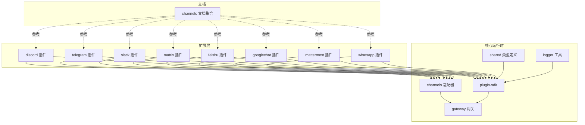
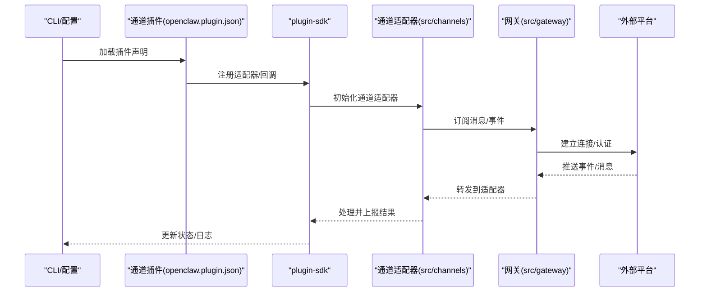
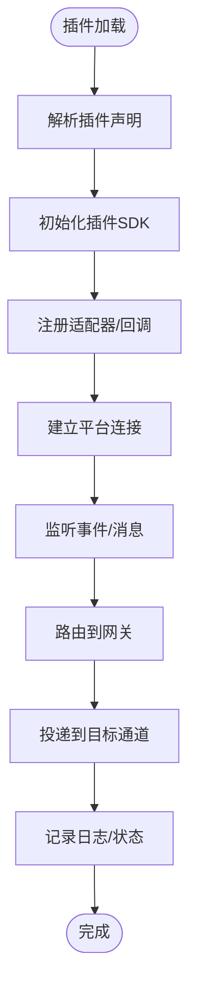
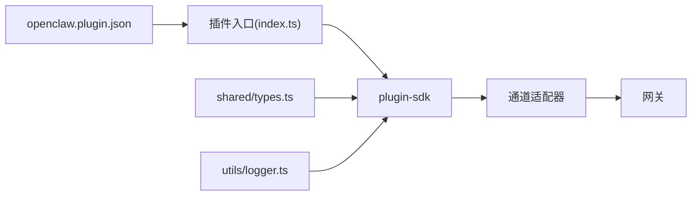

# 通道插件API

<cite>
**本文引用的文件**
- [extensions/discord/openclaw.plugin.json](file://extensions/discord/openclaw.plugin.json)
- [extensions/telegram/openclaw.plugin.json](file://extensions/telegram/openclaw.plugin.json)
- [extensions/slack/openclaw.plugin.json](file://extensions/slack/openclaw.plugin.json)
- [extensions/matrix/openclaw.plugin.json](file://extensions/matrix/openclaw.plugin.json)
- [extensions/feishu/openclaw.plugin.json](file://extensions/feishu/openclaw.plugin.json)
- [extensions/googlechat/openclaw.plugin.json](file://extensions/googlechat/openclaw.plugin.json)
- [extensions/mattermost/openclaw.plugin.json](file://extensions/mattermost/openclaw.plugin.json)
- [extensions/whatsapp/openclaw.plugin.json](file://extensions/whatsapp/openclaw.plugin.json)
- [docs/channels/index.md](file://docs/channels/index.md)
- [docs/channels/discord.md](file://docs/channels/discord.md)
- [docs/channels/telegram.md](file://docs/channels/telegram.md)
- [docs/channels/slack.md](file://docs/channels/slack.md)
- [docs/channels/matrix.md](file://docs/channels/matrix.md)
- [docs/channels/feishu.md](file://docs/channels/feishu.md)
- [docs/channels/googlechat.md](file://docs/channels/googlechat.md)
- [docs/channels/mattermost.md](file://docs/channels/mattermost.md)
- [docs/channels/whatsapp.md](file://docs/channels/whatsapp.md)
- [docs/channels/troubleshooting.md](file://docs/channels/troubleshooting.md)
- [docs/cli/channels.md](file://docs/cli/channels.md)
- [src/plugin-sdk/index.ts](file://src/plugin-sdk/index.ts)
- [src/channels/index.ts](file://src/channels/index.ts)
- [src/gateway/index.ts](file://src/gateway/index.ts)
- [src/shared/types.ts](file://src/shared/types.ts)
- [src/utils/logger.ts](file://src/utils/logger.ts)
</cite>

## 目录

1. [简介](#简介)
2. [项目结构](#项目结构)
3. [核心组件](#核心组件)
4. [架构总览](#架构总览)
5. [详细组件分析](#详细组件分析)
6. [依赖关系分析](#依赖关系分析)
7. [性能考虑](#性能考虑)
8. [故障排除指南](#故障排除指南)
9. [结论](#结论)
10. [附录](#附录)

## 简介

本文件为通道插件API的完整参考文档，聚焦于消息平台插件接口与实现，覆盖Discord、Telegram、Slack、Matrix、飞书（Feishu）、Google Chat、Mattermost、WhatsApp等主流IM平台。内容涵盖通道连接管理、消息发送与接收、用户认证与权限控制、通道特定功能（如语音消息、文件上传、群组管理）、生命周期事件、状态同步与故障恢复机制，并提供开发最佳实践与性能优化建议。

## 项目结构

通道插件以“扩展”形式组织在extensions目录下，每个平台对应一个子目录，包含插件入口index.ts与openclaw.plugin.json声明文件。文档在docs/channels中提供各平台的使用说明与排障指南；核心运行时在src目录中，包括插件SDK、通道适配器与网关层。

图表来源

- [extensions/discord/openclaw.plugin.json:1-10](file://extensions/discord/openclaw.plugin.json#L1-L10)
- [extensions/telegram/openclaw.plugin.json:1-10](file://extensions/telegram/openclaw.plugin.json#L1-L10)
- [extensions/slack/openclaw.plugin.json:1-10](file://extensions/slack/openclaw.plugin.json#L1-L10)
- [extensions/matrix/openclaw.plugin.json:1-10](file://extensions/matrix/openclaw.plugin.json#L1-L10)
- [extensions/feishu/openclaw.plugin.json:1-11](file://extensions/feishu/openclaw.plugin.json#L1-L11)
- [extensions/googlechat/openclaw.plugin.json:1-10](file://extensions/googlechat/openclaw.plugin.json#L1-L10)
- [extensions/mattermost/openclaw.plugin.json:1-10](file://extensions/mattermost/openclaw.plugin.json#L1-L10)
- [extensions/whatsapp/openclaw.plugin.json:1-10](file://extensions/whatsapp/openclaw.plugin.json#L1-L10)
- [src/plugin-sdk/index.ts](file://src/plugin-sdk/index.ts)
- [src/channels/index.ts](file://src/channels/index.ts)
- [src/gateway/index.ts](file://src/gateway/index.ts)
- [src/shared/types.ts](file://src/shared/types.ts)
- [src/utils/logger.ts](file://src/utils/logger.ts)

章节来源

- [docs/channels/index.md](file://docs/channels/index.md)
- [docs/channels/discord.md](file://docs/channels/discord.md)
- [docs/channels/telegram.md](file://docs/channels/telegram.md)
- [docs/channels/slack.md](file://docs/channels/slack.md)
- [docs/channels/matrix.md](file://docs/channels/matrix.md)
- [docs/channels/feishu.md](file://docs/channels/feishu.md)
- [docs/channels/googlechat.md](file://docs/channels/googlechat.md)
- [docs/channels/mattermost.md](file://docs/channels/mattermost.md)
- [docs/channels/whatsapp.md](file://docs/channels/whatsapp.md)

## 核心组件

- 插件声明文件：每个通道插件通过openclaw.plugin.json声明插件ID、支持的通道类型以及配置模式schema。该schema用于验证与初始化阶段的配置校验。
- 插件入口：index.ts作为插件加载点，负责注册通道适配器、认证回调、消息路由与生命周期钩子。
- 通道适配器：在src/channels中实现具体平台的消息收发、事件订阅与状态同步。
- 网关层：src/gateway负责跨通道的统一桥接、会话管理与消息路由。
- 共享类型：src/shared/types.ts提供通道消息、事件、认证与权限相关的类型定义。
- 日志工具：src/utils/logger.ts提供统一的日志记录与调试能力。

章节来源

- [extensions/discord/openclaw.plugin.json:1-10](file://extensions/discord/openclaw.plugin.json#L1-L10)
- [extensions/telegram/openclaw.plugin.json:1-10](file://extensions/telegram/openclaw.plugin.json#L1-L10)
- [extensions/slack/openclaw.plugin.json:1-10](file://extensions/slack/openclaw.plugin.json#L1-L10)
- [extensions/matrix/openclaw.plugin.json:1-10](file://extensions/matrix/openclaw.plugin.json#L1-L10)
- [extensions/feishu/openclaw.plugin.json:1-11](file://extensions/feishu/openclaw.plugin.json#L1-L11)
- [extensions/googlechat/openclaw.plugin.json:1-10](file://extensions/googlechat/openclaw.plugin.json#L1-L10)
- [extensions/mattermost/openclaw.plugin.json:1-10](file://extensions/mattermost/openclaw.plugin.json#L1-L10)
- [extensions/whatsapp/openclaw.plugin.json:1-10](file://extensions/whatsapp/openclaw.plugin.json#L1-L10)
- [src/plugin-sdk/index.ts](file://src/plugin-sdk/index.ts)
- [src/channels/index.ts](file://src/channels/index.ts)
- [src/gateway/index.ts](file://src/gateway/index.ts)
- [src/shared/types.ts](file://src/shared/types.ts)
- [src/utils/logger.ts](file://src/utils/logger.ts)

## 架构总览

通道插件遵循“声明式配置 + 运行时适配”的架构。插件通过声明文件注册自身能力，运行时根据配置加载插件并建立与平台的连接。消息在通道适配器与网关之间流转，最终到达目标通道或上游系统。

图表来源

- [src/plugin-sdk/index.ts](file://src/plugin-sdk/index.ts)
- [src/channels/index.ts](file://src/channels/index.ts)
- [src/gateway/index.ts](file://src/gateway/index.ts)

## 详细组件分析

### Discord 插件

- 插件标识与通道类型：插件ID为discord，支持通道类型为discord。
- 配置模式：当前schema为空对象，表示无需额外配置项。
- 生命周期与事件：通过适配器订阅平台事件，网关负责连接与消息转发。
- 特定功能：可结合平台能力实现语音消息、文件上传与群组管理（需在适配器中实现）。
- 错误处理：使用统一日志记录异常，必要时重试或降级。

章节来源

- [extensions/discord/openclaw.plugin.json:1-10](file://extensions/discord/openclaw.plugin.json#L1-L10)
- [docs/channels/discord.md](file://docs/channels/discord.md)

### Telegram 插件

- 插件标识与通道类型：插件ID为telegram，支持通道类型为telegram。
- 配置模式：当前schema为空对象，表示无需额外配置项。
- 生命周期与事件：通过适配器订阅平台事件，网关负责连接与消息转发。
- 特定功能：可结合平台能力实现语音消息、文件上传与群组管理（需在适配器中实现）。
- 错误处理：使用统一日志记录异常，必要时重试或降级。

章节来源

- [extensions/telegram/openclaw.plugin.json:1-10](file://extensions/telegram/openclaw.plugin.json#L1-L10)
- [docs/channels/telegram.md](file://docs/channels/telegram.md)

### Slack 插件

- 插件标识与通道类型：插件ID为slack，支持通道类型为slack。
- 配置模式：当前schema为空对象，表示无需额外配置项。
- 生命周期与事件：通过适配器订阅平台事件，网关负责连接与消息转发。
- 特定功能：可结合平台能力实现语音消息、文件上传与群组管理（需在适配器中实现）。
- 错误处理：使用统一日志记录异常，必要时重试或降级。

章节来源

- [extensions/slack/openclaw.plugin.json:1-10](file://extensions/slack/openclaw.plugin.json#L1-L10)
- [docs/channels/slack.md](file://docs/channels/slack.md)

### Matrix 插件

- 插件标识与通道类型：插件ID为matrix，支持通道类型为matrix。
- 配置模式：当前schema为空对象，表示无需额外配置项。
- 生命周期与事件：通过适配器订阅平台事件，网关负责连接与消息转发。
- 特定功能：可结合平台能力实现语音消息、文件上传与群组管理（需在适配器中实现）。
- 错误处理：使用统一日志记录异常，必要时重试或降级。

章节来源

- [extensions/matrix/openclaw.plugin.json:1-10](file://extensions/matrix/openclaw.plugin.json#L1-L10)
- [docs/channels/matrix.md](file://docs/channels/matrix.md)

### 飞书（Feishu）插件

- 插件标识与通道类型：插件ID为feishu，支持通道类型为feishu。
- 技能集成：声明包含skills目录，表明插件可提供平台特定技能。
- 配置模式：当前schema为空对象，表示无需额外配置项。
- 生命周期与事件：通过适配器订阅平台事件，网关负责连接与消息转发。
- 特定功能：可结合平台能力实现语音消息、文件上传与群组管理（需在适配器中实现）。
- 错误处理：使用统一日志记录异常，必要时重试或降级。

章节来源

- [extensions/feishu/openclaw.plugin.json:1-11](file://extensions/feishu/openclaw.plugin.json#L1-L11)
- [docs/channels/feishu.md](file://docs/channels/feishu.md)

### Google Chat 插件

- 插件标识与通道类型：插件ID为googlechat，支持通道类型为googlechat。
- 配置模式：当前schema为空对象，表示无需额外配置项。
- 生命周期与事件：通过适配器订阅平台事件，网关负责连接与消息转发。
- 特定功能：可结合平台能力实现语音消息、文件上传与群组管理（需在适配器中实现）。
- 错误处理：使用统一日志记录异常，必要时重试或降级。

章节来源

- [extensions/googlechat/openclaw.plugin.json:1-10](file://extensions/googlechat/openclaw.plugin.json#L1-L10)
- [docs/channels/googlechat.md](file://docs/channels/googlechat.md)

### Mattermost 插件

- 插件标识与通道类型：插件ID为mattermost，支持通道类型为mattermost。
- 配置模式：当前schema为空对象，表示无需额外配置项。
- 生命周期与事件：通过适配器订阅平台事件，网关负责连接与消息转发。
- 特定功能：可结合平台能力实现语音消息、文件上传与群组管理（需在适配器中实现）。
- 错误处理：使用统一日志记录异常，必要时重试或降级。

章节来源

- [extensions/mattermost/openclaw.plugin.json:1-10](file://extensions/mattermost/openclaw.plugin.json#L1-L10)
- [docs/channels/mattermost.md](file://docs/channels/mattermost.md)

### WhatsApp 插件

- 插件标识与通道类型：插件ID为whatsapp，支持通道类型为whatsapp。
- 配置模式：当前schema为空对象，表示无需额外配置项。
- 生命周期与事件：通过适配器订阅平台事件，网关负责连接与消息转发。
- 特定功能：可结合平台能力实现语音消息、文件上传与群组管理（需在适配器中实现）。
- 错误处理：使用统一日志记录异常，必要时重试或降级。

章节来源

- [extensions/whatsapp/openclaw.plugin.json:1-10](file://extensions/whatsapp/openclaw.plugin.json#L1-L10)
- [docs/channels/whatsapp.md](file://docs/channels/whatsapp.md)

### 概念性总览

以下为概念性流程图，展示通道插件从加载到消息流转的通用步骤，不绑定具体源码文件。

## 依赖关系分析

- 插件声明文件与运行时的耦合：openclaw.plugin.json声明了通道类型与配置schema，运行时据此加载插件并进行初始化。
- 插件与适配器的耦合：插件入口通过SDK注册适配器，适配器负责与平台交互。
- 适配器与网关的耦合：适配器将平台事件与消息转发给网关，由网关统一调度。
- 类型与日志：共享类型定义确保跨模块一致性，日志工具贯穿插件生命周期。

图表来源

- [extensions/discord/openclaw.plugin.json:1-10](file://extensions/discord/openclaw.plugin.json#L1-L10)
- [src/plugin-sdk/index.ts](file://src/plugin-sdk/index.ts)
- [src/channels/index.ts](file://src/channels/index.ts)
- [src/gateway/index.ts](file://src/gateway/index.ts)
- [src/shared/types.ts](file://src/shared/types.ts)
- [src/utils/logger.ts](file://src/utils/logger.ts)

章节来源

- [src/plugin-sdk/index.ts](file://src/plugin-sdk/index.ts)
- [src/channels/index.ts](file://src/channels/index.ts)
- [src/gateway/index.ts](file://src/gateway/index.ts)
- [src/shared/types.ts](file://src/shared/types.ts)
- [src/utils/logger.ts](file://src/utils/logger.ts)

## 性能考虑

- 连接池与并发：在适配器中复用平台连接，避免频繁握手；对高并发场景采用队列与背压策略。
- 缓存与去重：对重复消息与事件进行去重，减少无效处理；对常用元数据进行缓存。
- 分片与限流：按通道或租户分片处理，遵守平台速率限制；对突发流量进行削峰填谷。
- 序列化与压缩：消息序列化采用高效格式，必要时启用压缩以降低带宽占用。
- 异步与背压：异步处理事件与消息，结合背压机制保障系统稳定。

## 故障排除指南

- 通道连接失败：检查平台凭证与网络连通性；查看日志定位认证与握手问题。
- 消息丢失或延迟：确认适配器事件监听是否正常；核查网关路由与队列积压。
- 权限不足：核对平台权限范围与角色配置；确保具备发送、读取与管理群组的权限。
- 平台限流：识别限流信号并实施退避重试；调整并发与批处理大小。
- 插件未生效：确认openclaw.plugin.json声明正确且路径无误；检查SDK初始化顺序。

章节来源

- [docs/channels/troubleshooting.md](file://docs/channels/troubleshooting.md)
- [src/utils/logger.ts](file://src/utils/logger.ts)

## 结论

通道插件API通过声明式配置与标准化SDK实现了多平台消息通道的统一接入。开发者可基于现有适配器快速扩展新平台，同时依托网关层实现跨通道的消息路由与状态同步。建议在生产环境中重视认证与权限控制、限流与重试策略、日志与可观测性，以获得稳定可靠的通道服务。

## 附录

- CLI参考：可通过命令行管理通道插件的安装、配置与状态查询。
- 文档索引：各平台的详细使用说明与排障指南见docs/channels目录。

章节来源

- [docs/cli/channels.md](file://docs/cli/channels.md)
- [docs/channels/index.md](file://docs/channels/index.md)
