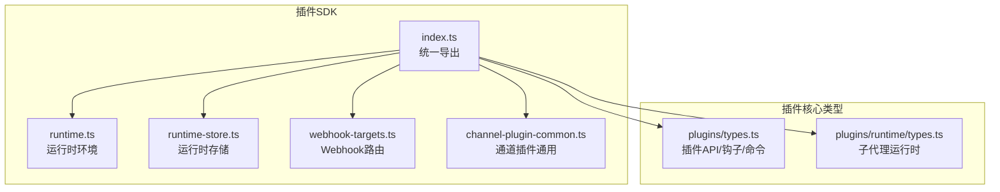
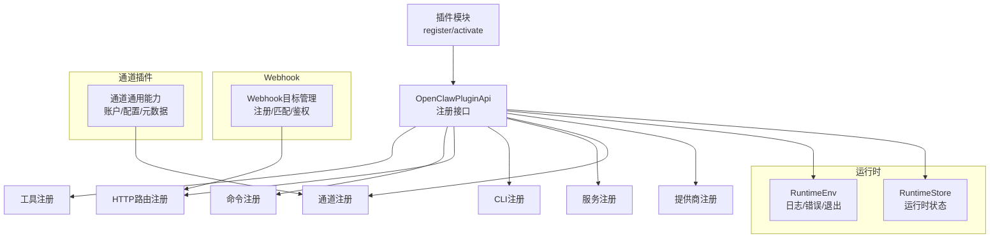
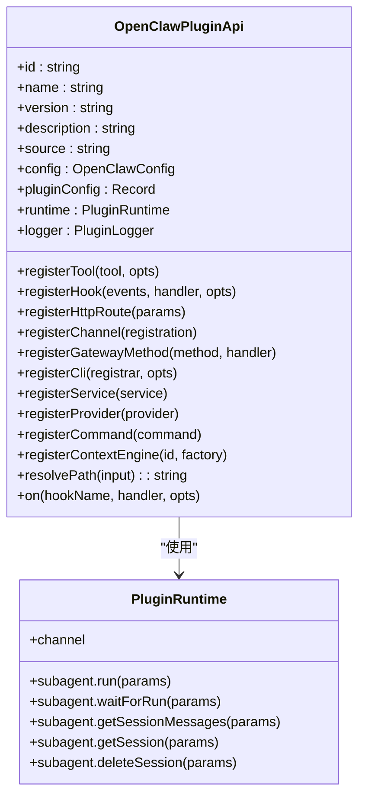
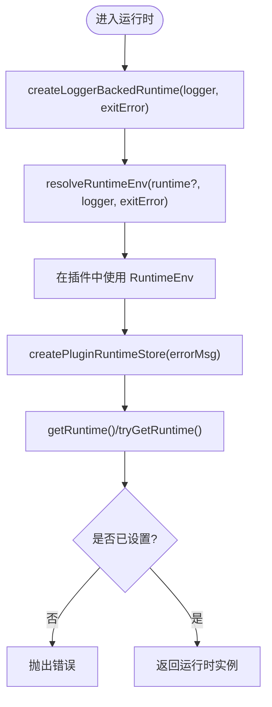
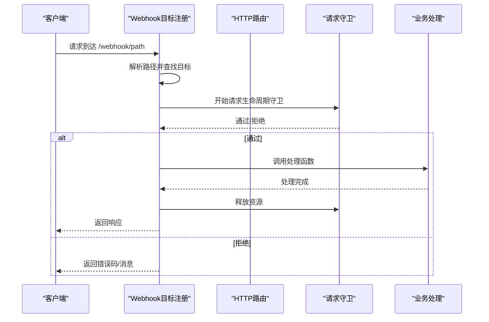
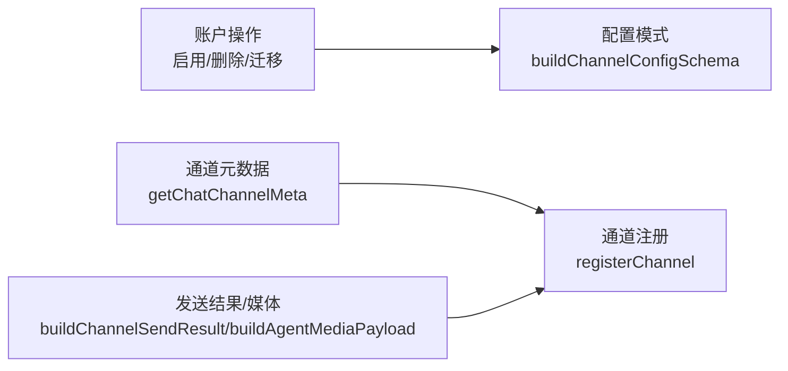
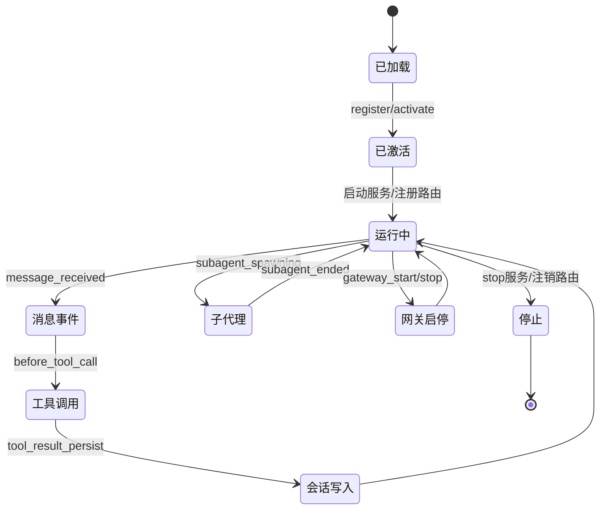
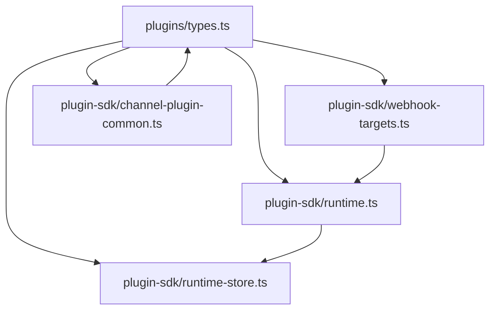

# 插件SDK架构

<cite>
**本文档引用的文件**
- [src/plugin-sdk/index.ts](file://src/plugin-sdk/index.ts)
- [src/plugin-sdk/runtime.ts](file://src/plugin-sdk/runtime.ts)
- [src/plugin-sdk/runtime-store.ts](file://src/plugin-sdk/runtime-store.ts)
- [src/plugin-sdk/webhook-targets.ts](file://src/plugin-sdk/webhook-targets.ts)
- [src/plugin-sdk/channel-plugin-common.ts](file://src/plugin-sdk/channel-plugin-common.ts)
- [src/plugins/types.ts](file://src/plugins/types.ts)
- [src/plugins/runtime/types.ts](file://src/plugins/runtime/types.ts)
</cite>

## 目录

1. [简介](#简介)
2. [项目结构](#项目结构)
3. [核心组件](#核心组件)
4. [架构总览](#架构总览)
5. [详细组件分析](#详细组件分析)
6. [依赖分析](#依赖分析)
7. [性能考虑](#性能考虑)
8. [故障排除指南](#故障排除指南)
9. [结论](#结论)

## 简介

本文件系统性阐述 OpenClaw 插件 SDK 的架构设计与实现要点，覆盖插件系统的整体结构、核心组件、初始化与生命周期管理、运行时环境与事件处理模型、数据流设计、插件注册机制、依赖注入与模块加载策略等。目标是帮助开发者快速理解并高效扩展插件能力。

## 项目结构

OpenClaw 将插件 SDK 的公共导出集中在统一入口，并围绕“通道插件”“运行时”“HTTP/Webhook 路由”“配置与路径”等维度提供可复用工具集。关键目录与职责概览如下：

- 插件 SDK 入口与导出：集中于统一入口文件，聚合类型、工具函数与适配器
- 运行时与生命周期：提供运行时环境封装、日志与退出抽象、运行时存储
- 通道插件通用能力：账户与配置、通道元数据、消息发送结果等
- HTTP/Webhook 能力：路由注册、目标匹配、请求守卫与限流
- 插件类型与钩子：定义插件 API、命令、服务、钩子事件与上下文

**图示来源**

- [src/plugin-sdk/index.ts:1-826](file://src/plugin-sdk/index.ts#L1-L826)
- [src/plugin-sdk/runtime.ts:1-45](file://src/plugin-sdk/runtime.ts#L1-L45)
- [src/plugin-sdk/runtime-store.ts:1-27](file://src/plugin-sdk/runtime-store.ts#L1-L27)
- [src/plugin-sdk/webhook-targets.ts:1-282](file://src/plugin-sdk/webhook-targets.ts#L1-L282)
- [src/plugin-sdk/channel-plugin-common.ts:1-22](file://src/plugin-sdk/channel-plugin-common.ts#L1-L22)
- [src/plugins/types.ts:1-893](file://src/plugins/types.ts#L1-L893)
- [src/plugins/runtime/types.ts:1-64](file://src/plugins/runtime/types.ts#L1-L64)

**章节来源**

- [src/plugin-sdk/index.ts:1-826](file://src/plugin-sdk/index.ts#L1-L826)

## 核心组件

- 插件 API 定义与钩子体系：定义插件生命周期钩子、消息/工具/会话/网关相关事件，以及插件注册能力（工具、命令、HTTP 路由、CLI、服务、通道、提供商等）
- 运行时环境与存储：提供日志、错误、退出抽象；支持运行时状态的获取/设置/清理
- Webhook 路由与目标管理：支持按路径注册目标、解析匹配、鉴权拒绝、并发/速率限制
- 通道插件通用能力：账户与配置操作、通道元数据、消息发送结果构建等

**章节来源**

- [src/plugins/types.ts:248-306](file://src/plugins/types.ts#L248-L306)
- [src/plugin-sdk/runtime.ts:9-32](file://src/plugin-sdk/runtime.ts#L9-L32)
- [src/plugin-sdk/runtime-store.ts:1-27](file://src/plugin-sdk/runtime-store.ts#L1-L27)
- [src/plugin-sdk/webhook-targets.ts:57-100](file://src/plugin-sdk/webhook-targets.ts#L57-L100)
- [src/plugin-sdk/channel-plugin-common.ts:1-22](file://src/plugin-sdk/channel-plugin-common.ts#L1-L22)

## 架构总览

下图展示插件 SDK 的高层交互：插件通过统一 API 注册能力，运行时负责生命周期与事件分发，Webhook 路由为外部触发提供入口，通道插件提供跨渠道的通用能力。

**图示来源**

- [src/plugins/types.ts:263-306](file://src/plugins/types.ts#L263-L306)
- [src/plugin-sdk/runtime.ts:9-32](file://src/plugin-sdk/runtime.ts#L9-L32)
- [src/plugin-sdk/runtime-store.ts:1-27](file://src/plugin-sdk/runtime-store.ts#L1-L27)
- [src/plugin-sdk/webhook-targets.ts:27-42](file://src/plugin-sdk/webhook-targets.ts#L27-L42)
- [src/plugin-sdk/channel-plugin-common.ts:1-22](file://src/plugin-sdk/channel-plugin-common.ts#L1-L22)

## 详细组件分析

### 组件A：插件API与钩子体系

- 职责：定义插件对外暴露的能力边界，包括工具工厂、命令定义、HTTP 路由、CLI 注册、服务、通道与提供商注册，以及丰富的生命周期钩子事件
- 关键点：
  - 钩子命名集合与类型安全校验，确保钩子名称完整且一致
  - 钩子事件上下文覆盖模型选择、提示词构建、消息收发、工具调用、会话与子代理生命周期、网关启停等
  - 插件可通过 on 注册生命周期钩子处理器，支持优先级

**图示来源**

- [src/plugins/types.ts:263-306](file://src/plugins/types.ts#L263-L306)
- [src/plugins/runtime/types.ts:51-63](file://src/plugins/runtime/types.ts#L51-L63)

**章节来源**

- [src/plugins/types.ts:321-394](file://src/plugins/types.ts#L321-L394)
- [src/plugins/types.ts:397-488](file://src/plugins/types.ts#L397-L488)
- [src/plugins/types.ts:490-517](file://src/plugins/types.ts#L490-L517)
- [src/plugins/types.ts:519-525](file://src/plugins/types.ts#L519-L525)
- [src/plugins/types.ts:527-556](file://src/plugins/types.ts#L527-L556)
- [src/plugins/types.ts:558-591](file://src/plugins/types.ts#L558-L591)
- [src/plugins/types.ts:593-633](file://src/plugins/types.ts#L593-L633)
- [src/plugins/types.ts:635-670](file://src/plugins/types.ts#L635-L670)
- [src/plugins/types.ts:671-691](file://src/plugins/types.ts#L671-L691)
- [src/plugins/types.ts:693-770](file://src/plugins/types.ts#L693-L770)
- [src/plugins/types.ts:771-784](file://src/plugins/types.ts#L771-L784)
- [src/plugins/types.ts:787-806](file://src/plugins/types.ts#L787-L806)

### 组件B：运行时环境与存储

- 运行时环境封装：将外部日志器适配为统一的 RuntimeEnv，提供 log/error/exit 抽象
- 运行时存储：提供线程安全的运行时对象存取，支持获取/设置/清理与缺失时抛错

**图示来源**

- [src/plugin-sdk/runtime.ts:9-32](file://src/plugin-sdk/runtime.ts#L9-L32)
- [src/plugin-sdk/runtime-store.ts:1-27](file://src/plugin-sdk/runtime-store.ts#L1-L27)

**章节来源**

- [src/plugin-sdk/runtime.ts:9-32](file://src/plugin-sdk/runtime.ts#L9-L32)
- [src/plugin-sdk/runtime-store.ts:1-27](file://src/plugin-sdk/runtime-store.ts#L1-L27)

### 组件C：Webhook 路由与目标管理

- 能力概览：按路径注册 Webhook 目标，自动注册/注销底层 HTTP 路由；支持鉴权拒绝、方法限制、JSON 内容类型限制、速率限制与并发限制
- 关键流程：解析请求路径 -> 匹配目标 -> 执行守卫 -> 处理回调 -> 释放资源

**图示来源**

- [src/plugin-sdk/webhook-targets.ts:115-162](file://src/plugin-sdk/webhook-targets.ts#L115-L162)
- [src/plugin-sdk/webhook-targets.ts:222-248](file://src/plugin-sdk/webhook-targets.ts#L222-L248)

**章节来源**

- [src/plugin-sdk/webhook-targets.ts:27-42](file://src/plugin-sdk/webhook-targets.ts#L27-L42)
- [src/plugin-sdk/webhook-targets.ts:102-113](file://src/plugin-sdk/webhook-targets.ts#L102-L113)
- [src/plugin-sdk/webhook-targets.ts:115-162](file://src/plugin-sdk/webhook-targets.ts#L115-L162)
- [src/plugin-sdk/webhook-targets.ts:186-220](file://src/plugin-sdk/webhook-targets.ts#L186-L220)
- [src/plugin-sdk/webhook-targets.ts:222-248](file://src/plugin-sdk/webhook-targets.ts#L222-L248)

### 组件D：通道插件通用能力

- 账户与配置：提供账户启用/删除、默认账户迁移、账户名应用等配置操作
- 通道元数据：提供通道元信息查询与配置模式构建
- 发送结果与媒体：提供消息发送结果构建、媒体负载构建等

**图示来源**

- [src/plugin-sdk/channel-plugin-common.ts:9-19](file://src/plugin-sdk/channel-plugin-common.ts#L9-L19)
- [src/plugin-sdk/index.ts:547-547](file://src/plugin-sdk/index.ts#L547-L547)

**章节来源**

- [src/plugin-sdk/channel-plugin-common.ts:1-22](file://src/plugin-sdk/channel-plugin-common.ts#L1-L22)
- [src/plugin-sdk/index.ts:184-201](file://src/plugin-sdk/index.ts#L184-L201)

### 初始化流程与生命周期管理

- 初始化阶段：插件通过 register/activate 钩子进行能力注册；运行时环境通过 resolveRuntimeEnv 提供日志与退出抽象
- 生命周期阶段：消息收发、工具调用、会话与子代理生命周期、网关启停等事件通过钩子体系驱动
- 清理阶段：服务 stop、Webhook 路由注销、运行时状态清理

[此图为概念性流程示意，不直接映射具体源码文件]

## 依赖分析

- 组件内聚与耦合：
  - 插件 API 与运行时解耦，通过接口传递运行时对象
  - Webhook 路由与 HTTP 注册解耦，通过目标注册抽象实现
  - 通道插件通用能力作为工具层被多模块复用
- 外部依赖与集成点：
  - 日志器适配（通过 RuntimeEnv）
  - HTTP 服务器（Webhook 路由注册）
  - 配置与通道元数据（通道插件）

**图示来源**

- [src/plugins/types.ts:1-17](file://src/plugins/types.ts#L1-L17)
- [src/plugin-sdk/runtime.ts:1-2](file://src/plugin-sdk/runtime.ts#L1-L2)
- [src/plugin-sdk/runtime-store.ts:1-1](file://src/plugin-sdk/runtime-store.ts#L1-L1)
- [src/plugin-sdk/webhook-targets.ts:1-4](file://src/plugin-sdk/webhook-targets.ts#L1-L4)
- [src/plugin-sdk/channel-plugin-common.ts:1-3](file://src/plugin-sdk/channel-plugin-common.ts#L1-L3)

**章节来源**

- [src/plugins/types.ts:1-17](file://src/plugins/types.ts#L1-L17)
- [src/plugin-sdk/index.ts:1-826](file://src/plugin-sdk/index.ts#L1-L826)

## 性能考虑

- Webhook 并发与速率控制：通过内存中的固定窗口限流器与飞行请求数限制，避免过载
- 请求体大小与内容类型限制：在入口处快速拒绝不符合规范的请求，降低后续处理成本
- 运行时存储：单例式运行时对象减少重复初始化开销
- 事件钩子：建议在钩子中进行轻量处理，重任务下沉到后台或子代理执行

[本节为通用指导，不直接分析具体文件]

## 故障排除指南

- Webhook 认证失败或歧义匹配：
  - 使用 resolveWebhookTargetWithAuthOrReject 或其同步版本进行匹配与拒绝
  - 对歧义场景返回明确状态码与消息
- 方法不被允许：
  - 使用 rejectNonPostWebhookRequest 快速拒绝非 POST 请求
- 运行时未设置：
  - 使用 tryGetRuntime 获取，若为空则根据场景抛错或降级处理

**章节来源**

- [src/plugin-sdk/webhook-targets.ts:222-248](file://src/plugin-sdk/webhook-targets.ts#L222-L248)
- [src/plugin-sdk/webhook-targets.ts:273-281](file://src/plugin-sdk/webhook-targets.ts#L273-L281)
- [src/plugin-sdk/runtime-store.ts:16-24](file://src/plugin-sdk/runtime-store.ts#L16-L24)

## 结论

OpenClaw 插件 SDK 以清晰的 API 边界、完善的钩子体系与可组合的运行时环境为核心，辅以 Webhook 路由与通道插件通用能力，形成高扩展、低耦合的插件生态。开发者可基于统一入口快速注册工具、命令、HTTP 路由与服务，结合钩子体系实现从消息到工具调用、从会话到子代理的全链路控制。
