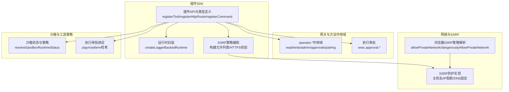
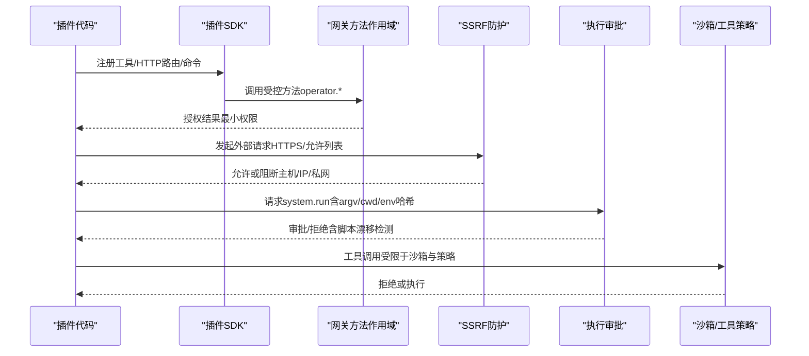
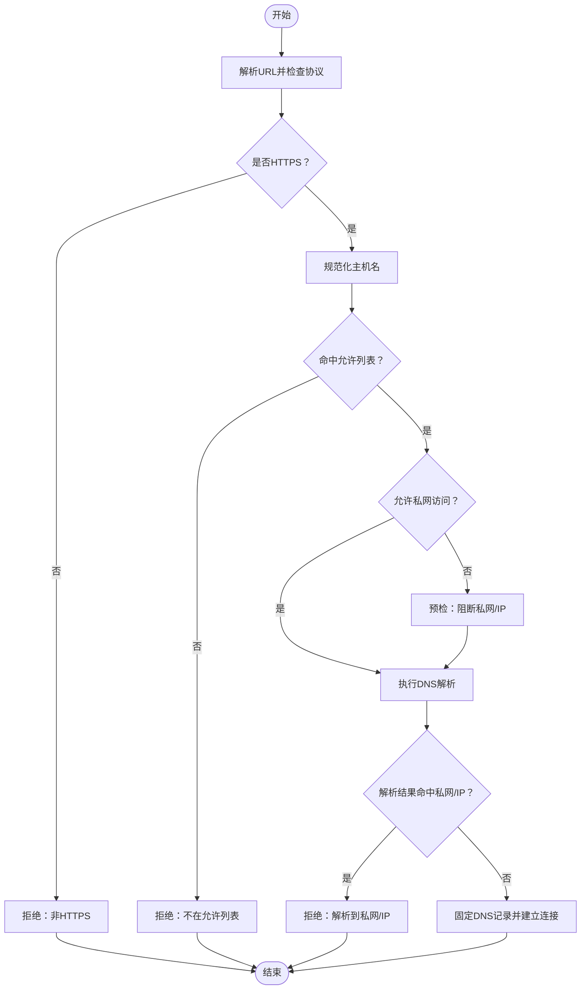
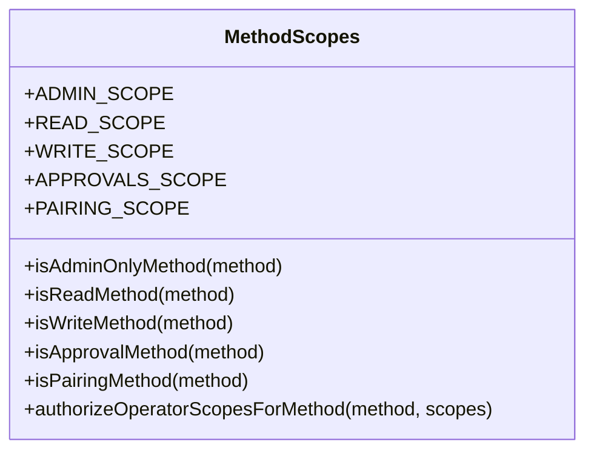
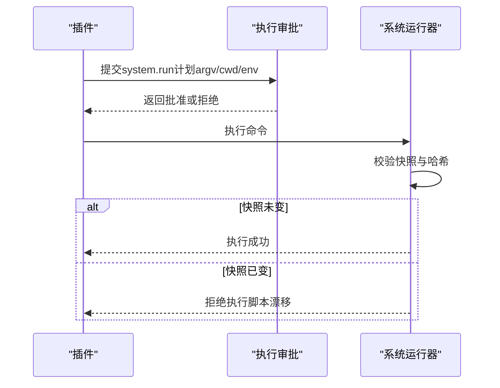
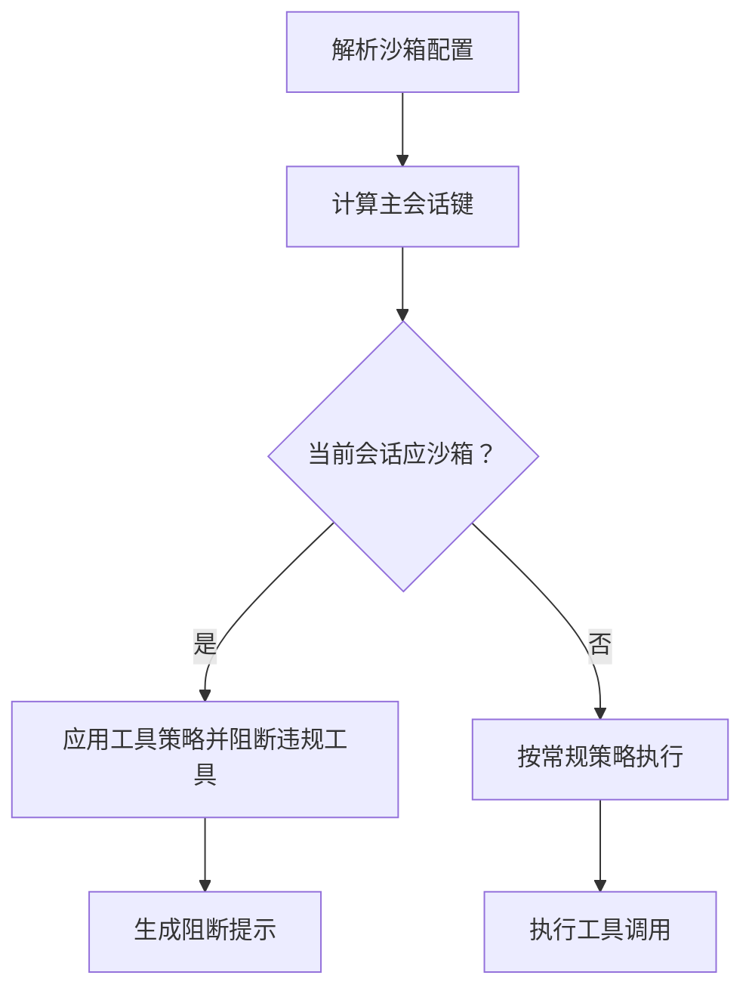
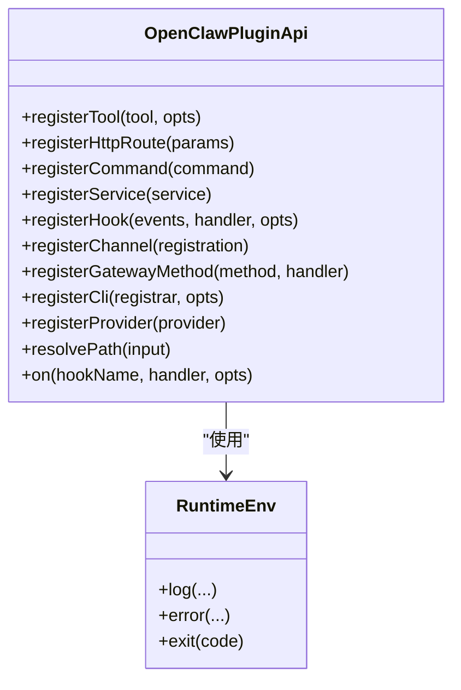
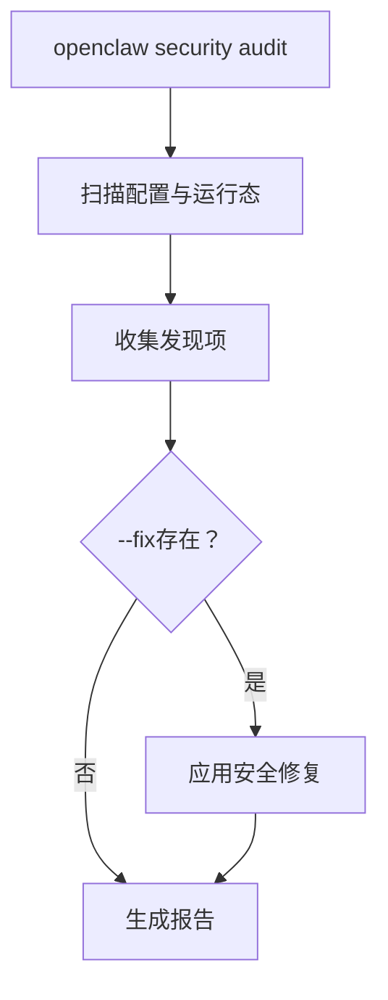
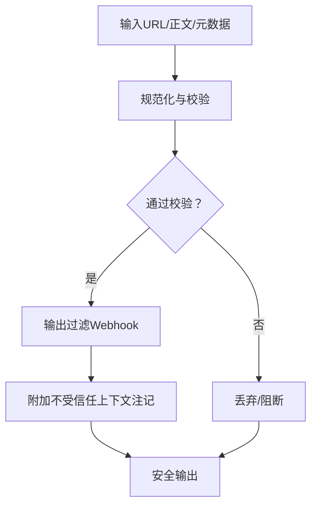
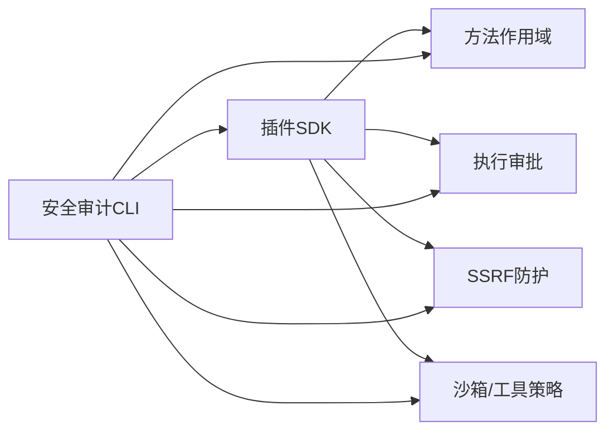

# 插件安全机制

<cite>
**本文档引用的文件**
- [src/infra/net/ssrf.ts](file://src/infra/net/ssrf.ts)
- [src/plugin-sdk/ssrf-policy.ts](file://src/plugin-sdk/ssrf-policy.ts)
- [src/gateway/method-scopes.ts](file://src/gateway/method-scopes.ts)
- [src/plugin-sdk/index.ts](file://src/plugin-sdk/index.ts)
- [src/plugins/types.ts](file://src/plugins/types.ts)
- [src/plugin-sdk/runtime.ts](file://src/plugin-sdk/runtime.ts)
- [SECURITY.md](file://SECURITY.md)
- [src/infra/exec-approvals.ts](file://src/infra/exec-approvals.ts)
- [src/agents/sandbox/runtime-status.ts](file://src/agents/sandbox/runtime-status.ts)
- [src/security/audit.ts](file://src/security/audit.ts)
- [src/browser/config.ts](file://src/browser/config.ts)
- [docs/cli/security.md](file://docs/cli/security.md)
- [extensions/synology-chat/src/webhook-handler.test.ts](file://extensions/synology-chat/src/webhook-handler.test.ts)
- [src/auto-reply/reply/untrusted-context.ts](file://src/auto-reply/reply/untrusted-context.ts)
</cite>

## 目录

1. [引言](#引言)
2. [项目结构](#项目结构)
3. [核心组件](#核心组件)
4. [架构总览](#架构总览)
5. [详细组件分析](#详细组件分析)
6. [依赖关系分析](#依赖关系分析)
7. [性能考量](#性能考量)
8. [故障排查指南](#故障排查指南)
9. [结论](#结论)
10. [附录](#附录)

## 引言

本文件面向OpenClaw插件开发者与运维人员，系统化阐述插件系统的安全架构、访问控制与权限管理，覆盖SSRF防护、输入验证与输出过滤、插件沙箱与资源限制、配对访问控制与群组权限、敏感操作保护、安全编码规范、漏洞防护与安全审计等主题。目标是帮助插件在受信边界内安全运行，并通过最小权限原则与多层防护降低风险。

## 项目结构

OpenClaw将安全能力分布在多个层次：

- 网络与SSRF防护：基于主机名与IP白名单、私网豁免策略、DNS解析固定与阻断。
- 访问控制与权限：方法级作用域（operator.\*）、执行审批（exec approvals）与工具策略。
- 插件SDK与运行时：统一的插件API、HTTP路由注册、命令与钩子扩展点、运行时日志与退出语义。
- 沙箱与资源限制：会话沙箱模式、工具策略、脚本漂移检测与拒绝。
- 审计与合规：安全审计CLI、自动扫描与修复建议、配置基线与加固指引。

**图表来源**

- [src/plugin-sdk/index.ts:454-468](file://src/plugin-sdk/index.ts#L454-L468)
- [src/infra/net/ssrf.ts:32-364](file://src/infra/net/ssrf.ts#L32-L364)
- [src/gateway/method-scopes.ts:1-217](file://src/gateway/method-scopes.ts#L1-L217)
- [src/infra/exec-approvals.ts:1-44](file://src/infra/exec-approvals.ts#L1-L44)
- [src/agents/sandbox/runtime-status.ts:45-97](file://src/agents/sandbox/runtime-status.ts#L45-L97)
- [src/browser/config.ts:101-128](file://src/browser/config.ts#L101-L128)

**章节来源**

- [src/plugin-sdk/index.ts:454-468](file://src/plugin-sdk/index.ts#L454-L468)
- [src/infra/net/ssrf.ts:32-364](file://src/infra/net/ssrf.ts#L32-L364)
- [src/gateway/method-scopes.ts:1-217](file://src/gateway/method-scopes.ts#L1-L217)
- [src/infra/exec-approvals.ts:1-44](file://src/infra/exec-approvals.ts#L1-L44)
- [src/agents/sandbox/runtime-status.ts:45-97](file://src/agents/sandbox/runtime-status.ts#L45-L97)
- [src/browser/config.ts:101-128](file://src/browser/config.ts#L101-L128)

## 核心组件

- SSRF防护与主机名/IP白名单：提供阻断localhost/local/internal、私有/特殊用途IP、以及未命中允许列表的主机名解析与连接。
- 方法作用域与授权：以operator.\*为粒度划分读写/审批/配对/管理权限，结合默认拒绝与最小权限授权。
- 执行审批与脚本漂移：对system.run进行参数、工作目录、环境变量快照与哈希绑定，拒绝运行时变更。
- 沙箱与工具策略：按会话与代理维度启用沙箱模式，限制工具调用范围与执行主机。
- 插件SDK：统一注册入口（工具、HTTP路由、命令、服务、钩子），提供运行时日志与退出语义。
- 安全审计：CLI提供深度扫描与修复建议，覆盖网关暴露面、浏览器控制、日志脱敏、执行运行时、钩子安全等。

**章节来源**

- [src/infra/net/ssrf.ts:108-172](file://src/infra/net/ssrf.ts#L108-L172)
- [src/gateway/method-scopes.ts:135-180](file://src/gateway/method-scopes.ts#L135-L180)
- [src/infra/exec-approvals.ts:38-44](file://src/infra/exec-approvals.ts#L38-L44)
- [src/agents/sandbox/runtime-status.ts:45-97](file://src/agents/sandbox/runtime-status.ts#L45-L97)
- [src/plugin-sdk/index.ts:263-306](file://src/plugin-sdk/index.ts#L263-L306)
- [src/security/audit.ts:1131-1156](file://src/security/audit.ts#L1131-L1156)

## 架构总览

下图展示插件在受信边界内的典型调用链路与安全控制点：

**图表来源**

- [src/gateway/method-scopes.ts:135-180](file://src/gateway/method-scopes.ts#L135-L180)
- [src/infra/net/ssrf.ts:276-323](file://src/infra/net/ssrf.ts#L276-L323)
- [src/infra/exec-approvals.ts:38-44](file://src/infra/exec-approvals.ts#L38-L44)
- [src/agents/sandbox/runtime-status.ts:81-97](file://src/agents/sandbox/runtime-status.ts#L81-L97)

## 详细组件分析

### SSRF防护与主机名/IP白名单

- 主机名规范化与后缀允许列表：支持“example.com”匹配“example.com”与“_.example.com”，通配符“_”可整体放行。
- HTTPS强制与URL解析：仅允许HTTPS协议，否则直接拒绝。
- 私网与特殊用途地址阻断：阻断localhost/local/internal、RFC1918/IPv6特殊段等；对嵌入式IPv4与遗留IPv4字面量进行严格校验。
- DNS解析固定与二次校验：解析前先按主机名策略阻断，解析后对返回IP再次校验，防止通过公共域名指向私网目标。
- 浏览器侧策略：允许通过allowPrivateNetwork/dangerouslyAllowPrivateNetwork控制私网访问，未显式开启时默认受信任网络模式。

**图表来源**

- [src/plugin-sdk/ssrf-policy.ts:42-55](file://src/plugin-sdk/ssrf-policy.ts#L42-L55)
- [src/infra/net/ssrf.ts:108-172](file://src/infra/net/ssrf.ts#L108-L172)
- [src/infra/net/ssrf.ts:276-323](file://src/infra/net/ssrf.ts#L276-L323)
- [src/browser/config.ts:101-128](file://src/browser/config.ts#L101-L128)

**章节来源**

- [src/plugin-sdk/ssrf-policy.ts:1-86](file://src/plugin-sdk/ssrf-policy.ts#L1-L86)
- [src/infra/net/ssrf.ts:32-364](file://src/infra/net/ssrf.ts#L32-L364)
- [src/browser/config.ts:101-128](file://src/browser/config.ts#L101-L128)

### 方法作用域与授权（operator.\*）

- 作用域分层：admin、read、write、approvals、pairing，分别对应管理、只读、写入、审批与配对能力。
- 默认拒绝：未分类方法默认拒绝；最小权限授权要求仅授予完成任务所需的最低作用域。
- 前缀规则：以exec.approvals./config./wizard./update.开头的方法归类为管理员范围。
- 授权判定：若包含admin作用域则放行；否则需满足所需作用域至少包含read或write。

**图表来源**

- [src/gateway/method-scopes.ts:1-217](file://src/gateway/method-scopes.ts#L1-L217)

**章节来源**

- [src/gateway/method-scopes.ts:135-180](file://src/gateway/method-scopes.ts#L135-L180)
- [src/gateway/method-scopes.ts:191-210](file://src/gateway/method-scopes.ts#L191-L210)

### 执行审批与脚本漂移防护

- 绑定快照：对system.run的argv、cwd、env进行快照与哈希绑定，审批通过后仍严格校验。
- 运行时拒绝：若脚本操作数在审批后被修改（如注入恶意内容），将拒绝执行并上报原因。
- 失败即闭：当沙箱不可用或不被允许时，明确拒绝，避免降级到不受控执行。

**图表来源**

- [src/infra/exec-approvals.ts:38-44](file://src/infra/exec-approvals.ts#L38-L44)
- [src/node-host/invoke-system-run.test.ts:845-875](file://src/node-host/invoke-system-run.test.ts#L845-L875)

**章节来源**

- [src/infra/exec-approvals.ts:1-44](file://src/infra/exec-approvals.ts#L1-L44)
- [src/node-host/invoke-system-run.test.ts:73-110](file://src/node-host/invoke-system-run.test.ts#L73-L110)

### 沙箱与工具策略

- 沙箱状态解析：根据代理配置与会话键判断是否沙箱化，返回沙箱模式与工具策略。
- 阻断消息格式化：当工具在沙箱中被策略拒绝时，生成明确的阻断提示信息。
- 会话隔离：通过ephemeral sessionId实现对话隔离，配合沙箱减少跨会话影响。

**图表来源**

- [src/agents/sandbox/runtime-status.ts:45-97](file://src/agents/sandbox/runtime-status.ts#L45-L97)

**章节来源**

- [src/agents/sandbox/runtime-status.ts:45-97](file://src/agents/sandbox/runtime-status.ts#L45-L97)

### 插件SDK与运行时

- 统一注册接口：工具、HTTP路由、命令、服务、钩子、通道适配器等均通过OpenClawPluginApi注册。
- 运行时封装：提供日志与错误输出、可控退出语义，便于插件在受控环境中运行。
- 类型与上下文：提供OpenClawPluginToolContext、PluginCommandContext等上下文，承载会话、代理、工作区等信息。

**图表来源**

- [src/plugins/types.ts:263-306](file://src/plugins/types.ts#L263-L306)
- [src/plugin-sdk/runtime.ts:9-32](file://src/plugin-sdk/runtime.ts#L9-L32)

**章节来源**

- [src/plugin-sdk/index.ts:263-306](file://src/plugin-sdk/index.ts#L263-L306)
- [src/plugin-sdk/runtime.ts:1-45](file://src/plugin-sdk/runtime.ts#L1-L45)
- [src/plugins/types.ts:58-73](file://src/plugins/types.ts#L58-L73)

### 安全审计与合规

- CLI审计：提供openclaw security audit --deep与--fix，自动扫描暴露面、浏览器控制、日志脱敏、执行运行时、钩子安全等。
- 修复建议：将常见风险（如groupPolicy=open、敏感文件权限、日志脱敏级别）转化为可确定性修复动作。
- 报告输出：支持JSON输出，便于CI/Pipeline集成与策略检查。

**图表来源**

- [src/security/audit.ts:1131-1156](file://src/security/audit.ts#L1131-L1156)
- [docs/cli/security.md:43-72](file://docs/cli/security.md#L43-L72)

**章节来源**

- [src/security/audit.ts:1131-1156](file://src/security/audit.ts#L1131-L1156)
- [docs/cli/security.md:43-72](file://docs/cli/security.md#L43-L72)

### 输入验证与输出过滤

- 输入验证：URL解析与协议校验（HTTPS）、主机名规范化与后缀允许列表匹配、私网/IP阻断。
- 输出过滤：在Webhook处理中对潜在敏感内容进行过滤标记，避免泄露。
- 不可信上下文：在消息构建中追加“不受信任上下文”块，明确标注元数据来源，避免被误认为指令。

**图表来源**

- [src/plugin-sdk/ssrf-policy.ts:42-55](file://src/plugin-sdk/ssrf-policy.ts#L42-L55)
- [extensions/synology-chat/src/webhook-handler.test.ts:405-431](file://extensions/synology-chat/src/webhook-handler.test.ts#L405-L431)
- [src/auto-reply/reply/untrusted-context.ts:1-16](file://src/auto-reply/reply/untrusted-context.ts#L1-L16)

**章节来源**

- [src/plugin-sdk/ssrf-policy.ts:42-55](file://src/plugin-sdk/ssrf-policy.ts#L42-L55)
- [extensions/synology-chat/src/webhook-handler.test.ts:405-431](file://extensions/synology-chat/src/webhook-handler.test.ts#L405-L431)
- [src/auto-reply/reply/untrusted-context.ts:1-16](file://src/auto-reply/reply/untrusted-context.ts#L1-L16)

## 依赖关系分析

- 插件SDK依赖方法作用域与执行审批模块，确保所有外部调用与系统运行均受控。
- SSRF防护作为底层网络层，被插件SDK与浏览器配置共同使用。
- 沙箱与工具策略贯穿工具执行路径，与执行审批形成互补。
- 安全审计CLI作为上层治理工具，驱动配置修复与风险收敛。

**图表来源**

- [src/plugin-sdk/index.ts:454-468](file://src/plugin-sdk/index.ts#L454-L468)
- [src/gateway/method-scopes.ts:135-180](file://src/gateway/method-scopes.ts#L135-L180)
- [src/infra/exec-approvals.ts:38-44](file://src/infra/exec-approvals.ts#L38-L44)
- [src/infra/net/ssrf.ts:276-323](file://src/infra/net/ssrf.ts#L276-L323)
- [src/agents/sandbox/runtime-status.ts:45-97](file://src/agents/sandbox/runtime-status.ts#L45-L97)
- [src/security/audit.ts:1131-1156](file://src/security/audit.ts#L1131-L1156)

**章节来源**

- [src/plugin-sdk/index.ts:454-468](file://src/plugin-sdk/index.ts#L454-L468)
- [src/gateway/method-scopes.ts:135-180](file://src/gateway/method-scopes.ts#L135-L180)
- [src/infra/exec-approvals.ts:38-44](file://src/infra/exec-approvals.ts#L38-L44)
- [src/infra/net/ssrf.ts:276-323](file://src/infra/net/ssrf.ts#L276-L323)
- [src/agents/sandbox/runtime-status.ts:45-97](file://src/agents/sandbox/runtime-status.ts#L45-L97)
- [src/security/audit.ts:1131-1156](file://src/security/audit.ts#L1131-L1156)

## 性能考量

- SSRF解析与阻断：DNS固定与二次校验带来少量延迟，但显著提升安全性；建议在高并发场景下合理设置缓存与重用连接。
- 执行审批：快照与哈希校验开销极低，主要成本在UI交互与审批流程；可通过自动化审批与白名单降低人工干预。
- 沙箱与工具策略：沙箱模式可能增加进程启动与隔离成本，建议按会话与代理维度精细化启用。
- 安全审计：扫描过程涉及文件系统与配置读取，建议在非高峰时段执行，或分模块增量扫描。

## 故障排查指南

- SSRF被阻断
  - 检查URL协议是否为HTTPS，主机名是否在允许列表中，是否命中私网/IP阻断。
  - 参考路径：[src/infra/net/ssrf.ts:108-172](file://src/infra/net/ssrf.ts#L108-L172)
- 执行被拒绝
  - 确认system.run是否获得审批，检查argv/cwd/env快照是否被修改。
  - 参考路径：[src/infra/exec-approvals.ts:38-44](file://src/infra/exec-approvals.ts#L38-L44)
- 工具在沙箱中被拒
  - 检查代理沙箱配置与工具策略，确认工具名称与参数符合策略。
  - 参考路径：[src/agents/sandbox/runtime-status.ts:81-97](file://src/agents/sandbox/runtime-status.ts#L81-L97)
- 审计发现风险
  - 使用openclaw security audit --fix自动修复常见问题，关注关键/警告项。
  - 参考路径：[src/security/audit.ts:1131-1156](file://src/security/audit.ts#L1131-L1156)，[docs/cli/security.md:43-72](file://docs/cli/security.md#L43-L72)

**章节来源**

- [src/infra/net/ssrf.ts:108-172](file://src/infra/net/ssrf.ts#L108-L172)
- [src/infra/exec-approvals.ts:38-44](file://src/infra/exec-approvals.ts#L38-L44)
- [src/agents/sandbox/runtime-status.ts:81-97](file://src/agents/sandbox/runtime-status.ts#L81-L97)
- [src/security/audit.ts:1131-1156](file://src/security/audit.ts#L1131-L1156)
- [docs/cli/security.md:43-72](file://docs/cli/security.md#L43-L72)

## 结论

OpenClaw通过“受信边界+最小权限+多层防护”的设计，为插件提供了安全可靠的运行环境。SSRF防护、方法作用域、执行审批、沙箱与工具策略、输入验证与输出过滤、以及持续的安全审计，共同构成了完整的插件安全机制。插件开发者应遵循最小权限原则、严格输入验证、正确使用沙箱与审批、并定期运行安全审计，确保在受控边界内安全交付功能。

## 附录

- 受信任模型与插件边界：插件被视为与本地代码同等信任，安装/启用即授予相同信任等级，边界绕过才构成漏洞。
- 操作建议：优先启用沙箱、收紧工具策略、使用HTTPS与允许列表、开启日志脱敏、定期运行安全审计并应用修复建议。

**章节来源**

- [SECURITY.md:104-110](file://SECURITY.md#L104-L110)
- [SECURITY.md:207-244](file://SECURITY.md#L207-L244)
