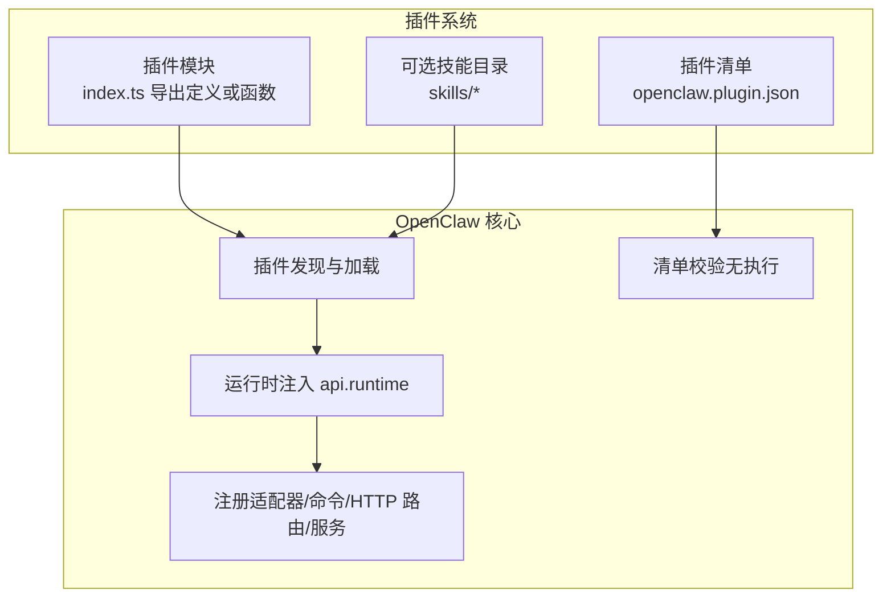
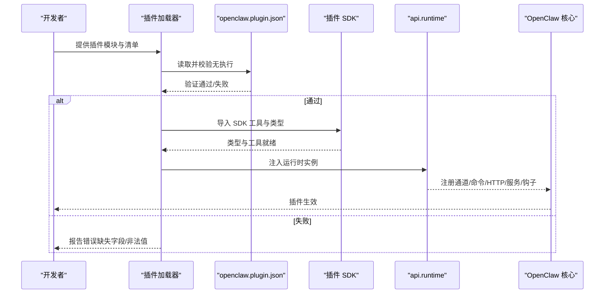
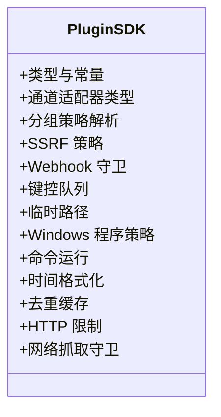
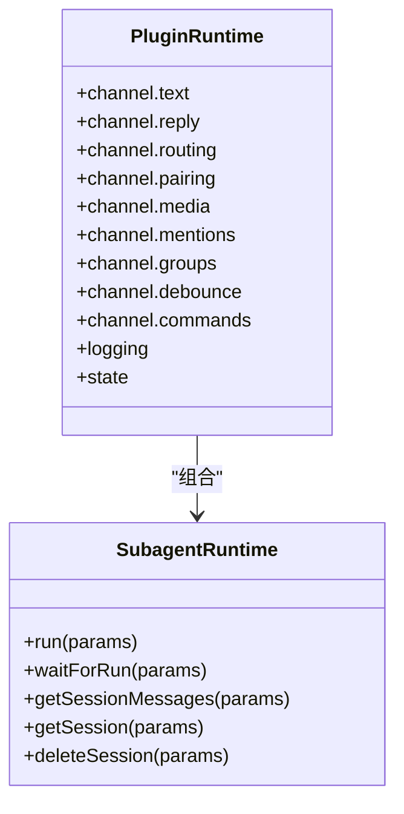
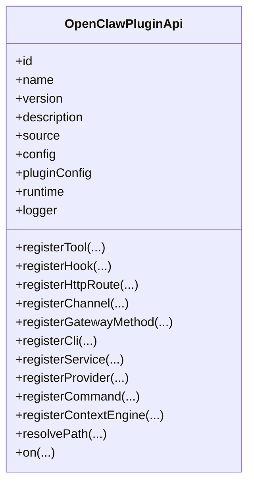
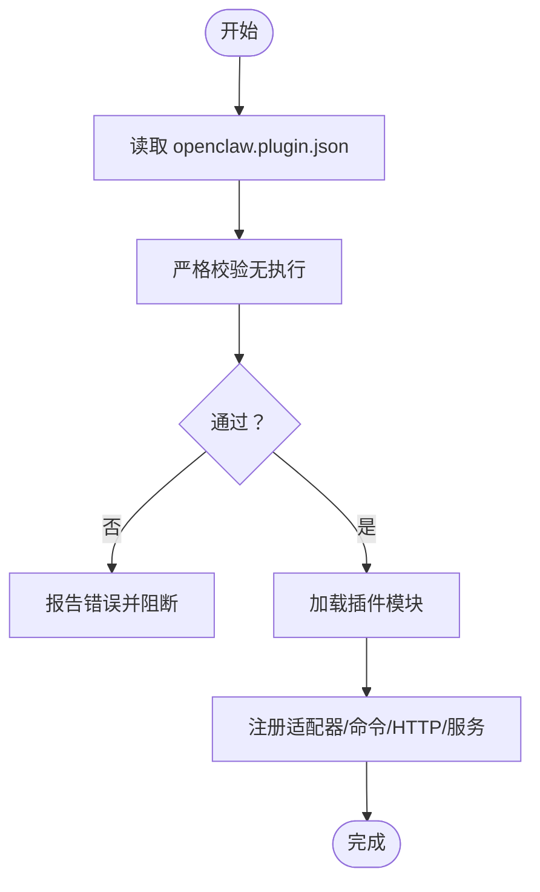
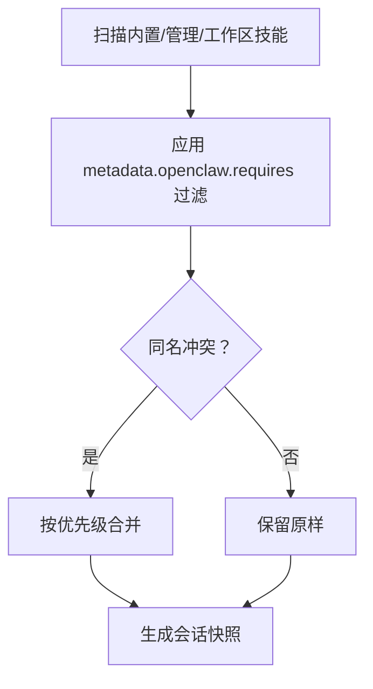
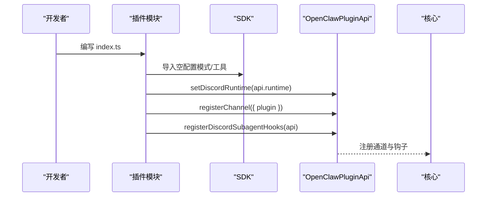
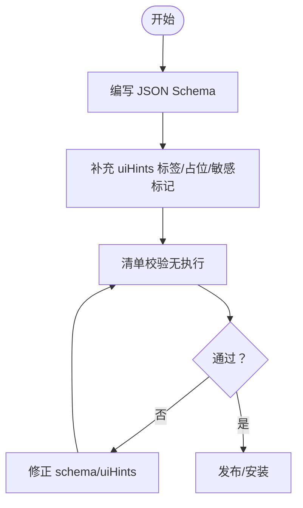
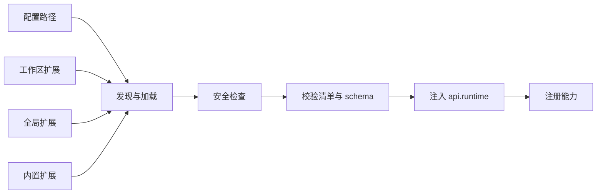

# 插件开发

<cite>
**本文引用的文件**
- [src/plugin-sdk/index.ts](file://src/plugin-sdk/index.ts)
- [docs/refactor/plugin-sdk.md](file://docs/refactor/plugin-sdk.md)
- [docs/plugins/manifest.md](file://docs/plugins/manifest.md)
- [src/plugins/types.ts](file://src/plugins/types.ts)
- [src/plugins/runtime/types.ts](file://src/plugins/runtime/types.ts)
- [docs/tools/plugin.md](file://docs/tools/plugin.md)
- [extensions/discord/openclaw.plugin.json](file://extensions/discord/openclaw.plugin.json)
- [extensions/discord/index.ts](file://extensions/discord/index.ts)
- [extensions/voice-call/openclaw.plugin.json](file://extensions/voice-call/openclaw.plugin.json)
- [docs/tools/skills.md](file://docs/tools/skills.md)
</cite>

## 目录

1. [简介](#简介)
2. [项目结构](#项目结构)
3. [核心组件](#核心组件)
4. [架构总览](#架构总览)
5. [详细组件分析](#详细组件分析)
6. [依赖分析](#依赖分析)
7. [性能考虑](#性能考虑)
8. [故障排查指南](#故障排查指南)
9. [结论](#结论)
10. [附录](#附录)

## 简介

本文件面向希望在 OpenClaw 平台上开发插件（含通道插件、技能插件与工具插件）的开发者，系统阐述插件 SDK 的架构设计、开发流程、生命周期管理与安全机制；并提供从零到一的完整开发示例与最佳实践，覆盖插件配置、注册机制、依赖管理与版本兼容性，以及调试技巧、性能优化与发布流程。

## 项目结构

OpenClaw 将“插件 SDK”与“插件运行时”解耦为两层：

- 插件 SDK：稳定、可发布、编译期可用的类型与工具集，不引入运行时状态与副作用。
- 插件运行时：通过 OpenClawPluginApi.runtime 暴露给插件调用的核心能力，统一桥接通道适配器、路由、媒体、分组策略等。

插件以“插件模块 + 清单 + 可选技能目录”的形式存在，支持本地工作区、全局扩展与内置扩展三种来源，遵循严格的发现、校验与加载顺序。

图表来源

- [docs/tools/plugin.md:228-300](file://docs/tools/plugin.md#L228-L300)
- [docs/plugins/manifest.md:9-76](file://docs/plugins/manifest.md#L9-L76)
- [src/plugin-sdk/index.ts:1-826](file://src/plugin-sdk/index.ts#L1-L826)

章节来源

- [docs/tools/plugin.md:228-300](file://docs/tools/plugin.md#L228-L300)
- [docs/plugins/manifest.md:9-76](file://docs/plugins/manifest.md#L9-L76)
- [src/plugin-sdk/index.ts:1-826](file://src/plugin-sdk/index.ts#L1-L826)

## 核心组件

- 插件 SDK（稳定 API）
  - 提供类型、工具函数与配置辅助，如通道元数据、适配器类型、分组策略解析、SSRF 策略、Webhook 请求守卫、键控异步队列、临时路径、Windows 进程策略等。
  - 入口导出集中于 src/plugin-sdk/index.ts，便于按需导入子路径（如 openclaw/plugin-sdk/discord）。
- 插件运行时（api.runtime）
  - 通过 OpenClawPluginApi.runtime 暴露统一运行时能力，包括文本分块、回复派发、路由解析、配对、媒体拉取与落盘、提及匹配、分组策略、去抖、命令授权、日志、状态目录等。
  - 子模块类型位于 src/plugins/runtime/types.ts，包含子代理运行、等待与会话消息查询等。
- 插件 API（OpenClawPluginApi）
  - 提供 registerTool、registerHook、registerHttpRoute、registerChannel、registerGatewayMethod、registerCli、registerService、registerProvider、registerCommand、registerContextEngine 等注册入口。
  - 支持生命周期钩子（before*model_resolve、before_prompt_build、before_agent_start、llm_input、llm_output、agent_end、compaction、reset、message*_、tool\__、session*\*、subagent*_、gateway\__ 等）。
- 插件清单（openclaw.plugin.json）
  - 必须包含 id 与 configSchema；可声明 kind、channels、providers、skills、uiHints、version 等。
  - 清单用于严格配置校验，无需执行插件代码即可验证。
- 技能（Skills）
  - 基于 AgentSkills 规范，支持多级优先级（工作区 > 管理目录 > 内置），可通过 metadata.openclaw.requires 控制加载门禁。
  - 插件可在清单中通过 skills 数组声明内嵌技能目录，参与统一加载与优先级规则。

章节来源

- [src/plugin-sdk/index.ts:1-826](file://src/plugin-sdk/index.ts#L1-L826)
- [src/plugins/runtime/types.ts:1-64](file://src/plugins/runtime/types.ts#L1-L64)
- [src/plugins/types.ts:263-306](file://src/plugins/types.ts#L263-L306)
- [docs/plugins/manifest.md:9-76](file://docs/plugins/manifest.md#L9-L76)
- [docs/tools/skills.md:1-303](file://docs/tools/skills.md#L1-L303)

## 架构总览

下图展示插件从“发现/校验”到“运行时注册”的端到端流程，以及 SDK 与运行时的职责边界。

图表来源

- [docs/tools/plugin.md:347-407](file://docs/tools/plugin.md#L347-L407)
- [docs/plugins/manifest.md:9-76](file://docs/plugins/manifest.md#L9-L76)
- [src/plugin-sdk/index.ts:1-826](file://src/plugin-sdk/index.ts#L1-L826)

章节来源

- [docs/tools/plugin.md:347-407](file://docs/tools/plugin.md#L347-L407)
- [docs/plugins/manifest.md:9-76](file://docs/plugins/manifest.md#L9-L76)
- [src/plugin-sdk/index.ts:1-826](file://src/plugin-sdk/index.ts#L1-L826)

## 详细组件分析

### 组件A：插件 SDK（类型与工具）

- 职责
  - 提供通道适配器类型、分组策略、SSRF 策略、Webhook 守卫、键控队列、临时路径、Windows 程序策略、命令运行、时间格式化、去重缓存、HTTP 请求限制、网络抓取守卫等。
  - 作为“稳定 API”，不引入运行时状态，避免破坏外部插件的稳定性。
- 关键点
  - 通过子路径导出（如 openclaw/plugin-sdk/discord），鼓励按需导入，减少打包体积。
  - 与运行时解耦，仅暴露类型与纯函数，确保跨版本兼容性。

图表来源

- [src/plugin-sdk/index.ts:1-826](file://src/plugin-sdk/index.ts#L1-L826)

章节来源

- [src/plugin-sdk/index.ts:1-826](file://src/plugin-sdk/index.ts#L1-L826)

### 组件B：插件运行时（api.runtime）

- 职责
  - 文本处理：chunkMarkdownText、resolveTextChunkLimit、hasControlCommand
  - 回复派发：dispatchReplyWithBufferedBlockDispatcher、createReplyDispatcherWithTyping
  - 路由：resolveAgentRoute
  - 配对：buildPairingReply、readAllowFromStore、upsertPairingRequest
  - 媒体：fetchRemoteMedia、saveMediaBuffer
  - 提及：buildMentionRegexes、matchesMentionPatterns
  - 分组：resolveGroupPolicy、resolveRequireMention
  - 去抖：createInboundDebouncer、resolveInboundDebounceMs
  - 命令授权：resolveCommandAuthorizedFromAuthorizers
  - 日志：shouldLogVerbose、getChildLogger
  - 状态：resolveStateDir
- 设计要点
  - 运行时是插件唯一访问核心行为的入口，保证“所有依赖均通过 SDK 或运行时”。
  - 表面最小但完备，每个方法映射到现有核心实现，避免重复。

图表来源

- [docs/refactor/plugin-sdk.md:47-145](file://docs/refactor/plugin-sdk.md#L47-L145)
- [src/plugins/runtime/types.ts:51-64](file://src/plugins/runtime/types.ts#L51-L64)

章节来源

- [docs/refactor/plugin-sdk.md:47-145](file://docs/refactor/plugin-sdk.md#L47-L145)
- [src/plugins/runtime/types.ts:1-64](file://src/plugins/runtime/types.ts#L1-L64)

### 组件C：插件 API（OpenClawPluginApi）

- 职责
  - 注册工具、钩子、HTTP 路由、通道、网关方法、CLI、服务、模型提供商、命令、上下文引擎。
  - 生命周期钩子：before*model_resolve、before_prompt_build、before_agent_start、llm_input、llm_output、agent_end、compaction、reset、message*_、tool\__、session*\*、subagent*_、gateway\__ 等。
- 最佳实践
  - 使用 api.on 注册强类型生命周期钩子，避免直接操作内部状态。
  - 对外暴露能力通过 register\* 方法，保持“只读通道”和“受控写入”。

图表来源

- [src/plugins/types.ts:263-306](file://src/plugins/types.ts#L263-L306)

章节来源

- [src/plugins/types.ts:263-306](file://src/plugins/types.ts#L263-L306)

### 组件D：插件清单与配置（openclaw.plugin.json）

- 必填字段
  - id：插件标识
  - configSchema：JSON Schema（即使空配置也必须提供）
- 可选字段
  - kind、channels、providers、skills、name、description、uiHints、version
- 校验规则
  - 未知 channels.\* 键除非被其他插件清单声明否则报错
  - plugins.entries.<id>、plugins.allow、plugins.deny、plugins.slots.\* 必须引用“可发现”的插件 id
  - 清单缺失或 schema 不合法将阻断配置校验
- UI 提示
  - uiHints 可为字段提供标签、占位符、敏感标记，提升控制界面体验

图表来源

- [docs/plugins/manifest.md:9-76](file://docs/plugins/manifest.md#L9-L76)

章节来源

- [docs/plugins/manifest.md:9-76](file://docs/plugins/manifest.md#L9-L76)

### 组件E：技能（Skills）与插件集成

- 加载优先级
  - 工作区技能 > 管理目录技能 > 内置技能
- 门禁控制
  - metadata.openclaw.requires 可基于二进制、环境变量、配置项进行过滤
- 插件内嵌技能
  - 在 openclaw.plugin.json 中通过 skills 数组声明相对路径，随插件启用自动参与加载与优先级计算
- 环境注入
  - 运行时按需注入 process.env，结束后恢复，避免污染宿主环境

图表来源

- [docs/tools/skills.md:106-187](file://docs/tools/skills.md#L106-L187)

章节来源

- [docs/tools/skills.md:106-187](file://docs/tools/skills.md#L106-L187)

### 组件F：通道插件（以 Discord 为例）

- 清单
  - id、channels、configSchema
- 模块
  - 导入 SDK 的空配置模式，注册通道插件与子代理钩子，设置运行时
- 开发步骤
  - 实现 ChannelPlugin（meta、capabilities、config、outbound 等）
  - 通过 api.registerChannel({ plugin }) 注册
  - 如需 HTTP/Webhook，使用 api.registerHttpRoute/registerWebhookTarget 等

图表来源

- [extensions/discord/openclaw.plugin.json:1-10](file://extensions/discord/openclaw.plugin.json#L1-L10)
- [extensions/discord/index.ts:1-20](file://extensions/discord/index.ts#L1-L20)

章节来源

- [extensions/discord/openclaw.plugin.json:1-10](file://extensions/discord/openclaw.plugin.json#L1-L10)
- [extensions/discord/index.ts:1-20](file://extensions/discord/index.ts#L1-L20)

### 组件G：工具插件（以 Voice Call 为例）

- 清单与 UI 提示
  - 通过 uiHints 为配置字段提供标签、占位符与敏感标记
- 配置模式
  - 采用分层对象结构（provider、telnyx/twilio/plivo、serve、tunnel、streaming、tts/stt、webhookSecurity 等），并以 JSON Schema 严格约束
- 开发建议
  - 将“网络/鉴权/隧道/流式通话”等复杂能力拆分为独立子配置段，便于维护与测试
  - 为敏感字段标注 sensitive，避免在 UI 中明文显示

图表来源

- [extensions/voice-call/openclaw.plugin.json:1-601](file://extensions/voice-call/openclaw.plugin.json#L1-L601)

章节来源

- [extensions/voice-call/openclaw.plugin.json:1-601](file://extensions/voice-call/openclaw.plugin.json#L1-L601)

## 依赖分析

- 插件与核心的耦合
  - 插件只能通过 SDK 与运行时访问核心能力，禁止直接导入 src/\*\*，以降低升级风险与外部依赖复杂度。
- 版本与兼容
  - SDK 语义化版本，运行时随核心版本发布；插件可声明所需运行时范围（例如 openclawRuntime: ">=YYYY.M.D"）。
- 发现与加载顺序
  - 配置路径 > 工作区扩展 > 全局扩展 > 内置扩展；同一 id 以首次匹配为准。
- 安全加固
  - 对候选路径进行安全检查（防止越界、世界可写、可疑所有权），非内置插件无来源记录会发出警告。

图表来源

- [docs/tools/plugin.md:228-300](file://docs/tools/plugin.md#L228-L300)
- [docs/tools/plugin.md:347-407](file://docs/tools/plugin.md#L347-L407)

章节来源

- [docs/tools/plugin.md:228-300](file://docs/tools/plugin.md#L228-L300)
- [docs/tools/plugin.md:347-407](file://docs/tools/plugin.md#L347-L407)

## 性能考虑

- 插件发现与清单缓存
  - 插件发现与清单元数据使用短时进程内缓存，减少启动/重载抖动；可通过环境变量禁用或调整缓存窗口。
- 技能快照与热更新
  - 会话开始时快照技能列表，后续回合复用；支持监视变更后在下一回合热更新。
- 去抖与限流
  - inbound 去抖与 Webhook 内存守卫（固定窗口限流、异常计数器）降低突发流量对核心的影响。
- 文本分块与媒体处理
  - 使用 SDK 的文本分块与媒体保存工具，避免一次性大对象带来的内存压力。

章节来源

- [docs/tools/plugin.md:219-227](file://docs/tools/plugin.md#L219-L227)
- [docs/tools/skills.md:242-247](file://docs/tools/skills.md#L242-L247)
- [src/plugin-sdk/index.ts:440-452](file://src/plugin-sdk/index.ts#L440-L452)

## 故障排查指南

- 清单与配置问题
  - 未知插件 id、channels._ 键、plugins._ 引用非法 id：根据 Doctor 报错定位并修正。
  - 插件已禁用但配置仍存在：确认是否需要保留配置，或清理冗余。
- 运行时错误
  - Webhook 请求体过大/超时：检查请求体限制与超时配置；必要时调整默认阈值。
  - SSRF/主机白名单拒绝：核对 hostname 后缀允许列表与 HTTPS 限制。
- 安全与权限
  - 非内置插件来源不明：通过 plugins.allow 明确信任，或安装跟踪 plugins.installs。
  - Windows 程序策略：核对程序候选解析与执行策略，避免沙箱外执行。
- 技能加载失败
  - metadata.openclaw.requires 未满足：检查 PATH、环境变量或配置项；必要时在 skills.entries 下提供覆盖。

章节来源

- [docs/plugins/manifest.md:53-63](file://docs/plugins/manifest.md#L53-L63)
- [src/plugin-sdk/index.ts:430-447](file://src/plugin-sdk/index.ts#L430-L447)
- [src/plugin-sdk/index.ts:462-468](file://src/plugin-sdk/index.ts#L462-L468)
- [docs/tools/plugin.md:262-270](file://docs/tools/plugin.md#L262-L270)
- [src/plugin-sdk/index.ts:362-377](file://src/plugin-sdk/index.ts#L362-L377)
- [docs/tools/skills.md:106-137](file://docs/tools/skills.md#L106-L137)

## 结论

OpenClaw 的插件体系以“稳定 SDK + 受控运行时”为核心，结合严格的清单校验、清晰的注册机制与安全加固策略，为开发者提供了高扩展性与低耦合的插件开发框架。通过遵循本文档的架构原则、开发流程与最佳实践，可以高效构建通道插件、技能插件与工具插件，并在生产环境中保持稳定与安全。

## 附录

- 快速上手清单
  - 准备 openclaw.plugin.json（id、configSchema、可选 uiHints、skills 等）
  - 编写插件模块，使用 SDK 子路径导入所需类型与工具
  - 在 register 钩子中调用 api.register\* 完成注册
  - 通过 openclaw plugins install/enable 安装与启用
- 版本与兼容
  - 严格遵守 SDK 语义化版本；在插件清单中声明所需运行时范围
- 发布与分发
  - npm 包发布遵循官方规范；第三方渠道需通过 plugins.allow 明确信任
