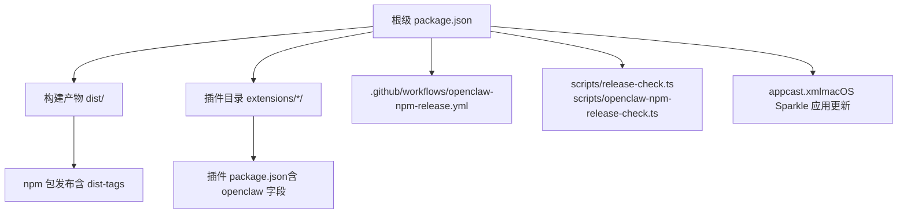
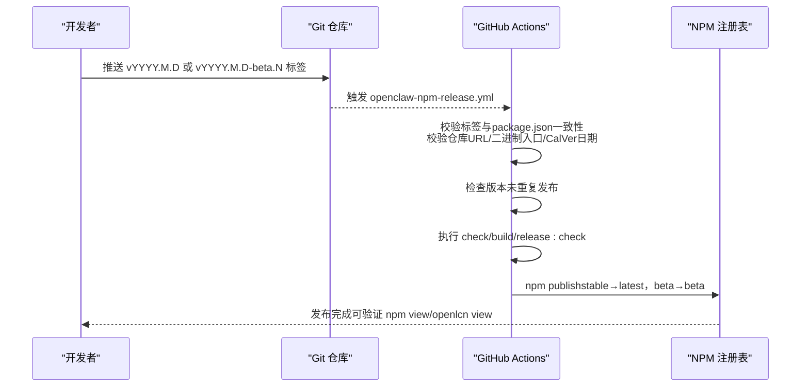
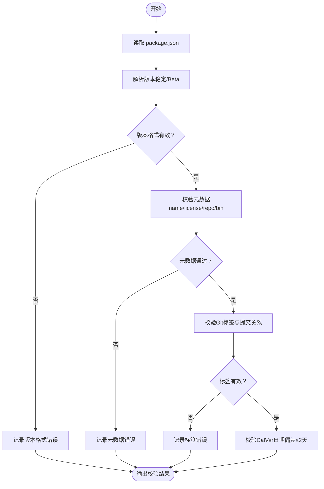
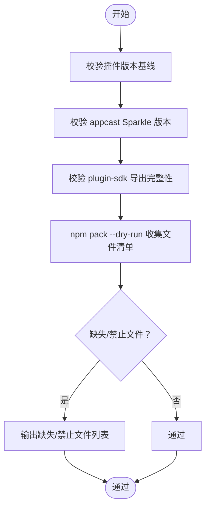
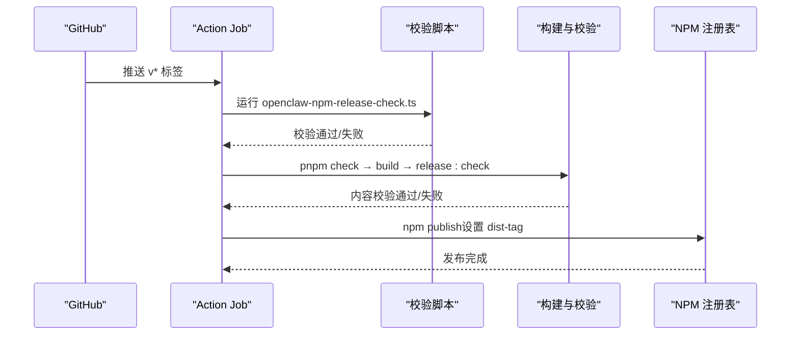
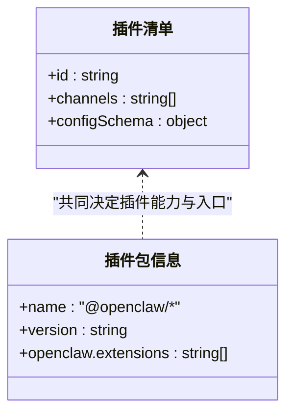
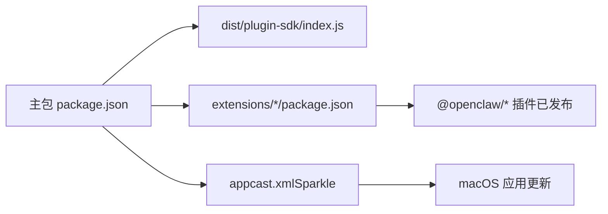

# 发布与分发

<cite>
**本文引用的文件**
- [package.json](file://package.json)
- [openclaw-npm-release-check.ts](file://scripts/openclaw-npm-release-check.ts)
- [release-check.ts](file://scripts/release-check.ts)
- [RELEASING.md](file://docs/reference/RELEASING.md)
- [openclaw-npm-release.yml](file://.github/workflows/openclaw-npm-release.yml)
- [discord/openclaw.plugin.json](file://extensions/discord/openclaw.plugin.json)
- [discord/package.json](file://extensions/discord/package.json)
- [lobster/openclaw.plugin.json](file://extensions/lobster/openclaw.plugin.json)
- [lobster/package.json](file://extensions/lobster/package.json)
- [appcast.xml](file://appcast.xml)
- [make_appcast.sh](file://scripts/make_appcast.sh)
</cite>

## 目录

1. [简介](#简介)
2. [项目结构](#项目结构)
3. [核心组件](#核心组件)
4. [架构总览](#架构总览)
5. [详细组件分析](#详细组件分析)
6. [依赖关系分析](#依赖关系分析)
7. [性能考量](#性能考量)
8. [故障排查指南](#故障排查指南)
9. [结论](#结论)
10. [附录](#附录)

## 简介

本指南面向OpenClaw插件开发者与发布运营人员，系统阐述插件打包、版本管理与发布流程，覆盖以下主题：

- 基于日期的版本策略与校验
- NPM包发布（含npm dist-tags）与自动化工作流
- 插件市场提交与分发渠道选择
- 发布前检查清单、文档准备与社区发布规范
- 插件更新与维护最佳实践
- 如何确保插件成功发布并被用户使用

## 项目结构

OpenClaw采用多语言混合工程：核心以TypeScript为主，构建产物输出到dist目录；同时包含Android/iOS/macOS平台应用与大量扩展插件（extensions）。发布相关的关键位置包括：

- 根级package.json：定义主包元数据、导出映射、脚本与发布白名单
- scripts目录：包含发布校验脚本与辅助工具
- docs/reference/RELEASING.md：官方发布清单与步骤
- .github/workflows：CI工作流，含openclaw-npm-release.yml自动触发NPM发布
- extensions：内置插件源码与各自package.json，部分已发布至npm scope @openclaw

图表来源

- [package.json](file://package.json)
- [openclaw-npm-release.yml](file://.github/workflows/openclaw-npm-release.yml)
- [release-check.ts](file://scripts/release-check.ts)
- [openclaw-npm-release-check.ts](file://scripts/openclaw-npm-release-check.ts)

章节来源

- [package.json](file://package.json)
- [RELEASING.md](file://docs/reference/RELEASING.md)

## 核心组件

- 版本与标签校验：通过openclaw-npm-release-check.ts对package.json版本格式、仓库地址、二进制入口以及Git标签进行严格校验，并限制CalVer日期与当前UTC日期偏差不超过2天。
- 发布内容校验：release-check.ts在npm pack阶段前检查必需文件、禁止文件、插件SDK导出完整性、Sparkle版本下限等，确保发布包可安装且运行稳定。
- 自动化发布：openclaw-npm-release.yml监听v\*标签推送，执行环境准备、校验、构建、内容验证与发布（根据是否为beta设置dist-tag）。
- 插件清单与同步：RELEASING.md定义了“仅发布已在npm上存在的@openclaw作用域插件”的策略，并提供plugins:sync命令保持插件版本一致。

章节来源

- [openclaw-npm-release-check.ts](file://scripts/openclaw-npm-release-check.ts)
- [release-check.ts](file://scripts/release-check.ts)
- [openclaw-npm-release.yml](file://.github/workflows/openclaw-npm-release.yml)
- [RELEASING.md](file://docs/reference/RELEASING.md)

## 架构总览

下图展示从版本标记到NPM发布的端到端流程，包括本地校验、CI校验与发布步骤。

图表来源

- [openclaw-npm-release.yml](file://.github/workflows/openclaw-npm-release.yml)
- [openclaw-npm-release-check.ts](file://scripts/openclaw-npm-release-check.ts)
- [release-check.ts](file://scripts/release-check.ts)

## 详细组件分析

### 组件A：版本与标签校验（openclaw-npm-release-check.ts）

该脚本负责：

- 解析并校验package.json版本格式（稳定版YYYY.M.D或Beta版YYYY.M.D-beta.N）
- 校验仓库URL规范化、许可证、二进制入口、名称等元数据
- 校验Git标签与package.json版本一致，且标签提交必须在main分支历史中
- 限制CalVer日期与当前UTC日期偏差不超过2天

图表来源

- [openclaw-npm-release-check.ts](file://scripts/openclaw-npm-release-check.ts)

章节来源

- [openclaw-npm-release-check.ts](file://scripts/openclaw-npm-release-check.ts)

### 组件B：发布内容与插件SDK校验（release-check.ts）

该脚本在npm pack阶段前执行，确保：

- 所有扩展插件版本与根版本基线一致（通过plugins:sync同步）
- appcast.xml中的Sparkle版本满足最低楼层要求
- dist/plugin-sdk/index.js导出关键API，避免插件运行时崩溃
- npm pack包含必需文件，不包含禁止文件（如macOS应用bundle）

图表来源

- [release-check.ts](file://scripts/release-check.ts)
- [appcast.xml](file://appcast.xml)

章节来源

- [release-check.ts](file://scripts/release-check.ts)

### 组件C：NPM发布工作流（openclaw-npm-release.yml）

- 触发条件：推送v\*标签
- 步骤：
  - 检出代码、设置Node/pnpm环境
  - 运行openclaw-npm-release-check.ts与release-check.ts
  - 检查版本未重复发布
  - 执行check/build/release:check
  - 根据是否包含-beta设置dist-tag（beta→beta，否则→latest），并启用provenance
- 安全性：使用GitHub托管Runner以支持npm trusted publishing与provenance

图表来源

- [openclaw-npm-release.yml](file://.github/workflows/openclaw-npm-release.yml)

章节来源

- [openclaw-npm-release.yml](file://.github/workflows/openclaw-npm-release.yml)

### 组件D：插件清单与发布范围（RELEASING.md）

- 仅发布已在npm上存在的@openclaw作用域插件，未发布的内置插件仅随主包分发但不单独发布
- 使用npm search @openclaw --json对比extensions/\*/package.json中的name字段，取交集进行发布
- 发布前需同步插件版本（plugins:sync），并在GitHub Release中说明新增的非默认启用插件

章节来源

- [RELEASING.md](file://docs/reference/RELEASING.md)

### 组件E：插件元数据与导出（以discord/lobster为例）

- 插件openclaw.plugin.json定义插件id、通道类型与配置Schema
- 插件package.json定义name（@openclaw/\*）、version、openclaw.extensions数组指向入口文件
- 插件需与主包版本基线一致，确保兼容性

图表来源

- [discord/openclaw.plugin.json](file://extensions/discord/openclaw.plugin.json)
- [discord/package.json](file://extensions/discord/package.json)
- [lobster/openclaw.plugin.json](file://extensions/lobster/openclaw.plugin.json)
- [lobster/package.json](file://extensions/lobster/package.json)

章节来源

- [discord/openclaw.plugin.json](file://extensions/discord/openclaw.plugin.json)
- [discord/package.json](file://extensions/discord/package.json)
- [lobster/openclaw.plugin.json](file://extensions/lobster/openclaw.plugin.json)
- [lobster/package.json](file://extensions/lobster/package.json)

## 依赖关系分析

- 主包对插件SDK的导出存在强约束：release-check.ts要求dist/plugin-sdk/index.js导出一组关键API，否则插件运行时会崩溃
- 插件版本需与根版本基线一致：plugins:sync用于同步extensions/\*/package.json的version基线
- macOS应用更新依赖Sparkle：appcast.xml中的sparkle:version需满足最低楼层，且appcast由make_appcast.sh生成

图表来源

- [release-check.ts](file://scripts/release-check.ts)
- [RELEASING.md](file://docs/reference/RELEASING.md)
- [appcast.xml](file://appcast.xml)
- [make_appcast.sh](file://scripts/make_appcast.sh)

章节来源

- [release-check.ts](file://scripts/release-check.ts)
- [RELEASING.md](file://docs/reference/RELEASING.md)

## 性能考量

- 发布前构建与校验耗时主要来自构建与测试，建议在本地先执行pnpm build与pnpm release:check，减少CI失败重试成本
- npm pack --dry-run可快速发现遗漏/多余文件，避免大体积tarball导致的发布缓慢
- Sparkle appcast生成与校验应尽早完成，避免发布后补丁修复导致的二次发布

## 故障排查指南

常见问题与处理要点：

- npm pack/publish卡住或产生巨大包体：确认package.json files白名单已排除dist/OpenClaw.app等应用bundle，使用npm pack --dry-run核对
- npm认证问题（dist-tags页面循环）：改用传统认证方式获取OTP提示
- npx验证失败（ECOMPROMISED: Lock compromised）：清理缓存后重试
- 标签需要回滚修正：强制更新标签并确保GitHub Release资产匹配

章节来源

- [RELEASING.md](file://docs/reference/RELEASING.md)

## 结论

通过严格的版本与标签校验、发布内容与SDK导出校验、以及GitHub Actions自动化发布，OpenClaw实现了可追溯、可复现且安全的发布流程。遵循本文档的发布清单与最佳实践，可显著降低发布风险，提升插件与主包的可用性与稳定性。

## 附录

### 发布前检查清单（摘自RELEASING.md）

- 版本与元数据：更新package.json版本、运行plugins:sync、更新CLI/version字符串、确认name/description/repository/bin
- 构建与产物：执行构建、确认dist/build-info.json存在、必要时使用npm pack --pack-destination检查
- 变更日志与文档：更新CHANGELOG.md与README示例
- 校验与测试：执行build/check/test、release:check、安装冒烟测试（Docker路径）
- macOS应用（Sparkle）：构建签名、生成appcast、更新appcast.xml
- 发布（NPM）：确认git状态干净、推送匹配标签、验证npm view与npx行为
- GitHub Release：按要求创建Release、附加产物、提交appcast.xml并验证

章节来源

- [RELEASING.md](file://docs/reference/RELEASING.md)
