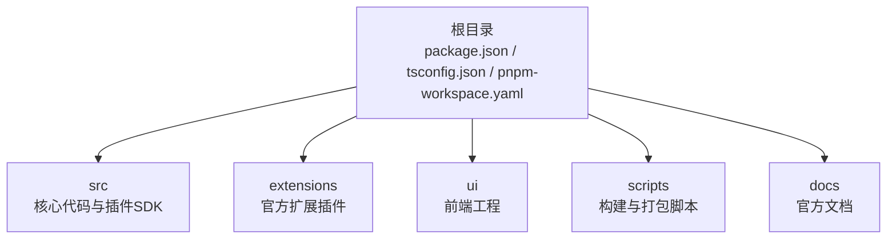
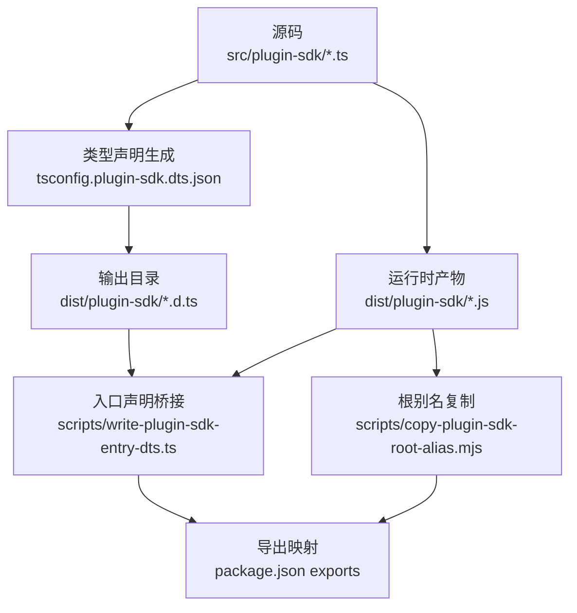
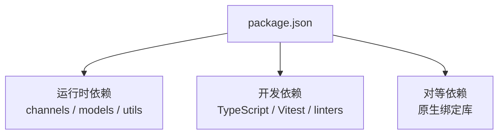

# 开发环境搭建

<cite>
**本文档引用的文件**
- [package.json](file://package.json)
- [tsconfig.json](file://tsconfig.json)
- [tsconfig.plugin-sdk.dts.json](file://tsconfig.plugin-sdk.dts.json)
- [src/plugin-sdk/index.ts](file://src/plugin-sdk/index.ts)
- [scripts/tsdown-build.mjs](file://scripts/tsdown-build.mjs)
- [scripts/copy-plugin-sdk-root-alias.mjs](file://scripts/copy-plugin-sdk-root-alias.mjs)
- [scripts/write-plugin-sdk-entry-dts.ts](file://scripts/write-plugin-sdk-entry-dts.ts)
- [scripts/check-plugin-sdk-exports.mjs](file://scripts/check-plugin-sdk-exports.mjs)
- [pnpm-workspace.yaml](file://pnpm-workspace.yaml)
- [README.md](file://README.md)
- [docs/start/getting-started.md](file://docs/start/getting-started.md)
- [docs/install/node.md](file://docs/install/node.md)
- [.github/instructions/copilot.instructions.md](file://.github/instructions/copilot.instructions.md)
- [scripts/ui.js](file://scripts/ui.js)
- [vitest.config.ts](file://vitest.config.ts)
- [vitest.extensions.config.ts](file://vitest.extensions.config.ts)
- [vitest.live.config.ts](file://vitest.live.config.ts)
- [ui/vitest.config.ts](file://ui/vitest.config.ts)
- [src/commands/doctor-install.ts](file://src/commands/doctor-install.ts)
</cite>

## 目录

1. [简介](#简介)
2. [项目结构](#项目结构)
3. [核心组件](#核心组件)
4. [架构总览](#架构总览)
5. [详细组件分析](#详细组件分析)
6. [依赖分析](#依赖分析)
7. [性能考虑](#性能考虑)
8. [故障排除指南](#故障排除指南)
9. [结论](#结论)
10. [附录](#附录)

## 简介

本指南面向希望在 OpenClaw 仓库中进行插件开发的开发者，目标是帮助你在最短时间内完成从零到一的完整开发环境搭建，包括 Node.js 版本要求、TypeScript 配置、开发工具链与 IDE 设置、调试环境与工作流、插件 SDK 的安装与初始化、基本配置以及环境验证与常见问题排查。

## 项目结构

OpenClaw 采用多包工作区（pnpm workspace）组织，核心目录与角色如下：

- 根目录：项目根配置、脚本与构建流程入口
- src：核心运行时与插件 SDK 源码
- extensions：官方扩展插件集合
- ui：前端界面工程
- scripts：构建、打包与发布相关脚本
- docs：官方文档

图表来源

- [pnpm-workspace.yaml:1-6](file://pnpm-workspace.yaml#L1-L6)
- [package.json:1-50](file://package.json#L1-L50)

章节来源

- [pnpm-workspace.yaml:1-18](file://pnpm-workspace.yaml#L1-L18)
- [package.json:1-120](file://package.json#L1-L120)

## 核心组件

- Node.js 运行时与版本要求：项目要求 Node ≥ 22，并通过 engines 字段声明。
- TypeScript 编译配置：统一的 tsconfig.json 作为基础，插件 SDK 的类型声明通过独立的 tsconfig.plugin-sdk.dts.json 生成。
- 插件 SDK：位于 src/plugin-sdk，导出插件开发所需的核心类型与工具函数。
- 构建与打包：使用 tsdown 与自定义脚本生成 dist/plugin-sdk 下的 SDK 包与类型声明。
- 测试框架：基于 Vitest，提供多套配置以覆盖单元测试、扩展测试与浏览器端测试。

章节来源

- [package.json:422-424](file://package.json#L422-L424)
- [tsconfig.json:1-29](file://tsconfig.json#L1-L29)
- [tsconfig.plugin-sdk.dts.json:1-62](file://tsconfig.plugin-sdk.dts.json#L1-L62)
- [src/plugin-sdk/index.ts:1-120](file://src/plugin-sdk/index.ts#L1-L120)

## 架构总览

下图展示了从源码到可发布的插件 SDK 的关键路径，包括 TypeScript 编译、声明生成、产物复制与导出映射。

图表来源

- [tsconfig.plugin-sdk.dts.json:1-62](file://tsconfig.plugin-sdk.dts.json#L1-L62)
- [scripts/copy-plugin-sdk-root-alias.mjs:1-10](file://scripts/copy-plugin-sdk-root-alias.mjs#L1-L10)
- [scripts/write-plugin-sdk-entry-dts.ts:1-60](file://scripts/write-plugin-sdk-entry-dts.ts#L1-L60)
- [package.json:37-216](file://package.json#L37-L216)

章节来源

- [scripts/tsdown-build.mjs:1-20](file://scripts/tsdown-build.mjs#L1-L20)
- [scripts/check-plugin-sdk-exports.mjs:127-157](file://scripts/check-plugin-sdk-exports.mjs#L127-L157)

## 详细组件分析

### Node.js 与包管理器

- Node 版本：要求 ≥ 22，可通过官方安装脚本或版本管理器安装。
- 包管理器：推荐使用 pnpm；支持 npm 与 bun 作为可选运行方式。
- 工作区：pnpm workspace 管理根与子包，仅对特定原生依赖启用预编译优化。

章节来源

- [package.json:422-424](file://package.json#L422-L424)
- [docs/install/node.md:1-139](file://docs/install/node.md#L1-L139)
- [pnpm-workspace.yaml:7-18](file://pnpm-workspace.yaml#L7-L18)

### TypeScript 配置与路径映射

- 基础配置：tsconfig.json 启用严格模式、NodeNext 模块系统与路径映射，便于 openclaw/plugin-sdk 的导入。
- 插件 SDK 类型声明：通过 tsconfig.plugin-sdk.dts.json 仅编译 src/plugin-sdk 下的入口与子模块，输出到 dist/plugin-sdk 并生成 .d.ts。
- 入口声明桥接：write-plugin-sdk-entry-dts.ts 为每个导出入口生成稳定入口 d.ts 文件，确保 NodeNext 解析行为一致。

章节来源

- [tsconfig.json:1-29](file://tsconfig.json#L1-L29)
- [tsconfig.plugin-sdk.dts.json:1-62](file://tsconfig.plugin-sdk.dts.json#L1-L62)
- [scripts/write-plugin-sdk-entry-dts.ts:1-60](file://scripts/write-plugin-sdk-entry-dts.ts#L1-L60)

### 插件 SDK 初始化与导出

- SDK 入口：src/plugin-sdk/index.ts 汇聚所有公开类型与工具，供扩展与插件使用。
- 导出映射：package.json 的 exports 字段为各子路径提供 types/default 双重导出，便于 TypeScript 与运行时解析。
- 校验脚本：check-plugin-sdk-exports.mjs 在构建后检查必需的子路径与命名导出是否存在，避免运行时断链。

章节来源

- [src/plugin-sdk/index.ts:1-120](file://src/plugin-sdk/index.ts#L1-L120)
- [package.json:37-216](file://package.json#L37-L216)
- [scripts/check-plugin-sdk-exports.mjs:127-157](file://scripts/check-plugin-sdk-exports.mjs#L127-L157)

### 构建与打包流程

- 构建命令：build 脚本串联 tsdown、根别名复制、SDK 类型声明生成、入口 d.ts 写入、UI 资源拷贝等步骤。
- 根别名：copy-plugin-sdk-root-alias.mjs 将根别名文件复制到 dist，保证运行时可定位 SDK。
- 类型声明：write-plugin-sdk-entry-dts.ts 生成每个入口的 .d.ts，确保类型与运行时匹配。

章节来源

- [package.json:226-229](file://package.json#L226-L229)
- [scripts/tsdown-build.mjs:1-20](file://scripts/tsdown-build.mjs#L1-L20)
- [scripts/copy-plugin-sdk-root-alias.mjs:1-10](file://scripts/copy-plugin-sdk-root-alias.mjs#L1-L10)
- [scripts/write-plugin-sdk-entry-dts.ts:1-60](file://scripts/write-plugin-sdk-entry-dts.ts#L1-L60)

### 测试与开发工作流

- 测试框架：Vitest 提供多套配置，覆盖单元、扩展、浏览器端与实时集成测试。
- 扩展测试：vitest.extensions.config.ts 限定仅运行 extensions 目录下的测试。
- UI 测试：ui/vitest.config.ts 使用 Playwright 提供浏览器端测试能力。
- 开发脚本：README.md 与 .github/instructions/copilot.instructions.md 提供常用命令与工作流建议。

章节来源

- [vitest.config.ts:1-200](file://vitest.config.ts#L1-L200)
- [vitest.extensions.config.ts:1-3](file://vitest.extensions.config.ts#L1-L3)
- [vitest.live.config.ts:1-16](file://vitest.live.config.ts#L1-L16)
- [ui/vitest.config.ts:1-15](file://ui/vitest.config.ts#L1-L15)
- [README.md:92-111](file://README.md#L92-L111)
- [.github/instructions/copilot.instructions.md:55-65](file://.github/instructions/copilot.instructions.md#L55-L65)

### IDE 与调试环境

- IDE 推荐：使用支持 TypeScript 严格模式与路径映射的现代编辑器（如 VS Code），确保 tsconfig.json 与工作区配置正确加载。
- 调试建议：利用 pnpm openclaw ... 直接运行 TypeScript 文件，或通过 UI 脚本运行前端任务。
- UI 工具：scripts/ui.js 提供统一的 UI 子工程命令入口，自动处理依赖安装与执行。

章节来源

- [scripts/ui.js:162-203](file://scripts/ui.js#L162-L203)
- [README.md:92-111](file://README.md#L92-L111)

## 依赖分析

OpenClaw 的依赖分为三类：

- 运行时依赖：用于通道连接、模型调用、网络与工具等。
- 开发依赖：TypeScript、Vitest、格式化与静态检查工具。
- 对等依赖：部分原生绑定库，需按平台安装。

图表来源

- [package.json:340-464](file://package.json#L340-L464)

章节来源

- [package.json:340-464](file://package.json#L340-L464)

## 性能考虑

- 构建缓存：Dockerfile 中使用共享 pnpm store 缓存，提升容器内安装速度。
- 仅编译原生依赖：pnpm-workspace.yaml 中仅对必要原生库启用预编译，减少本地编译负担。
- 并行测试：Vitest 支持并发执行，结合 scoped 配置可缩短测试周期。

章节来源

- [pnpm-workspace.yaml:7-18](file://pnpm-workspace.yaml#L7-L18)
- [vitest.config.ts:1-200](file://vitest.config.ts#L1-L200)

## 故障排除指南

- Node 版本不满足要求：根据 docs/install/node.md 检查版本并使用版本管理器或官方脚本安装。
- 安装依赖问题：doctor-install.ts 会检测 pnpm 安装状态、lock 文件与 tsx 二进制缺失等问题并给出提示。
- UI 依赖缺失：scripts/ui.js 在缺少依赖时会自动安装，确保 NODE_ENV 正确传递。
- 构建产物缺失：check-plugin-sdk-exports.mjs 会在缺少必需导出时报错，需检查 src/plugin-sdk 的导出与构建脚本。

章节来源

- [docs/install/node.md:1-139](file://docs/install/node.md#L1-L139)
- [src/commands/doctor-install.ts:1-40](file://src/commands/doctor-install.ts#L1-L40)
- [scripts/ui.js:186-191](file://scripts/ui.js#L186-L191)
- [scripts/check-plugin-sdk-exports.mjs:127-157](file://scripts/check-plugin-sdk-exports.mjs#L127-L157)

## 结论

通过遵循本指南，你可以快速完成 OpenClaw 插件开发环境的搭建：安装满足要求的 Node.js、配置 pnpm 工作区与 TypeScript 路径映射、理解插件 SDK 的构建与导出机制、掌握测试与调试工作流，并在遇到问题时依据内置诊断脚本与文档进行排查。这将为你后续的插件开发打下坚实基础。

## 附录

### 快速开始清单

- 安装 Node.js（≥ 22）
- 安装 pnpm
- 在仓库根目录执行 pnpm install
- 构建 SDK：pnpm build
- 运行示例：pnpm openclaw onboard --install-daemon
- 开发循环：pnpm gateway:watch 或 pnpm dev

章节来源

- [docs/start/getting-started.md:1-136](file://docs/start/getting-started.md#L1-L136)
- [README.md:92-111](file://README.md#L92-L111)
