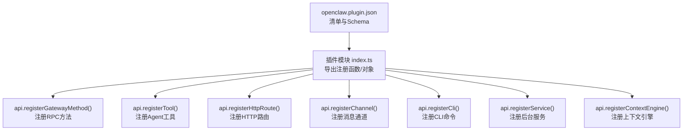
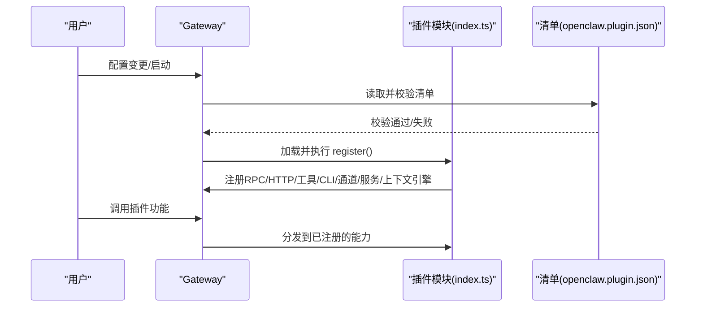
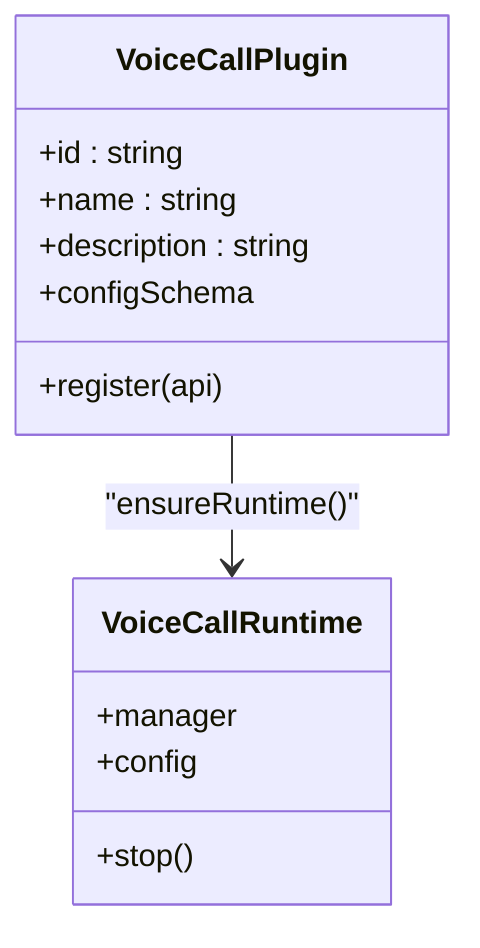
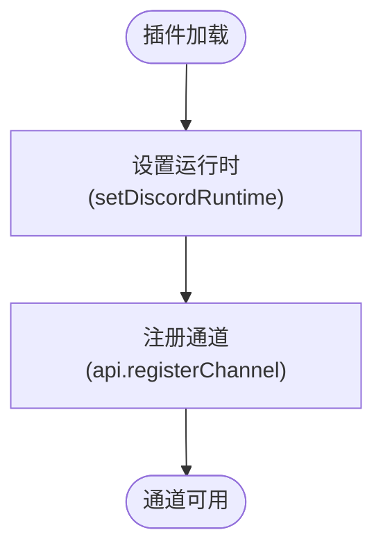
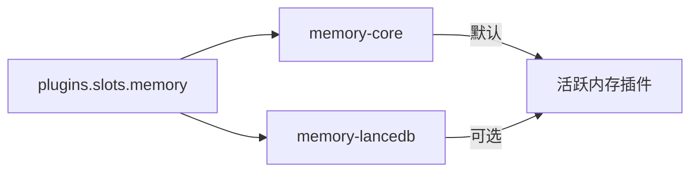
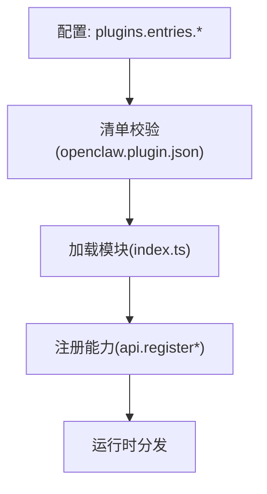

# 插件开发指南

<cite>
**本文档引用的文件**
- [README.md](file://README.md)
- [docs/tools/plugin.md](file://docs/tools/plugin.md)
- [docs/plugins/manifest.md](file://docs/plugins/manifest.md)
- [extensions/voice-call/openclaw.plugin.json](file://extensions/voice-call/openclaw.plugin.json)
- [extensions/voice-call/index.ts](file://extensions/voice-call/index.ts)
- [extensions/discord/index.ts](file://extensions/discord/index.ts)
- [extensions/telegram/index.ts](file://extensions/telegram/index.ts)
- [extensions/memory-core/openclaw.plugin.json](file://extensions/memory-core/openclaw.plugin.json)
- [extensions/memory-lancedb/openclaw.plugin.json](file://extensions/memory-lancedb/openclaw.plugin.json)
- [src/plugin-sdk/core.ts](file://src/plugin-sdk/core.ts)
</cite>

## 目录

1. [简介](#简介)
2. [项目结构](#项目结构)
3. [核心组件](#核心组件)
4. [架构总览](#架构总览)
5. [详细组件分析](#详细组件分析)
6. [依赖关系分析](#依赖关系分析)
7. [性能考虑](#性能考虑)
8. [故障排查指南](#故障排查指南)
9. [结论](#结论)
10. [附录](#附录)

## 简介

本指南面向希望为 OpenClaw 开发插件的开发者，覆盖从环境准备、项目创建、配置与构建，到不同类型插件（通道插件、技能插件、工具插件）的开发模式与实现要点。文档同时提供调试技巧、测试策略与性能优化建议，帮助你快速上手并开发高质量插件。

## 项目结构

OpenClaw 的插件体系由“插件清单（manifest）+ 运行时注册”构成：每个插件必须在根目录提供 openclaw.plugin.json，并通过 TypeScript 模块导出注册函数或对象，向 OpenClaw 注册 RPC 方法、HTTP 路由、工具、CLI 命令、上下文引擎、通道等能力。

- 插件清单（manifest）
  - 必须字段：id、configSchema
  - 可选字段：kind、channels、providers、skills、name、description、uiHints、version
  - 清单用于严格配置校验，不执行插件代码
- 插件模块（index.ts）
  - 导出函数或对象，接收 OpenClawPluginApi 并调用 api.register\* 完成注册
- 内置插件样例
  - 语音通话插件（voice-call）：展示工具、Gateway 方法、CLI、服务的完整注册流程
  - 通道插件（discord、telegram）：展示通道插件的最小化注册方式
  - 记忆插件（memory-core、memory-lancedb）：展示“独占槽位”型插件的 kind 与配置

图表来源

- [extensions/voice-call/openclaw.plugin.json:1-601](file://extensions/voice-call/openclaw.plugin.json#L1-L601)
- [extensions/voice-call/index.ts:146-543](file://extensions/voice-call/index.ts#L146-L543)
- [extensions/discord/index.ts:7-17](file://extensions/discord/index.ts#L7-L17)
- [extensions/telegram/index.ts:6-15](file://extensions/telegram/index.ts#L6-L15)

章节来源

- [docs/tools/plugin.md:1-120](file://docs/tools/plugin.md#L1-L120)
- [docs/plugins/manifest.md:1-76](file://docs/plugins/manifest.md#L1-L76)

## 核心组件

- 插件清单（openclaw.plugin.json）
  - 作用：声明插件 id、类型（kind）、可注册的通道/提供商、技能目录、配置 Schema 与 UI 提示
  - 严格性：缺失或非法清单会阻断配置验证
- 插件模块（index.ts）
  - 作用：在 register 回调中完成所有能力注册；可访问 api.runtime、api.config、api.logger 等运行时辅助
- 插件 SDK
  - 提供统一的类型定义与常用工具（如空配置 Schema、OAuth 结果构造、设备配对、临时目录解析、网关绑定地址解析、Tailscale 状态解析等）

章节来源

- [docs/plugins/manifest.md:18-76](file://docs/plugins/manifest.md#L18-L76)
- [src/plugin-sdk/core.ts:1-44](file://src/plugin-sdk/core.ts#L1-L44)

## 架构总览

OpenClaw 插件以“清单驱动 + 运行时注册”的方式工作：启动时先读取清单进行严格配置校验，再加载模块执行注册逻辑。插件在进程内运行，具备与核心相同的信任级别，因此需遵循安全与稳定性原则。

图表来源

- [docs/tools/plugin.md:62-120](file://docs/tools/plugin.md#L62-L120)
- [extensions/voice-call/index.ts:151-543](file://extensions/voice-call/index.ts#L151-L543)

## 详细组件分析

### 语音通话插件（工具插件）

该插件展示了工具插件的完整实现路径：注册 Gateway 方法、Agent 工具、CLI 子命令、后台服务，以及基于配置的运行时初始化与错误处理。

- 清单要点
  - id、kind（可选）、configSchema（含大量字段与嵌套对象）
  - uiHints 提升 UI 表单体验（标签、占位符、敏感字段标记）
- 注册要点
  - 解析并校验配置，按需抛错或警告
  - 注册多个 Gateway 方法（initiate、continue、speak、end、status、start）
  - 注册 Agent 工具（voice_call），支持多种动作参数
  - 注册 CLI 命令组（voicecall）
  - 注册后台服务（voicecall），负责启动/停止运行时
- 运行时设计
  - 延迟初始化：ensureRuntime 首次使用时创建运行时实例
  - 失败重试：运行时创建失败后清理缓存，允许下次重试
  - 统一错误响应：sendError 规范化返回错误信息

图表来源

- [extensions/voice-call/index.ts:146-543](file://extensions/voice-call/index.ts#L146-L543)

章节来源

- [extensions/voice-call/openclaw.plugin.json:1-601](file://extensions/voice-call/openclaw.plugin.json#L1-L601)
- [extensions/voice-call/index.ts:146-543](file://extensions/voice-call/index.ts#L146-L543)

### Discord 通道插件（通道插件）

通道插件通过 api.registerChannel 将自定义通道注册为内置通道同等能力，配置位于 channels.<id> 下，由插件自身解析与校验。

- 最小化实现
  - 使用空配置 Schema（emptyPluginConfigSchema）
  - 设置运行时（setDiscordRuntime）
  - 注册通道插件对象（discordPlugin）
- 通道元数据
  - 包含 label、selectionLabel、docsPath、aliases 等，用于 UI 列表与向导

图表来源

- [extensions/discord/index.ts:7-17](file://extensions/discord/index.ts#L7-L17)

章节来源

- [extensions/discord/index.ts:1-20](file://extensions/discord/index.ts#L1-L20)

### Telegram 通道插件（通道插件）

与 Discord 类似，但更强调通道配置与运行时设置。

- 关键点
  - 使用 Telegram SDK 的空配置 Schema
  - 设置运行时（setTelegramRuntime）
  - 注册通道插件对象

章节来源

- [extensions/telegram/index.ts:1-18](file://extensions/telegram/index.ts#L1-L18)

### 记忆插件（独占槽位插件）

记忆插件通过 kind 字段声明“内存”类别，配合 plugins.slots.memory 选择当前活跃插件。

- memory-core
  - 空配置 Schema，作为默认实现
- memory-lancedb
  - 嵌套配置（embedding、dbPath、autoCapture、autoRecall、captureMaxChars）
  - uiHints 提供字段标签与高级选项提示

图表来源

- [extensions/memory-core/openclaw.plugin.json:1-10](file://extensions/memory-core/openclaw.plugin.json#L1-L10)
- [extensions/memory-lancedb/openclaw.plugin.json:1-89](file://extensions/memory-lancedb/openclaw.plugin.json#L1-L89)

章节来源

- [extensions/memory-core/openclaw.plugin.json:1-10](file://extensions/memory-core/openclaw.plugin.json#L1-L10)
- [extensions/memory-lancedb/openclaw.plugin.json:1-89](file://extensions/memory-lancedb/openclaw.plugin.json#L1-L89)

### 上下文引擎插件（扩展型插件）

上下文引擎插件通过 api.registerContextEngine 注册，配合 plugins.slots.contextEngine 选择活跃引擎。适合需要替换或扩展默认上下文编排的场景。

- 注册方式
  - 在 register 中调用 api.registerContextEngine(id, factory)
  - 在配置中通过 plugins.slots.contextEngine 指定插件 id
- 典型职责
  - 消息摄取（ingest）
  - 组装（assemble）
  - 压缩（compact）

章节来源

- [docs/tools/plugin.md:417-426](file://docs/tools/plugin.md#L417-L426)
- [docs/tools/plugin.md:510-521](file://docs/tools/plugin.md#L510-L521)

## 依赖关系分析

- 插件发现与优先级
  - 配置路径 > 工作区扩展 > 全局扩展 > 内置扩展
  - 同名插件以首次匹配为准
- 安全与信任
  - 非内置插件需经安装/加载路径证明，否则发出警告
  - 支持 allowlist/denylist 控制可加载插件集合
- 清单与 Schema
  - 所有插件必须提供 openclaw.plugin.json 与 JSON Schema
  - 未知插件 id 或通道键将触发错误

图表来源

- [docs/tools/plugin.md:228-304](file://docs/tools/plugin.md#L228-L304)
- [docs/plugins/manifest.md:53-76](file://docs/plugins/manifest.md#L53-L76)

章节来源

- [docs/tools/plugin.md:228-304](file://docs/tools/plugin.md#L228-L304)
- [docs/plugins/manifest.md:53-76](file://docs/plugins/manifest.md#L53-L76)

## 性能考虑

- 缓存与启动
  - 插件发现与清单元数据使用短时缓存减少启动/重载开销
  - 可通过环境变量禁用缓存或调整缓存窗口
- 运行时延迟初始化
  - 语音通话插件演示了 ensureRuntime 与失败重试机制，避免端口孤儿与重复失败
- 资源管理
  - 后台服务（service）应实现 stop，确保优雅退出与资源回收

章节来源

- [docs/tools/plugin.md:219-227](file://docs/tools/plugin.md#L219-L227)
- [extensions/voice-call/index.ts:169-197](file://extensions/voice-call/index.ts#L169-L197)

## 故障排查指南

- 清单与 Schema 错误
  - 缺失或非法清单会阻断配置验证；检查 openclaw.plugin.json 的必需字段与枚举值
- 插件未加载
  - 确认插件 id 是否在 allowlist 中；非内置插件若无安装/加载路径证明会发出警告
- 配置无效
  - 未知插件 id 或通道键会报错；确认 plugins.entries、plugins.allow、plugins.deny、plugins.slots 的一致性
- 运行时异常
  - 语音通话插件在运行时创建失败后会清理缓存并允许重试；查看日志定位具体原因
- 安全与权限
  - 插件在进程中运行，需遵循安全与最小权限原则；通道插件注意凭据来源与状态报告

章节来源

- [docs/plugins/manifest.md:53-76](file://docs/plugins/manifest.md#L53-L76)
- [docs/tools/plugin.md:384-392](file://docs/tools/plugin.md#L384-L392)
- [extensions/voice-call/index.ts:189-196](file://extensions/voice-call/index.ts#L189-L196)

## 结论

OpenClaw 插件体系以“清单驱动 + 运行时注册”为核心，既保证了严格的配置校验，又提供了灵活的能力扩展接口。通过参考语音通话、通道与记忆插件的实现，你可以快速构建工具、通道与扩展型插件。建议在开发过程中重视清单完整性、配置 Schema 的严谨性与运行时的健壮性，并结合缓存与延迟初始化提升性能与稳定性。

## 附录

### 环境搭建与开发流程

- 运行时要求
  - Node ≥22
- 快速起步
  - 使用 CLI 查看已加载插件、安装官方插件、重启 Gateway 后在 plugins.entries.<id>.config 下配置
- 开发循环
  - 修改插件代码后，重启 Gateway 生效（配置变更需要重启）

章节来源

- [README.md:50-111](file://README.md#L50-L111)
- [docs/tools/plugin.md:20-45](file://docs/tools/plugin.md#L20-L45)

### 不同类型插件的开发要点

- 工具插件（示例：语音通话）
  - 注册 Gateway 方法、Agent 工具、CLI 子命令、后台服务
  - 通过 ensureRuntime 实现延迟初始化与错误恢复
- 通道插件（示例：Discord、Telegram）
  - 使用空配置 Schema，设置运行时，注册通道插件对象
  - 配置位于 channels.<id>，由插件解析与校验
- 记忆插件（独占槽位）
  - 通过 kind: "memory" 声明类别，配合 plugins.slots.memory 选择
  - 提供 uiHints 与嵌套配置 Schema，增强 UI 体验
- 上下文引擎插件
  - 通过 api.registerContextEngine 注册，配合 plugins.slots.contextEngine 选择

章节来源

- [extensions/voice-call/index.ts:151-543](file://extensions/voice-call/index.ts#L151-L543)
- [extensions/discord/index.ts:7-17](file://extensions/discord/index.ts#L7-L17)
- [extensions/telegram/index.ts:6-15](file://extensions/telegram/index.ts#L6-L15)
- [extensions/memory-core/openclaw.plugin.json:1-10](file://extensions/memory-core/openclaw.plugin.json#L1-L10)
- [extensions/memory-lancedb/openclaw.plugin.json:1-89](file://extensions/memory-lancedb/openclaw.plugin.json#L1-L89)
- [docs/tools/plugin.md:417-426](file://docs/tools/plugin.md#L417-L426)

### 代码示例与最佳实践

- 清单与 Schema
  - 保持 configSchema 与 uiHints 一致，提供清晰的标签与占位符
  - 对敏感字段使用 uiHints.sensitive 标记
- 注册顺序与健壮性
  - 先解析与校验配置，再注册能力
  - 对外暴露的错误响应统一规范化
- 测试与调试
  - 使用 openclaw plugins doctor 检查清单与配置问题
  - 通过 openclaw plugins list/info 定位插件状态
  - 在本地开发时使用 openclaw plugins install -l 链接开发目录

章节来源

- [docs/plugins/manifest.md:42-46](file://docs/plugins/manifest.md#L42-L46)
- [extensions/voice-call/index.ts:199-201](file://extensions/voice-call/index.ts#L199-L201)
- [docs/tools/plugin.md:460-483](file://docs/tools/plugin.md#L460-L483)
