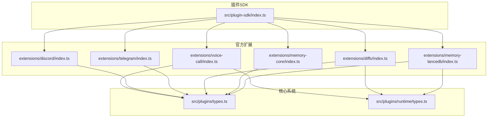
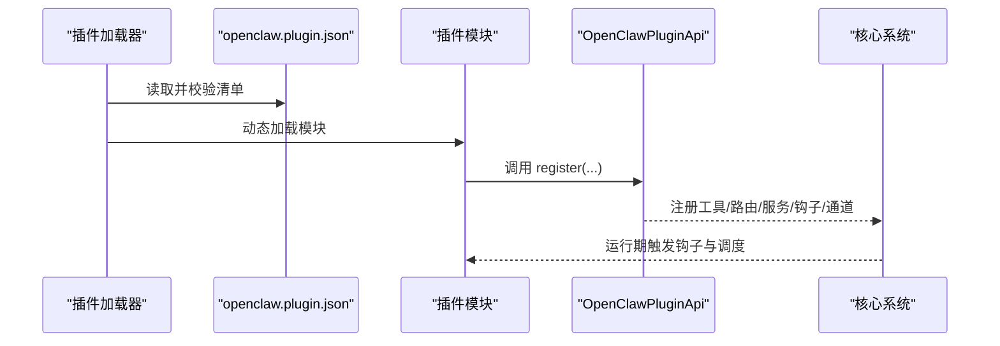
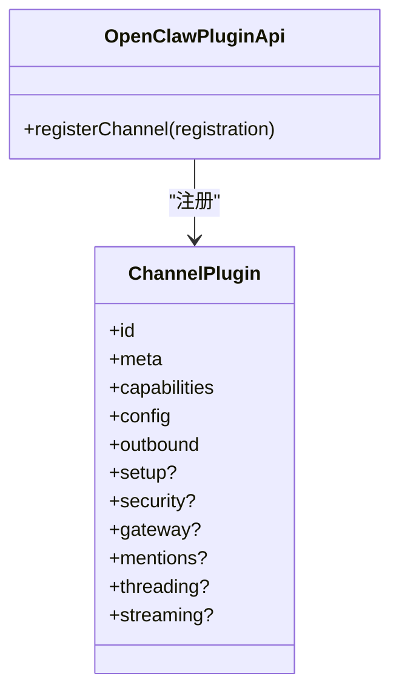
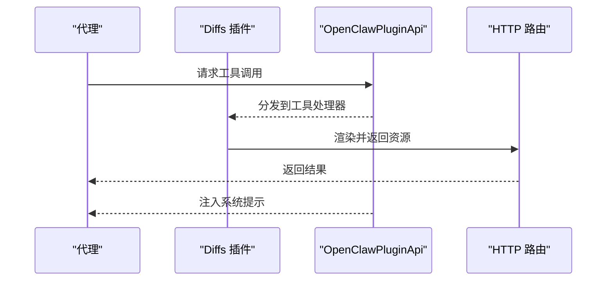
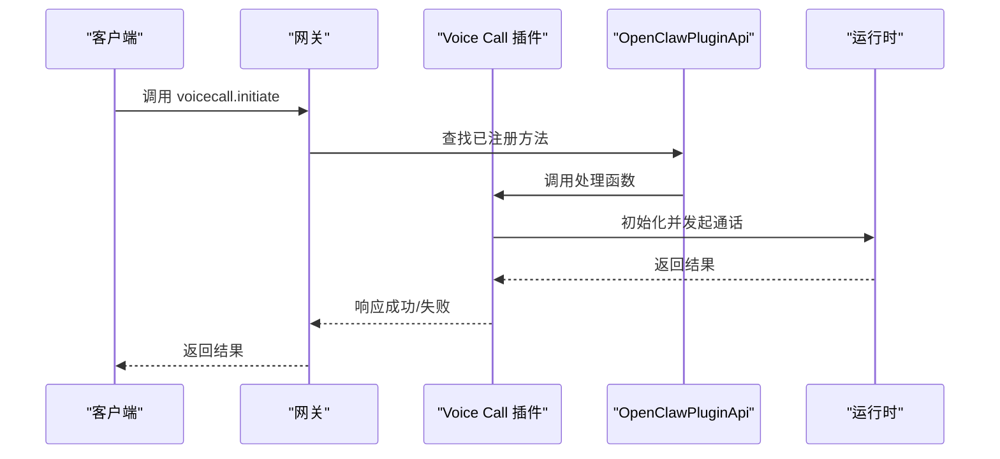
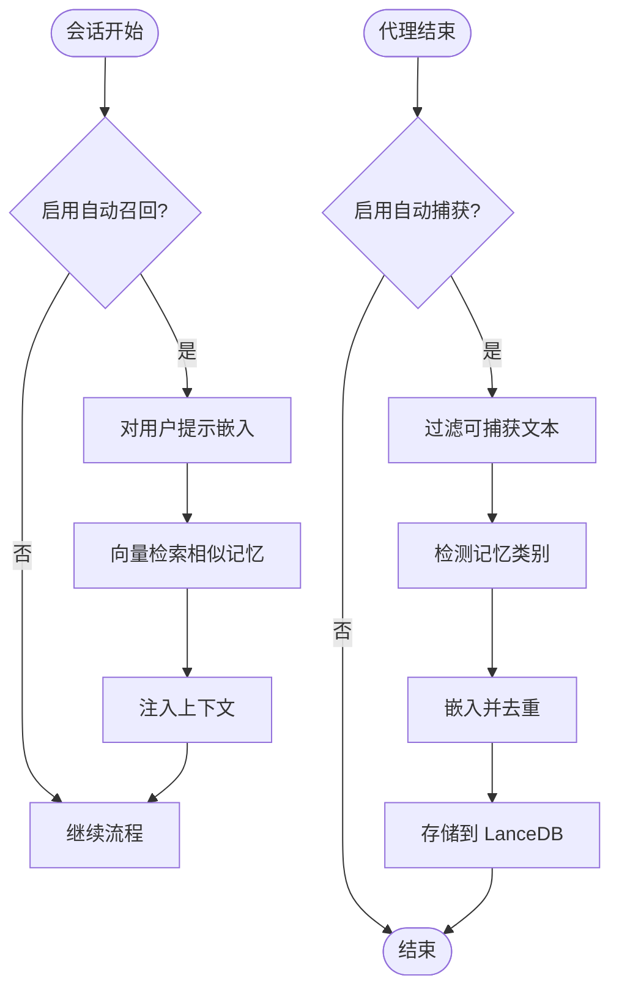
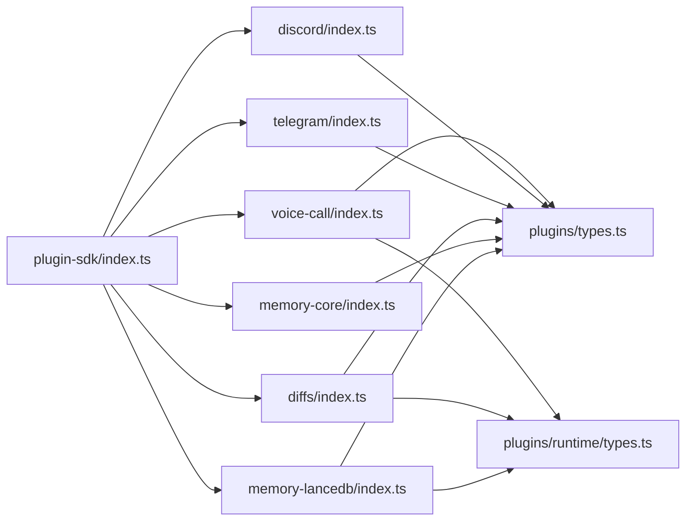

# 插件开发指南

<cite>
**本文档引用的文件**
- [src/plugin-sdk/index.ts](file://src/plugin-sdk/index.ts)
- [docs/plugins/manifest.md](file://docs/plugins/manifest.md)
- [docs/tools/plugin.md](file://docs/tools/plugin.md)
- [src/plugins/types.ts](file://src/plugins/types.ts)
- [src/plugins/runtime/types.ts](file://src/plugins/runtime/types.ts)
- [extensions/voice-call/index.ts](file://extensions/voice-call/index.ts)
- [extensions/discord/index.ts](file://extensions/discord/index.ts)
- [extensions/telegram/index.ts](file://extensions/telegram/index.ts)
- [extensions/diffs/index.ts](file://extensions/diffs/index.ts)
- [extensions/memory-core/index.ts](file://extensions/memory-core/index.ts)
- [extensions/memory-lancedb/index.ts](file://extensions/memory-lancedb/index.ts)
</cite>

## 目录

1. [简介](#简介)
2. [项目结构](#项目结构)
3. [核心组件](#核心组件)
4. [架构总览](#架构总览)
5. [详细组件分析](#详细组件分析)
6. [依赖关系分析](#依赖关系分析)
7. [性能考虑](#性能考虑)
8. [故障排查指南](#故障排查指南)
9. [结论](#结论)
10. [附录](#附录)

## 简介

本指南面向希望在 OpenClaw 中开发插件的开发者，系统阐述插件架构设计原则、开发模式与最佳实践，覆盖插件接口定义、生命周期管理、事件处理机制、HTTP 路由与网关 RPC、工具与技能注册、以及与核心系统的交互与数据流。文档同时提供多种类型插件（通道适配器、工具插件、技能插件、上下文引擎）的实现参考路径，并给出常见问题、性能优化与调试方法。

## 项目结构

OpenClaw 的插件体系由“插件 SDK 导出层 + 官方扩展集合 + 用户自定义扩展”构成：

- 插件 SDK：通过统一入口导出各类适配器、类型与运行时能力，供插件作者按需引入。
- 官方扩展：位于 extensions 目录，包含通道插件（如 Discord、Telegram）、工具插件（如 Voice Call、Diffs）、内存插件（memory-core、memory-lancedb）等。
- 用户扩展：支持工作区与全局目录加载，遵循清单与配置校验规则。

图表来源

- [src/plugin-sdk/index.ts](file://src/plugin-sdk/index.ts)
- [extensions/voice-call/index.ts](file://extensions/voice-call/index.ts)
- [extensions/discord/index.ts](file://extensions/discord/index.ts)
- [extensions/telegram/index.ts](file://extensions/telegram/index.ts)
- [extensions/diffs/index.ts](file://extensions/diffs/index.ts)
- [extensions/memory-core/index.ts](file://extensions/memory-core/index.ts)
- [extensions/memory-lancedb/index.ts](file://extensions/memory-lancedb/index.ts)
- [src/plugins/types.ts](file://src/plugins/types.ts)
- [src/plugins/runtime/types.ts](file://src/plugins/runtime/types.ts)

章节来源

- [src/plugin-sdk/index.ts](file://src/plugin-sdk/index.ts)
- [docs/tools/plugin.md](file://docs/tools/plugin.md)

## 核心组件

- 插件 API（OpenClawPluginApi）
  - 提供注册工具、命令、HTTP 路由、网关 RPC 方法、CLI 子命令、服务、上下文引擎、通道插件、提供商认证等能力。
  - 支持生命周期钩子（before_model_resolve、before_prompt_build、agent_end 等）以参与提示构建与会话编排。
- 插件类型与配置
  - OpenClawPluginConfigSchema：内置 JSON Schema 校验与 UI 提示字段。
  - OpenClawPluginDefinition：插件元信息与生命周期回调（register/activate）。
- 运行时能力
  - PluginRuntime：提供子代理运行、等待、会话消息查询与删除，以及通道相关能力。
- 清单与发现
  - openclaw.plugin.json：每个插件根目录必须存在，用于严格配置校验与发现。

章节来源

- [src/plugins/types.ts](file://src/plugins/types.ts)
- [src/plugins/runtime/types.ts](file://src/plugins/runtime/types.ts)
- [docs/plugins/manifest.md](file://docs/plugins/manifest.md)

## 架构总览

OpenClaw 插件通过“清单 + 类型约束 + 运行时钩子”的方式与核心系统解耦协作：

- 发现与加载：按优先级扫描配置路径、工作区、全局与内置扩展，读取 openclaw.plugin.json 并进行安全检查。
- 配置校验：使用插件清单中的 JSON Schema 在不执行代码的前提下完成校验。
- 注册阶段：插件在 register 回调中向 API 注册能力；随后由核心系统在运行期调度。
- 生命周期：通过钩子介入模型解析、提示构建、工具调用、会话编排、网关启停等关键节点。

图表来源

- [docs/tools/plugin.md](file://docs/tools/plugin.md)
- [docs/plugins/manifest.md](file://docs/plugins/manifest.md)
- [src/plugins/types.ts](file://src/plugins/types.ts)

## 详细组件分析

### 通道适配器插件（Discord、Telegram）

通道适配器负责将外部消息平台接入 OpenClaw，实现账户解析、消息收发、线程与提及策略、状态诊断等功能。

- 设计要点
  - 使用 ChannelPlugin 接口注册配置、能力、出站发送等适配器。
  - 通过 api.registerChannel({ plugin }) 完成注册。
  - 可选实现 onboarding、security、gateway、mentions、threading、streaming 等适配器。
- 实现参考
  - Discord 通道插件：[extensions/discord/index.ts](file://extensions/discord/index.ts)
  - Telegram 通道插件：[extensions/telegram/index.ts](file://extensions/telegram/index.ts)

图表来源

- [extensions/discord/index.ts](file://extensions/discord/index.ts)
- [extensions/telegram/index.ts](file://extensions/telegram/index.ts)
- [src/plugins/types.ts](file://src/plugins/types.ts)

章节来源

- [extensions/discord/index.ts](file://extensions/discord/index.ts)
- [extensions/telegram/index.ts](file://extensions/telegram/index.ts)
- [docs/tools/plugin.md](file://docs/tools/plugin.md)

### 工具插件（Diffs）

工具插件为代理提供只读能力，例如渲染差异文件为图片或 PDF，并通过 HTTP 路由对外提供访问。

- 设计要点
  - 注册工具：api.registerTool(...)。
  - 暴露 HTTP 路由：api.registerHttpRoute(...)，结合安全策略控制访问。
  - 通过 api.on(...) 注入系统提示，引导代理正确使用工具。
- 实现参考
  - Diffs 插件：[extensions/diffs/index.ts](file://extensions/diffs/index.ts)

图表来源

- [extensions/diffs/index.ts](file://extensions/diffs/index.ts)
- [src/plugins/types.ts](file://src/plugins/types.ts)

章节来源

- [extensions/diffs/index.ts](file://extensions/diffs/index.ts)
- [src/plugins/types.ts](file://src/plugins/types.ts)

### 技能插件（Voice Call）

技能插件通过网关 RPC 方法与工具暴露语音通话能力，支持 Twilio/Telnyx/Plivo 等提供商。

- 设计要点
  - 网关 RPC：api.registerGatewayMethod(...) 注册远程调用。
  - 工具：api.registerTool(...) 暴露语音通话工具。
  - CLI：api.registerCli(...) 注册命令行子命令。
  - 服务：api.registerService(...) 启动/停止后台服务。
  - 配置校验：使用 JSON Schema 与 UI 提示完善表单体验。
- 实现参考
  - Voice Call 插件：[extensions/voice-call/index.ts](file://extensions/voice-call/index.ts)

图表来源

- [extensions/voice-call/index.ts](file://extensions/voice-call/index.ts)
- [src/plugins/types.ts](file://src/plugins/types.ts)

章节来源

- [extensions/voice-call/index.ts](file://extensions/voice-call/index.ts)
- [src/plugins/types.ts](file://src/plugins/types.ts)

### 内存插件（memory-core、memory-lancedb）

内存插件提供长期记忆能力，支持搜索、存储与遗忘操作，并可自动召回与捕获对话内容。

- memory-core
  - 基于文件的内存搜索与获取工具，配合 CLI 使用。
  - 实现参考：[extensions/memory-core/index.ts](file://extensions/memory-core/index.ts)
- memory-lancedb
  - 基于 LanceDB 的向量检索与 OpenAI 嵌入，具备自动召回与自动捕获能力。
  - 实现参考：[extensions/memory-lancedb/index.ts](file://extensions/memory-lancedb/index.ts)

图表来源

- [extensions/memory-lancedb/index.ts](file://extensions/memory-lancedb/index.ts)
- [src/plugins/types.ts](file://src/plugins/types.ts)

章节来源

- [extensions/memory-core/index.ts](file://extensions/memory-core/index.ts)
- [extensions/memory-lancedb/index.ts](file://extensions/memory-lancedb/index.ts)
- [src/plugins/types.ts](file://src/plugins/types.ts)

## 依赖关系分析

- 插件 SDK 作为统一入口，导出类型、适配器与运行时工具，避免插件直接依赖核心内部细节。
- 官方扩展通过 SDK 子路径导入特定平台能力（如 discord、telegram），提升模块化程度。
- 插件与核心通过 OpenClawPluginApi 解耦：插件仅在注册阶段声明能力，运行期由核心调度。

图表来源

- [src/plugin-sdk/index.ts](file://src/plugin-sdk/index.ts)
- [extensions/voice-call/index.ts](file://extensions/voice-call/index.ts)
- [extensions/discord/index.ts](file://extensions/discord/index.ts)
- [extensions/telegram/index.ts](file://extensions/telegram/index.ts)
- [extensions/diffs/index.ts](file://extensions/diffs/index.ts)
- [extensions/memory-core/index.ts](file://extensions/memory-core/index.ts)
- [extensions/memory-lancedb/index.ts](file://extensions/memory-lancedb/index.ts)
- [src/plugins/types.ts](file://src/plugins/types.ts)
- [src/plugins/runtime/types.ts](file://src/plugins/runtime/types.ts)

章节来源

- [src/plugin-sdk/index.ts](file://src/plugin-sdk/index.ts)
- [src/plugins/types.ts](file://src/plugins/types.ts)
- [src/plugins/runtime/types.ts](file://src/plugins/runtime/types.ts)

## 性能考虑

- 配置校验与发现缓存
  - 插件发现与清单元数据使用短时进程内缓存，减少启动/重载抖动。
  - 可通过环境变量禁用缓存或调整缓存窗口，便于调试与压测。
- 运行时并发与幂等
  - 子代理运行与等待采用异步队列与幂等键，避免重复执行。
- I/O 与网络
  - HTTP 路由与 Webhook 处理建议限制请求体大小、速率与异常计数，防止资源滥用。
- 数据序列化
  - 向量等大对象在跨边界传递前进行清理，避免不可克隆结构导致的性能与稳定性问题。

章节来源

- [docs/tools/plugin.md](file://docs/tools/plugin.md)
- [src/plugins/runtime/types.ts](file://src/plugins/runtime/types.ts)
- [extensions/memory-lancedb/index.ts](file://extensions/memory-lancedb/index.ts)

## 故障排查指南

- 清单与配置错误
  - 缺失或非法 openclaw.plugin.json 将阻断配置验证；请确保清单字段完整且 JSON Schema 有效。
- 插件冲突与覆盖
  - 同一 ID 的多个插件以发现顺序为准，低优先级副本被忽略；若出现行为异常，检查加载顺序与来源。
- HTTP 路由冲突
  - exact 与 prefix 路由在同一 auth 下重叠将被拒绝；确保路由链路清晰且互不冲突。
- 钩子权限与注入
  - 操作员可针对插件禁用提示注入类钩子；若发现提示未生效，请检查配置项与钩子优先级。
- 记忆插件异常
  - LanceDB 加载失败或平台原生绑定缺失会导致初始化报错；请确认依赖安装与平台兼容性。

章节来源

- [docs/plugins/manifest.md](file://docs/plugins/manifest.md)
- [docs/tools/plugin.md](file://docs/tools/plugin.md)
- [extensions/memory-lancedb/index.ts](file://extensions/memory-lancedb/index.ts)

## 结论

OpenClaw 的插件体系以“清单 + 类型 + 钩子 + 运行时”为核心，既保证了扩展能力的强约束与高安全性，又提供了灵活的注册与调度机制。通过通道适配器、工具与技能插件、上下文引擎与内存插件等不同类型的实现，开发者可以快速构建从消息平台接入到智能代理增强的完整能力闭环。建议在开发过程中严格遵循清单与配置校验规范，合理使用钩子与运行时能力，并关注性能与安全最佳实践。

## 附录

- 快速上手
  - 列出已加载插件：openclaw plugins list
  - 安装官方插件：openclaw plugins install @openclaw/voice-call
  - 更新与启用：openclaw plugins update <id>、openclaw plugins enable <id>
- 插件清单字段与 JSON Schema 要求
  - 必填：id、configSchema
  - 可选：kind、channels、providers、skills、name、description、uiHints、version
  - 验证规则：未知 channels 键与插件 id 视为错误；禁用插件保留配置并发出警告
- 插件 API 能力概览
  - registerTool、registerCommand、registerHttpRoute、registerGatewayMethod、registerCli、registerService、registerContextEngine、registerChannel、registerHook、on

章节来源

- [docs/tools/plugin.md](file://docs/tools/plugin.md)
- [docs/plugins/manifest.md](file://docs/plugins/manifest.md)
