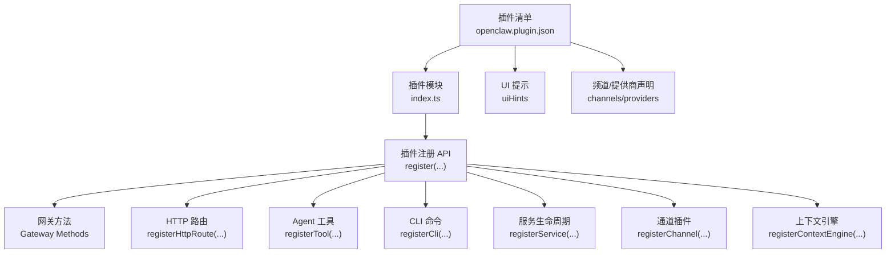
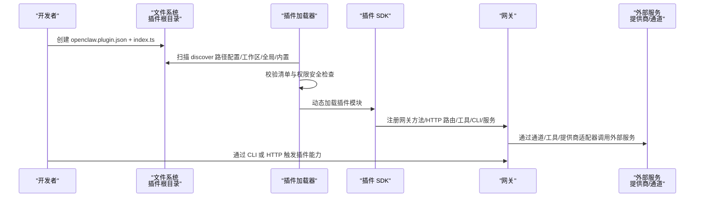
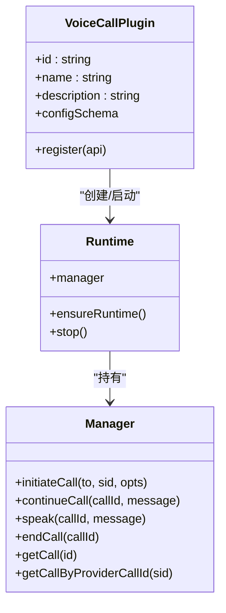
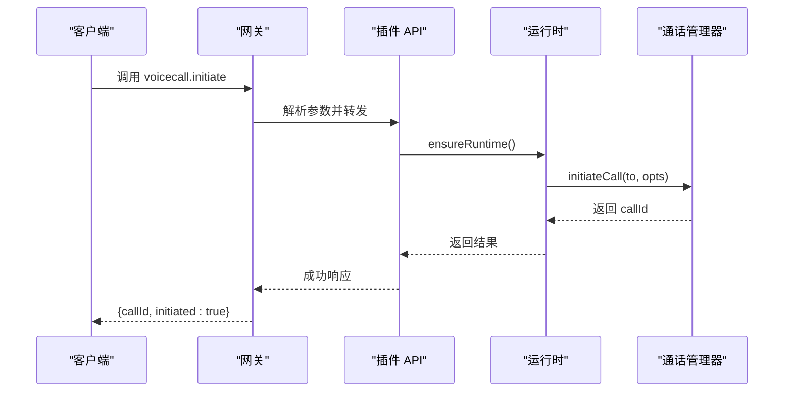
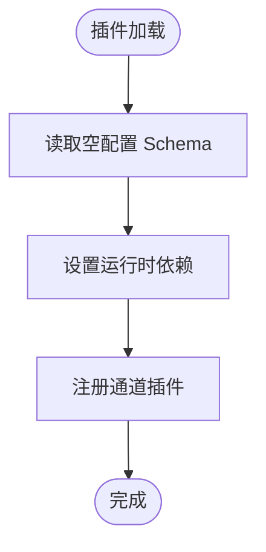
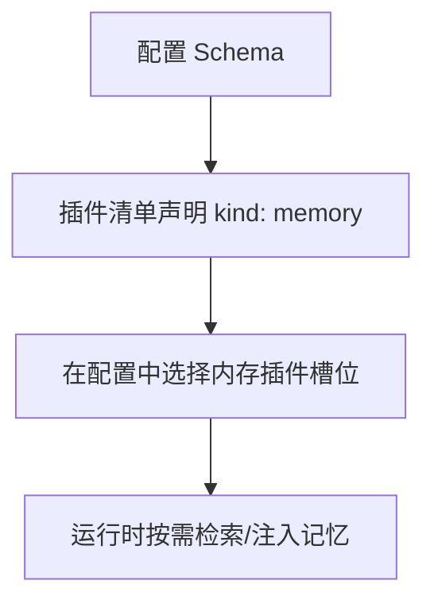

# 插件开发流程

<cite>
**本文引用的文件**
- [README.md](file://README.md)
- [docs/start/openclaw.md](file://docs/start/openclaw.md)
- [docs/plugins/manifest.md](file://docs/plugins/manifest.md)
- [docs/tools/plugin.md](file://docs/tools/plugin.md)
- [extensions/voice-call/openclaw.plugin.json](file://extensions/voice-call/openclaw.plugin.json)
- [extensions/voice-call/index.ts](file://extensions/voice-call/index.ts)
- [extensions/discord/openclaw.plugin.json](file://extensions/discord/openclaw.plugin.json)
- [extensions/discord/index.ts](file://extensions/discord/index.ts)
- [extensions/memory-lancedb/openclaw.plugin.json](file://extensions/memory-lancedb/openclaw.plugin.json)
- [src/plugin-sdk/index.ts](file://src/plugin-sdk/index.ts)
</cite>

## 目录

1. [简介](#简介)
2. [项目结构](#项目结构)
3. [核心组件](#核心组件)
4. [架构总览](#架构总览)
5. [详细组件分析](#详细组件分析)
6. [依赖关系分析](#依赖关系分析)
7. [性能考虑](#性能考虑)
8. [故障排查指南](#故障排查指南)
9. [结论](#结论)
10. [附录](#附录)

## 简介

本指南面向希望在 OpenClaw 平台上开发插件（扩展）的开发者，覆盖从项目初始化、代码编写、本地测试与调试、到打包构建与发布的完整工作流程。文档结合仓库中现有的官方插件示例（如语音通话、Discord 频道、LanceDB 内存插件），并基于插件系统规范与 Manifest 要求，提供可操作的最佳实践与常见问题解决方案。

## 项目结构

OpenClaw 的插件生态由“插件清单（Manifest）+ 插件模块（TypeScript）+ 可选技能目录”构成，插件通过 Manifest 提供严格配置校验，运行时通过 SDK 注册方法、HTTP 路由、工具、CLI 命令等能力扩展平台功能。

图示来源

- [docs/tools/plugin.md](file://docs/tools/plugin.md)
- [docs/plugins/manifest.md](file://docs/plugins/manifest.md)

章节来源

- [docs/tools/plugin.md](file://docs/tools/plugin.md)
- [docs/plugins/manifest.md](file://docs/plugins/manifest.md)

## 核心组件

- 插件清单（Manifest）
  - 必须位于插件根目录，包含 id、configSchema 等字段；可选 kind、channels、providers、skills、uiHints、version 等。
  - 清单用于在不执行插件代码的前提下进行配置校验，缺失或无效将阻断加载。
- 插件模块（index.ts）
  - 导出函数或对象，使用 SDK 注册各类能力：网关方法、HTTP 路由、工具、CLI、服务、通道、上下文引擎等。
- SDK（src/plugin-sdk/index.ts）
  - 暴露统一的插件 API 类型与工具函数，包括注册方法、通道适配器、状态辅助、Webhook 辅助、SSRF 保护、日志等。
- 示例插件
  - 语音通话插件：展示复杂配置、运行时启动/停止、工具与网关方法、CLI、服务等全栈能力。
  - Discord 通道插件：最小化通道插件示例，演示如何注册通道与运行时依赖。
  - LanceDB 内存插件：展示“kind: memory”的专属插槽选择与配置 schema。

章节来源

- [docs/plugins/manifest.md](file://docs/plugins/manifest.md)
- [docs/tools/plugin.md](file://docs/tools/plugin.md)
- [src/plugin-sdk/index.ts](file://src/plugin-sdk/index.ts)
- [extensions/voice-call/openclaw.plugin.json](file://extensions/voice-call/openclaw.plugin.json)
- [extensions/voice-call/index.ts](file://extensions/voice-call/index.ts)
- [extensions/discord/openclaw.plugin.json](file://extensions/discord/openclaw.plugin.json)
- [extensions/discord/index.ts](file://extensions/discord/index.ts)
- [extensions/memory-lancedb/openclaw.plugin.json](file://extensions/memory-lancedb/openclaw.plugin.json)

## 架构总览

下图展示了插件在 OpenClaw 中的发现、加载与运行时交互路径：

图示来源

- [docs/tools/plugin.md](file://docs/tools/plugin.md)
- [docs/plugins/manifest.md](file://docs/plugins/manifest.md)

章节来源

- [docs/tools/plugin.md](file://docs/tools/plugin.md)
- [docs/plugins/manifest.md](file://docs/plugins/manifest.md)

## 详细组件分析

### 组件 A：语音通话插件（Voice Call）

该插件是典型的“全功能插件”，涵盖配置解析、运行时生命周期、工具与网关方法、CLI、服务与通道集成。

图示来源

- [extensions/voice-call/index.ts](file://extensions/voice-call/index.ts)

章节来源

- [extensions/voice-call/index.ts](file://extensions/voice-call/index.ts)
- [extensions/voice-call/openclaw.plugin.json](file://extensions/voice-call/openclaw.plugin.json)

#### 关键流程：网关方法调用序列

图示来源

- [extensions/voice-call/index.ts](file://extensions/voice-call/index.ts)

章节来源

- [extensions/voice-call/index.ts](file://extensions/voice-call/index.ts)

### 组件 B：Discord 通道插件

该插件以最小化方式注册一个“通道插件”，演示通道元数据、能力声明、账户解析与注册流程。

图示来源

- [extensions/discord/index.ts](file://extensions/discord/index.ts)
- [extensions/discord/openclaw.plugin.json](file://extensions/discord/openclaw.plugin.json)

章节来源

- [extensions/discord/index.ts](file://extensions/discord/index.ts)
- [extensions/discord/openclaw.plugin.json](file://extensions/discord/openclaw.plugin.json)

### 组件 C：LanceDB 内存插件

该插件展示了“kind: memory”的专属插槽选择与配置 schema，强调嵌入模型、数据库路径、自动捕获/召回等能力。

图示来源

- [extensions/memory-lancedb/openclaw.plugin.json](file://extensions/memory-lancedb/openclaw.plugin.json)

章节来源

- [extensions/memory-lancedb/openclaw.plugin.json](file://extensions/memory-lancedb/openclaw.plugin.json)

### 组件 D：插件 SDK（核心 API）

SDK 提供统一的插件 API 类型与工具，包括：

- 注册类：registerGatewayMethod、registerHttpRoute、registerTool、registerCli、registerService、registerChannel、registerContextEngine
- 通道适配器与工具：消息动作、线程、目录、分组、提及、心跳、安全策略等
- Webhook 与安全：路径规范化、请求守卫、限流与异常追踪
- 日志、临时文件、SSRF 保护、时间与时区处理等基础设施

章节来源

- [src/plugin-sdk/index.ts](file://src/plugin-sdk/index.ts)

## 依赖关系分析

- 插件发现顺序与优先级
  - 配置路径 → 工作区扩展 → 全局扩展 → 内置扩展
  - 同名插件以首次匹配为准，低优先级被忽略
- 安全与信任
  - 对非内置插件进行安全检查（路径合法性、权限、所有权）
  - 支持白名单/黑名单与安装跟踪
- 运行时依赖
  - 插件通过 SDK 获取核心运行时能力（TTS/STT、日志、Webhook、通道适配器等）

图示来源

- [docs/tools/plugin.md](file://docs/tools/plugin.md)

章节来源

- [docs/tools/plugin.md](file://docs/tools/plugin.md)

## 性能考虑

- 缓存与预热
  - 插件发现与清单元数据有短时缓存，可通过环境变量禁用或调整缓存窗口
- 并发与限流
  - Webhook 请求体大小限制、速率限制与异常计数器，避免过载
- 资源释放
  - 服务注册的 stop 生命周期应正确释放端口、进程与连接，防止资源泄漏
- 配置校验前置
  - 利用 Manifest 的 JSON Schema 在加载阶段尽早失败，减少运行时开销

章节来源

- [docs/tools/plugin.md](file://docs/tools/plugin.md)

## 故障排查指南

- Manifest/Schema 错误
  - 缺失或格式错误的 openclaw.plugin.json 会导致加载失败；确保 id、configSchema 存在且合法
- 配置未生效
  - 配置变更需要重启网关；确认 plugins.entries.<id>.enabled 与 slots 正确
- 权限与安全
  - 非内置插件若存在世界可写、路径越界或可疑所有权，会被拒绝加载
- Webhook 与网络
  - 使用 SDK 的 Webhook 路径规范化与请求守卫，检查绑定地址、路径与签名验证
- 通道与提供商
  - 通道插件需正确声明 channels._ 与 providers._，否则 Doctor 会报告未知键

章节来源

- [docs/plugins/manifest.md](file://docs/plugins/manifest.md)
- [docs/tools/plugin.md](file://docs/tools/plugin.md)

## 结论

OpenClaw 的插件体系以 Manifest 为入口、以 SDK 为核心，提供了从配置校验、能力注册到运行时生命周期的完整闭环。遵循本文流程与最佳实践，开发者可以快速构建高质量、可维护、可测试且安全的插件，并顺利进入发布与运维阶段。

## 附录

### A. 插件开发工作流（从零到上线）

- 初始化
  - 新建目录，创建 openclaw.plugin.json（至少包含 id、configSchema）
  - 编写 index.ts，导出插件注册逻辑
- 编写与本地测试
  - 使用 SDK 注册所需能力（方法/路由/工具/CLI/服务/通道/上下文引擎）
  - 在本地工作区或全局扩展目录放置插件，使用 openclaw plugins doctor 检查清单与依赖
- 调试与验证
  - 通过 openclaw plugins list/info 验证加载状态
  - 使用 openclaw plugins enable/disable 控制启用状态
  - 通过 openclaw plugins doctor 查看诊断信息
- 打包与发布
  - 将插件作为 npm 包发布，或打包为本地 zip/tgz 供 install 使用
  - 若包含原生依赖，需在 Manifest 中注明构建要求
- 版本管理与兼容性
  - 在 Manifest 中声明 version；通过 plugins.slots 与 kind 管理兼容性
  - 使用 plugins.allow/plugins.deny 控制可信范围
- 质量保证
  - 为插件提供 uiHints，提升控制面板体验
  - 为 CLI 命令提供帮助信息；为 HTTP 路由添加鉴权与路径匹配策略
  - 为通道插件提供 onboarding 与 status 适配器，完善向导与健康检查

章节来源

- [docs/tools/plugin.md](file://docs/tools/plugin.md)
- [docs/plugins/manifest.md](file://docs/plugins/manifest.md)
