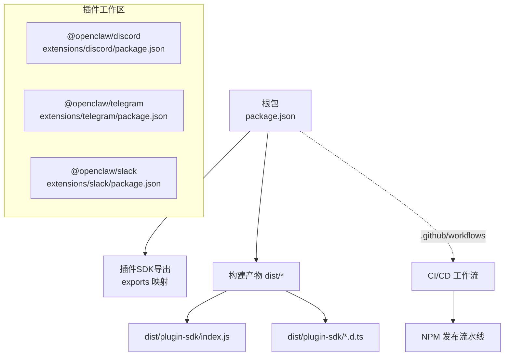
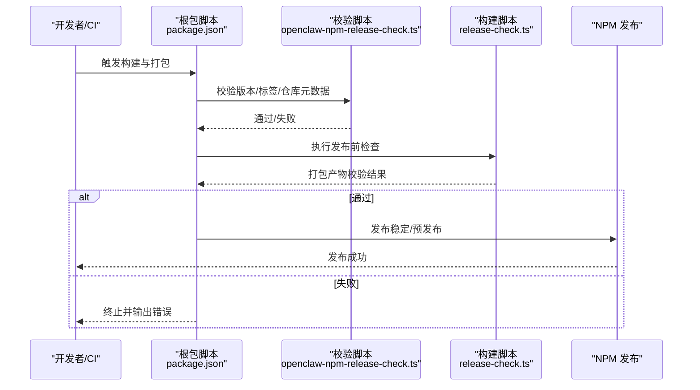
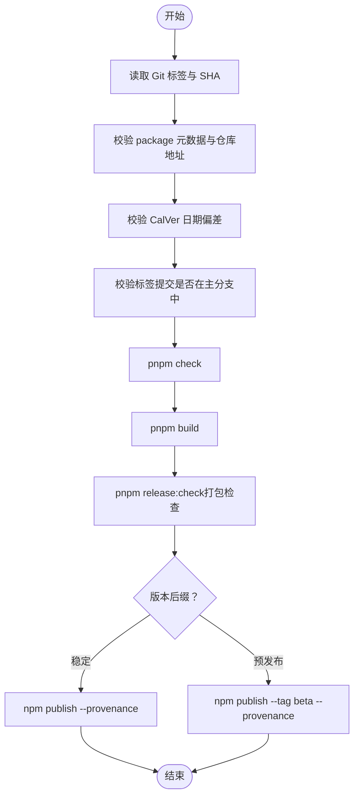
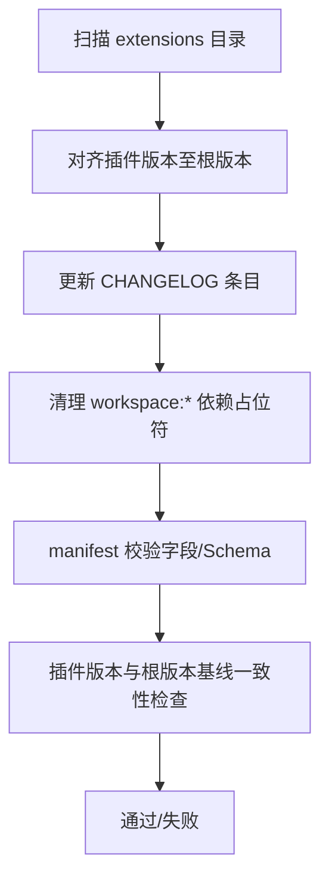
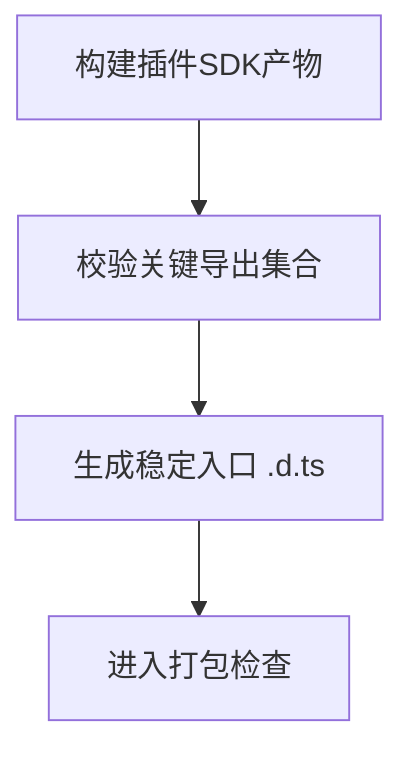
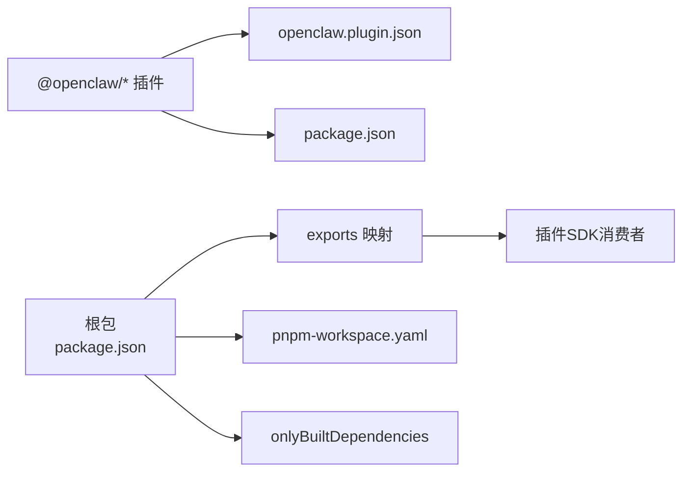

# 插件打包与部署

<cite>
**本文引用的文件**
- [package.json](file://package.json)
- [pnpm-workspace.yaml](file://pnpm-workspace.yaml)
- [openclaw-npm-release.yml](file://.github/workflows/openclaw-npm-release.yml)
- [openclaw-npm-release-check.ts](file://scripts/openclaw-npm-release-check.ts)
- [release-check.ts](file://scripts/release-check.ts)
- [sync-plugin-versions.ts](file://scripts/sync-plugin-versions.ts)
- [write-plugin-sdk-entry-dts.ts](file://scripts/write-plugin-sdk-entry-dts.ts)
- [discord/openclaw.plugin.json](file://extensions/discord/openclaw.plugin.json)
- [discord/package.json](file://extensions/discord/package.json)
- [manifest.md](file://docs/plugins/manifest.md)
- [src/plugin-sdk/index.ts](file://src/plugin-sdk/index.ts)
</cite>

## 目录

1. [简介](#简介)
2. [项目结构](#项目结构)
3. [核心组件](#核心组件)
4. [架构总览](#架构总览)
5. [详细组件分析](#详细组件分析)
6. [依赖关系分析](#依赖关系分析)
7. [性能考量](#性能考量)
8. [故障排查指南](#故障排查指南)
9. [结论](#结论)
10. [附录](#附录)

## 简介

本指南面向OpenClaw插件开发者与发布工程师，系统阐述插件从开发到发布的完整流程：构建、打包、版本与发布、签名与校验、依赖与兼容性检查、CI/CD集成与自动化发布管道，以及插件市场发布与文档支持准备。内容基于仓库中的实际脚本、工作流与规范文件，确保可执行、可追溯。

## 项目结构

OpenClaw采用多包工作区（pnpm workspace）组织，核心包为根目录下的主应用与CLI，插件以独立子包形式分布在extensions目录下，每个插件包含独立的package.json与openclaw.plugin.json清单文件。根package.json定义统一的构建、打包与发布脚本，并通过exports导出插件SDK子路径，供插件消费。

图表来源

- [package.json:37-216](file://package.json#L37-L216)
- [pnpm-workspace.yaml:1-18](file://pnpm-workspace.yaml#L1-L18)

章节来源

- [package.json:1-465](file://package.json#L1-L465)
- [pnpm-workspace.yaml:1-18](file://pnpm-workspace.yaml#L1-L18)

## 核心组件

- 构建与打包
  - 根package.json提供统一构建脚本，覆盖TSDown编译、插件SDK声明生成、入口别名写入、Canvas A2UI资源打包等。
  - 插件SDK类型声明通过write-plugin-sdk-entry-dts.ts生成稳定入口，确保exports映射一致。
- 版本与发布
  - openclaw-npm-release.yml触发NPM发布，配合openclaw-npm-release-check.ts进行版本格式、标签与仓库元数据校验；release-check.ts在发布前对打包内容、插件版本同步、Sparkle版本约束与SDK导出完整性进行严格检查。
- 插件清单与规范
  - 每个插件必须提供openclaw.plugin.json清单，内含id与configSchema等关键字段；manifest.md给出清单字段与校验行为说明。
- 插件SDK
  - src/plugin-sdk/index.ts导出插件运行时API与工具函数，是插件实现能力的基础。

章节来源

- [package.json:217-339](file://package.json#L217-L339)
- [write-plugin-sdk-entry-dts.ts:1-61](file://scripts/write-plugin-sdk-entry-dts.ts#L1-L61)
- [openclaw-npm-release.yml:1-80](file://.github/workflows/openclaw-npm-release.yml#L1-L80)
- [openclaw-npm-release-check.ts:1-252](file://scripts/openclaw-npm-release-check.ts#L1-L252)
- [release-check.ts:1-451](file://scripts/release-check.ts#L1-L451)
- [manifest.md:1-76](file://docs/plugins/manifest.md#L1-L76)
- [src/plugin-sdk/index.ts:1-826](file://src/plugin-sdk/index.ts#L1-L826)

## 架构总览

下图展示OpenClaw插件打包与发布的关键流程：本地或CI执行构建与校验，随后根据标签与版本策略决定发布渠道（稳定/预发布），并最终完成NPM发布与产物校验。

图表来源

- [openclaw-npm-release.yml:16-80](file://.github/workflows/openclaw-npm-release.yml#L16-L80)
- [openclaw-npm-release-check.ts:116-213](file://scripts/openclaw-npm-release-check.ts#L116-L213)
- [release-check.ts:407-446](file://scripts/release-check.ts#L407-L446)

## 详细组件分析

### 组件A：NPM发布工作流与校验

- 触发条件：推送以“v”开头的Git标签。
- 关键步骤：
  - 设置Node与pnpm环境。
  - 校验发布标签与package元数据一致性、CalVer日期偏差范围。
  - 确保版本未被提前发布。
  - 运行整体质量检查与构建。
  - 执行发布前打包检查（文件集、禁止项、Sparkle版本约束）。
  - 根据版本后缀选择发布通道（稳定或beta），启用provenance。
- 质量保障：
  - 版本格式严格遵循YYYY.M.D或YYYY.M.D-beta.N。
  - 与主分支祖先关系校验，防止非主干提交发布。
  - 打包产物白名单与黑名单双重校验，避免遗漏或误打包。

图表来源

- [openclaw-npm-release.yml:16-80](file://.github/workflows/openclaw-npm-release.yml#L16-L80)
- [openclaw-npm-release-check.ts:147-213](file://scripts/openclaw-npm-release-check.ts#L147-L213)
- [release-check.ts:407-446](file://scripts/release-check.ts#L407-L446)

章节来源

- [openclaw-npm-release.yml:1-80](file://.github/workflows/openclaw-npm-release.yml#L1-L80)
- [openclaw-npm-release-check.ts:1-252](file://scripts/openclaw-npm-release-check.ts#L1-L252)
- [release-check.ts:1-451](file://scripts/release-check.ts#L1-L451)

### 组件B：插件版本同步与清单校验

- 插件版本同步：
  - sync-plugin-versions.ts扫描extensions目录，将插件版本与根版本对齐，自动更新CHANGELOG并在必要时清理workspace依赖占位符。
- 清单与清单校验：
  - manifest.md要求每个插件提供openclaw.plugin.json，包含id与configSchema等字段；未知channels键或未知插件id将被视为错误。
  - release-check.ts在发布前强制检查所有插件版本与根版本基线一致，避免版本漂移导致的运行时问题。

图表来源

- [sync-plugin-versions.ts:41-101](file://scripts/sync-plugin-versions.ts#L41-L101)
- [manifest.md:18-76](file://docs/plugins/manifest.md#L18-L76)
- [release-check.ts:221-267](file://scripts/release-check.ts#L221-L267)

章节来源

- [sync-plugin-versions.ts:1-109](file://scripts/sync-plugin-versions.ts#L1-L109)
- [manifest.md:1-76](file://docs/plugins/manifest.md#L1-L76)
- [release-check.ts:1-451](file://scripts/release-check.ts#L1-L451)

### 组件C：插件SDK导出与类型声明

- SDK导出完整性：
  - release-check.ts对dist/plugin-sdk/index.js导出集合进行白名单校验，缺失任一关键导出会阻断发布，确保插件运行时可用。
- 类型声明稳定性：
  - write-plugin-sdk-entry-dts.ts生成稳定入口.d.ts，使exports映射与TS类型解析保持一致，避免消费者侧类型不匹配。

图表来源

- [release-check.ts:372-405](file://scripts/release-check.ts#L372-L405)
- [write-plugin-sdk-entry-dts.ts:9-60](file://scripts/write-plugin-sdk-entry-dts.ts#L9-L60)

章节来源

- [release-check.ts:346-405](file://scripts/release-check.ts#L346-L405)
- [write-plugin-sdk-entry-dts.ts:1-61](file://scripts/write-plugin-sdk-entry-dts.ts#L1-L61)
- [src/plugin-sdk/index.ts:1-826](file://src/plugin-sdk/index.ts#L1-L826)

### 组件D：插件清单与示例

- 清单字段与Schema：
  - 必填：id、configSchema。
  - 可选：kind、channels、providers、skills、name、description、uiHints、version。
  - 校验规则：未知channels键为错误；未知插件id为错误；禁用状态下的配置会保留但提示警告。
- 示例插件清单：
  - discord/openclaw.plugin.json展示了最小化清单结构，包含channels数组与空configSchema。

章节来源

- [manifest.md:18-76](file://docs/plugins/manifest.md#L18-L76)
- [discord/openclaw.plugin.json:1-10](file://extensions/discord/openclaw.plugin.json#L1-L10)

## 依赖关系分析

- 包管理与工作区
  - pnpm-workspace.yaml声明根与扩展包，onlyBuiltDependencies列出需要原生编译的依赖，确保发布产物可复现。
- 根包导出与插件SDK
  - package.json的exports为各插件SDK子路径提供稳定入口，release-check.ts进一步保证导出完整性。
- 插件清单与版本
  - 各插件的openclaw.plugin.json与package.json共同构成插件元数据，release-check.ts与sync-plugin-versions.ts确保二者一致性。

图表来源

- [package.json:37-216](file://package.json#L37-L216)
- [pnpm-workspace.yaml:7-17](file://pnpm-workspace.yaml#L7-L17)
- [discord/openclaw.plugin.json:1-10](file://extensions/discord/openclaw.plugin.json#L1-L10)
- [discord/package.json:1-12](file://extensions/discord/package.json#L1-L12)

章节来源

- [package.json:1-465](file://package.json#L1-L465)
- [pnpm-workspace.yaml:1-18](file://pnpm-workspace.yaml#L1-L18)
- [discord/openclaw.plugin.json:1-10](file://extensions/discord/openclaw.plugin.json#L1-L10)
- [discord/package.json:1-12](file://extensions/discord/package.json#L1-L12)

## 性能考量

- 构建阶段
  - 使用TSDown与声明生成脚本减少重复编译开销；仅在必要时重建原生依赖。
- 打包阶段
  - 通过release-check.ts的“打包检查”步骤，提前发现遗漏或多余文件，避免NPM包膨胀与安装时间增加。
- 发布阶段
  - 预发布通道（beta）允许先行验证，降低对稳定通道的影响。

## 故障排查指南

- 发布失败：版本已存在
  - 现象：NPM报错提示版本已发布。
  - 排查：确认package.json版本与标签一致，且未被提前发布。
  - 参考：openclaw-npm-release.yml第49–58行。
- 版本格式错误
  - 现象：openclaw-npm-release-check.ts输出版本格式或CalVer日期偏差错误。
  - 排查：修正package.json与标签格式为YYYY.M.D或YYYY.M.D-beta.N，确保日期偏差在阈值内。
  - 参考：openclaw-npm-release-check.ts第89–106、第188–196行。
- 打包产物缺失
  - 现象：release-check.ts报告缺失文件或包含禁止路径。
  - 排查：核对构建脚本是否生成dist与plugin-sdk产物，修正文件白名单/黑名单。
  - 参考：release-check.ts第417–443行。
- 插件版本不一致
  - 现象：release-check.ts提示插件版本与根版本基线不一致。
  - 排查：执行pnpm plugins:sync或手动同步，确保所有插件版本与根版本一致。
  - 参考：release-check.ts第221–267行、sync-plugin-versions.ts第41–101行。
- SDK导出缺失
  - 现象：release-check.ts报告关键导出缺失。
  - 排查：检查src/plugin-sdk/index.ts导出集合，补齐缺失项。
  - 参考：release-check.ts第372–405行。

章节来源

- [openclaw-npm-release.yml:49-58](file://.github/workflows/openclaw-npm-release.yml#L49-L58)
- [openclaw-npm-release-check.ts:89-106](file://scripts/openclaw-npm-release-check.ts#L89-L106)
- [release-check.ts:417-443](file://scripts/release-check.ts#L417-L443)
- [sync-plugin-versions.ts:41-101](file://scripts/sync-plugin-versions.ts#L41-L101)

## 结论

OpenClaw的插件打包与发布体系以严格的版本与清单规范为基础，结合CI/CD自动化与多层校验，确保发布质量与可追溯性。遵循本文流程，可高效完成插件从开发到市场的全生命周期管理。

## 附录

- 常用命令
  - 构建：pnpm build 或 pnpm build:docker
  - 发布前检查：pnpm release:check
  - NPM发布检查：pnpm release:openclaw:npm:check
  - 插件版本同步：pnpm plugins:sync
- 发布通道
  - 稳定版：直接发布至默认通道。
  - 预发布：带-beta后缀的版本发布至beta标签。
- 插件清单字段速查
  - 必填：id、configSchema
  - 可选：kind、channels、providers、skills、name、description、uiHints、version
  - 参考：manifest.md
