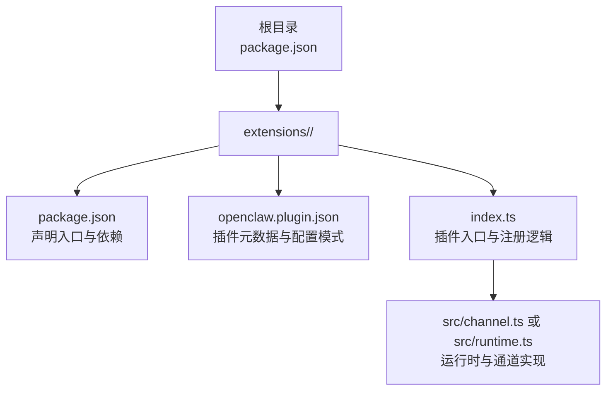
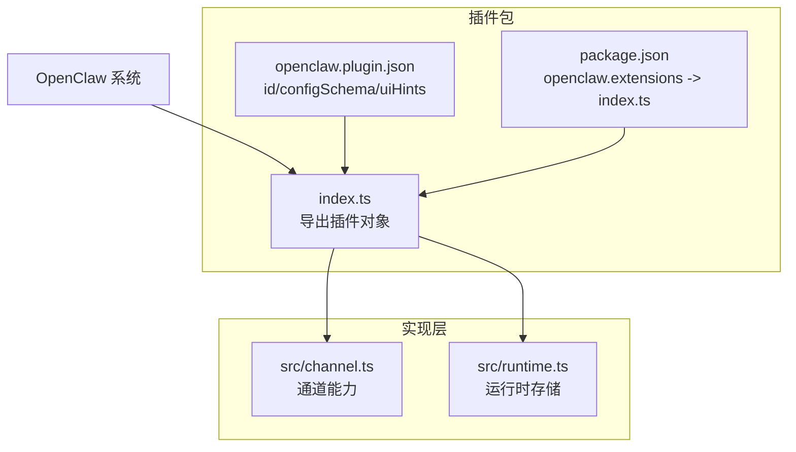
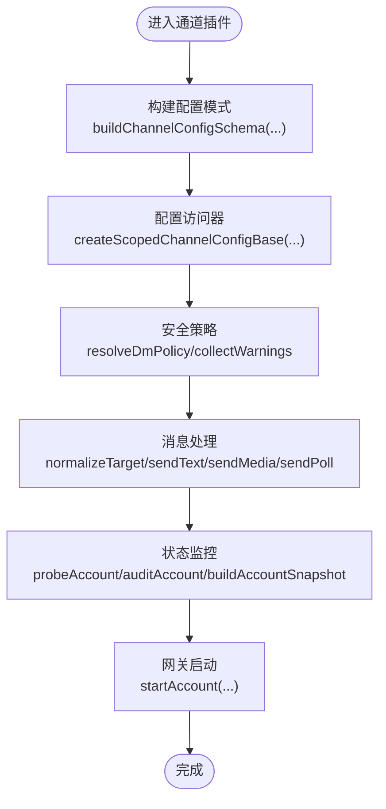
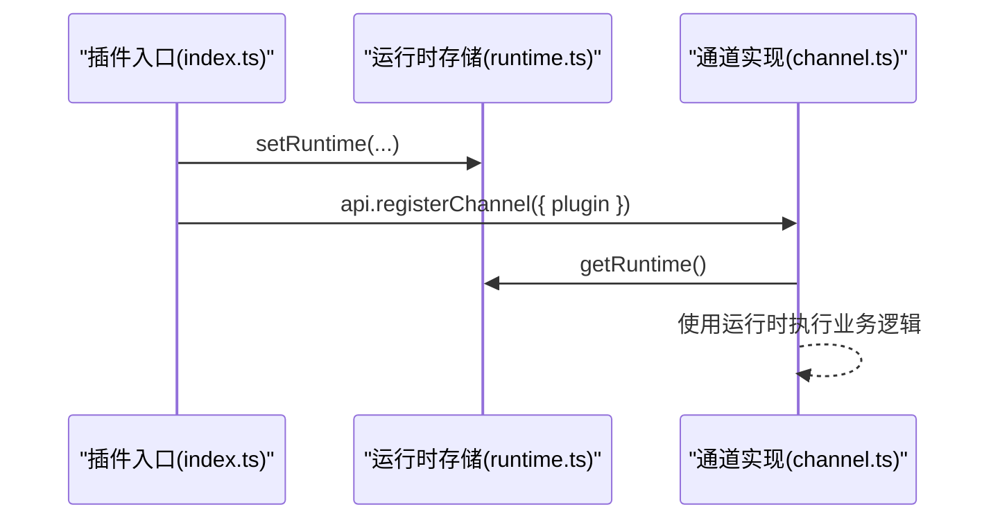
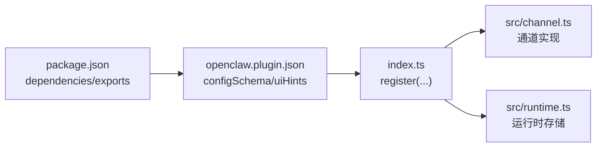

# 插件项目初始化

<cite>
**本文档引用的文件**
- [package.json](file://package.json)
- [extensions/acpx/package.json](file://extensions/acpx/package.json)
- [extensions/acpx/openclaw.plugin.json](file://extensions/acpx/openclaw.plugin.json)
- [extensions/acpx/index.ts](file://extensions/acpx/index.ts)
- [extensions/discord/package.json](file://extensions/discord/package.json)
- [extensions/discord/openclaw.plugin.json](file://extensions/discord/openclaw.plugin.json)
- [extensions/discord/index.ts](file://extensions/discord/index.ts)
- [extensions/discord/src/channel.ts](file://extensions/discord/src/channel.ts)
- [extensions/discord/src/runtime.ts](file://extensions/discord/src/runtime.ts)
- [extensions/telegram/package.json](file://extensions/telegram/package.json)
- [extensions/telegram/openclaw.plugin.json](file://extensions/telegram/openclaw.plugin.json)
- [extensions/telegram/src/channel.ts](file://extensions/telegram/src/channel.ts)
- [extensions/telegram/src/runtime.ts](file://extensions/telegram/src/runtime.ts)
</cite>

## 目录

1. [简介](#简介)
2. [项目结构](#项目结构)
3. [核心组件](#核心组件)
4. [架构总览](#架构总览)
5. [详细组件分析](#详细组件分析)
6. [依赖关系分析](#依赖关系分析)
7. [性能考虑](#性能考虑)
8. [故障排除指南](#故障排除指南)
9. [结论](#结论)
10. [附录](#附录)

## 简介

本指南面向希望在 OpenClaw 生态中创建新插件的开发者，提供从零开始搭建插件项目所需的完整流程与最佳实践。内容覆盖目录组织、必需文件配置、依赖管理、插件元数据、入口文件设置、类型定义以及构建配置等，并给出可直接复用的模板与示例路径，帮助你在发布前完成版本管理与准备。

## 项目结构

OpenClaw 的插件采用“扩展目录 + 包管理”的组织方式：每个插件位于 extensions/<your-plugin>/ 目录下，包含独立的 package.json、openclaw.plugin.json 和入口文件 index.ts。插件通过 package.json 中的 openclaw 字段声明入口模块，系统会自动加载该入口以注册插件能力。

图表来源

- [extensions/discord/package.json:1-12](file://extensions/discord/package.json#L1-L12)
- [extensions/discord/openclaw.plugin.json:1-10](file://extensions/discord/openclaw.plugin.json#L1-L10)
- [extensions/discord/index.ts:1-20](file://extensions/discord/index.ts#L1-L20)
- [extensions/discord/src/channel.ts:1-463](file://extensions/discord/src/channel.ts#L1-L463)
- [extensions/discord/src/runtime.ts:1-7](file://extensions/discord/src/runtime.ts#L1-L7)

章节来源

- [extensions/discord/package.json:1-12](file://extensions/discord/package.json#L1-L12)
- [extensions/discord/openclaw.plugin.json:1-10](file://extensions/discord/openclaw.plugin.json#L1-L10)
- [extensions/discord/index.ts:1-20](file://extensions/discord/index.ts#L1-L20)

## 核心组件

- 插件包配置（package.json）
  - 必填字段：name、version、type、openclaw.extensions
  - 建议字段：description、dependencies、private（内部插件可设为 true）
  - 入口声明：通过 openclaw.extensions 指向 index.ts
- 插件元数据（openclaw.plugin.json）
  - 必填字段：id
  - 可选字段：name、description、skills、configSchema、uiHints
  - configSchema 定义插件配置的校验规则与 UI 提示
- 插件入口（index.ts）
  - 导出默认对象，包含 id、name、description、configSchema、register 回调
  - register 中通过 api.registerChannel 或 api.registerService 注册能力
- 运行时与通道实现（src/channel.ts、src/runtime.ts）
  - 通道插件：实现消息收发、权限策略、目录解析、状态监控等
  - 运行时：通过 createPluginRuntimeStore 维护插件运行上下文

章节来源

- [extensions/acpx/package.json:1-15](file://extensions/acpx/package.json#L1-L15)
- [extensions/acpx/openclaw.plugin.json:1-106](file://extensions/acpx/openclaw.plugin.json#L1-L106)
- [extensions/acpx/index.ts:1-20](file://extensions/acpx/index.ts#L1-L20)
- [extensions/discord/src/channel.ts:1-463](file://extensions/discord/src/channel.ts#L1-L463)
- [extensions/discord/src/runtime.ts:1-7](file://extensions/discord/src/runtime.ts#L1-L7)
- [extensions/telegram/src/channel.ts:1-587](file://extensions/telegram/src/channel.ts#L1-L587)
- [extensions/telegram/src/runtime.ts:1-7](file://extensions/telegram/src/runtime.ts#L1-L7)

## 架构总览

OpenClaw 插件体系由“包配置 -> 元数据 -> 入口 -> 实现”四层组成，系统通过入口文件动态加载并注册插件能力。通道类插件通过 registerChannel 注册消息通道，服务类插件通过 registerService 注册后端服务。

图表来源

- [extensions/discord/package.json:1-12](file://extensions/discord/package.json#L1-L12)
- [extensions/discord/openclaw.plugin.json:1-10](file://extensions/discord/openclaw.plugin.json#L1-L10)
- [extensions/discord/index.ts:1-20](file://extensions/discord/index.ts#L1-L20)
- [extensions/discord/src/channel.ts:1-463](file://extensions/discord/src/channel.ts#L1-L463)
- [extensions/discord/src/runtime.ts:1-7](file://extensions/discord/src/runtime.ts#L1-L7)

## 详细组件分析

### 插件包配置（package.json）模板

- 必需项
  - name：建议使用 @openclaw/<plugin-name> 命名空间
  - version：遵循语义化版本
  - type：module
  - openclaw.extensions：数组，指向 index.ts
- 可选项
  - description：简要描述插件用途
  - private：内部插件可设为 true
  - dependencies：插件运行所需依赖
- 示例路径
  - [插件包配置示例:1-15](file://extensions/acpx/package.json#L1-L15)
  - [插件包配置示例:1-12](file://extensions/discord/package.json#L1-L12)
  - [插件包配置示例:1-13](file://extensions/telegram/package.json#L1-L13)

章节来源

- [extensions/acpx/package.json:1-15](file://extensions/acpx/package.json#L1-L15)
- [extensions/discord/package.json:1-12](file://extensions/discord/package.json#L1-L12)
- [extensions/telegram/package.json:1-13](file://extensions/telegram/package.json#L1-L13)

### 插件元数据（openclaw.plugin.json）模板

- 必填字段
  - id：插件唯一标识，与目录名一致
- 常用字段
  - name：插件显示名称
  - description：插件功能说明
  - skills：技能目录路径（如存在）
  - configSchema：Zod Schema 配置校验与 UI 提示
  - uiHints：用于 UI 层展示的标签、帮助文本与高级选项标记
- 示例路径
  - [插件元数据示例:1-106](file://extensions/acpx/openclaw.plugin.json#L1-L106)
  - [插件元数据示例:1-10](file://extensions/discord/openclaw.plugin.json#L1-L10)
  - [插件元数据示例:1-10](file://extensions/telegram/openclaw.plugin.json#L1-L10)

章节来源

- [extensions/acpx/openclaw.plugin.json:1-106](file://extensions/acpx/openclaw.plugin.json#L1-L106)
- [extensions/discord/openclaw.plugin.json:1-10](file://extensions/discord/openclaw.plugin.json#L1-L10)
- [extensions/telegram/openclaw.plugin.json:1-10](file://extensions/telegram/openclaw.plugin.json#L1-L10)

### 插件入口（index.ts）模板

- 导出对象必须包含
  - id、name、description、configSchema
  - register(api)：在回调中注册通道或服务
- 通道插件注册
  - api.registerChannel({ plugin: yourChannelPlugin })
- 服务插件注册
  - api.registerService(yourService)
- 示例路径
  - [插件入口示例:1-20](file://extensions/acpx/index.ts#L1-L20)
  - [插件入口示例:1-20](file://extensions/discord/index.ts#L1-L20)

章节来源

- [extensions/acpx/index.ts:1-20](file://extensions/acpx/index.ts#L1-L20)
- [extensions/discord/index.ts:1-20](file://extensions/discord/index.ts#L1-L20)

### 通道插件实现（src/channel.ts）分析

通道插件负责消息通道的完整生命周期：配置、安全策略、目录解析、消息发送、状态监控与启动。

图表来源

- [extensions/discord/src/channel.ts:74-462](file://extensions/discord/src/channel.ts#L74-L462)
- [extensions/telegram/src/channel.ts:120-586](file://extensions/telegram/src/channel.ts#L120-L586)

章节来源

- [extensions/discord/src/channel.ts:1-463](file://extensions/discord/src/channel.ts#L1-L463)
- [extensions/telegram/src/channel.ts:1-587](file://extensions/telegram/src/channel.ts#L1-L587)

### 运行时存储（src/runtime.ts）分析

运行时存储通过 createPluginRuntimeStore 创建全局运行时上下文，通道插件通过 get/set 方法读写运行时状态。

图表来源

- [extensions/discord/src/runtime.ts:1-7](file://extensions/discord/src/runtime.ts#L1-L7)
- [extensions/telegram/src/runtime.ts:1-7](file://extensions/telegram/src/runtime.ts#L1-L7)
- [extensions/discord/src/channel.ts:40-40](file://extensions/discord/src/channel.ts#L40-L40)
- [extensions/telegram/src/channel.ts:43-43](file://extensions/telegram/src/channel.ts#L43-L43)

章节来源

- [extensions/discord/src/runtime.ts:1-7](file://extensions/discord/src/runtime.ts#L1-L7)
- [extensions/telegram/src/runtime.ts:1-7](file://extensions/telegram/src/runtime.ts#L1-L7)

## 依赖关系分析

- 包级依赖
  - 插件通过 package.json 的 dependencies 声明运行期依赖
  - 建议将 OpenClaw SDK 作为 peerDependencies 或通过系统提供的别名导入
- 元数据驱动
  - openclaw.plugin.json 的 configSchema 决定配置校验与 UI 提示
- 入口加载
  - 系统根据 openclaw.extensions 数组加载入口文件
- 类型与导出
  - 插件 SDK 在根 package.json 的 exports 中提供多子路径导出，便于按需引入

图表来源

- [package.json:37-216](file://package.json#L37-L216)
- [extensions/discord/package.json:1-12](file://extensions/discord/package.json#L1-L12)
- [extensions/discord/openclaw.plugin.json:1-10](file://extensions/discord/openclaw.plugin.json#L1-L10)
- [extensions/discord/index.ts:1-20](file://extensions/discord/index.ts#L1-L20)

章节来源

- [package.json:37-216](file://package.json#L37-L216)
- [extensions/discord/package.json:1-12](file://extensions/discord/package.json#L1-L12)
- [extensions/discord/openclaw.plugin.json:1-10](file://extensions/discord/openclaw.plugin.json#L1-L10)

## 性能考虑

- 配置校验与缓存
  - 利用 configSchema 提前校验配置，减少运行时错误
  - 运行时状态快照（status.buildAccountSnapshot）避免重复计算
- 消息分片与限流
  - 通道实现中提供分片与限流参数（如 textChunkLimit），合理设置以平衡吞吐与稳定性
- 启动与重连
  - 网关启动阶段进行探针与审计，记录连接状态与错误，便于快速定位问题

## 故障排除指南

- 插件未被识别
  - 检查 package.json 的 openclaw.extensions 是否正确指向 index.ts
  - 确认 openclaw.plugin.json 的 id 与目录名一致
- 配置无效或报错
  - 对照 configSchema 校验字段类型与枚举值
  - 查看 uiHints 的提示信息，确认必填项是否缺失
- 运行时异常
  - 通过 status.probeAccount 与 auditAccount 获取诊断信息
  - 检查运行时存储是否已 setRuntime，通道实现是否正确 getRuntime

章节来源

- [extensions/discord/src/channel.ts:356-414](file://extensions/discord/src/channel.ts#L356-L414)
- [extensions/telegram/src/channel.ts:406-483](file://extensions/telegram/src/channel.ts#L406-L483)

## 结论

通过遵循本指南的目录结构、配置模板与实现规范，你可以快速创建一个符合 OpenClaw 生态标准的插件项目。建议在开发过程中充分利用配置模式与运行时存储，确保插件具备良好的可维护性与可观测性，并在发布前完成版本管理与测试验证。

## 附录

### 插件项目初始化清单

- 目录与文件
  - extensions/<your-plugin>/
  - extensions/<your-plugin>/package.json
  - extensions/<your-plugin>/openclaw.plugin.json
  - extensions/<your-plugin>/index.ts
  - extensions/<your-plugin>/src/channel.ts（通道插件）
  - extensions/<your-plugin>/src/runtime.ts（通道插件）
- 配置要点
  - package.json：name、version、type、openclaw.extensions
  - openclaw.plugin.json：id、configSchema、uiHints（可选）
  - index.ts：导出插件对象并注册通道或服务
- 版本与发布
  - 使用语义化版本管理
  - 发布前检查依赖与导出路径
  - 参考根 package.json 的脚本与构建流程
