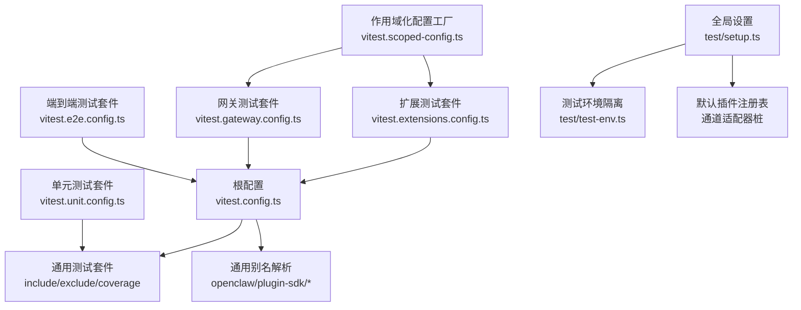
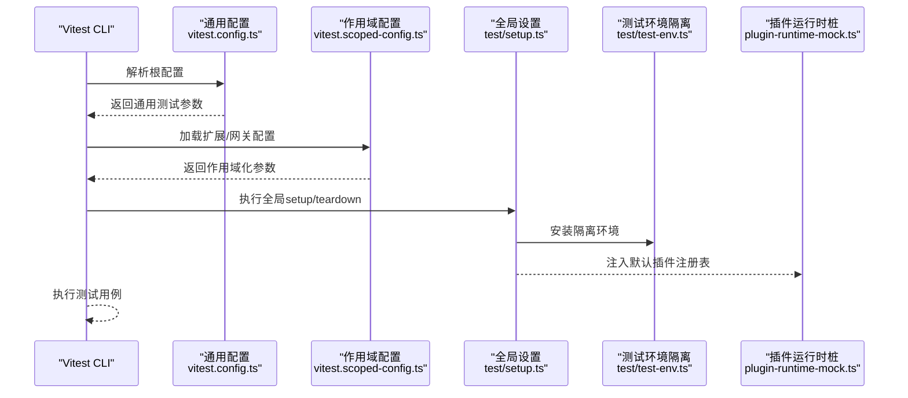
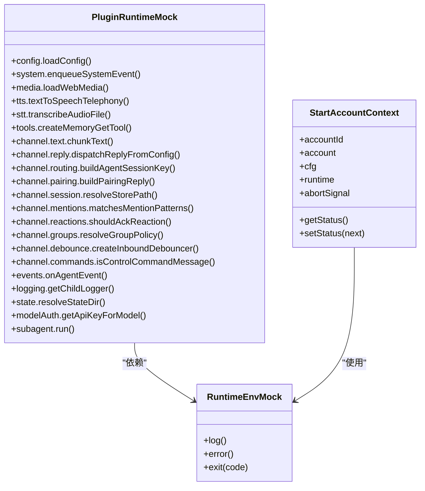
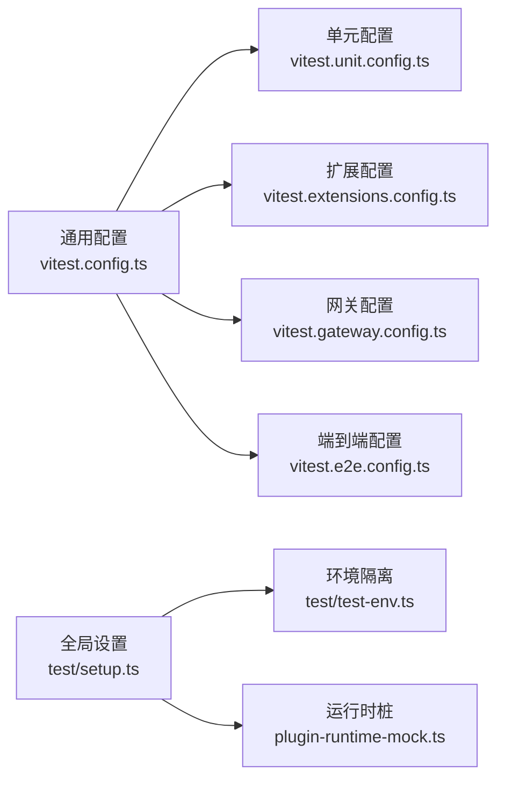

# 本地测试与调试

<cite>
**本文引用的文件**
- [vitest.config.ts](file://vitest.config.ts)
- [vitest.unit.config.ts](file://vitest.unit.config.ts)
- [vitest.extensions.config.ts](file://vitest.extensions.config.ts)
- [vitest.gateway.config.ts](file://vitest.gateway.config.ts)
- [vitest.e2e.config.ts](file://vitest.e2e.config.ts)
- [vitest.scoped-config.ts](file://vitest.scoped-config.ts)
- [test/setup.ts](file://test/setup.ts)
- [test/global-setup.ts](file://test/global-setup.ts)
- [test/test-env.ts](file://test/test-env.ts)
- [extensions/test-utils/plugin-runtime-mock.ts](file://extensions/test-utils/plugin-runtime-mock.ts)
- [extensions/test-utils/runtime-env.ts](file://extensions/test-utils/runtime-env.ts)
- [extensions/test-utils/start-account-context.ts](file://extensions/test-utils/start-account-context.ts)
</cite>

## 目录

1. [引言](#引言)
2. [项目结构](#项目结构)
3. [核心组件](#核心组件)
4. [架构总览](#架构总览)
5. [详细组件分析](#详细组件分析)
6. [依赖分析](#依赖分析)
7. [性能考虑](#性能考虑)
8. [故障排查指南](#故障排查指南)
9. [结论](#结论)
10. [附录](#附录)

## 引言

本指南面向OpenClaw插件开发者，提供从环境搭建、单元测试、集成测试到端到端测试与调试的完整流程。内容覆盖：

- 测试环境隔离与配置
- 单元测试与插件SDK测试工具
- 集成测试与通道适配器模拟
- 端到端测试场景与并发控制
- 覆盖率阈值与持续集成配置
- 日志记录与错误追踪最佳实践

## 项目结构

OpenClaw采用多包工作区与分层架构，测试体系围绕Vitest进行组织，并通过作用域化配置实现对不同子系统（如插件、网关、扩展）的独立测试运行。

图表来源

- [vitest.config.ts:57-202](file://vitest.config.ts#L57-L202)
- [vitest.unit.config.ts:11-30](file://vitest.unit.config.ts#L11-L30)
- [vitest.extensions.config.ts:1-4](file://vitest.extensions.config.ts#L1-L4)
- [vitest.gateway.config.ts:1-4](file://vitest.gateway.config.ts#L1-L4)
- [vitest.e2e.config.ts:20-32](file://vitest.e2e.config.ts#L20-L32)
- [vitest.scoped-config.ts:4-17](file://vitest.scoped-config.ts#L4-L17)
- [test/setup.ts:30-201](file://test/setup.ts#L30-L201)
- [test/test-env.ts:54-148](file://test/test-env.ts#L54-L148)

章节来源

- [vitest.config.ts:57-202](file://vitest.config.ts#L57-L202)
- [vitest.unit.config.ts:11-30](file://vitest.unit.config.ts#L11-L30)
- [vitest.extensions.config.ts:1-4](file://vitest.extensions.config.ts#L1-L4)
- [vitest.gateway.config.ts:1-4](file://vitest.gateway.config.ts#L1-L4)
- [vitest.e2e.config.ts:20-32](file://vitest.e2e.config.ts#L20-L32)
- [vitest.scoped-config.ts:4-17](file://vitest.scoped-config.ts#L4-L17)
- [test/setup.ts:30-201](file://test/setup.ts#L30-L201)
- [test/test-env.ts:54-148](file://test/test-env.ts#L54-L148)

## 核心组件

- 测试运行器与配置
  - 通用Vitest配置：统一超时、钩子超时、进程池、覆盖率阈值与排除范围
  - 作用域化配置工厂：按模式快速生成扩展/网关等子系统测试配置
  - 单元测试专用配置：缩小测试范围，排除大型集成模块
- 全局测试设置
  - 环境隔离：临时HOME与XDG目录，避免污染真实状态
  - 插件注册表：默认通道桩（Discord、Slack、Telegram、WhatsApp、Signal、iMessage）
  - 运行时清理：确保跨文件/跨worker无泄漏（假定时钟、环境变量等）
- 插件SDK测试工具
  - 插件运行时桩：覆盖配置、系统、媒体、TTS/STT、工具、通道文本/回复/路由/配对/会话/提及/反应/群组/防抖/命令等接口
  - 运行时环境桩：日志、错误、退出行为
  - 账户上下文桩：构建通道网关上下文，支持状态快照与中止信号

章节来源

- [vitest.config.ts:57-202](file://vitest.config.ts#L57-L202)
- [vitest.scoped-config.ts:4-17](file://vitest.scoped-config.ts#L4-L17)
- [vitest.unit.config.ts:11-30](file://vitest.unit.config.ts#L11-L30)
- [test/setup.ts:30-201](file://test/setup.ts#L30-L201)
- [extensions/test-utils/plugin-runtime-mock.ts:35-271](file://extensions/test-utils/plugin-runtime-mock.ts#L35-L271)
- [extensions/test-utils/runtime-env.ts:4-12](file://extensions/test-utils/runtime-env.ts#L4-L12)
- [extensions/test-utils/start-account-context.ts:9-33](file://extensions/test-utils/start-account-context.ts#L9-L33)

## 架构总览

下图展示测试生命周期与关键组件交互：

图表来源

- [vitest.config.ts:57-202](file://vitest.config.ts#L57-L202)
- [vitest.scoped-config.ts:4-17](file://vitest.scoped-config.ts#L4-L17)
- [test/setup.ts:30-201](file://test/setup.ts#L30-L201)
- [test/test-env.ts:54-148](file://test/test-env.ts#L54-L148)
- [extensions/test-utils/plugin-runtime-mock.ts:35-271](file://extensions/test-utils/plugin-runtime-mock.ts#L35-L271)

## 详细组件分析

### 组件A：通用测试配置（vitest.config.ts）

- 关键点
  - 别名映射：为openclaw/plugin-sdk及其子路径建立精确别名，确保测试可定位到源码而非打包产物
  - 并发与隔离：默认使用进程池，VM Forks在某些场景下可能泄漏状态，e2e强制使用进程池以保证确定性
  - 超时与钩子：针对Windows平台延长钩子超时，保障稳定执行
  - 覆盖率：v8提供者，输出文本与LCOV；仅统计被实际执行的源文件，排除入口、CLI、网关服务器、浏览器UI等
  - 排除范围：严格限定排除列表，避免“文件越多越难维护”的反效果
- 最佳实践
  - 在CI中使用固定工作线程数，避免资源争用
  - 使用unstubEnvs/unstubGlobals避免跨文件污染

章节来源

- [vitest.config.ts:57-202](file://vitest.config.ts#L57-L202)

### 组件B：作用域化配置工厂（vitest.scoped-config.ts）

- 关键点
  - 基于通用配置派生，仅变更include/exclude，便于扩展/网关等子系统独立运行
- 最佳实践
  - 为每个重要子系统提供独立配置文件，提升开发效率与可维护性

章节来源

- [vitest.scoped-config.ts:4-17](file://vitest.scoped-config.ts#L4-L17)

### 组件C：扩展测试配置（vitest.extensions.config.ts）

- 关键点
  - 仅匹配extensions/\*_/_.test.ts，聚焦插件生态测试
- 最佳实践
  - 将扩展测试与核心逻辑测试分离，缩短反馈周期

章节来源

- [vitest.extensions.config.ts:1-4](file://vitest.extensions.config.ts#L1-L4)

### 组件D：网关测试配置（vitest.gateway.config.ts）

- 关键点
  - 仅匹配src/gateway/\*_/_.test.ts，便于网关模块专项测试
- 最佳实践
  - 结合e2e配置，先做单元/集成再做端到端验证

章节来源

- [vitest.gateway.config.ts:1-4](file://vitest.gateway.config.ts#L1-L4)

### 组件E：端到端测试配置（vitest.e2e.config.ts）

- 关键点
  - 强制进程池，避免VM上下文泄漏
  - 默认单工作线程，可通过环境变量调整并发度
  - 可开启详细输出以便调试
- 最佳实践
  - 将昂贵或易受时序影响的测试放入e2e套件
  - 使用环境变量控制并发与日志级别

章节来源

- [vitest.e2e.config.ts:20-32](file://vitest.e2e.config.ts#L20-L32)

### 组件F：单元测试配置（vitest.unit.config.ts）

- 关键点
  - 在通用配置基础上进一步缩小范围，排除网关、主流通道、浏览器等大型集成面
- 最佳实践
  - 将高频修改的纯逻辑模块纳入单元测试，提升回归速度

章节来源

- [vitest.unit.config.ts:11-30](file://vitest.unit.config.ts#L11-L30)

### 组件G：全局设置与环境隔离（test/setup.ts, test/test-env.ts）

- 关键点
  - 安装全局警告过滤器，减少噪音
  - 通过withIsolatedTestHome创建隔离HOME与XDG目录，避免污染真实用户状态
  - 在beforeAll设置默认插件注册表，在afterEach恢复并重置假定时钟
  - 支持“Live测试”模式，加载真实用户环境变量
- 最佳实践
  - 在测试前明确是否需要真实环境（如密钥、配置），必要时启用LIVE模式
  - 对外部进程/网络调用一律使用桩或本地回环

章节来源

- [test/setup.ts:30-201](file://test/setup.ts#L30-L201)
- [test/test-env.ts:54-148](file://test/test-env.ts#L54-L148)

### 组件H：插件SDK测试工具（extensions/test-utils）

- 插件运行时桩（plugin-runtime-mock.ts）
  - 覆盖配置读写、系统事件、命令执行、媒体处理、TTS/STT、工具注册、通道文本/回复/路由/配对/会话/提及/反应/群组/防抖/命令等
  - 支持深度合并覆盖，便于局部定制
- 运行时环境桩（runtime-env.ts）
  - 提供日志、错误、退出行为的桩函数
- 账户上下文桩（start-account-context.ts）
  - 构建通道网关上下文，支持状态快照与中止信号

图表来源

- [extensions/test-utils/plugin-runtime-mock.ts:35-271](file://extensions/test-utils/plugin-runtime-mock.ts#L35-L271)
- [extensions/test-utils/runtime-env.ts:4-12](file://extensions/test-utils/runtime-env.ts#L4-L12)
- [extensions/test-utils/start-account-context.ts:9-33](file://extensions/test-utils/start-account-context.ts#L9-L33)

章节来源

- [extensions/test-utils/plugin-runtime-mock.ts:35-271](file://extensions/test-utils/plugin-runtime-mock.ts#L35-L271)
- [extensions/test-utils/runtime-env.ts:4-12](file://extensions/test-utils/runtime-env.ts#L4-L12)
- [extensions/test-utils/start-account-context.ts:9-33](file://extensions/test-utils/start-account-context.ts#L9-L33)

## 依赖分析

- 配置耦合
  - 通用配置是所有作用域配置的基础，修改需谨慎评估影响范围
- 组件内聚
  - 插件SDK测试工具高度内聚，覆盖通道适配器全链路能力
- 外部依赖
  - Vitest、Node进程模型、文件系统（用于隔离HOME/XDG）

图表来源

- [vitest.config.ts:57-202](file://vitest.config.ts#L57-L202)
- [vitest.unit.config.ts:11-30](file://vitest.unit.config.ts#L11-L30)
- [vitest.extensions.config.ts:1-4](file://vitest.extensions.config.ts#L1-L4)
- [vitest.gateway.config.ts:1-4](file://vitest.gateway.config.ts#L1-L4)
- [vitest.e2e.config.ts:20-32](file://vitest.e2e.config.ts#L20-L32)
- [test/setup.ts:30-201](file://test/setup.ts#L30-L201)
- [test/test-env.ts:54-148](file://test/test-env.ts#L54-L148)
- [extensions/test-utils/plugin-runtime-mock.ts:35-271](file://extensions/test-utils/plugin-runtime-mock.ts#L35-L271)

## 性能考虑

- 并发与工作线程
  - 本地默认基于CPU核数动态分配工作线程，CI中Windows限制为2，其他平台为3
  - e2e默认单工作线程，可通过环境变量调整，兼顾稳定性与速度
- 超时与钩子
  - Windows平台延长钩子超时，降低不稳定因素
- 覆盖率
  - 仅统计被实际执行的源文件，避免“文件越多越难达标”的陷阱
- I/O与隔离
  - 使用临时HOME与XDG目录，避免磁盘IO与权限问题影响测试性能

章节来源

- [vitest.config.ts:71-80](file://vitest.config.ts#L71-L80)
- [vitest.e2e.config.ts:6-15](file://vitest.e2e.config.ts#L6-L15)

## 故障排查指南

- 环境变量泄漏
  - 使用unstubEnvs/unstubGlobals，确保跨文件无状态泄漏
- 假定时钟泄漏
  - 在afterEach中重置假定时钟，避免跨文件/跨worker异常
- 网络/外部进程
  - 优先使用桩或本地回环；若必须访问外部服务，使用LIVE模式并谨慎传递凭据
- 并发与确定性
  - e2e强制进程池，避免VM上下文共享导致的不确定性
- 日志与诊断
  - 开启e2e详细输出，结合覆盖率报告定位未覆盖路径
- 调试技巧
  - 使用环境变量控制并发与日志级别
  - 在需要时临时放宽超时，定位慢点

章节来源

- [test/setup.ts:188-200](file://test/setup.ts#L188-L200)
- [vitest.config.ts:74-78](file://vitest.config.ts#L74-L78)
- [vitest.e2e.config.ts:24-28](file://vitest.e2e.config.ts#L24-L28)

## 结论

通过统一的Vitest配置、严格的环境隔离、完善的插件SDK测试工具与清晰的作用域化测试套件，OpenClaw为插件开发提供了高效、稳定且可扩展的本地测试与调试框架。建议在日常开发中遵循“单元优先、集成补充、端到端兜底”的策略，并结合覆盖率阈值与CI配置，持续提升质量与交付效率。

## 附录

### A. 测试环境搭建清单

- 安装依赖后，确保Node版本与工作区一致
- 使用pnpm或对应包管理器安装依赖
- 运行命令参考各配置文件中的include/exclude模式

章节来源

- [vitest.config.ts:81-100](file://vitest.config.ts#L81-L100)
- [vitest.extensions.config.ts:3](file://vitest.extensions.config.ts#L3)
- [vitest.gateway.config.ts:3](file://vitest.gateway.config.ts#L3)
- [vitest.e2e.config.ts:29](file://vitest.e2e.config.ts#L29)

### B. 单元测试编写要点

- 优先覆盖纯函数与业务逻辑
- 使用插件运行时桩替换外部依赖
- 通过深度覆盖局部定制桩行为

章节来源

- [vitest.unit.config.ts:11-30](file://vitest.unit.config.ts#L11-L30)
- [extensions/test-utils/plugin-runtime-mock.ts:35-271](file://extensions/test-utils/plugin-runtime-mock.ts#L35-L271)

### C. 集成测试实施要点

- 使用默认插件注册表与通道桩
- 通过账户上下文桩构造真实会话场景
- 注意环境隔离与并发控制

章节来源

- [test/setup.ts:137-182](file://test/setup.ts#L137-L182)
- [extensions/test-utils/start-account-context.ts:9-33](file://extensions/test-utils/start-account-context.ts#L9-L33)

### D. 端到端测试场景设计

- 场景模板
  - 启动网关/桥接服务
  - 初始化通道适配器与账户上下文
  - 发送/接收消息，校验回复与会话状态
  - 清理资源与状态
- 并发与稳定性
  - 使用进程池与固定工作线程
  - 通过环境变量控制并发与日志

章节来源

- [vitest.e2e.config.ts:20-32](file://vitest.e2e.config.ts#L20-L32)
- [test/global-setup.ts:1-7](file://test/global-setup.ts#L1-L7)

### E. 覆盖率要求与持续集成

- 覆盖率阈值
  - 行/函数/分支/语句：约70%/70%/55%/70%
- CI配置
  - Windows平台工作线程限制为2，其他平台为3
  - e2e默认单工作线程，可通过环境变量调整

章节来源

- [vitest.config.ts:107-112](file://vitest.config.ts#L107-L112)
- [vitest.config.ts:79-80](file://vitest.config.ts#L79-L80)
- [vitest.e2e.config.ts:9-14](file://vitest.e2e.config.ts#L9-L14)
