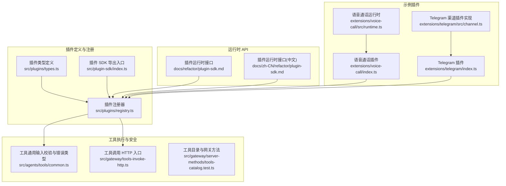
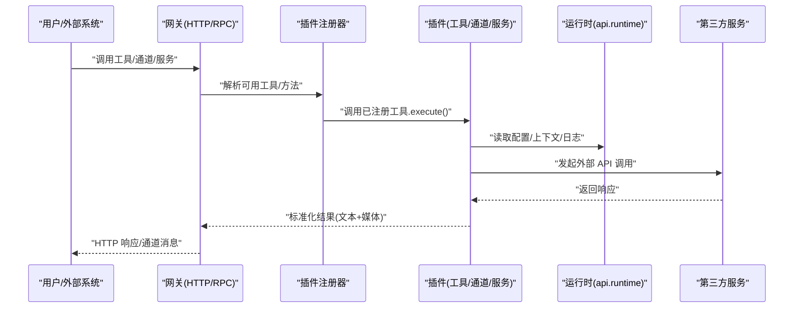
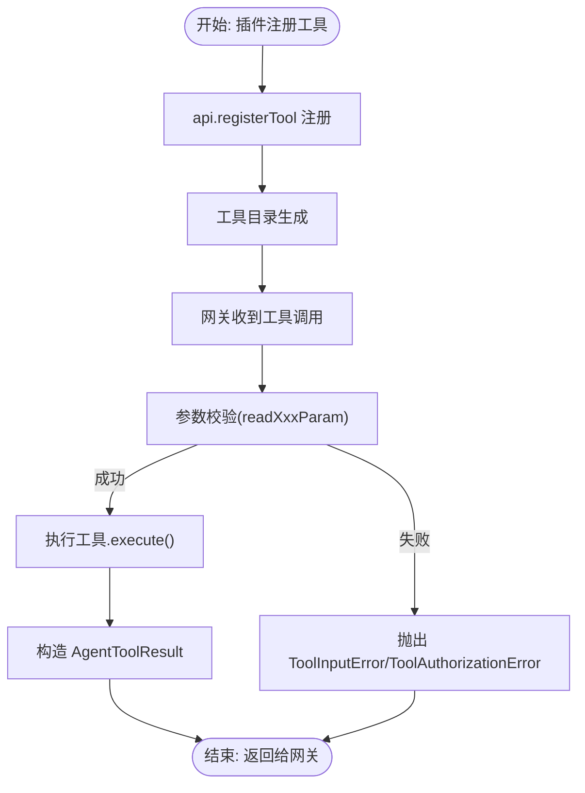
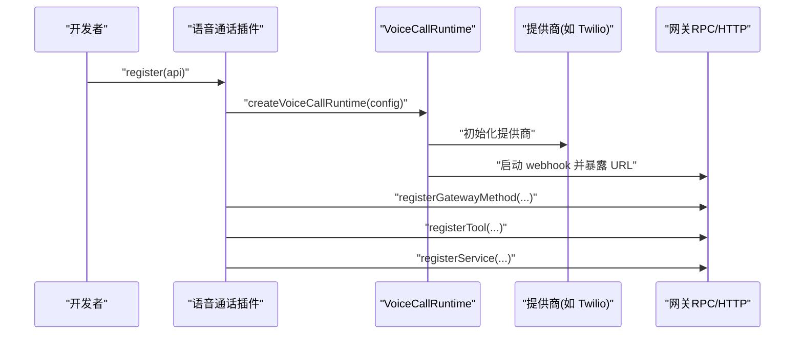
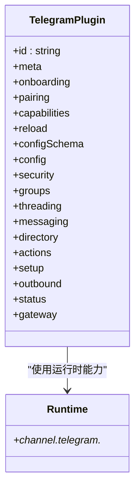
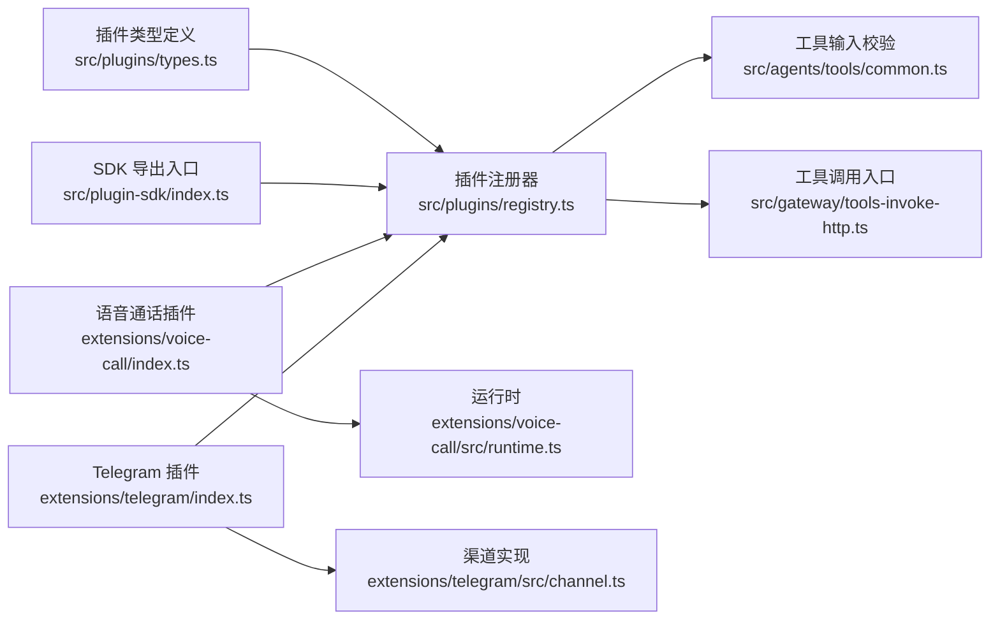

# 工具插件

<cite>
**本文引用的文件**
- [types.ts](file://src/plugins/types.ts)
- [common.ts](file://src/agents/tools/common.ts)
- [registry.ts](file://src/plugins/registry.ts)
- [plugin.md](file://docs/tools/plugin.md)
- [index.ts](file://src/plugin-sdk/index.ts)
- [index.ts](file://extensions/voice-call/index.ts)
- [runtime.ts](file://extensions/voice-call/src/runtime.ts)
- [index.ts](file://extensions/telegram/index.ts)
- [channel.ts](file://extensions/telegram/src/channel.ts)
- [plugin-sdk.md](file://docs/refactor/plugin-sdk.md)
- [plugin-sdk.md](file://docs/zh-CN/refactor/plugin-sdk.md)
- [tools-catalog.test.ts](file://src/gateway/server-methods/tools-catalog.test.ts)
- [voice-call.plugin.test.ts](file://src/plugins/voice-call.plugin.test.ts)
- [tools-invoke-http.ts](file://src/gateway/tools-invoke-http.ts)
- [SECURITY.md](file://SECURITY.md)
</cite>

## 目录

1. [简介](#简介)
2. [项目结构](#项目结构)
3. [核心组件](#核心组件)
4. [架构总览](#架构总览)
5. [详细组件分析](#详细组件分析)
6. [依赖关系分析](#依赖关系分析)
7. [性能考量](#性能考量)
8. [故障排查指南](#故障排查指南)
9. [结论](#结论)
10. [附录](#附录)

## 简介

本文件系统性阐述 OpenClaw 工具插件在系统中的关键作用与实现规范，覆盖以下主题：

- 外部 API 调用、系统操作与第三方服务集成
- 工具插件接口设计与实现规范（输入参数校验、输出结果格式化、异常处理）
- 安全考虑（权限控制、访问限制、数据保护）
- 开发指南（调试技巧、性能优化、测试方法）
- 常用工具插件实现案例与使用场景

工具插件是扩展 OpenClaw 功能的重要机制，允许开发者注册工具、HTTP 路由、CLI 命令、后台服务、上下文引擎以及消息通道等能力；同时，插件通过受控的运行时 API 访问核心能力，确保在信任边界内安全地执行。

## 项目结构

OpenClaw 的工具插件体系由“插件定义与注册”“运行时 API”“工具执行与安全策略”“示例插件”四部分构成：

图示来源

- [types.ts:263-306](file://src/plugins/types.ts#L263-L306)
- [registry.ts:575-608](file://src/plugins/registry.ts#L575-L608)
- [plugin-sdk.md:45-145](file://docs/refactor/plugin-sdk.md#L45-L145)
- [plugin-sdk.md:42-152](file://docs/zh-CN/refactor/plugin-sdk.md#L42-L152)
- [common.ts:26-54](file://src/agents/tools/common.ts#L26-L54)
- [tools-invoke-http.ts:293-340](file://src/gateway/tools-invoke-http.ts#L293-L340)
- [tools-catalog.test.ts:90-120](file://src/gateway/server-methods/tools-catalog.test.ts#L90-L120)
- [index.ts:146-543](file://extensions/voice-call/index.ts#L146-L543)
- [runtime.ts:135-265](file://extensions/voice-call/src/runtime.ts#L135-L265)
- [index.ts:1-18](file://extensions/telegram/index.ts#L1-L18)
- [channel.ts:120-587](file://extensions/telegram/src/channel.ts#L120-L587)

章节来源

- [plugin.md:62-113](file://docs/tools/plugin.md#L62-L113)
- [plugin.md:484-521](file://docs/tools/plugin.md#L484-L521)
- [plugin.md:604-654](file://docs/tools/plugin.md#L604-L654)

## 核心组件

- 插件 API 与类型
  - OpenClawPluginApi 提供注册工具、HTTP 路由、命令、服务、上下文引擎、通道、网关方法等能力，并暴露运行时与日志接口。
  - OpenClawPluginToolContext 为工具执行提供会话、请求者身份、沙箱状态等上下文。
  - 插件钩子（Hook）支持在代理生命周期的关键节点进行干预（如提示词构建、模型解析、消息收发、工具调用前后等）。
- 工具执行与输入校验
  - 工具统一返回 AgentToolResult，内容以文本块与可选媒体块组成；错误通过 ToolInputError/ToolAuthorizationError 等标准化异常抛出。
  - 输入参数读取提供字符串、数字、数组、反应动作等辅助函数，支持必填、去空、大小写兼容等选项。
- 运行时接口
  - 插件通过 api.runtime 访问通道文本分片、回复派发、路由、配对、媒体拉取/保存、提及匹配、群组策略、防抖、命令授权等核心能力。
  - 运行时接口在文档中给出最小完备表面，确保插件不直接导入 src/\*\*，仅通过注入式运行时交互。

章节来源

- [types.ts:263-306](file://src/plugins/types.ts#L263-L306)
- [types.ts:58-73](file://src/plugins/types.ts#L58-L73)
- [types.ts:321-377](file://src/plugins/types.ts#L321-L377)
- [common.ts:7-10](file://src/agents/tools/common.ts#L7-L10)
- [common.ts:26-54](file://src/agents/tools/common.ts#L26-L54)
- [common.ts:74-105](file://src/agents/tools/common.ts#L74-L105)
- [common.ts:230-240](file://src/agents/tools/common.ts#L230-L240)
- [plugin-sdk.md:45-145](file://docs/refactor/plugin-sdk.md#L45-L145)
- [plugin-sdk.md:42-152](file://docs/zh-CN/refactor/plugin-sdk.md#L42-L152)

## 架构总览

工具插件在 OpenClaw 中的职责与交互如下：

图示来源

- [registry.ts:575-608](file://src/plugins/registry.ts#L575-L608)
- [index.ts:377-497](file://extensions/voice-call/index.ts#L377-L497)
- [runtime.ts:135-265](file://extensions/voice-call/src/runtime.ts#L135-L265)
- [tools-invoke-http.ts:293-340](file://src/gateway/tools-invoke-http.ts#L293-L340)

## 详细组件分析

### 组件 A：工具注册与执行流程

- 注册阶段
  - 插件通过 api.registerTool 注册工具或工厂；支持命名集合与可选标记。
  - 注册器维护工具列表与来源记录，便于工具目录与诊断。
- 执行阶段
  - 网关根据工具名查找并执行；失败时按 ToolInputError 等映射到 4xx/5xx。
  - 工具内部通过 readXxxParam 系列函数进行参数校验，必要时抛出标准化错误。
- 输出格式
  - 统一返回 AgentToolResult，content 包含文本块与媒体块，details 携带结构化数据。

图示来源

- [registry.ts:193-218](file://src/plugins/registry.ts#L193-L218)
- [common.ts:74-105](file://src/agents/tools/common.ts#L74-L105)
- [common.ts:230-240](file://src/agents/tools/common.ts#L230-L240)
- [tools-invoke-http.ts:313-339](file://src/gateway/tools-invoke-http.ts#L313-L339)

章节来源

- [registry.ts:193-218](file://src/plugins/registry.ts#L193-L218)
- [common.ts:74-105](file://src/agents/tools/common.ts#L74-L105)
- [common.ts:230-240](file://src/agents/tools/common.ts#L230-L240)
- [tools-invoke-http.ts:293-340](file://src/gateway/tools-invoke-http.ts#L293-L340)

### 组件 B：语音通话工具插件

- 功能概述
  - 支持 Telnyx/Twilio/Plivo/Mock 四种提供商；提供拨号、续呼、播报、结束、状态查询等网关方法与工具。
  - 通过 api.registerGatewayMethod 注册 RPC 方法；通过 api.registerTool 注册工具；通过 api.registerService 注册后台服务。
- 运行时初始化
  - 创建 VoiceCallRuntime，启动 webhook 服务器，按需建立隧道或 Tailscale 暴露，配置提供商与媒体流处理。
- 配置与安全
  - 提供配置 Schema 与 UI 提示；支持跳过签名验证（开发模式警告）；严格校验提供商配置。

图示来源

- [index.ts:146-543](file://extensions/voice-call/index.ts#L146-L543)
- [runtime.ts:135-265](file://extensions/voice-call/src/runtime.ts#L135-L265)

章节来源

- [index.ts:146-543](file://extensions/voice-call/index.ts#L146-L543)
- [runtime.ts:135-265](file://extensions/voice-call/src/runtime.ts#L135-L265)

### 组件 C：Telegram 渠道插件

- 功能概述
  - 作为消息通道插件，提供账户配置、安全策略、群组策略、线程、目录、消息动作、状态检查、网关启动/登出等能力。
  - 通过 api.registerChannel 注册，实现与内置通道一致的行为。
- 关键点
  - 配置基座与访问器封装；重复令牌检测与告警；Webhook/Polling 模式探测；代理探针与审计。

图示来源

- [channel.ts:120-587](file://extensions/telegram/src/channel.ts#L120-L587)
- [index.ts:1-18](file://extensions/telegram/index.ts#L1-L18)

章节来源

- [channel.ts:120-587](file://extensions/telegram/src/channel.ts#L120-L587)
- [index.ts:1-18](file://extensions/telegram/index.ts#L1-L18)

### 组件 D：插件运行时接口与安全

- 运行时接口
  - 文本分片、回复派发、路由、配对、媒体拉取/保存、提及匹配、群组策略、防抖、命令授权等。
- 安全边界
  - 插件被视为可信代码，安装/启用即获得与本地网关主机相同的信任级别；安全报告需证明越过了边界（未认证加载、白名单/策略绕过、沙箱/路径安全绕过）。

章节来源

- [plugin-sdk.md:45-145](file://docs/refactor/plugin-sdk.md#L45-L145)
- [plugin-sdk.md:42-152](file://docs/zh-CN/refactor/plugin-sdk.md#L42-L152)
- [SECURITY.md:104-110](file://SECURITY.md#L104-L110)

## 依赖关系分析

- 插件注册器依赖插件 API 类型与运行时接口，负责将插件声明的能力注入到系统中。
- 工具执行链路依赖输入校验与错误映射，确保对外输出一致且可诊断。
- 示例插件（语音通话、Telegram）展示了如何通过运行时访问第三方服务并暴露网关方法与工具。

图示来源

- [types.ts:263-306](file://src/plugins/types.ts#L263-L306)
- [registry.ts:575-608](file://src/plugins/registry.ts#L575-L608)
- [index.ts:1-800](file://src/plugin-sdk/index.ts#L1-L800)
- [common.ts:74-105](file://src/agents/tools/common.ts#L74-L105)
- [tools-invoke-http.ts:293-340](file://src/gateway/tools-invoke-http.ts#L293-L340)
- [index.ts:146-543](file://extensions/voice-call/index.ts#L146-L543)
- [runtime.ts:135-265](file://extensions/voice-call/src/runtime.ts#L135-L265)
- [index.ts:1-18](file://extensions/telegram/index.ts#L1-L18)
- [channel.ts:120-587](file://extensions/telegram/src/channel.ts#L120-L587)

章节来源

- [plugin.md:62-113](file://docs/tools/plugin.md#L62-L113)
- [plugin.md:484-521](file://docs/tools/plugin.md#L484-L521)

## 性能考量

- 插件发现与清单缓存
  - 插件发现与清单元数据使用短时进程内缓存，减少启动/重载抖动；可通过环境变量禁用或调整缓存窗口。
- 工具执行与错误处理
  - 对输入错误进行快速判定与 4xx 响应，避免不必要的后端开销；工具结果尽量精简，必要时通过 details 字段携带结构化数据。
- 运行时资源管理
  - 语音通话运行时在初始化失败时清理已启动资源（隧道、Tailscale、webhook），防止端口占用与进程泄漏。

章节来源

- [plugin.md:219-227](file://docs/tools/plugin.md#L219-L227)
- [tools-invoke-http.ts:323-337](file://src/gateway/tools-invoke-http.ts#L323-L337)
- [runtime.ts:257-263](file://extensions/voice-call/src/runtime.ts#L257-L263)

## 故障排查指南

- 工具调用失败
  - 若返回 404：工具名不存在或被网关工具策略屏蔽。
  - 若返回 4xx：参数缺失/非法，依据 ToolInputError 映射定位问题。
  - 若返回 500：工具执行异常，查看网关日志与工具 details。
- 语音通话插件
  - 启动失败：检查提供商配置、公有 URL/隧道设置、签名验证开关（开发模式警告）。
  - 无法外呼：确认 toNumber 配置、提供商凭据、网络与代理设置。
- Telegram 插件
  - 令牌冲突：同一 bot token 不允许多个账户拥有；请清理重复配置。
  - Webhook/Polling：根据 webhookUrl 与证书配置检查连通性与签名。

章节来源

- [tools-invoke-http.ts:304-340](file://src/gateway/tools-invoke-http.ts#L304-L340)
- [index.ts:151-175](file://extensions/voice-call/index.ts#L151-L175)
- [runtime.ts:155-159](file://extensions/voice-call/src/runtime.ts#L155-L159)
- [channel.ts:157-184](file://extensions/telegram/src/channel.ts#L157-L184)

## 结论

工具插件在 OpenClaw 中承担“能力扩展”的核心角色：通过标准化的 API 与运行时接口，既保证了对外部服务与系统操作的一致接入，又在信任边界内提供了完善的安全与可观测性保障。遵循本文的接口设计、输入校验、输出格式与安全实践，可高效开发高质量工具插件，并在生产环境中稳定运行。

## 附录

- 快速参考
  - 插件注册 API：registerTool/registerGatewayMethod/registerHttpRoute/registerCli/registerService/registerProvider/registerCommand/registerContextEngine
  - 工具输入校验：readStringParam/readNumberParam/readStringArrayParam/readReactionParams
  - 工具结果：jsonResult/imageResult/imageResultFromFile
  - 运行时能力：通道文本分片、回复派发、路由、配对、媒体、提及、群组策略、防抖、命令授权
  - 示例插件：语音通话（Telnyx/Twilio/Plivo/Mock）、Telegram 渠道

章节来源

- [plugin.md:484-521](file://docs/tools/plugin.md#L484-L521)
- [common.ts:74-105](file://src/agents/tools/common.ts#L74-L105)
- [common.ts:230-240](file://src/agents/tools/common.ts#L230-L240)
- [plugin-sdk.md:45-145](file://docs/refactor/plugin-sdk.md#L45-L145)
