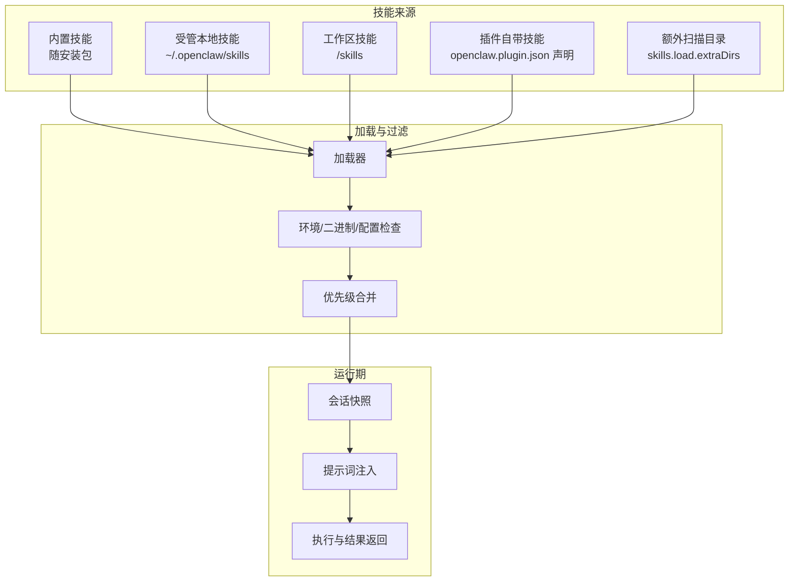
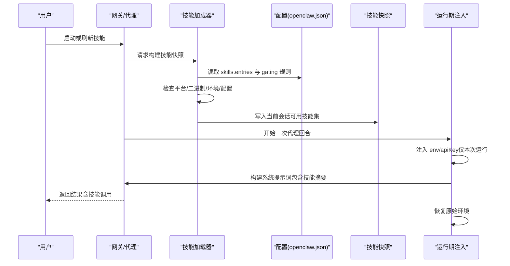
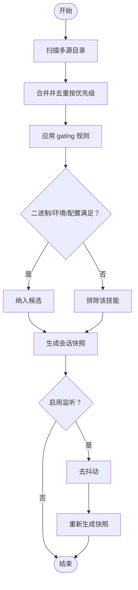
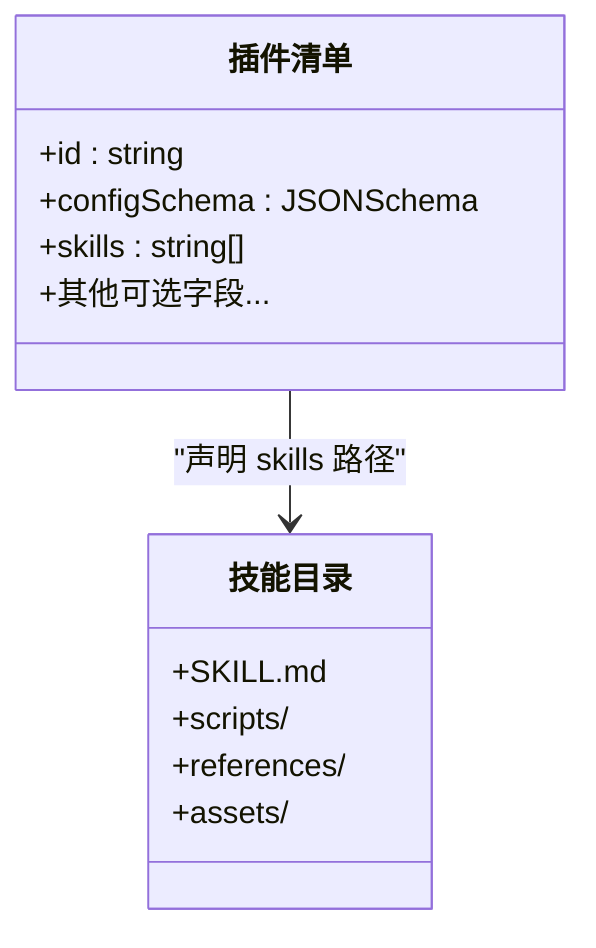
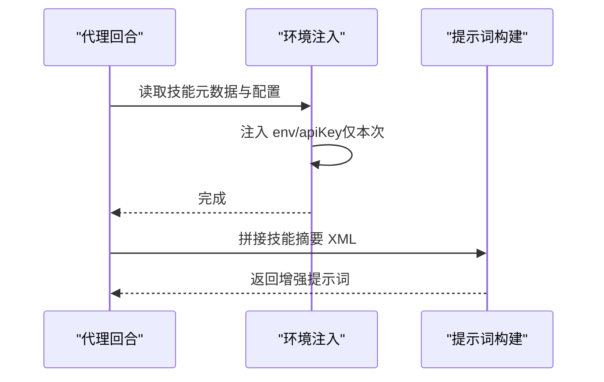
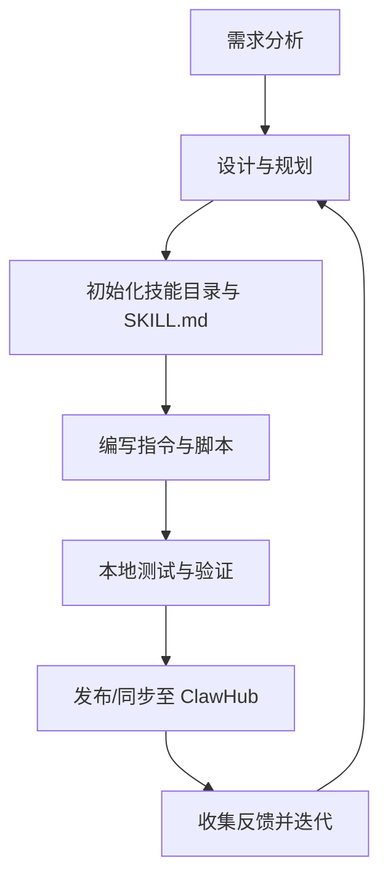
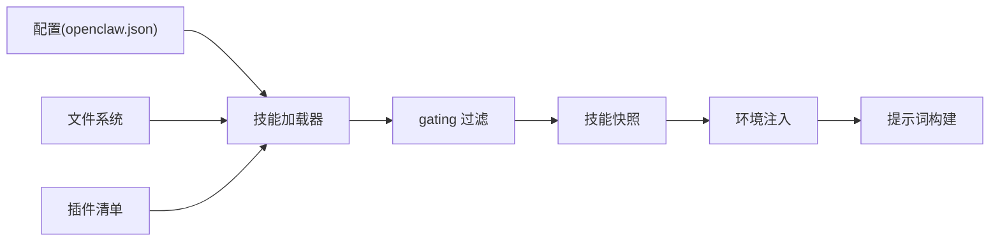

# 技能插件

<cite>
**本文引用的文件**
- [docs/tools/skills.md](file://docs/tools/skills.md)
- [docs/tools/creating-skills.md](file://docs/tools/creating-skills.md)
- [docs/tools/skills-config.md](file://docs/tools/skills-config.md)
- [src/agents/skills.ts](file://src/agents/skills.ts)
- [src/plugin-sdk/index.ts](file://src/plugin-sdk/index.ts)
- [extensions/lobster/openclaw.plugin.json](file://extensions/lobster/openclaw.plugin.json)
- [extensions/voice-call/openclaw.plugin.json](file://extensions/voice-call/openclaw.plugin.json)
- [skills/skill-creator/SKILL.md](file://skills/skill-creator/SKILL.md)
</cite>

## 目录

1. [简介](#简介)
2. [项目结构](#项目结构)
3. [核心组件](#核心组件)
4. [架构总览](#架构总览)
5. [详细组件分析](#详细组件分析)
6. [依赖关系分析](#依赖关系分析)
7. [性能考量](#性能考量)
8. [故障排查指南](#故障排查指南)
9. [结论](#结论)
10. [附录](#附录)

## 简介

本文件系统性阐述 OpenClaw 的“技能插件”体系：概念与作用（AI 能力扩展、外部服务集成、自定义功能实现）、架构设计（技能注册、参数传递、结果处理、错误管理）、开发流程（从需求分析到部署上线）、模板与最佳实践（含配置说明与参考示例）、以及生命周期与版本控制机制。读者可据此快速构建、调试、发布与维护高质量技能。

## 项目结构

OpenClaw 将“技能”作为可被代理使用的工具与知识单元，采用“目录 + 标准化元数据”的方式组织；同时通过“插件”机制扩展技能集合，并在运行期进行加载、过滤与注入。

- 技能来源与优先级
  - 内置技能（随安装包分发）
  - 受管本地技能（用户主目录下的受管目录）
  - 工作区技能（当前工作空间）
  - 插件自带技能（启用插件时参与加载）
  - 额外扫描目录（通过配置追加）

- 技能格式与元数据
  - 每个技能为独立目录，包含标准化的 SKILL.md 文件（包含 YAML 前言元数据与 Markdown 指令体）
  - 元数据支持触发规则、平台限制、前置条件、命令分派等字段
  - 支持在元数据中声明安装器信息，便于 UI 或 CLI 安装依赖

- 插件与技能的关系
  - 插件可通过清单声明自带技能目录
  - 插件启用后，其技能参与常规加载与优先级判定
  - 插件清单还承担严格配置校验职责，避免未验证配置进入运行阶段

图表来源

- [docs/tools/skills.md:13-48](file://docs/tools/skills.md#L13-L48)
- [docs/tools/skills.md:78-187](file://docs/tools/skills.md#L78-L187)

章节来源

- [docs/tools/skills.md:11-48](file://docs/tools/skills.md#L11-L48)
- [docs/tools/skills.md:78-187](file://docs/tools/skills.md#L78-L187)

## 核心组件

- 技能加载与过滤
  - 加载顺序与优先级：工作区 > 受管本地 > 内置（最低），插件技能参与同一规则
  - 运行前快照：会话开始时缓存可用技能列表，后续回合复用
  - 观察者：可启用文件变更监听，热更新技能快照
- 元数据与触发规则
  - YAML 前言元数据用于描述技能名称、用途与触发时机
  - metadata.openclaw 下的字段用于平台、二进制、环境变量、配置项等前置条件
- 参数与环境注入
  - 运行期按需注入环境变量与密钥，作用域限定于单次代理运行
  - 支持 per-skill 的 env 与 apiKey 配置
- 插件清单与技能
  - 插件清单 openclaw.plugin.json 必须提供 JSON Schema，用于严格配置校验
  - 清单可声明 skills 数组，使插件自带技能参与加载

章节来源

- [docs/tools/skills.md:13-48](file://docs/tools/skills.md#L13-L48)
- [docs/tools/skills.md:106-187](file://docs/tools/skills.md#L106-L187)
- [docs/tools/skills-config.md:13-78](file://docs/tools/skills-config.md#L13-L78)
- [src/agents/skills.ts:1-47](file://src/agents/skills.ts#L1-L47)

## 架构总览

下图展示从“技能发现/过滤”到“运行期注入与执行”的整体流程，以及插件如何参与技能装载。

图表来源

- [docs/tools/skills.md:230-246](file://docs/tools/skills.md#L230-L246)
- [docs/tools/skills-config.md:13-78](file://docs/tools/skills-config.md#L13-L78)

章节来源

- [docs/tools/skills.md:230-246](file://docs/tools/skills.md#L230-L246)
- [docs/tools/skills-config.md:13-78](file://docs/tools/skills-config.md#L13-L78)

## 详细组件分析

### 组件A：技能加载与优先级

- 多源加载与合并
  - 来源包括内置、受管本地、工作区、插件自带与额外扫描目录
  - 冲突时按“工作区 > 受管本地 > 内置”的优先级决定最终使用
- 会话快照与热重载
  - 会话开始时生成快照；默认监听 SKILL.md 变更以热更新
  - 受控的 debounce 避免频繁刷新
- 平台与前置条件
  - metadata.openclaw 可指定 os、require.bins/anyBins、env、config 等
  - sandbox 场景下，容器内也需满足二进制存在

图表来源

- [docs/tools/skills.md:106-187](file://docs/tools/skills.md#L106-L187)
- [docs/tools/skills.md:254-267](file://docs/tools/skills.md#L254-L267)

章节来源

- [docs/tools/skills.md:106-187](file://docs/tools/skills.md#L106-L187)
- [docs/tools/skills.md:254-267](file://docs/tools/skills.md#L254-L267)

### 组件B：插件清单与技能装配

- 清单要求
  - 必须提供 id 与 configSchema（可为空对象）
  - 可选声明 kind、channels、providers、skills、name、description、uiHints、version
  - 严格配置校验：未知键、未知插件 id、缺失/损坏清单均视为错误
- 技能装配
  - 清单中的 skills 数组声明相对路径，插件启用时自动参与技能加载
  - 与普通技能共享同一优先级与 gating 规则

图表来源

- [docs/plugins/manifest.md:18-76](file://docs/plugins/manifest.md#L18-L76)
- [extensions/lobster/openclaw.plugin.json:1-11](file://extensions/lobster/openclaw.plugin.json#L1-L11)
- [extensions/voice-call/openclaw.plugin.json:162-599](file://extensions/voice-call/openclaw.plugin.json#L162-L599)

章节来源

- [docs/plugins/manifest.md:18-76](file://docs/plugins/manifest.md#L18-L76)
- [extensions/lobster/openclaw.plugin.json:1-11](file://extensions/lobster/openclaw.plugin.json#L1-L11)
- [extensions/voice-call/openclaw.plugin.json:162-599](file://extensions/voice-call/openclaw.plugin.json#L162-L599)

### 组件C：运行期环境注入与提示词

- 环境注入
  - 在代理回合开始时，按需将 env 与 apiKey 注入进程环境
  - 注入范围限定于该回合，结束后恢复原环境
- 提示词注入
  - 将可用技能的紧凑 XML 列表注入系统提示词，影响 token 成本
  - 字段长度与 XML 转义会影响字符数与 token 估算

图表来源

- [docs/tools/skills.md:230-246](file://docs/tools/skills.md#L230-L246)
- [docs/tools/skills.md:269-286](file://docs/tools/skills.md#L269-L286)

章节来源

- [docs/tools/skills.md:230-246](file://docs/tools/skills.md#L230-L246)
- [docs/tools/skills.md:269-286](file://docs/tools/skills.md#L269-L286)

### 组件D：开发与测试流程（从需求到上线）

- 需求与设计
  - 明确技能目标、触发场景、输出形态与安全边界
  - 设计资源组织：SKILL.md、scripts/、references/、assets/
- 创建与验证
  - 使用工作区目录创建技能目录与 SKILL.md
  - 可借助内置的“技能创建器”技能获得模板与最佳实践
- 测试与迭代
  - 使用代理命令触发技能，观察行为与输出
  - 根据真实任务反馈持续优化 SKILL.md 与脚本
- 发布与共享
  - 可通过 ClawHub 进行安装、更新与同步
  - 对外发布时遵循统一的元数据与资源组织规范

图表来源

- [docs/tools/creating-skills.md:17-59](file://docs/tools/creating-skills.md#L17-L59)
- [skills/skill-creator/SKILL.md:201-373](file://skills/skill-creator/SKILL.md#L201-L373)

章节来源

- [docs/tools/creating-skills.md:17-59](file://docs/tools/creating-skills.md#L17-L59)
- [skills/skill-creator/SKILL.md:201-373](file://skills/skill-creator/SKILL.md#L201-L373)

## 依赖关系分析

- 组件耦合
  - 技能加载器依赖配置模块与文件系统扫描
  - 运行期注入依赖环境管理与提示词构建
  - 插件清单校验与插件运行时解耦，前者仅负责配置校验
- 外部依赖
  - 二进制探测与安装器（brew/npm/go 等）由元数据声明驱动
  - 沙箱场景下，容器内需具备所需二进制与网络权限

图表来源

- [docs/tools/skills.md:106-187](file://docs/tools/skills.md#L106-L187)
- [docs/tools/skills-config.md:13-78](file://docs/tools/skills-config.md#L13-L78)
- [src/plugin-sdk/index.ts:125-127](file://src/plugin-sdk/index.ts#L125-L127)

章节来源

- [docs/tools/skills.md:106-187](file://docs/tools/skills.md#L106-L187)
- [docs/tools/skills-config.md:13-78](file://docs/tools/skills-config.md#L13-L78)
- [src/plugin-sdk/index.ts:125-127](file://src/plugin-sdk/index.ts#L125-L127)

## 性能考量

- token 成本
  - 技能列表注入提示词具有确定性开销，可通过减少技能数量与精简描述降低
  - XML 转义会增加长度，注意字段内容的字符集
- 加载与刷新
  - 启用监听并设置合理去抖动，避免频繁重建快照
  - 会话内复用快照，变更生效于下次新会话或热更新后下一回合
- 沙箱与二进制
  - 沙箱内需预置所需二进制，避免运行期拉取导致延迟

章节来源

- [docs/tools/skills.md:269-286](file://docs/tools/skills.md#L269-L286)
- [docs/tools/skills.md:254-267](file://docs/tools/skills.md#L254-L267)

## 故障排查指南

- 常见问题
  - 技能未出现：检查 gating 条件（平台、二进制、环境变量、配置项）是否满足
  - 环境变量未生效：确认注入范围为单次运行，且未被更高优先级覆盖
  - 插件未生效：检查 openclaw.plugin.json 是否存在、schema 是否有效、插件是否启用
  - 沙箱报错：确认容器内已安装所需二进制，且具备网络与写权限
- 排查步骤
  - 查看技能快照与监听状态
  - 校验配置文件与元数据
  - 在代理命令中手动触发技能，观察日志与输出
  - 使用内置“技能创建器”检查模板与最佳实践

章节来源

- [docs/tools/skills.md:69-77](file://docs/tools/skills.md#L69-L77)
- [docs/tools/skills.md:138-147](file://docs/tools/skills.md#L138-L147)
- [docs/tools/skills-config.md:61-78](file://docs/tools/skills-config.md#L61-L78)

## 结论

OpenClaw 的技能插件体系以“目录 + 元数据 + 插件清单”为核心，结合严格的 gating 与运行期注入机制，实现了可扩展、可审计、可热更新的能力边界。通过规范化的开发流程与配置校验，团队可以高效地交付高质量技能，并在多平台与沙箱环境中稳定运行。

## 附录

### A. 技能模板与最佳实践

- 目录结构建议
  - SKILL.md（必填，含 YAML 前言与 Markdown 指令体）
  - scripts/（可选，可重复使用的脚本）
  - references/（可选，按需加载的参考材料）
  - assets/（可选，输出使用的资源）
- 最佳实践
  - 保持 SKILL.md 精炼，复杂内容放入 references
  - 明确触发条件与使用场景，避免冗余文档
  - 优先使用脚本提升确定性与可复用性
  - 安全第一：避免在提示词中泄露敏感信息

章节来源

- [skills/skill-creator/SKILL.md:46-126](file://skills/skill-creator/SKILL.md#L46-L126)
- [docs/tools/creating-skills.md:50-59](file://docs/tools/creating-skills.md#L50-L59)

### B. 配置参考（节选）

- skills.allowBundled：仅允许内置技能白名单
- skills.load.extraDirs：追加扫描目录（最低优先级）
- skills.load.watch/watchDebounceMs：监听与去抖动
- skills.install.preferBrew/nodeManager：安装偏好
- skills.entries.<skillKey>：每技能开关、env、apiKey、自定义配置

章节来源

- [docs/tools/skills-config.md:13-78](file://docs/tools/skills-config.md#L13-L78)

### C. 插件清单字段速览

- id、configSchema（必填）
- skills（可选，数组）
- kind、channels、providers、name、description、uiHints、version（可选）

章节来源

- [docs/plugins/manifest.md:18-76](file://docs/plugins/manifest.md#L18-L76)
- [extensions/lobster/openclaw.plugin.json:1-11](file://extensions/lobster/openclaw.plugin.json#L1-L11)
