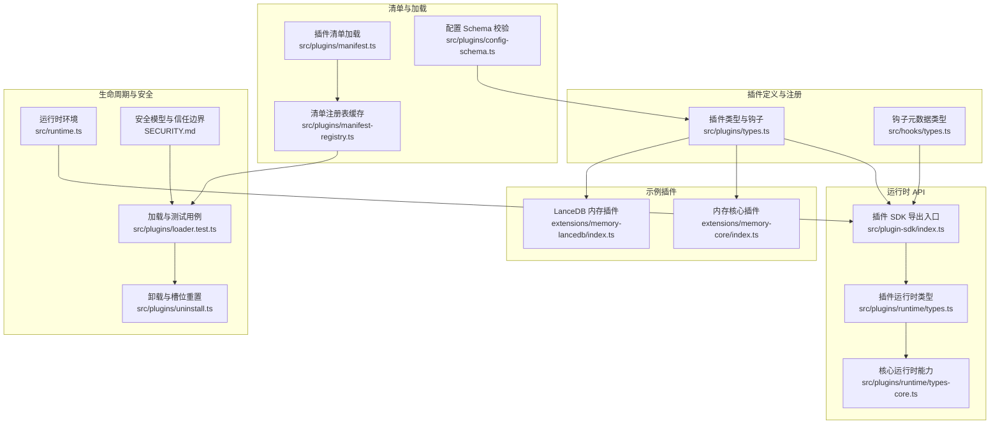
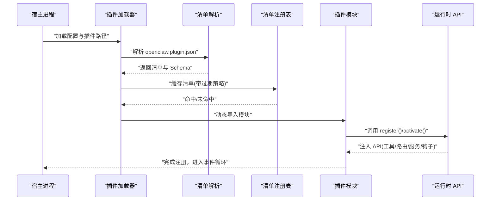
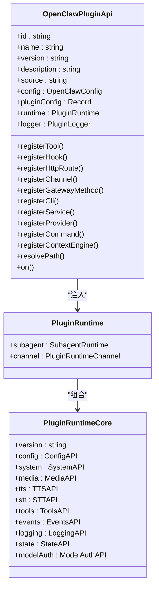
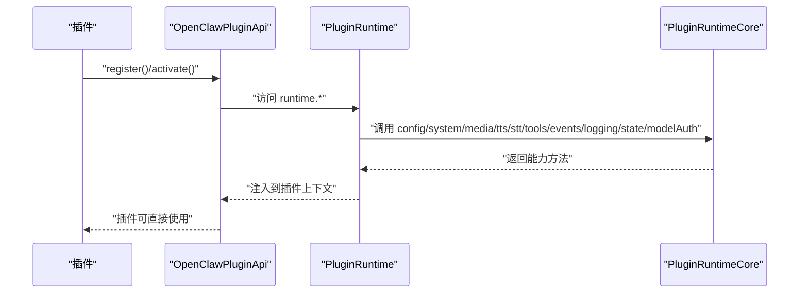
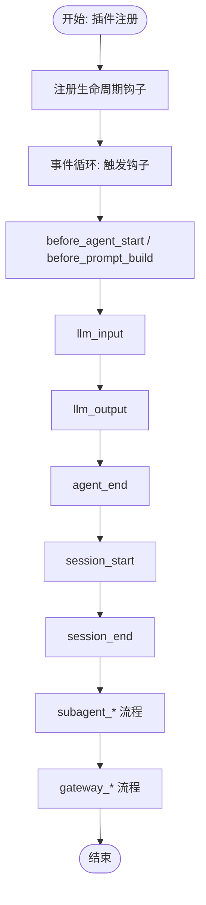
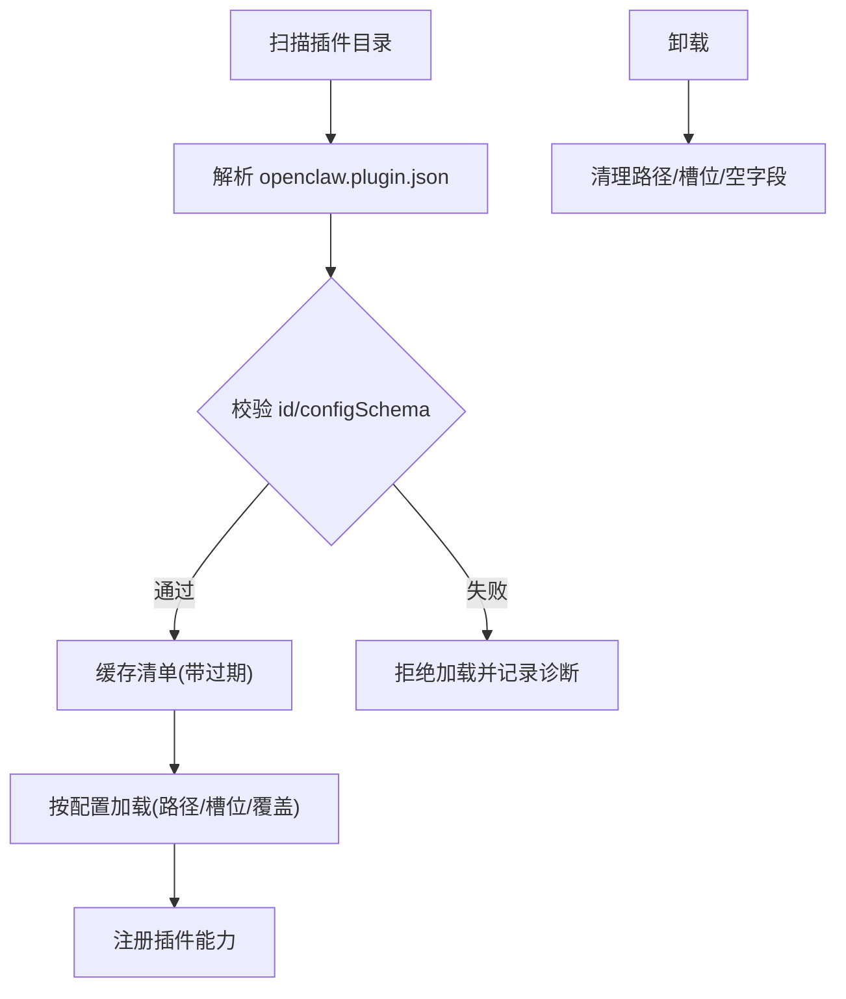
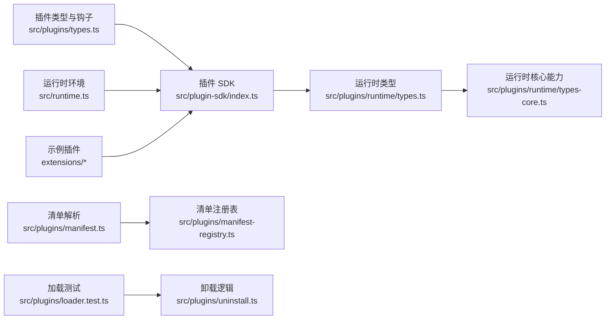

# 插件架构设计

<cite>
**本文引用的文件**
- [src/plugins/types.ts](file://src/plugins/types.ts)
- [src/plugins/runtime/types.ts](file://src/plugins/runtime/types.ts)
- [src/plugins/runtime/types-core.ts](file://src/plugins/runtime/types-core.ts)
- [src/plugin-sdk/index.ts](file://src/plugin-sdk/index.ts)
- [src/hooks/types.ts](file://src/hooks/types.ts)
- [src/plugins/config-schema.ts](file://src/plugins/config-schema.ts)
- [src/plugins/manifest.ts](file://src/plugins/manifest.ts)
- [src/plugins/manifest-registry.ts](file://src/plugins/manifest-registry.ts)
- [src/plugins/loader.test.ts](file://src/plugins/loader.test.ts)
- [src/plugins/uninstall.ts](file://src/plugins/uninstall.ts)
- [src/runtime.ts](file://src/runtime.ts)
- [extensions/memory-core/index.ts](file://extensions/memory-core/index.ts)
- [extensions/memory-lancedb/index.ts](file://extensions/memory-lancedb/index.ts)
- [SECURITY.md](file://SECURITY.md)
</cite>

## 目录

1. [引言](#引言)
2. [项目结构](#项目结构)
3. [核心组件](#核心组件)
4. [架构总览](#架构总览)
5. [详细组件分析](#详细组件分析)
6. [依赖关系分析](#依赖关系分析)
7. [性能考量](#性能考量)
8. [故障排查指南](#故障排查指南)
9. [结论](#结论)
10. [附录](#附录)

## 引言

本文件系统化阐述 OpenClaw 插件架构的设计与实现，覆盖插件加载机制、依赖注入系统、事件驱动模型、插件间通信协议与数据交换格式、生命周期管理（初始化、运行时管理、资源清理）、安全模型与权限控制，并提供架构图与组件交互流程图，最后给出扩展性设计与性能优化策略。

## 项目结构

OpenClaw 的插件体系由“插件定义与注册”“运行时 API 与依赖注入”“事件钩子与生命周期”“清单与加载器”“安全与卸载”等模块构成。核心目录与文件如下：

- 插件类型与钩子：src/plugins/types.ts、src/hooks/types.ts
- 运行时 API：src/plugin-sdk/index.ts、src/plugins/runtime/types.ts、src/plugins/runtime/types-core.ts
- 清单与注册表：src/plugins/manifest.ts、src/plugins/manifest-registry.ts
- 配置校验：src/plugins/config-schema.ts
- 加载与测试：src/plugins/loader.test.ts
- 卸载与槽位：src/plugins/uninstall.ts
- 运行时环境：src/runtime.ts
- 示例插件：extensions/memory-core/index.ts、extensions/memory-lancedb/index.ts
- 安全边界：SECURITY.md

图表来源

- [src/plugins/types.ts:1-893](file://src/plugins/types.ts#L1-L893)
- [src/hooks/types.ts:1-68](file://src/hooks/types.ts#L1-L68)
- [src/plugin-sdk/index.ts:1-826](file://src/plugin-sdk/index.ts#L1-L826)
- [src/plugins/runtime/types.ts:1-64](file://src/plugins/runtime/types.ts#L1-L64)
- [src/plugins/runtime/types-core.ts:1-68](file://src/plugins/runtime/types-core.ts#L1-L68)
- [src/plugins/manifest.ts:45-88](file://src/plugins/manifest.ts#L45-L88)
- [src/plugins/manifest-registry.ts:47-77](file://src/plugins/manifest-registry.ts#L47-L77)
- [src/plugins/config-schema.ts:1-34](file://src/plugins/config-schema.ts#L1-L34)
- [src/plugins/loader.test.ts:120-1024](file://src/plugins/loader.test.ts#L120-L1024)
- [src/plugins/uninstall.ts:106-156](file://src/plugins/uninstall.ts#L106-L156)
- [src/runtime.ts:1-54](file://src/runtime.ts#L1-L54)
- [extensions/memory-core/index.ts:1-39](file://extensions/memory-core/index.ts#L1-L39)
- [extensions/memory-lancedb/index.ts:1-679](file://extensions/memory-lancedb/index.ts#L1-L679)
- [SECURITY.md:104-110](file://SECURITY.md#L104-L110)

章节来源

- [src/plugins/types.ts:1-893](file://src/plugins/types.ts#L1-L893)
- [src/plugin-sdk/index.ts:1-826](file://src/plugin-sdk/index.ts#L1-L826)
- [src/plugins/manifest.ts:45-88](file://src/plugins/manifest.ts#L45-L88)
- [src/plugins/manifest-registry.ts:47-77](file://src/plugins/manifest-registry.ts#L47-L77)
- [src/plugins/config-schema.ts:1-34](file://src/plugins/config-schema.ts#L1-L34)
- [src/plugins/loader.test.ts:120-1024](file://src/plugins/loader.test.ts#L120-L1024)
- [src/plugins/uninstall.ts:106-156](file://src/plugins/uninstall.ts#L106-L156)
- [src/runtime.ts:1-54](file://src/runtime.ts#L1-L54)
- [extensions/memory-core/index.ts:1-39](file://extensions/memory-core/index.ts#L1-L39)
- [extensions/memory-lancedb/index.ts:1-679](file://extensions/memory-lancedb/index.ts#L1-L679)
- [SECURITY.md:104-110](file://SECURITY.md#L104-L110)

## 核心组件

- 插件 API 与类型：定义插件生命周期钩子、工具注册、HTTP 路由、CLI 注册、服务注册、上下文引擎注册、命令注册、提供商注册等能力；并提供插件配置 Schema、日志接口、运行时上下文等。
- 运行时 API：提供版本、配置读写、系统事件、命令执行、媒体处理、TTS/STT、工具工厂、会话事件、日志、状态目录、模型鉴权等能力。
- 钩子与事件：定义钩子元数据、事件列表、生命周期钩子名称集合与事件上下文类型，支持按优先级注册处理器。
- 清单与注册表：解析插件清单、校验路径安全、缓存清单以降低启动抖动。
- 配置 Schema：提供空配置 Schema 工具函数，确保插件配置可验证且可序列化。
- 加载与卸载：通过测试用例展示插件加载、禁用、槽位选择、覆盖优先级等行为；卸载时清理路径、重置槽位。
- 运行时环境：统一日志输出、错误输出与进程退出行为，支持非退出模式用于测试。
- 示例插件：内存核心插件与 LanceDB 内存插件，演示工具注册、CLI 命令、生命周期钩子、服务注册等。

章节来源

- [src/plugins/types.ts:248-306](file://src/plugins/types.ts#L248-L306)
- [src/plugins/runtime/types.ts:51-63](file://src/plugins/runtime/types.ts#L51-L63)
- [src/plugins/runtime/types-core.ts:10-67](file://src/plugins/runtime/types-core.ts#L10-L67)
- [src/hooks/types.ts:10-67](file://src/hooks/types.ts#L10-L67)
- [src/plugins/manifest.ts:45-88](file://src/plugins/manifest.ts#L45-L88)
- [src/plugins/manifest-registry.ts:47-77](file://src/plugins/manifest-registry.ts#L47-L77)
- [src/plugins/config-schema.ts:13-33](file://src/plugins/config-schema.ts#L13-L33)
- [src/plugins/loader.test.ts:953-978](file://src/plugins/loader.test.ts#L953-L978)
- [src/plugins/uninstall.ts:106-156](file://src/plugins/uninstall.ts#L106-L156)
- [src/runtime.ts:4-53](file://src/runtime.ts#L4-L53)
- [extensions/memory-core/index.ts:10-35](file://extensions/memory-core/index.ts#L10-L35)
- [extensions/memory-lancedb/index.ts:292-676](file://extensions/memory-lancedb/index.ts#L292-L676)

## 架构总览

OpenClaw 插件架构采用“声明式定义 + 运行时注入 + 事件驱动”的组合模式：

- 插件通过导出对象或函数实现注册，向 OpenClaw 提供工具、命令、HTTP 路由、服务、上下文引擎、通道适配器等能力。
- 运行时 API 将系统能力注入插件，包括配置、命令执行、媒体处理、TTS/STT、工具工厂、事件订阅、日志、状态目录、模型鉴权等。
- 事件驱动模型通过生命周期钩子贯穿消息收发、工具调用、会话生命周期、网关启停等关键阶段，插件可拦截、修改或扩展默认行为。
- 清单与注册表负责安全地解析插件根目录、读取 openclaw.plugin.json 并进行缓存，避免重复扫描与不安全路径。
- 安全模型将插件视为与本地主机代码同等信任，安装/启用即授予相应权限，报告需体现越界行为而非仅插件恶意行为。

图表来源

- [src/plugins/manifest.ts:45-88](file://src/plugins/manifest.ts#L45-L88)
- [src/plugins/manifest-registry.ts:47-77](file://src/plugins/manifest-registry.ts#L47-L77)
- [src/plugins/types.ts:248-306](file://src/plugins/types.ts#L248-L306)
- [src/plugin-sdk/index.ts:1-826](file://src/plugin-sdk/index.ts#L1-L826)

章节来源

- [src/plugins/types.ts:248-306](file://src/plugins/types.ts#L248-L306)
- [src/plugin-sdk/index.ts:1-826](file://src/plugin-sdk/index.ts#L1-L826)
- [src/plugins/manifest.ts:45-88](file://src/plugins/manifest.ts#L45-L88)
- [src/plugins/manifest-registry.ts:47-77](file://src/plugins/manifest-registry.ts#L47-L77)

## 详细组件分析

### 插件 API 与生命周期钩子

- 插件定义：支持 id/name/description/version/kind/configSchema/register/activate 等字段；kind 可为 memory/context-engine 等。
- 生命周期钩子：提供 before*model_resolve、before_prompt_build、before_agent_start、llm_input、llm_output、agent_end、before_compaction、after_compaction、before_reset、message_received、message_sending、message_sent、before_tool_call、after_tool_call、tool_result_persist、before_message_write、session_start、session_end、subagent*_、gateway\__ 等。
- 事件上下文：针对不同钩子提供事件参数与上下文对象，如 Agent、Message、Tool、Session、Subagent、Gateway 等。
- 注册能力：工具注册、HTTP 路由注册、CLI 注册、服务注册、上下文引擎注册、命令注册、提供商注册、生命周期钩子注册。

图表来源

- [src/plugins/types.ts:263-306](file://src/plugins/types.ts#L263-L306)
- [src/plugins/runtime/types.ts:51-63](file://src/plugins/runtime/types.ts#L51-L63)
- [src/plugins/runtime/types-core.ts:10-67](file://src/plugins/runtime/types-core.ts#L10-L67)

章节来源

- [src/plugins/types.ts:248-306](file://src/plugins/types.ts#L248-L306)
- [src/plugins/types.ts:321-394](file://src/plugins/types.ts#L321-L394)
- [src/plugins/types.ts:787-806](file://src/plugins/types.ts#L787-L806)
- [src/plugins/runtime/types.ts:51-63](file://src/plugins/runtime/types.ts#L51-L63)
- [src/plugins/runtime/types-core.ts:10-67](file://src/plugins/runtime/types-core.ts#L10-L67)

### 运行时 API 与依赖注入

- 依赖注入：运行时 API 暴露配置读写、系统事件、命令执行、媒体处理、TTS/STT、工具工厂、事件订阅、日志、状态目录、模型鉴权等能力，插件通过 api.runtime 使用。
- 日志：提供 getChildLogger 绑定与级别控制，统一日志输出。
- 模型鉴权：按 provider 或 model 解析 API Key，支持外部凭据刷新。
- 子代理运行：提供 run/wait/getSession/deleteSession 等子会话生命周期操作。

图表来源

- [src/plugin-sdk/index.ts:1-826](file://src/plugin-sdk/index.ts#L1-L826)
- [src/plugins/runtime/types.ts:51-63](file://src/plugins/runtime/types.ts#L51-L63)
- [src/plugins/runtime/types-core.ts:10-67](file://src/plugins/runtime/types-core.ts#L10-L67)

章节来源

- [src/plugin-sdk/index.ts:1-826](file://src/plugin-sdk/index.ts#L1-L826)
- [src/plugins/runtime/types.ts:51-63](file://src/plugins/runtime/types.ts#L51-L63)
- [src/plugins/runtime/types-core.ts:10-67](file://src/plugins/runtime/types-core.ts#L10-L67)

### 事件驱动模型与生命周期

- 钩子注册：插件通过 api.on 注册生命周期钩子处理器，支持优先级。
- 典型流程：before*agent_start → llm_input → llm_output → agent_end；消息流：message_received → message_sending → message_sent；会话流：session_start → session_end；子代理流：subagent*\*；网关流：gateway_start/gateway_stop。
- 钩子事件：每个钩子对应事件对象与上下文，插件可返回结果以影响后续流程（如修改提示词、阻断工具调用、阻断消息写入）。

图表来源

- [src/plugins/types.ts:321-394](file://src/plugins/types.ts#L321-L394)
- [src/plugins/types.ts:787-806](file://src/plugins/types.ts#L787-L806)

章节来源

- [src/plugins/types.ts:321-394](file://src/plugins/types.ts#L321-L394)
- [src/plugins/types.ts:787-806](file://src/plugins/types.ts#L787-L806)

### 插件加载机制与清单系统

- 清单解析：读取 openclaw.plugin.json，校验 id、configSchema 等字段，拒绝硬链接路径，保证安全性。
- 清单注册表：短时缓存清单，合并突发加载，减少启动抖动。
- 加载策略：支持从路径加载、槽位选择、禁用特定插件、覆盖优先级等。
- 卸载策略：移除路径、重置槽位、清理空字段。

图表来源

- [src/plugins/manifest.ts:45-88](file://src/plugins/manifest.ts#L45-L88)
- [src/plugins/manifest-registry.ts:47-77](file://src/plugins/manifest-registry.ts#L47-L77)
- [src/plugins/loader.test.ts:953-978](file://src/plugins/loader.test.ts#L953-L978)
- [src/plugins/uninstall.ts:106-156](file://src/plugins/uninstall.ts#L106-L156)

章节来源

- [src/plugins/manifest.ts:45-88](file://src/plugins/manifest.ts#L45-L88)
- [src/plugins/manifest-registry.ts:47-77](file://src/plugins/manifest-registry.ts#L47-L77)
- [src/plugins/loader.test.ts:953-978](file://src/plugins/loader.test.ts#L953-L978)
- [src/plugins/uninstall.ts:106-156](file://src/plugins/uninstall.ts#L106-L156)

### 插件间通信协议与数据交换格式

- 插件间通信：通过共享运行时 API 与事件系统协作；插件可订阅会话事件、系统事件，实现跨插件数据流转。
- 数据交换：工具参数与结果采用结构化对象；消息内容支持文本与富媒体；钩子事件参数为强类型对象，便于序列化与反序列化。
- HTTP 路由：插件可注册 HTTP 路由，支持认证策略（gateway/plugin），匹配方式（exact/prefix）。

章节来源

- [src/plugins/types.ts:208-219](file://src/plugins/types.ts#L208-L219)
- [src/plugins/types.ts:594-669](file://src/plugins/types.ts#L594-L669)
- [src/plugin-sdk/index.ts:125-126](file://src/plugin-sdk/index.ts#L125-L126)

### 插件生命周期管理

- 初始化：插件在 register/activate 中完成能力注册与资源准备。
- 运行时管理：通过钩子与运行时 API 实现动态行为控制与状态维护。
- 资源清理：服务 stop 回调、卸载时路径与槽位清理、空字段剔除。

章节来源

- [src/plugins/types.ts:248-257](file://src/plugins/types.ts#L248-L257)
- [src/plugins/types.ts:237-241](file://src/plugins/types.ts#L237-L241)
- [src/plugins/uninstall.ts:106-156](file://src/plugins/uninstall.ts#L106-L156)

### 安全模型与权限控制

- 信任边界：安装/启用插件等同于本地主机代码信任级别，允许读取环境变量/文件、执行主机命令等。
- 报告要求：安全报告必须展示越界（如未授权加载、白名单/策略绕过、沙箱/路径安全绕过），而不仅是插件的恶意行为。
- 清单安全：拒绝硬链接路径，解析失败与格式错误均被拒绝。

章节来源

- [SECURITY.md:104-110](file://SECURITY.md#L104-L110)
- [src/plugins/manifest.ts:45-88](file://src/plugins/manifest.ts#L45-L88)

### 示例插件实践

- 内存核心插件：注册内存搜索与获取工具，提供 CLI 命令。
- LanceDB 内存插件：提供向量检索、自动回忆与自动捕获、CLI 命令、生命周期钩子、服务注册。

章节来源

- [extensions/memory-core/index.ts:10-35](file://extensions/memory-core/index.ts#L10-L35)
- [extensions/memory-lancedb/index.ts:292-676](file://extensions/memory-lancedb/index.ts#L292-L676)

## 依赖关系分析

- 插件 API 依赖运行时 API；运行时 API 依赖系统模块（配置、命令、媒体、TTS/STT、工具、事件、日志、状态目录、模型鉴权）。
- 钩子系统与事件订阅解耦插件与宿主；清单系统与注册表解耦插件发现与加载。
- 示例插件依赖插件 API 与运行时 API，形成“定义—注入—协作”的清晰依赖链。

图表来源

- [src/plugins/types.ts:1-893](file://src/plugins/types.ts#L1-L893)
- [src/plugin-sdk/index.ts:1-826](file://src/plugin-sdk/index.ts#L1-L826)
- [src/plugins/runtime/types.ts:1-64](file://src/plugins/runtime/types.ts#L1-L64)
- [src/plugins/runtime/types-core.ts:1-68](file://src/plugins/runtime/types-core.ts#L1-L68)
- [src/plugins/manifest.ts:45-88](file://src/plugins/manifest.ts#L45-L88)
- [src/plugins/manifest-registry.ts:47-77](file://src/plugins/manifest-registry.ts#L47-L77)
- [src/plugins/loader.test.ts:120-1024](file://src/plugins/loader.test.ts#L120-L1024)
- [src/plugins/uninstall.ts:106-156](file://src/plugins/uninstall.ts#L106-L156)
- [src/runtime.ts:1-54](file://src/runtime.ts#L1-L54)
- [extensions/memory-core/index.ts:1-39](file://extensions/memory-core/index.ts#L1-L39)
- [extensions/memory-lancedb/index.ts:1-679](file://extensions/memory-lancedb/index.ts#L1-L679)

章节来源

- [src/plugins/types.ts:1-893](file://src/plugins/types.ts#L1-L893)
- [src/plugin-sdk/index.ts:1-826](file://src/plugin-sdk/index.ts#L1-L826)
- [src/plugins/runtime/types.ts:1-64](file://src/plugins/runtime/types.ts#L1-L64)
- [src/plugins/runtime/types-core.ts:1-68](file://src/plugins/runtime/types-core.ts#L1-L68)
- [src/plugins/manifest.ts:45-88](file://src/plugins/manifest.ts#L45-L88)
- [src/plugins/manifest-registry.ts:47-77](file://src/plugins/manifest-registry.ts#L47-L77)
- [src/plugins/loader.test.ts:120-1024](file://src/plugins/loader.test.ts#L120-L1024)
- [src/plugins/uninstall.ts:106-156](file://src/plugins/uninstall.ts#L106-L156)
- [src/runtime.ts:1-54](file://src/runtime.ts#L1-L54)
- [extensions/memory-core/index.ts:1-39](file://extensions/memory-core/index.ts#L1-L39)
- [extensions/memory-lancedb/index.ts:1-679](file://extensions/memory-lancedb/index.ts#L1-L679)

## 性能考量

- 清单缓存：通过短时缓存与可配置过期时间降低重复扫描成本，合并突发加载请求。
- 启动抖动抑制：注册表缓存窗口与禁用开关共同作用，避免频繁 I/O。
- 钩子执行：建议插件在钩子中尽量做轻量处理，复杂任务异步化或延迟到后台服务。
- 子代理运行：合理设置 idempotencyKey 与超时，避免重复执行与资源争用。
- 媒体与模型调用：批量处理媒体与嵌入计算，利用并发但受控的队列限制。

章节来源

- [src/plugins/manifest-registry.ts:47-77](file://src/plugins/manifest-registry.ts#L47-L77)
- [src/plugins/runtime/types.ts:8-49](file://src/plugins/runtime/types.ts#L8-L49)

## 故障排查指南

- 清单解析失败：检查 openclaw.plugin.json 是否存在、格式是否正确、字段是否完整；确认路径安全（拒绝硬链接）。
- 插件加载失败：查看加载测试中的断言与诊断信息，确认路径、槽位、覆盖优先级是否符合预期。
- 卸载异常：确认路径移除、槽位重置与空字段清理逻辑是否生效。
- 运行时日志：使用 getChildLogger 绑定上下文键值，提升可观测性；注意在测试环境下开启详细日志。

章节来源

- [src/plugins/manifest.ts:45-88](file://src/plugins/manifest.ts#L45-L88)
- [src/plugins/loader.test.ts:953-978](file://src/plugins/loader.test.ts#L953-L978)
- [src/plugins/uninstall.ts:106-156](file://src/plugins/uninstall.ts#L106-L156)
- [src/plugins/runtime/types-core.ts:47-50](file://src/plugins/runtime/types-core.ts#L47-L50)

## 结论

OpenClaw 插件架构以“声明式定义 + 运行时注入 + 事件驱动”为核心，结合清单系统与安全边界，提供了高扩展性与可控性的插件生态。通过钩子与运行时 API，插件可在关键生命周期节点进行增强与定制；通过配置 Schema 与卸载策略，保障了配置一致性与运行时整洁。建议在生产环境中充分利用清单缓存、钩子优先级与子代理运行能力，持续优化性能与稳定性。

## 附录

- 关键类型与接口参考：插件定义、运行时 API、钩子事件、HTTP 路由、CLI 注册、服务注册、提供商注册、命令注册、上下文引擎注册等。
- 示例插件参考：内存核心插件与 LanceDB 内存插件展示了工具注册、CLI 命令、生命周期钩子与服务注册的完整实践。

章节来源

- [src/plugins/types.ts:248-306](file://src/plugins/types.ts#L248-L306)
- [src/plugin-sdk/index.ts:1-826](file://src/plugin-sdk/index.ts#L1-L826)
- [extensions/memory-core/index.ts:10-35](file://extensions/memory-core/index.ts#L10-L35)
- [extensions/memory-lancedb/index.ts:292-676](file://extensions/memory-lancedb/index.ts#L292-L676)
