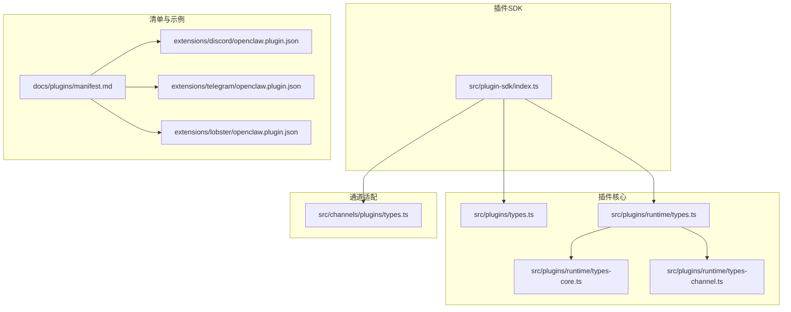
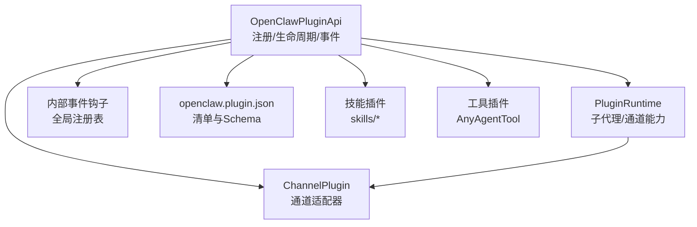
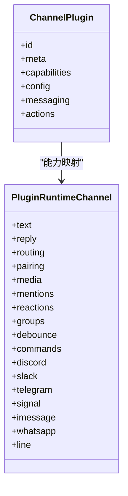
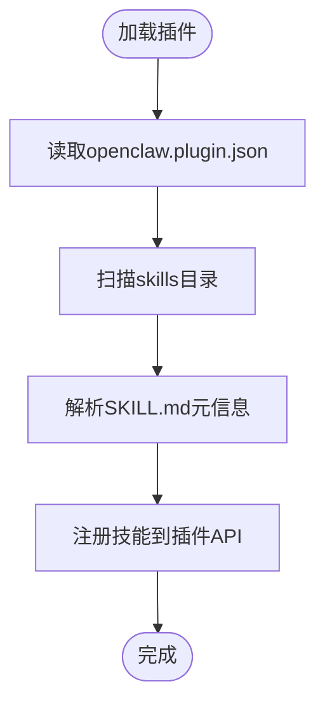
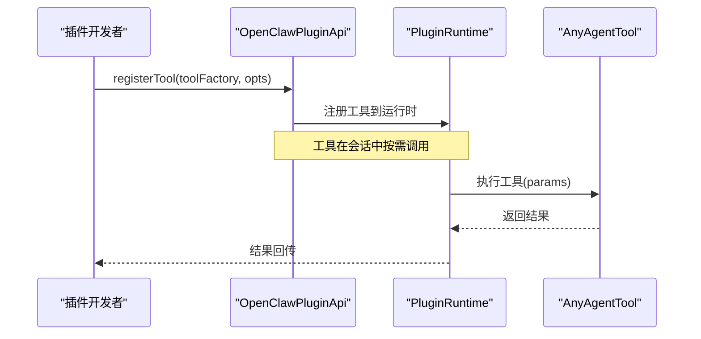
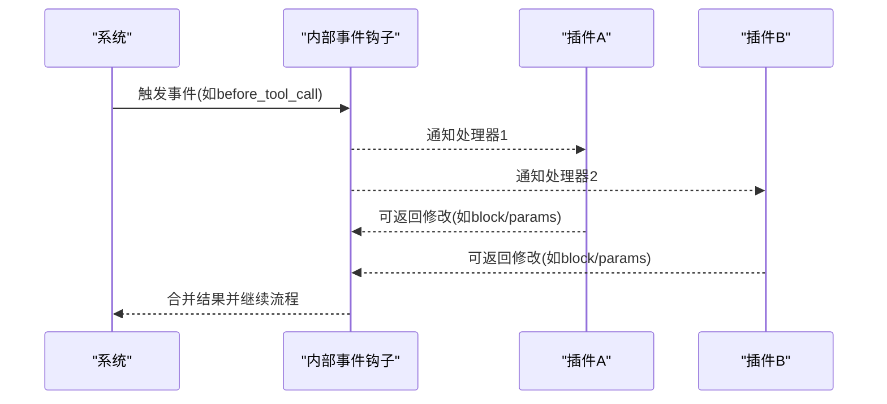
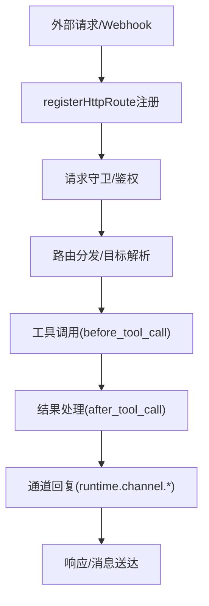
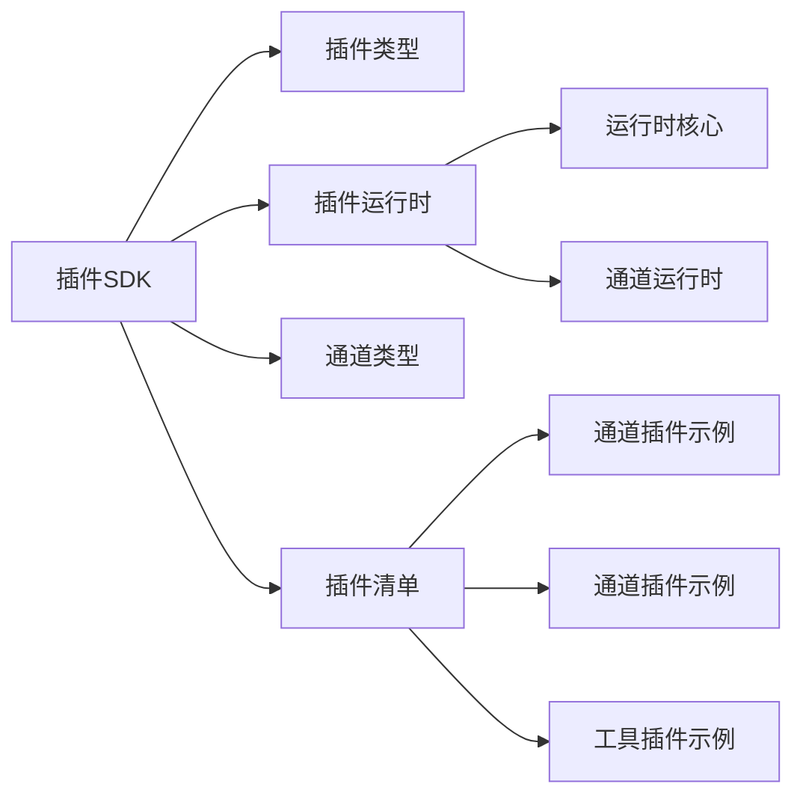

# 插件类型与架构

<cite>
**本文引用的文件**
- [src/plugin-sdk/index.ts](file://src/plugin-sdk/index.ts)
- [src/plugins/types.ts](file://src/plugins/types.ts)
- [src/plugins/runtime/types.ts](file://src/plugins/runtime/types.ts)
- [src/plugins/runtime/types-core.ts](file://src/plugins/runtime/types-core.ts)
- [src/plugins/runtime/types-channel.ts](file://src/plugins/runtime/types-channel.ts)
- [src/channels/plugins/types.ts](file://src/channels/plugins/types.ts)
- [docs/plugins/manifest.md](file://docs/plugins/manifest.md)
- [extensions/discord/openclaw.plugin.json](file://extensions/discord/openclaw.plugin.json)
- [extensions/telegram/openclaw.plugin.json](file://extensions/telegram/openclaw.plugin.json)
- [extensions/lobster/openclaw.plugin.json](file://extensions/lobster/openclaw.plugin.json)
- [src/hooks/internal-hooks.ts](file://src/hooks/internal-hooks.ts)
- [src/agents/test-helpers/skill-plugin-fixtures.ts](file://src/agents/test-helpers/skill-plugin-fixtures.ts)
- [docs/zh-CN/refactor/plugin-sdk.md](file://docs/zh-CN/refactor/plugin-sdk.md)
</cite>

## 目录

1. [引言](#引言)
2. [项目结构](#项目结构)
3. [核心组件](#核心组件)
4. [架构总览](#架构总览)
5. [详细组件分析](#详细组件分析)
6. [依赖分析](#依赖分析)
7. [性能考虑](#性能考虑)
8. [故障排查指南](#故障排查指南)
9. [结论](#结论)
10. [附录](#附录)

## 引言

本文件面向OpenClaw插件开发者与维护者，系统化阐述插件类型与架构设计，重点覆盖三类插件：通道插件、技能插件与工具插件；并深入解析插件生命周期、依赖注入、事件系统与API接口。文档同时提供架构图与组件关系说明，帮助读者建立对插件系统整体设计思路的理解，并掌握插件间通信机制与数据流转模式。

## 项目结构

OpenClaw的插件体系由“插件SDK”“插件运行时”“通道适配器”“事件钩子”等模块构成，围绕统一的插件API进行扩展与集成。关键目录与文件如下：

- 插件SDK入口与导出：src/plugin-sdk/index.ts
- 插件类型定义：src/plugins/types.ts
- 插件运行时类型：src/plugins/runtime/types.ts、types-core.ts、types-channel.ts
- 通道插件类型：src/channels/plugins/types.ts
- 插件清单规范：docs/plugins/manifest.md
- 示例插件清单：extensions/\*/openclaw.plugin.json
- 内部事件钩子注册：src/hooks/internal-hooks.ts
- 技能与插件集成测试夹具：src/agents/test-helpers/skill-plugin-fixtures.ts
- 插件SDK接口建议（重构文档）：docs/zh-CN/refactor/plugin-sdk.md

**图表来源**

- [src/plugin-sdk/index.ts:1-826](file://src/plugin-sdk/index.ts#L1-L826)
- [src/plugins/types.ts:1-893](file://src/plugins/types.ts#L1-L893)
- [src/plugins/runtime/types.ts:1-64](file://src/plugins/runtime/types.ts#L1-L64)
- [src/plugins/runtime/types-core.ts:1-68](file://src/plugins/runtime/types-core.ts#L1-L68)
- [src/plugins/runtime/types-channel.ts:1-166](file://src/plugins/runtime/types-channel.ts#L1-L166)
- [src/channels/plugins/types.ts:1-66](file://src/channels/plugins/types.ts#L1-L66)
- [docs/plugins/manifest.md:1-76](file://docs/plugins/manifest.md#L1-L76)
- [extensions/discord/openclaw.plugin.json:1-10](file://extensions/discord/openclaw.plugin.json#L1-L10)
- [extensions/telegram/openclaw.plugin.json:1-10](file://extensions/telegram/openclaw.plugin.json#L1-L10)
- [extensions/lobster/openclaw.plugin.json:1-11](file://extensions/lobster/openclaw.plugin.json#L1-L11)

**章节来源**

- [src/plugin-sdk/index.ts:1-826](file://src/plugin-sdk/index.ts#L1-L826)
- [src/plugins/types.ts:1-893](file://src/plugins/types.ts#L1-L893)
- [src/plugins/runtime/types.ts:1-64](file://src/plugins/runtime/types.ts#L1-L64)
- [src/plugins/runtime/types-core.ts:1-68](file://src/plugins/runtime/types-core.ts#L1-L68)
- [src/plugins/runtime/types-channel.ts:1-166](file://src/plugins/runtime/types-channel.ts#L1-L166)
- [src/channels/plugins/types.ts:1-66](file://src/channels/plugins/types.ts#L1-L66)
- [docs/plugins/manifest.md:1-76](file://docs/plugins/manifest.md#L1-L76)
- [extensions/discord/openclaw.plugin.json:1-10](file://extensions/discord/openclaw.plugin.json#L1-L10)
- [extensions/telegram/openclaw.plugin.json:1-10](file://extensions/telegram/openclaw.plugin.json#L1-L10)
- [extensions/lobster/openclaw.plugin.json:1-11](file://extensions/lobster/openclaw.plugin.json#L1-L11)

## 核心组件

- 插件API（OpenClawPluginApi）
  - 提供注册工具、命令、HTTP路由、通道、网关方法、CLI、服务、上下文引擎、路径解析与生命周期钩子等能力。
  - 关键方法：registerTool、registerCommand、registerHttpRoute、registerChannel、registerGatewayMethod、registerCli、registerService、registerContextEngine、on。
- 插件运行时（PluginRuntime）
  - 提供子代理运行、等待、会话消息读取、删除会话等能力；并封装通道能力（文本分块、回复派发、路由、配对、媒体、提及、群组策略、去抖、命令等）。
- 插件类型与生命周期
  - 插件生命周期钩子：before_model_resolve、before_prompt_build、before_agent_start、llm_input、llm_output、agent_end、before_compaction、after_compaction、before_reset、message_received、message_sending、message_sent、before_tool_call、after_tool_call、tool_result_persist、before_message_write、session_start、session_end、subagent_spawning、subagent_delivery_target、subagent_spawned、subagent_ended、gateway_start、gateway_stop。
  - 生命周期钩子注册：通过OpenClawPluginApi.on注册，支持优先级。
- 事件系统
  - 内部事件钩子注册表使用全局单例，保证多模块打包场景下处理器可见性一致。
- 清单与配置
  - 每个插件必须提供openclaw.plugin.json，包含id、configSchema以及可选字段（kind、channels、providers、skills、name、description、uiHints、version）。
  - 配置Schema在读写配置阶段进行严格校验，缺失或非法将阻断验证。

**章节来源**

- [src/plugins/types.ts:248-306](file://src/plugins/types.ts#L248-L306)
- [src/plugins/runtime/types.ts:51-64](file://src/plugins/runtime/types.ts#L51-L64)
- [src/plugins/runtime/types-core.ts:10-67](file://src/plugins/runtime/types-core.ts#L10-L67)
- [src/plugins/runtime/types-channel.ts:16-166](file://src/plugins/runtime/types-channel.ts#L16-L166)
- [src/plugins/types.ts:321-377](file://src/plugins/types.ts#L321-L377)
- [src/hooks/internal-hooks.ts:174-193](file://src/hooks/internal-hooks.ts#L174-L193)
- [docs/plugins/manifest.md:9-76](file://docs/plugins/manifest.md#L9-L76)

## 架构总览

OpenClaw插件架构以“插件API”为中心，向上对接通道适配器与事件系统，向下提供运行时能力与HTTP/Webhook路由。通道插件负责消息收发、权限与策略、动作处理等；技能插件与工具插件分别承载“可被调用的能力集合”和“具体工具实现”，并通过插件API进行注册与调度。

**图表来源**

- [src/plugins/types.ts:248-306](file://src/plugins/types.ts#L248-L306)
- [src/plugins/runtime/types.ts:51-64](file://src/plugins/runtime/types.ts#L51-L64)
- [src/channels/plugins/types.ts:1-66](file://src/channels/plugins/types.ts#L1-L66)
- [src/hooks/internal-hooks.ts:174-193](file://src/hooks/internal-hooks.ts#L174-L193)
- [docs/plugins/manifest.md:9-76](file://docs/plugins/manifest.md#L9-L76)

## 详细组件分析

### 通道插件（Channel Plugin）

- 职责边界
  - 封装特定消息渠道（如Discord、Telegram、Slack等）的认证、配置、消息收发、目录查询、心跳、安全策略、线程与提及处理、动作处理等。
  - 通过ChannelPlugin接口暴露capabilities、config、messaging、actions等能力。
- 设计要点
  - 统一的通道元数据与能力声明，便于路由与策略决策。
  - 通道能力按功能域拆分（文本、回复、路由、配对、媒体、提及、群组策略、去抖、命令等），便于插件按需调用。
- 实现差异
  - 不同通道在types-channel中提供专属方法（例如Discord、Slack、Telegram、Signal、iMessage、WhatsApp、LINE等），插件通过runtime.channel.<channel>访问。
- 典型清单
  - 示例清单展示通道插件的id与channels字段，用于声明该插件为通道插件并注册对应通道。

**图表来源**

- [src/channels/plugins/types.ts:1-66](file://src/channels/plugins/types.ts#L1-L66)
- [src/plugins/runtime/types-channel.ts:16-166](file://src/plugins/runtime/types-channel.ts#L16-L166)

**章节来源**

- [src/channels/plugins/types.ts:1-66](file://src/channels/plugins/types.ts#L1-L66)
- [src/plugins/runtime/types-channel.ts:16-166](file://src/plugins/runtime/types-channel.ts#L16-L166)
- [extensions/discord/openclaw.plugin.json:1-10](file://extensions/discord/openclaw.plugin.json#L1-L10)
- [extensions/telegram/openclaw.plugin.json:1-10](file://extensions/telegram/openclaw.plugin.json#L1-L10)

### 技能插件（Skill Plugin）

- 定义与加载
  - 技能位于插件根目录下的skills目录，每个技能以独立目录存在，并通过SKILL.md声明元信息。
  - 插件清单可通过skills字段声明技能目录，系统在加载插件时自动扫描并注册技能。
- 设计要点
  - 技能是“可被调用的能力单元”，通常与插件API的registerTool配合，形成“工具工厂+技能描述”的组合。
  - 测试夹具展示了如何生成一个带技能的插件结构，便于本地开发与集成测试。
- 与通道插件的关系
  - 技能插件可被通道插件的动作或菜单所绑定，形成“输入—动作—输出”的闭环。

**图表来源**

- [docs/plugins/manifest.md:9-76](file://docs/plugins/manifest.md#L9-L76)
- [src/agents/test-helpers/skill-plugin-fixtures.ts:1-30](file://src/agents/test-helpers/skill-plugin-fixtures.ts#L1-L30)

**章节来源**

- [docs/plugins/manifest.md:9-76](file://docs/plugins/manifest.md#L9-L76)
- [src/agents/test-helpers/skill-plugin-fixtures.ts:1-30](file://src/agents/test-helpers/skill-plugin-fixtures.ts#L1-L30)

### 工具插件（Tool Plugin）

- 定义与注册
  - 工具插件通过OpenClawPluginApi.registerTool或registerTool工厂函数注册工具，工具类型为AnyAgentTool或数组。
  - 工具上下文（OpenClawPluginToolContext）提供会话、请求者身份、沙箱状态等信息，便于工具执行时进行鉴权与隔离。
- 设计要点
  - 工具插件强调“可复用的原子能力”，与技能插件互补：技能更偏向“能力集合”，工具更偏向“具体实现”。
  - 工具可在before_tool_call/after_tool_call钩子中被拦截与增强，实现审计、限流、结果清洗等横切关注点。

**图表来源**

- [src/plugins/types.ts:75-78](file://src/plugins/types.ts#L75-L78)
- [src/plugins/types.ts:273-276](file://src/plugins/types.ts#L273-L276)
- [src/plugins/runtime/types.ts:51-64](file://src/plugins/runtime/types.ts#L51-L64)

**章节来源**

- [src/plugins/types.ts:75-78](file://src/plugins/types.ts#L75-L78)
- [src/plugins/types.ts:273-276](file://src/plugins/types.ts#L273-L276)
- [src/plugins/runtime/types.ts:51-64](file://src/plugins/runtime/types.ts#L51-L64)

### 插件生命周期与事件系统

- 生命周期钩子
  - 包含模型解析、提示构建、代理启动、LLM输入/输出、会话开始/结束、工具调用前后、消息发送前后、压缩与重置、子代理孵化/交付/结束、网关启停等。
  - 通过OpenClawPluginApi.on注册，支持优先级排序。
- 内部事件钩子
  - 使用全局单例Map维护事件到处理器的映射，避免多模块打包导致的处理器不可见问题。
- 数据与控制流
  - 钩子事件携带上下文（如agentId、sessionKey、sessionId、runId、toolName、toolCallId等），便于跨插件协作与可观测性。

**图表来源**

- [src/plugins/types.ts:321-377](file://src/plugins/types.ts#L321-L377)
- [src/hooks/internal-hooks.ts:174-193](file://src/hooks/internal-hooks.ts#L174-L193)

**章节来源**

- [src/plugins/types.ts:321-377](file://src/plugins/types.ts#L321-L377)
- [src/hooks/internal-hooks.ts:174-193](file://src/hooks/internal-hooks.ts#L174-L193)

### 插件间通信与数据流转

- 通道层
  - 通过runtime.channel.<channel>访问各通道能力，实现跨通道的一致性抽象。
- 工具层
  - 工具调用在before_tool_call/after_tool_call钩子中被拦截，支持参数修改、阻断与结果清洗。
- 技能层
  - 技能通过插件API注册后，可被通道动作或菜单触发，形成“输入—动作—输出”的闭环。
- HTTP/Webhook层
  - 插件可通过registerHttpRoute注册HTTP路由，结合Webhook目标解析与守卫，实现外部系统与插件的双向交互。

**图表来源**

- [src/plugins/types.ts:282-283](file://src/plugins/types.ts#L282-L283)
- [src/plugins/runtime/types-channel.ts:16-166](file://src/plugins/runtime/types-channel.ts#L16-L166)
- [src/plugins/types.ts:606-633](file://src/plugins/types.ts#L606-L633)

**章节来源**

- [src/plugins/types.ts:282-283](file://src/plugins/types.ts#L282-L283)
- [src/plugins/runtime/types-channel.ts:16-166](file://src/plugins/runtime/types-channel.ts#L16-L166)
- [src/plugins/types.ts:606-633](file://src/plugins/types.ts#L606-L633)

## 依赖分析

- 模块耦合
  - 插件SDK对插件类型、运行时、通道类型形成强依赖；运行时对系统事件、媒体、TTS/STT、内存工具、日志与状态目录等形成依赖。
  - 通道能力在types-channel中集中声明，插件通过统一命名空间访问，降低耦合度。
- 外部依赖与集成点
  - 清单与Schema校验在配置读写阶段执行，确保插件在未执行代码前即通过验证。
  - 插件清单中的channels/providers/skills字段决定插件的发现与装配范围。
- 循环依赖风险
  - 事件钩子采用全局单例注册表，避免多模块打包导致的循环依赖与处理器丢失问题。

**图表来源**

- [src/plugin-sdk/index.ts:1-826](file://src/plugin-sdk/index.ts#L1-L826)
- [src/plugins/types.ts:1-893](file://src/plugins/types.ts#L1-L893)
- [src/plugins/runtime/types.ts:1-64](file://src/plugins/runtime/types.ts#L1-L64)
- [src/plugins/runtime/types-core.ts:1-68](file://src/plugins/runtime/types-core.ts#L1-L68)
- [src/plugins/runtime/types-channel.ts:1-166](file://src/plugins/runtime/types-channel.ts#L1-L166)
- [src/channels/plugins/types.ts:1-66](file://src/channels/plugins/types.ts#L1-L66)
- [docs/plugins/manifest.md:1-76](file://docs/plugins/manifest.md#L1-L76)
- [extensions/discord/openclaw.plugin.json:1-10](file://extensions/discord/openclaw.plugin.json#L1-L10)
- [extensions/telegram/openclaw.plugin.json:1-10](file://extensions/telegram/openclaw.plugin.json#L1-L10)
- [extensions/lobster/openclaw.plugin.json:1-11](file://extensions/lobster/openclaw.plugin.json#L1-L11)

**章节来源**

- [src/plugin-sdk/index.ts:1-826](file://src/plugin-sdk/index.ts#L1-L826)
- [src/plugins/types.ts:1-893](file://src/plugins/types.ts#L1-L893)
- [src/plugins/runtime/types.ts:1-64](file://src/plugins/runtime/types.ts#L1-L64)
- [src/plugins/runtime/types-core.ts:1-68](file://src/plugins/runtime/types-core.ts#L1-L68)
- [src/plugins/runtime/types-channel.ts:1-166](file://src/plugins/runtime/types-channel.ts#L1-L166)
- [src/channels/plugins/types.ts:1-66](file://src/channels/plugins/types.ts#L1-L66)
- [docs/plugins/manifest.md:1-76](file://docs/plugins/manifest.md#L1-L76)
- [extensions/discord/openclaw.plugin.json:1-10](file://extensions/discord/openclaw.plugin.json#L1-L10)
- [extensions/telegram/openclaw.plugin.json:1-10](file://extensions/telegram/openclaw.plugin.json#L1-L10)
- [extensions/lobster/openclaw.plugin.json:1-11](file://extensions/lobster/openclaw.plugin.json#L1-L11)

## 性能考虑

- 去抖与批处理
  - inbound去抖器与缓冲块派发器可减少重复处理与网络抖动，提升吞吐与稳定性。
- 文本分块与Markdown表格处理
  - 按通道与账号的文本分块限制与表格渲染策略，有助于控制消息大小与兼容性。
- 子代理运行与等待
  - 子代理运行支持幂等键与超时控制，避免资源泄漏与长时间阻塞。
- 日志与可观测性
  - 运行时提供子日志器与状态目录解析，便于插件在不同粒度下记录诊断信息。

[本节为通用指导，无需列出具体文件来源]

## 故障排查指南

- 清单与Schema错误
  - 若openclaw.plugin.json缺失或Schema不合法，将阻断配置验证；请检查必需字段与JSON Schema。
- 通道能力不可用
  - 确认插件是否正确注册为通道插件（channels字段），并确保通道能力在types-channel中可用。
- 工具调用被阻断
  - 检查before_tool_call钩子是否返回block或修改了参数；必要时调整工具权限与策略。
- 事件钩子无效
  - 确认使用OpenClawPluginApi.on注册钩子且优先级设置合理；内部钩子使用全局单例注册表，避免多模块打包导致的处理器丢失。

**章节来源**

- [docs/plugins/manifest.md:9-76](file://docs/plugins/manifest.md#L9-L76)
- [src/plugins/runtime/types-channel.ts:16-166](file://src/plugins/runtime/types-channel.ts#L16-L166)
- [src/plugins/types.ts:606-633](file://src/plugins/types.ts#L606-L633)
- [src/hooks/internal-hooks.ts:174-193](file://src/hooks/internal-hooks.ts#L174-L193)

## 结论

OpenClaw插件系统通过统一的插件API、严格的清单与Schema校验、完善的运行时能力与事件钩子，实现了通道插件、技能插件与工具插件的解耦与协同。通道插件提供跨平台的消息与策略抽象，技能插件承载能力集合，工具插件提供原子能力实现。借助生命周期钩子与HTTP/Webhook路由，插件间可以高效通信与协作，满足复杂场景下的扩展需求。

[本节为总结性内容，无需列出具体文件来源]

## 附录

- 插件SDK接口建议（来自重构文档）
  - 建议的接口涵盖文本分块、回复派发、路由、配对、媒体、提及、群组策略、去抖、命令授权等能力，便于插件在统一抽象下实现跨通道一致性。

**章节来源**

- [docs/zh-CN/refactor/plugin-sdk.md:52-152](file://docs/zh-CN/refactor/plugin-sdk.md#L52-L152)
