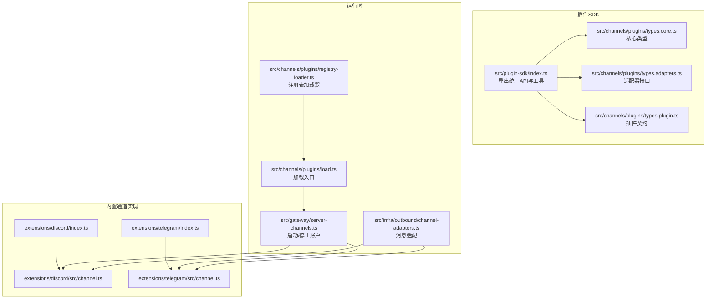
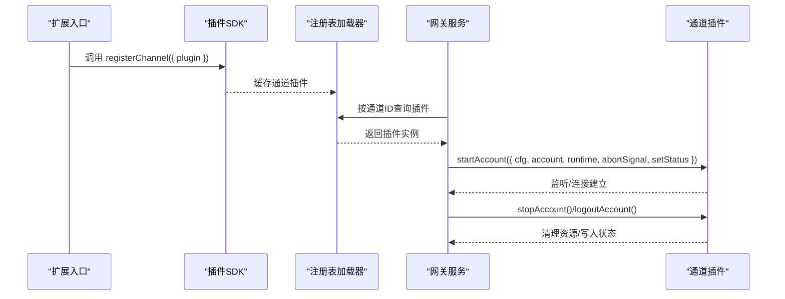
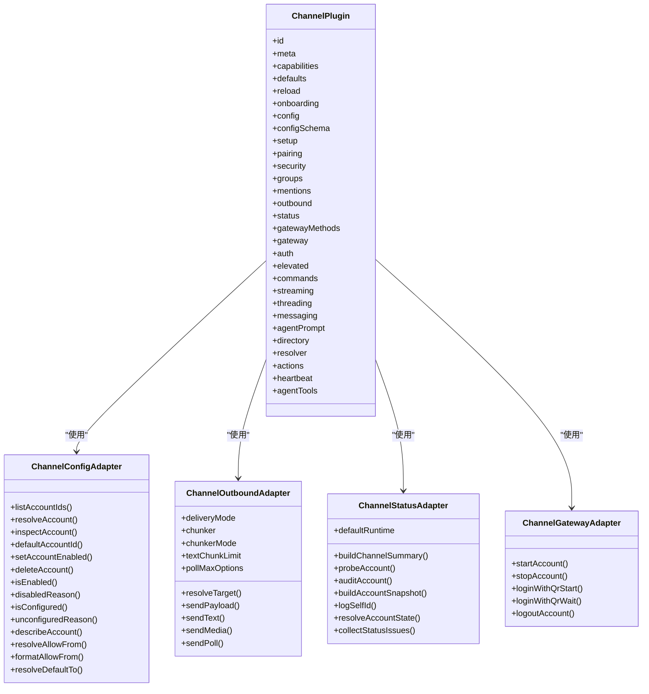
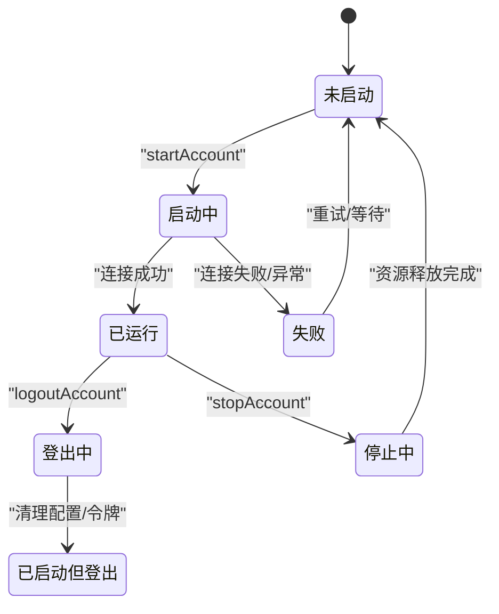
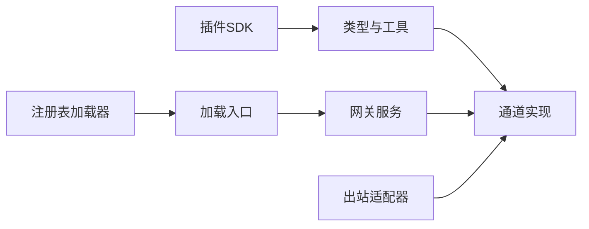

# 通道插件

<cite>
**本文引用的文件**
- [src/plugin-sdk/index.ts](file://src/plugin-sdk/index.ts)
- [src/channels/plugins/types.core.ts](file://src/channels/plugins/types.core.ts)
- [src/channels/plugins/types.adapters.ts](file://src/channels/plugins/types.adapters.ts)
- [src/channels/plugins/types.plugin.ts](file://src/channels/plugins/types.plugin.ts)
- [src/channels/plugins/load.ts](file://src/channels/plugins/load.ts)
- [src/channels/plugins/registry-loader.ts](file://src/channels/plugins/registry-loader.ts)
- [extensions/discord/index.ts](file://extensions/discord/index.ts)
- [extensions/discord/src/channel.ts](file://extensions/discord/src/channel.ts)
- [extensions/telegram/index.ts](file://extensions/telegram/index.ts)
- [extensions/telegram/src/channel.ts](file://extensions/telegram/src/channel.ts)
- [src/gateway/server-channels.ts](file://src/gateway/server-channels.ts)
- [src/infra/outbound/channel-adapters.ts](file://src/infra/outbound/channel-adapters.ts)
- [src/agents/tools/message-tool.ts](file://src/agents/tools/message-tool.ts)
- [src/commands/message.test.ts](file://src/commands/message.test.ts)
- [src/agents/tools/message-tool.test.ts](file://src/agents/tools/message-tool.test.ts)
- [src/channels/plugins/plugins-core.test.ts](file://src/channels/plugins/plugins-core.test.ts)
- [src/infra/outbound/bound-delivery-router.ts](file://src/infra/outbound/bound-delivery-router.ts)
- [src/infra/outbound/session-binding-service.ts](file://src/infra/outbound/session-binding-service.ts)
- [src/infra/outbound/targets.ts](file://src/infra/outbound/targets.ts)
- [src/plugin-sdk/channel-lifecycle.ts](file://src/plugin-sdk/channel-lifecycle.ts)
</cite>

## 目录

1. [简介](#简介)
2. [项目结构](#项目结构)
3. [核心组件](#核心组件)
4. [架构总览](#架构总览)
5. [详细组件分析](#详细组件分析)
6. [依赖关系分析](#依赖关系分析)
7. [性能考量](#性能考量)
8. [故障排查指南](#故障排查指南)
9. [结论](#结论)
10. [附录](#附录)

## 简介

本文件系统性阐述通道插件的设计目标与实现机制，覆盖消息路由、认证处理、连接管理与平台适配等关键能力；并给出生命周期管理（从初始化到销毁）、接口规范（消息收发、状态更新等）、配置管理、错误处理与性能优化策略。文档同时提供可直接参考的实现示例路径，帮助开发者快速上手开发新的通道插件。

## 项目结构

通道插件体系由“插件SDK”“内置通道实现”“运行时注册与加载”三部分组成：

- 插件SDK：定义统一的插件契约、适配器接口、核心类型与工具函数，为外部扩展提供最小可用表面。
- 内置通道实现：以 Discord、Telegram 等为例，展示如何基于 SDK 实现具体通道。
- 运行时注册与加载：在运行期从插件注册表中解析并缓存通道插件，按需启动/停止账户实例。

图表来源

- [src/plugin-sdk/index.ts:1-826](file://src/plugin-sdk/index.ts#L1-L826)
- [src/channels/plugins/types.core.ts:1-403](file://src/channels/plugins/types.core.ts#L1-L403)
- [src/channels/plugins/types.adapters.ts:1-384](file://src/channels/plugins/types.adapters.ts#L1-L384)
- [src/channels/plugins/types.plugin.ts:1-85](file://src/channels/plugins/types.plugin.ts#L1-L85)
- [src/channels/plugins/registry-loader.ts:1-35](file://src/channels/plugins/registry-loader.ts#L1-L35)
- [src/channels/plugins/load.ts:1-8](file://src/channels/plugins/load.ts#L1-L8)
- [src/gateway/server-channels.ts:368-397](file://src/gateway/server-channels.ts#L368-L397)
- [src/infra/outbound/channel-adapters.ts:40-56](file://src/infra/outbound/channel-adapters.ts#L40-L56)
- [extensions/discord/index.ts:1-20](file://extensions/discord/index.ts#L1-L20)
- [extensions/discord/src/channel.ts:1-463](file://extensions/discord/src/channel.ts#L1-L463)
- [extensions/telegram/index.ts:1-18](file://extensions/telegram/index.ts#L1-L18)
- [extensions/telegram/src/channel.ts:1-587](file://extensions/telegram/src/channel.ts#L1-L587)

章节来源

- [src/plugin-sdk/index.ts:1-826](file://src/plugin-sdk/index.ts#L1-L826)
- [src/channels/plugins/types.core.ts:1-403](file://src/channels/plugins/types.core.ts#L1-L403)
- [src/channels/plugins/types.adapters.ts:1-384](file://src/channels/plugins/types.adapters.ts#L1-L384)
- [src/channels/plugins/types.plugin.ts:1-85](file://src/channels/plugins/types.plugin.ts#L1-L85)
- [src/channels/plugins/registry-loader.ts:1-35](file://src/channels/plugins/registry-loader.ts#L1-L35)
- [src/channels/plugins/load.ts:1-8](file://src/channels/plugins/load.ts#L1-L8)
- [src/gateway/server-channels.ts:368-397](file://src/gateway/server-channels.ts#L368-L397)
- [src/infra/outbound/channel-adapters.ts:40-56](file://src/infra/outbound/channel-adapters.ts#L40-L56)
- [extensions/discord/index.ts:1-20](file://extensions/discord/index.ts#L1-L20)
- [extensions/discord/src/channel.ts:1-463](file://extensions/discord/src/channel.ts#L1-L463)
- [extensions/telegram/index.ts:1-18](file://extensions/telegram/index.ts#L1-L18)
- [extensions/telegram/src/channel.ts:1-587](file://extensions/telegram/src/channel.ts#L1-L587)

## 核心组件

- 插件契约（ChannelPlugin）：统一描述通道元数据、能力、适配器集合与可选的代理工具工厂/数组。
- 适配器接口族：涵盖配置、设置、配对、安全、群组、提及、出站、状态、网关、认证、命令、流式、线程、消息、代理提示、目录、解析、心跳等。
- 核心类型：账户快照、日志句柄、线程上下文、消息动作上下文、投票上下文、探针结果基类等。
- 注册与加载：通过注册表加载器按通道 ID 解析插件，并带缓存避免重复查找。
- 运行时启动/停止：网关侧按账户维度启动/停止通道实例，维护运行态快照。

章节来源

- [src/channels/plugins/types.plugin.ts:49-85](file://src/channels/plugins/types.plugin.ts#L49-L85)
- [src/channels/plugins/types.adapters.ts:24-384](file://src/channels/plugins/types.adapters.ts#L24-L384)
- [src/channels/plugins/types.core.ts:76-403](file://src/channels/plugins/types.core.ts#L76-L403)
- [src/channels/plugins/registry-loader.ts:9-35](file://src/channels/plugins/registry-loader.ts#L9-L35)
- [src/channels/plugins/load.ts:4-8](file://src/channels/plugins/load.ts#L4-L8)
- [src/gateway/server-channels.ts:368-397](file://src/gateway/server-channels.ts#L368-L397)

## 架构总览

通道插件的运行时交互链路如下：

- 插件注册：扩展通过入口模块调用 SDK 的 registerChannel 完成注册。
- 插件加载：运行时通过注册表加载器解析指定通道 ID 的插件实例。
- 账户生命周期：网关根据配置启动/停止账户，维护运行态快照，支持登出清理。
- 出站消息：根据通道能力选择直连/网关/混合投递模式，必要时进行文本分块与媒体处理。
- 入站消息：通道插件负责解析与标准化目标、解析允许列表、线程/回复策略等。

图表来源

- [extensions/discord/index.ts:12-16](file://extensions/discord/index.ts#L12-L16)
- [extensions/telegram/index.ts:11-14](file://extensions/telegram/index.ts#L11-L14)
- [src/channels/plugins/registry-loader.ts:15-35](file://src/channels/plugins/registry-loader.ts#L15-L35)
- [src/gateway/server-channels.ts:368-397](file://src/gateway/server-channels.ts#L368-L397)
- [extensions/discord/src/channel.ts:416-461](file://extensions/discord/src/channel.ts#L416-L461)
- [extensions/telegram/src/channel.ts:485-584](file://extensions/telegram/src/channel.ts#L485-L584)

## 详细组件分析

### 插件契约与适配器接口

- 契约 ChannelPlugin：包含 id、meta、capabilities、defaults、reload、onboarding、config、setup、pairing、security、groups、mentions、outbound、status、gatewayMethods、gateway、auth、elevated、commands、streaming、threading、messaging、agentPrompt、directory、resolver、actions、heartbeat、agentTools 等字段。
- 适配器接口：如 ChannelConfigAdapter、ChannelOutboundAdapter、ChannelStatusAdapter、ChannelGatewayAdapter、ChannelAuthAdapter、ChannelPairingAdapter、ChannelSecurityAdapter、ChannelGroupAdapter、ChannelMentionAdapter、ChannelThreadingAdapter、ChannelMessagingAdapter、ChannelAgentPromptAdapter、ChannelDirectoryAdapter、ChannelResolverAdapter、ChannelHeartbeatAdapter、ChannelCommandAdapter、ChannelElevatedAdapter、ChannelStreamingAdapter、ChannelMessageActionAdapter 等，分别承担配置解析、出站发送、状态采集、网关接入、认证、配对、安全策略、群组/提及/线程/消息/代理提示/目录/解析/心跳/命令/权限提升/流式/消息动作等职责。

图表来源

- [src/channels/plugins/types.plugin.ts:49-85](file://src/channels/plugins/types.plugin.ts#L49-L85)
- [src/channels/plugins/types.adapters.ts:52-384](file://src/channels/plugins/types.adapters.ts#L52-L384)

章节来源

- [src/channels/plugins/types.plugin.ts:49-85](file://src/channels/plugins/types.plugin.ts#L49-L85)
- [src/channels/plugins/types.adapters.ts:24-384](file://src/channels/plugins/types.adapters.ts#L24-L384)

### 生命周期管理（初始化到销毁）

- 初始化阶段：扩展入口调用 SDK 的 registerChannel 注册插件；网关启动时遍历已注册通道并逐个启动账户。
- 运行阶段：通道插件通过 gateway.startAccount 启动监听/连接，维护运行态快照（connected、lastEventAt、lastError 等），并可上报状态。
- 销毁阶段：网关调用 stopAccount 或 logoutAccount 清理资源，重置运行态；标记登出状态并可清理敏感配置。

图表来源

- [src/gateway/server-channels.ts:368-397](file://src/gateway/server-channels.ts#L368-L397)
- [extensions/discord/src/channel.ts:416-461](file://extensions/discord/src/channel.ts#L416-L461)
- [extensions/telegram/src/channel.ts:485-584](file://extensions/telegram/src/channel.ts#L485-L584)

章节来源

- [src/gateway/server-channels.ts:368-397](file://src/gateway/server-channels.ts#L368-L397)
- [extensions/discord/src/channel.ts:416-461](file://extensions/discord/src/channel.ts#L416-L461)
- [extensions/telegram/src/channel.ts:485-584](file://extensions/telegram/src/channel.ts#L485-L584)

### 接口规范与消息处理

- 消息接收：通道插件通过 gateway.startAccount 启动监听，维护运行态快照；支持心跳检查与收尾通知。
- 消息发送：outbound.sendText/sendMedia/sendPayload/sendPoll 统一出站接口，支持文本分块、媒体处理、投票发送；deliveryMode 可为 direct/gateway/hybrid。
- 状态更新：status.probeAccount/auditAccount/buildAccountSnapshot/logSelfId/collectStatusIssues 提供探针、审计、快照构建与问题收集。
- 配对与安全：pairing.notifyApproval 用于批准后通知；security.resolveDmPolicy/collectWarnings 提供 DM 策略与告警收集。
- 线程与提及：threading.resolveReplyToMode/buildToolContext；mentions.stripPatterns/stripMentions 支持提及剥离。
- 目录与解析：directory.self/listPeers/listGroups/listGroupMembers；resolver.resolveTargets 支持用户/群组解析。

章节来源

- [src/channels/plugins/types.adapters.ts:108-166](file://src/channels/plugins/types.adapters.ts#L108-L166)
- [src/channels/plugins/types.adapters.ts:127-166](file://src/channels/plugins/types.adapters.ts#L127-L166)
- [src/channels/plugins/types.adapters.ts:265-289](file://src/channels/plugins/types.adapters.ts#L265-L289)
- [src/channels/plugins/types.adapters.ts:335-364](file://src/channels/plugins/types.adapters.ts#L335-L364)
- [src/channels/plugins/types.adapters.ts:356-364](file://src/channels/plugins/types.adapters.ts#L356-L364)
- [src/channels/plugins/types.core.ts:286-329](file://src/channels/plugins/types.core.ts#L286-L329)
- [src/channels/plugins/types.core.ts:329-372](file://src/channels/plugins/types.core.ts#L329-L372)

### 配置管理与平台适配

- 配置 Schema：通过 buildChannelConfigSchema 生成通道级配置 Schema，配合 UI Hint 提升易用性。
- 账户配置访问器：createScopedChannelConfigBase/createScopedAccountConfigAccessors 提供账户级配置读写、默认值、允许列表格式化等。
- 平台特定能力：不同通道在 capabilities 中声明聊天类型、投票、反应、线程、媒体、原生命令、阻断流式等能力差异。
- 目标标准化与解析：messaging.normalizeTarget/targetResolver.looksLikeId/hint 提升跨平台一致性；resolver.resolveTargets 支持用户/群组解析。
- DM 策略与告警：security.resolveDmPolicy/collectWarnings 结合 allowFrom 与策略路径，输出安全建议与问题清单。

章节来源

- [extensions/discord/src/channel.ts:102-102](file://extensions/discord/src/channel.ts#L102-L102)
- [extensions/discord/src/channel.ts:115-157](file://extensions/discord/src/channel.ts#L115-L157)
- [extensions/discord/src/channel.ts:174-180](file://extensions/discord/src/channel.ts#L174-L180)
- [extensions/discord/src/channel.ts:190-229](file://extensions/discord/src/channel.ts#L190-L229)
- [extensions/telegram/src/channel.ts:154-154](file://extensions/telegram/src/channel.ts#L154-L154)
- [extensions/telegram/src/channel.ts:187-216](file://extensions/telegram/src/channel.ts#L187-L216)
- [extensions/telegram/src/channel.ts:224-230](file://extensions/telegram/src/channel.ts#L224-L230)
- [extensions/telegram/src/channel.ts:236-311](file://extensions/telegram/src/channel.ts#L236-L311)

### 实现示例：开发新的通道插件

- 扩展入口：参考 Discord/TG 入口，调用 api.registerChannel 注册插件。
- 插件实现：参考 Discord/TG 插件，填充 meta、capabilities、config、outbound、status、gateway、security、messaging、resolver、directory、actions、threading、mentions、commands、elevated、streaming、heartbeat、agentTools 等。
- 关键步骤：
  - 定义配置 Schema 与 UI Hint。
  - 实现配置访问器与账户描述。
  - 实现出站发送（sendText/sendMedia/sendPayload/sendPoll）与目标解析。
  - 实现状态探针、审计与快照构建。
  - 实现网关启动/停止与登出清理。
  - 可选：消息动作、线程策略、提及剥离、目录与解析、心跳检查、安全策略与告警。

章节来源

- [extensions/discord/index.ts:12-16](file://extensions/discord/index.ts#L12-L16)
- [extensions/discord/src/channel.ts:74-462](file://extensions/discord/src/channel.ts#L74-L462)
- [extensions/telegram/index.ts:11-14](file://extensions/telegram/index.ts#L11-L14)
- [extensions/telegram/src/channel.ts:120-586](file://extensions/telegram/src/channel.ts#L120-L586)

## 依赖关系分析

- 插件 SDK 作为统一表面，导出类型与工具函数，内置通道实现依赖 SDK 的类型与辅助函数。
- 注册表加载器与加载入口负责从运行时注册表解析插件，避免重复解析与缓存。
- 网关服务负责账户生命周期管理与状态更新，通道插件通过 gatewayAdapter 与网关协作。
- 出站适配器根据通道能力选择直连/网关/混合模式，必要时进行文本分块与媒体处理。

图表来源

- [src/plugin-sdk/index.ts:1-826](file://src/plugin-sdk/index.ts#L1-L826)
- [src/channels/plugins/registry-loader.ts:1-35](file://src/channels/plugins/registry-loader.ts#L1-L35)
- [src/channels/plugins/load.ts:1-8](file://src/channels/plugins/load.ts#L1-L8)
- [src/gateway/server-channels.ts:368-397](file://src/gateway/server-channels.ts#L368-L397)
- [src/infra/outbound/channel-adapters.ts:40-56](file://src/infra/outbound/channel-adapters.ts#L40-L56)

章节来源

- [src/plugin-sdk/index.ts:1-826](file://src/plugin-sdk/index.ts#L1-L826)
- [src/channels/plugins/registry-loader.ts:1-35](file://src/channels/plugins/registry-loader.ts#L1-L35)
- [src/channels/plugins/load.ts:1-8](file://src/channels/plugins/load.ts#L1-L8)
- [src/gateway/server-channels.ts:368-397](file://src/gateway/server-channels.ts#L368-L397)
- [src/infra/outbound/channel-adapters.ts:40-56](file://src/infra/outbound/channel-adapters.ts#L40-L56)

## 性能考量

- 文本分块与媒体处理：outbound.adapter 支持自定义 chunker 与分块限制，减少单次发送超限风险。
- 流式阻断：streaming.blockStreamingCoalesceDefaults 控制流式聚合阈值，平衡实时性与吞吐。
- 心跳与回退：heartbeat.checkReady/resolveRecipients 保障通道健康度与回退目标解析。
- 会话绑定与路由：bound-delivery-router 与 session-binding-service 在多账户/多通道场景下降低歧义与提升命中率。
- 并发与队列：插件 SDK 提供 keyed-async-queue 与运行时存储，便于实现任务排队与并发控制。

章节来源

- [src/channels/plugins/types.adapters.ts:108-125](file://src/channels/plugins/types.adapters.ts#L108-L125)
- [src/channels/plugins/types.core.ts:225-230](file://src/channels/plugins/types.core.ts#L225-L230)
- [src/infra/outbound/bound-delivery-router.ts:49-91](file://src/infra/outbound/bound-delivery-router.ts#L49-L91)
- [src/infra/outbound/session-binding-service.ts:226-267](file://src/infra/outbound/session-binding-service.ts#L226-L267)
- [src/plugin-sdk/index.ts:146-148](file://src/plugin-sdk/index.ts#L146-L148)

## 故障排查指南

- 登出清理：网关在 markChannelLoggedOut 中更新运行态，若清理了凭证则标记 lastError 为 logged out。
- 状态问题收集：status.collectStatusIssues 输出配置/权限/认证/运行时等问题；探针与审计结果用于诊断。
- 安全策略告警：security.collectWarnings 输出开放策略与未配置路由的告警，指导修正 allowFrom 与组策略。
- 出站目标解析：resolver.resolveTargets 返回解析结果与备注，便于定位目标不可达原因。
- 会话绑定错误：session-binding-service 抛出绑定错误并携带上下文，便于定位适配器失败原因。

章节来源

- [src/gateway/server-channels.ts:374-397](file://src/gateway/server-channels.ts#L374-L397)
- [src/channels/plugins/types.adapters.ts:127-166](file://src/channels/plugins/types.adapters.ts#L127-L166)
- [src/channels/plugins/types.adapters.ts:378-383](file://src/channels/plugins/types.adapters.ts#L378-L383)
- [extensions/discord/src/channel.ts:190-229](file://extensions/discord/src/channel.ts#L190-L229)
- [src/infra/outbound/session-binding-service.ts:226-267](file://src/infra/outbound/session-binding-service.ts#L226-L267)

## 结论

通道插件通过统一的契约与适配器接口，实现了跨平台的消息路由、认证处理、连接管理与状态治理。借助插件 SDK 的类型与工具函数，扩展可以快速实现新通道；结合网关的生命周期管理与出站适配器，能够稳定地支撑多账户、多通道的复杂场景。建议在实现中重点关注配置 Schema 设计、安全策略与告警、目标解析与会话绑定、以及流式与分块策略的权衡。

## 附录

- 插件 Catalog 与测试：插件目录项与测试覆盖内置通道（如 Microsoft Teams）与通道插件目录项列举。
- 消息动作与工具：message-tool 与相关测试展示了通道动作发现、过滤与跨通道动作支持。

章节来源

- [src/channels/plugins/plugins-core.test.ts:112-122](file://src/channels/plugins/plugins-core.test.ts#L112-L122)
- [src/agents/tools/message-tool.ts:503-555](file://src/agents/tools/message-tool.ts#L503-L555)
- [src/commands/message.test.ts:129-167](file://src/commands/message.test.ts#L129-L167)
- [src/agents/tools/message-tool.test.ts:39-77](file://src/agents/tools/message-tool.test.ts#L39-L77)
