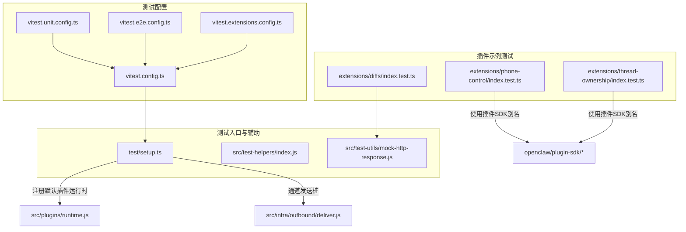
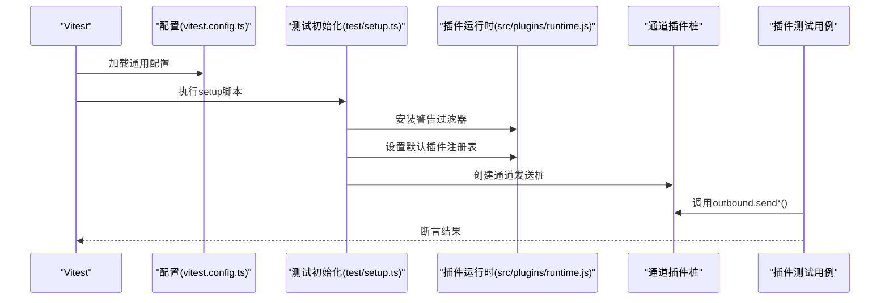
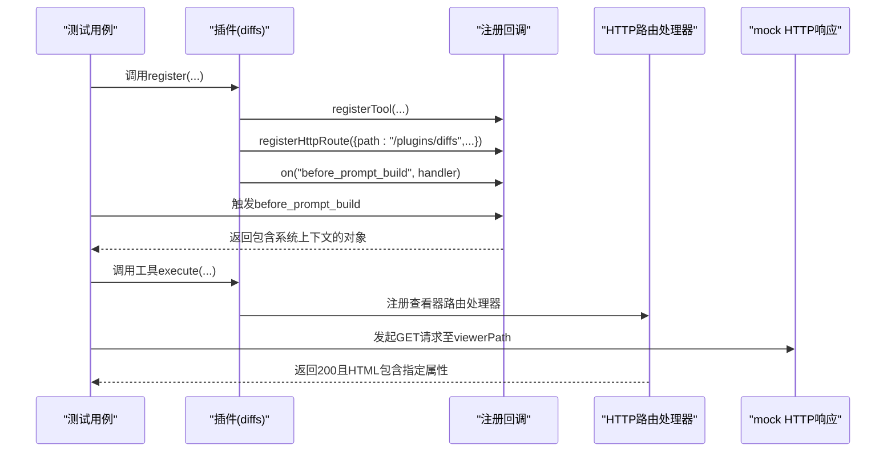
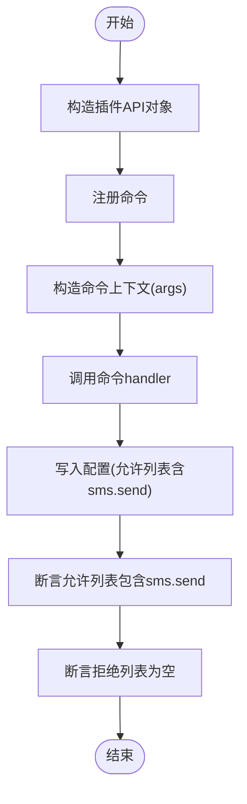
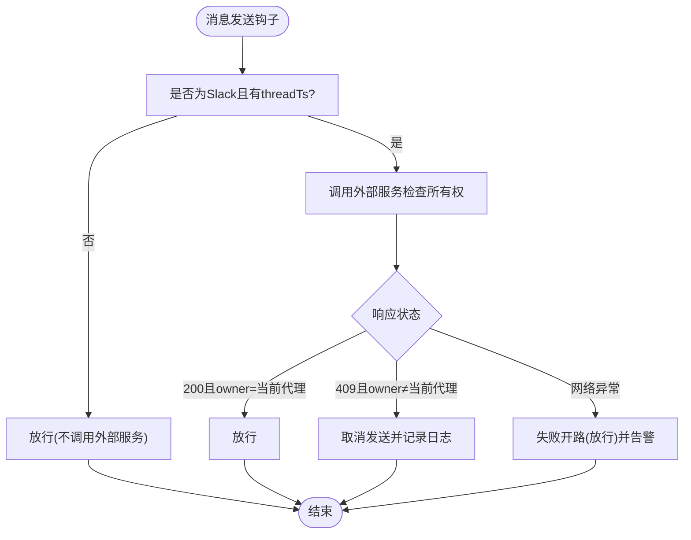
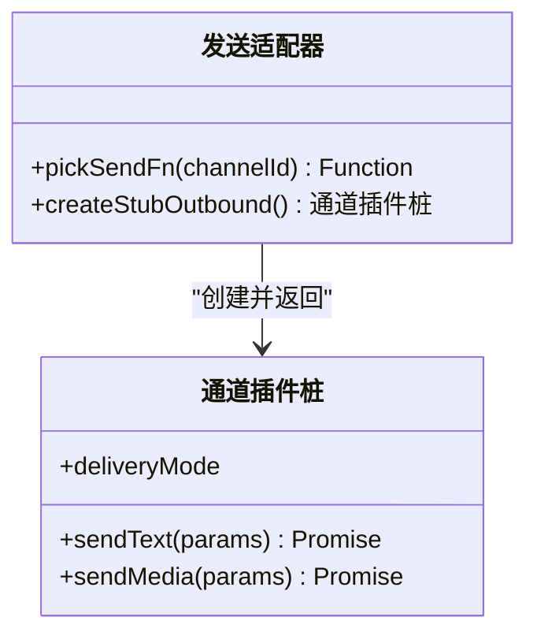
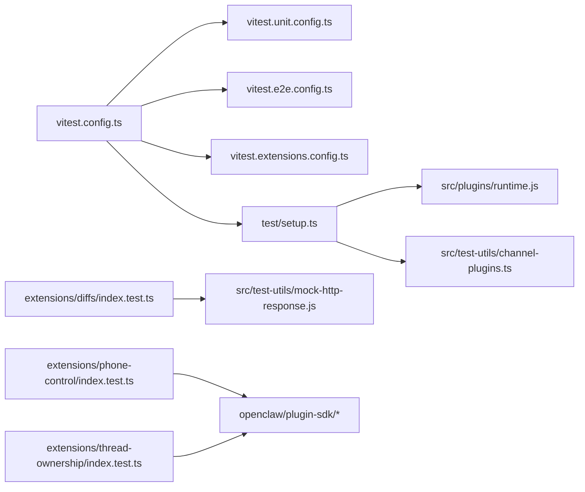

# 测试与调试

<cite>
**本文引用的文件**
- [vitest.config.ts](file://vitest.config.ts)
- [vitest.unit.config.ts](file://vitest.unit.config.ts)
- [vitest.e2e.config.ts](file://vitest.e2e.config.ts)
- [vitest.extensions.config.ts](file://vitest.extensions.config.ts)
- [test/setup.ts](file://test/setup.ts)
- [extensions/diffs/index.test.ts](file://extensions/diffs/index.test.ts)
- [extensions/phone-control/index.test.ts](file://extensions/phone-control/index.test.ts)
- [extensions/thread-ownership/index.test.ts](file://extensions/thread-ownership/index.test.ts)
- [extensions/diffs/index.ts](file://extensions/diffs/index.ts)
- [extensions/phone-control/index.ts](file://extensions/phone-control/index.ts)
- [extensions/thread-ownership/index.ts](file://extensions/thread-ownership/index.ts)
- [src/test-utils/channel-plugins.ts](file://src/test-utils/channel-plugins.ts)
- [src/plugins/runtime.js](file://src/plugins/runtime.js)
- [src/infra/warning-filter.js](file://src/infra/warning-filter.js)
- [src/infra/outbound/deliver.js](file://src/infra/outbound/deliver.js)
- [src/channels/plugins/types.js](file://src/channels/plugins/types.js)
- [src/config/config.js](file://src/config/config.js)
- [src/test-helpers/index.js](file://src/test-helpers/index.js)
- [src/test-utils/mock-http-response.js](file://src/test-utils/mock-http-response.js)
</cite>

## 目录

1. [简介](#简介)
2. [项目结构](#项目结构)
3. [核心组件](#核心组件)
4. [架构总览](#架构总览)
5. [详细组件分析](#详细组件分析)
6. [依赖关系分析](#依赖关系分析)
7. [性能考量](#性能考量)
8. [故障排查指南](#故障排查指南)
9. [结论](#结论)
10. [附录](#附录)

## 简介

本指南面向OpenClaw插件的测试与调试，覆盖单元测试、集成测试与端到端测试（E2E）的编写方法，重点包括：

- 测试框架与配置：基于Vitest的多套配置文件，分别服务于通用测试、单元测试、扩展测试与E2E测试。
- 模拟对象与测试环境：如何隔离进程状态、构建通道插件桩、注册默认插件运行时等。
- 测试数据与HTTP响应模拟：如何构造本地HTTP请求与响应以验证插件路由与工具执行。
- 调试技巧与日志：通过钩子、环境变量与日志记录定位问题；结合覆盖率与阈值评估质量。
- 常见场景与案例：围绕插件注册、系统提示注入、命令授权与线程所有权控制等典型流程。

## 项目结构

OpenClaw采用Monorepo组织方式，测试相关的核心位置如下：

- 根级Vitest配置：统一别名解析、并发策略、超时、覆盖率阈值与排除规则。
- 扩展测试：各插件目录下的测试文件，如diffs、phone-control、thread-ownership等。
- 测试辅助：setup脚本负责全局mock、插件运行时注册、通道发送桩等。
- 插件SDK别名：通过别名映射到src/plugin-sdk子模块，便于在测试中直接引用。

图表来源

- [vitest.config.ts:1-203](file://vitest.config.ts#L1-L203)
- [vitest.unit.config.ts:1-31](file://vitest.unit.config.ts#L1-L31)
- [vitest.e2e.config.ts:1-33](file://vitest.e2e.config.ts#L1-L33)
- [vitest.extensions.config.ts:1-4](file://vitest.extensions.config.ts#L1-L4)
- [test/setup.ts:1-201](file://test.setup.ts#L1-L201)
- [src/test-helpers/index.js](file://src/test-helpers/index.js)
- [src/test-utils/mock-http-response.js](file://src/test-utils/mock-http-response.js)
- [extensions/diffs/index.test.ts:1-154](file://extensions/diffs/index.test.ts#L1-L154)
- [extensions/phone-control/index.test.ts:1-111](file://extensions/phone-control/index.test.ts#L1-L111)
- [extensions/thread-ownership/index.test.ts:1-181](file://extensions/thread-ownership/index.test.ts#L1-L181)

章节来源

- [vitest.config.ts:1-203](file://vitest.config.ts#L1-L203)
- [test/setup.ts:1-201](file://test/setup.ts#L1-L201)

## 核心组件

- 测试框架与配置
  - 通用配置：设置别名、并发池、超时、环境解封、覆盖率报告与排除范围。
  - 单元测试配置：在通用配置基础上缩小包含范围，排除大模块以聚焦纯单元测试。
  - E2E配置：强制进程池隔离、按CPU动态计算工作进程数、静默或详细输出。
  - 扩展测试配置：对extensions目录单独生成作用域化配置。
- 测试环境初始化
  - 安装进程警告过滤器，避免噪声。
  - 通过隔离的用户目录初始化测试HOME，确保状态隔离。
  - 注册默认插件运行时（包含多个通道插件桩），并在每个测试后恢复。
  - 提供通道发送桩，根据通道类型选择对应发送函数，否则返回占位结果。
- 插件SDK别名
  - 将openclaw/plugin-sdk/\*映射到src/plugin-sdk下具体子模块，便于在测试中直接导入。

章节来源

- [vitest.config.ts:57-202](file://vitest.config.ts#L57-L202)
- [vitest.unit.config.ts:11-30](file://vitest.unit.config.ts#L11-L30)
- [vitest.e2e.config.ts:20-32](file://vitest.e2e.config.ts#L20-L32)
- [test/setup.ts:34-200](file://test/setup.ts#L34-L200)

## 架构总览

下图展示测试运行时的整体交互：Vitest加载配置与setup，初始化插件运行时与通道桩，随后执行各插件测试用例。

图表来源

- [vitest.config.ts:57-202](file://vitest.config.ts#L57-L202)
- [test/setup.ts:34-200](file://test/setup.ts#L34-L200)
- [src/plugins/runtime.js](file://src/plugins/runtime.js)
- [src/infra/outbound/deliver.js](file://src/infra/outbound/deliver.js)

## 详细组件分析

### 组件A：插件注册与系统提示注入（以diffs为例）

- 目标：验证插件在注册时是否正确注册工具、HTTP路由与钩子，并在构建系统提示前注入上下文。
- 关键点：
  - 使用registerTool与registerHttpRoute进行注册。
  - 通过on注册before_prompt_build钩子，断言返回的系统上下文包含特定关键词。
  - 使用mock HTTP响应模拟浏览器端查看器渲染，断言HTML属性与JSON参数。

图表来源

- [extensions/diffs/index.test.ts:6-55](file://extensions/diffs/index.test.ts#L6-L55)
- [extensions/diffs/index.test.ts:57-140](file://extensions/diffs/index.test.ts#L57-L140)
- [src/test-utils/mock-http-response.js](file://src/test-utils/mock-http-response.js)

章节来源

- [extensions/diffs/index.test.ts:1-154](file://extensions/diffs/index.test.ts#L1-L154)

### 组件B：命令授权与配置写入（以phone-control为例）

- 目标：验证插件命令注册、授权检查与配置变更写入。
- 关键点：
  - 通过API注册命令，断言命令名称与处理函数存在。
  - 在命令上下文中传入参数，触发授权“arm”逻辑，断言允许列表更新与拒绝列表清空。
  - 使用临时状态目录与配置读写函数，确保测试隔离与可清理。

图表来源

- [extensions/phone-control/index.test.ts:61-110](file://extensions/phone-control/index.test.ts#L61-L110)

章节来源

- [extensions/phone-control/index.test.ts:1-111](file://extensions/phone-control/index.test.ts#L1-L111)

### 组件C：线程所有权控制与@提及跟踪（以thread-ownership为例）

- 目标：验证消息发送前的线程所有权检查、网络错误时的失败开路策略、以及@提及后的跳过策略。
- 关键点：
  - 注册message_received与message_sending两个钩子。
  - 非Slack通道或顶层消息（无threadTs）直接放行。
  - 对Slack带thread的消息向外部服务发起所有权检查，成功则放行，冲突则取消发送并记录日志。
  - @提及被当前代理或机器人ID时，后续同一线程消息跳过检查。
  - 使用vi.mocked与vi.restoreAllMocks管理全局fetch行为。

图表来源

- [extensions/thread-ownership/index.test.ts:41-121](file://extensions/thread-ownership/index.test.ts#L41-L121)
- [extensions/thread-ownership/index.test.ts:123-180](file://extensions/thread-ownership/index.test.ts#L123-L180)

章节来源

- [extensions/thread-ownership/index.test.ts:1-181](file://extensions/thread-ownership/index.test.ts#L1-L181)

### 组件D：通道插件桩与发送适配

- 目标：为不同通道提供统一的outbound接口桩，屏蔽真实网络调用。
- 关键点：
  - 根据通道ID选择对应发送函数（如discord、slack、telegram等）。
  - 若未实现，则返回占位messageId，保证调用链稳定。
  - 与测试配置中的别名机制配合，使插件测试无需依赖真实通道。

图表来源

- [test/setup.ts:65-88](file://test/setup.ts#L65-L88)
- [test/setup.ts:46-63](file://test/setup.ts#L46-L63)

章节来源

- [test/setup.ts:65-88](file://test/setup.ts#L65-L88)

## 依赖关系分析

- 配置层
  - 通用配置定义了别名、并发、超时、覆盖率与排除项。
  - 单元配置在通用基础上进一步缩小范围。
  - E2E配置强制进程隔离与按CPU动态分配工作进程。
  - 扩展配置针对extensions目录生成独立作用域。
- 初始化层
  - setup脚本依赖插件运行时与通道插件桩，确保测试前的全局状态一致。
- 测试层
  - 各插件测试通过mock HTTP响应与工具执行验证功能。
  - 插件SDK别名确保测试中可直接引用openclaw/plugin-sdk/\*。

图表来源

- [vitest.config.ts:57-202](file://vitest.config.ts#L57-L202)
- [vitest.unit.config.ts:11-30](file://vitest.unit.config.ts#L11-L30)
- [vitest.e2e.config.ts:20-32](file://vitest.e2e.config.ts#L20-L32)
- [vitest.extensions.config.ts:1-4](file://vitest.extensions.config.ts#L1-L4)
- [test/setup.ts:34-200](file://test/setup.ts#L34-L200)
- [src/test-utils/channel-plugins.ts](file://src/test-utils/channel-plugins.ts)
- [src/test-utils/mock-http-response.js](file://src/test-utils/mock-http-response.js)
- [extensions/diffs/index.test.ts:1-154](file://extensions/diffs/index.test.ts#L1-L154)
- [extensions/phone-control/index.test.ts:1-111](file://extensions/phone-control/index.test.ts#L1-L111)
- [extensions/thread-ownership/index.test.ts:1-181](file://extensions/thread-ownership/index.test.ts#L1-L181)

章节来源

- [vitest.config.ts:57-202](file://vitest.config.ts#L57-L202)
- [test/setup.ts:34-200](file://test/setup.ts#L34-L200)

## 性能考量

- 并发与隔离
  - 通用配置使用进程池（forks）与可调整的最大工作进程数，兼顾本地与CI环境。
  - E2E配置默认单进程或按CPU比例分配，确保确定性与资源可控。
- 超时与泄漏防护
  - 测试与钩子超时合理设置，避免长时间卡住。
  - 开启unstubEnvs与unstubGlobals，防止VM fork模式下的跨文件污染。
- 覆盖率门槛
  - 行、函数、分支、语句均设为较高门槛，推动测试完整性。
  - 排除大模块与入口文件，聚焦核心业务逻辑。

章节来源

- [vitest.config.ts:71-202](file://vitest.config.ts#L71-L202)
- [vitest.e2e.config.ts:20-32](file://vitest.e2e.config.ts#L20-L32)

## 故障排查指南

- 插件未注册或未生效
  - 检查插件是否在默认注册表中，或在测试中是否覆盖了注册表。
  - 确认插件API回调（registerTool/registerHttpRoute/on等）是否被调用。
- 工具执行结果不符合预期
  - 使用mock HTTP响应构造请求，断言返回的viewerPath与HTML属性。
  - 核对插件配置defaults是否正确传递到工具与视图处理器。
- 命令授权未生效
  - 确认命令已注册且handler可调用。
  - 检查配置写入函数是否被调用，以及最终配置结构是否符合预期。
- 线程所有权导致消息被取消
  - 检查Slack外部服务URL与机器人ID是否设置。
  - 确认fetch返回状态码与响应体，关注409冲突与网络异常路径。
  - 验证@提及跟踪是否命中，导致后续同一线程跳过检查。
- 日志与告警
  - 使用logger.info/warn/debug输出关键路径与异常。
  - 在失败开路场景记录告警，便于定位网络问题。

章节来源

- [extensions/diffs/index.test.ts:6-55](file://extensions/diffs/index.test.ts#L6-L55)
- [extensions/phone-control/index.test.ts:61-110](file://extensions/phone-control/index.test.ts#L61-L110)
- [extensions/thread-ownership/index.test.ts:41-121](file://extensions/thread-ownership/index.test.ts#L41-L121)

## 结论

通过统一的Vitest配置、完善的测试初始化与丰富的插件测试样例，OpenClaw为插件开发提供了可靠的测试与调试基础。建议在新增或修改插件时：

- 优先编写单元测试，验证注册、钩子与工具执行。
- 使用通道插件桩与mock HTTP响应，减少对外部系统的依赖。
- 在E2E场景中关注并发隔离与确定性，必要时降低工作进程数。
- 利用覆盖率与日志，持续提升测试质量与可观测性。

## 附录

- 快速开始
  - 运行通用测试：使用根级Vitest配置。
  - 运行单元测试：使用单元配置文件。
  - 运行扩展测试：使用扩展配置文件。
  - 运行E2E测试：使用E2E配置文件。
- 常用断言与辅助
  - 使用mock HTTP响应构造请求与断言响应。
  - 使用通道插件桩与outbound接口验证发送流程。
  - 使用setup脚本提供的默认插件注册表与运行时。
