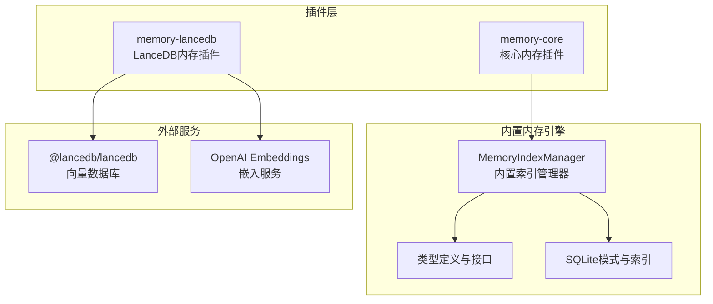
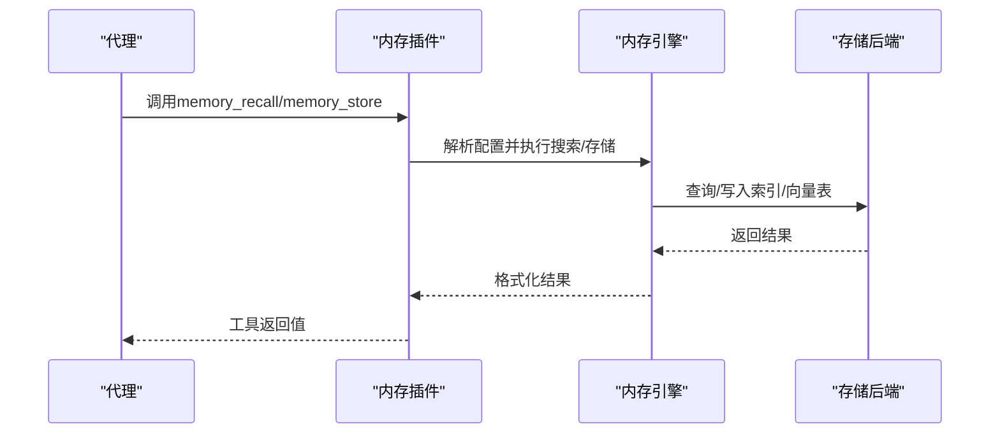
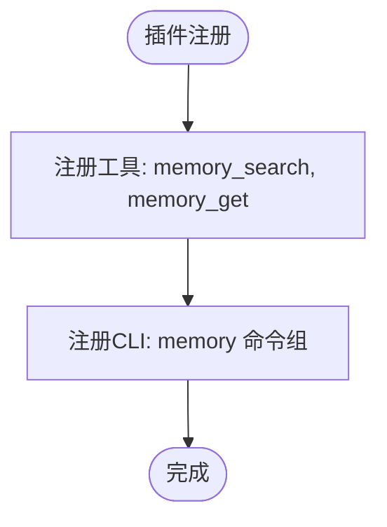
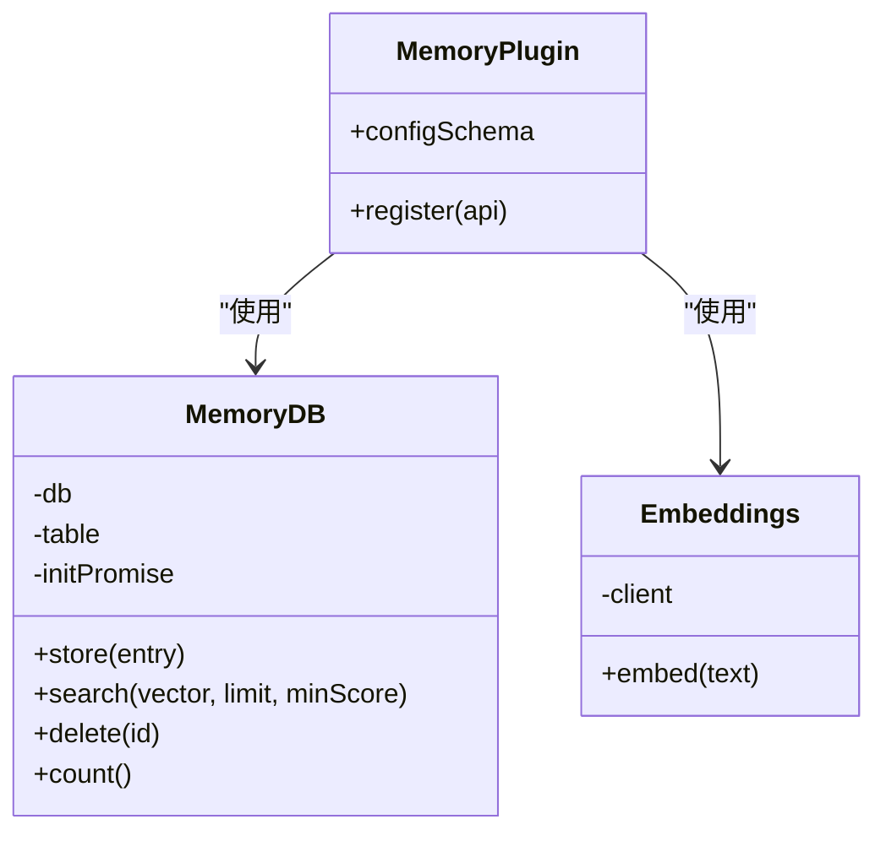
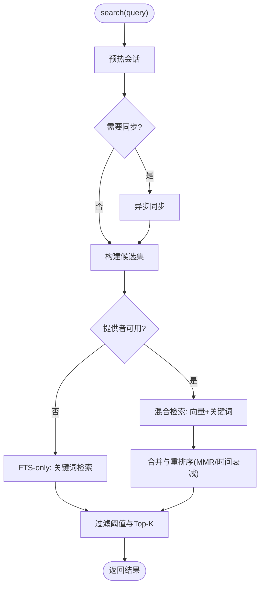
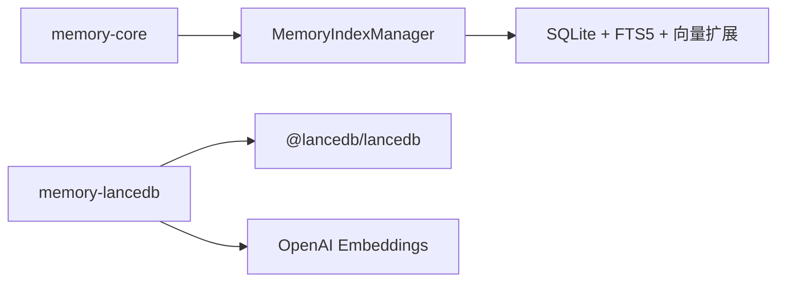

# 内存插件示例

<cite>
**本文档引用的文件**
- [extensions/memory-core/index.ts](file://extensions/memory-core/index.ts)
- [extensions/memory-lancedb/index.ts](file://extensions/memory-lancedb/index.ts)
- [extensions/memory-lancedb/config.ts](file://extensions/memory-lancedb/config.ts)
- [src/memory/manager.ts](file://src/memory/manager.ts)
- [src/memory/search-manager.ts](file://src/memory/search-manager.ts)
- [src/memory/types.ts](file://src/memory/types.ts)
- [src/memory/memory-schema.ts](file://src/memory/memory-schema.ts)
- [docs/concepts/memory.md](file://docs/concepts/memory.md)
- [docs/cli/memory.md](file://docs/cli/memory.md)
- [extensions/memory-lancedb/index.test.ts](file://extensions/memory-lancedb/index.test.ts)
</cite>

## 目录

1. [简介](#简介)
2. [项目结构](#项目结构)
3. [核心组件](#核心组件)
4. [架构总览](#架构总览)
5. [详细组件分析](#详细组件分析)
6. [依赖关系分析](#依赖关系分析)
7. [性能考虑](#性能考虑)
8. [故障排查指南](#故障排查指南)
9. [结论](#结论)
10. [附录](#附录)

## 简介

本文件面向OpenClaw内存插件示例的技术文档，系统性阐述两类内存管理与数据持久化插件：核心内存插件（memory-core）与LanceDB内存插件（memory-lancedb）。内容涵盖内存存储架构、数据索引策略、查询优化、配置示例、数据迁移与备份恢复方案，以及性能调优参数、缓存策略与内存使用监控等实践要点。目标是帮助开发者快速理解并安全地在生产环境中部署与运维OpenClaw的长期记忆能力。

## 项目结构

OpenClaw通过“插件”机制为不同后端提供统一的内存工具与生命周期钩子。核心内存插件基于本地文件系统（Markdown）提供语义检索与CLI；LanceDB内存插件则引入向量数据库与嵌入模型，支持自动回忆与自动捕获。

**图表来源**

- [extensions/memory-core/index.ts:1-39](file://extensions/memory-core/index.ts#L1-L39)
- [extensions/memory-lancedb/index.ts:292-679](file://extensions/memory-lancedb/index.ts#L292-L679)
- [src/memory/manager.ts:61-800](file://src/memory/manager.ts#L61-L800)
- [src/memory/memory-schema.ts:1-97](file://src/memory/memory-schema.ts#L1-L97)

**章节来源**

- [extensions/memory-core/index.ts:1-39](file://extensions/memory-core/index.ts#L1-L39)
- [extensions/memory-lancedb/index.ts:1-679](file://extensions/memory-lancedb/index.ts#L1-L679)
- [src/memory/manager.ts:1-803](file://src/memory/manager.ts#L1-L803)
- [src/memory/memory-schema.ts:1-97](file://src/memory/memory-schema.ts#L1-L97)

## 核心组件

- 核心内存插件（memory-core）
  - 提供memory_search与memory_get工具，注册到OpenClaw运行时，支持CLI命令。
  - 作为默认内存插件，面向纯文本Markdown场景，无需额外依赖。
- LanceDB内存插件（memory-lancedb）
  - 基于LanceDB向量数据库与OpenAI嵌入模型，提供向量召回、自动回忆与自动捕获。
  - 支持CLI命令（ltm list/search/stats），并暴露服务生命周期钩子。
- 内置内存引擎（MemoryIndexManager）
  - 统一的内存搜索管理器，支持混合检索（BM25 + 向量）、嵌入缓存、增量同步、只读恢复等。
  - 提供状态查询、批处理、向量化加速（sqlite-vec）等能力。

**章节来源**

- [extensions/memory-core/index.ts:10-36](file://extensions/memory-core/index.ts#L10-L36)
- [extensions/memory-lancedb/index.ts:292-679](file://extensions/memory-lancedb/index.ts#L292-L679)
- [src/memory/manager.ts:61-800](file://src/memory/manager.ts#L61-L800)

## 架构总览

OpenClaw内存子系统采用“插件 + 引擎”的分层设计：

- 插件层负责注册工具、CLI与生命周期钩子，并根据配置选择后端。
- 引擎层负责实际的数据索引、查询与状态管理，支持多种检索策略与优化手段。

**图表来源**

- [extensions/memory-lancedb/index.ts:314-494](file://extensions/memory-lancedb/index.ts#L314-L494)
- [src/memory/manager.ts:256-364](file://src/memory/manager.ts#L256-L364)

## 详细组件分析

### 核心内存插件（memory-core）

- 功能
  - 注册memory_search与memory_get工具，支持会话键隔离。
  - 注册CLI命令组，提供内存工具的命令行入口。
- 配置
  - 使用空配置模式（emptyPluginConfigSchema），无额外参数。
- 适用场景
  - 纯文本Markdown索引，无需向量或远程嵌入的轻量场景。

**图表来源**

- [extensions/memory-core/index.ts:10-36](file://extensions/memory-core/index.ts#L10-L36)

**章节来源**

- [extensions/memory-core/index.ts:1-39](file://extensions/memory-core/index.ts#L1-L39)

### LanceDB内存插件（memory-lancedb）

- 存储与索引
  - 使用LanceDB表“memories”存储向量、文本、重要度、类别与时间戳。
  - 首次初始化时自动创建表并删除临时schema记录。
- 嵌入与向量
  - 通过OpenAI Embeddings生成向量，支持自定义维度与兼容端点。
  - 搜索使用向量近似最近邻，返回相似度分数并过滤阈值。
- 自动功能
  - 自动回忆：在代理开始前注入相关记忆上下文。
  - 自动捕获：从用户消息中提取可记忆片段，去重后写入。
- 工具与CLI
  - memory_recall：按查询向量召回记忆。
  - memory_store：保存记忆并进行重复检测。
  - memory_forget：按ID或查询删除记忆。
  - ltm命令组：列出统计、搜索与统计信息。
- 安全与合规
  - 记忆注入时对文本进行HTML转义，标记为不可信历史数据。
  - 支持GDPR式删除（按ID删除）。

**图表来源**

- [extensions/memory-lancedb/index.ts:59-157](file://extensions/memory-lancedb/index.ts#L59-L157)
- [extensions/memory-lancedb/index.ts:163-186](file://extensions/memory-lancedb/index.ts#L163-L186)
- [extensions/memory-lancedb/index.ts:292-679](file://extensions/memory-lancedb/index.ts#L292-L679)

**章节来源**

- [extensions/memory-lancedb/index.ts:1-679](file://extensions/memory-lancedb/index.ts#L1-L679)
- [extensions/memory-lancedb/config.ts:1-181](file://extensions/memory-lancedb/config.ts#L1-L181)

### 内置内存引擎（MemoryIndexManager）

- 检索策略
  - 支持FTS-only与混合检索（BM25 + 向量），并提供MMR多样性与时间衰减。
  - 当FTS不可用时自动降级为向量检索。
- 同步与缓存
  - 增量同步：基于文件变更与会话增量触发，避免全量重建。
  - 嵌入缓存：在SQLite中缓存嵌入向量，减少重复计算。
  - 只读数据库恢复：检测只读错误并自动重建连接。
- 批处理与向量化
  - 批处理配置（等待、轮询间隔、超时、并发）以提升大规模索引效率。
  - sqlite-vec扩展可用时启用向量表加速。
- 状态与诊断
  - 提供详细状态报告，包含后端、提供者、向量可用性、缓存条目数、批处理失败次数等。

**图表来源**

- [src/memory/manager.ts:256-364](file://src/memory/manager.ts#L256-L364)
- [src/memory/manager.ts:416-449](file://src/memory/manager.ts#L416-L449)

**章节来源**

- [src/memory/manager.ts:1-803](file://src/memory/manager.ts#L1-L803)
- [src/memory/types.ts:1-81](file://src/memory/types.ts#L1-L81)
- [src/memory/memory-schema.ts:1-97](file://src/memory/memory-schema.ts#L1-L97)

## 依赖关系分析

- 插件到引擎
  - memory-core直接依赖内置引擎（通过运行时工具封装）。
  - memory-lancedb直接依赖LanceDB与OpenAI嵌入服务。
- 引擎到存储
  - 内置引擎使用SQLite（含FTS5与向量扩展），并维护元数据与嵌入缓存表。
- 生命周期钩子
  - memory-lancedb在before_agent_start与agent_end事件上挂载自动回忆与自动捕获逻辑。

**图表来源**

- [extensions/memory-core/index.ts:10-36](file://extensions/memory-core/index.ts#L10-L36)
- [extensions/memory-lancedb/index.ts:292-679](file://extensions/memory-lancedb/index.ts#L292-L679)
- [src/memory/manager.ts:61-800](file://src/memory/manager.ts#L61-L800)

**章节来源**

- [extensions/memory-lancedb/index.ts:546-658](file://extensions/memory-lancedb/index.ts#L546-L658)
- [src/memory/manager.ts:451-551](file://src/memory/manager.ts#L451-L551)

## 性能考虑

- 检索优化
  - 混合检索：向量相似度与BM25关键词匹配结合，权重可配置；必要时启用MMR与时间衰减。
  - 候选池放大系数与最小分数阈值控制召回质量与性能平衡。
- 向量化加速
  - sqlite-vec扩展启用时，向量距离在数据库内完成，避免加载全部向量到内存。
- 嵌入缓存
  - 在SQLite中缓存嵌入向量，显著降低重复索引成本。
- 批处理
  - 大规模索引时启用批处理，设置等待、轮询间隔与超时，控制并发与资源占用。
- 只读恢复
  - 检测只读数据库错误并自动重建连接，保障稳定性。

**章节来源**

- [docs/concepts/memory.md:448-615](file://docs/concepts/memory.md#L448-L615)
- [src/memory/manager.ts:451-551](file://src/memory/manager.ts#L451-L551)
- [src/memory/memory-schema.ts:3-83](file://src/memory/memory-schema.ts#L3-L83)

## 故障排查指南

- LanceDB加载失败
  - 现象：启动时报错提示无法加载LanceDB。
  - 排查：确认平台原生绑定可用性；尝试安装/更新依赖或切换至其他平台。
- OpenAI嵌入API异常
  - 现象：向量生成失败或维度不匹配。
  - 排查：检查API密钥、端点URL与维度配置；必要时指定兼容端点。
- 记忆注入与提示注入防护
  - 现象：上下文被注入不可信内容。
  - 排查：确认格式化函数已对文本进行HTML转义；避免使用可能触发注入的查询。
- 自动捕获误判
  - 现象：非重要信息被写入记忆或重要信息未被捕获。
  - 排查：调整捕获规则与最大字符限制；确保消息内容符合预期。
- CLI调试
  - 使用openclaw memory命令查看状态、强制索引与搜索，定位问题范围。

**章节来源**

- [extensions/memory-lancedb/index.ts:27-37](file://extensions/memory-lancedb/index.ts#L27-L37)
- [extensions/memory-lancedb/index.ts:221-277](file://extensions/memory-lancedb/index.ts#L221-L277)
- [docs/cli/memory.md:1-67](file://docs/cli/memory.md#L1-L67)

## 结论

OpenClaw内存插件示例提供了从纯文本到向量增强的完整内存解决方案。核心内存插件适合轻量与隐私敏感场景，LanceDB插件则满足需要语义检索与自动记忆的复杂应用。通过内置引擎的混合检索、嵌入缓存、批处理与只读恢复等机制，系统在性能与可靠性之间取得良好平衡。建议在生产环境结合业务需求选择合适插件，并配合合理的配置与监控策略持续优化。

## 附录

### 配置示例与最佳实践

- LanceDB插件配置要点
  - 嵌入模型与API密钥：支持OpenAI模型与兼容端点，可指定维度。
  - 数据库路径：默认位于用户主目录下的状态路径，可自定义。
  - 自动功能：可开启自动回忆与自动捕获，捕获长度限制可调。
- 内置引擎配置要点
  - 混合检索：向量与关键词权重、候选池放大系数、最小分数阈值。
  - MMR与时间衰减：按需启用，调节lambda与半衰期。
  - 嵌入缓存：设置最大条目数，避免过度占用空间。
  - 批处理：根据数据规模与网络条件调整等待、轮询与超时。
  - sqlite-vec：在可用时启用以提升向量检索性能。

**章节来源**

- [extensions/memory-lancedb/config.ts:5-181](file://extensions/memory-lancedb/config.ts#L5-L181)
- [docs/concepts/memory.md:580-741](file://docs/concepts/memory.md#L580-L741)

### 数据迁移与备份恢复

- 迁移策略
  - LanceDB：备份数据库目录（包含memories表与元数据），在新环境恢复后重新初始化表结构。
  - 内置引擎：备份SQLite数据库文件，确保FTS5与向量扩展可用。
- 备份与恢复
  - 建议定期导出数据库快照；恢复时先重建索引再启动服务。
  - 对于只读数据库错误，内置引擎具备自动恢复能力，但仍建议人工确认一致性。

**章节来源**

- [extensions/memory-lancedb/index.ts:81-101](file://extensions/memory-lancedb/index.ts#L81-L101)
- [src/memory/manager.ts:517-551](file://src/memory/manager.ts#L517-L551)

### 性能调优参数清单

- 混合检索
  - 向量权重、关键词权重、候选池放大系数、最小分数阈值。
- MMR与时间衰减
  - MMR启用与lambda、时间衰减启用与半衰期天数。
- 嵌入缓存
  - 缓存开关与最大条目数。
- 批处理
  - 等待模式、轮询间隔（毫秒）、超时（毫秒）、并发数。
- sqlite-vec
  - 启用开关与扩展路径。

**章节来源**

- [docs/concepts/memory.md:580-741](file://docs/concepts/memory.md#L580-L741)
- [src/memory/manager.ts:716-726](file://src/memory/manager.ts#L716-L726)

### 缓存策略与内存使用监控

- 嵌入缓存
  - 通过SQLite缓存嵌入向量，减少重复计算；监控缓存条目数与磁盘占用。
- 状态监控
  - 使用status接口输出后端、提供者、向量可用性、缓存条目、批处理失败次数等指标。
- 日志与告警
  - 记录只读恢复、批处理失败与提供者不可用等事件，便于及时干预。

**章节来源**

- [src/memory/manager.ts:626-738](file://src/memory/manager.ts#L626-L738)
- [extensions/memory-lancedb/index.ts:664-675](file://extensions/memory-lancedb/index.ts#L664-L675)

### 测试与验证

- 单元测试覆盖
  - 配置解析、环境变量替换、捕获规则、分类逻辑与上下文格式化。
- 端到端测试
  - 工具注册与执行、CLI命令、生命周期钩子与真实API交互（需OpenAI密钥）。

**章节来源**

- [extensions/memory-lancedb/index.test.ts:1-414](file://extensions/memory-lancedb/index.test.ts#L1-L414)
