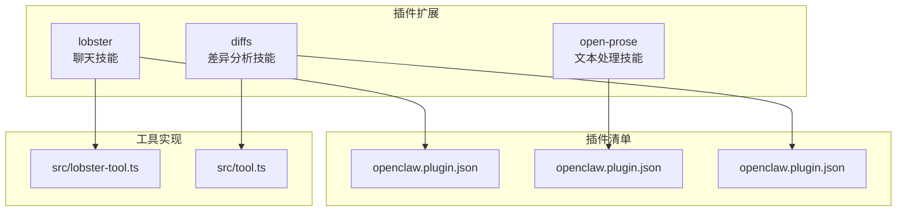
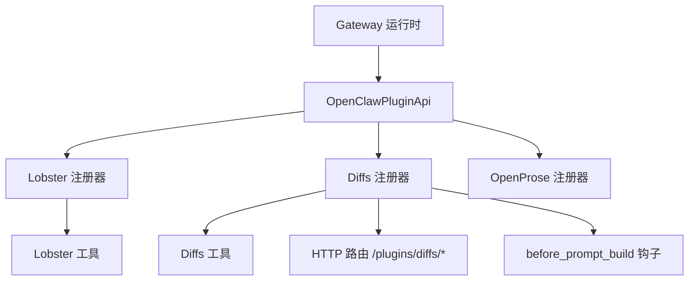
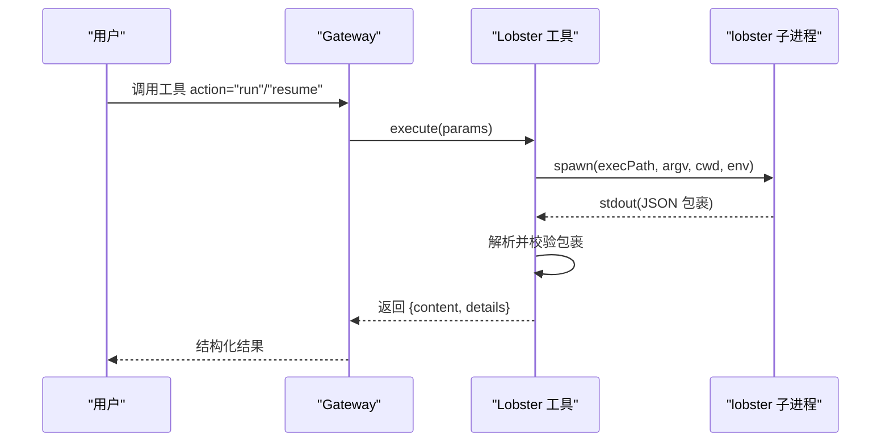
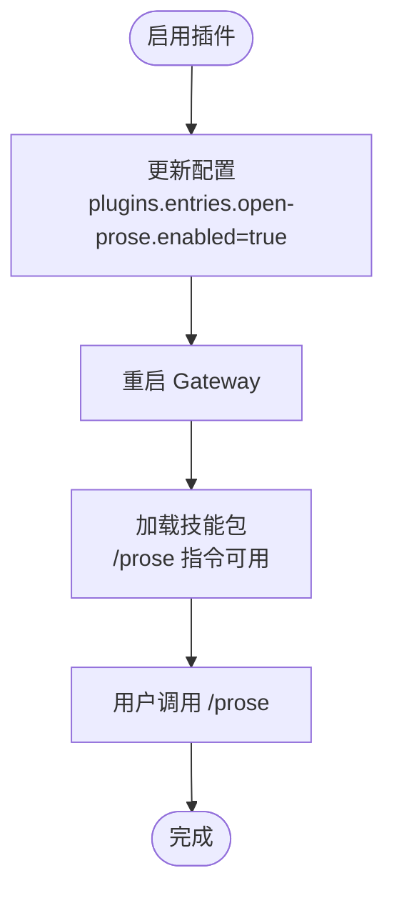
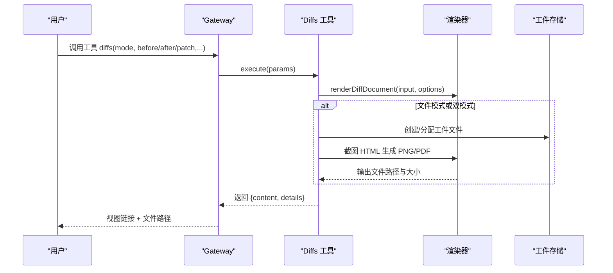
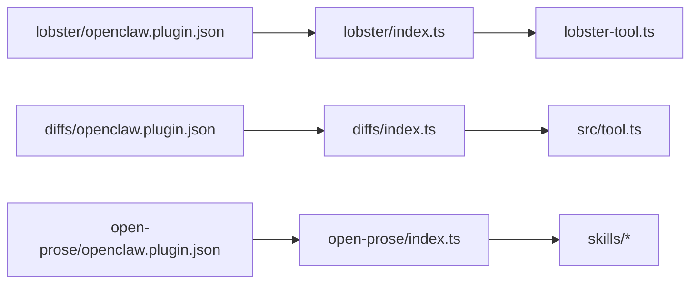

# 技能插件示例

<cite>
**本文引用的文件**
- [extensions/lobster/index.ts](file://extensions/lobster/index.ts)
- [extensions/lobster/openclaw.plugin.json](file://extensions/lobster/openclaw.plugin.json)
- [extensions/lobster/SKILL.md](file://extensions/lobster/SKILL.md)
- [extensions/lobster/src/lobster-tool.ts](file://extensions/lobster/src/lobster-tool.ts)
- [extensions/open-prose/index.ts](file://extensions/open-prose/index.ts)
- [extensions/open-prose/openclaw.plugin.json](file://extensions/open-prose/openclaw.plugin.json)
- [extensions/open-prose/README.md](file://extensions/open-prose/README.md)
- [extensions/diffs/index.ts](file://extensions/diffs/index.ts)
- [extensions/diffs/openclaw.plugin.json](file://extensions/diffs/openclaw.plugin.json)
- [extensions/diffs/README.md](file://extensions/diffs/README.md)
- [extensions/diffs/src/tool.ts](file://extensions/diffs/src/tool.ts)
</cite>

## 目录

1. [简介](#简介)
2. [项目结构](#项目结构)
3. [核心组件](#核心组件)
4. [架构总览](#架构总览)
5. [组件详解](#组件详解)
6. [依赖关系分析](#依赖关系分析)
7. [性能与安全考量](#性能与安全考量)
8. [故障排查指南](#故障排查指南)
9. [结论](#结论)
10. [附录：开发模板与最佳实践](#附录开发模板与最佳实践)

## 简介

本指南围绕 OpenClaw 的 AI 技能插件示例，系统讲解三类典型能力的实现与使用：Lobster 聊天技能（多步工作流与可恢复审批）、Open-Prose 文本处理技能（VM 语义与多智能体编排）以及差异分析技能（只读差异查看器与 PNG/PDF 渲染）。文档覆盖插件架构、参数配置、执行流程、权限控制与性能监控等关键主题，并提供可直接复用的开发模板与 API 接口说明。

## 项目结构

OpenClaw 插件采用“扩展目录 + 插件清单 + 技能包”的组织方式：

- 扩展根目录：extensions/<插件名>
- 插件入口：index.ts（注册工具、HTTP 路由、钩子）
- 插件清单：openclaw.plugin.json（声明 ID、名称、描述、技能路径、配置模式与 UI 提示）
- 技能包：skills/（随插件分发的用户可调用技能）
- 工具实现：src/tool.ts（具体工具逻辑）
- 文档：README.md / SKILL.md（使用说明、示例与限制）

图示来源

- [extensions/lobster/index.ts:1-19](file://extensions/lobster/index.ts#L1-L19)
- [extensions/lobster/openclaw.plugin.json:1-11](file://extensions/lobster/openclaw.plugin.json#L1-L11)
- [extensions/lobster/src/lobster-tool.ts:210-267](file://extensions/lobster/src/lobster-tool.ts#L210-L267)
- [extensions/open-prose/index.ts:1-6](file://extensions/open-prose/index.ts#L1-L6)
- [extensions/open-prose/openclaw.plugin.json:1-12](file://extensions/open-prose/openclaw.plugin.json#L1-L12)
- [extensions/diffs/index.ts:1-45](file://extensions/diffs/index.ts#L1-L45)
- [extensions/diffs/openclaw.plugin.json:1-183](file://extensions/diffs/openclaw.plugin.json#L1-L183)
- [extensions/diffs/src/tool.ts:133-296](file://extensions/diffs/src/tool.ts#L133-L296)

章节来源

- [extensions/lobster/index.ts:1-19](file://extensions/lobster/index.ts#L1-L19)
- [extensions/open-prose/index.ts:1-6](file://extensions/open-prose/index.ts#L1-L6)
- [extensions/diffs/index.ts:1-45](file://extensions/diffs/index.ts#L1-L45)

## 核心组件

- Lobster 插件：提供本地优先的工作流运行时，支持可恢复审批与确定性输出；通过子进程调用 lobster 可执行文件，解析 JSON 包裹结果。
- Open-Prose 插件：随插件分发技能包与 /prose 指令，提供 OpenProse VM 语义与遥测支持。
- Diffs 插件：提供只读差异查看器与 PNG/PDF 渲染能力，支持视图模式、文件模式与双模式；内置 HTTP 前缀路由与安全策略。

章节来源

- [extensions/lobster/src/lobster-tool.ts:210-267](file://extensions/lobster/src/lobster-tool.ts#L210-L267)
- [extensions/open-prose/README.md:1-26](file://extensions/open-prose/README.md#L1-L26)
- [extensions/diffs/src/tool.ts:133-296](file://extensions/diffs/src/tool.ts#L133-L296)

## 架构总览

下图展示了三个插件在 OpenClaw 中的集成方式与交互关系：

图示来源

- [extensions/lobster/index.ts:8-18](file://extensions/lobster/index.ts#L8-L18)
- [extensions/diffs/index.ts:19-42](file://extensions/diffs/index.ts#L19-L42)
- [extensions/open-prose/index.ts:3-5](file://extensions/open-prose/index.ts#L3-L5)

## 组件详解

### Lobster 聊天技能

- 插件职责：将多步工作流以类型化 JSON 包裹返回，支持审批断点与恢复令牌。
- 关键点：
  - 子进程执行 lobster 可执行文件，注入环境变量并限制超时与输出大小。
  - 解析最终 JSON 包裹，容忍前置非 JSON 输出（如警告/日志）。
  - 参数校验：action 必填；run 需要 pipeline；resume 需要 token 与 approve。
  - 工作目录约束：相对路径且必须位于网关工作目录内。
- 使用场景：邮件分类、定时提醒、需要人工审批的自动化任务。

图示来源

- [extensions/lobster/src/lobster-tool.ts:50-143](file://extensions/lobster/src/lobster-tool.ts#L50-L143)
- [extensions/lobster/src/lobster-tool.ts:145-181](file://extensions/lobster/src/lobster-tool.ts#L145-L181)
- [extensions/lobster/src/lobster-tool.ts:232-266](file://extensions/lobster/src/lobster-tool.ts#L232-L266)

章节来源

- [extensions/lobster/SKILL.md:1-98](file://extensions/lobster/SKILL.md#L1-L98)
- [extensions/lobster/openclaw.plugin.json:1-11](file://extensions/lobster/openclaw.plugin.json#L1-L11)
- [extensions/lobster/src/lobster-tool.ts:29-48](file://extensions/lobster/src/lobster-tool.ts#L29-L48)
- [extensions/lobster/src/lobster-tool.ts:232-266](file://extensions/lobster/src/lobster-tool.ts#L232-L266)

### Open-Prose 文本处理技能

- 插件职责：启用后提供 /prose 指令与 OpenProse 技能包，具备遥测支持。
- 启用方式：在配置中将插件 entries.<id>.enabled 设为 true，并重启网关。
- 交付机制：技能包随插件分发，用户可直接调用。

图示来源

- [extensions/open-prose/README.md:9-25](file://extensions/open-prose/README.md#L9-L25)
- [extensions/open-prose/openclaw.plugin.json:1-12](file://extensions/open-prose/openclaw.plugin.json#L1-L12)

章节来源

- [extensions/open-prose/README.md:1-26](file://extensions/open-prose/README.md#L1-L26)
- [extensions/open-prose/openclaw.plugin.json:1-12](file://extensions/open-prose/openclaw.plugin.json#L1-L12)

### Diffs 差异分析技能

- 插件职责：提供 diffs 工具，支持视图模式（网关内 Canvas 打开）、文件模式（PNG/PDF）与双模式；内置 HTTP 前缀路由用于查看器托管。
- 关键点：
  - 输入支持 before/after 文本或统一补丁（patch），并有字节上限与校验。
  - 支持主题、布局、缩放、最大宽度、质量预设等渲染选项。
  - 安全策略：可通过配置允许远程访问查看器；默认仅限回环地址。
  - 钩子：before_prompt_build 阶段注入稳定工具使用建议到系统提示词空间。
- 输出详情：返回 viewerUrl、filePath、格式、尺寸、字节数等字段，便于后续消息工具发送。

图示来源

- [extensions/diffs/src/tool.ts:145-294](file://extensions/diffs/src/tool.ts#L145-L294)
- [extensions/diffs/src/tool.ts:346-376](file://extensions/diffs/src/tool.ts#L346-L376)
- [extensions/diffs/index.ts:27-40](file://extensions/diffs/index.ts#L27-L40)

章节来源

- [extensions/diffs/README.md:1-183](file://extensions/diffs/README.md#L1-L183)
- [extensions/diffs/openclaw.plugin.json:1-183](file://extensions/diffs/openclaw.plugin.json#L1-L183)
- [extensions/diffs/src/tool.ts:378-425](file://extensions/diffs/src/tool.ts#L378-L425)

## 依赖关系分析

- 插件注册：各插件通过 index.ts 调用 OpenClawPluginApi 的 registerTool/registerHttpRoute/on 钩子完成注册。
- 配置与 UI 提示：openclaw.plugin.json 定义 configSchema 与 uiHints，驱动前端配置界面与默认值。
- 工具实现：工具参数使用 TypeBox Schema 校验，确保输入安全与一致性。
- 外部依赖：Lobster 依赖外部可执行文件；Diffs 依赖浏览器截图能力（Playwright）进行 PNG/PDF 渲染。

图示来源

- [extensions/lobster/index.ts:8-18](file://extensions/lobster/index.ts#L8-L18)
- [extensions/diffs/index.ts:19-42](file://extensions/diffs/index.ts#L19-L42)
- [extensions/open-prose/index.ts:3-5](file://extensions/open-prose/index.ts#L3-L5)
- [extensions/lobster/openclaw.plugin.json:1-11](file://extensions/lobster/openclaw.plugin.json#L1-L11)
- [extensions/diffs/openclaw.plugin.json:1-183](file://extensions/diffs/openclaw.plugin.json#L1-L183)
- [extensions/open-prose/openclaw.plugin.json:1-12](file://extensions/open-prose/openclaw.plugin.json#L1-L12)

章节来源

- [extensions/lobster/index.ts:1-19](file://extensions/lobster/index.ts#L1-L19)
- [extensions/diffs/index.ts:1-45](file://extensions/diffs/index.ts#L1-L45)
- [extensions/open-prose/index.ts:1-6](file://extensions/open-prose/index.ts#L1-L6)

## 性能与安全考量

- 性能
  - Lobster：设置合理的超时与 stdout 字节上限，避免长时间阻塞与内存膨胀。
  - Diffs：文件渲染依赖浏览器截图，需关注设备像素比、最大宽度与质量预设对吞吐的影响；建议在高负载场景限制并发。
- 安全
  - Lobster：工作目录限制在网关工作目录内，防止越权访问；子进程禁用调试环境变量。
  - Diffs：默认禁止远程查看器访问；可通过配置项开启；对输入长度与渲染上限进行严格限制。
- 监控
  - 插件可利用 OpenClawPluginApi.logger 记录调试信息；Diffs 在 before_prompt_build 钩子中注入使用建议，提升用户体验与减少误用。

章节来源

- [extensions/lobster/src/lobster-tool.ts:29-48](file://extensions/lobster/src/lobster-tool.ts#L29-L48)
- [extensions/lobster/src/lobster-tool.ts:56-143](file://extensions/lobster/src/lobster-tool.ts#L56-L143)
- [extensions/diffs/src/tool.ts:24-28](file://extensions/diffs/src/tool.ts#L24-L28)
- [extensions/diffs/src/tool.ts:427-432](file://extensions/diffs/src/tool.ts#L427-L432)
- [extensions/diffs/index.ts:38-40](file://extensions/diffs/index.ts#L38-L40)

## 故障排查指南

- Lobster
  - 症状：子进程失败或超时
  - 排查：检查 action 是否为 run/resume；pipeline/token/approve 是否正确；cwd 是否越界；超时与输出大小是否合理
- Diffs
  - 症状：文件渲染失败或视图链接无效
  - 排查：确认输入 before/after 或 patch 是否满足字节限制；检查 baseUrl 与安全策略；验证浏览器可执行路径与截图器配置
- Open-Prose
  - 症状：/prose 指令不可用
  - 排查：确认插件已启用且网关已重启；检查技能包路径与加载状态

章节来源

- [extensions/lobster/src/lobster-tool.ts:183-208](file://extensions/lobster/src/lobster-tool.ts#L183-L208)
- [extensions/lobster/src/lobster-tool.ts:145-181](file://extensions/lobster/src/lobster-tool.ts#L145-L181)
- [extensions/diffs/src/tool.ts:378-425](file://extensions/diffs/src/tool.ts#L378-L425)
- [extensions/diffs/src/tool.ts:465-470](file://extensions/diffs/src/tool.ts#L465-L470)
- [extensions/open-prose/README.md:9-19](file://extensions/open-prose/README.md#L9-L19)

## 结论

上述三类插件展示了 OpenClaw 技能体系的多样性：从可恢复审批的工作流（Lobster）、到可编程的文本处理（Open-Prose），再到可视化的差异分析（Diffs）。通过标准化的插件清单、严格的参数校验与安全策略，以及钩子与 HTTP 路由的扩展点，开发者可以快速构建可复用、可观测、可维护的 AI 技能。

## 附录：开发模板与最佳实践

- 插件开发模板
  - 插件清单：定义 id、name、description、skills、configSchema、uiHints
  - 注册器：在 index.ts 中注册工具、HTTP 路由与钩子
  - 工具实现：使用 TypeBox 定义参数 Schema，进行输入校验与错误包装
  - 安全与性能：限制输入大小、设置超时、控制渲染参数、遵循工作目录约束
- API 接口
  - 工具执行：execute(id, params) -> { content, details }
  - HTTP 路由：registerHttpRoute({ path, auth, match, handler })
  - 钩子：on("before_prompt_build", ...) 返回上下文注入
- 结果处理示例
  - Lobster：解析 JSON 包裹，区分 ok/needs_approval/cancelled
  - Diffs：根据 mode 返回 viewerUrl 或 filePath，并补充格式、尺寸、字节数等详情

章节来源

- [extensions/lobster/openclaw.plugin.json:1-11](file://extensions/lobster/openclaw.plugin.json#L1-L11)
- [extensions/lobster/index.ts:8-18](file://extensions/lobster/index.ts#L8-L18)
- [extensions/lobster/src/lobster-tool.ts:210-267](file://extensions/lobster/src/lobster-tool.ts#L210-L267)
- [extensions/diffs/openclaw.plugin.json:68-182](file://extensions/diffs/openclaw.plugin.json#L68-L182)
- [extensions/diffs/index.ts:27-40](file://extensions/diffs/index.ts#L27-L40)
- [extensions/diffs/src/tool.ts:133-296](file://extensions/diffs/src/tool.ts#L133-L296)
- [extensions/open-prose/openclaw.plugin.json:1-12](file://extensions/open-prose/openclaw.plugin.json#L1-L12)
- [extensions/open-prose/index.ts:3-5](file://extensions/open-prose/index.ts#L3-L5)
