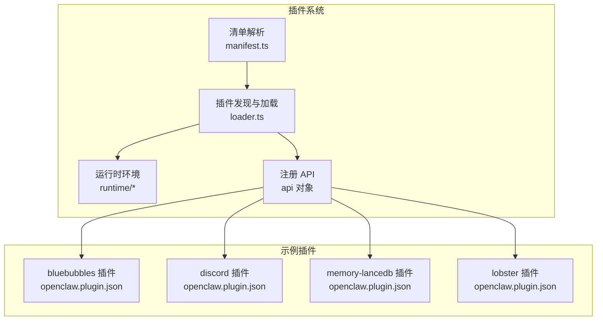
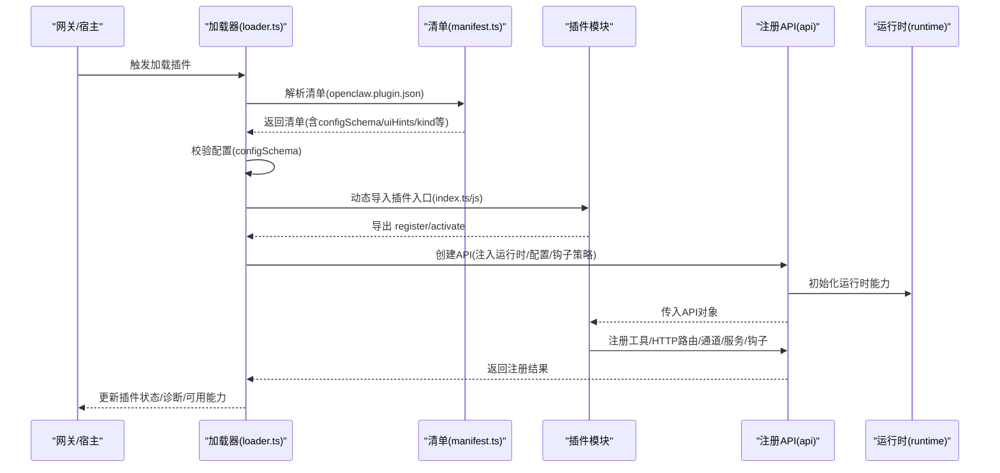
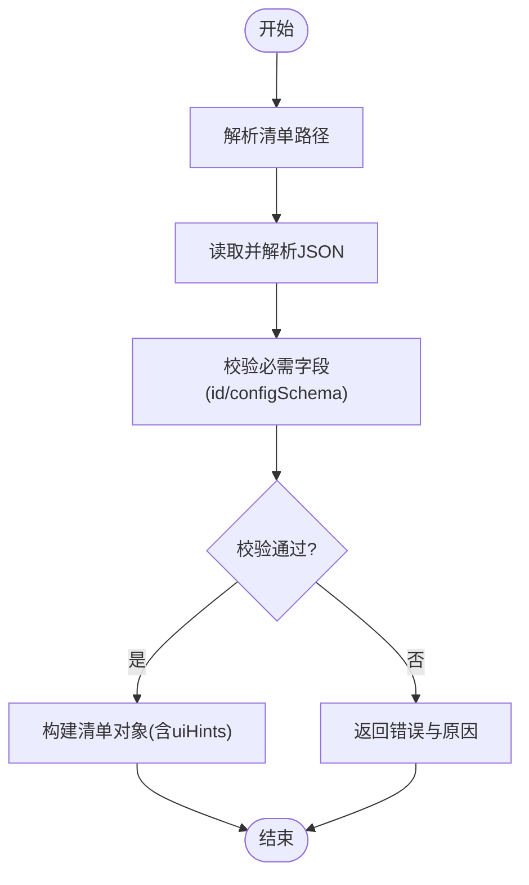
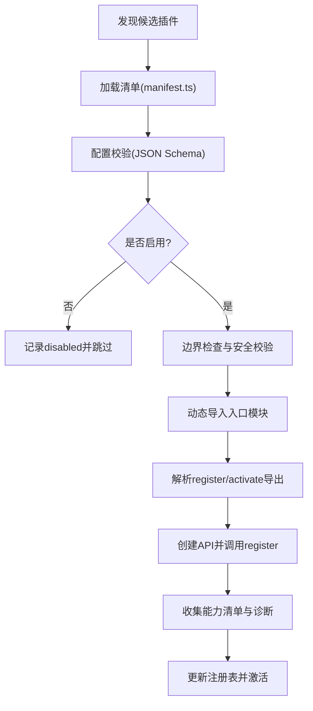
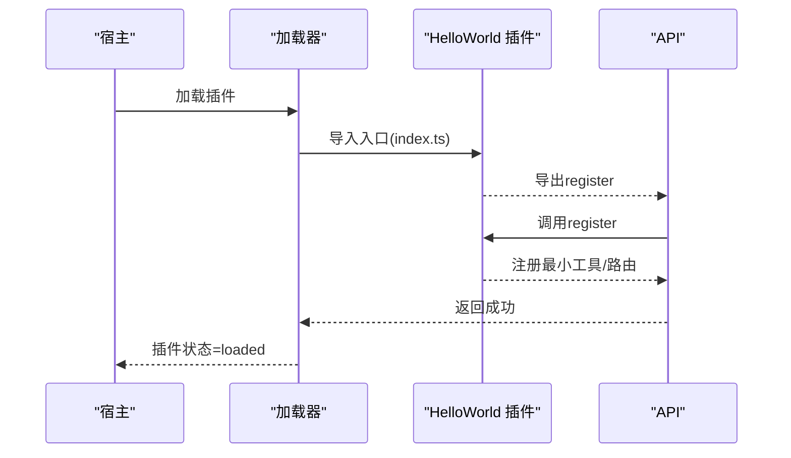
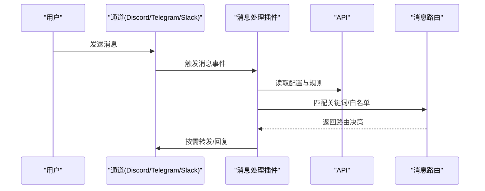
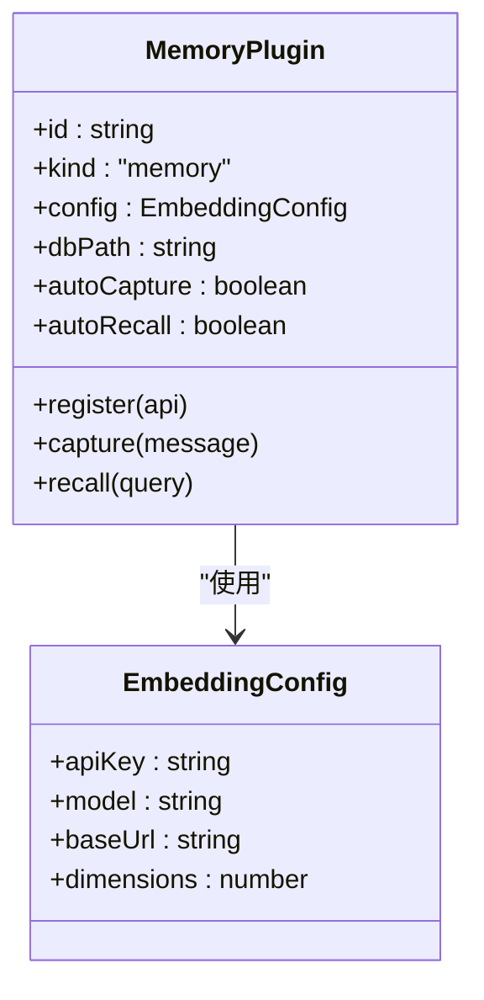
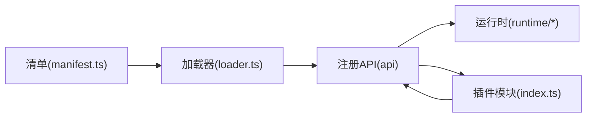

# 插件示例

<cite>
**本文引用的文件**
- [README.md](file://README.md)
- [loader.ts](file://src/plugins/loader.ts)
- [manifest.ts](file://src/plugins/manifest.ts)
- [bluebubbles/openclaw.plugin.json](file://extensions/bluebubbles/openclaw.plugin.json)
- [discord/openclaw.plugin.json](file://extensions/discord/openclaw.plugin.json)
- [memory-lancedb/openclaw.plugin.json](file://extensions/memory-lancedb/openclaw.plugin.json)
- [lobster/openclaw.plugin.json](file://extensions/lobster/openclaw.plugin.json)
</cite>

## 目录

1. [简介](#简介)
2. [项目结构](#项目结构)
3. [核心组件](#核心组件)
4. [架构总览](#架构总览)
5. [详细组件分析](#详细组件分析)
6. [依赖分析](#依赖分析)
7. [性能考虑](#性能考虑)
8. [故障排除指南](#故障排除指南)
9. [结论](#结论)
10. [附录](#附录)

## 简介

本文件面向希望在 OpenClaw 平台上开发插件的开发者，提供从入门到进阶的实用示例与最佳实践。内容覆盖三类典型插件：简单 Hello World 插件（最小化能力）、复杂消息处理插件（多通道适配与路由）、功能丰富的技能插件（带 UI 提示与配置校验）。文档同时给出项目模板、构建与部署要点、逐步实现步骤以及常见问题排查建议，帮助你在不同平台与功能场景下快速落地。

## 项目结构

OpenClaw 的插件体系由“清单（manifest）+ 加载器（loader）+ 运行时（runtime）+ 注册 API（api）”构成，插件通过 openclaw.plugin.json 清单声明元数据与配置模式，加载器负责发现、校验、实例化与注册插件，运行时提供工具与事件接口，API 则是插件注册时的契约入口。

图表来源

- [manifest.ts:1-199](file://src/plugins/manifest.ts#L1-L199)
- [loader.ts:447-800](file://src/plugins/loader.ts#L447-L800)
- [bluebubbles/openclaw.plugin.json:1-10](file://extensions/bluebubbles/openclaw.plugin.json#L1-L10)
- [discord/openclaw.plugin.json:1-10](file://extensions/discord/openclaw.plugin.json#L1-L10)
- [memory-lancedb/openclaw.plugin.json:1-89](file://extensions/memory-lancedb/openclaw.plugin.json#L1-L89)
- [lobster/openclaw.plugin.json:1-11](file://extensions/lobster/openclaw.plugin.json#L1-L11)

章节来源

- [README.md:1-560](file://README.md#L1-L560)
- [manifest.ts:1-199](file://src/plugins/manifest.ts#L1-L199)
- [loader.ts:447-800](file://src/plugins/loader.ts#L447-L800)

## 核心组件

- 清单（Plugin Manifest）
  - 作用：声明插件 id、类型（kind）、渠道/提供商/技能支持、名称描述版本、配置模式（configSchema）与 UI 提示（uiHints）。
  - 关键字段：id、kind、channels/providers/skills、name/description/version、configSchema、uiHints。
- 加载器（Plugin Loader）
  - 作用：发现候选插件、读取清单、校验配置、动态导入模块、调用 register/activate 导出、注入 API、记录诊断信息与状态。
  - 关键流程：发现 → 清单加载 → 配置校验 → 模块导入 → 注册 → 记录与激活。
- 运行时（Plugin Runtime）
  - 作用：为插件提供工具（tools）、媒体（media）、系统（system）、通道（channel）等能力接口；管理钩子（hooks）生命周期。
- 注册 API（api）
  - 作用：插件在 register 中通过 api 完成工具注册、HTTP 路由、通道适配、服务暴露、钩子订阅等。

章节来源

- [manifest.ts:11-22](file://src/plugins/manifest.ts#L11-L22)
- [loader.ts:447-800](file://src/plugins/loader.ts#L447-L800)

## 架构总览

下图展示了从插件清单到注册 API 的完整加载与注册链路，以及插件如何声明自身能力（渠道/提供商/技能）与配置模式。

图表来源

- [loader.ts:447-800](file://src/plugins/loader.ts#L447-L800)
- [manifest.ts:45-119](file://src/plugins/manifest.ts#L45-L119)

## 详细组件分析

### 组件A：清单与配置校验（manifest.ts）

- 数据模型
  - 清单对象包含 id、kind、channels/providers/skills、name/description/version、configSchema、uiHints。
  - 配置模式采用 JSON Schema，用于运行时校验插件配置。
- 关键函数
  - 解析清单路径与加载清单内容。
  - 校验清单字段完整性与类型正确性。
  - 提供 UI 提示映射（uiHints），用于控制面板渲染。
- 复杂度与性能
  - 清单解析为 O(1) 文件 IO，校验为 O(n) 字段遍历，整体开销极低。
- 错误处理
  - 不可解析、字段缺失、类型不匹配、路径越界等均会生成诊断错误。

图表来源

- [manifest.ts:35-119](file://src/plugins/manifest.ts#L35-L119)

章节来源

- [manifest.ts:11-22](file://src/plugins/manifest.ts#L11-L22)
- [manifest.ts:45-119](file://src/plugins/manifest.ts#L45-L119)

### 组件B：插件加载与注册（loader.ts）

- 发现与去重
  - 基于候选目录与安装记录构建来源索引，避免重复或冲突插件。
- 配置与安全
  - 应用测试默认禁用策略、白名单允许列表、路径边界检查、硬链接拒绝等。
- 动态导入与导出解析
  - 使用 jiti 动态加载入口模块，解析 default 或命名导出的 register/activate。
- 注册与诊断
  - 调用 register，收集插件工具、HTTP 路由、通道、提供商、服务、钩子等能力清单，并记录诊断信息。
- 性能优化
  - 懒加载运行时、缓存注册表、对内存类插件进行槽位决策以减少无效加载。

图表来源

- [loader.ts:569-800](file://src/plugins/loader.ts#L569-L800)

章节来源

- [loader.ts:447-800](file://src/plugins/loader.ts#L447-L800)

### 示例一：Hello World 插件（最小能力）

目标：创建一个仅输出“Hello World”的最小插件，验证基本加载与注册流程。

- 清单（openclaw.plugin.json）
  - id：hello-world
  - name/description：自定义
  - configSchema：空对象或最小必填项
  - kind：可选（如 tool/skill/memory 等）
- 入口（index.ts）
  - 导出 register 函数，使用 api 工具注册一个最小命令或 HTTP 路由。
- 配置
  - 在宿主配置中启用该插件并设置 allow 列表。
- 验证
  - 查看诊断日志确认加载成功，执行命令或访问路由验证输出。

图表来源

- [loader.ts:763-787](file://src/plugins/loader.ts#L763-L787)
- [manifest.ts:103-118](file://src/plugins/manifest.ts#L103-L118)

章节来源

- [manifest.ts:11-22](file://src/plugins/manifest.ts#L11-L22)
- [loader.ts:763-787](file://src/plugins/loader.ts#L763-L787)

### 示例二：复杂消息处理插件（多通道适配）

目标：实现一个跨多个通道（如 Discord、Telegram、Slack）的消息处理插件，具备路由、过滤与回复能力。

- 清单（openclaw.plugin.json）
  - id：multi-chan-handler
  - channels：["discord","telegram","slack"]
  - configSchema：包含通道白名单、关键词过滤规则、回复模板等字段。
  - uiHints：为每个配置项提供标签、占位符与帮助说明。
- 入口（index.ts）
  - 在 register 中：
    - 订阅消息钩子（before/after）。
    - 注册 HTTP 路由用于外部触发。
    - 订阅通道事件，按规则过滤消息并转发到指定会话或群组。
- 配置
  - 在宿主配置中设置各通道的令牌与允许列表。
- 验证
  - 通过不同通道发送测试消息，观察过滤与转发行为。

图表来源

- [loader.ts:763-787](file://src/plugins/loader.ts#L763-L787)
- [manifest.ts:94-96](file://src/plugins/manifest.ts#L94-L96)

章节来源

- [manifest.ts:94-96](file://src/plugins/manifest.ts#L94-L96)
- [loader.ts:763-787](file://src/plugins/loader.ts#L763-L787)

### 示例三：功能丰富的技能插件（带 UI 提示与配置）

目标：实现一个具备嵌入向量存储与自动记忆捕获/召回的技能型插件，提供完善的 UI 提示与配置校验。

- 清单（openclaw.plugin.json）
  - id：memory-lancedb
  - kind：memory
  - uiHints：为 embedding.apiKey、embedding.model、embedding.baseUrl、embedding.dimensions、dbPath、autoCapture、autoRecall、captureMaxChars 等字段提供标签、敏感标记、占位符与帮助说明。
  - configSchema：定义上述字段的数据类型、范围与必填项。
- 入口（index.ts）
  - 在 register 中：
    - 注册内存工具（如向量插入、查询）。
    - 订阅会话钩子，按策略自动捕获/召回记忆。
    - 暴露 HTTP 接口用于管理向量数据库。
- 配置
  - 在宿主配置中设置 embedding apiKey 与可选 baseUrl/dimensions，以及 dbPath、autoCapture/autoRecall 等开关。
- 验证
  - 通过 UI 控制面板查看与编辑配置，发送测试消息观察自动捕获/召回效果。

图表来源

- [memory-lancedb/openclaw.plugin.json:1-89](file://extensions/memory-lancedb/openclaw.plugin.json#L1-L89)

章节来源

- [memory-lancedb/openclaw.plugin.json:1-89](file://extensions/memory-lancedb/openclaw.plugin.json#L1-L89)

### 示例四：通道适配插件（以 BlueBubbles 为例）

目标：基于现有通道插件（如 BlueBubbles）学习如何适配特定 IM 协议。

- 清单（openclaw.plugin.json）
  - id：bluebubbles
  - channels：["bluebubbles"]
  - configSchema：空对象或少量必要参数。
- 入口（index.ts）
  - 在 register 中：
    - 订阅通道事件（接收/发送）。
    - 实现消息格式转换与回执上报。
- 配置
  - 在宿主配置中设置 BlueBubbles 服务器地址与密码。
- 验证
  - 通过 BlueBubbles 通道收发消息，观察插件日志与状态。

章节来源

- [bluebubbles/openclaw.plugin.json:1-10](file://extensions/bluebubbles/openclaw.plugin.json#L1-L10)

### 示例五：工具型插件（以 Lobster 为例）

目标：学习工具型插件的最小实现，用于工作流编排与审批。

- 清单（openclaw.plugin.json）
  - id：lobster
  - name/description：自定义
  - configSchema：空对象或最小必填项。
- 入口（index.ts）
  - 在 register 中：
    - 注册工具（如 typed workflow）。
    - 支持可恢复的审批流程。
- 验证
  - 在 UI 中调用工具，观察流程状态与审批结果。

章节来源

- [lobster/openclaw.plugin.json:1-11](file://extensions/lobster/openclaw.plugin.json#L1-L11)

## 依赖分析

- 组件耦合
  - 加载器依赖清单解析与运行时；插件通过 API 与运行时交互；插件之间无直接耦合，通过宿主统一调度。
- 外部依赖
  - jiti 用于动态导入；JSON Schema 校验；边界文件读取保障安全性。
- 潜在循环依赖
  - 通过懒加载运行时与模块化 API，避免了循环依赖风险。
- 接口契约
  - 插件必须导出 register/activate；清单必须包含 id 与 configSchema；否则加载失败。

图表来源

- [loader.ts:503-507](file://src/plugins/loader.ts#L503-L507)
- [manifest.ts:45-119](file://src/plugins/manifest.ts#L45-L119)

章节来源

- [loader.ts:503-507](file://src/plugins/loader.ts#L503-L507)
- [manifest.ts:45-119](file://src/plugins/manifest.ts#L45-L119)

## 性能考虑

- 启动阶段
  - 使用懒加载运行时，避免在单元测试或仅发现场景下加载重型依赖。
  - 缓存注册表，相同配置与工作区下的重复加载可复用结果。
- 运行阶段
  - 严格的安全边界检查与路径限制，防止越界与硬链接带来的潜在风险。
  - 对内存类插件进行槽位决策，减少不必要的初始化。
- 配置校验
  - 在加载期完成 JSON Schema 校验，避免运行期因配置错误导致的异常。

## 故障排除指南

- 常见错误与定位
  - 清单缺失或非法：检查 openclaw.plugin.json 是否存在且符合规范。
  - 配置校验失败：根据诊断信息修正 configSchema 中的字段类型与必填项。
  - 模块导入失败：确认入口文件路径与导出名（register/activate）正确。
  - 权限与路径问题：确保插件根目录未被硬链接，且在允许列表内。
- 诊断与日志
  - 加载器会记录插件状态（loaded/disabled/error）与错误信息，可通过诊断接口查看。
- 快速修复建议
  - 将 plugins.allow 设为明确信任的插件 id 列表。
  - 对未受控来源的插件，建议通过安装记录或显式 loadPaths 进行追踪与信任绑定。

章节来源

- [loader.ts:256-284](file://src/plugins/loader.ts#L256-L284)
- [loader.ts:407-410](file://src/plugins/loader.ts#L407-L410)
- [loader.ts:430-440](file://src/plugins/loader.ts#L430-L440)

## 结论

通过以上示例与最佳实践，你可以快速搭建从简单到复杂的 OpenClaw 插件。建议遵循“清单先行、配置校验、最小入口、清晰能力”的原则，结合运行时提供的工具与钩子，实现稳定、可维护且可扩展的插件生态。

## 附录

### 项目模板与构建脚本

- 项目模板
  - 清单文件：openclaw.plugin.json（包含 id、configSchema、kind、channels/providers/skills、uiHints 等）。
  - 入口文件：index.ts（导出 register/activate，使用 api 注册能力）。
- 构建与部署
  - 使用宿主提供的 CLI 与配置文件进行安装与启用。
  - 在 CI/CD 中可先执行 validate 模式，确保清单与配置合法后再上线。

章节来源

- [manifest.ts:11-22](file://src/plugins/manifest.ts#L11-L22)
- [loader.ts:452-453](file://src/plugins/loader.ts#L452-L453)

### 步骤实现指导（通用）

- 第一步：创建 openclaw.plugin.json，填写 id、kind、channels/providers/skills、configSchema、uiHints。
- 第二步：编写 index.ts，导出 register/activate，在其中使用 api 注册工具/HTTP 路由/通道/服务/钩子。
- 第三步：在宿主配置中启用插件并设置 allow 列表。
- 第四步：启动宿主，查看诊断日志，验证加载与功能。
- 第五步：迭代完善 UI 提示与配置校验，发布与分发。

章节来源

- [loader.ts:763-787](file://src/plugins/loader.ts#L763-L787)
- [manifest.ts:103-118](file://src/plugins/manifest.ts#L103-L118)
