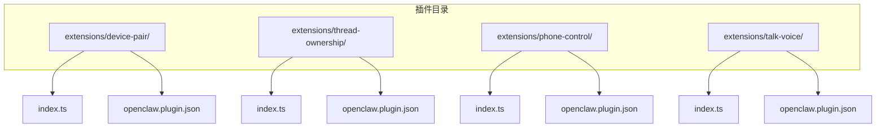
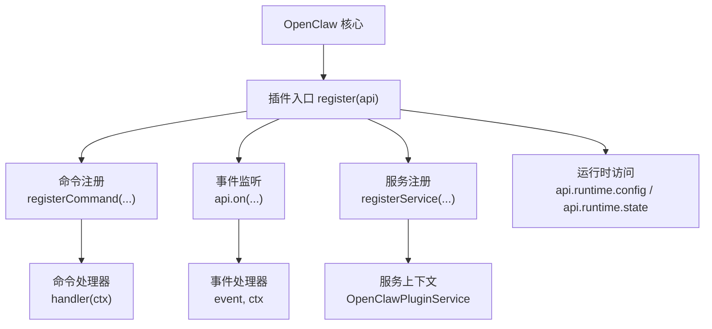
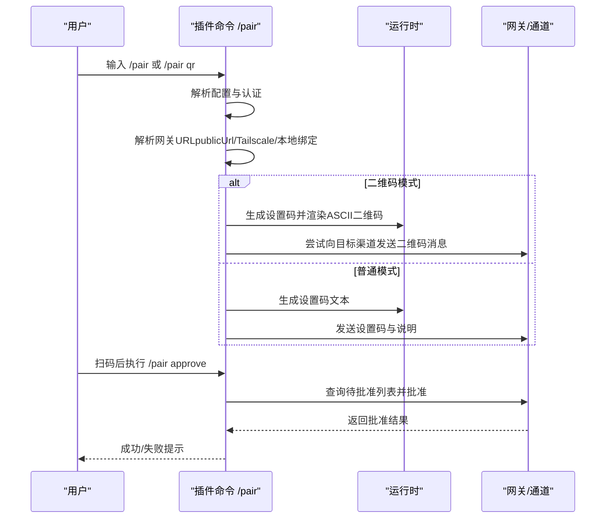
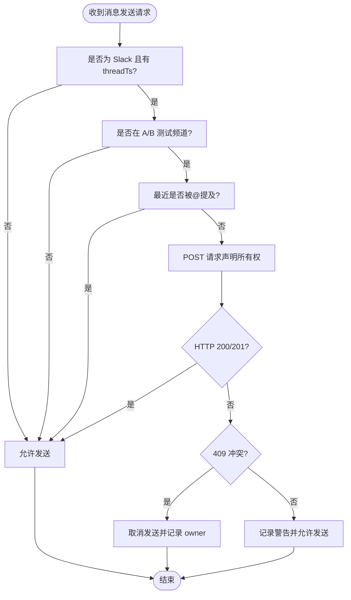
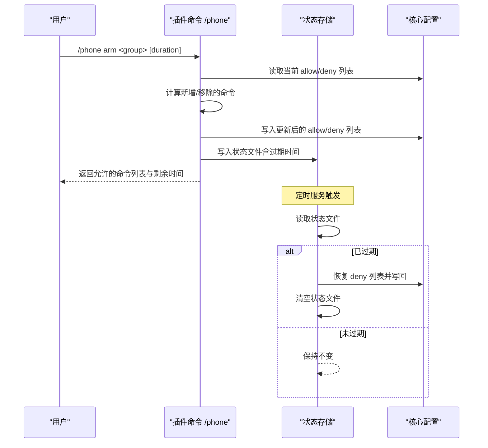
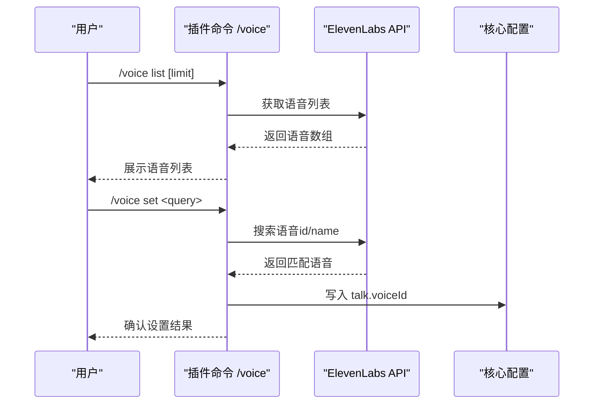
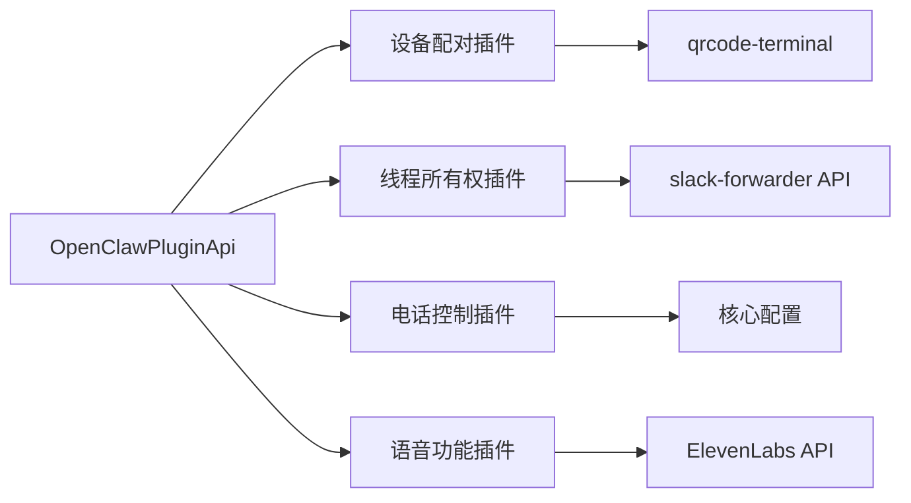

# 简单插件示例

<cite>
**本文引用的文件**
- [extensions/device-pair/index.ts](file://extensions/device-pair/index.ts)
- [extensions/device-pair/openclaw.plugin.json](file://extensions/device-pair/openclaw.plugin.json)
- [extensions/thread-ownership/index.ts](file://extensions/thread-ownership/index.ts)
- [extensions/thread-ownership/openclaw.plugin.json](file://extensions/thread-ownership/openclaw.plugin.json)
- [extensions/phone-control/index.ts](file://extensions/phone-control/index.ts)
- [extensions/phone-control/openclaw.plugin.json](file://extensions/phone-control/openclaw.plugin.json)
- [extensions/talk-voice/index.ts](file://extensions/talk-voice/index.ts)
- [extensions/talk-voice/openclaw.plugin.json](file://extensions/talk-voice/openclaw.plugin.json)
- [extensions/voice-call/openclaw.plugin.json](file://extensions/voice-call/openclaw.plugin.json)
- [src/plugin-sdk/index.ts](file://src/plugin-sdk/index.ts)
- [docs/plugins/manifest.md](file://docs/plugins/manifest.md)
- [docs/plugins/agent-tools.md](file://docs/plugins/agent-tools.md)
</cite>

## 目录

1. [简介](#简介)
2. [项目结构](#项目结构)
3. [核心组件](#核心组件)
4. [架构总览](#架构总览)
5. [详细组件分析](#详细组件分析)
6. [依赖分析](#依赖分析)
7. [性能考虑](#性能考虑)
8. [故障排查指南](#故障排查指南)
9. [结论](#结论)
10. [附录](#附录)

## 简介

本文件面向希望快速上手 OpenClaw 插件开发的开发者，聚焦四个“简单插件示例”的完整实现与最佳实践：设备配对插件、线程所有权管理插件、电话控制插件与语音功能插件。内容涵盖插件结构、生命周期管理、事件处理、命令注册、配置校验、错误处理与扩展点等，帮助你在最短时间内构建可运行、可维护、可配置的插件。

## 项目结构

OpenClaw 插件以“插件目录 + 插件入口 + 清单文件”三元组组织。每个插件在根目录提供 TypeScript 入口文件（通常为 index.ts），并在同一目录下提供 openclaw.plugin.json 清单文件，用于声明插件标识、名称、描述以及严格 JSON Schema 配置模式。清单文件由 OpenClaw 在加载前进行离线校验，确保配置安全与一致性。

图表来源

- [extensions/device-pair/index.ts](file://extensions/device-pair/index.ts)
- [extensions/thread-ownership/index.ts](file://extensions/thread-ownership/index.ts)
- [extensions/phone-control/index.ts](file://extensions/phone-control/index.ts)
- [extensions/talk-voice/index.ts](file://extensions/talk-voice/index.ts)

章节来源

- [docs/plugins/manifest.md:18-76](file://docs/plugins/manifest.md#L18-L76)

## 核心组件

- 插件入口函数：每个插件导出默认函数 register(api)，作为插件生命周期与能力注册的唯一入口。该函数接收 OpenClawPluginApi，通过其提供的方法完成命令注册、事件监听、服务启动等。
- 插件清单 openclaw.plugin.json：声明插件 id、名称、描述、配置 Schema 与 UI 提示信息。清单是插件安装与配置校验的依据。
- 插件 SDK 类型与工具：位于 src/plugin-sdk/index.ts，提供 OpenClawPluginApi、OpenClawPluginService、事件钩子、运行时访问器、网络与安全工具等。

章节来源

- [src/plugin-sdk/index.ts:1-120](file://src/plugin-sdk/index.ts#L1-L120)
- [docs/plugins/manifest.md:18-76](file://docs/plugins/manifest.md#L18-L76)

## 架构总览

四个示例插件均遵循统一的插件开发范式：在 register 中注册命令与事件，在需要时启动后台服务（如定时任务），并通过 api.runtime 访问配置与状态目录，实现配置持久化与状态恢复。

图表来源

- [src/plugin-sdk/index.ts:98-120](file://src/plugin-sdk/index.ts#L98-L120)
- [extensions/device-pair/index.ts:326-550](file://extensions/device-pair/index.ts#L326-L550)
- [extensions/thread-ownership/index.ts:42-134](file://extensions/thread-ownership/index.ts#L42-L134)
- [extensions/phone-control/index.ts:286-422](file://extensions/phone-control/index.ts#L286-L422)
- [extensions/talk-voice/index.ts:84-163](file://extensions/talk-voice/index.ts#L84-L163)

## 详细组件分析

### 设备配对插件（device-pair）

- 职责：生成配对设置码、支持二维码展示、批准设备配对请求、通知通道（如 Telegram）的一次性提醒。
- 关键能力
  - 命令 /pair：支持 status/pending、notify、approve、qr、普通模式生成设置码。
  - 自动解析网关 URL：优先 publicUrl，其次 Tailscale Serve/Funnel，再回退到本地绑定地址。
  - 权限解析：支持 token/password 两种认证方式，按配置与环境变量解析。
  - 通知增强：在 Telegram 上支持一次性配对提醒，提升用户体验。
- 生命周期与事件
  - 插件启动时注册配对通知服务；命令执行时根据渠道能力选择发送策略。
- 错误处理
  - URL 解析失败、认证缺失、通道不可用等场景均有明确错误提示。
- 配置要点
  - 支持插件级 publicUrl 字段，便于外网直连场景。
  - 网关 TLS、端口、远程地址、Tailscale 模式等由核心配置驱动。

图表来源

- [extensions/device-pair/index.ts:326-550](file://extensions/device-pair/index.ts#L326-L550)

章节来源

- [extensions/device-pair/index.ts:28-550](file://extensions/device-pair/index.ts#L28-L550)
- [extensions/device-pair/openclaw.plugin.json:1-21](file://extensions/device-pair/openclaw.plugin.json#L1-L21)

### 线程所有权管理插件（thread-ownership）

- 职责：在 Slack 多代理并发场景中，避免多个代理同时回复同一话题（thread）。通过 HTTP API 向 slack-forwarder 查询或声明线程所有权，若被占用则取消发送。
- 关键能力
  - 监听 message_received：记录最近提及（@）的线程，5 分钟过期。
  - 监听 message_sending：在目标为 Slack 且为话题消息时，尝试声明所有权；若冲突则取消发送。
  - 可选 A/B 测试通道集合，仅在指定频道启用。
- 生命周期与事件
  - 使用 api.on 注册事件钩子；内部使用 Map 维护内存缓存。
- 错误处理
  - 网络异常或非预期状态码时采用“宽松放行”，保证系统可用性。
- 配置要点
  - forwarderUrl：slack-forwarder 的 HTTP API 地址。
  - abTestChannels：启用强制线程所有权的频道集合。

图表来源

- [extensions/thread-ownership/index.ts:63-134](file://extensions/thread-ownership/index.ts#L63-L134)

章节来源

- [extensions/thread-ownership/index.ts:1-134](file://extensions/thread-ownership/index.ts#L1-L134)
- [extensions/thread-ownership/openclaw.plugin.json:1-29](file://extensions/thread-ownership/openclaw.plugin.json#L1-L29)

### 电话控制插件（phone-control）

- 职责：临时放行高风险手机节点命令（相机拍照/录像、屏幕录制、日历/联系人/提醒事项、短信发送），支持手动解除与到期自动解除。
- 关键能力
  - 命令 /phone：status/arm/disarm/help，支持 camera/screen/writes/all 分组与可选时长。
  - 状态持久化：使用状态文件记录 armedAtMs、expiresAtMs、分组与命令变更集。
  - 定时服务：周期性检查过期并自动解除。
  - 配置联动：动态修改 gateway.nodes.allowCommands 与 denyCommands 列表。
- 生命周期与事件
  - 注册定时服务（registerService），在服务启动时开始轮询，停止时清理定时器。
- 错误处理
  - 状态文件损坏时尽力恢复，避免影响主流程。
- 配置要点
  - 无插件级配置字段，依赖核心配置中的命令白名单/黑名单。

图表来源

- [extensions/phone-control/index.ts:286-422](file://extensions/phone-control/index.ts#L286-L422)

章节来源

- [extensions/phone-control/index.ts:1-422](file://extensions/phone-control/index.ts#L1-L422)
- [extensions/phone-control/openclaw.plugin.json:1-11](file://extensions/phone-control/openclaw.plugin.json#L1-L11)

### 语音功能插件（talk-voice）

- 职责：管理 Talk 语音（ElevenLabs），支持列出语音、查询当前语音、设置新语音，并将变更写回配置。
- 关键能力
  - 命令 /voice 或 Discord 下的 /talkvoice：status/list/set/help。
  - 与 ElevenLabs API 交互，支持按 id/name 查找语音。
  - 读取/写入核心配置中的 talk.apiKey 与 talk.voiceId。
- 生命周期与事件
  - 无后台服务，纯命令驱动。
- 错误处理
  - 缺少 apiKey 时给出明确指引；找不到语音时提供搜索建议。
- 配置要点
  - 依赖核心配置中的 talk.apiKey 与 talk.voiceId。

图表来源

- [extensions/talk-voice/index.ts:84-163](file://extensions/talk-voice/index.ts#L84-L163)

章节来源

- [extensions/talk-voice/index.ts:1-163](file://extensions/talk-voice/index.ts#L1-L163)
- [extensions/talk-voice/openclaw.plugin.json:1-11](file://extensions/talk-voice/openclaw.plugin.json#L1-L11)

## 依赖分析

- 插件与 SDK 的耦合
  - 所有插件通过 OpenClawPluginApi 访问命令注册、事件监听、服务注册、运行时配置与状态目录等能力。
- 插件间关系
  - 四个示例插件彼此独立，无直接依赖；它们共同构成“设备接入—消息路由—权限控制—语音输出”的典型链路。
- 外部依赖
  - 设备配对插件依赖 qrcode-terminal 进行二维码渲染。
  - 语音功能插件依赖外部 ElevenLabs API。
  - 线程所有权插件依赖 slack-forwarder HTTP API。
  - 电话控制插件依赖核心配置的命令白名单/黑名单。

图表来源

- [src/plugin-sdk/index.ts:98-120](file://src/plugin-sdk/index.ts#L98-L120)
- [extensions/device-pair/index.ts:10-16](file://extensions/device-pair/index.ts#L10-L16)
- [extensions/talk-voice/index.ts:26-37](file://extensions/talk-voice/index.ts#L26-L37)
- [extensions/thread-ownership/index.ts:104-132](file://extensions/thread-ownership/index.ts#L104-L132)
- [extensions/phone-control/index.ts:1-4](file://extensions/phone-control/index.ts#L1-L4)

章节来源

- [src/plugin-sdk/index.ts:1-826](file://src/plugin-sdk/index.ts#L1-L826)

## 性能考虑

- 设备配对插件
  - 二维码渲染为同步阻塞操作，建议在低频场景使用；对 Telegram 等渠道可优先发送二维码消息，减少重复渲染。
- 线程所有权插件
  - 定时轮询间隔为固定周期，建议结合实际并发量调整超时与重试策略，避免频繁网络请求。
- 电话控制插件
  - 状态文件读写与配置写回为轻量操作；定时器每 15 秒检查一次，适合短期临时授权场景。
- 语音功能插件
  - 语音列表拉取为一次性请求，建议在 UI 层做缓存；设置语音时仅写入配置文件，避免频繁网络调用。

## 故障排查指南

- 插件清单校验失败
  - 现象：插件无法加载或 Doctor 报错。
  - 排查：确认 openclaw.plugin.json 存在且 JSON Schema 合法；字段名与类型需与清单一致。
- 设备配对 URL 不可达
  - 现象：/pair 生成的设置码无法连接。
  - 排查：检查 publicUrl、Tailscale Serve/Funnel、本地绑定地址与端口；确认认证配置正确。
- 线程所有权冲突
  - 现象：消息被取消发送。
  - 排查：确认 slack-forwarder API 可达；检查 409 冲突返回的 owner；核对 A/B 测试频道配置。
- 电话控制未生效
  - 现象：arm 后仍被拒绝。
  - 排查：确认 allow/deny 列表已写入；检查状态文件是否损坏；验证定时服务是否正常运行。
- 语音功能设置失败
  - 现象：/voice set 无效。
  - 排查：确认 talk.apiKey 已配置；检查 ElevenLabs API 返回状态；确认 voiceId 是否存在。

章节来源

- [docs/plugins/manifest.md:53-63](file://docs/plugins/manifest.md#L53-L63)
- [extensions/device-pair/index.ts:396-404](file://extensions/device-pair/index.ts#L396-L404)
- [extensions/thread-ownership/index.ts:117-132](file://extensions/thread-ownership/index.ts#L117-L132)
- [extensions/phone-control/index.ts:352-367](file://extensions/phone-control/index.ts#L352-L367)
- [extensions/talk-voice/index.ts:98-107](file://extensions/talk-voice/index.ts#L98-L107)

## 结论

四个简单插件示例展示了 OpenClaw 插件开发的通用范式：以 register 为中心，结合命令、事件与服务三大能力，配合严格的清单校验与运行时配置访问，即可快速实现从设备接入、线程治理、权限控制到语音输出的完整闭环。建议在生产环境中进一步完善错误处理、可观测性与安全策略。

## 附录

### 插件清单与配置校验

- 清单要求
  - 必填字段：id、configSchema。
  - 可选字段：name、description、uiHints、version 等。
  - JSON Schema 用于离线校验，禁止未知字段。
- 验证行为
  - 未知通道/插件 id 视为错误；禁用插件但存在配置时会发出警告。

章节来源

- [docs/plugins/manifest.md:18-76](file://docs/plugins/manifest.md#L18-L76)

### 插件工具（可选工具）

- 可选工具需显式加入 allowlist 才能被代理调用。
- 工具命名不得与核心工具冲突；插件 id 可用于批量启用。

章节来源

- [docs/plugins/agent-tools.md:38-100](file://docs/plugins/agent-tools.md#L38-L100)

### 语音通话插件（参考）

- 语音通话插件提供了丰富的配置项与 UI 提示，包括提供商、号码、入站策略、TTS/STT、实时流等。可作为复杂插件的参考模板。

章节来源

- [extensions/voice-call/openclaw.plugin.json:1-601](file://extensions/voice-call/openclaw.plugin.json#L1-L601)
