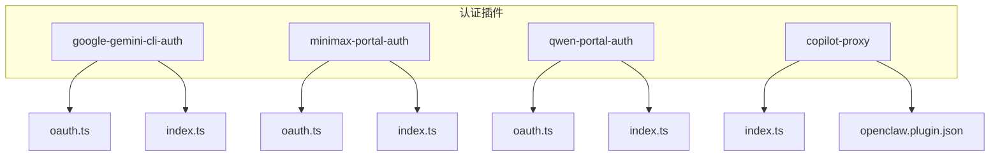
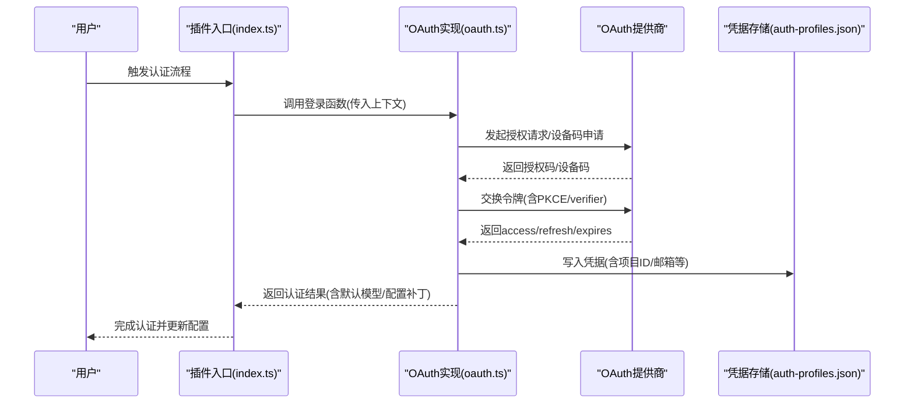
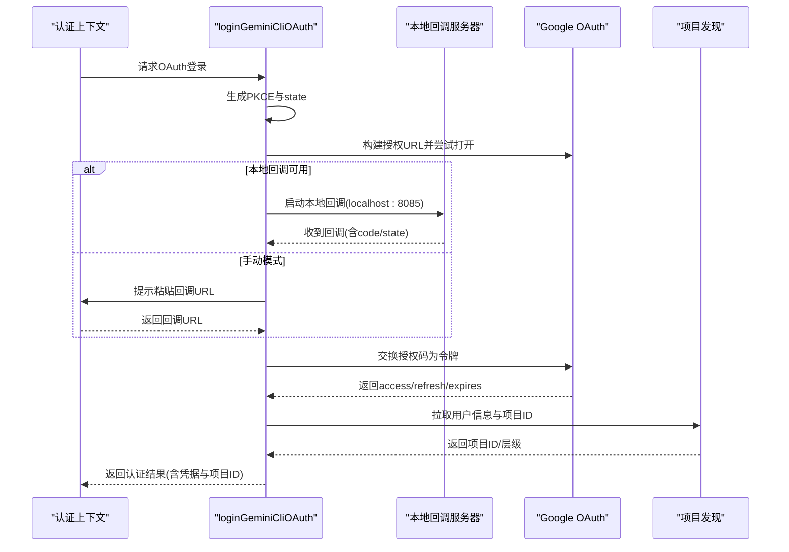
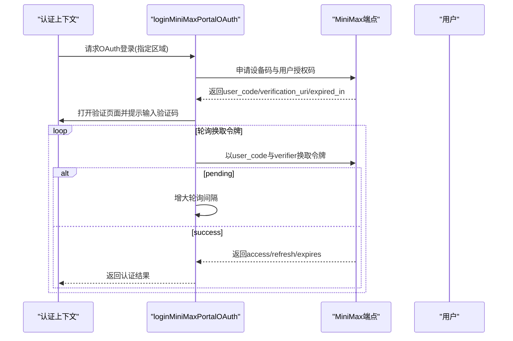
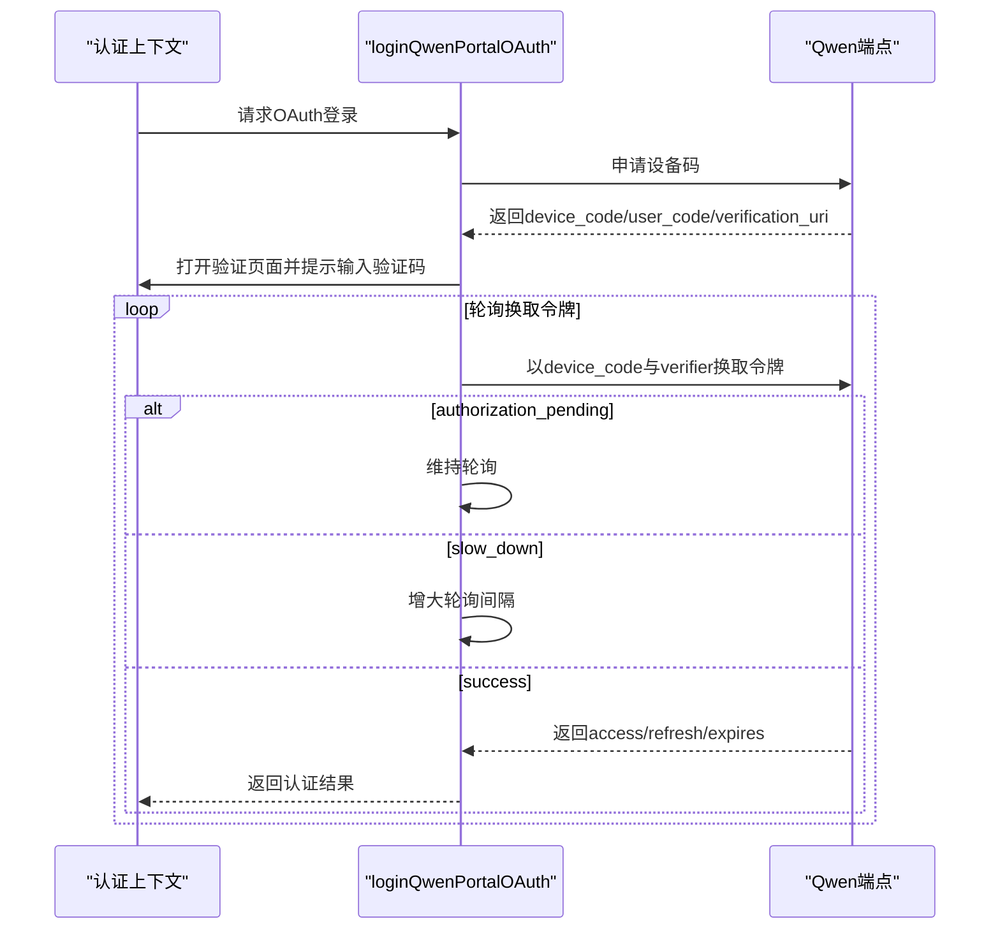
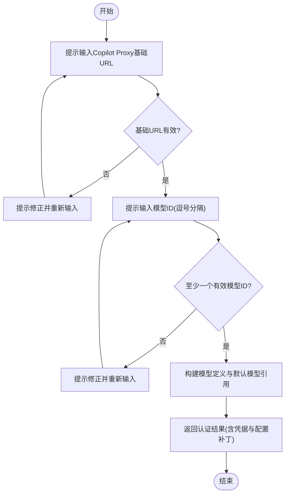
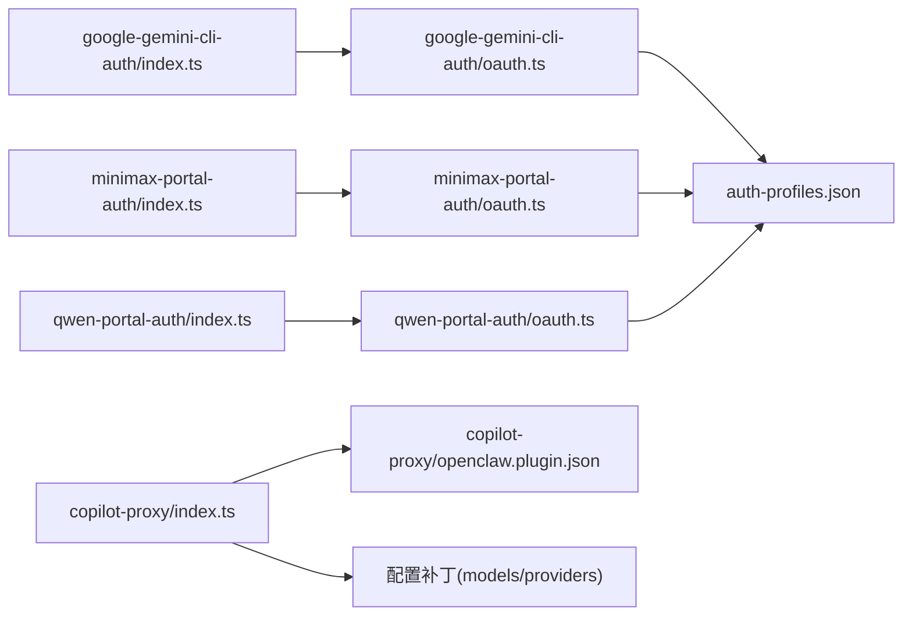

# 认证插件示例

<cite>
**本文档引用的文件**
- [extensions/google-gemini-cli-auth/oauth.ts](file://extensions/google-gemini-cli-auth/oauth.ts)
- [extensions/google-gemini-cli-auth/index.ts](file://extensions/google-gemini-cli-auth/index.ts)
- [extensions/google-gemini-cli-auth/oauth.test.ts](file://extensions/google-gemini-cli-auth/oauth.test.ts)
- [extensions/minimax-portal-auth/oauth.ts](file://extensions/minimax-portal-auth/oauth.ts)
- [extensions/minimax-portal-auth/index.ts](file://extensions/minimax-portal-auth/index.ts)
- [extensions/qwen-portal-auth/oauth.ts](file://extensions/qwen-portal-auth/oauth.ts)
- [extensions/qwen-portal-auth/index.ts](file://extensions/qwen-portal-auth/index.ts)
- [extensions/copilot-proxy/index.ts](file://extensions/copilot-proxy/index.ts)
- [extensions/copilot-proxy/README.md](file://extensions/copilot-proxy/README.md)
- [extensions/copilot-proxy/openclaw.plugin.json](file://extensions/copilot-proxy/openclaw.plugin.json)
- [docs/concepts/oauth.md](file://docs/concepts/oauth.md)
- [docs/gateway/authentication.md](file://docs/gateway/authentication.md)
- [docs/gateway/secrets.md](file://docs/gateway/secrets.md)
- [docs/security/README.md](file://docs/security/README.md)
- [SECURITY.md](file://SECURITY.md)
</cite>

## 目录

1. [简介](#简介)
2. [项目结构](#项目结构)
3. [核心组件](#核心组件)
4. [架构总览](#架构总览)
5. [详细组件分析](#详细组件分析)
6. [依赖关系分析](#依赖关系分析)
7. [性能考量](#性能考量)
8. [故障排查指南](#故障排查指南)
9. [结论](#结论)
10. [附录](#附录)

## 简介

本文件面向OpenClaw认证插件示例的安全文档，系统性介绍以下认证插件的实现与安全设计：

- Google Gemini CLI认证（OAuth PKCE + 本地回调）
- MiniMax门户认证（设备码授权流）
- Qwen门户认证（设备码授权流）
- GitHub Copilot代理认证（自定义凭据与模型注册）

文档覆盖OAuth流程、令牌管理、安全存储机制、回调处理、错误恢复策略，并给出安全最佳实践、令牌刷新与多因素认证的实现建议。

## 项目结构

认证插件位于extensions目录下，每个插件以独立子目录组织，包含：

- 插件入口与注册逻辑（index.ts）
- 认证流程实现（oauth.ts）
- 插件元数据（openclaw.plugin.json）
- 使用说明（README.md）与测试（oauth.test.ts）

图表来源

- [extensions/google-gemini-cli-auth/index.ts:19-76](file://extensions/google-gemini-cli-auth/index.ts#L19-L76)
- [extensions/minimax-portal-auth/index.ts:133-165](file://extensions/minimax-portal-auth/index.ts#L133-L165)
- [extensions/qwen-portal-auth/index.ts:39-127](file://extensions/qwen-portal-auth/index.ts#L39-L127)
- [extensions/copilot-proxy/index.ts:74-155](file://extensions/copilot-proxy/index.ts#L74-L155)

章节来源

- [extensions/google-gemini-cli-auth/index.ts:19-76](file://extensions/google-gemini-cli-auth/index.ts#L19-L76)
- [extensions/minimax-portal-auth/index.ts:133-165](file://extensions/minimax-portal-auth/index.ts#L133-L165)
- [extensions/qwen-portal-auth/index.ts:39-127](file://extensions/qwen-portal-auth/index.ts#L39-L127)
- [extensions/copilot-proxy/index.ts:74-155](file://extensions/copilot-proxy/index.ts#L74-L155)

## 核心组件

- OAuth概念与存储：OpenClaw采用“令牌水池”（auth-profiles.json）集中存储OAuth凭据，支持多账户路由与自动刷新。
- 令牌存储位置：按Agent隔离，路径受$OPENCLAW_STATE_DIR影响；兼容历史导入文件。
- 多账户模式：推荐使用独立Agent隔离，或在单Agent内通过配置顺序与会话别名选择不同Profile。
- 刷新与过期：Profile中保存expires时间戳，运行时自动刷新并写回；失败时提示重新登录。

章节来源

- [docs/concepts/oauth.md:41-122](file://docs/concepts/oauth.md#L41-L122)
- [docs/gateway/authentication.md:11-57](file://docs/gateway/authentication.md#L11-L57)

## 架构总览

认证插件通过OpenClaw插件SDK注册Provider与认证流程，调用各自OAuth实现完成令牌交换与项目发现，最终返回可注入到配置中的凭据与模型定义。

图表来源

- [extensions/google-gemini-cli-auth/index.ts:37-69](file://extensions/google-gemini-cli-auth/index.ts#L37-L69)
- [extensions/google-gemini-cli-auth/oauth.ts:659-735](file://extensions/google-gemini-cli-auth/oauth.ts#L659-L735)
- [extensions/minimax-portal-auth/index.ts:48-131](file://extensions/minimax-portal-auth/index.ts#L48-L131)
- [extensions/minimax-portal-auth/oauth.ts:184-245](file://extensions/minimax-portal-auth/oauth.ts#L184-L245)
- [extensions/qwen-portal-auth/index.ts:56-120](file://extensions/qwen-portal-auth/index.ts#L56-L120)
- [extensions/qwen-portal-auth/oauth.ts:132-183](file://extensions/qwen-portal-auth/oauth.ts#L132-L183)

## 详细组件分析

### Google Gemini CLI认证（OAuth PKCE + 本地回调）

- 流程要点
  - 解析环境变量或从已安装的Gemini CLI提取客户端ID/密钥。
  - 生成PKCE verifier/challenge与state，构建授权URL。
  - 支持远程/WSL2场景的手动粘贴回调与本地回调服务器两种模式。
  - 交换授权码为访问令牌与刷新令牌，拉取用户邮箱与项目ID，必要时进行项目发现与分层回退。
- 安全特性
  - 使用PKCE防止授权码拦截；state用于CSRF防护。
  - 本地回调端口仅监听localhost，避免公网暴露。
  - 令牌交换与项目发现均使用带超时的受保护网络调用封装。
- 错误恢复
  - 回调服务器端口占用时自动切换至手动模式。
  - 多端点项目发现回退，优先标准层级，其次环境变量指定项目ID。
- 配置与回调
  - 支持通过环境变量覆盖客户端凭据。
  - 自动打开浏览器或提示手动复制粘贴URL。
  - 进度与日志通过上下文接口反馈。

图表来源

- [extensions/google-gemini-cli-auth/oauth.ts:659-735](file://extensions/google-gemini-cli-auth/oauth.ts#L659-L735)
- [extensions/google-gemini-cli-auth/oauth.ts:305-396](file://extensions/google-gemini-cli-auth/oauth.ts#L305-L396)
- [extensions/google-gemini-cli-auth/oauth.ts:398-450](file://extensions/google-gemini-cli-auth/oauth.ts#L398-L450)
- [extensions/google-gemini-cli-auth/oauth.ts:467-604](file://extensions/google-gemini-cli-auth/oauth.ts#L467-L604)

章节来源

- [extensions/google-gemini-cli-auth/oauth.ts:197-215](file://extensions/google-gemini-cli-auth/oauth.ts#L197-215)
- [extensions/google-gemini-cli-auth/oauth.ts:221-225](file://extensions/google-gemini-cli-auth/oauth.ts#L221-225)
- [extensions/google-gemini-cli-auth/oauth.ts:261-275](file://extensions/google-gemini-cli-auth/oauth.ts#L261-275)
- [extensions/google-gemini-cli-auth/oauth.ts:305-396](file://extensions/google-gemini-cli-auth/oauth.ts#L305-396)
- [extensions/google-gemini-cli-auth/oauth.ts:398-450](file://extensions/google-gemini-cli-auth/oauth.ts#L398-450)
- [extensions/google-gemini-cli-auth/oauth.ts:467-604](file://extensions/google-gemini-cli-auth/oauth.ts#L467-604)
- [extensions/google-gemini-cli-auth/index.ts:37-69](file://extensions/google-gemini-cli-auth/index.ts#L37-69)
- [extensions/google-gemini-cli-auth/oauth.test.ts:225-423](file://extensions/google-gemini-cli-auth/oauth.test.ts#L225-423)

### MiniMax门户认证（设备码授权流）

- 流程要点
  - 生成PKCE并请求设备码与用户授权码，打开验证页面并提示输入一次性验证码。
  - 循环轮询换取访问令牌，支持慢速重试与超时控制。
  - 成功后根据区域选择默认基础URL，构建模型定义与默认模型引用。
- 安全特性
  - 使用PKCE与随机state，防止中间人攻击。
  - 设备码轮询间隔指数增长，避免过度轮询。
- 错误恢复
  - 授权未完成超时则抛出明确错误。
  - 区域差异通过配置映射处理。

图表来源

- [extensions/minimax-portal-auth/oauth.ts:184-245](file://extensions/minimax-portal-auth/oauth.ts#L184-245)
- [extensions/minimax-portal-auth/oauth.ts:62-101](file://extensions/minimax-portal-auth/oauth.ts#L62-101)
- [extensions/minimax-portal-auth/oauth.ts:103-182](file://extensions/minimax-portal-auth/oauth.ts#L103-182)
- [extensions/minimax-portal-auth/index.ts:48-131](file://extensions/minimax-portal-auth/index.ts#L48-131)

章节来源

- [extensions/minimax-portal-auth/oauth.ts:7-18](file://extensions/minimax-portal-auth/oauth.ts#L7-18)
- [extensions/minimax-portal-auth/oauth.ts:56-60](file://extensions/minimax-portal-auth/oauth.ts#L56-60)
- [extensions/minimax-portal-auth/oauth.ts:62-101](file://extensions/minimax-portal-auth/oauth.ts#L62-101)
- [extensions/minimax-portal-auth/oauth.ts:103-182](file://extensions/minimax-portal-auth/oauth.ts#L103-182)
- [extensions/minimax-portal-auth/index.ts:48-131](file://extensions/minimax-portal-auth/index.ts#L48-131)

### Qwen门户认证（设备码授权流）

- 流程要点
  - 申请设备码与用户授权码，打开验证页面并提示输入一次性验证码。
  - 轮询换取令牌，支持“slow_down”降频与超时控制。
  - 根据返回的资源URL或默认URL构建基础URL，注册模型与默认模型引用。
- 安全特性
  - 设备码轮询具备指数退避与超时保护。
  - 使用PKCE与随机state，防止授权码泄露。
- 错误恢复
  - 授权未完成超时则抛出明确错误。
  - 对慢查询与挂起状态进行差异化处理。

图表来源

- [extensions/qwen-portal-auth/oauth.ts:132-183](file://extensions/qwen-portal-auth/oauth.ts#L132-183)
- [extensions/qwen-portal-auth/oauth.ts:37-66](file://extensions/qwen-portal-auth/oauth.ts#L37-66)
- [extensions/qwen-portal-auth/oauth.ts:68-130](file://extensions/qwen-portal-auth/oauth.ts#L68-130)
- [extensions/qwen-portal-auth/index.ts:56-120](file://extensions/qwen-portal-auth/index.ts#L56-120)

章节来源

- [extensions/qwen-portal-auth/oauth.ts:14-21](file://extensions/qwen-portal-auth/oauth.ts#L14-21)
- [extensions/qwen-portal-auth/oauth.ts:37-66](file://extensions/qwen-portal-auth/oauth.ts#L37-66)
- [extensions/qwen-portal-auth/oauth.ts:68-130](file://extensions/qwen-portal-auth/oauth.ts#L68-130)
- [extensions/qwen-portal-auth/index.ts:56-120](file://extensions/qwen-portal-auth/index.ts#L56-120)

### GitHub Copilot代理认证（自定义凭据与模型注册）

- 认证方式
  - 本地代理（VS Code Copilot扩展）：通过交互式提示输入基础URL与模型ID列表，返回固定API Key占位符与模型定义。
  - 注册流程将凭据与模型配置注入到OpenClaw配置中，便于后续会话使用。
- 安全特性
  - 代理端口需显式包含/v1，避免路径歧义。
  - 模型注册严格限定输入类型与数量，减少误配置风险。
- 错误恢复
  - 基础URL与模型ID均进行格式校验，失败时提示修正。

图表来源

- [extensions/copilot-proxy/index.ts:90-147](file://extensions/copilot-proxy/index.ts#L90-147)

章节来源

- [extensions/copilot-proxy/index.ts:74-155](file://extensions/copilot-proxy/index.ts#L74-155)
- [extensions/copilot-proxy/README.md:15-25](file://extensions/copilot-proxy/README.md#L15-L25)
- [extensions/copilot-proxy/openclaw.plugin.json:1-10](file://extensions/copilot-proxy/openclaw.plugin.json#L1-L10)

## 依赖关系分析

- 插件SDK集成
  - 各插件通过统一的OpenClaw插件SDK注册Provider与认证流程，确保一致的上下文与回调接口。
- 第三方服务依赖
  - Google OAuth：授权、令牌交换、用户信息与项目发现。
  - MiniMax：设备码申请与令牌轮询。
  - Qwen：设备码申请与令牌轮询。
  - Copilot代理：本地HTTP端点与模型注册。
- 存储与配置
  - 凭据写入auth-profiles.json，模型与默认模型通过配置补丁注入。

图表来源

- [extensions/google-gemini-cli-auth/index.ts:24-72](file://extensions/google-gemini-cli-auth/index.ts#L24-L72)
- [extensions/minimax-portal-auth/index.ts:138-161](file://extensions/minimax-portal-auth/index.ts#L138-L161)
- [extensions/qwen-portal-auth/index.ts:44-123](file://extensions/qwen-portal-auth/index.ts#L44-L123)
- [extensions/copilot-proxy/index.ts:79-151](file://extensions/copilot-proxy/index.ts#L79-L151)

章节来源

- [extensions/google-gemini-cli-auth/index.ts:24-72](file://extensions/google-gemini-cli-auth/index.ts#L24-L72)
- [extensions/minimax-portal-auth/index.ts:138-161](file://extensions/minimax-portal-auth/index.ts#L138-L161)
- [extensions/qwen-portal-auth/index.ts:44-123](file://extensions/qwen-portal-auth/index.ts#L44-L123)
- [extensions/copilot-proxy/index.ts:79-151](file://extensions/copilot-proxy/index.ts#L79-L151)

## 性能考量

- 轮询策略
  - MiniMax与Qwen均采用指数退避策略，降低对第三方端点的压力并提升成功率。
- 端点回退
  - Gemini CLI项目发现支持多端点回退，优先成功端点，失败时回退到环境变量指定项目ID。
- 超时与重试
  - 所有网络调用设置超时，避免长时间阻塞；本地回调服务器失败时快速切换至手动模式。

章节来源

- [extensions/minimax-portal-auth/oauth.ts:236-241](file://extensions/minimax-portal-auth/oauth.ts#L236-241)
- [extensions/qwen-portal-auth/oauth.ts:174-178](file://extensions/qwen-portal-auth/oauth.ts#L174-178)
- [extensions/google-gemini-cli-auth/oauth.ts:498-525](file://extensions/google-gemini-cli-auth/oauth.ts#L498-525)
- [extensions/google-gemini-cli-auth/oauth.ts:718-733](file://extensions/google-gemini-cli-auth/oauth.ts#L718-733)

## 故障排查指南

- 无凭据或过期
  - 使用状态检查命令确认当前使用的Profile与过期状态；必要时重新登录。
- OAuth失败
  - Google：确认账户具备Gemini CLI访问权限；若多应用同时发放刷新令牌，可能互相失效，建议使用“令牌水池”减少冲突。
  - MiniMax/Qwen：检查设备码是否过期、轮询间隔是否过大、网络连通性。
- 本地回调不可用
  - 端口占用或防火墙阻止时，插件会自动切换至手动模式；请确保端口未被占用且允许本地回连。
- Copilot代理
  - 确保VS Code中Copilot Proxy扩展已启动，基础URL包含/v1，模型ID列表非空。

章节来源

- [docs/gateway/authentication.md:160-179](file://docs/gateway/authentication.md#L160-L179)
- [docs/concepts/oauth.md:30-40](file://docs/concepts/oauth.md#L30-L40)
- [extensions/google-gemini-cli-auth/oauth.ts:718-733](file://extensions/google-gemini-cli-auth/oauth.ts#L718-733)
- [extensions/minimax-portal-auth/oauth.ts:242-244](file://extensions/minimax-portal-auth/oauth.ts#L242-244)
- [extensions/qwen-portal-auth/oauth.ts:180-182](file://extensions/qwen-portal-auth/oauth.ts#L180-182)
- [extensions/copilot-proxy/README.md:15-25](file://extensions/copilot-proxy/README.md#L15-L25)

## 结论

OpenClaw认证插件示例展示了多种OAuth与自定义认证模式的安全实现：

- 通过PKCE与state保障授权链路安全；
- 本地回调与手动模式兼顾可用性与安全性；
- 凭据集中存储与自动刷新降低运维复杂度；
- 设备码授权流适用于无浏览器或受限环境；
- Copilot代理认证提供本地工具链的无缝集成。

建议在生产环境中结合Secrets管理与最小权限原则，配合定期审计与监控，持续提升整体安全基线。

## 附录

- 安全与信任
  - 官方安全政策与漏洞报告流程见安全文档。
  - 信任模型强调单一受信操作员边界，避免共享网关导致的多租户假设。
- 密钥管理
  - SecretRef支持环境变量、文件与外部执行器三种来源，提供预检、原子替换与降级恢复能力。
- OAuth最佳实践
  - 使用PKCE与state；限制回调端口仅本地监听；对第三方端点实施超时与回退策略；定期轮换与监控令牌状态。

章节来源

- [SECURITY.md:1-288](file://SECURITY.md#L1-L288)
- [docs/security/README.md:1-18](file://docs/security/README.md#L1-L18)
- [docs/gateway/secrets.md:16-30](file://docs/gateway/secrets.md#L16-L30)
- [docs/gateway/secrets.md:425-455](file://docs/gateway/secrets.md#L425-L455)
- [docs/concepts/oauth.md:83-122](file://docs/concepts/oauth.md#L83-L122)
