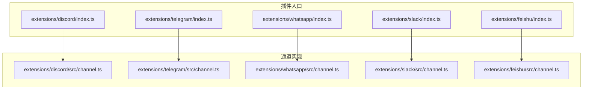
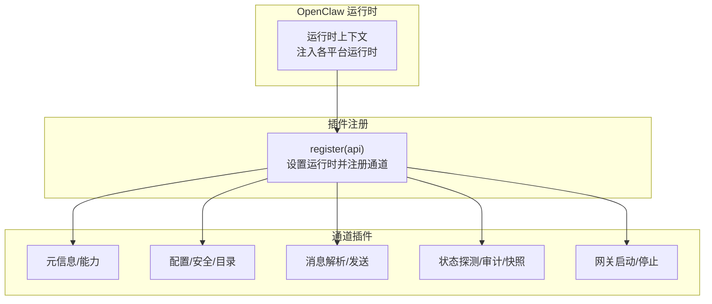
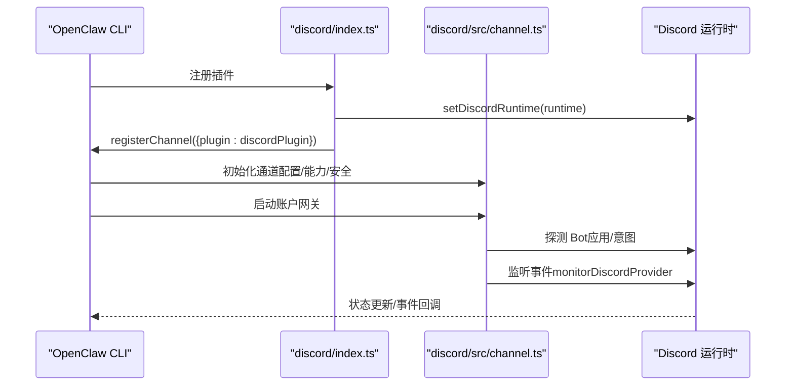
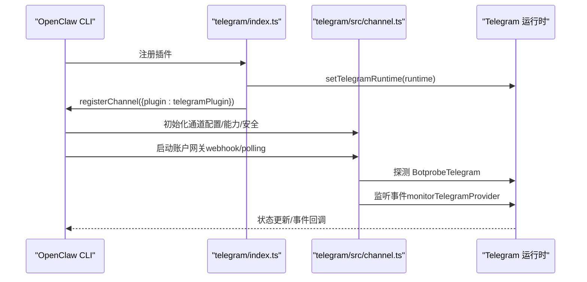
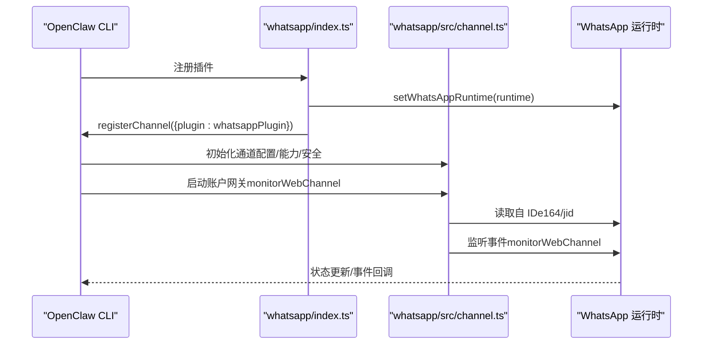
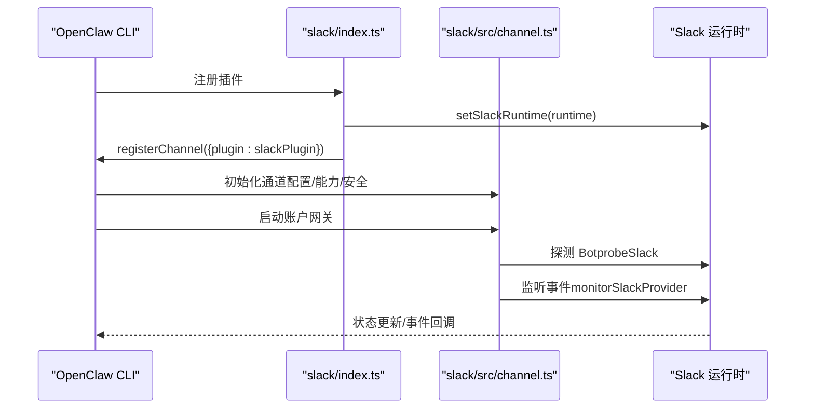
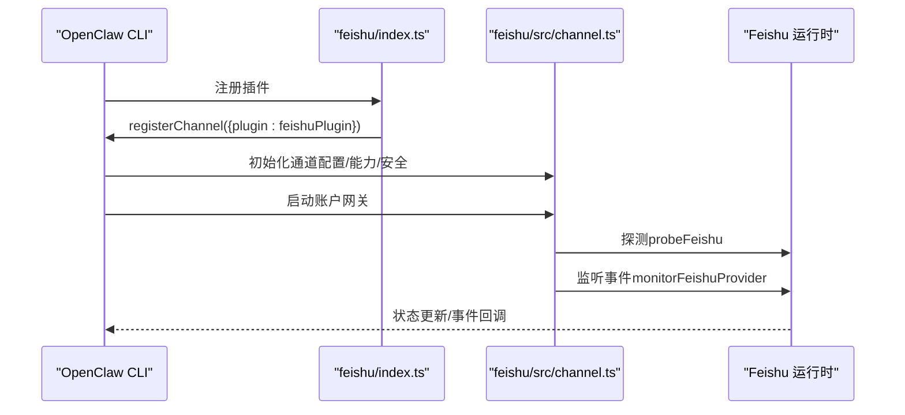
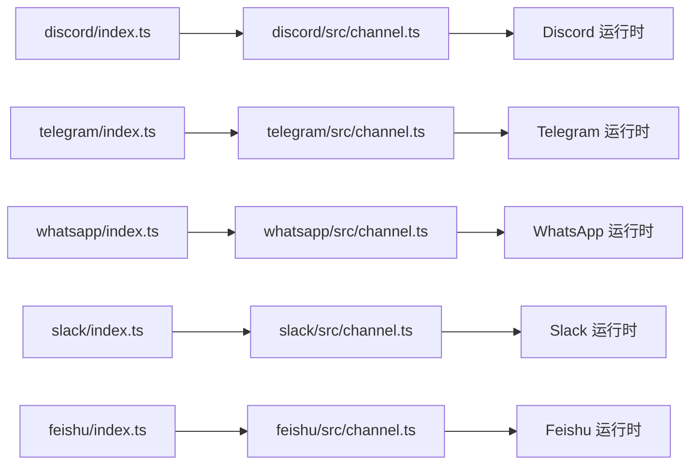

# 通道插件示例

<cite>
**本文引用的文件**
- [extensions/discord/index.ts](file://extensions/discord/index.ts)
- [extensions/discord/src/channel.ts](file://extensions/discord/src/channel.ts)
- [extensions/telegram/index.ts](file://extensions/telegram/index.ts)
- [extensions/telegram/src/channel.ts](file://extensions/telegram/src/channel.ts)
- [extensions/whatsapp/index.ts](file://extensions/whatsapp/index.ts)
- [extensions/whatsapp/src/channel.ts](file://extensions/whatsapp/src/channel.ts)
- [extensions/slack/index.ts](file://extensions/slack/index.ts)
- [extensions/slack/src/channel.ts](file://extensions/slack/src/channel.ts)
- [extensions/feishu/index.ts](file://extensions/feishu/index.ts)
- [extensions/feishu/src/channel.ts](file://extensions/feishu/src/channel.ts)
</cite>

## 目录

1. [简介](#简介)
2. [项目结构](#项目结构)
3. [核心组件](#核心组件)
4. [架构总览](#架构总览)
5. [详细组件分析](#详细组件分析)
6. [依赖关系分析](#依赖关系分析)
7. [性能考量](#性能考量)
8. [故障排查指南](#故障排查指南)
9. [结论](#结论)
10. [附录](#附录)

## 简介

本文件系统性梳理 OpenClaw 通道插件示例，聚焦以下五类消息平台的插件实现：Discord 机器人、Telegram 集成、WhatsApp 消息、Slack 工作区与飞书（Lark）企业微信。内容涵盖各平台的认证方式、消息处理流程、特殊功能实现、配置要点、API 调用与平台特性、错误处理与重连策略、性能优化建议等，帮助开发者快速理解与扩展。

## 项目结构

OpenClaw 将每个通道以独立扩展模块组织，统一通过插件入口导出注册器，再由 OpenClaw 的插件 SDK 完成通道注册、运行时注入与生命周期管理。核心目录与文件如下：

- 扩展入口：各平台在 extensions/<platform>/index.ts 中定义插件对象，导入对应通道实现与运行时设置函数。
- 通道实现：各平台在 extensions/<platform>/src/channel.ts 中导出 ChannelPlugin 实例，定义元数据、能力、配置、安全策略、消息解析与发送、状态与网关启动等。
- 运行时注入：各平台在 extensions/<platform>/index.ts 中调用 set<Platform>Runtime(api.runtime)，将平台运行时注入到 OpenClaw 运行时上下文。

图表来源

- [extensions/discord/index.ts:1-20](file://extensions/discord/index.ts#L1-L20)
- [extensions/telegram/index.ts:1-18](file://extensions/telegram/index.ts#L1-L18)
- [extensions/whatsapp/index.ts:1-18](file://extensions/whatsapp/index.ts#L1-L18)
- [extensions/slack/index.ts:1-18](file://extensions/slack/index.ts#L1-L18)
- [extensions/feishu/index.ts:1-66](file://extensions/feishu/index.ts#L1-L66)

章节来源

- [extensions/discord/index.ts:1-20](file://extensions/discord/index.ts#L1-L20)
- [extensions/telegram/index.ts:1-18](file://extensions/telegram/index.ts#L1-L18)
- [extensions/whatsapp/index.ts:1-18](file://extensions/whatsapp/index.ts#L1-L18)
- [extensions/slack/index.ts:1-18](file://extensions/slack/index.ts#L1-L18)
- [extensions/feishu/index.ts:1-66](file://extensions/feishu/index.ts#L1-L66)

## 核心组件

- 插件入口（index.ts）
  - 统一导出插件对象，包含 id、name、description、configSchema 与 register 回调。
  - 在 register 中设置平台运行时并注册通道插件。
- 通道插件（channel.ts）
  - 导出 ChannelPlugin 实例，包含：
    - 元信息与能力声明（capabilities）、目标解析与标准化（messaging、resolver）、目录查询（directory）。
    - 安全策略（security）、分组工具策略（groups）、提及处理（mentions）、线程模式（threading）。
    - 出站发送（outbound：文本、媒体、投票等）、状态采集（status：探测、审计、快照）、网关启动（gateway：启动账户监听）。
    - 设置与引导（setup、onboarding）、配对通知（pairing）。

章节来源

- [extensions/discord/src/channel.ts:74-463](file://extensions/discord/src/channel.ts#L74-L463)
- [extensions/telegram/src/channel.ts:120-587](file://extensions/telegram/src/channel.ts#L120-L587)
- [extensions/whatsapp/src/channel.ts:43-474](file://extensions/whatsapp/src/channel.ts#L43-L474)
- [extensions/slack/src/channel.ts:107-475](file://extensions/slack/src/channel.ts#L107-L475)
- [extensions/feishu/src/channel.ts:85-370](file://extensions/feishu/src/channel.ts#L85-L370)

## 架构总览

下图展示 OpenClaw 插件体系中通道插件的通用交互：插件入口负责注册，通道实现负责承载业务逻辑，运行时负责实际网络调用与事件监控。

图表来源

- [extensions/discord/index.ts:12-16](file://extensions/discord/index.ts#L12-L16)
- [extensions/telegram/index.ts:11-14](file://extensions/telegram/index.ts#L11-L14)
- [extensions/whatsapp/index.ts:11-14](file://extensions/whatsapp/index.ts#L11-L14)
- [extensions/slack/index.ts:11-14](file://extensions/slack/index.ts#L11-L14)
- [extensions/feishu/index.ts:53-55](file://extensions/feishu/index.ts#L53-L55)

## 详细组件分析

### Discord 机器人插件

- 认证与初始化
  - 使用 Bot Token 进行身份验证；启动前探测应用与机器人信息，记录意图状态（如消息内容意图）。
  - 支持多账户，按账户维度进行令牌与配置管理。
- 消息处理
  - 支持直接消息、频道与主题；支持媒体、投票、反应与原生命令。
  - 出站发送支持文本、媒体与投票，支持回复与静默发送。
- 特殊功能
  - 消息动作适配器（actions），支持从消息中提取工具发送参数并执行。
  - DM 安全策略基于账户作用域构建，允许从白名单用户触发。
  - 目录查询支持从配置与实时接口获取群组与成员。
- 状态与网关
  - 状态包含连接、断开、事件时间、错误等；支持权限审计与配置问题收集。
  - 启动网关时传入媒体大小限制、历史条数等参数，建立事件监听。

图表来源

- [extensions/discord/index.ts:12-16](file://extensions/discord/index.ts#L12-L16)
- [extensions/discord/src/channel.ts:417-461](file://extensions/discord/src/channel.ts#L417-L461)

章节来源

- [extensions/discord/src/channel.ts:74-463](file://extensions/discord/src/channel.ts#L74-L463)

### Telegram 集成插件

- 认证与初始化
  - 使用 Bot Token 或 token 文件；支持环境变量注入。
  - 启动前探测机器人信息，识别 webhook/polling 模式。
  - 多账户场景下禁止共享同一 Token，避免冲突。
- 消息处理
  - 支持直接消息、群组、频道与主题；支持媒体、投票、反应与原生命令。
  - 出站发送支持文本、媒体与投票，支持回复与主题线程。
- 特殊功能
  - 消息动作适配器；DM 安全策略可基于账户作用域与允许列表。
  - 目录查询支持从配置与实时接口获取群组与成员。
- 状态与网关
  - 状态包含运行、最后入站/出站时间、模式（webhook/polling）等。
  - 支持注销账户清理 Token 字段。

图表来源

- [extensions/telegram/index.ts:11-14](file://extensions/telegram/index.ts#L11-L14)
- [extensions/telegram/src/channel.ts:485-532](file://extensions/telegram/src/channel.ts#L485-L532)

章节来源

- [extensions/telegram/src/channel.ts:120-587](file://extensions/telegram/src/channel.ts#L120-L587)

### WhatsApp 消息插件

- 认证与初始化
  - 基于 Web 登录（二维码）完成设备绑定，使用本地授权目录保存会话。
  - 启动前检查授权存在性与监听器状态，确保已登录且在线。
- 消息处理
  - 支持直接消息与群组；支持媒体、投票与反应。
  - 出站发送支持文本、媒体与投票，支持 GIF 播放控制。
- 特殊功能
  - 动作处理（react）；支持命令强制所有者权限与空配置跳过。
  - 目录查询支持从配置与会话读取自 ID、群组与成员。
- 状态与网关
  - 状态包含连接、断开、消息/事件时间、重连次数等。
  - 提供登录（二维码开始/等待）、注销（清理授权目录）与心跳检查。

图表来源

- [extensions/whatsapp/index.ts:11-14](file://extensions/whatsapp/index.ts#L11-L14)
- [extensions/whatsapp/src/channel.ts:436-472](file://extensions/whatsapp/src/channel.ts#L436-L472)

章节来源

- [extensions/whatsapp/src/channel.ts:43-474](file://extensions/whatsapp/src/channel.ts#L43-L474)

### Slack 工作区插件

- 认证与初始化
  - 支持 Socket Mode（App Token）与 HTTP 模式（Bot Token + Signing Secret）。
  - 启动前探测 Bot 可用性；根据写操作需求选择 Bot 或 User Token。
- 消息处理
  - 支持直接消息、频道与主题；支持媒体与原生命令。
  - 出站发送支持文本与媒体，自动处理线程与回复。
- 特殊功能
  - 消息动作（actions）：列出、提取工具发送参数、处理动作。
  - DM 安全策略基于账户作用域与允许列表；群组工具策略可按群组配置。
  - 目录查询支持从配置与实时接口获取群组与成员。
- 状态与网关
  - 状态包含运行、最后启动/停止时间、错误等；支持凭据探测与快照构建。
  - 启动网关时传入媒体大小限制、斜杠命令开关等参数。

图表来源

- [extensions/slack/index.ts:11-14](file://extensions/slack/index.ts#L11-L14)
- [extensions/slack/src/channel.ts:454-473](file://extensions/slack/src/channel.ts#L454-L473)

章节来源

- [extensions/slack/src/channel.ts:107-475](file://extensions/slack/src/channel.ts#L107-L475)

### 飞书（Lark）企业微信插件

- 认证与初始化
  - 支持 WebSocket 与 Webhook 连接模式；支持自定义域名（feishu/lark）或私有化域名。
  - 支持多账户配置，按账户启用/禁用。
- 消息处理
  - 支持直接消息与群聊；支持媒体、反应、编辑与回复。
  - 出站发送封装在 outbound 模块，支持富文本卡片渲染模式。
- 特殊功能
  - 提及处理（stripPatterns）与群组工具策略；支持会话范围与主题模式。
  - 目录查询支持从配置与实时接口获取用户与群组。
- 状态与网关
  - 状态包含端口、运行、探测结果与运行时快照；支持探测与摘要构建。
  - 启动网关时根据连接模式与端口设置状态并启动监听。

图表来源

- [extensions/feishu/index.ts:53-55](file://extensions/feishu/index.ts#L53-L55)
- [extensions/feishu/src/channel.ts:352-368](file://extensions/feishu/src/channel.ts#L352-L368)

章节来源

- [extensions/feishu/src/channel.ts:85-370](file://extensions/feishu/src/channel.ts#L85-L370)

## 依赖关系分析

- 插件入口与通道实现的耦合度低，通过 OpenClaw 插件 SDK 的 registerChannel 与 set<Platform>Runtime 完成解耦。
- 通道实现依赖平台运行时（runtime）提供的网络调用、事件监听、探测与审计等能力。
- 通道实现内部模块化清晰：配置访问器、安全策略、消息解析、目录查询、状态与网关启动相互独立，便于维护与扩展。

图表来源

- [extensions/discord/index.ts:12-16](file://extensions/discord/index.ts#L12-L16)
- [extensions/telegram/index.ts:11-14](file://extensions/telegram/index.ts#L11-L14)
- [extensions/whatsapp/index.ts:11-14](file://extensions/whatsapp/index.ts#L11-L14)
- [extensions/slack/index.ts:11-14](file://extensions/slack/index.ts#L11-L14)
- [extensions/feishu/index.ts:53-55](file://extensions/feishu/index.ts#L53-L55)

章节来源

- [extensions/discord/src/channel.ts:40-40](file://extensions/discord/src/channel.ts#L40-L40)
- [extensions/telegram/src/channel.ts:43-43](file://extensions/telegram/src/channel.ts#L43-L43)
- [extensions/whatsapp/src/channel.ts:39-39](file://extensions/whatsapp/src/channel.ts#L39-L39)
- [extensions/slack/src/channel.ts:40-40](file://extensions/slack/src/channel.ts#L40-L40)
- [extensions/feishu/src/channel.ts:30-30](file://extensions/feishu/src/channel.ts#L30-L30)

## 性能考量

- 文本分片与流式输出
  - Discord 与 Telegram 等平台支持文本分片与流式合并策略，合理设置分片阈值与空闲合并时间，减少长文本传输延迟。
- 媒体上传与大小限制
  - 各平台均提供媒体大小限制配置项，应在发送前校验与裁剪，避免超限失败。
- 网络模式选择
  - Telegram 支持 webhook 与 polling；优先使用 webhook 降低轮询开销。
  - Slack 支持 Socket Mode 与 HTTP 模式；Socket Mode 适合高并发事件场景。
- 事件监听与重连
  - 网关启动时应设置合理的重试与退避策略，避免瞬时网络波动导致频繁重启。
- 目录与权限审计
  - 定期执行权限审计与目录同步，减少无效请求与鉴权失败带来的性能损耗。

## 故障排查指南

- 常见问题定位
  - 缺少令牌或令牌不匹配：检查默认账户与命名账户的令牌配置，确认环境变量注入是否正确。
  - 权限不足：查看状态审计结果与配置警告，补充频道/群组允许列表或调整组策略。
  - 平台意图限制：如 Discord 消息内容意图未开启或受限，需在开发者门户开启或改为提及触发。
  - 多账户冲突：Telegram 不允许共享同一 Token，需为每个账户分配独立 Token。
- 日志与调试
  - 启用详细日志模式，观察探测、连接、断开与事件时间戳，定位异常节点。
  - 使用状态摘要与快照，结合平台运行时日志，快速定位问题根因。
- 重连与恢复
  - 网关启动时应具备重连计数与时间戳记录，出现错误后自动重试并在阈值后告警。
  - 对于需要用户交互的登录流程（如 WhatsApp 二维码登录），提供开始与等待接口，避免阻塞主线程。

章节来源

- [extensions/discord/src/channel.ts:434-448](file://extensions/discord/src/channel.ts#L434-L448)
- [extensions/telegram/src/channel.ts:492-499](file://extensions/telegram/src/channel.ts#L492-L499)
- [extensions/slack/src/channel.ts:421-427](file://extensions/slack/src/channel.ts#L421-L427)
- [extensions/feishu/src/channel.ts:340-350](file://extensions/feishu/src/channel.ts#L340-L350)

## 结论

OpenClaw 的通道插件示例通过统一的插件入口与通道实现，实现了跨平台的一致性与可扩展性。各平台在认证方式、消息处理、安全策略与网关启动方面各有侧重，但都遵循相同的生命周期与状态管理模式。开发者可据此快速接入新平台或扩展现有功能，同时结合性能与故障排查最佳实践，保障生产环境的稳定性与可靠性。

## 附录

- 配置要点速查
  - Discord：Bot Token、意图状态、群组允许列表、DM 策略。
  - Telegram：Bot Token/token 文件、webhook 配置、代理与网络设置。
  - WhatsApp：授权目录、命令所有者限制、动作开关。
  - Slack：Bot Token/App Token、HTTP 模式签名密钥、斜杠命令。
  - 飞书：App ID/Secret、加密 Key、验证 Token、连接模式与端口。
- API 调用参考
  - 发送文本/媒体/投票：各通道在 outbound 中提供统一方法，支持回复与静默选项。
  - 目录查询：支持从配置与实时接口获取用户与群组。
  - 状态探测与审计：提供探测与权限审计接口，生成状态摘要与快照。
- 最佳实践清单
  - 明确令牌来源与作用域，避免跨账户共享。
  - 合理设置分片与流式合并参数，平衡吞吐与延迟。
  - 优先使用长连接模式（webhook/socket），降低轮询成本。
  - 定期审计权限与目录，及时修复配置问题。
  - 建立完善的日志与监控，覆盖连接、事件与错误。
