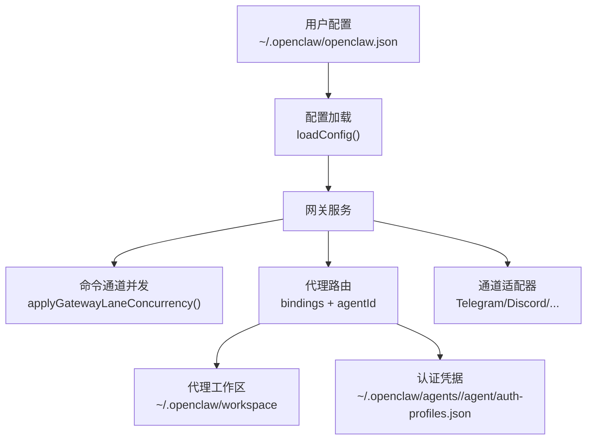
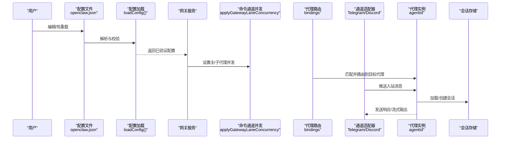
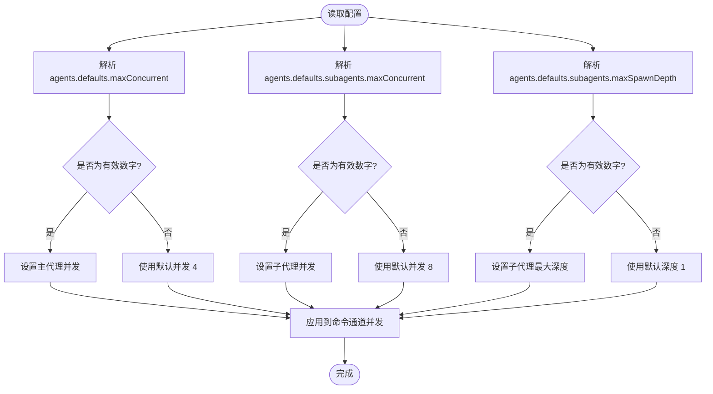
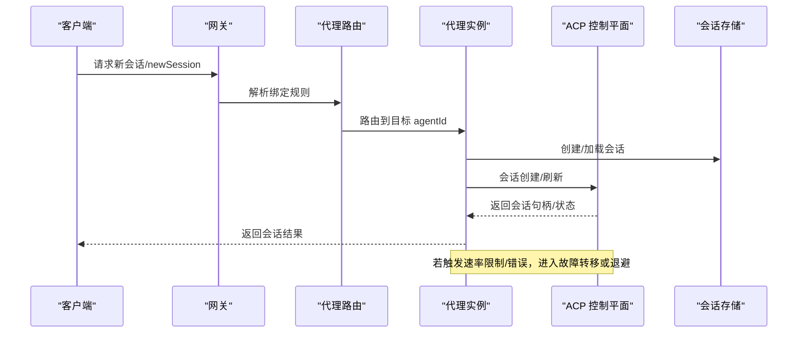
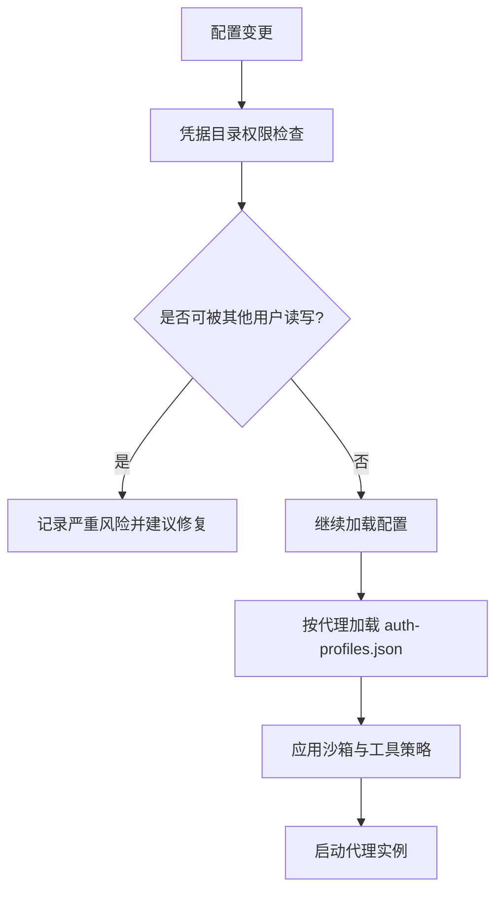
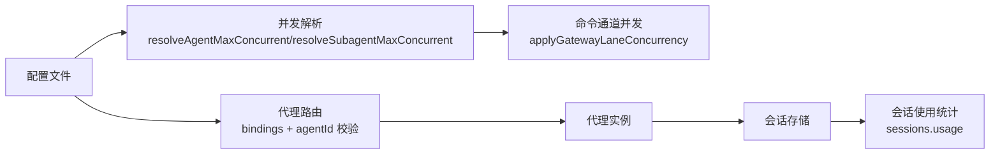

# 代理配置

<cite>
**本文引用的文件**
- [AGENTS.md](file://AGENTS.md)
- [docs/reference/AGENTS.default.md](file://docs/reference/AGENTS.default.md)
- [docs/gateway/configuration.md](file://docs/gateway/configuration.md)
- [docs/gateway/configuration-reference.md](file://docs/gateway/configuration-reference.md)
- [src/config/agent-limits.ts](file://src/config/agent-limits.ts)
- [src/gateway/server-lanes.ts](file://src/gateway/server-lanes.ts)
- [src/acp/control-plane/manager.test.ts](file://src/acp/control-plane/manager.test.ts)
- [src/acp/control-plane/manager.core.ts](file://src/acp/control-plane/manager.core.ts)
- [src/acp/translator.session-rate-limit.test.ts](file://src/acp/translator.session-rate-limit.test.ts)
- [src/acp/translator.ts](file://src/acp/translator.ts)
- [src/agents/subagent-spawn.ts](file://src/agents/subagent-spawn.ts)
- [src/gateway/server-methods/agent.ts](file://src/gateway/server-methods/agent.ts)
- [src/gateway/server-methods/usage.sessions-usage.test.ts](file://src/gateway/server-methods/usage.sessions-usage.test.ts)
- [src/telegram/fetch.ts](file://src/telegram/fetch.ts)
- [docs/tools/multi-agent-sandbox-tools.md](file://docs/tools/multi-agent-sandbox-tools.md)
- [src/security/audit-extra.async.ts](file://src/security/audit-extra.async.ts)
- [aaron/openclaw-agent-mechanism-deep-dive.md](file://aaron/openclaw-agent-mechanism-deep-dive.md)
- [src/agents/failover-error.test.ts](file://src/agents/failover-error.test.ts)
- [src/commands/agents.bindings.ts](file://src/commands/agents.bindings.ts)
</cite>

## 目录

1. [简介](#简介)
2. [项目结构](#项目结构)
3. [核心组件](#核心组件)
4. [架构总览](#架构总览)
5. [详细组件分析](#详细组件分析)
6. [依赖关系分析](#依赖关系分析)
7. [性能考虑](#性能考虑)
8. [故障排查指南](#故障排查指南)
9. [结论](#结论)
10. [附录](#附录)

## 简介

本指南面向需要在 OpenClaw 中部署与运维多代理系统的工程与安全团队，聚焦于代理配置的全生命周期管理：从代理目录结构、并发与资源限制，到代理池管理、负载均衡与故障转移策略；从身份认证、权限控制与访问策略，到性能调优、监控与调试实践。文档以仓库内现有配置参考与实现为依据，提供可操作的配置建议与可视化图示。

## 项目结构

OpenClaw 的代理配置主要位于用户态配置文件中，并通过网关加载与热重载生效。关键位置与职责如下：

- 用户配置文件：~/.openclaw/openclaw.json（JSON5 格式），支持分段 include 与环境变量替换。
- 代理工作区：默认位于 ~/.openclaw/workspace，可通过 agents.defaults.workspace 覆盖。
- 代理运行时：每个代理拥有独立的 agent 目录与会话存储，认证凭据按代理隔离。
- 网关层：负责并发调度、会话发现、心跳与健康检查、以及多通道接入。

**图表来源**

- [docs/gateway/configuration.md:36-59](file://docs/gateway/configuration.md#L36-L59)
- [docs/reference/AGENTS.default.md:13-41](file://docs/reference/AGENTS.default.md#L13-L41)
- [src/gateway/server-lanes.ts:6-9](file://src/gateway/server-lanes.ts#L6-L9)

**章节来源**

- [docs/gateway/configuration.md:12-59](file://docs/gateway/configuration.md#L12-L59)
- [docs/reference/AGENTS.default.md:13-41](file://docs/reference/AGENTS.default.md#L13-L41)

## 核心组件

- 代理工作区与默认模板：通过 AGENTS.default.md 提供默认个人助理模板与工作区初始化步骤，支持复制模板至工作区并设置 agents.defaults.workspace。
- 并发与子代理限制：通过 agents.defaults.maxConcurrent 与 agents.defaults.subagents 控制主代理与子代理的最大并发与最大生成深度。
- 网关通道与会话：通道配置（Telegram/Discord/Slack 等）决定入站消息策略、历史保留、流式输出与网络参数；会话使用 agent:<agentId>:<channel>:... 形式进行聚合与查询。
- 认证与权限：每个代理拥有独立的认证凭据存储；多代理沙箱与工具策略可按代理粒度隔离。
- 故障转移与过载退避：模型与认证配置支持基于错误原因的故障转移与指数退避策略。

**章节来源**

- [docs/reference/AGENTS.default.md:13-41](file://docs/reference/AGENTS.default.md#L13-L41)
- [src/config/agent-limits.ts:3-22](file://src/config/agent-limits.ts#L3-L22)
- [src/gateway/server-methods/usage.sessions-usage.test.ts:135-150](file://src/gateway/server-methods/usage.sessions-usage.test.ts#L135-L150)
- [docs/tools/multi-agent-sandbox-tools.md:26-30](file://docs/tools/multi-agent-sandbox-tools.md#L26-L30)
- [src/security/audit-extra.async.ts:1020-1067](file://src/security/audit-extra.async.ts#L1020-L1067)
- [aaron/openclaw-agent-mechanism-deep-dive.md:967-1002](file://aaron/openclaw-agent-mechanism-deep-dive.md#L967-L1002)

## 架构总览

下图展示从配置到执行的关键路径：配置加载、并发调度、代理路由、通道接入与会话发现。

**图表来源**

- [docs/gateway/configuration.md:36-59](file://docs/gateway/configuration.md#L36-L59)
- [src/gateway/server-lanes.ts:6-9](file://src/gateway/server-lanes.ts#L6-L9)
- [src/gateway/server-methods/agent.ts:259-274](file://src/gateway/server-methods/agent.ts#L259-L274)

## 详细组件分析

### 代理目录结构与工作区

- 默认工作区：agents.defaults.workspace 指定工作区根目录，默认值为 ~/.openclaw/workspace。
- 初始化流程：首次运行可复制模板文件（AGENTS.md/SOUL.md/TOOLS.md 等）到工作区，便于快速启用个人助理能力。
- 会话日志：代理会话日志位于 ~/.openclaw/agents/<agentId>/sessions/\*.jsonl，便于审计与回放。

**章节来源**

- [docs/reference/AGENTS.default.md:13-41](file://docs/reference/AGENTS.default.md#L13-L41)
- [AGENTS.md:242-244](file://AGENTS.md#L242-L244)

### 并发限制与资源管理

- 主代理并发：agents.defaults.maxConcurrent 控制单个代理的并发会话上限，默认 4。
- 子代理并发：agents.defaults.subagents.maxConcurrent 控制子代理并发，默认 8。
- 子代理生成深度：agents.defaults.subagents.maxSpawnDepth 控制子代理最大生成深度，默认 1。
- 网关通道并发应用：applyGatewayLaneConcurrency 将上述配置映射到命令通道（Cron/Main/Subagent）的并发限制。

**图表来源**

- [src/config/agent-limits.ts:8-22](file://src/config/agent-limits.ts#L8-L22)
- [src/gateway/server-lanes.ts:6-9](file://src/gateway/server-lanes.ts#L6-L9)

**章节来源**

- [src/config/agent-limits.ts:3-22](file://src/config/agent-limits.ts#L3-L22)
- [src/gateway/server-lanes.ts:6-9](file://src/gateway/server-lanes.ts#L6-L9)

### 代理池管理、负载均衡与故障转移

- 代理池与绑定：通过 bindings 配置将不同通道或账号路由到不同 agentId，实现代理池的逻辑隔离与负载分担。
- 会话发现与聚合：网关可按 agentId 聚合会话列表与使用统计，用于监控与排障。
- ACP 会话速率限制：对 newSession/loadSession 增加速率限制，避免滥用导致资源耗尽。
- 故障转移与过载退避：根据错误原因（如 auth/rate_limit/overloaded/billing/timeout）采取不同策略，必要时切换认证配置或模型。

**图表来源**

- [src/gateway/server-methods/agent.ts:259-274](file://src/gateway/server-methods/agent.ts#L259-L274)
- [src/gateway/server-methods/usage.sessions-usage.test.ts:135-150](file://src/gateway/server-methods/usage.sessions-usage.test.ts#L135-L150)
- [src/acp/translator.ts:1065-1073](file://src/acp/translator.ts#L1065-L1073)
- [aaron/openclaw-agent-mechanism-deep-dive.md:967-1002](file://aaron/openclaw-agent-mechanism-deep-dive.md#L967-L1002)

**章节来源**

- [src/commands/agents.bindings.ts:161-175](file://src/commands/agents.bindings.ts#L161-L175)
- [src/gateway/server-methods/usage.sessions-usage.test.ts:135-150](file://src/gateway/server-methods/usage.sessions-usage.test.ts#L135-L150)
- [src/acp/translator.session-rate-limit.test.ts:139-176](file://src/acp/translator.session-rate-limit.test.ts#L139-L176)
- [aaron/openclaw-agent-mechanism-deep-dive.md:967-1002](file://aaron/openclaw-agent-mechanism-deep-dive.md#L967-L1002)

### 代理身份验证、权限控制与访问策略

- 认证凭据隔离：每个代理拥有独立的 auth-profiles.json，存放在 ~/.openclaw/agents/<agentId>/agent/ 下，避免凭据共享带来的横向移动风险。
- 权限与沙箱：多代理沙箱与工具策略可按代理粒度配置，实现“最小权限”原则；工具允许/禁止列表与 per-agent sandbox 配置可分别覆盖全局设置。
- 安全审计：对凭据目录与 auth-profiles.json 的权限进行审计，发现可被他人读写的风险并给出修复建议（例如将权限调整为 0o600）。

**图表来源**

- [docs/tools/multi-agent-sandbox-tools.md:26-30](file://docs/tools/multi-agent-sandbox-tools.md#L26-L30)
- [src/security/audit-extra.async.ts:1020-1067](file://src/security/audit-extra.async.ts#L1020-L1067)

**章节来源**

- [docs/tools/multi-agent-sandbox-tools.md:26-30](file://docs/tools/multi-agent-sandbox-tools.md#L26-L30)
- [src/security/audit-extra.async.ts:1020-1067](file://src/security/audit-extra.async.ts#L1020-L1067)

### 代理性能调优、监控与调试

- 并发调优：根据硬件与模型成本，调整 agents.defaults.maxConcurrent 与 agents.defaults.subagents.maxConcurrent；结合 applyGatewayLaneConcurrency 的通道并发设置，平衡吞吐与延迟。
- 会话与缓存：合理设置会话保留策略与缓存 TTL，避免长时间占用资源；在 ACP 场景中，空闲运行时会被回收以释放内存。
- 监控与诊断：利用 sessions.usage 与 timeseries 查询接口聚合跨代理会话数据；通过 openclaw doctor 与日志定位配置问题。
- 网络与代理：在 Telegram 等通道中，可通过网络参数与代理设置优化连接稳定性与延迟。

**章节来源**

- [src/gateway/server-lanes.ts:6-9](file://src/gateway/server-lanes.ts#L6-L9)
- [src/acp/control-plane/manager.core.ts:1111-1139](file://src/acp/control-plane/manager.core.ts#L1111-L1139)
- [src/telegram/fetch.ts:189-250](file://src/telegram/fetch.ts#L189-L250)

## 依赖关系分析

- 配置到并发：配置文件中的并发键值经 resolveAgentMaxConcurrent/resolveSubagentMaxConcurrent 解析后，由 applyGatewayLaneConcurrency 应用到命令通道。
- 代理路由：server-methods/agent.ts 在处理请求前校验 agentId 是否存在于已配置列表，确保路由正确性。
- 会话聚合：usage.sessions-usage.test.ts 展示了跨代理会话发现与排序逻辑，用于监控与报表。

**图表来源**

- [src/config/agent-limits.ts:8-22](file://src/config/agent-limits.ts#L8-L22)
- [src/gateway/server-lanes.ts:6-9](file://src/gateway/server-lanes.ts#L6-L9)
- [src/gateway/server-methods/agent.ts:259-274](file://src/gateway/server-methods/agent.ts#L259-L274)
- [src/gateway/server-methods/usage.sessions-usage.test.ts:135-150](file://src/gateway/server-methods/usage.sessions-usage.test.ts#L135-L150)

**章节来源**

- [src/config/agent-limits.ts:8-22](file://src/config/agent-limits.ts#L8-L22)
- [src/gateway/server-lanes.ts:6-9](file://src/gateway/server-lanes.ts#L6-L9)
- [src/gateway/server-methods/agent.ts:259-274](file://src/gateway/server-methods/agent.ts#L259-L274)
- [src/gateway/server-methods/usage.sessions-usage.test.ts:135-150](file://src/gateway/server-methods/usage.sessions-usage.test.ts#L135-L150)

## 性能考虑

- 合理设置并发：主代理与子代理并发应与模型供应商限额、本地硬件能力匹配，避免过度并发导致超时与退避。
- 子代理深度控制：默认仅允许深度 1 的子代理，避免深层嵌套引发资源膨胀。
- 会话与缓存：定期清理过期会话与运行日志，降低磁盘与内存压力。
- 网络与代理：在高延迟网络中启用显式代理或环境代理，减少连接失败与重试开销。

[本节为通用指导，无需特定文件引用]

## 故障排查指南

- 配置校验失败：严格模式下未知键或类型不匹配会导致网关拒绝启动，需通过 openclaw doctor 定位并修复。
- 代理路由错误：当 agentId 未在已配置列表中时，请求会被拒绝并返回无效参数错误。
- 会话使用异常：若传入的会话键包含越界路径片段，将被拒绝并提示无效会话引用。
- 速率限制与过载：ACP 新建/加载会话存在速率限制；遇到 overloaded 错误时采用指数退避策略。
- 认证与权限：凭据目录与 auth-profiles.json 的权限不当可能导致凭据泄露或注入风险，应按建议调整权限。

**章节来源**

- [docs/gateway/configuration.md:61-73](file://docs/gateway/configuration.md#L61-L73)
- [src/gateway/server-methods/agent.ts:259-274](file://src/gateway/server-methods/agent.ts#L259-L274)
- [src/gateway/server-methods/usage.sessions-usage.test.ts:192-202](file://src/gateway/server-methods/usage.sessions-usage.test.ts#L192-L202)
- [src/acp/translator.ts:1065-1073](file://src/acp/translator.ts#L1065-L1073)
- [src/agents/failover-error.test.ts:71-82](file://src/agents/failover-error.test.ts#L71-L82)
- [src/security/audit-extra.async.ts:1020-1067](file://src/security/audit-extra.async.ts#L1020-L1067)

## 结论

通过将配置文件、并发控制、代理路由与通道适配有机结合，OpenClaw 能够在保证安全与合规的前提下，实现多代理的高效运行与弹性扩展。建议在生产环境中：

- 明确代理工作区与凭据隔离策略；
- 基于业务负载与模型成本设定合理的并发与深度限制；
- 使用 bindings 实现代理池与负载均衡；
- 建立完善的监控与审计机制，及时发现并处置异常。

[本节为总结性内容，无需特定文件引用]

## 附录

- 快速开始：使用 openclaw onboard 或直接编辑 ~/.openclaw/openclaw.json，设置 agents.defaults.workspace 与 channels.\*。
- 热重载：修改配置后，网关默认自动热应用安全变更；涉及服务器端口/插件等关键项需重启。
- 环境变量与密钥：支持 env、file、exec 等多种 SecretRef 方案，避免明文硬编码。

**章节来源**

- [docs/gateway/configuration.md:26-59](file://docs/gateway/configuration.md#L26-L59)
- [docs/gateway/configuration.md:349-387](file://docs/gateway/configuration.md#L349-L387)
- [docs/gateway/configuration.md:501-536](file://docs/gateway/configuration.md#L501-L536)
