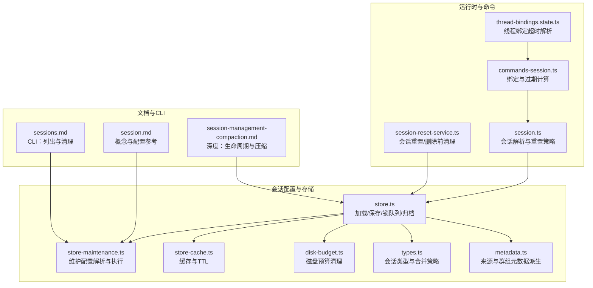
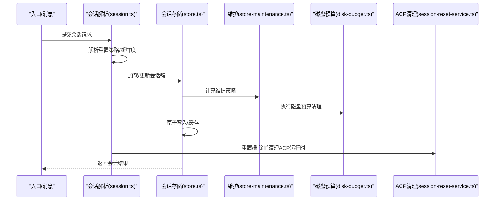
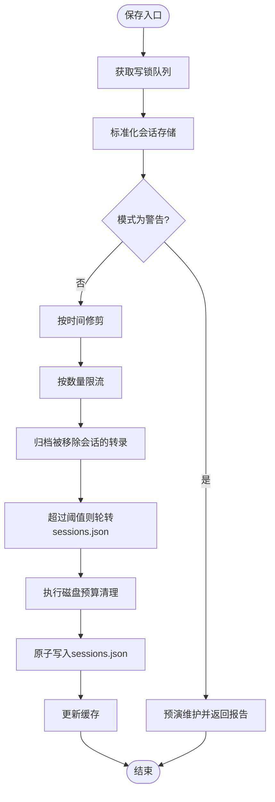
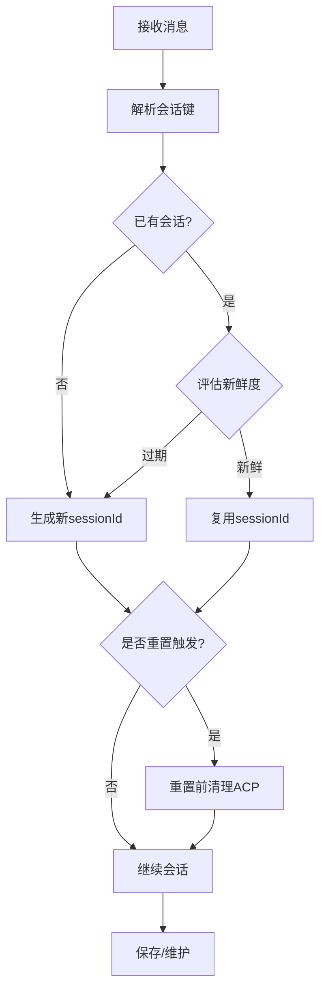
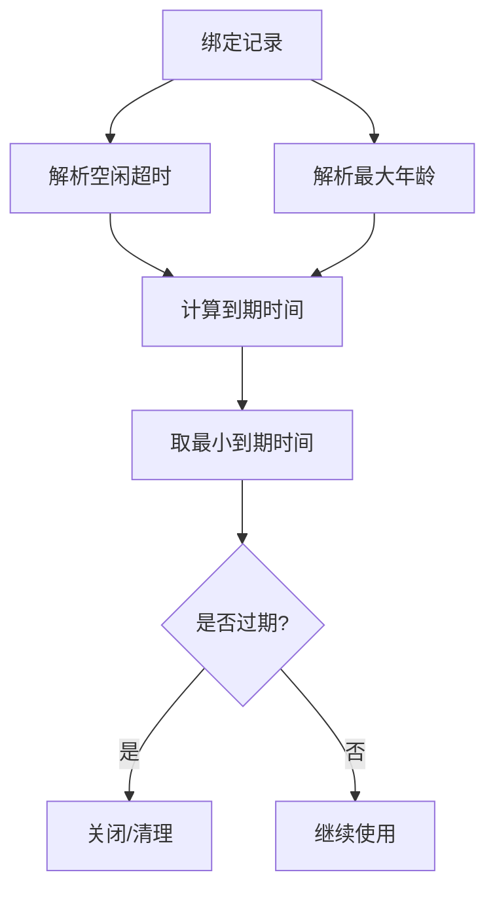
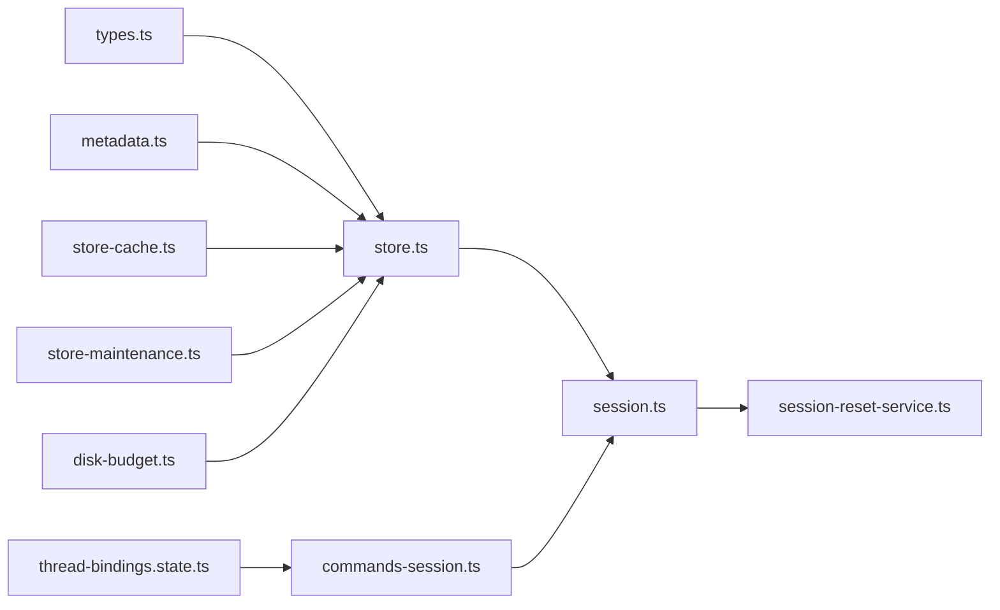

# 会话配置

<cite>
**本文引用的文件**
- [store.ts](file://src/config/sessions/store.ts)
- [store-maintenance.ts](file://src/config/sessions/store-maintenance.ts)
- [types.ts](file://src/config/sessions/types.ts)
- [metadata.ts](file://src/config/sessions/metadata.ts)
- [store-cache.ts](file://src/config/sessions/store-cache.ts)
- [disk-budget.ts](file://src/config/sessions/disk-budget.ts)
- [session.md](file://docs/concepts/session.md)
- [session-management-compaction.md](file://docs/reference/session-management-compaction.md)
- [sessions.md](file://docs/cli/sessions.md)
- [session.ts](file://src/commands/agent/session.ts)
- [session-reset-service.ts](file://src/gateway/session-reset-service.ts)
- [commands-session.ts](file://src/auto-reply/reply/commands-session.ts)
- [thread-bindings.state.ts](file://src/discord/monitor/thread-bindings.state.ts)
</cite>

## 目录

1. [简介](#简介)
2. [项目结构](#项目结构)
3. [核心组件](#核心组件)
4. [架构总览](#架构总览)
5. [详细组件分析](#详细组件分析)
6. [依赖关系分析](#依赖关系分析)
7. [性能考量](#性能考量)
8. [故障排除指南](#故障排除指南)
9. [结论](#结论)
10. [附录](#附录)

## 简介

本指南聚焦于 OpenClaw 的会话配置与管理，覆盖会话生命周期、状态管理、持久化策略、超时与清理、内存与磁盘预算、会话路由与并发控制、备份与迁移、以及监控与诊断。内容基于源码实现与官方文档，帮助你安全、可运维地配置生产环境。

## 项目结构

围绕会话的核心代码位于 src/config/sessions 下，配合命令行工具与运行时服务共同完成会话的创建、更新、维护与清理。

**图表来源**

- [store.ts:1-884](file://src/config/sessions/store.ts#L1-L884)
- [store-maintenance.ts:1-328](file://src/config/sessions/store-maintenance.ts#L1-L328)
- [store-cache.ts:1-82](file://src/config/sessions/store-cache.ts#L1-L82)
- [disk-budget.ts:1-376](file://src/config/sessions/disk-budget.ts#L1-L376)
- [types.ts:1-380](file://src/config/sessions/types.ts#L1-L380)
- [metadata.ts:1-173](file://src/config/sessions/metadata.ts#L1-L173)
- [session.ts:108-151](file://src/commands/agent/session.ts#L108-L151)
- [session-reset-service.ts:171-269](file://src/gateway/session-reset-service.ts#L171-L269)
- [commands-session.ts:75-127](file://src/auto-reply/reply/commands-session.ts#L75-L127)
- [thread-bindings.state.ts:236-274](file://src/discord/monitor/thread-bindings.state.ts#L236-L274)
- [session.md:1-311](file://docs/concepts/session.md#L1-L311)
- [session-management-compaction.md:1-325](file://docs/reference/session-management-compaction.md#L1-L325)
- [sessions.md:1-105](file://docs/cli/sessions.md#L1-L105)

**章节来源**

- [store.ts:1-884](file://src/config/sessions/store.ts#L1-L884)
- [store-maintenance.ts:1-328](file://src/config/sessions/store-maintenance.ts#L1-L328)
- [session.md:1-311](file://docs/concepts/session.md#L1-L311)

## 核心组件

- 会话存储与写入锁：提供原子写入、缓存、维护与归档能力，确保并发安全与一致性。
- 维护配置解析：统一解析 session.maintenance 配置，支持模式、过期、条目上限、轮转阈值、磁盘预算与高水位。
- 类型系统与合并策略：定义 SessionEntry 字段、运行时模型字段规范化、合并策略（触活动/保持活动）。
- 元数据派生：从消息上下文推导会话来源与群组信息，用于 UI 展示与路由。
- 磁盘预算清理：按时间与引用关系清理旧归档与会话文件，保障目录大小可控。
- 运行时会话解析与重置：根据策略决定是否复用或新建 sessionId，并在重置/删除前清理 ACP 运行时。
- 绑定与过期：对线程/绑定场景计算空闲超时与最大年龄，避免无限占用。

**章节来源**

- [store.ts:195-533](file://src/config/sessions/store.ts#L195-L533)
- [store-maintenance.ts:130-148](file://src/config/sessions/store-maintenance.ts#L130-L148)
- [types.ts:68-171](file://src/config/sessions/types.ts#L68-L171)
- [metadata.ts:153-172](file://src/config/sessions/metadata.ts#L153-L172)
- [disk-budget.ts:188-375](file://src/config/sessions/disk-budget.ts#L188-L375)
- [session.ts:111-151](file://src/commands/agent/session.ts#L111-L151)
- [session-reset-service.ts:245-269](file://src/gateway/session-reset-service.ts#L245-L269)
- [commands-session.ts:95-127](file://src/auto-reply/reply/commands-session.ts#L95-L127)

## 架构总览

会话生命周期由“路由→解析→创建/复用→运行→维护→清理→持久化”构成。关键路径如下：

**图表来源**

- [session.ts:111-151](file://src/commands/agent/session.ts#L111-L151)
- [store.ts:340-509](file://src/config/sessions/store.ts#L340-L509)
- [store-maintenance.ts:340-454](file://src/config/sessions/store-maintenance.ts#L340-L454)
- [disk-budget.ts:188-375](file://src/config/sessions/disk-budget.ts#L188-L375)
- [session-reset-service.ts:245-269](file://src/gateway/session-reset-service.ts#L245-L269)

## 详细组件分析

### 会话存储与并发控制

- 原子写入与锁队列：通过写锁队列串行化对 sessions.json 的修改，避免竞态；Windows 平台具备重试与回退逻辑。
- 缓存与TTL：支持基于时间的内存缓存，结合文件 mtime/size 校验，减少重复解析。
- 维护与轮转：在保存前执行修剪、限流、归档、轮转与磁盘预算清理；支持“仅警告”模式预演。
- 归档与清理：移除已删除/重置会话关联的转录文件与归档，遵循保留策略。

**图表来源**

- [store.ts:340-509](file://src/config/sessions/store.ts#L340-L509)
- [store-maintenance.ts:275-327](file://src/config/sessions/store-maintenance.ts#L275-L327)
- [disk-budget.ts:188-375](file://src/config/sessions/disk-budget.ts#L188-L375)

**章节来源**

- [store.ts:195-533](file://src/config/sessions/store.ts#L195-L533)
- [store-cache.ts:41-81](file://src/config/sessions/store-cache.ts#L41-L81)
- [store-maintenance.ts:275-327](file://src/config/sessions/store-maintenance.ts#L275-L327)
- [disk-budget.ts:188-375](file://src/config/sessions/disk-budget.ts#L188-L375)

### 会话生命周期与重置策略

- 路由到键：依据通道、聊天类型、群组等规则生成 sessionKey，支持多级隔离（主键、按用户、按账号+通道）。
- 新鲜度评估：基于 updatedAt 与重置策略判断是否复用现有 sessionId。
- 重置触发：支持 /new、/reset 及自定义触发词；可按类型/通道覆盖策略。
- 重置前清理：在重置或删除前关闭/取消 ACP 运行时，避免残留任务。

**图表来源**

- [session.ts:111-151](file://src/commands/agent/session.ts#L111-L151)
- [session-reset-service.ts:245-269](file://src/gateway/session-reset-service.ts#L245-L269)

**章节来源**

- [session.ts:111-151](file://src/commands/agent/session.ts#L111-L151)
- [session-reset-service.ts:171-269](file://src/gateway/session-reset-service.ts#L171-L269)
- [session.md:189-218](file://docs/concepts/session.md#L189-L218)

### 会话超时、清理与内存管理

- 空闲超时与最大年龄：对线程/绑定场景计算到期时间，避免无限空闲占用。
- 会话过期计算：综合空闲超时与最大年龄，选择最早到期者。
- 内存与上下文：通过 token 计数与自动压缩（compaction）控制上下文窗口；支持“静默”内存刷新以持久化关键状态。

**图表来源**

- [commands-session.ts:95-127](file://src/auto-reply/reply/commands-session.ts#L95-L127)
- [thread-bindings.state.ts:236-274](file://src/discord/monitor/thread-bindings.state.ts#L236-L274)

**章节来源**

- [commands-session.ts:75-127](file://src/auto-reply/reply/commands-session.ts#L75-L127)
- [thread-bindings.state.ts:236-274](file://src/discord/monitor/thread-bindings.state.ts#L236-L274)
- [session-management-compaction.md:283-313](file://docs/reference/session-management-compaction.md#L283-L313)

### 会话路由、并发控制与资源限制

- 路由规则：支持 per-sender、per-peer、per-channel-peer、per-account-channel-peer 等隔离级别；群组/频道/主题独立键空间。
- 并发控制：写锁队列保证同一 store 的串行化写入；Windows 平台具备重试与回退。
- 资源限制：维护配置提供 pruneAfter、maxEntries、rotateBytes、maxDiskBytes、highWaterBytes 等参数，形成“时间+数量+体积”的三层约束。

**章节来源**

- [session.md:10-56](file://docs/concepts/session.md#L10-L56)
- [store.ts:695-727](file://src/config/sessions/store.ts#L695-L727)
- [store-maintenance.ts:130-148](file://src/config/sessions/store-maintenance.ts#L130-L148)

### 会话备份、恢复与迁移

- 备份：当 sessions.json 超过 rotateBytes 时自动轮转为 .bak.<timestamp> 文件，最多保留最近 3 份。
- 恢复：删除损坏或过期的 .bak 文件即可回滚；归档转录文件按策略清理。
- 迁移：支持从旧键名兼容加载；维护阶段会清理不再引用的转录文件与归档。

**章节来源**

- [store-maintenance.ts:275-327](file://src/config/sessions/store-maintenance.ts#L275-L327)
- [store.ts:572-596](file://src/config/sessions/store.ts#L572-L596)
- [session-management-compaction.md:68-94](file://docs/reference/session-management-compaction.md#L68-L94)

### 会话监控、诊断与故障排除

- 监控：CLI sessions 命令列出会话、统计 token 使用；status 命令查看网关状态与最近会话。
- 诊断：/status、/context list/detail 观察上下文组成；/compact 主动压缩历史。
- 故障排除：检查会话键是否正确、确认网关主机与 store 路径、排查压缩频繁原因（模型窗口过小、工具结果膨胀）、确认静默输出是否正确标记 NO_REPLY。

**章节来源**

- [sessions.md:1-105](file://docs/cli/sessions.md#L1-L105)
- [session-management-compaction.md:259-325](file://docs/reference/session-management-compaction.md#L259-L325)
- [session.md:279-311](file://docs/concepts/session.md#L279-L311)

## 依赖关系分析

会话模块内部依赖清晰，职责分离良好：store.ts 作为门面协调缓存、维护与写入；store-maintenance.ts 负责配置解析与执行；disk-budget.ts 专注磁盘预算清理；types.ts 与 metadata.ts 提供类型与元数据支撑；运行时通过 session.ts 与 session-reset-service.ts 协调生命周期与清理。

**图表来源**

- [store.ts:1-884](file://src/config/sessions/store.ts#L1-L884)
- [store-maintenance.ts:1-328](file://src/config/sessions/store-maintenance.ts#L1-L328)
- [store-cache.ts:1-82](file://src/config/sessions/store-cache.ts#L1-L82)
- [disk-budget.ts:1-376](file://src/config/sessions/disk-budget.ts#L1-L376)
- [types.ts:1-380](file://src/config/sessions/types.ts#L1-L380)
- [metadata.ts:1-173](file://src/config/sessions/metadata.ts#L1-L173)
- [session.ts:108-151](file://src/commands/agent/session.ts#L108-L151)
- [session-reset-service.ts:171-269](file://src/gateway/session-reset-service.ts#L171-L269)
- [commands-session.ts:75-127](file://src/auto-reply/reply/commands-session.ts#L75-L127)
- [thread-bindings.state.ts:236-274](file://src/discord/monitor/thread-bindings.state.ts#L236-L274)

**章节来源**

- [store.ts:1-884](file://src/config/sessions/store.ts#L1-L884)
- [store-maintenance.ts:1-328](file://src/config/sessions/store-maintenance.ts#L1-L328)
- [session.ts:108-151](file://src/commands/agent/session.ts#L108-L151)

## 性能考量

- 大规模会话存储：维护成本主要来自 pruneAfter 与 maxEntries 的组合，以及磁盘预算启用后的清理顺序。建议在生产使用 enforce 模式，并设置合理的 maxDiskBytes 与 highWaterBytes。
- 写入延迟：维护工作在写入路径执行，大 store 会增加写延迟。可通过降低 maxEntries、缩短 pruneAfter、启用磁盘预算并合理设置高水位来缓解。
- 缓存命中：合理设置 OPENCLAW_SESSION_CACHE_TTL_MS 以提升读取性能，同时避免过期脏数据。

[本节为通用指导，无需特定文件来源]

## 故障排除指南

- 会话键错误：核对 sessionKey 生成规则与 /status 输出，确认路由是否符合预期。
- 存储与转录不一致：确认网关主机与 store 路径，避免本地文件误导。
- 压缩过于频繁：检查模型上下文窗口、保留令牌设置与工具结果膨胀，必要时调整 pruneAfter 或启用磁盘预算。
- 静默输出泄露：确认回复以 NO_REPLY 开头，并使用包含流抑制修复版本。

**章节来源**

- [session-management-compaction.md:316-325](file://docs/reference/session-management-compaction.md#L316-L325)
- [session.md:279-311](file://docs/concepts/session.md#L279-L311)

## 结论

通过明确的会话键规则、严格的维护策略与并发控制，OpenClaw 在生产环境中实现了稳定、可扩展的会话管理。建议在生产中采用 enforce 模式与磁盘预算，结合 CLI 工具进行定期预演与清理，确保会话状态健康与资源可控。

[本节为总结性内容，无需特定文件来源]

## 附录

### 关键配置项速查

- 维护模式：session.maintenance.mode（默认 warn）
- 过期时间：session.maintenance.pruneAfter（默认 30d）
- 条目上限：session.maintenance.maxEntries（默认 500）
- 轮转阈值：session.maintenance.rotateBytes（默认 10mb）
- 重置归档保留：session.maintenance.resetArchiveRetention（默认与 pruneAfter 相同）
- 磁盘预算：session.maintenance.maxDiskBytes、session.maintenance.highWaterBytes
- 重置策略：session.reset、session.resetByType、session.resetByChannel、session.resetTriggers
- 路由隔离：session.scope、session.dmScope、session.identityLinks
- 发送策略：session.sendPolicy

**章节来源**

- [session.md:74-168](file://docs/concepts/session.md#L74-L168)
- [session-management-compaction.md:68-94](file://docs/reference/session-management-compaction.md#L68-L94)
