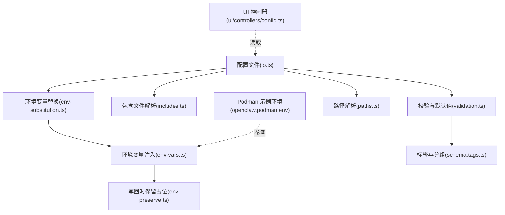
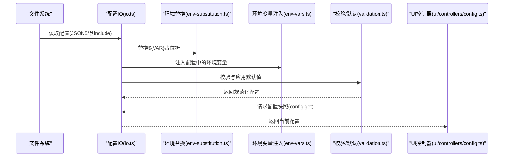
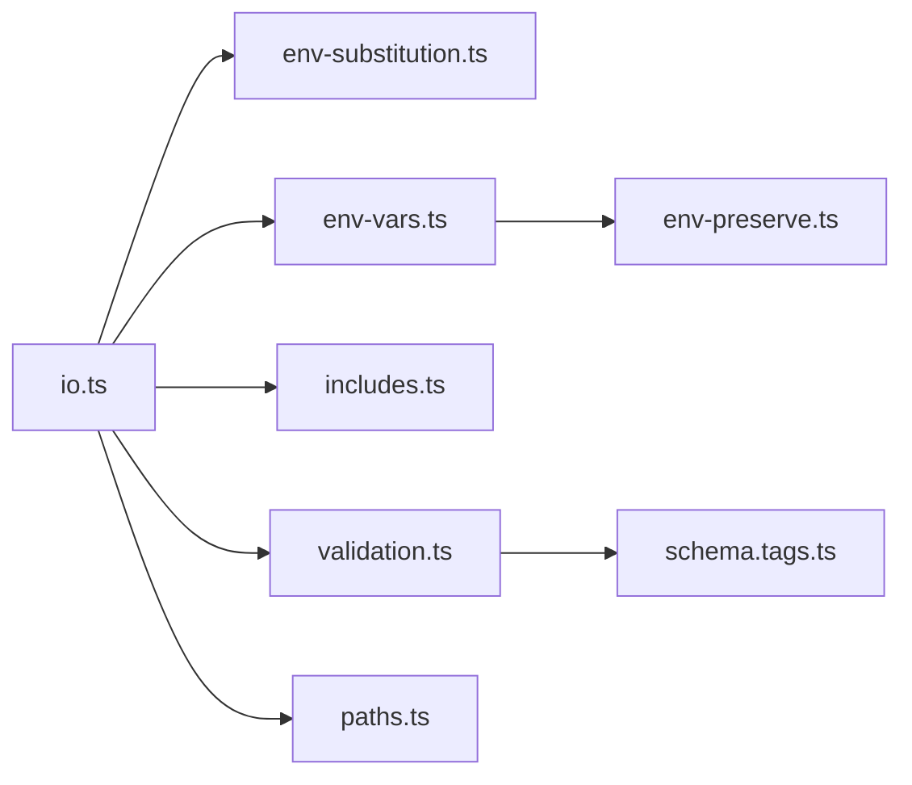

# 核心配置选项

<cite>
**本文引用的文件**
- [src/config/io.ts](file://src/config/io.ts)
- [src/config/env-substitution.ts](file://src/config/env-substitution.ts)
- [src/config/env-vars.ts](file://src/config/env-vars.ts)
- [src/config/env-preserve.ts](file://src/config/env-preserve.ts)
- [src/config/includes.ts](file://src/config/includes.ts)
- [src/config/validation.ts](file://src/config/validation.ts)
- [src/config/schema.tags.ts](file://src/config/schema.tags.ts)
- [src/config/paths.ts](file://src/config/paths.ts)
- [src/config/config.env-vars.test.ts](file://src/config/config.env-vars.test.ts)
- [src/config/env-substitution.test.ts](file://src/config/env-substitution.test.ts)
- [src/config/validation.allowed-values.test.ts](file://src/config/validation.allowed-values.test.ts)
- [src/config/cli/config-cli.test.ts](file://src/config/cli/config-cli.test.ts)
- [src/security/audit.test.ts](file://src/security/audit.test.ts)
- [src/security/audit-extra.sync.ts](file://src/security/audit-extra.sync.ts)
- [openclaw.podman.env](file://openclaw.podman.env)
- [ui/src/ui/controllers/config.ts](file://ui/src/ui/controllers/config.ts)
</cite>

## 目录

1. [简介](#简介)
2. [项目结构与配置入口](#项目结构与配置入口)
3. [核心组件总览](#核心组件总览)
4. [架构概览](#架构概览)
5. [详细配置项分类与参考](#详细配置项分类与参考)
6. [依赖关系分析](#依赖关系分析)
7. [性能与可靠性考量](#性能与可靠性考量)
8. [故障排查与常见问题](#故障排查与常见问题)
9. [结论](#结论)
10. [附录：配置命令与工具](#附录配置命令与工具)

## 简介

本文件为 OpenClaw 核心配置选项的权威参考，覆盖环境变量、默认值、配置文件选项、校验规则与常见错误处理方法。内容按功能维度组织（网络、安全、性能、调试等），并提供路径级定位、取值范围、影响范围与使用建议，帮助用户在不同平台与部署形态下正确配置与排障。

## 项目结构与配置入口

OpenClaw 的配置系统围绕“配置文件解析—环境变量替换—校验与默认值应用—写回保护”展开，并通过 CLI、UI 与守护进程统一入口加载与刷新配置。

**图示来源**

- [src/config/io.ts:1-200](file://src/config/io.ts#L1-L200)
- [src/config/env-substitution.ts:1-49](file://src/config/env-substitution.ts#L1-L49)
- [src/config/env-vars.ts:1-98](file://src/config/env-vars.ts#L1-L98)
- [src/config/env-preserve.ts:1-38](file://src/config/env-preserve.ts#L1-L38)
- [src/config/includes.ts:184-222](file://src/config/includes.ts#L184-L222)
- [src/config/validation.ts:1-605](file://src/config/validation.ts#L1-L605)
- [src/config/schema.tags.ts:1-53](file://src/config/schema.tags.ts#L1-L53)
- [src/config/paths.ts:154-194](file://src/config/paths.ts#L154-L194)
- [openclaw.podman.env:1-25](file://openclaw.podman.env#L1-L25)
- [ui/src/ui/controllers/config.ts:39-77](file://ui/src/ui/controllers/config.ts#L39-L77)

**章节来源**

- [src/config/io.ts:1-200](file://src/config/io.ts#L1-L200)
- [src/config/paths.ts:154-194](file://src/config/paths.ts#L154-L194)

## 核心组件总览

- 配置读取与合并：支持 JSON5 解析、包含文件、路径解析、运行时覆盖与备份轮换。
- 环境变量替换：支持 `${VAR}` 占位符、转义、缺失处理策略与写回时占位恢复。
- 环境变量注入：从配置块注入到进程环境，过滤危险键，避免覆盖已存在值。
- 校验与默认值：基于 Zod Schema 的强类型校验，附加业务规则（如头像路径、网关绑定与 Tailscale 组合）。
- 标签与分组：为 UI 与文档生成提供配置分类与优先级。
- 安全审计：对暴露模式、代理信任、危险命令启用等进行风险评估。

**章节来源**

- [src/config/io.ts:1-200](file://src/config/io.ts#L1-L200)
- [src/config/env-substitution.ts:1-49](file://src/config/env-substitution.ts#L1-L49)
- [src/config/env-vars.ts:1-98](file://src/config/env-vars.ts#L1-L98)
- [src/config/validation.ts:1-605](file://src/config/validation.ts#L1-L605)
- [src/config/schema.tags.ts:1-53](file://src/config/schema.tags.ts#L1-L53)

## 架构概览

以下序列图展示配置从读取到生效的关键流程，以及与 UI 和守护进程的关系。

**图示来源**

- [src/config/io.ts:708-742](file://src/config/io.ts#L708-L742)
- [src/config/env-substitution.ts:1-49](file://src/config/env-substitution.ts#L1-L49)
- [src/config/env-vars.ts:70-98](file://src/config/env-vars.ts#L70-L98)
- [src/config/validation.ts:229-286](file://src/config/validation.ts#L229-L286)
- [ui/src/ui/controllers/config.ts:39-77](file://ui/src/ui/controllers/config.ts#L39-L77)

## 详细配置项分类与参考

### 一、网络与绑定（gateway）

- 关键路径
  - gateway.bind：绑定模式（如 loopback、lan、custom）
  - gateway.customBindHost：自定义主机地址（当 bind=custom）
  - gateway.tailscale.mode：Tailscale 模式（off、serve、funnel）
  - gateway.auth.\*：认证方式与凭据（token/password 等）
  - gateway.controlUi.\*：控制界面访问与安全选项
  - gateway.nodes.allowCommands：允许的节点命令集合
  - gateway.nodes.denyCommands：拒绝的节点命令集合
- 影响范围
  - 控制服务监听地址与可访问性；与 Tailscale 组合时需满足绑定约束；控制 UI 访问与设备授权策略；节点命令直接影响设备操作面安全。
- 取值与规则
  - bind 与 tailscale.mode 组合有严格约束（见安全审计规则）。
  - allowCommands 中若包含高危命令，将触发安全审计告警。
- 使用示例
  - 将 bind 设为 loopback 或 custom 且指向 127.0.0.1，以配合 funnel/serve。
  - 在控制 UI 中开启或禁用设备授权与不安全认证开关时需谨慎评估风险。

**章节来源**

- [src/config/validation.ts:198-223](file://src/config/validation.ts#L198-L223)
- [src/security/audit.test.ts:1550-1605](file://src/security/audit.test.ts#L1550-L1605)
- [src/security/audit-extra.sync.ts:1036-1068](file://src/security/audit-extra.sync.ts#L1036-L1068)

### 二、安全与认证（gateway.auth、trustedProxies、controlUi）

- 关键路径
  - gateway.auth.mode/token/password
  - gateway.controlUi.dangerouslyAllowHostHeaderOriginFallback
  - gateway.controlUi.dangerouslyDisableDeviceAuth
  - gateway.controlUi.allowInsecureAuth
  - gateway.trustedProxies
- 影响范围
  - 控制认证强度与 UI 访问策略；代理信任列表决定真实客户端 IP 判定；危险开关会降低安全边界。
- 取值与规则
  - 当 gateway.bind 非 loopback 且包含非环回代理时，审计可能标记为高风险。
  - 不安全认证与设备授权禁用仅用于调试场景。
- 使用示例
  - 生产环境建议使用 token 认证并限制 trustedProxies 为环回或可信范围。

**章节来源**

- [src/security/audit.test.ts:1550-1605](file://src/security/audit.test.ts#L1550-L1605)
- [src/config/schema.tags.ts:42-53](file://src/config/schema.tags.ts#L42-L53)

### 三、性能与资源（agents.defaults、models、memory、tools.profile）

- 关键路径
  - agents.defaults.concurrency、heartbeat、contextWindowSize
  - models.providers.\*.apiKey、model、temperature
  - memory.\*、tools.exec.applyPatch.workspaceOnly
  - tools.profile：minimal/standard 等预设
- 影响范围
  - 并发与心跳影响系统吞吐与延迟；模型参数影响推理质量与成本；内存与工具配置影响资源占用。
- 取值与规则
  - concurrency 建议结合硬件与负载评估；tools.profile 会影响工具权限与沙箱策略。
- 使用示例
  - 在资源受限环境启用 tools.profile=minimal 以收紧权限。

**章节来源**

- [src/config/validation.ts:275-286](file://src/config/validation.ts#L275-L286)
- [src/security/audit-extra.sync.ts:1064-1068](file://src/security/audit-extra.sync.ts#L1064-L1068)

### 四、调试与可观测性（logging、debug、config.get/config.schema）

- 关键路径
  - logging.level、logging.format、logging.output
  - config.get、config.schema（UI 与 CLI）
- 影响范围
  - 调试日志级别与格式；UI/CLI 获取配置与模式提示。
- 使用示例
  - 通过 UI 控制器请求 config.get 与 config.schema，获取当前配置与 UI 提示。

**章节来源**

- [ui/src/ui/controllers/config.ts:39-77](file://ui/src/ui/controllers/config.ts#L39-L77)

### 五、环境变量与占位符（env、${VAR}、~/.openclaw/.env）

- 关键机制
  - 支持在配置中使用 `${VAR}` 占位符，加载时替换为环境变量值；支持转义输出字面量 `${}`。
  - 写回时，若值与原占位符一致，则恢复占位符，避免硬编码泄露。
  - 支持在状态目录下的 .env 文件中注入密钥（如 BRAVE_API_KEY）。
- 取值与规则
  - 缺失变量默认抛出异常；可通过 onMissing 回调收集警告并保留占位符。
  - 配置注入不会覆盖已存在的环境变量。
- 使用示例
  - 在 Podman 环境中设置 OPENCLAW_GATEWAY_TOKEN；在本地 .env 中设置第三方 API 密钥。

**章节来源**

- [src/config/env-substitution.ts:1-49](file://src/config/env-substitution.ts#L1-L49)
- [src/config/env-preserve.ts:1-38](file://src/config/env-preserve.ts#L1-L38)
- [src/config/env-vars.ts:79-98](file://src/config/env-vars.ts#L79-L98)
- [src/config/config.env-vars.test.ts:102-132](file://src/config/config.env-vars.test.ts#L102-L132)
- [openclaw.podman.env:1-25](file://openclaw.podman.env#L1-L25)

### 六、配置文件与包含（JSON5、include、路径解析）

- 关键机制
  - 使用 JSON5 解析配置；支持 include 语法，包含文件必须位于顶层配置目录内且不可逃逸。
  - 路径解析优先使用 OPENCLAW_CONFIG_PATH，否则在状态目录查找历史与默认文件名。
- 取值与规则
  - include 路径经安全检查，禁止路径穿越与符号链接逃逸。
- 使用示例
  - 将公共配置拆分为多个文件并通过 include 引入；确保 include 路径相对配置根目录。

**章节来源**

- [src/config/includes.ts:184-222](file://src/config/includes.ts#L184-L222)
- [src/config/paths.ts:154-194](file://src/config/paths.ts#L154-L194)
- [src/config/io.ts:654-742](file://src/config/io.ts#L654-L742)

### 七、校验与错误提示（Zod Schema、allowed-values、插件配置）

- 关键机制
  - 基于 Zod Schema 的强类型校验；附加业务规则（如头像路径、Tailscale 绑定）。
  - 对枚举与联合类型自动附加 allowed-values 提示；未知通道与插件 ID 进行诊断。
- 取值与规则
  - 未知通道、非法路径、重复代理工作目录等均会生成明确的错误信息与修复建议。
- 使用示例
  - 使用 CLI config validate 输出结构化错误与允许值列表，快速定位问题。

**章节来源**

- [src/config/validation.ts:117-140](file://src/config/validation.ts#L117-L140)
- [src/config/validation.allowed-values.test.ts:1-34](file://src/config/validation.allowed-values.test.ts#L1-34)
- [src/config/cli/config-cli.test.ts:93-126](file://src/config/cli/config-cli.test.ts#L93-L126)

## 依赖关系分析

**图示来源**

- [src/config/io.ts:1-200](file://src/config/io.ts#L1-L200)
- [src/config/env-substitution.ts:1-49](file://src/config/env-substitution.ts#L1-L49)
- [src/config/env-vars.ts:1-98](file://src/config/env-vars.ts#L1-L98)
- [src/config/env-preserve.ts:1-38](file://src/config/env-preserve.ts#L1-L38)
- [src/config/includes.ts:184-222](file://src/config/includes.ts#L184-L222)
- [src/config/validation.ts:1-605](file://src/config/validation.ts#L1-L605)
- [src/config/schema.tags.ts:1-53](file://src/config/schema.tags.ts#L1-L53)
- [src/config/paths.ts:154-194](file://src/config/paths.ts#L154-L194)

**章节来源**

- [src/config/io.ts:1-200](file://src/config/io.ts#L1-L200)

## 性能与可靠性考量

- 并发与心跳
  - 合理设置 agents.defaults.concurrency 与 heartbeat.target，避免过载或误报。
- 模型与缓存
  - 选择合适的模型与温度，平衡质量与成本；必要时启用缓存与会话修剪。
- 插件与内存槽
  - 仅启用必要的插件，避免内存槽冲突；对高风险命令保持最小化授权。
- 日志与可观测性
  - 在调试阶段提升日志级别，生产环境回归到标准级别以减少开销。

[本节为通用指导，无需列出具体文件来源]

## 故障排查与常见问题

- 缺失环境变量
  - 现象：加载配置时报错，提示缺少 ${VAR}。
  - 处理：在进程环境或状态目录 .env 中设置对应变量；或使用 config.set 补充。
- 占位符未替换
  - 现象：写回后出现 `${VAR}` 字面量而非实际值。
  - 处理：确认写回时提供了正确的 envSnapshotForRestore；或直接使用真实值。
- include 路径逃逸
  - 现象：包含文件被拒绝，提示路径逃逸。
  - 处理：确保 include 路径位于配置根目录内，避免 .. 与符号链接绕过。
- 绑定与 Tailscale 冲突
  - 现象：当 tailscale.mode=serve/funnel 时，bind 非 loopback 报错。
  - 处理：将 bind 设为 loopback 或 custom 且指向 127.0.0.1。
- 未知通道或插件
  - 现象：channels 或 plugins 中出现未知 ID。
  - 处理：移除或修正未知 ID；使用 config.validate 获取允许值列表辅助修复。
- UI/CLI 无法获取配置
  - 现象：UI 控制器请求 config.get 报错。
  - 处理：检查连接状态与守护进程健康；查看 lastError 并重试。

**章节来源**

- [src/config/env-substitution.test.ts:116-150](file://src/config/env-substitution.test.ts#L116-L150)
- [src/config/env-preserve.ts:19-38](file://src/config/env-preserve.ts#L19-L38)
- [src/config/includes.ts:184-222](file://src/config/includes.ts#L184-L222)
- [src/config/validation.ts:198-223](file://src/config/validation.ts#L198-L223)
- [src/config/validation.allowed-values.test.ts:1-34](file://src/config/validation.allowed-values.test.ts#L1-34)
- [ui/src/ui/controllers/config.ts:39-77](file://ui/src/ui/controllers/config.ts#L39-L77)

## 结论

OpenClaw 的配置体系以“强类型校验 + 环境变量替换 + 安全审计 + 分类标签”为核心，既保证了灵活性与可维护性，又在生产环境中强调安全性与可观测性。建议在生产部署中遵循最小权限原则、严格的绑定与代理信任策略，并通过 CLI 与 UI 工具持续验证配置有效性。

[本节为总结性内容，无需列出具体文件来源]

## 附录：配置命令与工具

- CLI 验证
  - 使用 config validate 输出结构化错误与允许值列表，便于自动化与 CI 集成。
- UI 快照与模式
  - 通过 config.get 获取当前配置快照；通过 config.schema 获取 UI 模式与提示。
- Podman 环境示例
  - 参考 openclaw.podman.env 设置 OPENCLAW_GATEWAY_TOKEN、端口映射与绑定模式。

**章节来源**

- [src/config/cli/config-cli.test.ts:93-126](file://src/config/cli/config-cli.test.ts#L93-L126)
- [ui/src/ui/controllers/config.ts:39-77](file://ui/src/ui/controllers/config.ts#L39-L77)
- [openclaw.podman.env:1-25](file://openclaw.podman.env#L1-L25)
