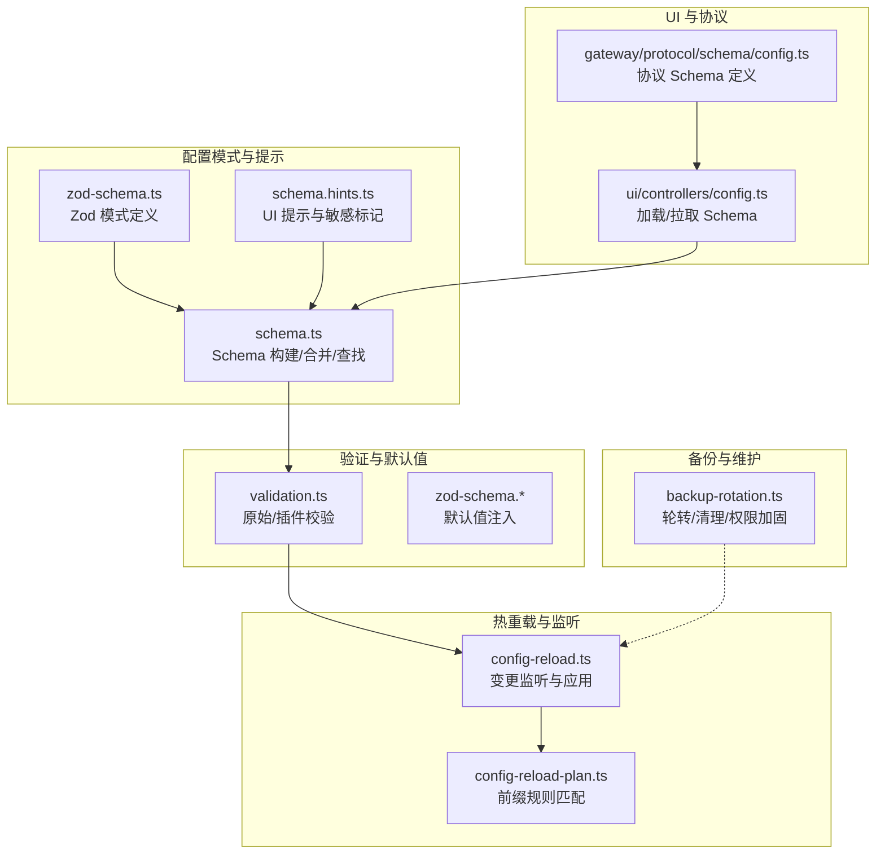
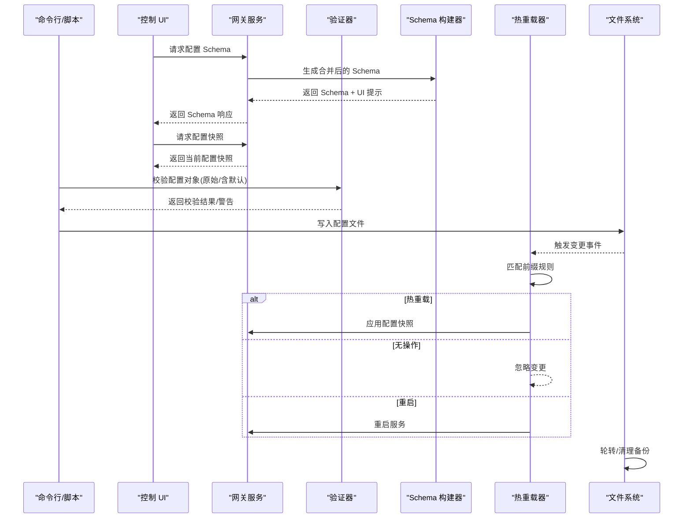
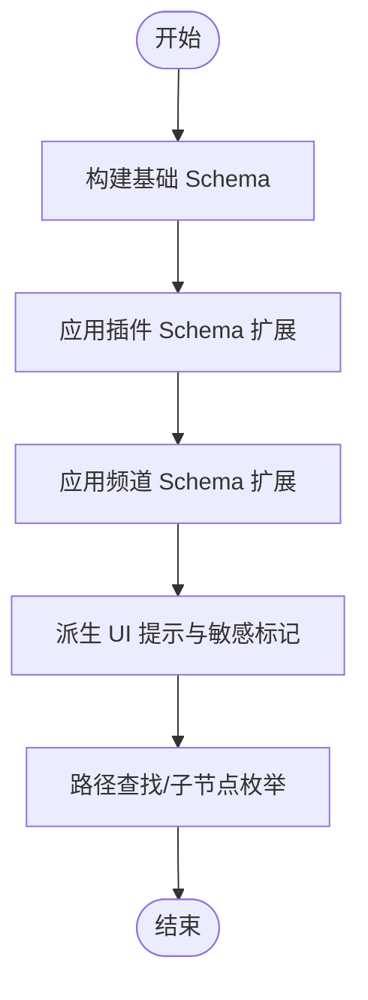
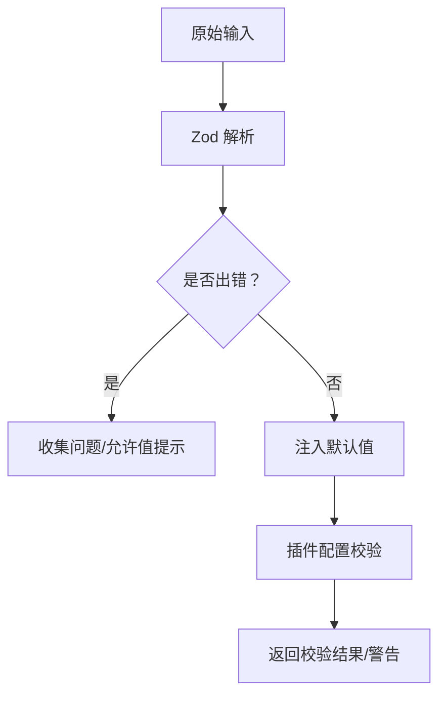
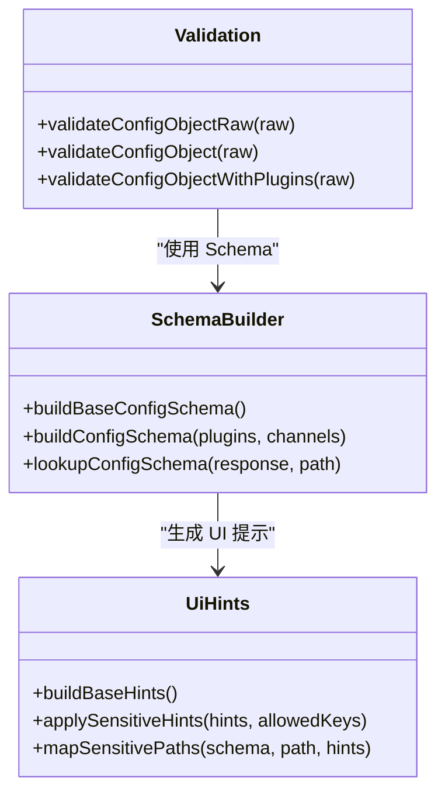
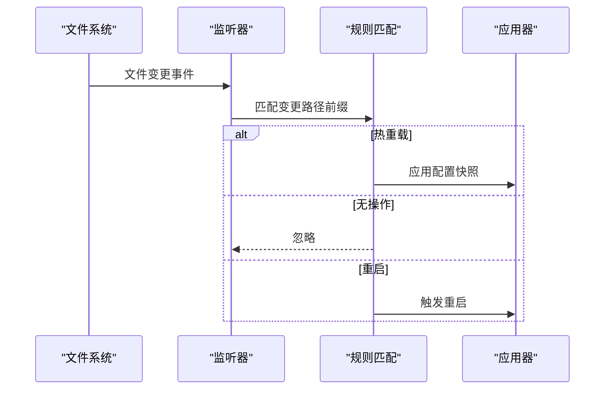
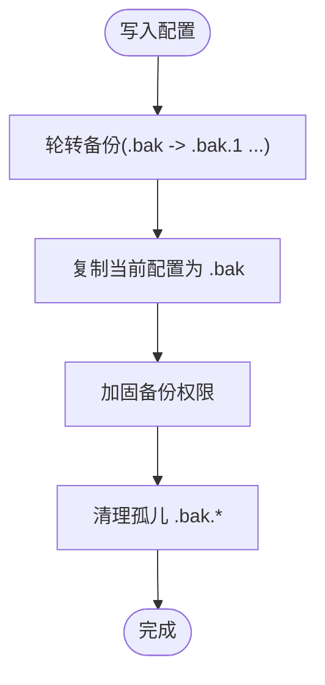
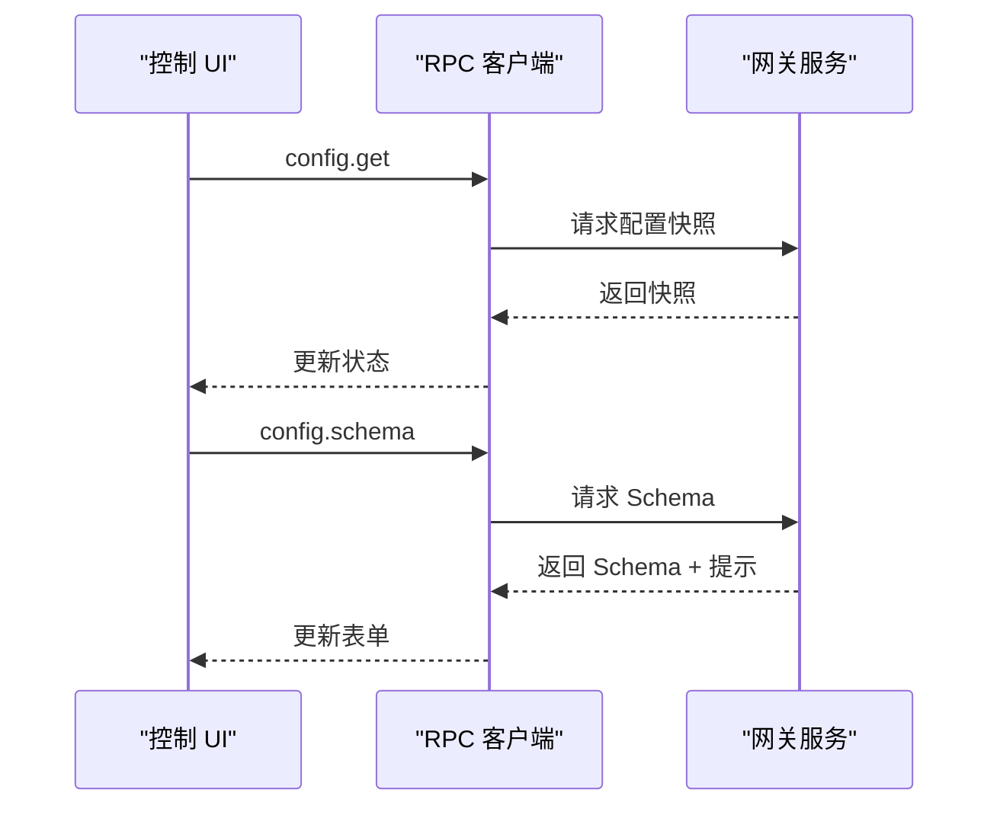
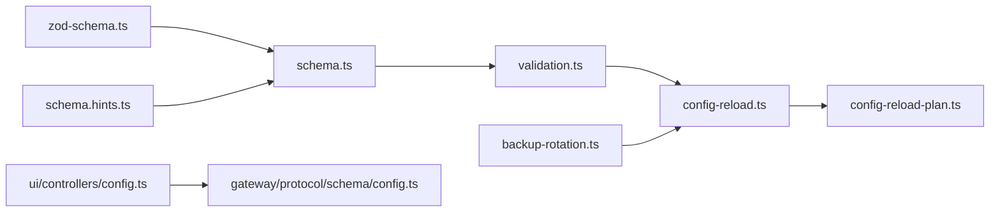

# 自定义配置

<cite>
**本文引用的文件**
- [src/config/schema.ts](file://src/config/schema.ts)
- [src/config/validation.ts](file://src/config/validation.ts)
- [src/config/zod-schema.ts](file://src/config/zod-schema.ts)
- [src/config/schema.hints.ts](file://src/config/schema.hints.ts)
- [src/config/config-paths.ts](file://src/config/config-paths.ts)
- [src/config/backup-rotation.ts](file://src/config/backup-rotation.ts)
- [src/gateway/config-reload.ts](file://src/gateway/config-reload.ts)
- [src/gateway/config-reload-plan.ts](file://src/gateway/config-reload-plan.ts)
- [src/gateway/protocol/schema/config.ts](file://src/gateway/protocol/schema/config.ts)
- [ui/src/ui/controllers/config.ts](file://ui/src/ui/controllers/config.ts)
- [src/config/commands.ts](file://src/config/commands.ts)
- [src/plugin-sdk/channel-config-helpers.ts](file://src/plugin-sdk/channel-config-helpers.ts)
- [extensions/tlon/src/monitor/index.ts](file://extensions/tlon/src/monitor/index.ts)
- [src/commands/doctor-config-flow.test.ts](file://src/commands/doctor-config-flow.test.ts)
</cite>

## 目录

1. [简介](#简介)
2. [项目结构](#项目结构)
3. [核心组件](#核心组件)
4. [架构总览](#架构总览)
5. [详细组件分析](#详细组件分析)
6. [依赖关系分析](#依赖关系分析)
7. [性能考量](#性能考量)
8. [故障排查指南](#故障排查指南)
9. [结论](#结论)
10. [附录](#附录)

## 简介

本指南面向需要深度定制与运维 OpenClaw 的工程师与高级用户，系统讲解配置系统的架构设计、配置文件格式、动态配置与热重载机制、配置验证与迁移策略，以及在多账户、权限控制与性能调优等高级场景下的最佳实践。文档以代码为依据，配合可视化图示帮助读者快速理解从“配置生成—校验—应用—热重载—备份”的完整闭环。

## 项目结构

OpenClaw 的配置系统由“模式构建与提示”“配置验证与默认值”“动态 Schema 合并与 UI 提示”“热重载与监听”“备份轮转与维护”“UI 控制端交互”等模块组成。下图给出与配置相关的关键子系统与文件映射：

图表来源

- [src/config/zod-schema.ts:206-911](file://src/config/zod-schema.ts#L206-L911)
- [src/config/schema.hints.ts:124-239](file://src/config/schema.hints.ts#L124-L239)
- [src/config/schema.ts:449-484](file://src/config/schema.ts#L449-L484)
- [src/config/validation.ts:229-286](file://src/config/validation.ts#L229-L286)
- [src/gateway/config-reload.ts:181-247](file://src/gateway/config-reload.ts#L181-L247)
- [src/gateway/config-reload-plan.ts:100-140](file://src/gateway/config-reload-plan.ts#L100-L140)
- [src/config/backup-rotation.ts:16-125](file://src/config/backup-rotation.ts#L16-L125)
- [ui/src/ui/controllers/config.ts:39-77](file://ui/src/ui/controllers/config.ts#L39-L77)
- [src/gateway/protocol/schema/config.ts:53-100](file://src/gateway/protocol/schema/config.ts#L53-L100)

章节来源

- [src/config/schema.ts:449-484](file://src/config/schema.ts#L449-L484)
- [src/config/validation.ts:229-286](file://src/config/validation.ts#L229-L286)
- [src/gateway/config-reload.ts:181-247](file://src/gateway/config-reload.ts#L181-L247)

## 核心组件

- 配置模式与 Schema 构建：基于 Zod 定义核心配置结构，支持插件与频道扩展的 Schema 合并与 UI 提示派生。
- 配置验证与默认值：提供原始校验（不注入默认值）与应用默认值后的校验；对插件配置进行独立校验与诊断。
- 动态 Schema 与 UI 提示：按插件/频道元数据动态扩展 Schema，并生成 UI 提示（标签、分组、占位符、敏感标记等）。
- 热重载与监听：监听配置文件变化，按前缀规则决定热重载、无操作或重启动作。
- 备份轮转与维护：写入配置时自动轮转历史备份、清理孤儿备份、加固权限。
- UI 控制端：通过 RPC 请求获取配置快照与 Schema，驱动表单渲染与实时更新。

章节来源

- [src/config/zod-schema.ts:206-911](file://src/config/zod-schema.ts#L206-L911)
- [src/config/schema.ts:449-484](file://src/config/schema.ts#L449-L484)
- [src/config/validation.ts:229-286](file://src/config/validation.ts#L229-L286)
- [src/config/backup-rotation.ts:16-125](file://src/config/backup-rotation.ts#L16-L125)
- [ui/src/ui/controllers/config.ts:39-77](file://ui/src/ui/controllers/config.ts#L39-L77)

## 架构总览

下图展示“配置生成—校验—应用—热重载—备份”的端到端流程：

图表来源

- [ui/src/ui/controllers/config.ts:39-77](file://ui/src/ui/controllers/config.ts#L39-L77)
- [src/config/schema.ts:449-484](file://src/config/schema.ts#L449-L484)
- [src/config/validation.ts:229-286](file://src/config/validation.ts#L229-L286)
- [src/gateway/config-reload.ts:181-247](file://src/gateway/config-reload.ts#L181-L247)
- [src/gateway/config-reload-plan.ts:100-140](file://src/gateway/config-reload-plan.ts#L100-L140)
- [src/config/backup-rotation.ts:115-125](file://src/config/backup-rotation.ts#L115-L125)

## 详细组件分析

### 组件一：配置模式与 Schema 构建

- Zod 模式定义：集中于 zod-schema.ts，覆盖环境、日志、浏览器、代理、模型、会话、消息、命令、钩子、网关、通道、技能、插件等子系统。
- Schema 合并：schema.ts 支持将插件与频道的自定义 Schema 与基础 Schema 合并，并生成 UI 提示（含分组、顺序、占位符、敏感标记）。
- Schema 查找：提供路径解析、子节点枚举、提示匹配能力，便于 UI 动态渲染与导航。

图表来源

- [src/config/zod-schema.ts:206-911](file://src/config/zod-schema.ts#L206-L911)
- [src/config/schema.ts:449-484](file://src/config/schema.ts#L449-L484)
- [src/config/schema.hints.ts:124-239](file://src/config/schema.hints.ts#L124-L239)

章节来源

- [src/config/zod-schema.ts:206-911](file://src/config/zod-schema.ts#L206-L911)
- [src/config/schema.ts:449-484](file://src/config/schema.ts#L449-L484)
- [src/config/schema.hints.ts:124-239](file://src/config/schema.hints.ts#L124-L239)

### 组件二：配置验证与默认值

- 原始校验：validateConfigObjectRaw 不注入默认值，适合写回文件；返回问题列表与允许值提示。
- 应用默认值：validateConfigObject 在原始校验基础上注入模型/代理/会话默认值，确保运行时一致性。
- 插件校验：对插件 entries、allow/deny、内存槽位、心跳目标等进行校验与诊断，输出问题与警告。

图表来源

- [src/config/validation.ts:229-286](file://src/config/validation.ts#L229-L286)
- [src/config/validation.ts:308-604](file://src/config/validation.ts#L308-L604)

章节来源

- [src/config/validation.ts:229-286](file://src/config/validation.ts#L229-L286)
- [src/config/validation.ts:308-604](file://src/config/validation.ts#L308-L604)

### 组件三：动态 Schema 与 UI 提示

- 敏感字段识别：基于键名模式与 Zod 注解，自动标注敏感字段；支持白名单豁免。
- 插件/频道 Schema 扩展：将插件与频道提供的 configSchema 合并到基础 Schema 中，并应用 UI 提示。
- 提示派生：根据字段路径生成分组、顺序、占位符、帮助信息，支持通配符匹配与层级提示。

图表来源

- [src/config/schema.ts:449-484](file://src/config/schema.ts#L449-L484)
- [src/config/schema.hints.ts:124-239](file://src/config/schema.hints.ts#L124-L239)
- [src/config/validation.ts:229-286](file://src/config/validation.ts#L229-L286)

章节来源

- [src/config/schema.ts:449-484](file://src/config/schema.ts#L449-L484)
- [src/config/schema.hints.ts:124-239](file://src/config/schema.hints.ts#L124-L239)

### 组件四：热重载与监听

- 变更监听：基于 chokidar 监听配置文件变化，防抖后触发重载。
- 规则匹配：按前缀匹配决定“热重载/无操作/重启”，通道插件可贡献前缀规则。
- 应用流程：读取快照、校验、应用、错误记录、递归调度。

图表来源

- [src/gateway/config-reload.ts:181-247](file://src/gateway/config-reload.ts#L181-L247)
- [src/gateway/config-reload-plan.ts:100-140](file://src/gateway/config-reload-plan.ts#L100-L140)

章节来源

- [src/gateway/config-reload.ts:181-247](file://src/gateway/config-reload.ts#L181-L247)
- [src/gateway/config-reload-plan.ts:100-140](file://src/gateway/config-reload-plan.ts#L100-L140)

### 组件五：备份轮转与维护

- 轮转策略：固定数量环形轮转，保留最近 N 份备份。
- 维护流程：写入前轮转 -> 创建新备份 -> 加固权限 -> 清理孤儿备份。
- 最佳实践：确保备份目录可写、权限最小化、定期清理过期备份。

图表来源

- [src/config/backup-rotation.ts:16-125](file://src/config/backup-rotation.ts#L16-L125)

章节来源

- [src/config/backup-rotation.ts:16-125](file://src/config/backup-rotation.ts#L16-L125)

### 组件六：UI 控制端与协议

- 控制端请求：通过 RPC 获取配置快照与 Schema，支持加载状态与错误处理。
- 协议定义：网关侧协议对 UI 提示、Schema 响应、查找结果进行类型约束。

图表来源

- [ui/src/ui/controllers/config.ts:39-77](file://ui/src/ui/controllers/config.ts#L39-L77)
- [src/gateway/protocol/schema/config.ts:53-100](file://src/gateway/protocol/schema/config.ts#L53-L100)

章节来源

- [ui/src/ui/controllers/config.ts:39-77](file://ui/src/ui/controllers/config.ts#L39-L77)
- [src/gateway/protocol/schema/config.ts:53-100](file://src/gateway/protocol/schema/config.ts#L53-L100)

### 组件七：高级配置场景与最佳实践

- 多账户管理：通过 allowFrom、dmPolicy、groupPolicy 等字段实现账号级访问控制与消息路由；插件/频道适配器提供统一解析与格式化。
- 权限控制：结合网关鉴权模式（token/password/trusted-proxy）、速率限制、可信代理头等，形成多层防护。
- 性能调优：合理设置会话超时、并发限制、缓存大小、心跳间隔、TLS/SSRF 策略等；利用热重载按需生效。

章节来源

- [src/plugin-sdk/channel-config-helpers.ts:34-61](file://src/plugin-sdk/channel-config-helpers.ts#L34-L61)
- [extensions/tlon/src/monitor/index.ts:255-289](file://extensions/tlon/src/monitor/index.ts#L255-L289)

## 依赖关系分析

- 模块耦合：schema.ts 依赖 zod-schema.ts 与 schema.hints.ts；validation.ts 依赖 schema.ts 与各子系统默认值注入；config-reload.ts 依赖 config-reload-plan.ts 与文件系统；UI 控制端依赖网关协议与 schema。
- 外部依赖：chokidar 用于文件监听；Zod 用于强类型模式与校验；TypeBox（协议）用于 RPC 类型安全。

图表来源

- [src/config/zod-schema.ts:206-911](file://src/config/zod-schema.ts#L206-L911)
- [src/config/schema.ts:449-484](file://src/config/schema.ts#L449-L484)
- [src/config/schema.hints.ts:124-239](file://src/config/schema.hints.ts#L124-L239)
- [src/config/validation.ts:229-286](file://src/config/validation.ts#L229-L286)
- [src/gateway/config-reload.ts:181-247](file://src/gateway/config-reload.ts#L181-L247)
- [src/gateway/config-reload-plan.ts:100-140](file://src/gateway/config-reload-plan.ts#L100-L140)
- [src/config/backup-rotation.ts:16-125](file://src/config/backup-rotation.ts#L16-L125)
- [ui/src/ui/controllers/config.ts:39-77](file://ui/src/ui/controllers/config.ts#L39-L77)
- [src/gateway/protocol/schema/config.ts:53-100](file://src/gateway/protocol/schema/config.ts#L53-L100)

## 性能考量

- Schema 缓存：schema.ts 对合并后的 Schema 进行缓存，避免重复构建。
- 默认值注入：仅在必要时注入默认值，减少运行时开销。
- 热重载防抖：监听器采用稳定阈值与轮询策略，降低频繁重载带来的抖动。
- 备份维护：轮转与清理采用“尽力而为”策略，避免阻塞主流程。

章节来源

- [src/config/schema.ts:352-406](file://src/config/schema.ts#L352-L406)
- [src/gateway/config-reload.ts:217-234](file://src/gateway/config-reload.ts#L217-L234)
- [src/config/backup-rotation.ts:16-125](file://src/config/backup-rotation.ts#L16-L125)

## 故障排查指南

- 配置校验失败
  - 使用 validateConfigObjectRaw 获取原始错误与允许值提示，定位具体字段。
  - 若涉及插件，检查插件 ID 是否存在、schema 是否缺失、配置是否符合插件定义。
- 热重载无效
  - 检查变更路径是否命中规则前缀；确认监听路径与稳定性阈值设置。
- 备份异常
  - 检查备份目录权限与磁盘空间；确认轮转计数与孤儿备份清理逻辑是否执行。
- UI 表单异常
  - 确认 Schema 生成与 UI 提示是否正确下发；检查协议字段是否匹配。

章节来源

- [src/config/validation.ts:117-140](file://src/config/validation.ts#L117-L140)
- [src/gateway/config-reload.ts:217-234](file://src/gateway/config-reload.ts#L217-L234)
- [src/config/backup-rotation.ts:16-125](file://src/config/backup-rotation.ts#L16-L125)
- [ui/src/ui/controllers/config.ts:39-77](file://ui/src/ui/controllers/config.ts#L39-L77)

## 结论

OpenClaw 的配置系统以 Zod 模式为核心，结合动态 Schema 合并与 UI 提示，实现了强类型、可扩展、可观测的配置体验。通过严格的验证与默认值注入、灵活的热重载规则、稳健的备份维护与完善的 UI 协议，系统在复杂场景下仍能保持高可靠与易运维性。建议在生产环境中启用热重载与备份策略，并遵循敏感字段标注与最小权限原则。

## 附录

- 配置路径工具：提供路径解析、设置、删除、读取等通用能力，便于脚本化与自动化。
- 命令与技能开关：按渠道与全局设置解析原生命令/技能启用策略，支持自动默认值。
- 多账户与权限：通过 allowFrom、dmPolicy、groupPolicy 与网关鉴权组合，实现细粒度访问控制。

章节来源

- [src/config/config-paths.ts:6-83](file://src/config/config-paths.ts#L6-L83)
- [src/config/commands.ts:10-91](file://src/config/commands.ts#L10-L91)
- [src/plugin-sdk/channel-config-helpers.ts:34-61](file://src/plugin-sdk/channel-config-helpers.ts#L34-L61)
- [extensions/tlon/src/monitor/index.ts:255-289](file://extensions/tlon/src/monitor/index.ts#L255-L289)
- [src/commands/doctor-config-flow.test.ts:371-393](file://src/commands/doctor-config-flow.test.ts#L371-L393)
