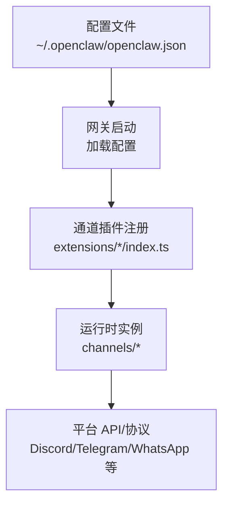
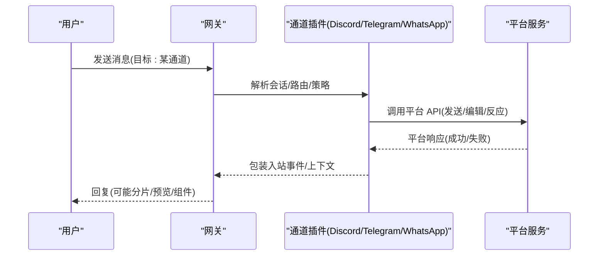
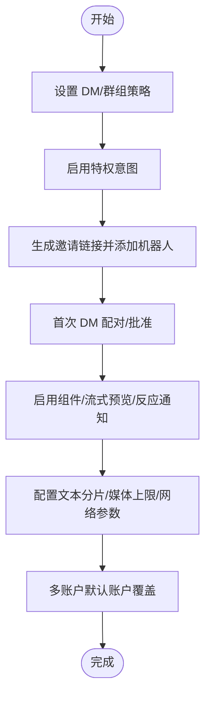
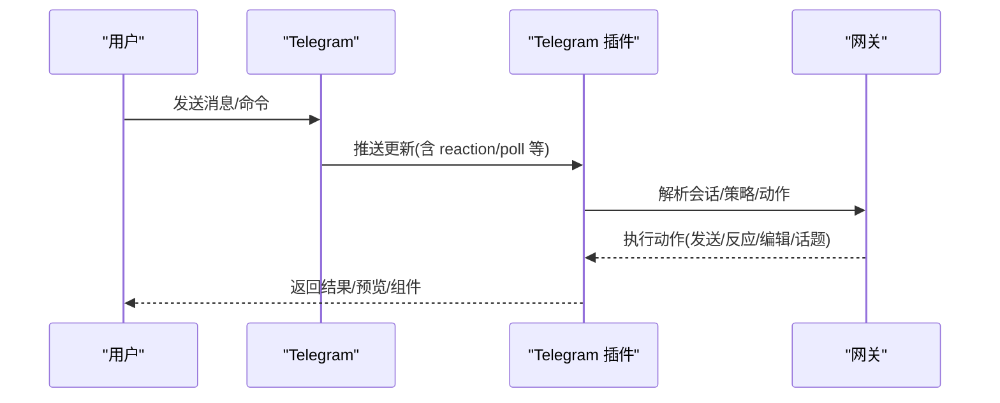
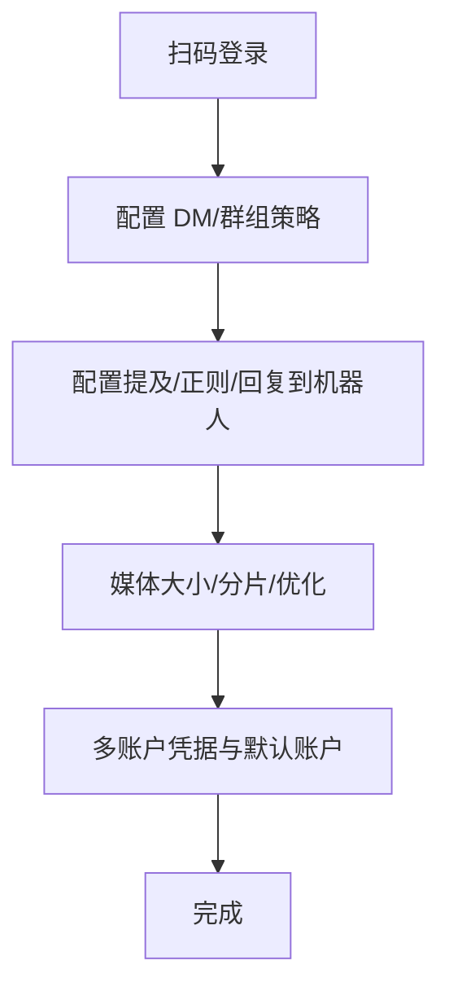
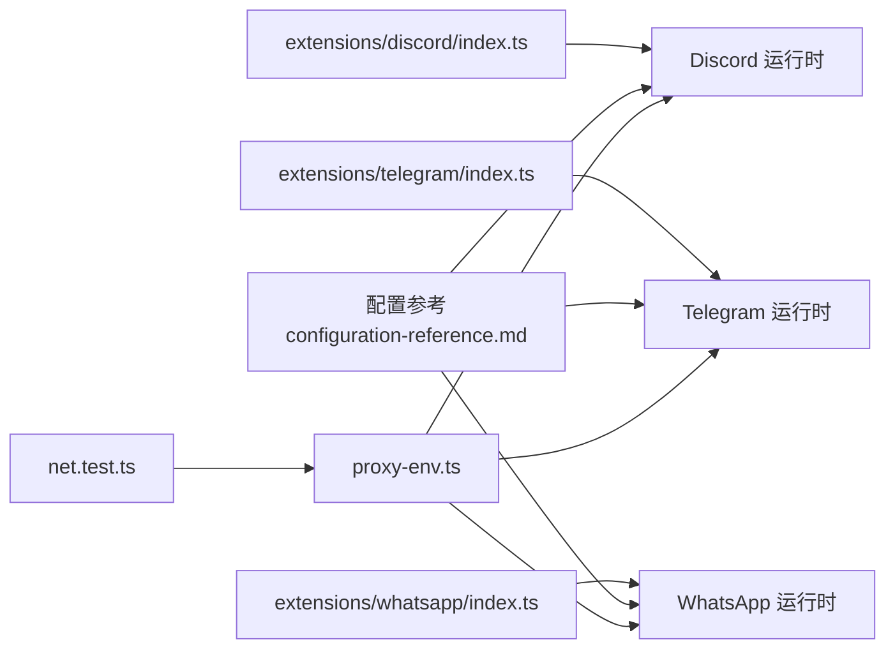

# 通道特定配置

<cite>
**本文引用的文件**
- [docs/channels/index.md](file://docs/channels/index.md)
- [docs/channels/discord.md](file://docs/channels/discord.md)
- [docs/channels/telegram.md](file://docs/channels/telegram.md)
- [docs/channels/whatsapp.md](file://docs/channels/whatsapp.md)
- [docs/gateway/configuration-reference.md](file://docs/gateway/configuration-reference.md)
- [docs/gateway/configuration.md](file://docs/gateway/configuration.md)
- [docs/channels/troubleshooting.md](file://docs/channels/troubleshooting.md)
- [extensions/discord/index.ts](file://extensions/discord/index.ts)
- [extensions/telegram/index.ts](file://extensions/telegram/index.ts)
- [extensions/whatsapp/index.ts](file://extensions/whatsapp/index.ts)
- [src/infra/net/proxy-env.ts](file://src/infra/net/proxy-env.ts)
- [src/gateway/net.test.ts](file://src/gateway/net.test.ts)
- [src/config/types.node-host.ts](file://src/config/types.node-host.ts)
- [src/plugin-sdk/account-resolution.ts](file://src/plugin-sdk/account-resolution.ts)
- [src/channels/plugins/account-helpers.ts](file://src/channels/plugins/account-helpers.ts)
</cite>

## 目录

1. [简介](#简介)
2. [项目结构](#项目结构)
3. [核心组件](#核心组件)
4. [架构总览](#架构总览)
5. [详细组件分析](#详细组件分析)
6. [依赖关系分析](#依赖关系分析)
7. [性能考量](#性能考量)
8. [故障排除指南](#故障排除指南)
9. [结论](#结论)
10. [附录](#附录)

## 简介

本文件面向需要在 OpenClaw 中为不同消息平台（Discord、Telegram、WhatsApp 等）进行通道特定配置的用户与工程师，系统梳理各平台的认证方式、权限与访问控制、高级特性、性能与安全配置、多账户与代理设置、以及平台更新后的配置迁移与兼容性处理策略。文档以仓库内官方文档与插件注册入口为依据，辅以代码级依赖关系图示，帮助读者快速建立从“如何配置”到“为何这样配置”的完整认知。

## 项目结构

OpenClaw 的通道配置由“顶层配置 + 各通道插件 + 运行时行为”三部分组成：

- 顶层配置：集中于 `~/.openclaw/openclaw.json`，采用 JSON5 格式，支持热重载与严格校验。
- 通道插件：每个通道通过独立插件注册，暴露统一的注册接口与运行时能力。
- 运行时行为：由网关根据配置驱动各通道连接、会话隔离、消息路由与交互。

图表来源

- [extensions/discord/index.ts:1-20](file://extensions/discord/index.ts#L1-L20)
- [extensions/telegram/index.ts:1-18](file://extensions/telegram/index.ts#L1-L18)
- [extensions/whatsapp/index.ts:1-18](file://extensions/whatsapp/index.ts#L1-L18)
- [docs/gateway/configuration.md:1-547](file://docs/gateway/configuration.md#L1-L547)

章节来源

- [docs/channels/index.md:1-48](file://docs/channels/index.md#L1-L48)
- [docs/gateway/configuration.md:1-547](file://docs/gateway/configuration.md#L1-L547)

## 核心组件

- 通道插件注册：各通道通过插件入口注册自身运行时与通道实现，统一暴露给网关。
- 配置参考：通道级别的访问控制、消息流控、媒体限制、网络与代理、命令与 UI 等均在配置参考中给出字段级定义与默认值。
- 故障排除：按通道列出常见症状、快速检查点与修复建议，便于一线排障。

章节来源

- [extensions/discord/index.ts:1-20](file://extensions/discord/index.ts#L1-L20)
- [extensions/telegram/index.ts:1-18](file://extensions/telegram/index.ts#L1-L18)
- [extensions/whatsapp/index.ts:1-18](file://extensions/whatsapp/index.ts#L1-L18)
- [docs/gateway/configuration-reference.md:1-800](file://docs/gateway/configuration-reference.md#L1-L800)
- [docs/channels/troubleshooting.md:1-118](file://docs/channels/troubleshooting.md#L1-L118)

## 架构总览

下图展示通道插件与网关、配置的关系，以及典型的消息往返路径。

图表来源

- [extensions/discord/index.ts:1-20](file://extensions/discord/index.ts#L1-L20)
- [extensions/telegram/index.ts:1-18](file://extensions/telegram/index.ts#L1-L18)
- [extensions/whatsapp/index.ts:1-18](file://extensions/whatsapp/index.ts#L1-L18)
- [docs/gateway/configuration-reference.md:1-800](file://docs/gateway/configuration-reference.md#L1-L800)

## 详细组件分析

### Discord 通道配置

- 认证与权限
  - 使用机器人令牌（Bot Token），可设置环境变量回退；支持每调用显式传令牌用于高级出站调用。
  - DM 政策：配对（默认）、白名单、开放、禁用；群组策略：开放、白名单、禁用。
  - 允许来源：服务器/频道/用户/角色白名单；提及模式与忽略其他提及可按服务器/频道配置。
- 高级特性
  - 交互组件（v2 容器）、模态表单、动作行、选择菜单等；支持可复用组件与按钮/选择器授权。
  - 流式预览（partial/block）、历史上下文限制、线程绑定与持久化 ACP 绑定。
  - 反应通知、ACK 反应、原生命令与命令鉴权、语音自动加入与 TTS。
- 性能与安全
  - 文本分片与换行优先策略；媒体大小限制；网络族选择与 DNS 结果顺序；代理支持。
  - Presence 自动映射、危险名称匹配开关仅用于兼容场景。
- 多账户与迁移
  - 默认账户选择与覆盖；升级后未配置时群组策略回退至白名单并告警。

图表来源

- [docs/channels/discord.md:1-800](file://docs/channels/discord.md#L1-L800)
- [docs/gateway/configuration-reference.md:214-330](file://docs/gateway/configuration-reference.md#L214-L330)

章节来源

- [docs/channels/discord.md:1-800](file://docs/channels/discord.md#L1-L800)
- [docs/gateway/configuration-reference.md:214-330](file://docs/gateway/configuration-reference.md#L214-L330)

### Telegram 通道配置

- 认证与权限
  - Bot 令牌（支持文件/执行/环境回退）；DM 政策与允许来源；群组策略与发送者白名单。
  - Bot 隐私模式与管理员权限影响消息可见性；用户名需解析为数字 ID。
- 高级特性
  - 原生命令菜单注册；自定义命令；内联按钮作用域；消息动作（发送/反应/删除/编辑/话题创建）。
  - 流式预览（编辑消息文本）、链接预览、论坛话题与主题隔离、线程绑定与 ACP 绑定。
  - 反应通知级别与范围；ACK 反应；配置写入（群组迁移与 /config set/unset）。
- 网络与代理
  - 支持网络族自动选择、DNS 结果顺序；可配置代理；超时与重试策略。
- 多账户与迁移
  - 默认账户覆盖；升级后用户名条目修复为数字 ID；多账户需明确默认账户避免路由歧义。

图表来源

- [docs/channels/telegram.md:1-975](file://docs/channels/telegram.md#L1-L975)
- [docs/gateway/configuration-reference.md:152-213](file://docs/gateway/configuration-reference.md#L152-L213)

章节来源

- [docs/channels/telegram.md:1-975](file://docs/channels/telegram.md#L1-L975)
- [docs/gateway/configuration-reference.md:152-213](file://docs/gateway/configuration-reference.md#L152-L213)

### WhatsApp 通道配置

- 认证与权限
  - 通过二维码登录（通道登录流程）；默认 DM 策略为配对；允许来源为 E.164 号码。
  - 群组策略与发送者白名单；提及检测（@提及/正则/回复到机器人）。
- 高级特性
  - 自聊天保护（忽略自收自发已读回执、避免自我触发）；媒体占位符与位置/联系人提取。
  - 历史注入（未处理消息缓冲与上下文注入）；已读回执开关；ACK 反应。
- 网络与代理
  - 文本分片与换行优先；媒体大小限制与自动优化；网络族选择与 DNS 顺序。
- 多账户与迁移
  - 多账户凭据目录结构与迁移；登出行为与备份文件；默认账户选择与覆盖。

图表来源

- [docs/channels/whatsapp.md:1-446](file://docs/channels/whatsapp.md#L1-L446)
- [docs/gateway/configuration-reference.md:92-151](file://docs/gateway/configuration-reference.md#L92-L151)

章节来源

- [docs/channels/whatsapp.md:1-446](file://docs/channels/whatsapp.md#L1-L446)
- [docs/gateway/configuration-reference.md:92-151](file://docs/gateway/configuration-reference.md#L92-L151)

### 通用通道能力与最佳实践

- 通用访问控制：所有通道共享 DM/群组策略模式（配对/白名单/开放/禁用）。
- 会话与线程：按通道隔离会话键；线程绑定与持久化 ACP 绑定提升协作效率。
- 命令与 UI：原生命令与菜单注册；组件容器与交互元素；UI 主题色与组件外观。
- 网络与代理：统一的网络族选择、DNS 顺序、代理支持；节点主机浏览器代理配置。
- 多账户：账户 ID 规范化、默认账户覆盖、凭据隔离与迁移。

章节来源

- [docs/gateway/configuration-reference.md:18-91](file://docs/gateway/configuration-reference.md#L18-L91)
- [docs/gateway/configuration-reference.md:620-650](file://docs/gateway/configuration-reference.md#L620-L650)
- [src/infra/net/proxy-env.ts:1-18](file://src/infra/net/proxy-env.ts#L1-L18)
- [src/gateway/net.test.ts:84-113](file://src/gateway/net.test.ts#L84-L113)
- [src/config/types.node-host.ts:1-11](file://src/config/types.node-host.ts#L1-L11)
- [src/plugin-sdk/account-resolution.ts:1-41](file://src/plugin-sdk/account-resolution.ts#L1-L41)
- [src/channels/plugins/account-helpers.ts:41-62](file://src/channels/plugins/account-helpers.ts#L41-L62)

## 依赖关系分析

- 插件注册依赖：通道插件通过统一的注册接口向网关注册运行时与通道实现。
- 配置解析依赖：网关根据配置决定通道启停、策略与行为；配置变更支持热重载。
- 网络与代理依赖：通道在发送/接收时遵循配置中的网络与代理设置；测试用例验证受信任代理地址判断逻辑。

图表来源

- [extensions/discord/index.ts:1-20](file://extensions/discord/index.ts#L1-L20)
- [extensions/telegram/index.ts:1-18](file://extensions/telegram/index.ts#L1-L18)
- [extensions/whatsapp/index.ts:1-18](file://extensions/whatsapp/index.ts#L1-L18)
- [docs/gateway/configuration-reference.md:1-800](file://docs/gateway/configuration-reference.md#L1-L800)
- [src/infra/net/proxy-env.ts:1-18](file://src/infra/net/proxy-env.ts#L1-L18)
- [src/gateway/net.test.ts:84-113](file://src/gateway/net.test.ts#L84-L113)

章节来源

- [extensions/discord/index.ts:1-20](file://extensions/discord/index.ts#L1-L20)
- [extensions/telegram/index.ts:1-18](file://extensions/telegram/index.ts#L1-L18)
- [extensions/whatsapp/index.ts:1-18](file://extensions/whatsapp/index.ts#L1-L18)
- [docs/gateway/configuration-reference.md:1-800](file://docs/gateway/configuration-reference.md#L1-L800)
- [src/infra/net/proxy-env.ts:1-18](file://src/infra/net/proxy-env.ts#L1-L18)
- [src/gateway/net.test.ts:84-113](file://src/gateway/net.test.ts#L84-L113)

## 性能考量

- 文本分片与换行优先：减少长文本拆分带来的多次往返与渲染成本。
- 媒体优化与首项回退：在发送失败时以文本警告替代静默丢弃，保证用户体验。
- 流式预览与块流：在支持的通道上使用预览流减少等待时间；块流模式下避免重复传输。
- 网络族选择与 DNS 顺序：在复杂网络环境下提升连接稳定性与延迟表现。
- 会话隔离与线程绑定：降低跨会话上下文污染，提高并发下的响应一致性。

章节来源

- [docs/gateway/configuration-reference.md:152-213](file://docs/gateway/configuration-reference.md#L152-L213)
- [docs/gateway/configuration-reference.md:214-330](file://docs/gateway/configuration-reference.md#L214-L330)
- [docs/gateway/configuration-reference.md:92-151](file://docs/gateway/configuration-reference.md#L92-L151)

## 故障排除指南

- 通用命令阶梯：状态检查 → 网关状态 → 日志跟踪 → 诊断工具 → 通道探测。
- 通道特定症状与修复：
  - WhatsApp：配对列表检查、提及要求与正则、断连重登与凭据健康度。
  - Telegram：配对审批、隐私模式与提及、DNS/代理到 API 的可达性、升级后允许列表修复。
  - Discord：服务器/频道允许、消息内容意图、提及过滤与 DM 配对。
  - Slack/iMessage/BlueBubbles/Signal/Mattermost/Matrix：分别对应各自的通道故障排查页面。

章节来源

- [docs/channels/troubleshooting.md:1-118](file://docs/channels/troubleshooting.md#L1-L118)
- [docs/channels/discord.md:1-800](file://docs/channels/discord.md#L1-L800)
- [docs/channels/telegram.md:1-975](file://docs/channels/telegram.md#L1-L975)
- [docs/channels/whatsapp.md:1-446](file://docs/channels/whatsapp.md#L1-L446)

## 结论

通过统一的通道插件注册与严格的配置参考，OpenClaw 在保障安全与可控的前提下，为 Discord、Telegram、WhatsApp 等主流平台提供了灵活且强大的通道配置能力。结合多账户、网络与代理、流式预览、线程绑定与持久化 ACP 绑定等特性，用户可在不同场景下实现高可用、高性能与高安全性的消息自动化工作流。

## 附录

- 快速定位
  - 通道索引与概览：[通道索引:1-48](file://docs/channels/index.md#L1-L48)
  - 通道配置参考（字段级）：[配置参考:1-800](file://docs/gateway/configuration-reference.md#L1-L800)
  - 通道配置指南（任务导向）：[配置:1-547](file://docs/gateway/configuration.md#L1-L547)
  - 通道故障排除：[故障排除:1-118](file://docs/channels/troubleshooting.md#L1-L118)
