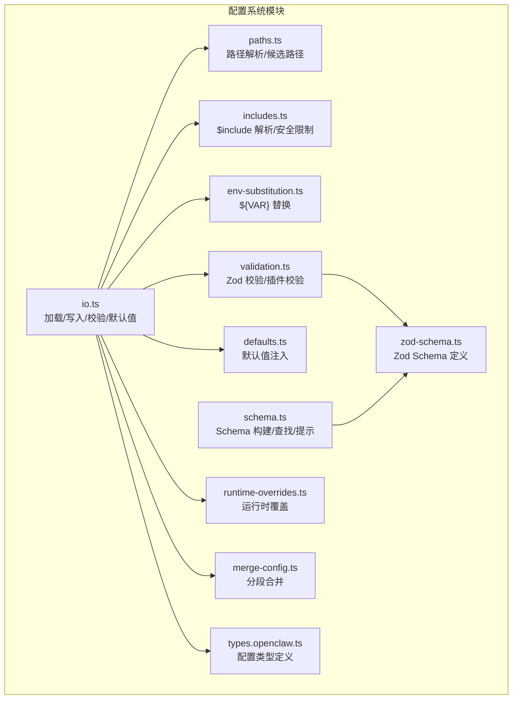
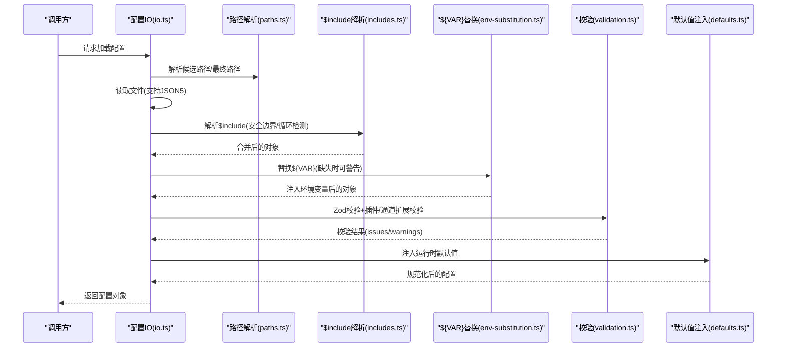
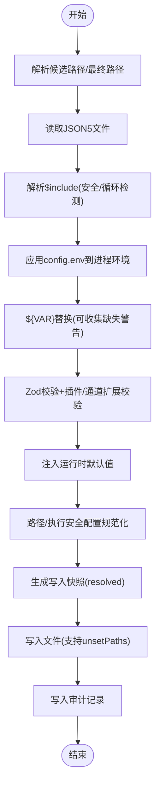
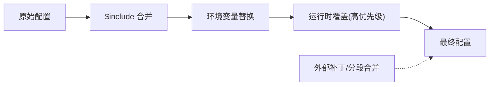
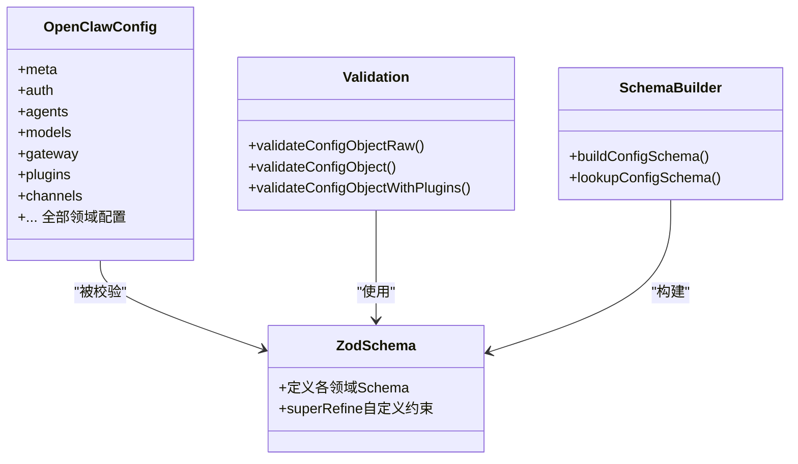
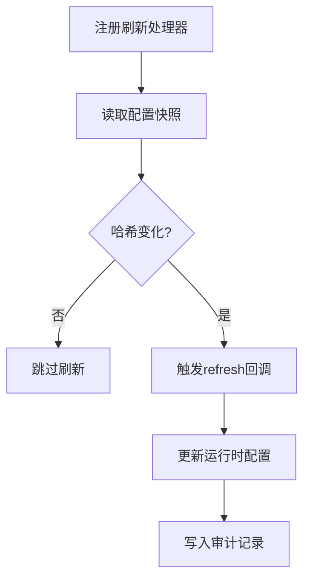
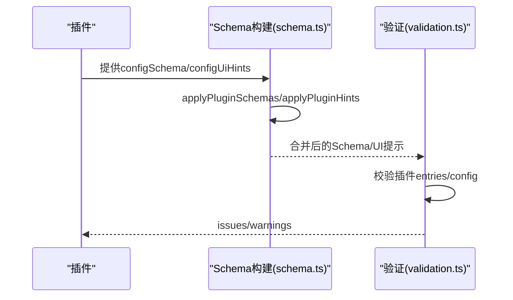
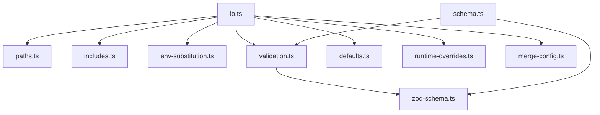

# 配置系统架构

<cite>
**本文档引用的文件**
- [src/config/config.ts](file://src/config/config.ts)
- [src/config/io.ts](file://src/config/io.ts)
- [src/config/paths.ts](file://src/config/paths.ts)
- [src/config/includes.ts](file://src/config/includes.ts)
- [src/config/env-substitution.ts](file://src/config/env-substitution.ts)
- [src/config/validation.ts](file://src/config/validation.ts)
- [src/config/schema.ts](file://src/config/schema.ts)
- [src/config/zod-schema.ts](file://src/config/zod-schema.ts)
- [src/config/defaults.ts](file://src/config/defaults.ts)
- [src/config/runtime-overrides.ts](file://src/config/runtime-overrides.ts)
- [src/config/merge-config.ts](file://src/config/merge-config.ts)
- [src/config/types.openclaw.ts](file://src/config/types.openclaw.ts)
</cite>

## 目录

1. [简介](#简介)
2. [项目结构](#项目结构)
3. [核心组件](#核心组件)
4. [架构总览](#架构总览)
5. [详细组件分析](#详细组件分析)
6. [依赖关系分析](#依赖关系分析)
7. [性能考量](#性能考量)
8. [故障排查指南](#故障排查指南)
9. [结论](#结论)
10. [附录](#附录)

## 简介

本文件系统性阐述 OpenClaw 配置系统的整体设计与实现，覆盖配置文件的加载顺序、合并策略与优先级规则；配置验证机制、类型系统与 Schema 定义；配置热重载、缓存策略与性能优化；以及扩展点与自定义配置项的实现方法。目标是帮助开发者在不深入源码的情况下也能理解并正确使用与扩展配置系统。

## 项目结构

OpenClaw 的配置系统主要位于 src/config 目录下，采用模块化设计，职责清晰：

- 加载与读取：负责解析 JSON5、处理 $include、环境变量替换、路径解析与候选路径选择
- 合并与默认值：负责深度合并、运行时默认值注入、模型与代理等默认策略
- 验证与 Schema：基于 Zod 的强类型校验，结合插件与通道扩展的 Schema
- 运行时覆盖：支持通过命令行或 API 对配置进行临时覆盖
- 模式与提示：生成可交互 UI 使用的 Schema 与 UI 提示信息

**图表来源**

- [src/config/io.ts:1-1528](file://src/config/io.ts#L1-L1528)
- [src/config/paths.ts:1-285](file://src/config/paths.ts#L1-L285)
- [src/config/includes.ts:1-347](file://src/config/includes.ts#L1-L347)
- [src/config/env-substitution.ts:1-204](file://src/config/env-substitution.ts#L1-L204)
- [src/config/validation.ts:1-605](file://src/config/validation.ts#L1-L605)
- [src/config/schema.ts:1-712](file://src/config/schema.ts#L1-L712)
- [src/config/zod-schema.ts:1-911](file://src/config/zod-schema.ts#L1-L911)
- [src/config/defaults.ts:1-537](file://src/config/defaults.ts#L1-L537)
- [src/config/runtime-overrides.ts:1-92](file://src/config/runtime-overrides.ts#L1-L92)
- [src/config/merge-config.ts:1-39](file://src/config/merge-config.ts#L1-L39)
- [src/config/types.openclaw.ts:1-155](file://src/config/types.openclaw.ts#L1-L155)

**章节来源**

- [src/config/config.ts:1-29](file://src/config/config.ts#L1-L29)

## 核心组件

- 配置加载器（io.ts）：统一入口，负责读取、解析、包含文件合并、环境变量替换、校验、默认值注入与路径规范化
- 路径解析器（paths.ts）：确定状态目录、配置文件候选路径与最终生效路径
- 包含解析器（includes.ts）：安全地解析 $include，支持多文件合并与循环检测
- 环境变量替换（env-substitution.ts）：对字符串中的 ${VAR} 进行替换，支持缺失时警告或抛错
- 验证器（validation.ts）：基于 Zod 的强类型校验，并扩展插件与通道的 Schema 校验
- Schema 构建（schema.ts）：构建基础 Schema 并融合插件/通道扩展，生成 UI 友好的提示
- 默认值注入（defaults.ts）：按需注入模型、会话、代理、日志等默认值
- 运行时覆盖（runtime-overrides.ts）：在不修改持久化配置的前提下临时覆盖某些键值
- 分段合并（merge-config.ts）：对特定子配置进行分段合并与 unset 处理
- 类型定义（types.openclaw.ts）：定义 OpenClawConfig 的完整类型结构

**章节来源**

- [src/config/io.ts:1-1528](file://src/config/io.ts#L1-L1528)
- [src/config/paths.ts:1-285](file://src/config/paths.ts#L1-L285)
- [src/config/includes.ts:1-347](file://src/config/includes.ts#L1-L347)
- [src/config/env-substitution.ts:1-204](file://src/config/env-substitution.ts#L1-L204)
- [src/config/validation.ts:1-605](file://src/config/validation.ts#L1-L605)
- [src/config/schema.ts:1-712](file://src/config/schema.ts#L1-L712)
- [src/config/zod-schema.ts:1-911](file://src/config/zod-schema.ts#L1-L911)
- [src/config/defaults.ts:1-537](file://src/config/defaults.ts#L1-L537)
- [src/config/runtime-overrides.ts:1-92](file://src/config/runtime-overrides.ts#L1-L92)
- [src/config/merge-config.ts:1-39](file://src/config/merge-config.ts#L1-L39)
- [src/config/types.openclaw.ts:1-155](file://src/config/types.openclaw.ts#L1-L155)

## 架构总览

配置系统遵循“先解析，后校验，再注入默认值”的流水线式处理。加载阶段支持多层合并（包含文件、环境变量、运行时覆盖），并在写回时避免泄漏运行时默认值。

**图表来源**

- [src/config/io.ts:708-804](file://src/config/io.ts#L708-L804)
- [src/config/paths.ts:118-194](file://src/config/paths.ts#L118-L194)
- [src/config/includes.ts:340-347](file://src/config/includes.ts#L340-L347)
- [src/config/env-substitution.ts:197-203](file://src/config/env-substitution.ts#L197-L203)
- [src/config/validation.ts:229-286](file://src/config/validation.ts#L229-L286)
- [src/config/defaults.ts:213-347](file://src/config/defaults.ts#L213-L347)

## 详细组件分析

### 配置加载与写入流程

- 加载顺序
  1. 解析候选路径：优先使用已存在的配置文件，否则回退到规范路径
  2. 读取原始内容（JSON5）
  3. 解析 $include，支持数组合并与安全边界检查
  4. 应用 env 变量（在替换前先应用 config.env 到进程环境）
  5. 执行 ${VAR} 替换，缺失时可记录警告
  6. 校验（Zod + 插件/通道扩展）
  7. 注入默认值（模型、代理、会话、日志等）
  8. 路径与执行安全配置规范化
- 写入策略
  - 写回时使用“解析快照”（resolved 字段），避免将运行时默认值写入文件
  - 支持 unsetPaths 在写入时从持久化负载中移除指定路径
  - 写入审计：记录写入事件、前后哈希、大小变化等

**图表来源**

- [src/config/io.ts:708-804](file://src/config/io.ts#L708-L804)
- [src/config/paths.ts:118-194](file://src/config/paths.ts#L118-L194)
- [src/config/includes.ts:340-347](file://src/config/includes.ts#L340-L347)
- [src/config/env-substitution.ts:197-203](file://src/config/env-substitution.ts#L197-L203)
- [src/config/validation.ts:229-286](file://src/config/validation.ts#L229-L286)
- [src/config/defaults.ts:213-347](file://src/config/defaults.ts#L213-L347)

**章节来源**

- [src/config/io.ts:708-804](file://src/config/io.ts#L708-L804)
- [src/config/paths.ts:118-194](file://src/config/paths.ts#L118-L194)
- [src/config/includes.ts:340-347](file://src/config/includes.ts#L340-L347)
- [src/config/env-substitution.ts:197-203](file://src/config/env-substitution.ts#L197-L203)
- [src/config/validation.ts:229-286](file://src/config/validation.ts#L229-L286)
- [src/config/defaults.ts:213-347](file://src/config/defaults.ts#L213-L347)

### 配置合并策略与优先级

- $include 合并
  - 支持单文件与数组多文件合并
  - 数组合并时按顺序依次深合并，后读取的同名键覆盖前者
  - 严格的安全边界：禁止逃逸到配置目录之外，防止符号链接绕过
- 环境变量替换
  - ${VAR} 替换在包含解析之后进行
  - 缺失时可选择抛错或保留占位符并发出警告
- 运行时覆盖
  - 通过 setConfigOverride/unsetConfigOverride 设置临时覆盖
  - applyConfigOverrides 将覆盖树与配置进行深合并，覆盖优先级高于配置文件
- 分段合并
  - mergeConfigSection 支持对特定子配置进行分段合并，并可选择将 undefined 映射为 unset

**图表来源**

- [src/config/includes.ts:69-85](file://src/config/includes.ts#L69-L85)
- [src/config/includes.ts:131-153](file://src/config/includes.ts#L131-L153)
- [src/config/env-substitution.ts:197-203](file://src/config/env-substitution.ts#L197-L203)
- [src/config/runtime-overrides.ts:86-91](file://src/config/runtime-overrides.ts#L86-L91)
- [src/config/merge-config.ts:8-24](file://src/config/merge-config.ts#L8-L24)

**章节来源**

- [src/config/includes.ts:69-85](file://src/config/includes.ts#L69-L85)
- [src/config/includes.ts:131-153](file://src/config/includes.ts#L131-L153)
- [src/config/env-substitution.ts:197-203](file://src/config/env-substitution.ts#L197-L203)
- [src/config/runtime-overrides.ts:86-91](file://src/config/runtime-overrides.ts#L86-L91)
- [src/config/merge-config.ts:8-24](file://src/config/merge-config.ts#L8-L24)

### 配置验证机制、类型系统与 Schema 定义

- 类型系统
  - OpenClawConfig 由 types.openclaw.ts 统一定义，涵盖 auth、agents、models、gateway、plugins、channels 等全部领域
  - 子类型分散在对应 types.\*.ts 文件中，保持模块化与可维护性
- Zod Schema
  - zod-schema.ts 定义了完整的 Zod Schema，包括模型、代理、消息、会话、钩子、网关、通道等
  - 使用 superRefine 自定义复杂约束（如 talk.provider 与 providers 的一致性）
- 验证流程
  - validateConfigObjectRaw：仅做 Zod 校验与遗留问题检测
  - validateConfigObject：在 Raw 基础上注入默认值后再返回
  - validateConfigObjectWithPlugins：扩展插件与通道的 Schema 校验，收集 issues 与 warnings
- Schema 生成与 UI 提示
  - buildConfigSchema：在基础 Schema 上融合插件与通道扩展，生成 UI 友好 Schema
  - lookupConfigSchema：按路径查找子 Schema 与 UI 提示，支持通配符匹配

**图表来源**

- [src/config/types.openclaw.ts:31-123](file://src/config/types.openclaw.ts#L31-L123)
- [src/config/zod-schema.ts:206-911](file://src/config/zod-schema.ts#L206-L911)
- [src/config/validation.ts:229-306](file://src/config/validation.ts#L229-L306)
- [src/config/schema.ts:449-484](file://src/config/schema.ts#L449-L484)

**章节来源**

- [src/config/types.openclaw.ts:1-155](file://src/config/types.openclaw.ts#L1-L155)
- [src/config/zod-schema.ts:1-911](file://src/config/zod-schema.ts#L1-L911)
- [src/config/validation.ts:229-306](file://src/config/validation.ts#L229-L306)
- [src/config/schema.ts:449-484](file://src/config/schema.ts#L449-L484)

### 配置热重载、缓存策略与性能优化

- 热重载
  - 通过 setRuntimeConfigSnapshot 与 setRuntimeConfigSnapshotRefreshHandler 注册刷新处理器
  - ConfigRuntimeRefreshError 用于标识刷新失败场景
  - 读取阶段计算快照哈希，便于增量感知与变更传播
- 缓存策略
  - Schema 构建缓存：buildMergedSchemaCacheKey 生成缓存键，限制最大缓存数量，避免内存膨胀
  - 写入审计：记录写入事件与可疑变更，便于诊断与回滚
- 性能优化
  - $include 安全读取：使用边界文件打开限制最大字节数与硬链接检测
  - 环境变量替换：仅在包含解析后进行，减少重复遍历
  - 默认值注入：按需注入，避免不必要的对象复制

**图表来源**

- [src/config/io.ts:144-158](file://src/config/io.ts#L144-L158)
- [src/config/io.ts:296-310](file://src/config/io.ts#L296-L310)
- [src/config/schema.ts:398-406](file://src/config/schema.ts#L398-L406)

**章节来源**

- [src/config/io.ts:144-158](file://src/config/io.ts#L144-L158)
- [src/config/io.ts:296-310](file://src/config/io.ts#L296-L310)
- [src/config/schema.ts:398-406](file://src/config/schema.ts#L398-L406)

### 扩展点与自定义配置项

- 插件扩展
  - 通过 validateConfigObjectWithPlugins 对插件 entries/config 进行 Schema 校验
  - applyPluginSchemas 将插件提供的 configSchema 融入全局 Schema
  - UI 提示：applyPluginHints 为插件配置生成标签、帮助与敏感标记
- 通道扩展
  - applyChannelSchemas 将通道配置 Schema 融入全局 Schema
  - applyChannelHints 为通道配置生成 UI 提示
- 自定义配置项
  - 在插件 manifest 中声明 configSchema 与 configUiHints
  - 通过 mergeConfigSection 对特定子配置进行分段合并与 unset 处理

**图表来源**

- [src/config/schema.ts:285-324](file://src/config/schema.ts#L285-L324)
- [src/config/schema.ts:167-208](file://src/config/schema.ts#L167-L208)
- [src/config/validation.ts:464-597](file://src/config/validation.ts#L464-L597)

**章节来源**

- [src/config/schema.ts:285-324](file://src/config/schema.ts#L285-L324)
- [src/config/schema.ts:167-208](file://src/config/schema.ts#L167-L208)
- [src/config/validation.ts:464-597](file://src/config/validation.ts#L464-L597)
- [src/config/merge-config.ts:26-39](file://src/config/merge-config.ts#L26-L39)

## 依赖关系分析

配置系统内部模块耦合度低，职责清晰：

- io.ts 作为门面，协调 paths、includes、env-substitution、validation、defaults、runtime-overrides、merge-config、types
- schema.ts 依赖 zod-schema.ts 生成 Schema，并与 UI 提示系统协作
- validation.ts 依赖 zod-schema.ts 与插件/通道注册表进行扩展校验

**图表来源**

- [src/config/io.ts:1-1528](file://src/config/io.ts#L1-L1528)
- [src/config/schema.ts:1-712](file://src/config/schema.ts#L1-L712)
- [src/config/zod-schema.ts:1-911](file://src/config/zod-schema.ts#L1-L911)
- [src/config/validation.ts:1-605](file://src/config/validation.ts#L1-L605)

**章节来源**

- [src/config/io.ts:1-1528](file://src/config/io.ts#L1-L1528)
- [src/config/schema.ts:1-712](file://src/config/schema.ts#L1-L712)
- [src/config/zod-schema.ts:1-911](file://src/config/zod-schema.ts#L1-L911)
- [src/config/validation.ts:1-605](file://src/config/validation.ts#L1-L605)

## 性能考量

- I/O 安全读取：$include 文件读取使用边界文件打开，限制最大字节数与硬链接检测，避免异常文件导致的性能与安全问题
- 缓存命中：Schema 构建采用缓存键与容量上限控制，降低重复构建开销
- 快照哈希：通过 resolveConfigSnapshotHash 计算 SHA256，便于增量判断与最小化刷新范围
- 默认值注入：按需注入，避免对未使用的配置分支进行无谓处理

[本节为通用指导，无需具体文件分析]

## 故障排查指南

- 常见错误
  - 缺失环境变量：MissingEnvVarError，可通过 onMissing 回调收集警告
  - 循环包含：CircularIncludeError，检查 $include 链路
  - 路径逃逸：Include 路径超出配置根目录或符号链接绕过，系统会拒绝
  - 校验失败：validateConfigObjectWithPlugins 返回 issues 与 warnings，按路径定位
- 建议排查步骤
  - 检查配置文件是否存在与可读
  - 查看 $include 是否存在循环或越界
  - 校验 ${VAR} 是否设置或是否应保留占位符
  - 使用 validateConfigObjectRaw 获取最小化校验结果，逐步定位问题
  - 查看写入审计日志以确认写入行为与可疑变更

**章节来源**

- [src/config/env-substitution.ts:29-37](file://src/config/env-substitution.ts#L29-L37)
- [src/config/includes.ts:58-63](file://src/config/includes.ts#L58-L63)
- [src/config/includes.ts:197-222](file://src/config/includes.ts#L197-L222)
- [src/config/validation.ts:308-310](file://src/config/validation.ts#L308-L310)
- [src/config/io.ts:541-555](file://src/config/io.ts#L541-L555)

## 结论

OpenClaw 配置系统通过模块化的加载、合并、校验与默认值注入流程，提供了安全、可扩展且高性能的配置管理能力。其基于 Zod 的强类型校验与 Schema 动态融合机制，使得插件与通道能够无缝扩展配置域。配合热重载、缓存与审计机制，系统在开发与生产环境中均具备良好的可用性与可观测性。

## 附录

- 关键导出接口（来自 config.ts）
  - 加载与写入：loadConfig、readConfigFileSnapshot、writeConfigFile、readBestEffortConfig
  - 快照与刷新：getRuntimeConfigSnapshot、setRuntimeConfigSnapshot、setRuntimeConfigSnapshotRefreshHandler、clearRuntimeConfigSnapshot
  - 校验：validateConfigObject、validateConfigObjectRaw、validateConfigObjectWithPlugins、validateConfigObjectRawWithPlugins
  - 路径与覆盖：resolveConfigPath、getConfigOverrides、setConfigOverride、unsetConfigOverride
  - 工具：parseConfigJson5、resolveConfigSnapshotHash、projectConfigOntoRuntimeSourceSnapshot

**章节来源**

- [src/config/config.ts:1-29](file://src/config/config.ts#L1-L29)
