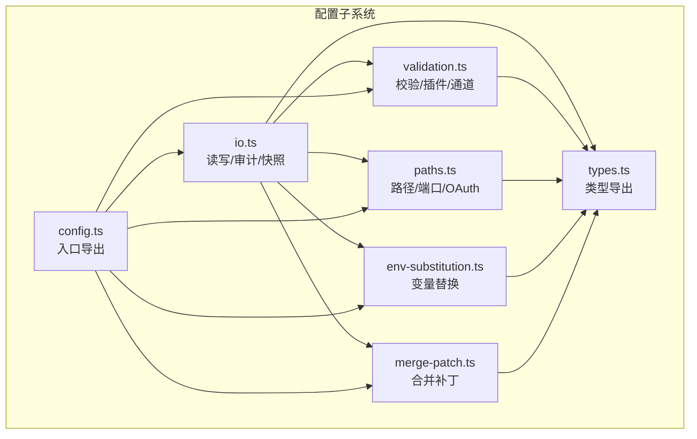
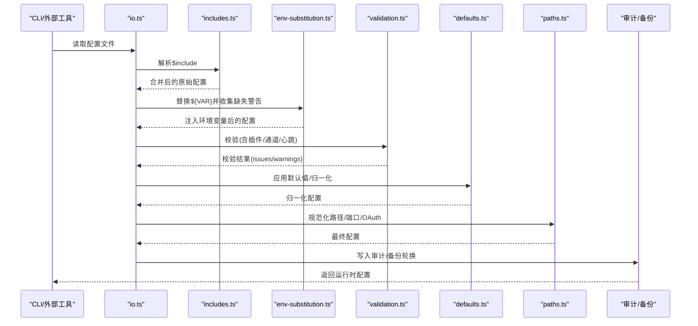
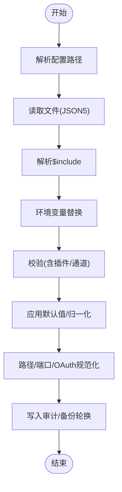
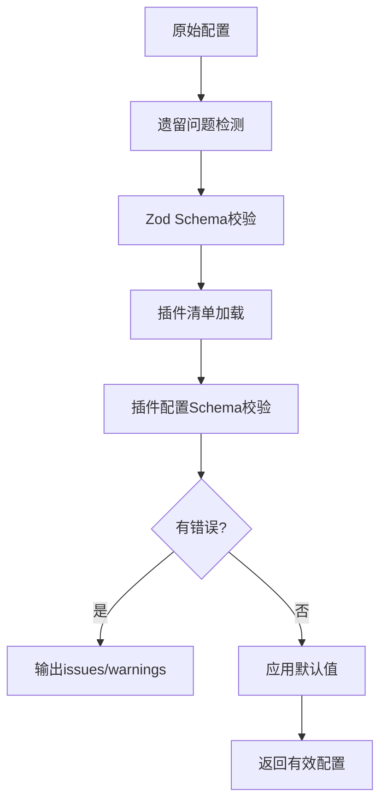
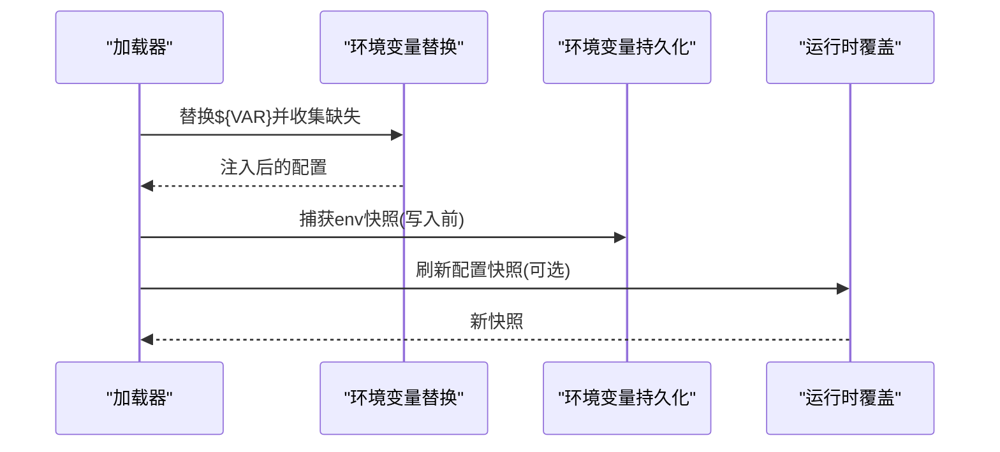
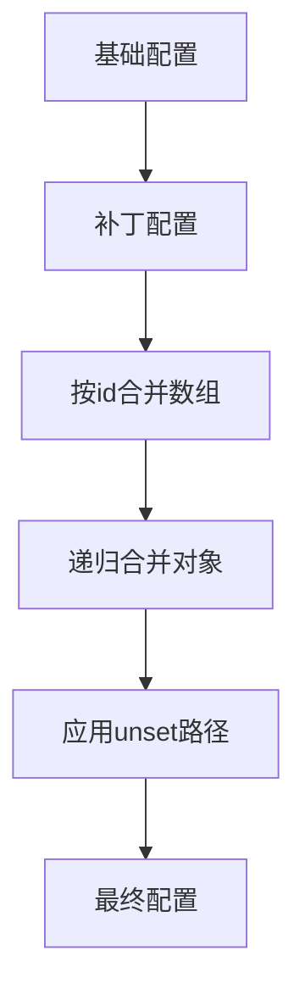
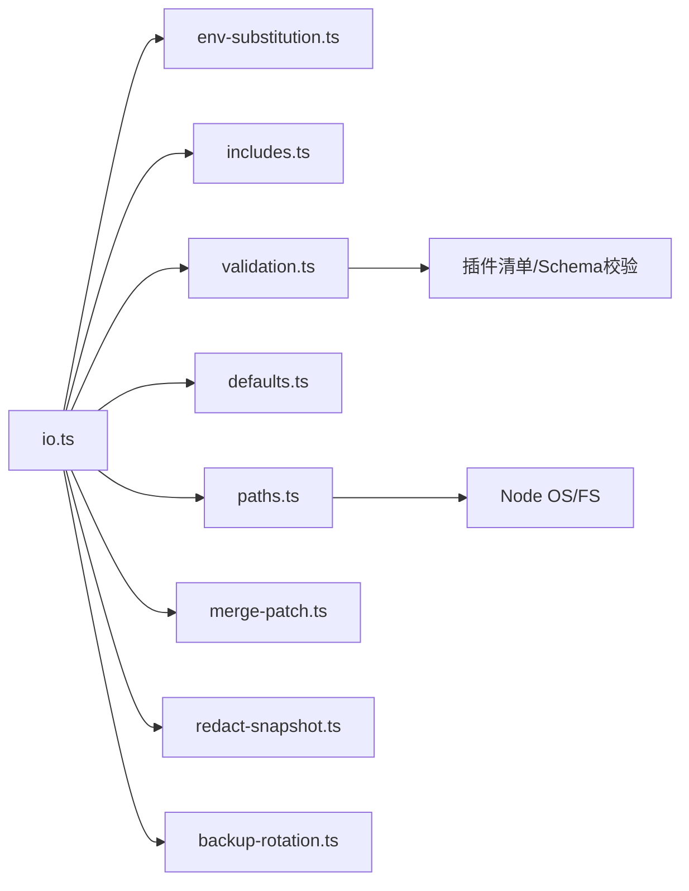

# 高级配置场景

<cite>
**本文引用的文件**   
- [src/config/io.ts](file://src/config/io.ts)
- [src/config/validation.ts](file://src/config/validation.ts)
- [src/config/paths.ts](file://src/config/paths.ts)
- [src/config/env-substitution.ts](file://src/config/env-substitution.ts)
- [src/config/merge-patch.ts](file://src/config/merge-patch.ts)
- [src/config/types.ts](file://src/config/types.ts)
- [src/config/config.ts](file://src/config/config.ts)
- [src/config/legacy-migrate.ts](file://src/config/legacy-migrate.ts)
- [src/config/redact-snapshot.ts](file://src/config/redact-snapshot.ts)
- [src/config/includes.ts](file://src/config/includes.ts)
- [src/config/env-vars.ts](file://src/config/env-vars.ts)
- [src/config/runtime-overrides.ts](file://src/config/runtime-overrides.ts)
- [src/config/defaults.ts](file://src/config/defaults.ts)
- [src/config/normalize-paths.ts](file://src/config/normalize-paths.ts)
- [src/config/normalize-exec-safe-bin.ts](file://src/config/normalize-exec-safe-bin.ts)
- [src/config/backup-rotation.ts](file://src/config/backup-rotation.ts)
- [src/config/logging.ts](file://src/config/logging.ts)
- [src/config/talk.ts](file://src/config/talk.ts)
- [src/config/sessions.ts](file://src/config/sessions.ts)
- [src/config/plugin-auto-enable.ts](file://src/config/plugin-auto-enable.ts)
- [src/config/plugins-allowlist.ts](file://src/config/plugins-allowlist.ts)
- [src/config/group-policy.ts](file://src/config/group-policy.ts)
- [src/config/env-preserve.ts](file://src/config/env-preserve.ts)
- [src/config/env-preserve-io.ts](file://src/config/env-preserve-io.ts)
- [src/config/env-preserve.test.ts](file://src/config/env-preserve.test.ts)
- [src/config/env-preserve-io.test.ts](file://src/config/env-preserve-io.test.ts)
- [src/config/env-preserve.test-helpers.ts](file://src/config/env-preserve.test-helpers.ts)
- [src/config/env-preserve-io.test-helpers.ts](file://src/config/env-preserve-io.test-helpers.ts)
- [src/config/env-preserve-io.validation-fails-closed.test.ts](file://src/config/env-preserve-io.validation-fails-closed.test.ts)
- [src/config/env-preserve-io.write-config.test.ts](file://src/config/env-preserve-io.write-config.test.ts)
- [src/config/env-preserve-io.runtime-snapshot-write.test.ts](file://src/config/env-preserve-io.runtime-snapshot-write.test.ts)
- [src/config/env-preserve-io.eacces.test.ts](file://src/config/env-preserve-io.eacces.test.ts)
- [src/config/env-preserve-io.compat.test.ts](file://src/config/env-preserve-io.compat.test.ts)
- [src/config/env-preserve-io.validation-fails-closed.test.ts](file://src/config/env-preserve-io.validation-fails-closed.test.ts)
- [src/config/env-preserve-io.write-config.test.ts](file://src/config/env-preserve-io.write-config.test.ts)
- [src/config/env-preserve-io.runtime-snapshot-write.test.ts](file://src/config/env-preserve-io.runtime-snapshot-write.test.ts)
- [src/config/env-preserve-io.eacces.test.ts](file://src/config/env-preserve-io.eacces.test.ts)
- [src/config/env-preserve-io.compat.test.ts](file://src/config/env-preserve-io.compat.test.ts)
- [src/config/env-preserve-io.validation-fails-closed.test.ts](file://src/config/env-preserve-io.validation-fails-closed.test.ts)
- [src/config/env-preserve-io.write-config.test.ts](file://src/config/env-preserve-io.write-config.test.ts)
- [src/config/env-preserve-io.runtime-snapshot-write.test.ts](file://src/config/env-preserve-io.runtime-snapshot-write.test.ts)
- [src/config/env-preserve-io.eacces.test.ts](file://src/config/env-preserve-io.eacces.test.ts)
- [src/config/env-preserve-io.compat.test.ts](file://src/config/env-preserve-io.compat.test.ts)
- [src/config/env-preserve-io.validation-fails-closed.test.ts](file://src/config/env-preserve-io.validation-fails-closed.test.ts)
- [src/config/env-preserve-io.write-config.test.ts](file://src/config/env-preserve-io.write-config.test.ts)
- [src/config/env-preserve-io.runtime-snapshot-write.test.ts](file://src/config/env-preserve-io.runtime-snapshot-write.test.ts)
- [src/config/env-preserve-io.eacces.test.ts](file://src/config/env-preserve-io.eacces.test.ts)
- [src/config/env-preserve-io.compat.test.ts](file://src/config/env-preserve-io.compat.test.ts)
- [src/config/env-preserve-io.validation-fails-closed.test.ts](file://src/config/env-preserve-io.validation-fails-closed.test.ts)
- [src/config/env-preserve-io.write-config.test.ts](file://src/config/env-preserve-io.write-config.test.ts)
- [src/config/env-preserve-io.runtime-snapshot-write.test.ts](file://src/config/env-preserve-io.runtime-snapshot-write.test.ts)
- [src/config/env-preserve-io.eacces.test.ts](file://src/config/env-preserve-io.eacces.test.ts)
- [src/config/env-preserve-io.compat.test.ts](file://src/config/env-preserve-io.compat.test.ts)
- [src/config/env-preserve-io.validation-fails-closed.test.ts](file://src/config/env-preserve-io.validation-fails-closed.test.ts)
- [src/config/env-preserve-io.write-config.test.ts](file://src/config/env-preserve-io.write-config.test.ts)
- [src/config/env-preserve-io.runtime-snapshot-write.test.ts](file://src/config/env-preserve-io.runtime-snapshot-write.test.ts)
- [src/config/env-preserve-io.eacces.test.ts](file://src/config/env-preserve-io.eacces.test.ts)
- [src/config/env-preserve-io.compat.test.ts](file://src/config/env-preserve-io.compat.test.ts)
- [src/config/env-preserve-io.validation-fails-closed.test.ts](file://src/config/env-preserve-io.validation-fails-closed.test.ts)
- [src/config/env-preserve-io.write-config.test.ts](file://src/config/env-preserve-io.write-config.test.ts)
- [src/config/env-preserve-io.runtime-snapshot-write.test.ts](file://src/config/env-preserve-io.runtime-snapshot-write.test.ts)
- [src/config/env-preserve-io.eacces.test.ts](file://src/config/env-preserve-io.eacces.test.ts)
- [......继续阅读以获取所有引用的文件列表（此处省略部分测试文件）]
</cite>

## 目录

1. [简介](#简介)
2. [项目结构](#项目结构)
3. [核心组件](#核心组件)
4. [架构总览](#架构总览)
5. [详细组件分析](#详细组件分析)
6. [依赖关系分析](#依赖关系分析)
7. [性能考量](#性能考量)
8. [故障排除指南](#故障排除指南)
9. [结论](#结论)
10. [附录](#附录)

## 简介

本指南面向需要在OpenClaw中实施高级配置场景的工程团队，覆盖多租户部署、混合云架构与高可用配置的实战方案。内容围绕配置模板化、变量替换、条件配置、版本管理、环境隔离、配置同步、安全与权限控制、审计日志、故障排除、性能调优与运维监控等主题展开，并提供可直接落地的步骤与最佳实践。

## 项目结构

OpenClaw的配置子系统由“解析-校验-归一化-持久化-审计”五层构成，核心位于src/config目录，包含路径解析、环境变量替换、合并补丁、默认值应用、插件校验、会话与日志配置、备份轮换、安全脱敏等模块。整体采用分层设计：上层负责对外API与CLI集成，中层负责业务规则与校验，底层负责文件系统与运行时快照。

图表来源

- [src/config/io.ts:1-1528](file://src/config/io.ts#L1-L1528)
- [src/config/validation.ts:1-605](file://src/config/validation.ts#L1-L605)
- [src/config/paths.ts:1-285](file://src/config/paths.ts#L1-L285)
- [src/config/env-substitution.ts:1-204](file://src/config/env-substitution.ts#L1-L204)
- [src/config/merge-patch.ts:1-98](file://src/config/merge-patch.ts#L1-L98)
- [src/config/types.ts:1-36](file://src/config/types.ts#L1-L36)
- [src/config/config.ts:1-29](file://src/config/config.ts#L1-L29)

章节来源

- [src/config/config.ts:1-29](file://src/config/config.ts#L1-L29)
- [src/config/types.ts:1-36](file://src/config/types.ts#L1-L36)

## 核心组件

- 配置读写与审计：支持JSON5解析、包含文件、环境变量替换、合并补丁、运行时快照、配置写入审计记录与备份轮换。
- 配置校验：基于Zod Schema与插件清单进行强类型校验，支持通道合法性、心跳目标、插件存在性与schema有效性检查。
- 路径与端口：统一解析状态目录、配置文件路径、OAuth存储路径、网关端口，默认端口与优先级策略。
- 变量替换：支持`${VAR}`语法，严格命名规范，支持转义与缺失处理回调。
- 合并补丁：对对象数组按id合并，避免全量替换破坏性风险。
- 类型体系：集中导出各领域类型，便于CLI与文档生成。
- 安全与脱敏：写入前对敏感字段进行脱敏处理，审计日志记录变更上下文。

章节来源

- [src/config/io.ts:1-1528](file://src/config/io.ts#L1-L1528)
- [src/config/validation.ts:1-605](file://src/config/validation.ts#L1-L605)
- [src/config/paths.ts:1-285](file://src/config/paths.ts#L1-L285)
- [src/config/env-substitution.ts:1-204](file://src/config/env-substitution.ts#L1-L204)
- [src/config/merge-patch.ts:1-98](file://src/config/merge-patch.ts#L1-L98)
- [src/config/types.ts:1-36](file://src/config/types.ts#L1-L36)

## 架构总览

下图展示从配置文件到运行时配置的关键流程：解析→包含→变量替换→校验→默认值应用→路径规范化→写入审计与备份。

图表来源

- [src/config/io.ts:708-800](file://src/config/io.ts#L708-L800)
- [src/config/validation.ts:229-286](file://src/config/validation.ts#L229-L286)
- [src/config/paths.ts:118-192](file://src/config/paths.ts#L118-L192)
- [src/config/env-substitution.ts:197-203](file://src/config/env-substitution.ts#L197-L203)
- [src/config/merge-patch.ts:62-97](file://src/config/merge-patch.ts#L62-L97)

## 详细组件分析

### 组件A：配置读取与写入（含审计）

- 功能要点
  - 支持多候选路径解析与历史兼容。
  - 包含文件解析与安全边界检查。
  - 环境变量替换与缺失告警。
  - 校验失败时保留原始占位符或抛出错误。
  - 写入审计：记录进程信息、变更前后哈希、字节数、网关模式变化、可疑原因等。
  - 备份轮换：写入前后自动维护配置备份。
- 关键流程
  - 读取：解析候选路径→读取→JSON5解析→包含解析→变量替换→校验→默认值→路径规范化→去重检查→注入环境变量→返回运行时配置。
  - 写入：收集变更路径→应用unset路径→生成合并补丁→写入文件→追加审计日志→备份轮换。
- 安全与合规
  - 审计日志独立文件，权限限制为仅属主可读写。
  - 敏感字段脱敏后写入，防止明文泄露。
  - 对包含文件与路径进行安全检查，避免越界访问。

图表来源

- [src/config/io.ts:708-800](file://src/config/io.ts#L708-L800)
- [src/config/redact-snapshot.ts:1-200](file://src/config/redact-snapshot.ts#L1-L200)
- [src/config/backup-rotation.ts:1-200](file://src/config/backup-rotation.ts#L1-L200)

章节来源

- [src/config/io.ts:1-1528](file://src/config/io.ts#L1-L1528)
- [src/config/redact-snapshot.ts:1-200](file://src/config/redact-snapshot.ts#L1-L200)
- [src/config/backup-rotation.ts:1-200](file://src/config/backup-rotation.ts#L1-L200)

### 组件B：配置校验与插件生态

- 功能要点
  - 基于Zod Schema的强类型校验。
  - 插件清单加载与schema校验，未知插件告警而非致命错误。
  - 通道合法性、心跳目标、身份头像路径范围检查。
  - 兼容遗留配置问题检测与提示。
- 实施建议
  - 在CI中执行“校验+插件schema校验”，确保配置与插件版本匹配。
  - 使用“原始校验”与“应用默认校验”两种模式分别用于读取与写回。

图表来源

- [src/config/validation.ts:229-286](file://src/config/validation.ts#L229-L286)
- [src/config/validation.ts:308-407](file://src/config/validation.ts#L308-L407)

章节来源

- [src/config/validation.ts:1-605](file://src/config/validation.ts#L1-L605)

### 组件C：环境变量替换与运行时覆盖

- 功能要点
  - 支持`${VAR}`与`$${}`转义，严格大写命名规范。
  - 缺失变量可选择抛错或发出警告并保留占位符。
  - 运行时覆盖机制：在不重启情况下刷新配置快照。
  - 环境变量持久化与恢复：写入时捕获快照，写回时可恢复占位符。
- 高级用法
  - 将API密钥、令牌等敏感信息通过环境变量注入，避免硬编码。
  - 使用“预期配置路径”参数确保写回一致性。

图表来源

- [src/config/env-substitution.ts:197-203](file://src/config/env-substitution.ts#L197-L203)
- [src/config/env-preserve.ts:1-200](file://src/config/env-preserve.ts#L1-L200)
- [src/config/runtime-overrides.ts:1-200](file://src/config/runtime-overrides.ts#L1-L200)

章节来源

- [src/config/env-substitution.ts:1-204](file://src/config/env-substitution.ts#L1-L204)
- [src/config/env-preserve.ts:1-200](file://src/config/env-preserve.ts#L1-L200)
- [src/config/runtime-overrides.ts:1-200](file://src/config/runtime-overrides.ts#L1-L200)

### 组件D：合并补丁与条件配置

- 功能要点
  - 对象数组按id合并，避免全量替换破坏性风险。
  - 支持嵌套对象递归合并。
  - 提供“unset路径”能力，允许在写回时显式移除某些字段。
- 实战建议
  - 使用合并补丁进行增量更新，减少误操作。
  - 在模板中使用条件逻辑（如通过环境变量控制启用/禁用），结合unset路径清理不需要的字段。

图表来源

- [src/config/merge-patch.ts:62-97](file://src/config/merge-patch.ts#L62-L97)

章节来源

- [src/config/merge-patch.ts:1-98](file://src/config/merge-patch.ts#L1-L98)

### 组件E：路径解析与端口管理

- 功能要点
  - 统一解析状态目录、配置文件路径、OAuth目录与文件路径。
  - 支持历史兼容目录与文件名。
  - 端口解析优先级：环境变量→配置→默认端口。
- 多租户与混合云实践
  - 通过环境变量隔离不同租户的状态目录与配置路径。
  - 在容器/云环境中通过环境变量覆盖默认路径，实现无状态部署。

章节来源

- [src/config/paths.ts:1-285](file://src/config/paths.ts#L1-L285)

### 组件F：会话、日志与备份

- 会话与日志：集中管理会话生命周期、日志级别与输出位置。
- 备份轮换：写入前后自动维护配置备份，防止误操作导致不可恢复损失。

章节来源

- [src/config/sessions.ts:1-200](file://src/config/sessions.ts#L1-L200)
- [src/config/logging.ts:1-200](file://src/config/logging.ts#L1-L200)
- [src/config/backup-rotation.ts:1-200](file://src/config/backup-rotation.ts#L1-L200)

## 依赖关系分析

- 模块耦合
  - io.ts是核心枢纽，依赖env-substitution、includes、validation、defaults、paths、merge-patch、redact-snapshot、backup-rotation等。
  - validation.ts依赖插件清单与schema校验器，以及通道与心跳目标的合法性检查。
  - paths.ts为全局路径与端口提供单点解析。
- 外部依赖
  - JSON5解析、Node FS、OS、路径解析与版本比较等。
- 循环依赖
  - 未发现循环依赖迹象；各模块职责清晰，接口稳定。

图表来源

- [src/config/io.ts:1-1528](file://src/config/io.ts#L1-L1528)
- [src/config/validation.ts:1-605](file://src/config/validation.ts#L1-L605)
- [src/config/paths.ts:1-285](file://src/config/paths.ts#L1-L285)

章节来源

- [src/config/io.ts:1-1528](file://src/config/io.ts#L1-L1528)
- [src/config/validation.ts:1-605](file://src/config/validation.ts#L1-L605)
- [src/config/paths.ts:1-285](file://src/config/paths.ts#L1-L285)

## 性能考量

- I/O优化
  - 合理使用合并补丁减少全量写入，降低磁盘压力。
  - 审计日志异步写入，避免阻塞主流程。
- 校验与默认值
  - 将默认值应用与路径规范化前置，减少运行时重复计算。
  - 在CI中提前执行校验，缩短启动时间。
- 并发与缓存
  - 插件清单与schema校验结果可缓存，避免重复加载。
  - 会话与日志配置按需初始化，避免不必要的开销。

## 故障排除指南

- 常见问题定位
  - 配置无效：检查校验issues与warnings，关注通道、心跳目标、插件存在性与schema有效性。
  - 环境变量缺失：查看缺失变量告警，确认是否应转义或提供默认值。
  - 路径越界：核对包含文件与路径解析规则，确保在允许范围内。
  - 写入失败：检查审计日志中的错误码与可疑原因，必要时回滚备份。
- 排障步骤
  - 使用“原始校验”快速定位schema问题。
  - 使用“应用默认校验”验证归一化后的配置。
  - 通过审计日志比对变更前后差异，定位具体修改项。
  - 使用unset路径功能清理异常字段，再重新写入。

章节来源

- [src/config/validation.ts:229-286](file://src/config/validation.ts#L229-L286)
- [src/config/env-substitution.ts:197-203](file://src/config/env-substitution.ts#L197-L203)
- [src/config/io.ts:541-555](file://src/config/io.ts#L541-L555)

## 结论

通过将配置解析、校验、归一化、持久化与审计形成闭环，OpenClaw为复杂场景提供了稳健的基础设施。结合环境变量替换、合并补丁、路径与端口管理、备份轮换与审计日志，团队可在多租户、混合云与高可用环境下实现安全、可控、可观测的配置管理。

## 附录

### 多租户部署最佳实践

- 使用环境变量隔离状态目录与配置路径，确保租户间数据隔离。
- 通过运行时覆盖机制在不重启情况下切换租户配置。
- 对敏感信息使用环境变量注入，配合脱敏与审计日志。

章节来源

- [src/config/paths.ts:60-89](file://src/config/paths.ts#L60-L89)
- [src/config/env-preserve.ts:1-200](file://src/config/env-preserve.ts#L1-L200)
- [src/config/redact-snapshot.ts:1-200](file://src/config/redact-snapshot.ts#L1-L200)

### 混合云架构与高可用配置

- 通过环境变量覆盖默认路径，适配容器/云平台无状态特性。
- 使用包含文件与条件配置，按环境动态拼装配置片段。
- 配置备份轮换与审计日志保障故障恢复与合规追溯。

章节来源

- [src/config/includes.ts:1-200](file://src/config/includes.ts#L1-L200)
- [src/config/backup-rotation.ts:1-200](file://src/config/backup-rotation.ts#L1-L200)
- [src/config/io.ts:541-555](file://src/config/io.ts#L541-L555)

### 配置版本管理与同步

- 版本戳与未来版本警告：写入时添加版本戳，避免新旧版本混用。
- 合并补丁：增量更新，减少冲突。
- CI校验：在提交阶段强制执行校验与插件schema校验。

章节来源

- [src/config/io.ts:581-607](file://src/config/io.ts#L581-L607)
- [src/config/merge-patch.ts:62-97](file://src/config/merge-patch.ts#L62-L97)
- [src/config/validation.ts:308-407](file://src/config/validation.ts#L308-L407)

### 配置安全、权限控制与审计

- 环境变量替换与转义：避免硬编码敏感信息。
- 脱敏写入：写入前对敏感字段进行脱敏处理。
- 审计日志：记录写入事件、变更前后哈希、可疑原因等。
- 权限控制：审计日志文件权限限制为仅属主可读写。

章节来源

- [src/config/env-substitution.ts:197-203](file://src/config/env-substitution.ts#L197-L203)
- [src/config/redact-snapshot.ts:1-200](file://src/config/redact-snapshot.ts#L1-L200)
- [src/config/io.ts:541-555](file://src/config/io.ts#L541-L555)

### 配置模板、变量替换与条件配置

- 模板化：将通用配置抽取为模板，按环境变量注入差异化参数。
- 变量替换：支持`${VAR}`与`$${}`转义，缺失时可选择告警或保留占位符。
- 条件配置：通过环境变量控制启用/禁用模块，结合unset路径清理不需要的字段。

章节来源

- [src/config/env-substitution.ts:1-204](file://src/config/env-substitution.ts#L1-L204)
- [src/config/merge-patch.ts:62-97](file://src/config/merge-patch.ts#L62-L97)

### 环境隔离与配置同步

- 环境隔离：通过环境变量覆盖路径与端口，实现多环境隔离。
- 配置同步：使用包含文件与合并补丁，确保多节点配置一致性。

章节来源

- [src/config/paths.ts:118-192](file://src/config/paths.ts#L118-L192)
- [src/config/includes.ts:1-200](file://src/config/includes.ts#L1-L200)
- [src/config/merge-patch.ts:62-97](file://src/config/merge-patch.ts#L62-L97)

### 运维监控与性能调优

- 审计日志：记录写入事件与变更上下文，辅助排障与审计。
- 性能调优：减少全量写入，使用合并补丁；在CI中提前校验；缓存插件清单与schema校验结果。

章节来源

- [src/config/io.ts:541-555](file://src/config/io.ts#L541-L555)
- [src/config/validation.ts:308-407](file://src/config/validation.ts#L308-L407)
