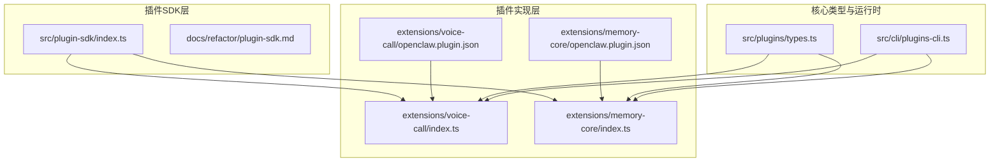
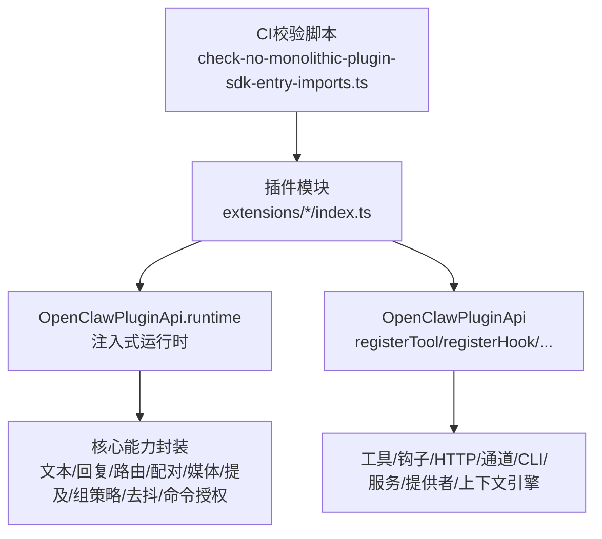
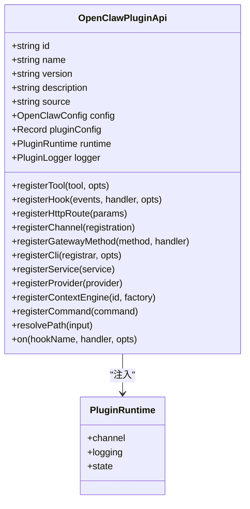
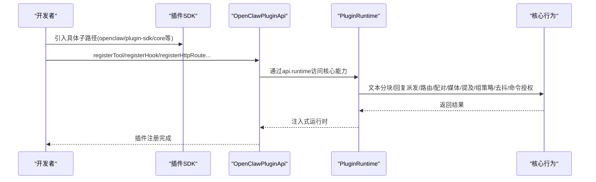
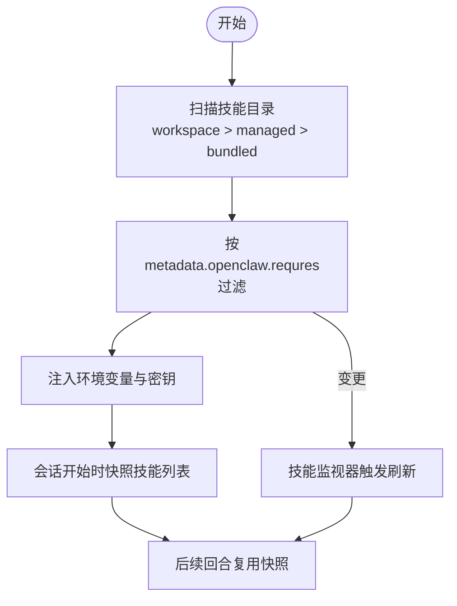
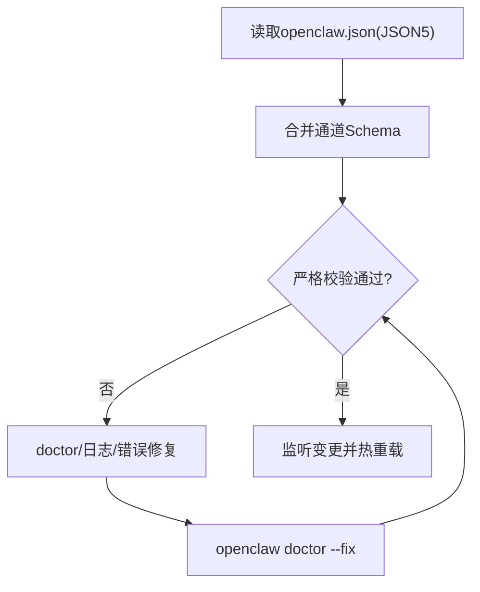
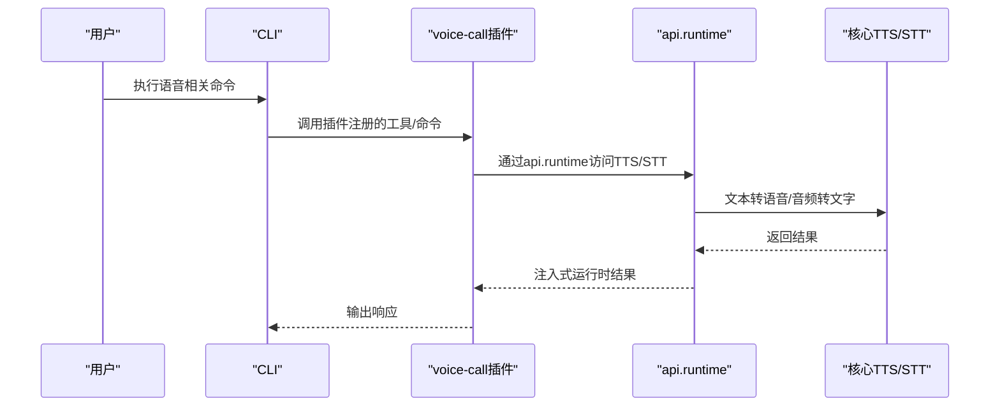
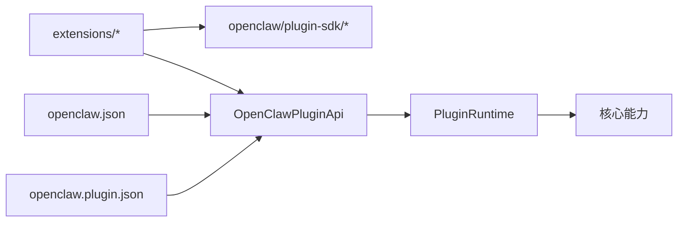

# 高级功能

<cite>
**本文引用的文件**
- [src/plugin-sdk/index.ts](file://src/plugin-sdk/index.ts)
- [docs/refactor/plugin-sdk.md](file://docs/refactor/plugin-sdk.md)
- [docs/tools/plugin.md](file://docs/tools/plugin.md)
- [docs/tools/creating-skills.md](file://docs/tools/creating-skills.md)
- [docs/tools/skills.md](file://docs/tools/skills.md)
- [docs/plugins/manifest.md](file://docs/plugins/manifest.md)
- [docs/gateway/configuration.md](file://docs/gateway/configuration.md)
- [src/plugins/types.ts](file://src/plugins/types.ts)
- [extensions/voice-call/openclaw.plugin.json](file://extensions/voice-call/openclaw.plugin.json)
- [extensions/memory-core/openclaw.plugin.json](file://extensions/memory-core/openclaw.plugin.json)
- [extensions/voice-call/index.ts](file://extensions/voice-call/index.ts)
- [extensions/memory-core/index.ts](file://extensions/memory-core/index.ts)
- [scripts/check-no-monolithic-plugin-sdk-entry-imports.ts](file://scripts/check-no-monolithic-plugin-sdk-entry-imports.ts)
- [src/cli/plugins-cli.ts](file://src/cli/plugins-cli.ts)
- [src/config/schema.ts](file://src/config/schema.ts)
- [src/config/validation.allowed-values.test.ts](file://src/config/validation.allowed-values.test.ts)
- [docs/zh-CN/refactor/plugin-sdk.md](file://docs/zh-CN/refactor/plugin-sdk.md)
</cite>

## 目录

1. [简介](#简介)
2. [项目结构](#项目结构)
3. [核心组件](#核心组件)
4. [架构总览](#架构总览)
5. [详细组件分析](#详细组件分析)
6. [依赖关系分析](#依赖关系分析)
7. [性能考量](#性能考量)
8. [故障排查指南](#故障排查指南)
9. [结论](#结论)
10. [附录](#附录)

## 简介

本文件面向希望深度扩展 OpenClaw 的高级用户与开发者，系统阐述插件开发、技能创建、自定义配置与性能优化等主题。内容覆盖：

- 插件 SDK 架构与开发流程
- 技能平台的使用与管理
- 自定义工具与命令开发
- 配置模型与严格校验
- 性能调优与大规模部署经验
- 最佳实践与常见问题排查

## 项目结构

OpenClaw 将“插件 SDK + 运行时”作为统一扩展面，所有通道适配器、工具、HTTP 路由、CLI 命令、上下文引擎与内存后端均通过插件机制接入。核心目录与职责概览：

- src/plugin-sdk：插件 SDK 汇总导出与通用类型、工具函数
- extensions：官方插件示例（如 voice-call、memory-core），展示真实开发范式
- docs：插件、技能、配置与参考文档
- src/plugins/types.ts：插件 API、钩子、工具、命令、服务等类型定义
- scripts：CI 校验脚本，强制约束插件入口对 SDK 的子路径导入

图示来源

- [src/plugin-sdk/index.ts:1-826](file://src/plugin-sdk/index.ts#L1-L826)
- [docs/refactor/plugin-sdk.md:1-215](file://docs/refactor/plugin-sdk.md#L1-L215)
- [extensions/voice-call/index.ts:1-200](file://extensions/voice-call/index.ts#L1-L200)
- [extensions/memory-core/index.ts:1-39](file://extensions/memory-core/index.ts#L1-L39)
- [extensions/voice-call/openclaw.plugin.json:1-601](file://extensions/voice-call/openclaw.plugin.json#L1-L601)
- [extensions/memory-core/openclaw.plugin.json:1-10](file://extensions/memory-core/openclaw.plugin.json#L1-L10)
- [src/plugins/types.ts:1-893](file://src/plugins/types.ts#L1-L893)
- [src/cli/plugins-cli.ts:156-197](file://src/cli/plugins-cli.ts#L156-L197)

章节来源

- [src/plugin-sdk/index.ts:1-826](file://src/plugin-sdk/index.ts#L1-L826)
- [docs/refactor/plugin-sdk.md:1-215](file://docs/refactor/plugin-sdk.md#L1-L215)
- [src/plugins/types.ts:1-893](file://src/plugins/types.ts#L1-L893)

## 核心组件

- 插件 SDK：提供稳定、可发布、按需导入的类型与工具集，避免直接依赖 src/\*\* 内核源码
- 插件运行时：通过 OpenClawPluginApi.runtime 注入，封装核心行为（文本分块、回复派发、路由、配对、媒体、提及、组策略、去抖、命令授权等）
- 插件 API：注册工具、钩子、HTTP 路由、通道、网关方法、CLI、服务、提供者与上下文引擎
- 配置系统：严格的 JSON Schema 校验，支持 UI 提示、热重载与诊断修复
- 技能系统：基于 SKILL.md 的工作区技能，支持多级优先级与加载门控

章节来源

- [src/plugin-sdk/index.ts:1-826](file://src/plugin-sdk/index.ts#L1-L826)
- [docs/tools/plugin.md:1-800](file://docs/tools/plugin.md#L1-L800)
- [docs/tools/skills.md:1-303](file://docs/tools/skills.md#L1-L303)
- [docs/gateway/configuration.md:1-200](file://docs/gateway/configuration.md#L1-L200)

## 架构总览

OpenClaw 的扩展架构分为两层：

- SDK 层：稳定、编译期可用、可发布；仅暴露类型、辅助与配置工具
- 运行时层：注入式访问核心行为；插件不得直接导入 src/\*\*，必须通过 api.runtime

迁移路线与兼容性：

- 引入 openclaw/plugin-sdk 并在插件中使用具体子路径（如 core、telegram、discord 等）
- 逐步替换各扩展的桥接代码为 api.runtime
- CI 强制检查：禁止从 extensions/** 直接导入 src/**

图示来源

- [docs/refactor/plugin-sdk.md:147-212](file://docs/refactor/plugin-sdk.md#L147-L212)
- [scripts/check-no-monolithic-plugin-sdk-entry-imports.ts:73-103](file://scripts/check-no-monolithic-plugin-sdk-entry-imports.ts#L73-L103)
- [src/plugins/types.ts:263-306](file://src/plugins/types.ts#L263-L306)

章节来源

- [docs/refactor/plugin-sdk.md:1-215](file://docs/refactor/plugin-sdk.md#L1-L215)
- [docs/zh-CN/refactor/plugin-sdk.md:42-50](file://docs/zh-CN/refactor/plugin-sdk.md#L42-L50)
- [scripts/check-no-monolithic-plugin-sdk-entry-imports.ts:73-103](file://scripts/check-no-monolithic-plugin-sdk-entry-imports.ts#L73-L103)

## 详细组件分析

### 插件 SDK 与运行时

- SDK 汇总导出：集中导出类型、工具函数、通道适配器、状态辅助、Webhook 工具、SSRF 策略、Windows Spawn 辅助等
- 运行时接口：通过 api.runtime 访问核心能力，如文本分块、回复派发、路由解析、配对、媒体下载/保存、提及匹配、组策略解析、去抖、命令授权、日志与状态目录等
- 插件 API：registerTool、registerHook、registerHttpRoute、registerChannel、registerGatewayMethod、registerCli、registerService、registerProvider、registerContextEngine、registerCommand 等

图示来源

- [src/plugins/types.ts:263-306](file://src/plugins/types.ts#L263-L306)
- [src/plugins/types.ts:484-520](file://src/plugins/types.ts#L484-L520)

章节来源

- [src/plugin-sdk/index.ts:1-826](file://src/plugin-sdk/index.ts#L1-L826)
- [src/plugins/types.ts:1-893](file://src/plugins/types.ts#L1-L893)

### 插件开发流程与最佳实践

- 清单与清单校验：每个插件必须提供 openclaw.plugin.json，包含 id、configSchema，并进行严格校验
- 配置 Schema：使用 JSON Schema 定义插件配置，支持 uiHints 用于 UI 表单渲染
- 入口与导入：禁止从 extensions/** 直接导入 src/**，应使用 openclaw/plugin-sdk 的具体子路径
- 生命周期与钩子：利用 before_prompt_build、before_agent_start、before_tool_call、tool_result_persist 等钩子进行提示注入与结果处理
- 提供者认证：通过 registerProvider 注册 OAuth 或 API Key 流程，简化用户认证体验
- 通道插件：实现 ChannelPlugin 接口，注册元数据、能力、配置解析、出站发送等

图示来源

- [docs/tools/plugin.md:146-186](file://docs/tools/plugin.md#L146-L186)
- [docs/tools/plugin.md:522-550](file://docs/tools/plugin.md#L522-L550)
- [docs/tools/plugin.md:604-654](file://docs/tools/plugin.md#L604-L654)
- [docs/tools/plugin.md:655-721](file://docs/tools/plugin.md#L655-L721)
- [src/plugins/types.ts:321-377](file://src/plugins/types.ts#L321-L377)

章节来源

- [docs/plugins/manifest.md:1-76](file://docs/plugins/manifest.md#L1-L76)
- [docs/tools/plugin.md:1-800](file://docs/tools/plugin.md#L1-L800)
- [scripts/check-no-monolithic-plugin-sdk-entry-imports.ts:73-103](file://scripts/check-no-monolithic-plugin-sdk-entry-imports.ts#L73-L103)

### 技能平台：创建、管理与最佳实践

- 技能结构：每个技能为目录，包含 SKILL.md（YAML frontmatter + 指令）与可选脚本/资源
- 加载顺序与优先级：<workspace>/skills > ~/.openclaw/skills > bundled skills
- 加载门控：通过 metadata.openclaw.requres（环境变量、二进制、配置键）过滤
- 环境注入：每轮代理运行前注入技能所需环境变量与密钥
- 性能快照：会话开始时快照可选技能列表，减少后续回合的构建成本
- ClawHub：公共技能仓库，支持安装、更新与同步

图示来源

- [docs/tools/skills.md:13-187](file://docs/tools/skills.md#L13-L187)
- [docs/tools/creating-skills.md:17-59](file://docs/tools/creating-skills.md#L17-L59)

章节来源

- [docs/tools/skills.md:1-303](file://docs/tools/skills.md#L1-L303)
- [docs/tools/creating-skills.md:1-59](file://docs/tools/creating-skills.md#L1-L59)

### 配置系统与严格校验

- 配置来源：~/.openclaw/openclaw.json（JSON5），支持交互向导、CLI 与控制 UI
- 严格验证：未知键、类型不匹配、值非法将导致网关拒绝启动
- Schema 合并与缓存：动态合并通道配置 Schema，带缓存提升性能
- 允许值提示：对枚举/联合类型提供允许值提示，便于诊断

图示来源

- [docs/gateway/configuration.md:61-73](file://docs/gateway/configuration.md#L61-L73)
- [src/config/schema.ts:336-354](file://src/config/schema.ts#L336-L354)
- [src/config/validation.allowed-values.test.ts:36-77](file://src/config/validation.allowed-values.test.ts#L36-L77)

章节来源

- [docs/gateway/configuration.md:1-200](file://docs/gateway/configuration.md#L1-L200)
- [src/config/schema.ts:336-354](file://src/config/schema.ts#L336-L354)
- [src/config/validation.allowed-values.test.ts:36-77](file://src/config/validation.allowed-values.test.ts#L36-L77)

### 实战示例：语音通话插件与内存插件

- 语音通话插件（voice-call）：演示如何注册工具、CLI、HTTP 路由与提供者认证；配置 Schema 详尽覆盖 TTS/STT/隧道/签名验证等
- 内存插件（memory-core）：演示如何通过 api.runtime.tools 创建搜索与获取工具，并注册 CLI 子命令

图示来源

- [extensions/voice-call/index.ts:146-200](file://extensions/voice-call/index.ts#L146-L200)
- [extensions/memory-core/index.ts:10-35](file://extensions/memory-core/index.ts#L10-L35)
- [extensions/voice-call/openclaw.plugin.json:162-599](file://extensions/voice-call/openclaw.plugin.json#L162-L599)
- [extensions/memory-core/openclaw.plugin.json:1-10](file://extensions/memory-core/openclaw.plugin.json#L1-L10)

章节来源

- [extensions/voice-call/index.ts:1-200](file://extensions/voice-call/index.ts#L1-L200)
- [extensions/memory-core/index.ts:1-39](file://extensions/memory-core/index.ts#L1-L39)
- [extensions/voice-call/openclaw.plugin.json:1-601](file://extensions/voice-call/openclaw.plugin.json#L1-L601)
- [extensions/memory-core/openclaw.plugin.json:1-10](file://extensions/memory-core/openclaw.plugin.json#L1-L10)

## 依赖关系分析

- 插件到 SDK：插件通过具体子路径导入（core/telegram/discord 等），避免 monolithic 导入
- 插件到运行时：仅通过 api.runtime 访问核心能力，不直接依赖 src/\*\*
- 插件到核心：通过注册接口（工具、钩子、HTTP、通道、CLI、服务、提供者、上下文引擎）间接影响核心行为
- 配置到插件：插件清单与 Schema 在配置阶段即被验证，确保无运行时代码执行

图示来源

- [docs/refactor/plugin-sdk.md:147-212](file://docs/refactor/plugin-sdk.md#L147-L212)
- [src/plugins/types.ts:263-306](file://src/plugins/types.ts#L263-L306)
- [docs/tools/plugin.md:146-186](file://docs/tools/plugin.md#L146-L186)

章节来源

- [docs/refactor/plugin-sdk.md:1-215](file://docs/refactor/plugin-sdk.md#L1-L215)
- [src/plugins/types.ts:1-893](file://src/plugins/types.ts#L1-L893)
- [docs/tools/plugin.md:1-800](file://docs/tools/plugin.md#L1-L800)

## 性能考量

- 技能列表提示成本：技能列表注入到系统提示有确定性字符开销，建议控制技能数量与字段长度
- 配置 Schema 缓存：合并后的 Schema 采用缓存，避免频繁计算
- 插件发现与清单缓存：可通过环境变量调整缓存窗口，降低启动/重载抖动
- 通道与媒体：合理设置媒体大小限制与分块策略，减少网络与存储压力
- 会话与压缩：利用会话快照与压缩钩子，减少重复构建与传输

章节来源

- [docs/tools/skills.md:269-286](file://docs/tools/skills.md#L269-L286)
- [src/config/schema.ts:336-354](file://src/config/schema.ts#L336-L354)
- [docs/tools/plugin.md:219-227](file://docs/tools/plugin.md#L219-L227)

## 故障排查指南

- 插件清单与 Schema 错误：检查 openclaw.plugin.json 是否存在、id 与 configSchema 是否正确
- 配置校验失败：使用 openclaw doctor 查看具体问题，必要时使用 --fix 修复
- 插件入口导入违规：CI 脚本会阻止从 extensions/** 导入 src/**，请改用 SDK 子路径
- 插件安装与启用：通过 CLI 安装后需重启网关，确认 plugins.entries.<id>.enabled 与 slots 设置

章节来源

- [docs/plugins/manifest.md:53-63](file://docs/plugins/manifest.md#L53-L63)
- [docs/gateway/configuration.md:67-73](file://docs/gateway/configuration.md#L67-L73)
- [scripts/check-no-monolithic-plugin-sdk-entry-imports.ts:73-103](file://scripts/check-no-monolithic-plugin-sdk-entry-imports.ts#L73-L103)
- [src/cli/plugins-cli.ts:156-197](file://src/cli/plugins-cli.ts#L156-L197)

## 结论

通过“插件 SDK + 运行时”的双层架构，OpenClaw 将扩展能力标准化、安全化与可维护化。配合严格的配置校验、灵活的技能平台与完善的性能与运维工具，开发者可以高效地构建高质量的插件与技能，满足从个人到企业的大规模部署需求。

## 附录

- 快速参考
  - 插件清单与 Schema：见 [docs/plugins/manifest.md:1-76](file://docs/plugins/manifest.md#L1-L76)
  - 插件开发总览：见 [docs/tools/plugin.md:1-800](file://docs/tools/plugin.md#L1-L800)
  - 技能创建与管理：见 [docs/tools/creating-skills.md:1-59](file://docs/tools/creating-skills.md#L1-L59) 与 [docs/tools/skills.md:1-303](file://docs/tools/skills.md#L1-L303)
  - 配置参考：见 [docs/gateway/configuration.md:1-200](file://docs/gateway/configuration.md#L1-L200)
  - SDK 规划与兼容性：见 [docs/refactor/plugin-sdk.md:1-215](file://docs/refactor/plugin-sdk.md#L1-L215) 与 [docs/zh-CN/refactor/plugin-sdk.md:42-50](file://docs/zh-CN/refactor/plugin-sdk.md#L42-L50)
