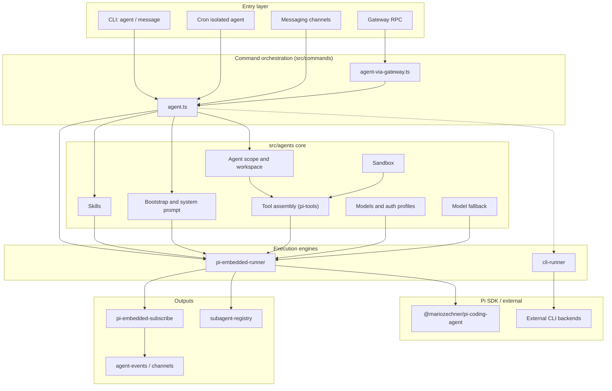
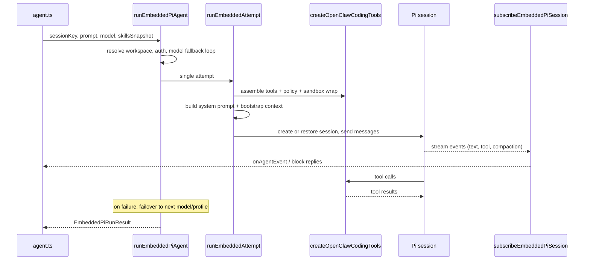
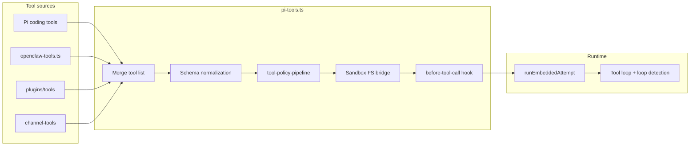
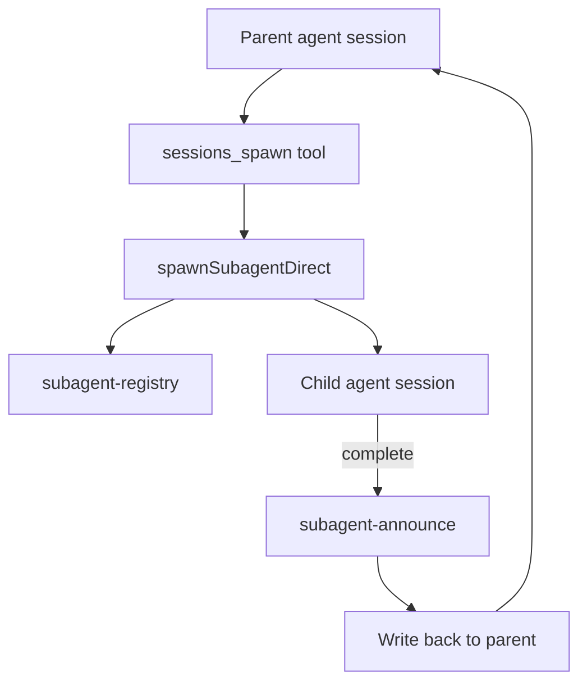

# Agent runtime architecture (`src/agents`)

OpenClaw's agent runtime lives under `src/agents`. It is the core that turns configuration, prompts, and tools into model runs: multi-agent scope, model auth, tool assembly, session context, sandboxing, skills, and the embedded [Pi Coding Agent](https://github.com/badlogic/pi-mono) execution engine.

Upper layers invoke this stack from `src/commands/agent.ts` (local) and the Gateway (`agent` RPC). Most paths end in `runEmbeddedPiAgent`.

Related docs:

- [Pi integration](/pi) — Pi SDK wiring and file map
- [Agent loop](/concepts/agent-loop) — lifecycle, queues, streaming
- [Multi-agent](/concepts/multi-agent) — routing and multiple agents
- [Compaction](/concepts/compaction) — session history summarization

## Design principles

| Dimension | Approach |
| --------- | -------- |
| **Execution** | **Embedded Pi** (in-process SDK) is the primary path; **CLI runner** is an alternative for external CLI backends (e.g. Claude CLI) |
| **Tools** | Pi coding tools + OpenClaw tools + plugin tools + channel tools, assembled and filtered in `pi-tools.ts` |
| **Multi-agent** | `agents.list` config + `agent-scope` resolution; child agents via `sessions_spawn` and `subagent-registry` |
| **Isolation** | Optional Docker sandbox (filesystem, browser, tool policy) |
| **Reliability** | Model fallback, auth profile rotation, compaction, context pruning, tool loop detection |

## Layered overview



## Functional modules

### 1. Agent identity and scope

| Module | Path | Responsibility |
| ------ | ---- | -------------- |
| Agent scope | `agent-scope.ts` | Resolve `agents.list`, default agent, per-agent model/skills/sandbox/tools |
| Built-in agents | `builtin-agents.ts` | Preset agents (e.g. `main`, `travel-planner`) and first-time defaults |
| Agent paths | `agent-paths.ts` | Paths such as `~/.openclaw/agents/<id>` |
| Workspace | `workspace.ts`, `workspace-dir.ts`, `workspace-run.ts` | Workspace init, templates, bootstrap files, run-time workspace resolution |

### 2. Execution engines (runtime)

| Module | Path | Responsibility |
| ------ | ---- | -------------- |
| Embedded Pi (primary) | `pi-embedded-runner/` | `runEmbeddedPiAgent` → `runEmbeddedAttempt`: model calls, tool loop, compaction, failover |
| Public API | `pi-embedded.ts`, `pi-embedded-runner.ts` | Export run, abort, compact, queue, lanes |
| CLI runner | `cli-runner.ts`, `cli-backends.ts`, `claude-cli-runner.ts` | Run a turn via external CLI process |
| Session subscribe | `pi-embedded-subscribe*.ts` | Streaming replies, block replies, tool events, reasoning stream |
| Pi extensions | `pi-extensions/` | Context pruning, compaction safeguard |
| ACP spawn | `acp-spawn.ts` | Agent Client Protocol runtime sub-agents and thread bindings |

### 3. Tool system

| Module | Path | Responsibility |
| ------ | ---- | -------------- |
| Tool orchestration | `pi-tools.ts` | Assemble coding + OpenClaw + plugin tools; schema normalization; sandbox/policy wrappers |
| OpenClaw tools | `openclaw-tools.ts` | Register gateway, sessions, web, UI, cron, media, etc. |
| Individual tools | `tools/*` | Per-tool implementations (`message`, `browser`, `web_fetch`, `pdf`, Discord actions, …) |
| Tool catalog | `tool-catalog.ts` | Profiles: `minimal`, `coding`, `messaging`, `full` |
| Policy pipeline | `tool-policy.ts`, `tool-policy-pipeline.ts`, `pi-tools.policy.ts` | allow/deny, owner-only, channel/subagent policies |
| Shell tools | `bash-tools*.ts` | `exec`, `process`, approvals, PTY, Docker exec |
| File tools | `pi-tools.read.ts`, `apply-patch.ts` | read/write/edit; host vs sandbox paths |
| Channel tools | `channel-tools.ts` | Messaging channel action tools |
| Tool adapter | `pi-tool-definition-adapter.ts` | Pi SDK tool definition adapter |
| Loop detection | `tool-loop-detection.ts` | Prevent tool call loops |

Tool catalog sections (from `tool-catalog.ts`):

- **Files**: `read`, `write`, `edit`, `apply_patch`
- **Runtime**: `exec`, `process`
- **Web**: `web_search`, `web_fetch`
- **Memory**: `memory_search`, `memory_get`
- **Sessions**: `sessions_list`, `sessions_history`, `sessions_send`, `sessions_spawn`, `subagents`, `session_status`
- **UI**: `browser`, `canvas`, plus Tool UI helpers (charts, maps, approval cards, …)
- **Messaging**: `message`
- **Automation**: `cron`, `gateway`
- **Nodes**: `nodes`
- **Agents**: `agents_list`
- **Media**: `image`, `tts`, `pdf`

### 4. Models and authentication

| Module | Path | Responsibility |
| ------ | ---- | -------------- |
| Models config | `models-config.ts`, `models-config.providers.ts` | Generate/merge `models.json`, multi-provider discovery |
| Model selection | `model-selection.ts`, `model-catalog.ts` | Aliases, allowlists, model ref resolution |
| Auth | `model-auth.ts`, `auth-profiles/` | API keys, OAuth profiles, rotation, cooldown |
| Fallback | `model-fallback.ts` | Failover across models and profiles |
| Provider adapters | `bedrock-discovery.ts`, `ollama-stream.ts`, `openai-ws-stream.ts`, … | Provider-specific behavior |
| Context window | `context-window-guard.ts` | Token budget and overflow protection |

### 5. Skills

| Module | Path | Responsibility |
| ------ | ---- | -------------- |
| Skills facade | `skills.ts` | Export workspace skills API |
| Implementation | `skills/workspace.ts`, `skills/config.ts`, … | Merge sources: bundled, managed, workspace, `.agents` |
| Install | `skills-install.ts`, `skills-remove.ts` | Package install and removal |
| Status | `skills-status.ts` | Availability and dependency checks |

Skill precedence (lowest to highest): extra dirs → bundled → managed → personal `~/.agents/skills` → project `.agents/skills` → workspace `skills/`.

### 6. Sandbox

| Module | Path | Responsibility |
| ------ | ---- | -------------- |
| Sandbox facade | `sandbox.ts` | Export config, context, Docker, tool policy |
| Implementation | `sandbox/*` | Containers, FS bridge, browser, workspace mounts |

### 7. Session and context

| Module | Path | Responsibility |
| ------ | ---- | -------------- |
| Compaction | `compaction.ts` | History summarization and chunk merge |
| Transcript repair | `session-transcript-repair.ts`, `session-tool-result-guard.ts` | Transcript fixes, tool result persistence |
| Session infra | `session-write-lock.ts`, `session-dirs.ts`, `session-slug.ts` | Concurrency and paths |
| Bootstrap | `bootstrap-files.ts`, `bootstrap-budget.ts`, `bootstrap-cache.ts` | Inject `AGENTS.md` and related context |
| System prompt | `system-prompt.ts`, `system-prompt-params.ts` | Full system prompt assembly |

### 8. Multi-agent and subagents

| Module | Path | Responsibility |
| ------ | ---- | -------------- |
| Spawn | `subagent-spawn.ts`, `tools/sessions-spawn-tool.ts` | Create child agent sessions |
| Registry | `subagent-registry*.ts` | Run registration, lifecycle, persistence, cleanup |
| Announce | `subagent-announce*.ts` | Completion callbacks to parent session |
| Depth and capabilities | `subagent-depth.ts`, `subagent-capabilities.ts` | Nesting limits and capabilities |
| Spawned context | `spawned-context.ts` | Workspace/config inheritance for children |

### 9. Cross-cutting helpers

| Module | Path | Responsibility |
| ------ | ---- | -------------- |
| Identity | `identity.ts`, `identity-file.ts`, `identity-avatar.ts` | Persona and avatar |
| Memory | `memory-search.ts`, `tools/memory-tool.ts` | Semantic memory retrieval |
| Usage | `usage.ts` | Token usage normalization |
| Failover errors | `failover-error.ts` | Unified failover error type |
| Plugin runtime | `runtime-plugins.ts` | Plugin hooks and tools |
| Content blocks | `content-blocks.ts` | Multimodal content structures |

## Embedded Pi run sequence



### Run pipeline (code anchors)

1. **`src/commands/agent.ts`** — resolves session, skills snapshot, model, then calls `runEmbeddedPiAgent`.
2. **`pi-embedded-runner/run.ts`** — `runEmbeddedPiAgent`: session/global lanes, auth profile selection, failover loop.
3. **`pi-embedded-runner/run/attempt.ts`** — `runEmbeddedAttempt`: one model invocation with tools and prompt.
4. **`pi-embedded-subscribe.ts`** — bridges Pi events to OpenClaw `agent` stream (assistant, tool, lifecycle).

## Tool assembly pipeline



`createOpenClawCodingTools` in `pi-tools.ts` is the main entry for a run's tool list. It calls `createOpenClawTools` for OpenClaw-specific tools and merges Pi's `codingTools` (read/write/exec/…), then applies policies, provider quirks (Claude/Gemini/xAI), and optional sandbox wrappers.

## Subagent collaboration



See [Multi-agent](/concepts/multi-agent) for routing and allowlists.

## Module dependency summary

```
src/commands/agent.ts
    ├── agent-scope / workspace / bootstrap-files / skills
    ├── runEmbeddedPiAgent (pi-embedded-runner)
    │       ├── model-auth + auth-profiles + model-fallback
    │       ├── models-config
    │       ├── runEmbeddedAttempt
    │       │       ├── createOpenClawCodingTools (pi-tools)
    │       │       ├── system-prompt + compaction
    │       │       └── subscribeEmbeddedPiSession
    │       └── sandbox (optional)
    └── runCliAgent (cli-runner)   # CLI backend path
```

## Directory map (top level)

```
src/agents/
├── agent-scope.ts, builtin-agents.ts, workspace.ts
├── pi-embedded-runner/          # Primary runtime
├── pi-embedded-subscribe*.ts    # Streaming bridge
├── pi-tools.ts, openclaw-tools.ts, tools/
├── sandbox/
├── skills/
├── auth-profiles/, model-auth.ts, models-config*.ts
├── subagent-*.ts, acp-spawn.ts
├── system-prompt.ts, bootstrap-*.ts, compaction.ts
├── cli-runner.ts, claude-cli-runner.ts
└── pi-extensions/               # Context pruning, compaction safeguard
```

For Pi-specific file-level detail, see [Pi integration](/pi).

## Extension points

When changing agent behavior, typical touch points are:

| Goal | Where to look |
| ---- | ------------- |
| New built-in tool | `tools/<name>-tool.ts`, register in `openclaw-tools.ts` and `tool-catalog.ts` |
| Tool allow/deny for an agent | Config `agents.list[].tools`, resolved via `tool-policy-pipeline.ts` |
| Provider or model wiring | `models-config.providers.ts`, `model-auth.ts` |
| Prompt or bootstrap content | `system-prompt.ts`, `workspace.ts`, `bootstrap-files.ts` |
| Subagent spawn rules | `subagent-spawn.ts`, `subagent-depth.ts`, `tools/sessions-spawn-tool.ts` |
| Sandbox behavior | `sandbox/config.ts`, `sandbox/context.ts`, `sandbox-tool-policy.ts` |
