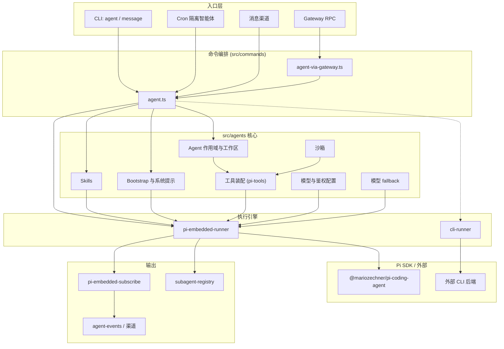
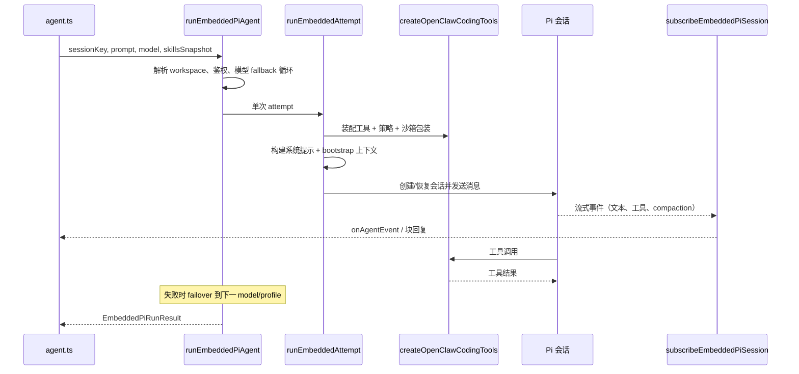
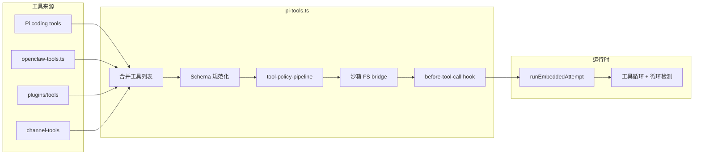
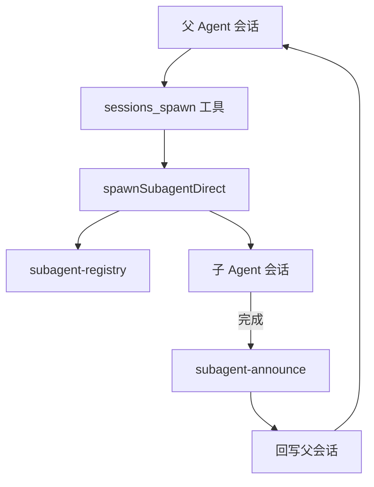

# 智能体运行时架构（`src/agents`）

OpenClaw 的智能体运行时位于 `src/agents`，负责将配置、提示词与工具转化为模型调用：多智能体作用域、模型鉴权、工具装配、会话上下文、沙箱、Skills，以及嵌入式 [Pi Coding Agent](https://github.com/badlogic/pi-mono) 执行引擎。

上层通过 `src/commands/agent.ts`（本地）与 Gateway（`agent` RPC）调用该栈，绝大多数路径最终进入 `runEmbeddedPiAgent`。

相关文档：

- [Pi 集成](/pi) — Pi SDK 接入与文件结构
- [智能体循环](/concepts/agent-loop) — 生命周期、队列与流式输出
- [多智能体](/concepts/multi-agent) — 路由与多 Agent 配置
- [压缩](/concepts/compaction) — 会话历史摘要

## 设计原则

| 维度 | 做法 |
| ---- | ---- |
| **执行** | 以 **嵌入式 Pi**（进程内 SDK）为主路径；**CLI Runner** 作为外部 CLI 后端（如 Claude CLI）的备选 |
| **工具** | Pi coding tools + OpenClaw 工具 + 插件工具 + 渠道工具，在 `pi-tools.ts` 中统一装配与过滤 |
| **多智能体** | `agents.list` 配置 + `agent-scope` 解析；子智能体通过 `sessions_spawn` 与 `subagent-registry` 编排 |
| **隔离** | 可选 Docker 沙箱（文件系统、浏览器、工具策略） |
| **可靠性** | 模型 fallback、auth profile 轮换、compaction、上下文裁剪、工具循环检测 |

## 分层总览



## 功能模块

### 1. 智能体身份与作用域

| 模块 | 路径 | 职责 |
| ---- | ---- | ---- |
| Agent 作用域 | `agent-scope.ts` | 解析 `agents.list`、默认 Agent、各 Agent 的 model/skills/沙箱/tools |
| 内置 Agent | `builtin-agents.ts` | 预置 Agent（如 `main`、`travel-planner`）及首次创建默认值 |
| Agent 目录 | `agent-paths.ts` | 如 `~/.openclaw/agents/<id>` 等路径 |
| 工作区 | `workspace.ts`、`workspace-dir.ts`、`workspace-run.ts` | 工作区初始化、模板、bootstrap 文件、运行期 workspace 解析 |

### 2. 执行引擎（运行时）

| 模块 | 路径 | 职责 |
| ---- | ---- | ---- |
| 嵌入式 Pi（主路径） | `pi-embedded-runner/` | `runEmbeddedPiAgent` → `runEmbeddedAttempt`：模型调用、工具循环、compaction、故障转移 |
| 对外 API | `pi-embedded.ts`、`pi-embedded-runner.ts` | 导出 run、abort、compact、queue、lanes |
| CLI Runner | `cli-runner.ts`、`cli-backends.ts`、`claude-cli-runner.ts` | 通过外部 CLI 进程完成一轮对话 |
| 会话订阅 | `pi-embedded-subscribe*.ts` | 流式回复、块回复、工具事件、reasoning 流 |
| Pi 扩展 | `pi-extensions/` | 上下文裁剪、compaction 保护 |
| ACP Spawn | `acp-spawn.ts` | Agent Client Protocol 运行时子 Agent 与线程绑定 |

### 3. 工具系统

| 模块 | 路径 | 职责 |
| ---- | ---- | ---- |
| 工具编排 | `pi-tools.ts` | 装配 coding + OpenClaw + 插件工具；schema 规范化；沙箱/策略包装 |
| OpenClaw 工具集 | `openclaw-tools.ts` | 注册 gateway、sessions、web、UI、cron、媒体等 |
| 单工具实现 | `tools/*` | 各工具实现（`message`、`browser`、`web_fetch`、`pdf`、Discord 操作等） |
| 工具目录 | `tool-catalog.ts` | 配置档：`minimal`、`coding`、`messaging`、`full` |
| 策略管道 | `tool-policy.ts`、`tool-policy-pipeline.ts`、`pi-tools.policy.ts` | allow/deny、仅 owner、渠道/子 Agent 策略 |
| Shell 工具 | `bash-tools*.ts` | `exec`、`process`、审批、PTY、Docker exec |
| 文件工具 | `pi-tools.read.ts`、`apply-patch.ts` | read/write/edit；宿主机与沙箱双路径 |
| 渠道工具 | `channel-tools.ts` | 各消息渠道 action 工具 |
| 工具适配 | `pi-tool-definition-adapter.ts` | Pi SDK 工具定义适配 |
| 循环检测 | `tool-loop-detection.ts` | 防止工具调用死循环 |

`tool-catalog.ts` 中的工具分组：

- **文件**：`read`、`write`、`edit`、`apply_patch`
- **运行时**：`exec`、`process`
- **Web**：`web_search`、`web_fetch`
- **记忆**：`memory_search`、`memory_get`
- **会话**：`sessions_list`、`sessions_history`、`sessions_send`、`sessions_spawn`、`subagents`、`session_status`
- **UI**：`browser`、`canvas`，以及 Tool UI 辅助（图表、地图、审批卡片等）
- **消息**：`message`
- **自动化**：`cron`、`gateway`
- **节点**：`nodes`
- **智能体**：`agents_list`
- **媒体**：`image`、`tts`、`pdf`

### 4. 模型与鉴权

| 模块 | 路径 | 职责 |
| ---- | ---- | ---- |
| 模型配置 | `models-config.ts`、`models-config.providers.ts` | 生成/合并 `models.json`，多 Provider 发现 |
| 模型选择 | `model-selection.ts`、`model-catalog.ts` | 别名、allowlist、model ref 解析 |
| 鉴权 | `model-auth.ts`、`auth-profiles/` | API Key、OAuth profile、轮换与 cooldown |
| Fallback | `model-fallback.ts` | 跨模型与 profile 的故障转移 |
| Provider 适配 | `bedrock-discovery.ts`、`ollama-stream.ts`、`openai-ws-stream.ts` 等 | 各厂商特化逻辑 |
| 上下文窗口 | `context-window-guard.ts` | Token 预算与溢出保护 |

### 5. Skills

| 模块 | 路径 | 职责 |
| ---- | ---- | ---- |
| Skills 门面 | `skills.ts` | 导出 workspace Skills API |
| 实现 | `skills/workspace.ts`、`skills/config.ts` 等 | 多源合并：bundled、managed、workspace、`.agents` |
| 安装 | `skills-install.ts`、`skills-remove.ts` | 包安装与卸载 |
| 状态 | `skills-status.ts` | 可用性与依赖检查 |

Skills 优先级（从低到高）：extra dirs → bundled → managed → 个人 `~/.agents/skills` → 项目 `.agents/skills` → 工作区 `skills/`。

### 6. 沙箱

| 模块 | 路径 | 职责 |
| ---- | ---- | ---- |
| 沙箱门面 | `sandbox.ts` | 导出配置、context、Docker、工具策略 |
| 实现 | `sandbox/*` | 容器、FS bridge、浏览器、工作区挂载 |

### 7. 会话与上下文

| 模块 | 路径 | 职责 |
| ---- | ---- | ---- |
| Compaction | `compaction.ts` | 历史摘要与分块合并 |
| 会话修复 | `session-transcript-repair.ts`、`session-tool-result-guard.ts` | transcript 修复、工具结果持久化 |
| 会话基础设施 | `session-write-lock.ts`、`session-dirs.ts`、`session-slug.ts` | 并发与路径 |
| Bootstrap | `bootstrap-files.ts`、`bootstrap-budget.ts`、`bootstrap-cache.ts` | 注入 `AGENTS.md` 等上下文 |
| 系统提示 | `system-prompt.ts`、`system-prompt-params.ts` | 完整系统提示组装 |

### 8. 多智能体与子 Agent

| 模块 | 路径 | 职责 |
| ---- | ---- | ---- |
| Spawn | `subagent-spawn.ts`、`tools/sessions-spawn-tool.ts` | 创建子 Agent 会话 |
| Registry | `subagent-registry*.ts` | 运行登记、生命周期、持久化、清理 |
| Announce | `subagent-announce*.ts` | 子任务完成后回传父会话 |
| 深度与能力 | `subagent-depth.ts`、`subagent-capabilities.ts` | 嵌套限制与能力 |
| 继承上下文 | `spawned-context.ts` | 子 Agent 继承 workspace/配置 |

### 9. 横切辅助

| 模块 | 路径 | 职责 |
| ---- | ---- | ---- |
| 身份 | `identity.ts`、`identity-file.ts`、`identity-avatar.ts` | 人格与头像 |
| 记忆 | `memory-search.ts`、`tools/memory-tool.ts` | 语义记忆检索 |
| 用量 | `usage.ts` | Token 用量归一化 |
| 故障错误 | `failover-error.ts` | 统一 failover 错误类型 |
| 插件运行时 | `runtime-plugins.ts` | 插件 hooks 与工具 |
| 内容块 | `content-blocks.ts` | 多模态内容结构 |

## 嵌入式 Pi 单次 Run 流程



### Run 流水线（代码锚点）

1. **`src/commands/agent.ts`** — 解析会话、Skills 快照、模型，然后调用 `runEmbeddedPiAgent`。
2. **`pi-embedded-runner/run.ts`** — `runEmbeddedPiAgent`：会话/全局 lane、auth profile 选择、failover 循环。
3. **`pi-embedded-runner/run/attempt.ts`** — `runEmbeddedAttempt`：单次模型调用（含工具与提示）。
4. **`pi-embedded-subscribe.ts`** — 将 Pi 事件桥接到 OpenClaw `agent` 流（assistant、tool、lifecycle）。

## 工具装配流水线



`pi-tools.ts` 中的 `createOpenClawCodingTools` 是一次 Run 工具列表的主入口：调用 `createOpenClawTools` 注册 OpenClaw 工具，合并 Pi 的 `codingTools`（read/write/exec 等），再应用策略、Provider 特化（Claude/Gemini/xAI）及可选沙箱包装。

## 子 Agent 协作



路由与 allowlist 见 [多智能体](/concepts/multi-agent)。

## 模块依赖关系

```
src/commands/agent.ts
    ├── agent-scope / workspace / bootstrap-files / skills
    ├── runEmbeddedPiAgent (pi-embedded-runner)
    │       ├── model-auth + auth-profiles + model-fallback
    │       ├── models-config
    │       ├── runEmbeddedAttempt
    │       │       ├── createOpenClawCodingTools (pi-tools)
    │       │       ├── system-prompt + compaction
    │       │       └── subscribeEmbeddedPiSession
    │       └── sandbox（可选）
    └── runCliAgent (cli-runner)   # CLI 后端路径
```

## 顶层目录结构

```
src/agents/
├── agent-scope.ts, builtin-agents.ts, workspace.ts
├── pi-embedded-runner/          # 主运行时
├── pi-embedded-subscribe*.ts    # 流式桥接
├── pi-tools.ts, openclaw-tools.ts, tools/
├── sandbox/
├── skills/
├── auth-profiles/, model-auth.ts, models-config*.ts
├── subagent-*.ts, acp-spawn.ts
├── system-prompt.ts, bootstrap-*.ts, compaction.ts
├── cli-runner.ts, claude-cli-runner.ts
└── pi-extensions/               # 上下文裁剪、compaction 保护
```

Pi 相关文件级说明见 [Pi 集成](/pi)。

## 扩展点

修改智能体行为时，常见入口如下：

| 目标 | 查看位置 |
| ---- | -------- |
| 新增内置工具 | `tools/<name>-tool.ts`，在 `openclaw-tools.ts` 与 `tool-catalog.ts` 注册 |
| 某 Agent 的工具 allow/deny | 配置 `agents.list[].tools`，经 `tool-policy-pipeline.ts` 解析 |
| Provider 或模型接入 | `models-config.providers.ts`、`model-auth.ts` |
| 提示或 bootstrap 内容 | `system-prompt.ts`、`workspace.ts`、`bootstrap-files.ts` |
| 子 Agent 生成规则 | `subagent-spawn.ts`、`subagent-depth.ts`、`tools/sessions-spawn-tool.ts` |
| 沙箱行为 | `sandbox/config.ts`、`sandbox/context.ts`、`sandbox-tool-policy.ts` |
