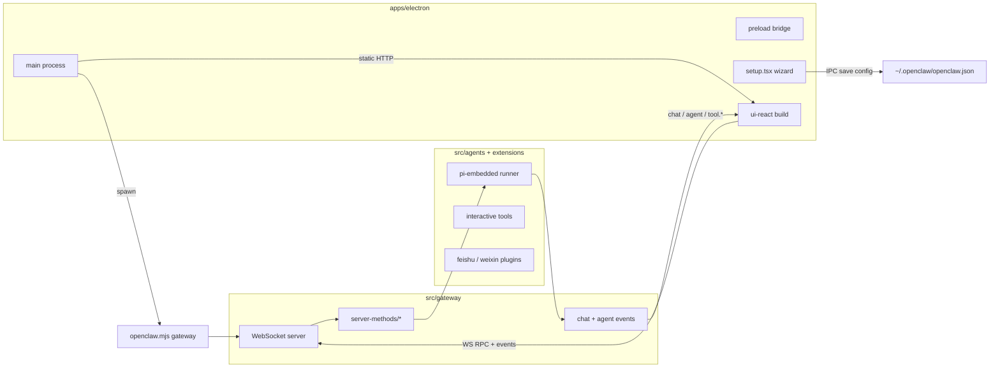

# ui-react / Electron ↔ src 依赖映射

> 生成目的：合并 `upstream/main` 时，按 **RPC / 事件 / 子进程** 追溯 fork 功能对应的 `src/` 模块，避免漏合。
>
> **耦合原则**：`ui-react/` 与 `apps/electron/` **不 import** `src/`；仅通过 **Gateway WebSocket**（`ws://127.0.0.1:18789`）与 **CLI 子进程**（`openclaw gateway run`）交互。
>
> **当前 merge 状态**（2026-05-20）：`ui-react/`、`apps/electron/` 无冲突；`src/` 约 **213** 个文件仍 `U`/`DU`/`UD`（见 `merge-reports/SRC_MERGE_QUEUE.md`）。

---

## 1. 架构总览



| 层 | 路径 | 与 src 的关系 |
|----|------|----------------|
| 渲染 UI | `ui-react/src/**` | 仅 `GatewayClient.request()` + 事件订阅 |
| 桌面壳 | `apps/electron/src/main/**` | 启动 gateway、写配置、可选 `wizard:*` 中转 |
| 契约文档 | `ui-react/docs/chat/gateway-integration.md` | wire → canonical 映射 |
| 后端 | `src/gateway/**`, `src/agents/**`, `extensions/*` | RPC handler + 流式事件源 |

---

## 2. ui-react Gateway RPC 全表

以下方法均来自 `ui-react` 源码中的 `client.request(...)`（含类型参数形式）。

### 2.1 连接与调试

| RPC | ui-react 调用点 | src 实现（主文件） | Merge |
|-----|-----------------|-------------------|-------|
| `connect` | `ui-react/src/hooks/gateway/client.ts` | `src/gateway/server/ws-connection/message-handler.ts` | 随 WS 栈 |
| `health` | `pages/DebugPage.tsx` | `src/gateway/server-methods/health.ts` | 通常无冲突 |
| `logs.read` | `store/logs.store.ts` | `src/gateway/server-methods/logs.ts` | 查队列 |

### 2.2 聊天与会话（P3 核心）

| RPC | ui-react 调用点 | src 实现 | Merge | Fork 关联 |
|-----|-----------------|----------|-------|-----------|
| `chat.send` | `GatewayChatRuntimeProvider.tsx` | `server-methods/chat.ts` | **U** | 附件、`attachmentRefs`、乐观消息 |
| `chat.history` | `hooks/session-manager/loaders.ts` | `chat.ts` + `chat-transcript-inject.ts` | **U** / **U** | 历史注入、附件元数据 |
| `chat.abort` | `GatewayChatRuntimeProvider.tsx` | `chat.ts` | **U** | |
| `chat.status` | `ThreadView.tsx` | `chat.ts` | **U** | 断线后恢复 activeRun |
| `chat.tools.subscribe` | `session-manager/loaders.ts` | `chat.ts` | **U** | tool-ui 流 |
| `sessions.list` | loaders, `agents/profile.tsx` | `server-methods/sessions.ts` | ok | 侧栏标题 |
| `sessions.delete` | `session-manager/actions.ts` | `sessions.ts` | ok | |
| `chat.sessions.list` | `pages/OverviewPage.tsx` | `chat.ts` 或 sessions 辅助 | **U** | 概览页 |

**WS 事件（非 RPC）**：`gateway.store.ts` 将 `chat` / `agent` / `tool.*` 交给 `gateway-run-adapter.ts` → `conversation/gateway-adapter.ts`。发射侧主要在 `src/gateway/server-chat.ts`（当前 **ok**）、`pi-embedded-subscribe*.ts`（**U**）。

**附件路径**：`Composer.tsx` → `attachment-adapter.ts` → `chat.send` 的 `attachments` / `attachmentRefs` → **`src/gateway/chat-attachments.ts`（U，B6）**。

### 2.3 Agents / 工具 / Skills

| RPC | ui-react 调用点 | src 实现 | Merge |
|-----|-----------------|----------|-------|
| `agents.list` | `store/agents.store.ts` | `server-methods/agents.ts` | **U** |
| `agents.create` / `agents.update` / `agents.delete` | `agents.store.ts` | `agents.ts` | **U** |
| `agent.identity.get` | `agents.store.ts` | `server-methods/agent.ts` | **U** |
| `agents.files.list/get/set` | `agents.store.ts` | `agents.ts` | **U** |
| `tools.catalog` | `agents.store.ts`, `agents/tools.tsx` | `server-methods/tools-catalog.ts` | ok |
| `skills.status` / `skills.update` | `agents.store.ts`, `skills.store.ts` | `server-methods/skills.ts` | **U** |
| `skills.install` / `import` / `remove` / `file.get` / `file.set` | `skills.store.ts` | `skills.ts` + upload 子模块 | **U** |

**Agent 运行链（无直接 RPC，影响 tool 事件）**：

| 模块 | Merge | Fork 功能 |
|------|-------|-----------|
| `src/agents/pi-embedded-subscribe.ts` | **U** | 流式 assistant/tool 事件 |
| `src/agents/pi-embedded-subscribe.handlers.tools.ts` | **U** | B4 office-helper boot |
| `src/agents/tools/message-tool.ts` | **U** | B3 飞书/微信 target 自动补全 |
| `src/agents/tools/question-flow-tool.ts` 等 | 多已 auto-merge | B1/B2 互动 UI |
| `src/auto-reply/reply/agent-runner-*.ts` | **U** | 指令/推理默认值 |

### 2.4 配置 / 渠道 / 插件

| RPC | ui-react 调用点 | src 实现 | Merge |
|-----|-----------------|----------|-------|
| `config.get` / `config.set` | `agents.store.ts`, `channels.store.ts` | `server-methods/config.ts` | **U** |
| `config.schema` | `channels.store.ts` | `config.ts` | **U** |
| `config.provider.apply` | `agents.store.ts` | `config.ts` | **U** |
| `channels.catalog` / `channels.status` | `channels.store.ts` | `server-methods/channels.ts` | **U** |
| `channels.enable` / `channels.logout` | `channels.store.ts` | `channels.ts` | **U** |
| `web.login.start` / `web.login.wait` | WhatsApp/微信扫码 | `server-methods/web.ts` | **U** |
| `nostr.profile.get` / `nostr.profile.set` | `channels.store.ts` | Nostr 插件方法 | 插件侧 |
| `plugins.status` / `plugins.enable` / `plugins.install` | `plugins.store.ts` | `server-methods` + `server-plugins.ts` | plugins **U** |

**渠道扩展（UI 绑定，非 src 根目录）**：

| 渠道 ID | 扩展路径 | Merge | UI |
|---------|----------|-------|-----|
| `feishu` | `extensions/feishu/` | ok（已 --theirs） | `channels/shared/ChannelConfigForm.tsx` |
| `openclaw-weixin` | `extensions/openclaw-weixin/` | ok | `ChannelDetail.tsx`, cron 投递 |
| `whatsapp` | core `src/web` | 随 web.ts | `channels.store.ts` |

飞书/微信 **config 字段** 走 `config.set`；**状态** 走 `channels.status`；**出站消息** 走 agent `message` 工具 + **`recipient-resolver.ts`（ok，B13）** + **`config/sessions/metadata.ts`（U，B12）**。

### 2.5 定时任务

| RPC | ui-react 调用点 | src 实现 | Merge |
|-----|-----------------|----------|-------|
| `cron.status` / `cron.list` | `agents.store.ts`, `OverviewPage.tsx` | `server-methods/cron.ts` | ok |
| `cron.add` / `cron.update` / `cron.remove` / `cron.run` | `agents.store.ts` | `cron.ts` | ok |
| `cron.runs` | `agents.store.ts` | `cron.ts` | ok |

飞书通知：`src/agents/tools/cron-tool.ts`（**U**，B14）+ `ScheduledTasksPage.tsx` 投递渠道 UI。

### 2.6 Fork 独有 RPC（ui-react 未调用）

| RPC | src | 说明 |
|-----|-----|------|
| `profile.parse` | `server-methods/profile.ts`（**ok**） | 上游 `ui/` 使用；ui-react 暂无对应页，但 **server-methods-list** 冲突区需保留方法名 |

方法注册表：`src/gateway/server-methods-list.ts`（**U**）— 合并时确保 `chat.*`、`profile.parse`、`wizard.*` 仍在 advertised 列表。

协议类型：`src/gateway/protocol/schema/*`（**U**，P1）。

---

## 3. ui-react 前端模块 → 能力矩阵

| ui-react 区域 | 页面/组件 | 依赖 RPC/事件 | INVENTORY |
|---------------|-----------|---------------|-----------|
| 聊天 | `ChatPage`, `GatewayChatRuntimeProvider`, `run-projection/` | `chat.*`, `sessions.*`, WS `chat`/`agent`/`tool.*` | A4–A9 |
| 会话侧栏 | `session-manager/*` | `sessions.list`, `chat.history` | A6 |
| Agents | `AgentsPage`, `agents/*` | `agents.*`, `tools.catalog`, `config.*` | A19 |
| Skills | `SkillsPage` | `skills.*` | A13–A18 |
| Channels | `ChannelsPage`, `channels/*` | `channels.*`, `config.*`, `web.login.*` | A10 |
| Cron | `ScheduledTasksPage`, `CronPage` | `cron.*` | A11 |
| Plugins | `PluginsPage` | `plugins.*` | — |
| Logs / Debug | `LogsPage`, `DebugPage` | `logs.read`, `health` | — |
| Setup | `setup.tsx`, `setup-wizard/*` | **Electron IPC**（见 §4） | A1 |

**适配层（合并时勿破坏 wire 形状）**：

- `components/chat/gateway/gateway-ws-check.ts`
- `components/chat/gateway/gateway-run-adapter.ts`
- `components/chat/conversation/gateway-adapter.ts`
- `hooks/gateway/use-gateway-event-bridge.ts`

---

## 4. apps/electron 与 src 的触点

### 4.1 主进程模块

| 文件 | 职责 | 触及的 src/运行时 |
|------|------|-------------------|
| `main/gateway.ts` | `spawn` `openclaw.mjs gateway run`，端口默认 **18789**，读 `~/.openclaw/openclaw.json` | 整个 gateway 进程 |
| `main/window.ts` | 打包态 HTTP 静态服务 `control-ui-react/`；开发态连 Vite | 无 src import |
| `main/startup.ts` | 启动管线：splash → gateway 健康 → 加载 UI | 依赖 gateway `/health` |
| `main/onboarding.ts` | 写 `openclaw.json`、`auth-profiles`、检测 `wizard.lastRunAt` | 与 `src/config/*`  schema 一致 |
| `main/onboarding-validate.ts` | 探针校验 API Key（HTTP 直连厂商） | **不经过** gateway |
| `main/onboarding-oauth.ts` | OAuth 设备码 / 协议回调 `openclaw://` | 写 auth profile |
| `main/ipc-wizard.ts` | 可选：主进程 WS 中转 `wizard.*` | `server-methods/wizard.ts`（ok） |
| `main/index.ts` | IPC：`gateway:restart`, `gateway:info`, `onboarding:*` | 重启 → `server.impl.ts`（**U**，B9） |
| `preload/index.ts` | `window.electronBridge` | — |

### 4.2 Electron ↔ ui-react 数据流

1. **首次启动**：`setup.tsx` → `ElectronWizardAdapter` → `saveOnboardingConfig`（主进程）→ `restartGateway` → `notifyOnboardingComplete` → 主窗口加载 ui-react。
2. **日常使用**：ui-react 通过 `getGatewayInfo()` 拿 `wsUrl` + `token`（或环境变量/Vite 代理）连接 gateway。
3. **配置变更后**：ui-react 可调用 `restartGateway` / 监听 `gateway:restarting` / `gateway:restarted`（B9 验收）。

**注意**：生产向导 **不依赖** `wizard.start/next` RPC（状态在 `setup-wizard.store.ts`）；`ipc-wizard.ts` 仅作兼容/开发备用。合并 `wizard.ts` 优先级低于 `chat.ts`。

### 4.3 Electron 打包与 src 的间接依赖

| 资源 | 路径 | 说明 |
|------|------|------|
| CLI 入口 | `openclaw.mjs`（repo root） | dev：`gateway.ts` 解析 `../../../../openclaw.mjs` |
| 扩展目录 | `Resources/openclaw/extensions` | 打包审计 `openclaw.plugin.json` |
| 配置 | `~/.openclaw/openclaw.json` | gateway + ui-react 共用 |

---

## 5. 合并优先级（与 MERGE_STRATEGY 对齐）

按 **ui-react/Electron 阻断程度** 排序：

| 优先级 | src 路径 | 阻断功能 |
|--------|----------|----------|
| P1 | `src/gateway/protocol/**` | 所有 RPC 类型校验 |
| P1 | `src/gateway/server-methods-list.ts` | 方法注册 / `profile.parse` |
| P2 | `server-methods.ts`, `method-scopes.ts`, `session-utils*.ts` | 鉴权、会话键 |
| **P3** | **`server-methods/chat.ts`**, **`chat-attachments.ts`**, **`chat-transcript-inject.ts`** | **聊天全链路（A4–A9）** |
| **P4** | **`server.impl.ts`**, `server/ws-connection/message-handler.ts` | **Electron 重启重连（B9）** |
| **P5** | **`pi-embedded-subscribe*.ts`**, **`message-tool.ts`**, `pi-embedded-runner/**` | **流式 + 渠道发送（B3/B4）** |
| P6 | `server-methods/config.ts`, `agents.ts`, `channels.ts`, `skills.ts`, `web.ts` | 设置页、渠道页 |
| P6 | `config/sessions/metadata.ts` | identityHints（B12） |
| P7 | `auto-reply/**` | 指令/模型默认 |
| P8 | `commands/*`, `extensions/feishu` 行为补票 | onboard / 渠道 CLI |

**已合并、ui-react 仍依赖（合并后需冒烟）**：

- `src/gateway/server-methods/profile.ts`（fork `profile.parse`）
- `src/gateway/server-methods/sessions.ts`, `tools-catalog.ts`, `cron.ts`
- `src/infra/outbound/recipient-resolver.ts`
- `extensions/feishu`, `extensions/openclaw-weixin`

---

## 6. 验收命令（依赖打通后）

```bash
# L0：无需 gateway
pnpm --dir ui-react test

# L1：gateway + ui-react（需 conflicts=0 + build）
pnpm build
pnpm openclaw gateway run --bind loopback --port 18789 --force &
pnpm ui:react:dev

# L2：Electron
pnpm electron:dev
# 或 pnpm electron:package:local
```

对照 `merge-reports/MERGE_INVENTORY.md` 的 A4–B13 逐项勾选。

---

## 7. 相关文档

- `merge-reports/MERGE_STRATEGY_UI_REACT.md` — 分阶段合并策略
- `merge-reports/MERGE_INVENTORY.md` — Fork 验收清单
- `merge-reports/SRC_MERGE_QUEUE.md` — 215 个冲突文件队列
- `ui-react/docs/chat/gateway-integration.md` — wire 隔离规范
