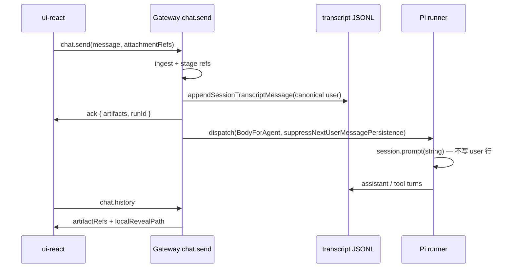

# Plan A：Canonical User Transcript 实施计划

> **架构依据**：Ingress 拥有 JSONL user 行形状；Pi 专注 agent turn 执行。  
> **设计对齐**：[`artifacts-protocol-design.md`](./artifacts-protocol-design.md) §5、§9；补全 [`artifacts-protocol-implementation-plan.md`](./artifacts-protocol-implementation-plan.md) Phase 2 未完成的 **2.1 / 2.6**。  
> **状态**：可执行 backlog（按 PR 粒度拆分）  
> **协议版本**：不升级 `PROTOCOL_VERSION`

## 1. 背景

当前 `chat.send` 存在 **三条并行 user 消息路径**：

| 路径 | 行为 | 问题 |
|------|------|------|
| `buildChatSendAckArtifacts` → ack | 结构化 `ArtifactSummary[]` | ✅ 正确 |
| `emitUserTranscriptUpdate` → WS | `buildChatSendTranscriptMessage` | 仅广播，**不写 JSONL** |
| Pi `session.prompt(Body)` | string 含附录 | JSONL **无** `file.localRevealPath` |

**Plan A 目标**：让 JSONL 与 ack / WS 使用 **同一份 canonical user message**；Pi 不再重复写 user 行；LLM replay 不看到 artifact 专用块。

## 2. 架构原则（实施红线）

1. **不改** `BodyForAgent`、`formatAttachmentRefsForAgent`、staging path — agent 当轮能力不变。
2. **不改** 当轮 `session.prompt()` 的 string 输入。
3. **JSONL 有 `file` 块 ⇒ 必须在 `normalizeMessagesForLlmBoundary` strip**（防 transport 误序列化）。
4. **scoped**：首版仅 `chat.send` 且存在 structured ingest（`attachmentRefs` / `attachments` / persisted images / offloaded refs）；纯文本 send 可渐进接入。
5. **旧 session 不迁移**；ui-react `stripAttachmentContent` 保留为 legacy fallback。
6. **单一 builder**：ack、append、WS broadcast 共用 `buildChatSendTranscriptMessage` 产物。

## 3. 目标数据流（终态）

```text
chat.send ingest
  │
  ├─ buildChatSendTranscriptMessage()     ← 唯一 canonical user message
  │
  ├─ appendSessionTranscriptMessage()     ← JSONL 写入（带 idempotencyKey）
  │     └─ stamp __openclaw.seq + runId
  │
  ├─ buildChatSendAckArtifacts(messageSeq) ← ack（seq 来自 append 后）
  │
  ├─ emitSessionTranscriptUpdate()        ← live WS（用 appended message）
  │
  └─ dispatchInboundMessage()
        replyOptions.suppressNextUserMessagePersistence = true
        Body / BodyForAgent 不变（含附录，给 agent）
```

## 4. 范围

### 4.1 In scope（Plan A）

- Electron `attachmentRefs`（path-ref PDF 等）
- `chat.send.attachments` base64（图片 / 文档）
- offloaded media refs（大 inline 图）
- `messageSeq` / `artifactId` 与 JSONL 行对齐
- Gateway 单测 + 集成测试 + LLM boundary 单测
- ui-react 刷新后 reveal / chip 回归（手动或现有 history 测试）

### 4.2 Out of scope（后续 Phase）

- 缩短 `buildAttachmentRefsAppendix`（Phase B）
- Telegram / Discord channel 统一 canonical builder（Phase C）
- `chat.final` assistant artifacts（Phase D）
- doctor JSONL repair
- Control UI 对齐

## 5. PR 拆分总览

| PR | 标题 | 依赖 | 用户可见 |
|----|------|------|----------|
| **A1** | canonical builder + JSONL append | — | 刷新后 PDF reveal 可用 |
| **A2** | suppress Pi user persist + dispatch 接线 | A1 | 无双写、无附录 JSONL |
| **A3** | LLM boundary strip artifact blocks | A1 | 后续 turn 模型稳定 |
| **A4** | messageSeq 对齐 + 全链路测试 + 文档 | A1–A3 | ack id 与 history 一致 |

建议 **严格顺序 A1 → A2 → A3**；A4 可与 A3 部分并行（测试收尾）。

---

## 6. PR-A1 — Canonical builder + JSONL 持久化

### 6.1 任务

| ID | 任务 | 文件 | AC |
|----|------|------|-----|
| A1.1 | 抽出共享模块 | 新 `src/gateway/chat-send-transcript.ts`（从 `chat.ts` 迁出 `buildChatSendTranscriptMessage` 及 helpers） | `chat.ts` import 新模块；行为不变 |
| A1.2 | 新增 `persistChatSendUserTranscript()` | 同上 + `src/config/sessions/transcript-append.ts` | 封装：`resolveTranscriptPath` → `appendSessionTranscriptMessage` → `emitSessionTranscriptUpdate` |
| A1.3 | 写入 `__openclaw` 元数据 | `chat-send-transcript.ts` | `{ seq, runId }` 写入 message；seq = `nonSessionEntryCount + 1`（append 前读 leaf info） |
| A1.4 | idempotency | append message 字段 | `idempotencyKey: chat-send:${clientRunId}:user`（与现有 emit 一致） |
| A1.5 | 调整 ack 时序 | `chat.ts` | **先** persist user transcript，**再** `buildChatSendAckArtifacts({ messageSeq })` + `respond(ack)` |
| A1.6 | 替换 `emitUserTranscriptUpdate` | `chat.ts` | 改为复用 A1.2 已 append 的 message；避免重复 build / 双广播 |
| A1.7 | `before_agent_run` gate 时序 | `chat.ts` | gate 通过后再 persist（或 persist 后 gate 失败需 rollback — 见 §9 风险） |
| A1.8 | 单测 | `chat-send-transcript.test.ts` | path-ref → JSONL `content[]` 含 `{ type:"file", localRevealPath }` |

### 6.2 关键实现要点

**messageSeq 计算**（append 前）：

```typescript
// readTranscriptLeafInfo(transcriptPath).nonSessionEntryCount + 1
```

**structured content 已有**：`buildUserTranscriptContentWithAttachmentRefs` in `chat-send-artifacts.ts`。

**persist 调用形态**（示意）：

```typescript
const canonicalUser = buildChatSendTranscriptMessage({ ... });
const messageSeq = await resolveNextTranscriptMessageSeq(transcriptPath);
const stamped = stampOpenClawTranscriptMeta(canonicalUser, { seq: messageSeq, runId: clientRunId });
const { messageId, message } = await appendSessionTranscriptMessage({
  transcriptPath,
  message: stamped,
  config: cfg,
});
emitSessionTranscriptUpdate({ sessionFile: transcriptPath, sessionKey, message, messageId, messageSeq });
```

### 6.3 验证

```bash
pnpm test src/gateway/chat-send-transcript.test.ts
pnpm test src/gateway/chat-send-artifacts.test.ts
pnpm test src/gateway/server-methods/chat.directive-tags.test.ts -t "user transcript"
```

### 6.4 Phase 退出标准

- [ ] 发 PDF `attachmentRefs` 后，JSONL 末行 user message 含 `file.localRevealPath`
- [ ] JSONL **不含** `Uploaded file contents:` 附录 string
- [ ] `artifacts.list` 从 JSONL 能列出 path-ref（无需 legacy text parse）

---

## 7. PR-A2 — Suppress Pi user persist

### 7.1 任务

| ID | 任务 | 文件 | AC |
|----|------|------|-----|
| A2.1 | 判定 canonical persist 条件 | `chat.ts` | `shouldPersistCanonicalUserTranscript = attachmentRefs.length \|\| normalizedAttachments.length \|\| offloadedRefs.length \|\| parsedImages.length` |
| A2.2 | 传 suppress flag | `chat.ts` → `dispatchInboundMessage` `replyOptions` | `suppressNextUserMessagePersistence: true` 当 A2.1 为 true |
| A2.3 | 确认链路贯通 | `get-reply-run.ts` → `agent-runner-execution.ts` → `run.ts` → `session-tool-result-guard.ts` | 已有 `opts.suppressNextUserMessagePersistence`；加集成断言 |
| A2.4 | `transcriptCommandBody` 修正（可选同 PR） | `get-reply-run.ts` 或 `chat.ts` MsgContext | `BodyStripped = RawBody` for webchat send；Pi transcript string 即使 fallback 也无附录 |
| A2.5 | 更新现有测试 | `chat.directive-tags.test.ts` | 断言 JSONL 仅 **一行** user entry；Pi mock 不应再写 user |
| A2.6 | agent-runner 测试 | `agent-runner-execution.test.ts` | suppress 从 chat.send replyOptions 传到 attempt |

### 7.2 验证

```bash
pnpm test src/gateway/server-methods/chat.directive-tags.test.ts
pnpm test src/auto-reply/reply/agent-runner-execution.test.ts -t suppressNextUserMessagePersistence
```

### 7.3 Phase 退出标准

- [ ] agent run 后 JSONL user 行 **只有** Gateway append 的一行
- [ ] `lastDispatchCtx.Body` 仍含 agent 附录（agent 行为不变）
- [ ] 纯文本 `chat.send`（无附件）行为不变或仅改善（无附录）

---

## 8. PR-A3 — LLM boundary strip

### 8.1 任务

| ID | 任务 | 文件 | AC |
|----|------|------|-----|
| A3.1 | 识别 OpenClaw artifact 块 | 新 `src/agents/transcript-artifact-blocks.ts` | `isOpenClawArtifactFileBlock(block)`：`type==="file"` 且含 `localRevealPath` / `stagingRevealPath` |
| A3.2 | strip helper | 同上 | user array content：移除 artifact 块；若只剩空则保留 `[{type:"text",text:""}]` 或 skip（与 replay 策略一致） |
| A3.3 | 接入 boundary | `attempt.ts` `normalizeMessagesForLlmBoundary` | 在现有 strip 链末尾调用 |
| A3.4 | **active turn 策略** | `attempt.ts` | 仅 strip **historical** user messages（与 `stripHistoricalInboundMetadataFromUserMessages` 同 index 规则）；**当轮** user 仍走 string prompt，不 replay structured 行 |
| A3.5 | transport 安全网 | `anthropic-transport-stream.ts`（可选） | 非 text/image 块 ignore 而非 cast 为 image — 仅当 A3.4 不足 |
| A3.6 | 单测 | `attempt.test.ts`, `transcript-artifact-blocks.test.ts` | JSONL 含 file 块 → replay 后 provider payload 无 localRevealPath |

### 8.2 验证

```bash
pnpm test src/agents/pi-embedded-runner/run/attempt.test.ts -t normalizeMessagesForLlmBoundary
pnpm test src/agents/transcript-artifact-blocks.test.ts
```

### 8.3 Phase 退出标准

- [ ] 含 path-ref 的 session 连续多轮对话不报错
- [ ] replay 不将 `file` 块送入 Anthropic/OpenAI image 通道

---

## 9. PR-A4 — 全链路测试 + 文档

### 9.1 任务

| ID | 任务 | 文件 | AC |
|----|------|------|-----|
| A4.1 | ack ↔ history id 对齐测试 | `chat-send-artifacts.test.ts` + directive-tags | `ack.artifacts[0].id === artifacts.list` 同 session |
| A4.2 | history projection 测试 | `chat-history-artifacts.test.ts` | refresh 后 `artifactRefs` + `localRevealPath`（Electron caps） |
| A4.3 | ui-react history 测试 | `ui-react/.../history.test.ts` | JSONL structured → chip 不依赖 legacy strip |
| A4.4 | 勾选 implementation plan | `artifacts-protocol-implementation-plan.md` | Phase 2 的 2.1、2.6 完成 |
| A4.5 | 更新设计 doc §10 | `artifacts-protocol-design.md` | transcript persist checklist |
| A4.6 | 手动验证清单 | 本文 §11 | Electron PDF roundtrip |

### 9.2 验证

```bash
pnpm test src/gateway/chat-history-artifacts.test.ts
pnpm test src/gateway/server-methods/artifacts.test.ts
pnpm test ui-react/src/components/chat/serialization/history.test.ts
pnpm check:changed   # 合入前
```

---

## 10. 时序（agent run 路径）



### 10.1 `before_agent_run` gate 分支

| 场景 | persist 时机 |
|------|----------------|
| 无 gate | ingest 后立即 persist → ack |
| 有 gate | gate **通过后** persist → ack 已发出时需 **late patch** 或 **延迟 ack** |

**推荐（A1.7）**：

- **方案 1（简单）**：有 gate 时 persist 仍在 gate 后；ack 先发 provisional artifacts（现有行为），gate 后 append JSONL，WS 补发 `session.message` update。ui-react 以 append 事件刷新 id。
- **方案 2（严格 id）**：有 gate 时 **延迟 ack** 至 gate 通过（可能影响 UI 首屏 latency）。

默认选 **方案 1**；在 A4 手动验证 gate 场景。

---

## 11. 手动验收清单

1. Electron 选 PDF → `chat.send` + `attachmentRefs`
2. DevTools WS：ack 含 `artifacts[].localRevealPath`
3. 读 `~/.openclaw/agents/<id>/sessions/<session>.jsonl`：user 行 `content[]` 含 `type:"file"`，**无**附录
4. ui-react **刷新页面** → chip 仍在 → 「在文件夹中显示」可用
5. `artifacts.list` 含同一 `artifactId`
6. 继续对话 2–3 轮 → 模型正常回复（A3 回归）
7. 旧 session（附录 string）→ 仍可用 legacy strip

---

## 12. 风险与缓解

| 风险 | 缓解 |
|------|------|
| 双写 user 行（append + Pi） | A2 suppress + 测试断言 JSONL user 行数 |
| ack `artifactId` 与 JSONL seq 不一致 | A1 先 append 再 build ack；stamp `__openclaw.seq` |
| gate 阻塞后 JSONL 无 user 行 | gate 失败不 append；emit 仍走 error 路径 |
| LLM replay file 块 | A3 boundary strip |
| `rewriteUserTranscriptMedia` 与 canonical 冲突 | 审读 `chat.ts` post-dispatch rewrite；仅改 Media* 字段时不覆盖 structured content |
| idempotency 重试双 append | `appendSessionTranscriptMessage` + idempotencyKey dedupe（若尚无，A1 加 transcript 层 dedupe 或 rely chat dedupe 在 append 前） |

---

## 13. 回滚策略

- A2 suppress 可单独 revert（恢复 Pi 写 string user，JSONL 回 legacy）
- A1 append 可 feature-flag（`OPENCLAW_CHAT_SEND_CANONICAL_TRANSCRIPT=0`）— 仅当上线后需要 hotfix
- A3 strip 为纯 additive filter，revert 不影响 JSONL

---

## 14. 后续演进（Plan A 之后）

| 阶段 | 内容 |
|------|------|
| **B** | 缩短 agent 附录；`sessions.list` derivedTitle 用 `RawBody` |
| **C** | 抽 `buildCanonicalUserTranscriptMessage` 给 Telegram 等 channel |
| **D** | assistant output artifacts + `chat.final` |
| **E** | 废弃 `history-attachment-strip` 主路径 |

---

## 15. 关键文件索引

| 区域 | 路径 |
|------|------|
| chat.send 主路径 | `src/gateway/server-methods/chat.ts` |
| structured content builder | `src/gateway/chat-send-artifacts.ts` |
| ack artifacts | `src/gateway/chat-send-artifacts.ts` |
| JSONL append | `src/config/sessions/transcript-append.ts` |
| suppress flag | `src/agents/session-tool-result-guard.ts`, `src/auto-reply/get-reply-options.types.ts` |
| LLM boundary | `src/agents/pi-embedded-runner/run/attempt.ts` |
| artifact 索引 | `src/gateway/server-methods/artifacts.ts` |
| history 投影 | `src/gateway/chat-history-artifacts.ts` |
| 现有测试 | `src/gateway/server-methods/chat.directive-tags.test.ts` |

---

## 16. 建议排期

| 周 | PR | 预估 |
|----|-----|------|
| W1 | A1 | 2–3d |
| W1 | A2 | 1–2d |
| W2 | A3 | 1–2d |
| W2 | A4 | 1–2d |

合计 **约 1–1.5 周**（含 review + 手动 Electron 验证）。
