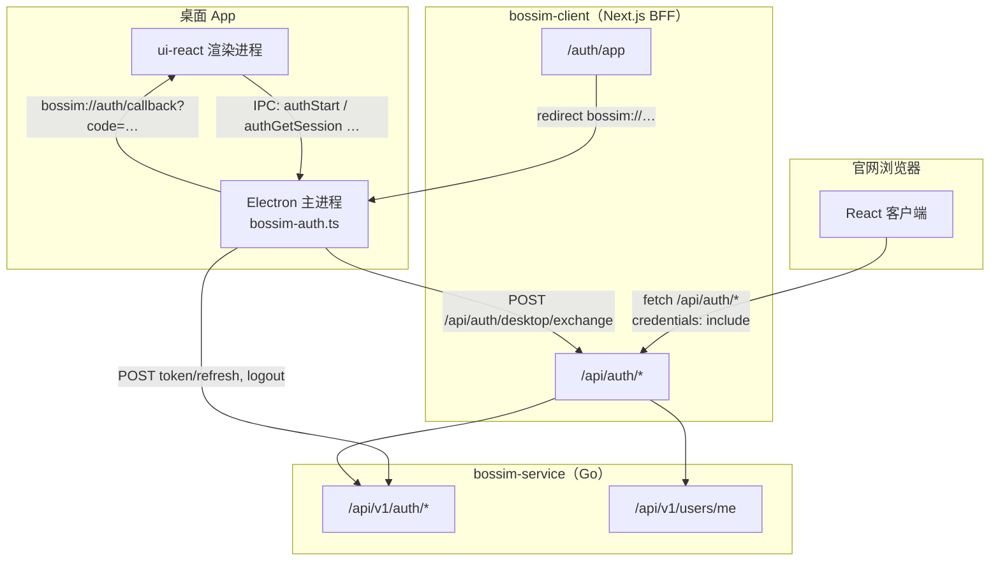
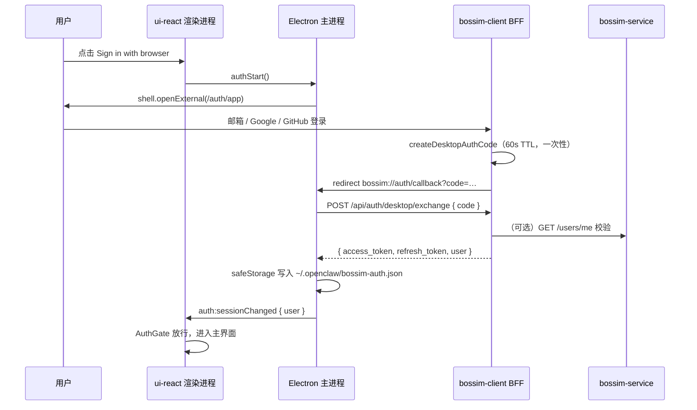

# Bossim 用户认证说明

本文档说明 Bossim 账号体系在 **官网（bossim-client）**、**后端（bossim-service）** 与 **桌面 App（openclaw ui-react + Electron）** 之间的完整认证链路，以及 openclaw 仓库内的实现与本地联调方法。

---

## 1. 概述

Bossim 支持三种登录方式，三种入口共用同一套用户账号：

| 方式 | 说明 |
| --- | --- |
| 邮箱验证码 | 免密码；输入邮箱 → 收验证码 → 验证通过即登录/注册 |
| Google OAuth | 跳转 Google 授权，回调后完成登录 |
| GitHub OAuth | 跳转 GitHub 授权，回调后完成登录 |

| 入口 | 令牌存放 | 浏览器/渲染进程能否读到 token |
| --- | --- | --- |
| **官网**（bossim-client） | httpOnly Cookie（`bossim_at` / `bossim_rt`） | 否，仅持有 `user` 对象 |
| **桌面 App**（openclaw Electron） | 主进程 `safeStorage`（`~/.openclaw/bossim-auth.json`） | 否，渲染进程仅通过 IPC 读 `user` |
| **后端**（bossim-service） | 签发 JWT + Redis 存 refresh token | — |

桌面 App **不改造 bossim-service**；桌面登录桥接由 **bossim-client BFF** 提供一次性 `desktop_code` 交换接口。

---

## 2. 整体架构



### 2.1 三层职责

**bossim-service（Go 后端）**

- 签发/校验 JWT Access Token（HS256，默认 15 分钟）
- Redis 管理 refresh token（轮换、吊销）、邮箱验证码、OAuth state
- PostgreSQL 持久化 `users`、`oauth_accounts`
- 提供 `/api/v1/auth/*`、`/api/v1/users/me`

**bossim-client（Next.js BFF）**

- 浏览器只访问同源 `/api/auth/*`，不直连 bossim-service
- 登录成功后写入 httpOnly Cookie；代理后端请求并自动续期
- **桌面专用**：`/auth/app` 入口页、`POST /api/auth/desktop/exchange` 一次性换码

**openclaw 桌面 App**

- 渲染进程：`AuthGate` 拦截未登录用户，展示 `AuthPage`
- 主进程：打开浏览器 auth 页、接收 `bossim://` 协议回调、换码、持久化 token
- 渲染进程**永远不接触** `access_token` / `refresh_token`

---

## 3. 官网认证（bossim-client）

### 3.1 设计原则

| 原则 | 含义 |
| --- | --- |
| 浏览器不直连后端 | 所有认证请求走 `/api/auth/*` |
| 令牌不进 JS | token 只写入 httpOnly Cookie |
| OAuth 换码在服务端 | `code` 由 BFF 转发给 bossim-service，不在浏览器持有 client_secret |

### 3.2 Cookie 会话

| Cookie | 内容 | 用途 |
| --- | --- | --- |
| `bossim_at` | Access Token | BFF 代理时注入 `Authorization: Bearer` |
| `bossim_rt` | Refresh Token | 续期、登出吊销 |
| `bossim_oauth_state` | OAuth state | CSRF 二次校验（约 10 分钟） |

### 3.3 OAuth 流程（前端承载 redirect_uri）

1. 浏览器调 `GET /api/auth/oauth/{provider}/url` → 获得授权链接
2. 跳转前写入 `sessionStorage.bossim_oauth_provider`
3. IdP 回调 `{APP_ORIGIN}/auth/callback?code&state`
4. 回调页 POST `code` + `state` 给 BFF → BFF 向后端换 token → Set-Cookie
5. **令牌不出现在 URL 或浏览器历史**

`redirect_uri` 三处必须一致：Google/GitHub 控制台、后端 `OAUTH_REDIRECT_URI`、生成授权 URL 时的参数。

### 3.4 BFF 接口（浏览器调用）

| 方法 | 路径 | 说明 |
| --- | --- | --- |
| `POST` | `/api/auth/email/code` | 发送邮箱验证码 |
| `POST` | `/api/auth/email/login` | 验证码登录/注册 + Set-Cookie |
| `GET` | `/api/auth/oauth/{provider}/url` | 获取 OAuth 授权 URL + Set-Cookie state |
| `POST` | `/api/auth/oauth/{provider}/callback` | OAuth 换码 + Set-Cookie |
| `GET` | `/api/auth/me` | 当前用户（含自动续期） |
| `POST` | `/api/auth/logout` | 登出 + 清除 Cookie |

所有浏览器请求需 `credentials: "include"`。

### 3.5 bossim-client 环境变量

| 变量 | 说明 |
| --- | --- |
| `BOSSIM_SERVICE_URL` | BFF 代理后端基址（仅服务端） |
| `APP_ORIGIN` | 前端公开地址，用于 OAuth 回调拼接 |
| `BOSSIM_DESKTOP_CALLBACK_SCHEME` | 桌面回调 scheme，默认 `bossim` |

---

## 4. 后端认证（bossim-service）

### 4.1 令牌模型

- **Access Token**：JWT HS256，`Authorization: Bearer` 传递，默认 TTL 15 分钟
- **Refresh Token**：64 字符 hex，Redis `refresh:{token}` → `user_id`，默认 TTL 720h
- **轮换**：每次 `POST /api/v1/auth/token/refresh` 消费旧 refresh token 并签发新 token 对
- **登出**：`POST /api/v1/auth/logout` 删除 Redis 中的 refresh token（已签发 access token 在过期前仍有效）

### 4.2 登录成功响应（统一信封）

```json
{
  "code": 0,
  "message": "ok",
  "data": {
    "access_token": "eyJ...",
    "refresh_token": "a1b2c3...",
    "expires_in": 900,
    "user": {
      "id": "uuid",
      "email": "user@example.com",
      "display_name": "",
      "avatar_url": ""
    }
  },
  "request_id": "..."
}
```

BFF 的 `normalizeTokens()` 兼容 `accessToken` / `refreshToken` 等字段别名。

### 4.3 后端 API

**无需 Bearer：**

| 方法 | 路径 | 说明 |
| --- | --- | --- |
| `POST` | `/api/v1/auth/email/code` | 发送验证码 |
| `POST` | `/api/v1/auth/email/login` | 验证码登录（自动注册） |
| `GET` | `/api/v1/auth/oauth/{provider}/url` | OAuth 授权链接 |
| `GET` | `/api/v1/auth/oauth/{provider}/callback` | 用 code + state 换 token（BFF 服务端调用） |
| `POST` | `/api/v1/auth/token/refresh` | 刷新 token |
| `POST` | `/api/v1/auth/logout` | 登出 |

**需 Bearer：**

| 方法 | 路径 | 说明 |
| --- | --- | --- |
| `GET` | `/api/v1/users/me` | 当前用户资料 |

### 4.4 后端关键配置

| 环境变量 | 说明 |
| --- | --- |
| `BOSSIM_JWT_ACCESS_SECRET` | JWT 签名密钥（必填） |
| `BOSSIM_OAUTH_REDIRECT_URI` | OAuth 回调，须指向前端 `{APP_ORIGIN}/auth/callback` |
| `BOSSIM_OAUTH_GOOGLE_*` / `BOSSIM_OAUTH_GITHUB_*` | OAuth 凭据 |
| SMTP 相关 | 邮箱验证码发信 |

---

## 5. 桌面 App 认证（openclaw）

### 5.1 完整流程



要点：

1. 用户在**系统浏览器**完成登录（复用 bossim-client 的 AuthDialog / OAuth 流程）
2. BFF 生成一次性 `desktop_code`，redirect 到 `bossim://auth/callback?code=...`
3. Electron 注册 `bossim://` 协议（`electron-builder.yml` + dev 时 `patch-electron-dev-plist.cjs`）
4. 主进程换码后持久化 token；渲染进程只收到 `user` 对象

### 5.2 bossim-client 桌面桥接（需在 bossim-client 仓库实现）

**GET `/auth/app`**

- 未登录：展示 AuthDialog；OAuth 跳转前设置 `sessionStorage.bossim_oauth_return = "desktop"`
- 已登录：生成 desktop_code 并 redirect `bossim://auth/callback?code=...`
- OAuth / 邮箱登录成功后，若 `bossim_oauth_return === "desktop"` 或当前在 `/auth/app`，同样走 desktop redirect

**POST `/api/auth/desktop/exchange`**

```json
// Request
{ "code": "64-char-hex" }

// Response 200
{
  "ok": true,
  "access_token": "...",
  "refresh_token": "...",
  "user": {
    "id": "uuid",
    "email": "user@example.com",
    "display_name": "",
    "avatar_url": ""
  }
}

// Response 400/401
{ "message": "invalid or expired code" }
```

**Desktop code 存储**

```
Key:   desktop_auth:{code}     （生产：Cloudflare KV；本地 dev 可用内存 fallback）
Value: { access_token, refresh_token, user_id }
TTL:   60 秒
规则:  换码成功后立即删除（consume-on-read）
```

### 5.3 Electron IPC（渲染进程 via preload）

| 方法 | 说明 |
| --- | --- |
| `authStart()` | 打开浏览器 auth 页（`BOSSIM_AUTH_APP_URL`） |
| `authPoll()` | 轮询 pending / ok+user / error / timeout |
| `authCancel()` | 取消进行中的 auth |
| `authGetSession()` | 读本地会话（仅返回 user + status） |
| `authLogout()` | 登出：吊销 refresh token + 清除本地存储 |
| `onAuthSessionChanged(cb)` | 协议回调或登出后推送 `{ user }` |

IPC channel：`auth:start`、`auth:poll`、`auth:cancel`、`auth:getSession`、`auth:logout`、`auth:sessionChanged`。

### 5.4 openclaw 代码结构

```
apps/electron/
├── src/main/bossim-auth.ts       # 换码、safeStorage、refresh、logout、协议回调
├── src/main/load-dev-env.ts      # 加载 apps/electron/.env
├── src/main/index.ts             # 注册 bossim:// 协议与 auth IPC
├── src/preload/index.ts          # 暴露 electronBridge auth 方法
├── electron-builder.yml          # bossim URL scheme
└── scripts/patch-electron-dev-plist.cjs  # dev 时 macOS 协议注册

ui-react/src/
├── main.tsx                      # installDevAuthMock()（仅浏览器 dev）
├── store/auth.store.ts           # Zustand 会话状态
├── hooks/auth/use-auth.ts        # useAuth / useBrowserAuth
├── lib/auth/bridge.ts            # getAuthBridge、isAuthAvailable
├── lib/auth/dev-auth-mock.ts     # 浏览器 dev 假 IPC（Electron 下自动跳过）
├── components/auth/AuthGate.tsx  # 未登录拦截 → AuthPage
├── pages/AuthPage.tsx            # Sign in with browser
├── pages/ProfilePage.tsx
└── components/settings/UserSettingsPopover.tsx  # 侧边栏用户菜单
```

### 5.5 渲染进程状态机

`AuthGate` 行为：

| `status` | 表现 |
| --- | --- |
| `idle` / `loading` | 全屏 spinner |
| `unauthenticated` | `AuthPage` |
| `authenticated` | 正常 App 内容 |

`refresh()` 仅在 `idle` / `unauthenticated` 时切换为 `loading`；已登录时后台静默刷新，避免白屏。

`isAuthAvailable()` 为 true 的条件：`VITE_SKIP_AUTH=1` 或存在 `electronBridge.authGetSession`（含 dev mock）。

---

## 6. 环境变量

### 6.1 Electron 主进程（`apps/electron/.env`）

| 变量 | 默认 | 说明 |
| --- | --- | --- |
| `BOSSIM_BFF_URL` | `https://aiverser.com` | BFF 基址，用于 `POST /api/auth/desktop/exchange` |
| `BOSSIM_AUTH_APP_URL` | `{BOSSIM_BFF_URL}/auth/app` | 浏览器打开的登录页 |
| `BOSSIM_SERVICE_URL` | Railway 生产地址 | token refresh / logout 直连后端 |

`pnpm electron:dev` 的 dev script 已通过 `cross-env` 注入本地默认值；`.env` 覆盖需**重启 Electron** 才生效。启动日志：

```
[load-dev-env] loaded N vars from ... | authApp=http://localhost:3000/auth/app
[bossim-auth] opening auth URL: http://localhost:3000/auth/app
```

### 6.2 ui-react 渲染进程

| 变量 | 说明 |
| --- | --- |
| `VITE_SKIP_AUTH=1` | 跳过 AuthGate（纯 UI 开发） |

`ui-react/src/data/config.ts` 中的 `authAppUrl` / `bffBaseUrl` 为渲染层静态默认值；**实际 auth 页 URL 由 Electron 主进程 env 决定**。

---

## 7. 本地开发与联调

### 7.1 桌面 App 端到端

```bash
# 终端 A — bossim-client
cd bossim-client && pnpm dev          # → http://localhost:3000

# 终端 B — openclaw gateway
pnpm gateway:watch

# 终端 C — openclaw Electron
pnpm electron:dev
```

`apps/electron/.env` 示例：

```bash
BOSSIM_BFF_URL=http://localhost:3000
BOSSIM_AUTH_APP_URL=http://localhost:3000/auth/app
```

验证步骤：

1. App 启动 → 未登录显示 `AuthPage`
2. 点击 **Sign in with browser** → 打开 `http://localhost:3000/auth/app`
3. 完成 Google / 邮箱登录 → 浏览器 redirect `bossim://auth/callback?code=...`
4. Electron 日志：`[bossim-auth] session established for <email>`
5. App 进入主界面；Sidebar 底部 Settings 弹出菜单显示邮箱、Profile、Logout

### 7.2 仅浏览器调 ui-react UI

```bash
cd ui-react && pnpm dev
```

`main.tsx` 中的 `installDevAuthMock()` 会在无 Electron bridge 时注入假 IPC（约 4 秒后自动 mock 登录）。**不影响** `pnpm electron:dev`。

### 7.3 生产环境

将 bossim-client 部署到 `aiverser.com`（含 `/auth/app` 与 `/api/auth/desktop/exchange`）后，删除本地 `.env` 中的 URL 覆盖即可恢复默认生产地址。

---

## 8. 安全设计

| 措施 | 官网 | 桌面 App |
| --- | --- | --- |
| Token 不进渲染层 JS | httpOnly Cookie | 主进程 safeStorage |
| 一次性 desktop code | — | 60s TTL，换码即删 |
| OAuth CSRF | state（Redis + Cookie 双重校验） | 复用 bossim-client OAuth 流程 |
| 登出吊销 | BFF 调后端 revoke + 清 Cookie | 主进程调后端 revoke + 删本地文件 |
| 协议回调 | — | 仅处理 `bossim://auth/callback` |

---

## 9. 常见问题

### Q1：打开 auth 页 404

Electron 默认打开 `https://aiverser.com/auth/app`。若 bossim-client 尚未部署该路由，会 404。本地开发需配置 `BOSSIM_AUTH_APP_URL=http://localhost:3000/auth/app` 并重启 Electron。

### Q2：OAuth 完成但 App 白屏

常见原因：登录成功后多个组件同时调用 `refresh()` 并把状态设为 `loading`。当前实现已在 `auth.store.ts` 中修复：已登录时不切 loading。确认 Electron 日志有 `session established`。

### Q3：protocol callback 收到但 exchange 失败

检查 bossim-client 的 `POST /api/auth/desktop/exchange` 返回是否包含 `access_token`、`refresh_token` 及带 `id` 字段的 `user`。主进程 `normalizeUser()` 要求 `user.id` 为非空字符串。

### Q4：Google OAuth redirect_uri_mismatch

确认 Google 控制台、bossim-service `OAUTH_REDIRECT_URI`、授权 URL 生成三处均为 `{APP_ORIGIN}/auth/callback`（本地：`http://localhost:3000/auth/callback`）。

### Q5：桌面 App 需要改 bossim-service 吗？

不需要。桌面登录完全通过 bossim-client BFF 的 desktop code 桥接；Electron 主进程仅在 refresh / logout 时直连 bossim-service API。

### Q7：生产包登录仍跳转 localhost:3000

**原因**：`apps/electron/.env` 里的 `BOSSIM_AUTH_APP_URL=http://localhost:3000/...` 被 electron-builder 打进 `app.asar`，主进程 `load-dev-env.ts` 在启动时读取并覆盖了生产默认 URL。

**修复**（已合入）：

1. `electron-builder.yml` 排除 `.env` 不进 asar
2. `load-dev-env.ts` 在 `app.isPackaged` 时跳过加载

改完后需重新 `make release` 并上传 R2。已安装的旧包必须更新到新版本。

---

## 10. 相关仓库

| 仓库 | 职责 |
| --- | --- |
| **openclaw**（本仓库） | ui-react AuthGate + Electron bossim-auth |
| **bossim-client** | 官网 BFF、Cookie 会话、`/auth/app`、desktop exchange |
| **bossim-service** | JWT 签发、用户数据、OAuth 与 IdP 通信 |

Swagger：`{BOSSIM_SERVICE_URL}/swagger/doc.json`

---

*文档版本：与 openclaw `feature-bossim-app-login` 分支实现同步。最后更新：2026-06-10。*
